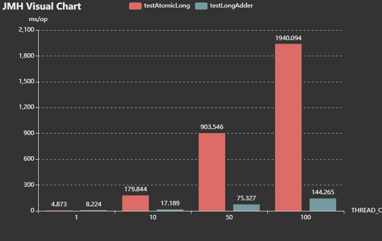
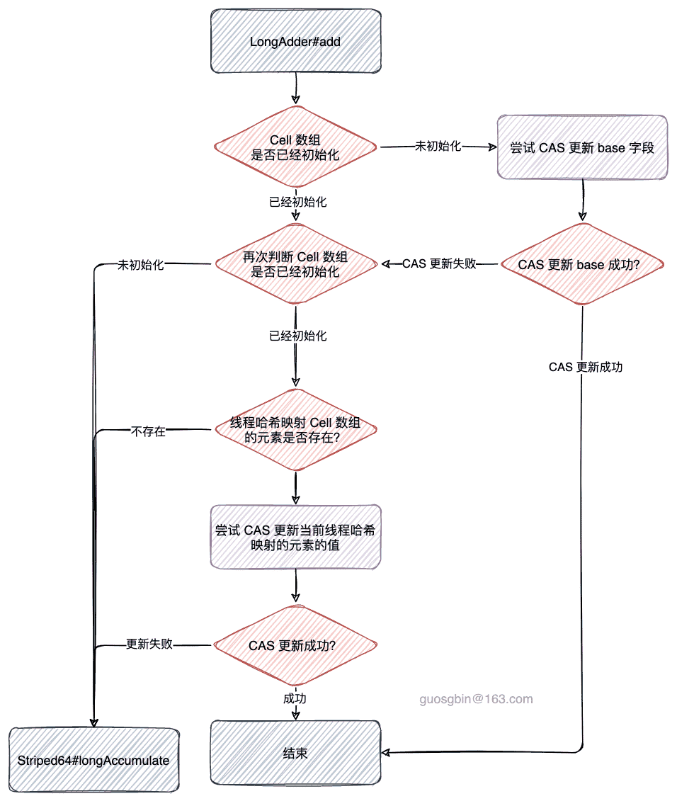
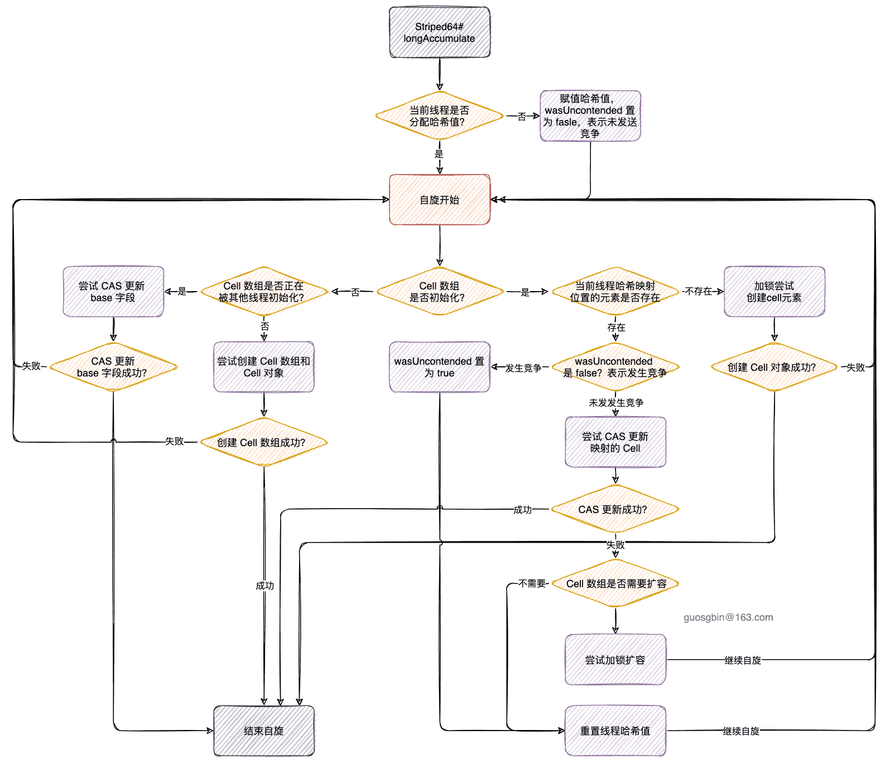

| 版本 | 内容       | 时间                   |
| ---- | ---------- | ---------------------- |
| V1   | 新建       | 2022年08月22日19:43:12 |
| V2   | 增加流程图 | 2022年08月23日00:21:15 |

## 简介

在 JUC 包内，有四个高性能的原子类，分别是：

1. LongAdder；
2. LongAccumulator；
3. DoubleAdder；
4. DoubleAccumulator；


在 AtomicLong 中假如多个线程同时对某个变量更新，此时 CAS 操作会出现竞争，就可能会导致自旋的时间变长。上面这四个高性能的原子类，使用了**分段锁**的思想，将不同的线程映射到不同的数据段上面去更新，减少线程竞争，提升性能。

上面四个类都继承自 Striped64 类，本篇文章以 LongAdder 为例分析，其他三种的实现方式是一样的。

## AtomicLong 和 LongAdder 的性能比较

```java
@Warmup(iterations = 5, time = 10, timeUnit = TimeUnit.MILLISECONDS)
@Measurement(iterations = 5, time = 10, timeUnit = TimeUnit.MILLISECONDS)
@State(value = Scope.Benchmark)
public class LongAdderTest {


    // 每个线程累加次数
    private static final int CIRCLE_COUNT = 100 * 10000;
    //
    @Param(value = {"1", "10", "50", "100"})
    private static int THREAD_COUNT;

    @Benchmark
    @BenchmarkMode(Mode.AverageTime)
    @OutputTimeUnit(TimeUnit.MILLISECONDS)
    public void testAtomicLong() throws InterruptedException {
        calculateAtomicLong(THREAD_COUNT, CIRCLE_COUNT);
    }

    @Benchmark
    @BenchmarkMode(Mode.AverageTime)
    @OutputTimeUnit(TimeUnit.MILLISECONDS)
    public void testLongAdder() throws InterruptedException {
        calculateLongAdder(THREAD_COUNT, CIRCLE_COUNT);
    }

    /**
     * @param threadCount 线程个数
     * @param circleCount 每个线程累加次数
     * @throws InterruptedException
     */
    private long calculateAtomicLong(int threadCount, int circleCount) throws InterruptedException {
        // AtomicLong原子类
        AtomicLong atomicLong = new AtomicLong(0);
        List<Thread> threadList = new ArrayList<>();
        for (int i = 0; i < threadCount; i++) {
            Thread thread = new Thread(() -> {
                for (int j = 0; j < circleCount; j++) {
                    atomicLong.incrementAndGet();
                }
            });
            thread.start();
            threadList.add(thread);
        }
        // 让主线程等待其他线程执行完
        for (Thread thread : threadList) {
            thread.join();
        }
        return atomicLong.get();
    }

    /**
     * @param threadCount 线程个数
     * @param circleCount 每个线程累加次数
     * @throws InterruptedException
     */
    private long calculateLongAdder(int threadCount, int circleCount) throws InterruptedException {
        LongAdder longAdder = new LongAdder();
        List<Thread> threadList = new ArrayList<>();
        for (int i = 0; i < threadCount; i++) {
            Thread thread = new Thread(() -> {
                for (int j = 0; j < circleCount; j++) {
                    longAdder.increment();
                }
            });
            thread.start();
            threadList.add(thread);
        }
        // 让主线程等待其他线程执行完
        for (Thread thread : threadList) {
            thread.join();
        }
        return longAdder.sum();
    }

    // 开启性能测试
    public static void main(String[] args) throws RunnerException {
        Options opt = new OptionsBuilder()
                .include(LongAdderTest.class.getSimpleName())
                .forks(1)
                .result("result.json")
                .resultFormat(ResultFormatType.JSON)
                .build();
        new Runner(opt).run();
    }
}
```


测试结果如下

```
Benchmark                    (THREAD_COUNT)  Mode  Cnt     Score     Error  Units
LongAdderTest.testAtomicLong              1  avgt    5     4.873 ±   0.058  ms/op
LongAdderTest.testAtomicLong             10  avgt    5   179.844 ±  47.720  ms/op
LongAdderTest.testAtomicLong             50  avgt    5   903.546 ± 295.724  ms/op
LongAdderTest.testAtomicLong            100  avgt    5  1940.094 ± 330.783  ms/op
LongAdderTest.testLongAdder               1  avgt    5     8.224 ±   0.042  ms/op
LongAdderTest.testLongAdder              10  avgt    5    17.189 ±   3.463  ms/op
LongAdderTest.testLongAdder              50  avgt    5    75.327 ±   6.061  ms/op
LongAdderTest.testLongAdder             100  avgt    5   144.265 ±   8.867  ms/op
```




可以看到在单个线程的时候，AtomicLong 的性能是比 LongAdder 要好的，因为 LongAdder 的设计原因使其在单线程的情况下耗时较长。但是在多线程的情况下，LongAdder 的性能是要远远好于 AtomicLong 的，这是“以空间换时间”的。

其他更详细的测试可以去看下面这篇文章：

>  <a href='http://blog.palominolabs.com/2014/02/10/java-8-performance-improvements-longadder-vs-atomiclong/'>AtomicLong和LongAdder的性能测试</a>


## LongAdder 基本思想

AtomicLong 里有个 value 变量保存实际的 long 值，所有的线程的读写操作都是针对这个变量进行的，可能会发生大量的竞争操作；

**LongAdder 使用分段锁的思想，在线程没有发生竞争的时候针对 base 字段进行累加。在线程发生竞争时，将这些线程按照哈希路由寻址的路由到 cell 数组的某个索引处，每个线程针对对应的 cell 数组的元素进行 CAS 操作，这样就将一个热点分散成了多个热点，发生竞争的概率就会小很多。**

假如要获取 LongAdder 中的值，计算规则就是

```
base + cells数组每个位置的元素的和
```

## Striped64

在分析 LongAdder 的代码之前，先要属性父类 Striped64 的字段和一些方法。

Striped64 是一个抽象类，用来实现累加功能。

### 属性

首先看 Striped64 的一些属性：

```java
/** Number of CPUS, to place bound on table size */
static final int NCPU = Runtime.getRuntime().availableProcessors();

/**
 * Table of cells. When non-null, size is a power of 2.
 */
transient volatile Cell[] cells;

/**
 * Base value, used mainly when there is no contention, but also as
 * a fallback during table initialization races. Updated via CAS.
 */
transient volatile long base;

/**
 * Spinlock (locked via CAS) used when resizing and/or creating Cells.
 */
transient volatile int cellsBusy;
```


- NCPU：用来决定 Cell 数组的最大长度；
- cells：Cell 数组，在有线程竞争的时候，将线程哈希路由到对应的位置的元素进行 CAS；
- base：base值，主要在没有发生竞争时进行 CAS 累加；
- cellsBusy：锁，**在数组初始化，扩容和创建 cell 时使用**；
  - 1-有锁状态；
  -  0-无锁状态；


除开上面这几个字段，通过 sun.misc.Unsafe 获取了 base 和 cells 字段的内存地址偏移量，用于后面的 CAS 操作。

PROBE 可以看成线程的哈希值，用于发送竞争时的哈希路由寻址。

```java
// Unsafe mechanics
private static final sun.misc.Unsafe UNSAFE;
// base 字段在 Striped64 中的地址偏移量
private static final long BASE;
// cellsBusy 字段在 Striped64 中的地址偏移量
private static final long CELLSBUSY;
// threadLocalRandomProbe 字段在 Thread 中的地址偏移量
// threadLocalRandomProbe 可以看成线程的哈希值
private static final long PROBE;
static {
    try {
        UNSAFE = sun.misc.Unsafe.getUnsafe();
        Class<?> sk = Striped64.class;
        BASE = UNSAFE.objectFieldOffset
            (sk.getDeclaredField("base"));
        CELLSBUSY = UNSAFE.objectFieldOffset
            (sk.getDeclaredField("cellsBusy"));
        Class<?> tk = Thread.class;
        PROBE = UNSAFE.objectFieldOffset
            (tk.getDeclaredField("threadLocalRandomProbe"));
    } catch (Exception e) {
        throw new Error(e);
    }
}
```

### Cell 内部类

Cells 数组中的每个 long 值用 Cell 对象来封装：

```java
@sun.misc.Contended static final class Cell {
    volatile long value;
    Cell(long x) { value = x; }
    final boolean cas(long cmp, long val) {
        return UNSAFE.compareAndSwapLong(this, valueOffset, cmp, val);
    }

    // Unsafe mechanics
    private static final sun.misc.Unsafe UNSAFE;
    private static final long valueOffset;
    static {
        try {
            UNSAFE = sun.misc.Unsafe.getUnsafe();
            Class<?> ak = Cell.class;
            // 获取 value 字段在 Cell 对象中的地址偏移量
            valueOffset = UNSAFE.objectFieldOffset
                (ak.getDeclaredField("value"));
        } catch (Exception e) {
            throw new Error(e);
        }
    }
}
```

其中 @sun.misc.Contended 这个注解表示对象或其字段可能会遇到内存争用，用来**防止内存伪共享**。

>  关于伪共享可以看下这几篇
>
> https://www.jianshu.com/p/c3c108c3dcfd
>
> https://houbb.github.io/2020/10/17/lock-13-hack-share
>
> https://zhuanlan.zhihu.com/p/163061730
>
> https://stackoverflow.com/questions/34529036/what-is-sun-misc-contended-annotations-value


## LongAdder 源码分析

既然是累加器，那主要分析的方法就是增加和获取累加值，主要是增加的方法 add

### LongAdder#add

```java
public void add(long x) {
    Cell[] as;  // Cell 数组
    long b, v;  // b: base 字段，v: 待更新值的期望值
    int m;      // m: Cells 数组长度 - 1，-减 1 是为了配置数组长度做 求余操作
    Cell a;     // 线程对应 probe 值对应在 Cells 数组位置的 Cell 元素
    if ((as = cells) != null || !casBase(b = base, b + x)) {
        boolean uncontended = true;
        if (as == null || (m = as.length - 1) < 0
            || (a = as[getProbe() & m]) == null 
            || !(uncontended = a.cas(v = a.value, v + x)))
            longAccumulate(x, null, uncontended);
    }
}
```

最终调用的是父类 Striped64#longAccumulate 的方法，现在先分析 LongAdder#add 方法的实现。

在 LongAdder 初始化时，Cell 数组是 null，假如 add 方法从未出现过竞争，那么 cell 就一直是 null，此时就会尝试 CAS 操作 base 字段。

OK，那么什么时候会进入外面的 if 块内呢？有两种情况

1. cells 数组已经初始化了（说明已经发生过竞争了）；
2. cells 数组未初始化，且 CAS 操作 base 字段失败，（说明此时是第一次发生竞争）；


把 LongAdder#add 的 if 块内的部分单独贴出来：

```java
// 是否发生竞争
boolean uncontended = true;
if (as == null || (m = as.length - 1) < 0
    || (a = as[getProbe() & m]) == null 
    || !(uncontended = a.cas(v = a.value, v + x)))
    longAccumulate(x, null, uncontended);
```

从上面的代码中分析进入 Striped64#longAccumulate 方法的条件是：

1. Cell 数组未初始化，则需要调用 Striped64#longAccumulate  方法去初始化 Cell 数组；
2. Cell 数组已经初始化了，且当前线程哈希寻址映射到 Cell 数组中的元素未初始化，则需要调用 Striped64#longAccumulate  方法去初始化该 Cell 元素；
3. Cell 数组已经初始化了，且当前线程哈希寻址映射到 Cell 数组中的元素已经初始化，且 CAS 操作该元素失败则需要调用 Striped64#longAccumulate  方法去处理；


OK，那么核心就需要分析 Striped64#longAccumulate 方法了。

### Striped64#longAccumulate

#### 整体分析

我们要知道调用 Striped64#longAccumulate 方法的前提是，一定发生过线程竞争。

首先分析下该方法声明：

```java
final void longAccumulate(long x, LongBinaryOperator fn,
                              boolean wasUncontended) ;
```

long x：表示此次要累加的值；

LongBinaryOperator fn：是一个函数式接口，在 LongAdder 中传的是 null；

boolean wasUncontended：表示 CAS 更新 Cell 数组上的元素是否失败，假如失败了，说明更新该元素时发生了线程竞争。true 表示未发生竞争；


下面看下 Striped64#longAccumulate 的整体代码，后面会分不同的情况分析。

```java
final void longAccumulate(long x, LongBinaryOperator fn,
                              boolean wasUncontended) {
        int h;
        if ((h = getProbe()) == 0) {
            ThreadLocalRandom.current(); // force initialization
            h = getProbe();
            wasUncontended = true;
        }

        boolean collide = false;                // True if last slot nonempty
        for (;;) {
            Cell[] as; Cell a; int n; long v;
            if ((as = cells) != null && (n = as.length) > 0) {
                // CASE(1.1) 加锁创建 Cell
                if ((a = as[(n - 1) & h]) == null) {
                    if (cellsBusy == 0) {       // Try to attach new Cell
                        Cell r = new Cell(x);   // Optimistically create
                        if (cellsBusy == 0 && casCellsBusy()) {
                            boolean created = false;
                            try {               // Recheck under lock
                                Cell[] rs; int m, j;
                                if ((rs = cells) != null && (m = rs.length) > 0 && rs[j = (m - 1) & h] == null) {
                                    rs[j] = r;
                                    created = true;
                                }
                            } finally {
                                cellsBusy = 0;
                            }
                            if (created)
                                break;
                            continue;           // Slot is now non-empty
                        }
                    }
                    collide = false;
                }
                // CASE(1.2) 发生竞争，需要重置线程哈希值
                else if (!wasUncontended)       // CAS already known to fail
                    wasUncontended = true;      // Continue after rehash
                // CASE(1.3) 尝试 CAS 新映射的元素
                else if (a.cas(v = a.value, ((fn == null) ? v + x : fn.applyAsLong(v, x))))
                    // 更新成功直接退出
                    break;
                // CASE(1.4) 上面 1.3 CAS 元素失败后，判断是否需要扩容
                else if (n >= NCPU || cells != as)
                    collide = false;            // At max size or stale
                // CASE(1.5) 说明当前线程具备扩容条件，下次循环扩容
                else if (!collide)
                    collide = true;
                // CASE(1.6) 尝试扩容
                else if (cellsBusy == 0 && casCellsBusy()) {
                    try {
                        if (cells == as) {      // Expand table unless stale
                            Cell[] rs = new Cell[n << 1];
                            for (int i = 0; i < n; ++i)
                                rs[i] = as[i];
                            cells = rs;
                        }
                    } finally {
                        cellsBusy = 0;
                    }
                    collide = false;
                    continue;                   // Retry with expanded table
                }
                h = advanceProbe(h);
            }

            else if (cellsBusy == 0 && cells == as && casCellsBusy()) {
                boolean init = false;
                try {                           // Initialize table
                    if (cells == as) {
                        Cell[] rs = new Cell[2];
                        rs[h & 1] = new Cell(x);
                        cells = rs;
                        init = true;
                    }
                } finally {
                    cellsBusy = 0;
                }
                if (init)
                    break;
            }
            else if (casBase(v = base, ((fn == null) ? v + x : fn.applyAsLong(v, x)))) 
                break;                          // Fall back on using base
        }
```


- 第一步：
  - 判断当前线程的哈希值是否为 0，哈希值为 0 则说明还没有给当前线程分配哈希值，需要分配一个哈希值；
  - 需要将 wasUncontened 变量置为 true，此处修改表示未发生真正意义上的竞争。（后面分析为什么）
- 第二步，进行自旋操作
  - CASE 1：Cell 数组已经初始化了；
  - CASE 2：Cell 数组未初始化，且 cells 引用未被其他线程修改过，且锁是空闲状态，尝试获取锁成功；
  - CASE 3：走到这个 CASE 的前提条件是：（1）Cell 数组未初始化；（2）锁不是空闲状态，或者 cells 引用被其他线程修改过，或者尝试获取锁失败；

```java
final void longAccumulate(long x, LongBinaryOperator fn,
                          boolean wasUncontended) {
    int h;
    if ((h = getProbe()) == 0) {
        ThreadLocalRandom.current(); // force initialization
        h = getProbe();
        wasUncontended = true;
    }

    boolean collide = false;                // True if last slot nonempty
    for (;;) {
        Cell[] as; Cell a; int n; long v;
        // CASE <<1>>
        if ((as = cells) != null && (n = as.length) > 0) {
            // 省略...
        }
		// CASE <<2>>
        else if (cellsBusy == 0 && cells == as && casCellsBusy()) {
            // 省略...
        }
        // CASE <<2>>
        else if (casBase(v = base, ((fn == null) ? v + x : fn.applyAsLong(v, x))))
            break;                          // Fall back on using base
    }
}
```


现在分析下为什么在第一步的时候将 wasUncontened 变量置为 true？

为了理解这个，还需要看 LongAdder#add 方法，关注`(a = as[getProbe() & m]) == null`条件，当 Cell 数组已经存在时，当线程还未分配哈希值的时候，他们的哈希值都是 0，所以这些未分配哈希值的线程就映射到了 Cell 数组的第一个位置，在针对 Cell 元素进行 CAS 操作的时候就可能发生竞争，但是这个竞争是因为线程还未分配哈希值导致的，所以 Doug Lea 认为这种情况不是真正意义上的竞争。


后面分别分析这三个分支，我们分析的顺序是 2 3 1；

原因是：

1. Cell 数组未初始化进入 CASE2；
2. Cell 数组正在被其他线程初始化，当前线程未拿到锁，进入 CASE3；
3. Cell 数组已经初始话好了，进入 CASE1；

#### CASE 2

分析 Striped64#longAccumulate 的 CASE 2 的情况

```java
else if (cellsBusy == 0 && cells == as && casCellsBusy()) {
    // cell 数组是否初始化成功标记
    boolean init = false;
    try {                           // Initialize table
        // 双重检查
        if (cells == as) {
            // 创建长度为 2 的数组，并给哈希寻址的位置初始化为 x
            Cell[] rs = new Cell[2];
            rs[h & 1] = new Cell(x);
            cells = rs;
            init = true;
        }
    } finally {
        // 释释放锁
        cellsBusy = 0;
    }
    // 初始化成功，则退出循环
    // 初始化失败，说明有其他线程正在初始化，或者已经初始化，继续自旋
    if (init)
        break;
}
```

进入该分支的前置条件是 Cell 数组未初始化，这个分支主要是来初始化 Cell 数组的。


条件是：锁是空闲的，且 cell 数组引用未发生变化，且尝试获取锁成功；

```java
else if (cellsBusy == 0 && cells == as && casCellsBusy()) {
	// ...
}
```

这个 else if 里的就比较简单了，就是创建一个 Cell 数组，创建一个 Cell 对象存到线程哈希映射的位置上。


#### CASE 3

走到这个 CASE 的前提条件是：（1）Cell 数组未初始化；（2）锁不是空闲状态，或者 cells 引用被其他线程修改过，或者尝试获取锁失败，说明其他线程正在初始化 Cell 数组。

```java
else if (casBase(v = base, ((fn == null) ? v + x : fn.applyAsLong(v, x))))
    // cas 更新 base 成功则退出自旋
    break;      
```

这个分支最简单了，既然是 cell 数组未初始化（也许其他线程已经初始化了），那就直接尝试更新 base 字段了，更新成功直接退出循环，更新失败继续循环处理。

#### CASE 1

这个分支想当复杂，慢慢看，首先看 if 条件，进入该分支的条件是 Cell 数组已经初始化。

CASE1 这个分支里又有 6 个小分支，我们慢慢看

```java
// CASE(1.1) 加锁创建 Cell
if ((a = as[(n - 1) & h]) == null) {
    if (cellsBusy == 0) {       // Try to attach new Cell
        Cell r = new Cell(x);   // Optimistically create
        if (cellsBusy == 0 && casCellsBusy()) { // 尝试获取锁
            // 获取锁成功
            boolean created = false;
            try {               // Recheck under lock
                /*
                     * rs: cell 数组
                     * m: cell 数组的长度
                     * j: 路由寻址的 cell
                     */
                Cell[] rs; int m, j;
                // 双重检查
                if ((rs = cells) != null && (m = rs.length) > 0 && rs[j = (m - 1) & h] == null) {
                    rs[j] = r; // 赋值
                    created = true;
                }
            } finally {
                // 释放锁
                cellsBusy = 0;
            }
            // 创建 cell 成功，则退出自旋
            if (created)
                break;
            continue;           // Slot is now non-empty
        }
    }
    // 走到这里说明 锁被其他线程使用了
    // 扩容意向设置为 false，不扩容，因为线程路由寻址的位置的元素是 null，不需要扩容
    collide = false;
}
// CASE(1.2) 发生竞争，需要重置线程哈希值
else if (!wasUncontended)       // CAS already known to fail
    wasUncontended = true;      // Continue after rehash
// 只有在经过上面两个 if 的情况后重置线程哈希值之后才会到这里
// 重置线程哈希值后，对新的哈希值路由寻址的 cell 进行 cas 操作
// CASE(1.3) 尝试 CAS 新映射的元素
else if (a.cas(v = a.value, ((fn == null) ? v + x : fn.applyAsLong(v, x))))
    // 更新成功直接退出
    break;
// CASE(1.4) 上面 1.3 CAS 元素失败后，判断是否需要扩容
else if (n >= NCPU || cells != as)
    collide = false;            // At max size or stale
// CASE(1.5) 说明当前线程具备扩容条件，下次循环扩容
else if (!collide)
    collide = true;
// CASE(1.6) 尝试扩容
else if (cellsBusy == 0 && casCellsBusy()) {
    // 拿锁，扩容
    try {
        if (cells == as) {      // Expand table unless stale
            Cell[] rs = new Cell[n << 1];
            for (int i = 0; i < n; ++i)
                rs[i] = as[i];
            cells = rs;
        }
    } finally {
        // 释放锁
        cellsBusy = 0;
    }
    collide = false;
    continue;                   // Retry with expanded table
}
h = advanceProbe(h);
}
```


（1）线程哈希映射的位置是 null

```java
if ((a = as[(n - 1) & h]) == null) {
    // ...
}
```

既然线程映射的位置的元素是 null，说明需要新建一个 Cell 对象并放到该位置，需要注意的是在创建 Cell 对象的时候也是要加锁的，保证同时只有一个线程初始化槽。


（2）如果线程哈希映射的位置已经初始化，而且对其 CAS 修改失败，发生竞争；

```java
else if (!wasUncontended)       // CAS already known to fail
    wasUncontended = true;      // Continue after rehash
```

wasUncontended 是 Striped64#longAccumulate 方法的入参的一个，在 LongAdder#add 方法中传入的情况是

1. 当数组还未初始化时传 true；
2. 当数组已经初始化，线程哈希映射的位置元素未初始化，此时传 true；
3. 当数组已经初始化，线程哈希映射的位置元素已经初始化，当 CAS 更新该元素成功失败，说明发送竞争了，传 false；


在 Striped64#longAccumulate 中，

1. wasUncontended 是 false，表示线程的哈希值已经用于过 CAS 更新槽且更新失败，需要通过Striped64#advanceProbe 方法重新生成线程哈希值。否则，wasUncontended 为true，说明线程的哈希值已是一个新的哈希值。
2. wasUncontended 为 true 表示线程的哈希值已经重新计算或者线程的哈希值还未用于 CAS 更新对应槽。


（3）只有在经过情况（2）重置线程的哈希值后，才会到这里

重置线程哈希值后，新的哈希映射到新的位置的元素进行 CAS 操作。

假如 CAS 操作成功，直接退出，否则线程继续允许后面的 else if；

```java
else if (a.cas(v = a.value, ((fn == null) ? v + x : fn.applyAsLong(v, x))))
    // 更新成功直接退出
    break;
```


（4）如果当前 Cell 数组的长度已经达到了最大值（大于等于 CPU 的核心数），则不能扩容；或者假如其他线程抢先一步扩容了，那也不扩容了。当前线程将collide设置为false，后续调 Striped64#advanceProbe 重置哈希值，自旋重试。

假如不满足这两个条件，则说明可以继续扩容操作，继续后面的 else if；

```java
else if (n >= NCPU || cells != as)
    collide = false;            // At max size or stale
```


（5）运行到这里，说明当前线程具备扩容条件，下次自旋开始尝试扩容。collide 设置为 true，并重新计算线程哈希值，在执行真正扩容操作前，会再尝试一次 CAS 更新，CAS 更新失败，才会真正进入情况（6）执行扩容迁移。

```java
else if (!collide)
    collide = true;
```


（6）进行扩容操作

1. 首先在锁空闲的时候，尝试获取锁，保证同时只有一个线程执行扩容操作；
2. 加锁成功后，将数组的长度扩容为原来的 2 倍；
3. 扩容完后，释放锁；
4. 将扩容意向 collide 设置为 false；

```java
else if (cellsBusy == 0 && casCellsBusy()) {
    // 拿锁，扩容
    try {
        if (cells == as) {      // Expand table unless stale
            Cell[] rs = new Cell[n << 1];
            for (int i = 0; i < n; ++i)
                rs[i] = as[i];
            cells = rs;
        }
    } finally {
        // 释放锁
        cellsBusy = 0;
    }
    collide = false;
    continue;                   // Retry with expanded table
}
```


### LongAdder#sum

上面分析了 add 方法，现在分析 sum 方法，这个方法就很简单了

就是

```
sum = base 的值 + 所有 Cell 元素的值
```


```java
public long sum() {
    Cell[] as = cells; Cell a;
    long sum = base;
    if (as != null) {
        for (int i = 0; i < as.length; ++i) {
            if ((a = as[i]) != null)
                sum += a.value;
        }
    }
    return sum;
}
```


需要注意的是这个 sum 返回的可能不是准确值，因为在我们调用这个 sum 方法的时，可能 add 方法中还有线程在竞争自旋中。


### LongAdder#add 流程图



### Striped64#longAccumulate 流程图



## 小结

LongAdder 使用分段锁的思想，在线程没有发生竞争的时候针对 base 字段进行累加。在线程发生竞争时，将这些线程按照哈希路由寻址的路由到 cell 数组的某个索引处，每个线程针对对应的 cell 数组的元素进行 CAS 操作，这样就将一个热点分散成了多个热点，发生竞争的概率就会小很多。

在多线程的情况下，LongAdder 的性能是要远远好于 AtomicLong 的，这是“以空间换时间”的。

LongAdder 的 sum 方法返回的并不是一个准确的值，这也是 LongAdder 不能替代 AtomicLong 的一个原因。