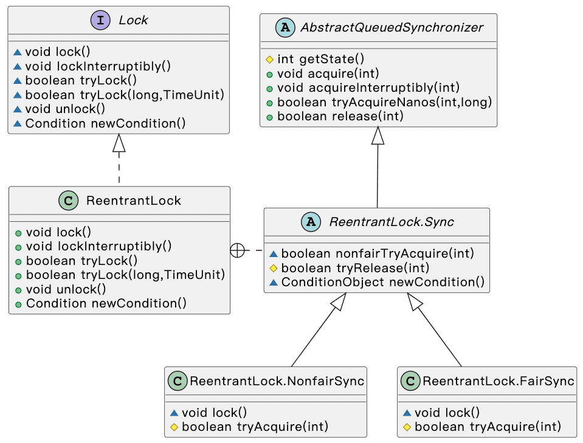
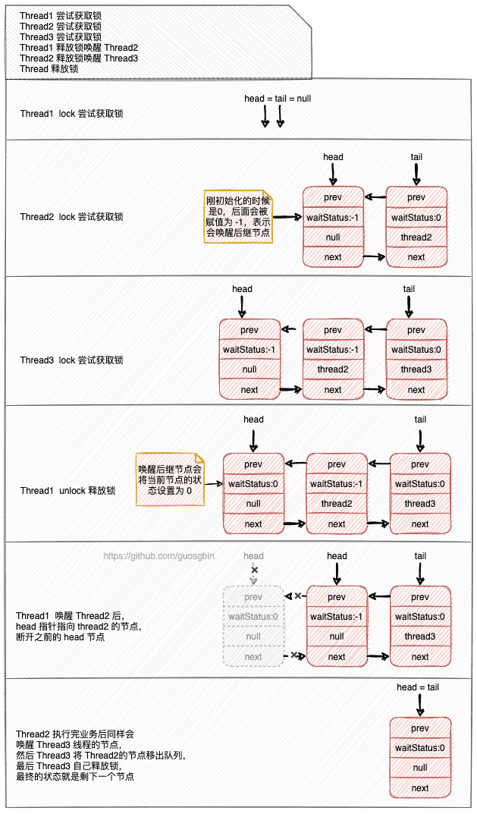
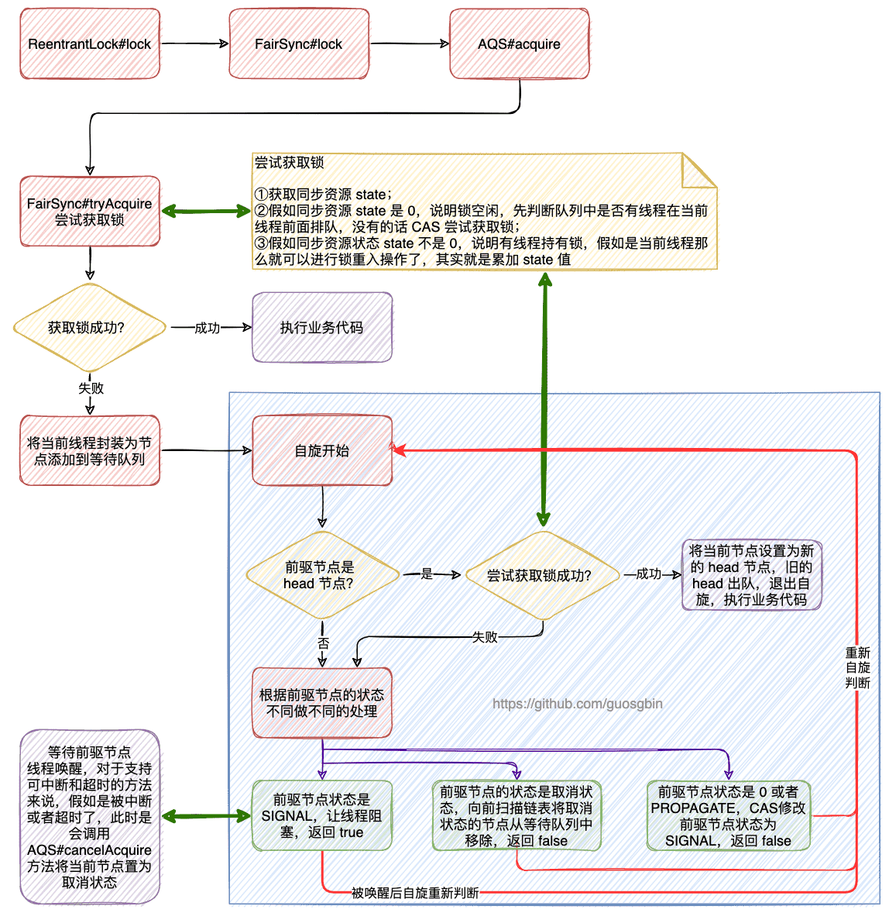
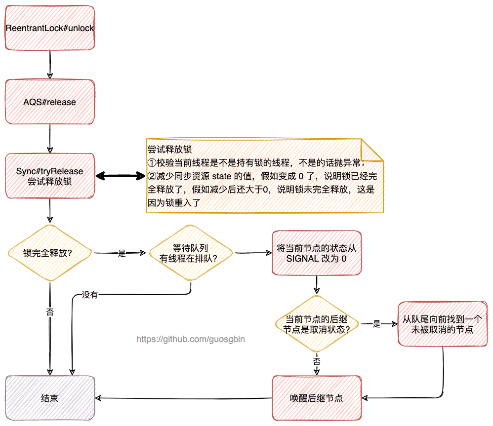

| 版本 | 内容                       | 时间                   |
| ---- | -------------------------- | ---------------------- |
| V1   | 新建                       | 2022年09月12日21:02:07 |
| V2   | 增加获取锁和释放锁的流程图 | 2022年09月13日13:24:29 |

## 概述

本篇会基于以下顺序分析 ReentrantLock 是如何通过 AQS 独占模式实现的。

1. 简单对比 Synchronized 同步锁和 ReentrantLock，以及 ReentrantLock 的使用模板；
1. ReentrantLock 的继承关系；
1. AQS 的等待队列介绍；
1. 通过例子介绍 ReentrantLock 公平锁的原理；
1. ReentrantLock 非公平锁的原理；
1. ReentrantLock 支持中断的原理；


## Synchronized 和 ReentrantLock

提出一个问题，既然有 Synchronized 同步锁，为什么还有 ReentrantLock 出现呢？


首先分析下，Synchronized 有如下的问题，

（1）**Synchronized 无法灵活的控制锁的释放；**

Synchronized 是一个排他锁，在某一时刻只允许一个线程持有锁，当当前持有锁的线程释放锁后，其他线程才有机会去争取锁。Synchronized 在下面几个时刻会释放锁：

1. 线程执行完同步代码块/方法时，线程自动释放锁；
2. 线程执行同步代码块/方法时发生异常了，线程会退出代码块/方法，并自动释放锁；
3. 线程在同步代码块/方法里调用了 wait 方法，线程会释放锁；

假如持有锁的线程被无限阻塞了，那么其他尝试获取锁的线程也会一直阻塞，且没有什么方法可以持有锁的线程释放锁。

（2）**Synchronized 在读多写少的场景下性能很低；**

假如某个场景下，多个线程在对一个资源操作时，是读多写少的情况。读操作并不会修改资源，这个时候加锁就会十分影响性能了。


JUC 中的 ReentrantLock 解决了 Synchronized 的痛点 1，ReentrantReadWriteLock 解决了痛点 2。

**ReentrantLock 提供了可中断和限时的加锁方式，比 Synchronized 更加灵活。**

**除此之外，ReentrantLock 可以通过构造函数设置公平锁和非公平锁，而 Synchronized 是一个非公平锁。**


## ReentrantLock 继承关系和使用模板



一般用一个内部来继承 AbstractQueuedSynchronizer 类，并按需实现 AQS 的抽象方法。

在 ReentrantLock 中就是用于一个内部类 ReentrantLock.Sync 继承了 AbstractQueuedSynchronizer 类。

我们可以通过构造方法设置当前 ReentrantLock 是公平锁还是非公平锁。

- 公平锁：多个线程按照申请锁的顺序来获取锁，通俗说就是先来后到；
- 非公平锁：多个线程并不是按照申请锁的顺序来获取锁；

AQS 中维护了一个队列，调用 ReentrantLock 中的方法申请锁时，没得到锁的线程会依次加入这个队列，公平锁就是按照加入这个队列的先后来实现的，后面会详细说。

使用非公平锁的有点就是吞吐量大，但是会出现线程饥饿的现象。


使用模板：

```java
class X {
    private final ReentrantLock lock = new ReentrantLock();
    // ...
    public void m() {
        lock.lock();  // block until condition holds
        try {
            // ... method body
        } finally {
            lock.unlock()
        }
    }
}}
```

## AQS 的等待队列介绍

首先看下 AQS 等待队列中节点的定义

```java
static final class Node {
    /** Marker to indicate a node is waiting in shared mode */
    static final Node SHARED = new Node();
    /** Marker to indicate a node is waiting in exclusive mode */
    static final Node EXCLUSIVE = null;
    static final int CANCELLED =  1;
    static final int SIGNAL    = -1;
    static final int CONDITION = -2;
    static final int PROPAGATE = -3;
    // 当前节点的状态
    volatile int waitStatus;
    // 前驱
    volatile Node prev;
    // 后驱
    volatile Node next;
    // 结点包装的线程
    volatile Thread thread;
    // Condition队列使用，存储condition队列中的后继节点 单向链表
    Node nextWaiter;
    
    // ... 省略
}
```

AQS 的等待队列是一个 **FIFO** 队列，等待队列是“CLH”（Craig、Landin 和 Hagersten）队列的变体。

下面分析下 Node 节点各个属性的含义：

-  SHARED 表示当前线程是获取共享资源的时候被阻塞挂起后加入到等待队列的；
- EXCLUSIVE 表示当前线程是获取独占资源的时候被阻塞挂起后加入到等待队列的；
- waitStatus 表示当前节点的状态，状态值取值如下：
  - CANCELLED 表示当前线程等待超时或者被中断，被取消排队了，取消争抢锁；
  - SIGNAL 表示当前线程可以唤醒它的 next 节点；
  - CONDITION 表示线程在条件队列里等待（Condition 接口的功能，后面分析）；
  - PROPAGATE 在一个节点成为头节点之前，是不会跃迁为 PROPAGATE 状态的。用于将唤醒后继线程传递下去，这个状态的引入是为了完善和增强共享锁的唤醒机制；
  - 0；
- 等待队列是一个双向链表，内部有指向前驱的 prev 和指向后驱的 next；
- Node 对象内封装的 thread 就是等待的线程；
- nextWaiter 也是条件队列使用的，条件队列是一个单向链表，nextWaiter 作为指针指向下一个节点；

## ReentrantLock 公平锁的原理

我们以一个案例作为切入点来讲解 ReentrantLock 获取公平锁的流程；

案例如下：

1. Thread1调用 lock 方法抢锁；
2. Thread2调用 lock 方法抢锁；
3. Thread3调用 lock 方法抢锁；
4. Thread1调用 unlock 方法释放锁；
5. Thread2调用 unlock 方法释放锁；
6. Thread3调用 unlock 方法释放锁；


对于 ReentrantLock 来说，AQS 的 state 字段的含义是：

- **等于 0 表示当前锁是空闲状态；**
- **等于 1 表示当前锁被某个线程占用了；**
- **大于 1 表示当前锁重入了，具体的值表示锁重入的次数；**


### Thread1 尝试获取锁

首先 Thread1 调用 ReentrantLock#lock 方法尝试获取锁。

```java
public void lock() {
    sync.lock();
}
```

可以看到就是直接调的继承了 AbstractQueuedSynchronizer 的内部类 Sync 的 lock 方法。

既然是分析获取公平锁的流程，所以我们看 ReentrantLock.FairSync 的 lock 方法。

```java
final void lock() {
    acquire(1);
}
```

OK 直接调的 AbstractQueuedSynchronizer#acquire 方法

```java
// 独占地获取资源，忽略中断
public final void acquire(int arg) {
    // tryAcquire 方法尝试获取资源，获取成功返回 true
    // 获取资源失败返回 false，则需要将当前线程包装成节点加入等待队列
    if (!tryAcquire(arg) &&
        acquireQueued(addWaiter(Node.EXCLUSIVE), arg))
        selfInterrupt();
}
```

首先会调用 tryAcquire 方法，这个方法是需要 AQS 的子类实现的，所以我们看下 ReentrantLock.FairSync#tryAcquire 方法：

```java
// 尝试获取锁
protected final boolean tryAcquire(int acquires) {
    final Thread current = Thread.currentThread();
    // 获取同步状态
    int c = getState();
    // c == 0 表示锁未被占用
    if (c == 0) {
        // !hasQueuedPredecessors() 为 true 表示没有线程在等待拿锁
        // 尝试 CAS 修改同步状态
        if (!hasQueuedPredecessors() &&
                compareAndSetState(0, acquires)) {
            // 设置独占的线程
            setExclusiveOwnerThread(current);
            return true;
        }
    }
    // 走到这里说明锁不是空闲的，需要校验当前线程是不是锁的持有者
    else if (current == getExclusiveOwnerThread()) {
        // 可重入锁，增加计数
        // 这里不用 CAS 是因为，就是在当前获取到锁的线程操作的，其他线程进不来
        int nextc = c + acquires;
        if (nextc < 0)
            // int 溢出
            throw new Error("Maximum lock count exceeded");
        setState(nextc);
        return true;
    }
    return false;
}
```

实现公平锁的关键就在上面的 hasQueuedPredecessors() 方法的判断中，这个其实就是判断当前线程的前面有没有线程在等待队列中等待：

- 如果当前线程之前有一个排队线程，则为 true；
- 如果当前线程位于队列的头部或队列为空，则为 false；


锁重入就是判断当前持锁的线程是不是当前尝试获取锁的线程，如果是就表示需要进行锁重入操作，其实就是将 AQS 的资源 state 加 1。


Thread1 线程是第一个尝试获取锁的线程，所以肯定会拿到锁的，我们回到 AbstractQueuedSynchronizer#acquire 方法，此时 tryAcquire 因为拿到锁了，返回的是 true，所以这个方法就直接执行完了。

```java
public final void acquire(int arg) {
    if (!tryAcquire(arg) &&
        acquireQueued(addWaiter(Node.EXCLUSIVE), arg))
        selfInterrupt();
}
```

此时等待队列中什么都没有，也就是 `head == tail == null`。

### Thread2 和 Thread3 尝试获取锁

首先看 Thread2 尝试获取锁，走的还是 Thread1 的流程，因为此时 Thread1 持锁，所以ReentrantLock.FairSync#tryAcquire 方法是会返回 false 的。

所以在 AbstractQueuedSynchronizer#acquire 中会调用 `acquireQueued(addWaiter(Node.EXCLUSIVE), arg)`

```java
public final void acquire(int arg) {
    if (!tryAcquire(arg) &&
        acquireQueued(addWaiter(Node.EXCLUSIVE), arg))
        selfInterrupt();
}
```

前面我们说了，没有拿到锁的线程就需要把自己封装成一个 Node 节点到等待队列中等待，下面来分析这块代码。

（1）首先看入队操作 AbstractQueuedSynchronizer#addWaiter

```java
/**
 * 节点入等待队列
 * @param mode 独占模式 Node.EXCLUSIVE  共享模式 Node.SHARED
 */
private Node addWaiter(Node mode) {
    Node node = new Node(Thread.currentThread(), mode);
    // Try the fast path of enq; backup to full enq on failure
    Node pred = tail;
    // 假如队列里面已经有节点了，就走小优化的入队操作
    if (pred != null) {
        // 添加元素到尾部
        node.prev = pred;
        if (compareAndSetTail(pred, node)) {
            pred.next = node;
            return node;
        }
    }
    // 走到这里的两个情况
    // tail == null，也就是添加节点前队列是空的
    // 上面的小优化入队操作 cas 因为竞争失败了，也会走到这里
    enq(node);
    return node;
}

/**
 * 完整的加入等待队列的操作
 * 在 head 和 tail 字段的官方注释上写的延迟初始化的，怎么理解这个呢？
 * 其实就是在第一个获取到锁的线程其实是没有加入到等待队列的，这个时候 head 和 tail 指针都是 null，
 * 需要在后续第一个尝试获取锁失败的线程来给获取到锁的线程创建一个节点，作为 head 节点。
 *
 * @param node 待入队的节点
 */
private Node enq(final Node node) {
    // 自旋，并发的情况，需要保证节点入队成功
    for (;;) {
        Node t = tail;
        if (t == null) { // Must initialize
            // 初始化 head 节点，当前持锁的线程在获取锁的时候并未创建 node 节点，和 head
            // 作为第一次抢锁失败的线程，需要帮持锁线程创建一个 node，并赋值给 head
            if (compareAndSetHead(new Node()))
                tail = head;
        } else {
            node.prev = t;
            // 交换 t 和 node 的引用值
            if (compareAndSetTail(t, node)) {
                t.next = node;
                return t;
            }
        }
    }
}
```

上面的注释很清楚了，**其实就是将当前线程封装成一个节点添加到等待队列**。

这个有个地方需要注意，第一个线程获取到锁时，并没有被封装成 Node 节点。后续线程来尝试获取锁时，第一个获取锁失败的线程会给获取到锁的线程做一些事情，给他擦屁股，就是把第一个获取到锁的线程封装成 Node 节点赋值给 head 指针。

表示的含义是 head 指向的节点是当前正在拿锁的节点，那么 head.next 就表示等待队列中第一个节点了，在公平锁的场景时，head.next 节点就是下一个可以尝试获取锁的节点了。


OK，此时 Thread2 已经添加到等待队列了，并帮 Thread1 创建了一个 Node 节点（ps.这个 node 节点里的 thread 属性并未赋值）

此时等待队列的情况如下：

```
head		  tail
 |				|
Node <--> Thread2的Node
```


（2）在把当前线程的节点封装成 Node 添加到等待队列后，接下来就会调用AbstractQueuedSynchronizer#acquireQueued 方法，这个方法是 AQS 的核心方法之一。

```java
/**
 * 这个方法的操作
 * <li>首先是进行一个自旋操作</li>
 * <li>在自旋中判断当前节点是否是 head.next 的节点，因为只有 head.next 的节点才有机会去尝试获取锁</li>
 * <li>假如当前节点不是 head.next 节点或者是这个节点但是尝试获取锁失败了，
 *      那么就会调用 {@link #shouldParkAfterFailedAcquire} 方法
 *      </li>
 * <li>假如当前节点刚好是 head.next 节点而且尝试获取锁成功了，此时就会退出自旋，</li>
 *
 * @param node 刚刚添加到等待队列的线程
 * @param arg 尝试获取的资源数
 * @return 返回 true 表示当前等待获取锁的线程被其他线程中断了，反之表示未被中断
 */
final boolean acquireQueued(final Node node, int arg) {
    // true 表示当前线程抢占锁成功
    // false 表示需要执行出队的逻辑
    boolean failed = true;
    try {
        // 当前线程是否被中断的标记
        boolean interrupted = false;
        // 自旋
        for (;;) {
            // 获取前一个节点
            final Node p = node.predecessor();
            // 如果前驱是 head，说明是 head.next 节点，则再次尝试获取锁
            if (p == head && tryAcquire(arg)) {
                // 获取成功
                setHead(node);
                p.next = null; // help GC
                failed = false;
                return interrupted;
            }
            // shouldParkAfterFailedAcquire 返回 true 表示可以阻塞了
            // 返回 false 则需要继续自旋判断
            if (shouldParkAfterFailedAcquire(p, node) &&
                parkAndCheckInterrupt())
                // 表示当前 node 对应的线程是被中断信号唤醒的
                interrupted = true;
        }
    } finally {
        if (failed)
            cancelAcquire(node);
    }
}
```

该说的在是上面代码的注释已经很明了了。

对于在等待队列中的线程，假如需要阻塞它则需要保证后续能够唤醒它，AQS 的处理方式是需要将节点的状态设置为 SINGAL，表示它可以唤醒它的后继节点。


这里需要详细分析下 AbstractQueuedSynchronizer#shouldParkAfterFailedAcquire 方法，这个方法就是判断当前线程没有获取到锁是否需要阻塞，它的返回值的含义如下：

1. true：表示当前节点的前驱节点的状态是 SIGNAL，那么当前节点就可以安心的阻塞了，反正后续有人会唤醒它。
2. false：表示当前节点现在还不适合阻塞，需要继续自旋判断。

看下它的源码

```java
/*
 * 判断当前 node 是否应该被阻塞
 * 在等待队列中的线程，如果要阻塞它，需要保证它的前驱节点能够唤醒它，
 * AQS 中通过将前驱结点的状态置为SIGNAL，表示将来会唤醒当前线程
 *
 * @param pred  node 的前驱
 * @param node
 * @return 返回 true 表示当前节点的线程需要阻塞
 */
private static boolean shouldParkAfterFailedAcquire(Node pred, Node node) {
    // 获取前驱节点的状态
    int ws = pred.waitStatus;
    if (ws == Node.SIGNAL)
        /*
         * This node has already set status asking a release
         * to signal it, so it can safely park.
         */
        // 说明当前节点的前驱节点的状态已经设置成 SIGNAL 了，则当前节点的线程可以安心的阻塞了
        return true;
    if (ws > 0) {
        /*
         * Predecessor was cancelled. Skip over predecessors and
         * indicate retry.
         */
        // 说明当前节点（线程）因为意外被中断/取消，需要将其从等待队列中移除，
        // 并从等待队列中给当前节点找一个前驱，循环寻找 pred.waitStatus <= 0 的节点
        // 在独占模式下，就是找一个状态为 SIGNAL 的节点作为当前节点个前驱
        do {
            node.prev = pred = pred.prev;
        } while (pred.waitStatus > 0);
        pred.next = node;
    } else {
        /*
         * waitStatus must be 0 or PROPAGATE.  Indicate that we
         * need a signal, but don't park yet.  Caller will need to
         * retry to make sure it cannot acquire before parking.
         */
        // 走到这里说明 ws <= 0
        // 必须为 0 或者 PROPAGATE，通过 CAS 将前置节点的状态设置为 -1，
        // 这样才能保证能够唤醒它的后继节点，也就是当前节点了
        compareAndSetWaitStatus(pred, ws, Node.SIGNAL);
    }
    // 返回 fasle 表示当前节点并不能阻塞，需要在调用方再次自旋判断
    return false;
}
```


对于 AbstractQueuedSynchronizer#parkAndCheckInterrupt 方法就很简单了，就是阻塞当前线程，并返回线程的中断标记，返回这个标记的作用是让调用方法知道当前线程是被其他线程中断的。

```java
private final boolean parkAndCheckInterrupt() {
    // 阻塞
    LockSupport.park(this);
    // 返回当前线程的中断标记并清除中断标记
    return Thread.interrupted();
}
```

这里有趣的地方是，将当前线程的中断标记一直返回到了 AbstractQueuedSynchronizer#acquire，在这个方法中会判断当前线程是否是被中断唤醒的，这时会再次给自己的线程打一个中断标记，这样子我们的业务调用方法就可以执行我们写的响应中断的代码。


此时 Thread3 线程继续尝试获取锁，也会被添加到等待队列了。

那么此时等待队列的情况如下：

```
head							tail
 |								  |
Node <--> Thread2的Node <--> Thread3的Node
```


到这里，Thread2 和 Thread3 就假如到等待队列完成，并且 Thread2 和 Thread3 都在阻塞了。

### Thread1 释放锁唤醒 Thread2

Thread1 调用 ReentrantLock#unlock 释放锁，最终是调的 AbstractQueuedSynchronizer#release 方法

```java
public final boolean release(int arg) {
    // 尝试释放独占资源
    if (tryRelease(arg)) {
        // 对于 ReentrantLock 来说走到这里，说明已经释放锁成功了
        Node h = head;
        // h.waitStatus != 0 说明等待队列中有线程在排队
        if (h != null && h.waitStatus != 0)
            // 通过 head 节点唤醒队首节点
            unparkSuccessor(h);
        return true;
    }
    return false;
}
```


上面的 AbstractQueuedSynchronizer#tryRelease 方法是个模板方法，对于 ReentrantLock 来说调用的是 ReentrantLock.Sync#tryRelease 方法，该方法具体实现如下：

```java
/**
 * 尝试释放锁，锁可能重入过
 * 返回值
 * true：表示释放锁成功
 * false：表示锁已经重入了，这里只是把计数减1，当前线程还是持有锁
 */
protected final boolean tryRelease(int releases) {
    // 同步状态减 releases
    int c = getState() - releases;
    if (Thread.currentThread() != getExclusiveOwnerThread())
        // 当前线程不是持有锁的线程，直接抛出异常
        throw new IllegalMonitorStateException();
    // 锁是否释放成功标志，因为锁可能重入了
    boolean free = false;
    if (c == 0) {
        // 释放锁成功
        free = true;
        setExclusiveOwnerThread(null);
    }
    // 设置新增值
    setState(c);
    return free;
}
```


接着继续看 AbstractQueuedSynchronizer#release 方法，假如线程释放锁成功后，该方法会返回 true，就会继续执行 if 代码块的代码。

前面我们说了状态是 SIGNAL 的节点在释放锁后会唤醒它的后继节点，我们重点看唤醒后驱节点的 AbstractQueuedSynchronizer#unparkSuccessor 方法。

```java
private void unparkSuccessor(Node node) {
    int ws = node.waitStatus;
    if (ws < 0) // SIGNAL
        // 将当前节点的状态设置为 0，表示当前节点已经完成唤醒后继节点的任务了，后驱节点即将被唤醒
        compareAndSetWaitStatus(node, ws, 0);

    // 唤醒节点，一般就是后驱节点，但是有可能后驱节点是取消状态或者 null，
    // 那么需要从 tail 从前找到一个未被取消的节点
    // 获取后驱节点
    Node s = node.next;
    if (s == null || s.waitStatus > 0) {
        s = null;
        for (Node t = tail; t != null && t != node; t = t.prev)
            if (t.waitStatus <= 0)
                s = t;
    }
    if (s != null)
        // 唤醒线程
        LockSupport.unpark(s.thread);
}
```

在本次分析的案例中，Thread1 释放锁后就会唤醒正在阻塞的 Thread2。

### Thread2 被唤醒了

Thread2 被 Thread1 唤醒了，因为 Thread2 是在 AbstractQueuedSynchronizer#acquireQueued 中的自旋操作中被阻塞的，所以会在这里面继续自旋操作。

因为 Thread2 是等待队列的 head.next 的节点，所以此时会尝试去获取锁，案例的这种情况是会获取成功的，获取成功后会将当前的 head 节点移出等待队列，让 head 指针指向 Thread2 的节点，并将 Thread2 的节点的 thread 属性置为 null，然后就会去执行我们的业务代码了。

此时等待队列的状态如下：

```
head		  tail
 |				|
node <--> thread3的Node
```


```java
final boolean acquireQueued(final Node node, int arg) {
    // true 表示当前线程抢占锁成功
    // false 表示需要执行出队的逻辑
    boolean failed = true;
    try {
        // 当前线程是否被中断的标记
        boolean interrupted = false;
        // 自旋
        for (;;) {
            // 获取前一个节点
            final Node p = node.predecessor();
            // 如果前驱是 head，说明是 head.next 节点，则再次尝试获取锁
            if (p == head && tryAcquire(arg)) {
                // 获取成功
                setHead(node);
                p.next = null; // help GC
                failed = false;
                return interrupted;
            }
            // shouldParkAfterFailedAcquire 返回 true 表示可以阻塞了
            // 返回 false 则需要继续自旋判断
            if (shouldParkAfterFailedAcquire(p, node) &&
                parkAndCheckInterrupt())
                // 表示当前 node 对应的线程是被中断信号唤醒的
                interrupted = true;
        }
    } finally {
        if (failed)
            cancelAcquire(node);
    }
}
```

### Thread2 释放锁唤醒 Thread3

当 Thread2 执行完业务代码释放锁后，会和上面的流程一样去唤醒 Thread3。

 Thread3 获取到锁后也会将 Thread2 的节点出队，最后等待队列中就剩下一个节点了，这个节点本来是 Thread3 的节点，在 Thread3 获取到锁后会将自己的节点的 thread 属性置为 null。最后Thread3 去执行业务代码。

此时等待队列的情况如下：

```
head tail
 |	   |
  \   /
  node
```

### 整个案例的等待队列的情况流程图



## ReentrantLock 非公平锁原理

非公平锁的获取锁会调用 ReentrantLock.NonfairSync#lock，源码如下：

```java
final void lock() {
    if (compareAndSetState(0, 1))
        setExclusiveOwnerThread(Thread.currentThread());
    else
        acquire(1);
}
```


可以看到非公平锁的加锁首先就会直接去尝试获取锁，不管是否有线程在等待队列中排队。当 CAS 尝试获取锁失败后才会去调用 AbstractQueuedSynchronizer#acquire 方法，最后会调用到 ReentrantLock.Sync#nonfairTryAcquire 方法，该方法的源码如下：

```java
final boolean nonfairTryAcquire(int acquires) {
    final Thread current = Thread.currentThread();
    int c = getState();
    if (c == 0) {
        // 非公平锁的关键就在这里，并没有判断等待队列中是否有线程在排队
        if (compareAndSetState(0, acquires)) {
            setExclusiveOwnerThread(current);
            return true;
        }
    }
    else if (current == getExclusiveOwnerThread()) {
        int nextc = c + acquires;
        if (nextc < 0) // overflow
            throw new Error("Maximum lock count exceeded");
        setState(nextc);
        return true;
    }
    return false;
}
```

非公平锁的关键就在上面注释的哪一行 if 判断，没有判断等待队列中是否有线程在排队。这也是非公平锁吞吐量比较高的原因，但是非公平锁有个缺点就是在等待队列中排队的线程可能会出现饥饿的情况。

## ReentrantLock 支持中断

ReentrantLock#lockInterruptibly 方法支持响应中断,

调用的是 AbstractQueuedSynchronizer#acquireInterruptibly 方法

```java
// 独占地获取资源（响应中断）
public final void acquireInterruptibly(int arg)
        throws InterruptedException {
    if (Thread.interrupted())
        // 如果线程的中断标记是 true，则抛出异常
        throw new InterruptedException();
    // 尝试获取锁
    if (!tryAcquire(arg))
        doAcquireInterruptibly(arg);
}
```

上面的 tryAcquire 方法前面已经分析了，需要分析 AbstractQueuedSynchronizer#doAcquireInterruptibly 方法了：

```java
// 独占地获取资源（响应中断）
private void doAcquireInterruptibly(int arg)
    throws InterruptedException {
    // 当前线程入队
    final Node node = addWaiter(Node.EXCLUSIVE);
    boolean failed = true;
    try {
        for (;;) {
            // 获取当前节点的前一个节点
            final Node p = node.predecessor();
            // 假如是队首节点则尝试获取资源
            if (p == head && tryAcquire(arg)) {
                setHead(node);
                p.next = null; // help GC
                failed = false;
                return;
            }
            if (shouldParkAfterFailedAcquire(p, node) &&
                parkAndCheckInterrupt())
                // 直接抛出异常，表明线程被中断了
                throw new InterruptedException();
        }
    } finally {
        if (failed)
            // 响应中断，出队
            cancelAcquire(node);
    }
}
```

这个方法和前面不响应中断方法基本是完全一样，不一样的地方就是如果线程被其他线程中断了，那么会直接抛出异常。此时 failed 属性是 true，那么就会走到 finally 代码块里面去调用 AbstractQueuedSynchronizer#cancelAcquire 方法了：

```java
private void cancelAcquire(Node node) {
    // Ignore if node doesn't exist
    if (node == null)
        return;

    // 因为取消排队了，所以把这个线程置为 null
    node.thread = null;

    // Skip cancelled predecessors
    // 找到当前 node 的节点的前面一个不是取消状态的节点
    Node pred = node.prev;
    while (pred.waitStatus > 0)
        node.prev = pred = pred.prev;

    // predNext is the apparent node to unsplice. CASes below will
    // fail if not, in which case, we lost race vs another cancel
    // or signal, so no further action is necessary.
    // 获取找到的前驱的后继节点
    // 可能是当前 node，也可能是 ws >0 的节点
    Node predNext = pred.next;

    // Can use unconditional write instead of CAS here.
    // After this atomic step, other Nodes can skip past us.
    // Before, we are free of interference from other threads.
    // 把当前节点设置为取消状态
    node.waitStatus = Node.CANCELLED;

    // 下面是取消排队的代码
    // 1.当前 node 是队尾，tail->node
    // 2.当前节点不是 head.next 节点，也不是 tail
    // 3.当前 node 是 head 节点

    // If we are the tail, remove ourselves.
    if (node == tail && compareAndSetTail(node, pred)) {
        compareAndSetNext(pred, predNext, null);
    } else {
        // If successor needs signal, try to set pred's next-link
        // so it will get one. Otherwise wake it up to propagate.
        int ws;
        // 1.  pred != head 为 true 的话，说明前驱不是 head 节点，也不是 tail
        // 2.1 (ws = pred.waitStatus) == Node.SIGNAL 成立则说明 node 的新的前驱是 Signal 状态，不成立的话前驱状态可能是 0，极端状态下：前驱也取消排队了
        // 2.2 ws <= 0 && compareAndSetWaitStatus(pred, ws, Node.SIGNAL)) 假设前驱状态是 <= 0 则设置前驱状态为 Signal 状态，表示要唤醒后继节点
        if (pred != head &&
                ((ws = pred.waitStatus) == Node.SIGNAL ||
                    (ws <= 0 && compareAndSetWaitStatus(pred, ws, Node.SIGNAL))) &&
                pred.thread != null) {
            // 注意哈，这里断开的是 next 指针，prev 指针还是连着的
            // 出队：pred.next -> node.next 节点后，当 node.next 节点被唤醒后
            // 调用 shouldParkAfterFailedAcquire 会让 node.next 节点越过取消状态的节点
            Node next = node.next;
            if (next != null && next.waitStatus <= 0)
                compareAndSetNext(pred, predNext, next);
        } else {
            // 来到这里的 case
            // 1.pred 是 head 节点
            // 2.pred 不是 head 节点，但是pred 的状态不是 SIGNAL（或者是 cas 为SIGNAL失败）
            // 3.pred 不是 head 节点，且 pred 的是 SIGNAL，但是前驱的线程是 null
            unparkSuccessor(node);
        }

        node.next = node; // help GC
    }
}
```

## 小结

ReentrantLock 的提供了可中断和超时的获取锁的 API，支持公平锁和非公平锁，并且它是一个可重入锁。

具体实现是基于 AQS 的独占模式，未获取到锁的线程在 AQS 的等待队列（双向链表）中等待。

对于支持超时的获取锁的 api 可以自行去看，代码都差不多。

下面提供 ReentrantLock 的获取公平锁和释放锁的流程。


获取公平锁




释放锁


