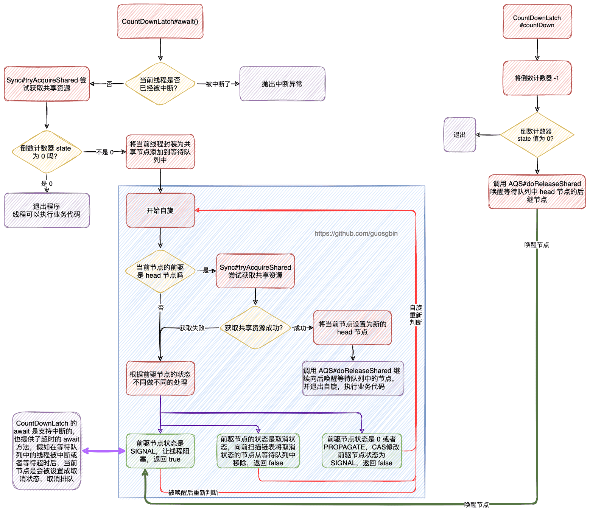

| 版本 | 内容 | 时间                   |
| ---- | ---- | ---------------------- |
| V1   | 新建 | 2022年09月12日23:30:28 |

## 概述

本文基于 CountDownLatch 分析 AQS 的共享模式，CountDownLatch 类本身的代码非常少，大部分都是调用的 AQS 的方法。和 ReentrantLock 一样也是使用一个内部类 Sync 来继承 AQS，这也是 JDK 推荐的方式。

对于 CountDownLatch 来说资源就是一个倒数计数的值，创建 CountDownLatch 时初始化一个数值，每调用一次 countDown 方法就会让该计数减 1，当计数值减到 0 时则会唤醒所有在 await 方法等待的线程，继续向下执行自己的业务。

## CountDownLatch 的使用案例

### 主线程等待所有子线程完成任务

```java
@Test
public void test01() throws InterruptedException {
    CountDownLatch latch = new CountDownLatch(10);
    for (int i = 0; i < 10; i++) {
        new Thread(new WorkerRunnable(i, latch), "线程" + i).start();
    }
    System.out.println("主线程等待所有子任务完成");
    long start = System.currentTimeMillis();
    latch.await();
    long end = System.currentTimeMillis();
    System.out.println("所有子任务完成...，耗时：" + (end - start));
}


class WorkerRunnable implements Runnable {
    private int taskId;
    private CountDownLatch latch;

    public WorkerRunnable(int taskId, CountDownLatch latch) {
        this.taskId = taskId;
        this.latch = latch;
    }

    @Override
    public void run() {
        try {
            int time = random.nextInt(10);
            System.out.printf("%s 任务 id：%s，正在执行任务中..., 需耗时： %s \n", Thread.currentThread().getName(), taskId, time);
            TimeUnit.SECONDS.sleep(time);
            System.out.printf("任务 id：%s，执行任务完成...\n", taskId);
        } catch (InterruptedException ignored) {
        } finally {
            latch.countDown();
        }

    }
}
```

控制台：

```
线程0 任务 id：0，正在执行任务中..., 需耗时： 7 
线程7 任务 id：7，正在执行任务中..., 需耗时： 8 
线程6 任务 id：6，正在执行任务中..., 需耗时： 7 
线程9 任务 id：9，正在执行任务中..., 需耗时： 3 
线程5 任务 id：5，正在执行任务中..., 需耗时： 9 
线程4 任务 id：4，正在执行任务中..., 需耗时： 0 
任务 id：4，执行任务完成...
线程3 任务 id：3，正在执行任务中..., 需耗时： 7 
线程2 任务 id：2，正在执行任务中..., 需耗时： 4 
线程1 任务 id：1，正在执行任务中..., 需耗时： 3 
主线程等待所有子任务完成
线程8 任务 id：8，正在执行任务中..., 需耗时： 5 
任务 id：9，执行任务完成...
任务 id：1，执行任务完成...
任务 id：2，执行任务完成...
任务 id：8，执行任务完成...
任务 id：0，执行任务完成...
任务 id：6，执行任务完成...
任务 id：3，执行任务完成...
任务 id：7，执行任务完成...
任务 id：5，执行任务完成...
所有子任务完成...，耗时：9005
```

### 让子任务同时开启

```java
@Test
public void test02() throws InterruptedException {
    CountDownLatch startSignal = new CountDownLatch(1);
    CountDownLatch endSignal = new CountDownLatch(10);
    for (int i = 0; i < 10; i++) {
        new Thread(new Worker(i, startSignal, endSignal), "线程" + i).start();
    }

    TimeUnit.SECONDS.sleep(1);

    System.out.println("所有子栏删都开启...");
    startSignal.countDown();

    System.out.println("等待子线程结束");
    long start = System.currentTimeMillis();
    endSignal.await();
    long end = System.currentTimeMillis();
    System.out.println("所有子任务已经运行结束，耗时：" + (end - start));
}

class Worker implements Runnable {
    private int taskId;
    private CountDownLatch startSignal;
    private CountDownLatch endSignal;

    public Worker(int taskId, CountDownLatch startSignal, CountDownLatch endSignal) {
        this.taskId = taskId;
        this.startSignal = startSignal;
        this.endSignal = endSignal;
    }

    @Override
    public void run() {
        try {
            int time = random.nextInt(10);
            System.out.printf("%s 任务 id：%s，准备执行任务..., 该任务需耗时： %s \n", Thread.currentThread().getName(), taskId, time);

            startSignal.await();

            TimeUnit.SECONDS.sleep(time);
            System.out.printf("任务 id：%s，执行任务完成...\n", taskId);
        } catch (InterruptedException ignored) {
        } finally {
            endSignal.countDown();
        }
    }
}
```

控制台：

```
线程0 任务 id：0，准备执行任务..., 该任务需耗时： 7 
线程7 任务 id：7，准备执行任务..., 该任务需耗时： 9 
线程6 任务 id：6，准备执行任务..., 该任务需耗时： 9 
线程5 任务 id：5，准备执行任务..., 该任务需耗时： 5 
线程3 任务 id：3，准备执行任务..., 该任务需耗时： 5 
线程4 任务 id：4，准备执行任务..., 该任务需耗时： 5 
线程2 任务 id：2，准备执行任务..., 该任务需耗时： 7 
线程1 任务 id：1，准备执行任务..., 该任务需耗时： 2 
线程8 任务 id：8，准备执行任务..., 该任务需耗时： 7 
线程9 任务 id：9，准备执行任务..., 该任务需耗时： 8 
所有子栏删都开启...
等待子线程结束
任务 id：1，执行任务完成...
任务 id：3，执行任务完成...
任务 id：5，执行任务完成...
任务 id：4，执行任务完成...
任务 id：0，执行任务完成...
任务 id：8，执行任务完成...
任务 id：2，执行任务完成...
任务 id：9，执行任务完成...
任务 id：6，执行任务完成...
任务 id：7，执行任务完成...
所有子任务已经运行结束，耗时：9008
```

## 构造方法赋值初始值

```java
public CountDownLatch(int count) {
    if (count < 0) throw new IllegalArgumentException("count < 0");
    this.sync = new Sync(count);
}
```

CountDownLatch 的构造方法非常简单，就是赋值一个倒数计数器的初始值。其中 Sync 是继承 AQS 的内部类。

## await 流程分析

```java
public void await() throws InterruptedException {
    sync.acquireSharedInterruptibly(1);
}
```

**await 方法会让当前线程等待直到倒数计数器为 0 或者 被其他线程中断**。


继续看 AbstractQueuedSynchronizer#acquireSharedInterruptibly 方法

```java
// 共享地获取资源（响应中断）
public final void acquireSharedInterruptibly(int arg)
    throws InterruptedException {
    if (Thread.interrupted())
        // 当前线程已经被中断了
        throw new InterruptedException();
    // 尝试获取锁，小于 0 表示获取锁失败
    if (tryAcquireShared(arg) < 0)
        doAcquireSharedInterruptibly(arg);
}
```


可以看到首先会调用子类的 tryAcquireShared 方法，我们看 CountDownLatch.Sync#tryAcquireShared 的实现

```java
protected int tryAcquireShared(int acquires) {
    return (getState() == 0) ? 1 : -1;
}
```

这里分析下该方法返回值的含义：

| 返回值 | 含义                                              |
| ------ | ------------------------------------------------- |
| 1      | 表示资源值是 0，表示 await 的线程可以继续执行了。 |
| -1     | 表示资源值不是 0，表示当前线程需要去阻塞等待。    |


OK 假如返回 -1，那么需要当前线程去阻塞了，接下来看阻塞相关方法 AbstractQueuedSynchronizer#doAcquireSharedInterruptibly 该方法和共享模式的方法十分类似：

```java
// 共享地获取资源（响应中断）
private void doAcquireSharedInterruptibly(int arg)
    throws InterruptedException {
    // 包装成共享节点，插入等待队列
    final Node node = addWaiter(Node.SHARED);
    boolean failed = true;
    try {
        for (;;) {
            // 获取前驱节点
            final Node p = node.predecessor();
            if (p == head) {
                // 尝试获取锁
                int r = tryAcquireShared(arg);
                if (r >= 0) {
                    // 根据传播状态判断是否要唤醒并释放后继结点
                    setHeadAndPropagate(node, r);
                    p.next = null; // help GC
                    failed = false;
                    return;
                }
            }
            if (shouldParkAfterFailedAcquire(p, node) &&
                parkAndCheckInterrupt())
                throw new InterruptedException();
        }
    } finally {
        if (failed)
            cancelAcquire(node);
    }
}
```

分析下步骤：

1. 首先是将当前线程封装成共享模式的节点添加到等待队列；
2. 开启自旋；
   1. 获取前驱节点，假如前驱节点是 head 节点，则尝试获取共享锁，获取成功则调用 setHeadAndPropagate 方法，并退出自旋；
   2. 假如前驱节点不是 head 节点，那么就会根据 shouldParkAfterFailedAcquire 和 parkAndCheckInterrupt 方法来决定当前线程是否阻塞等待。
   3. 假如线程被中断了，那么会调用 cancelAcquire 方法将当前线程的节点设置成取消状态。


shouldParkAfterFailedAcquire 方法和 parkAndCheckInterrupt 方法在 ReentrantLock 时已经分析了，这里不再分析。

AbstractQueuedSynchronizer#setHeadAndPropagate 方法在唤醒的时候再分析。

好了，到这里线程已经在等待队列中阻塞等待了。

## countDown 流程分析

```java
public void countDown() {
    sync.releaseShared(1);
}
```

AbstractQueuedSynchronizer#releaseShared

```java
// 释放共享资源
public final boolean releaseShared(int arg) {
    // tryReleaseShared 返回true 表示已经释放完了
    if (tryReleaseShared(arg)) {
        doReleaseShared();
        return true;
    }
    return false;
}
```


OK 首先调用的是 AbstractQueuedSynchronizer#tryReleaseShared 方法，尝试释放共享资源，该方法需要由子类实现，所以我们看 CountDownLatch.Sync#tryReleaseShared 方法：

```java
protected boolean tryReleaseShared(int releases) {
    // Decrement count; signal when transition to zero
    for (;;) {
        // 获取同步的状态值
        int c = getState();
        if (c == 0)
            return false;
        // 每次就 -1
        int nextc = c-1;
        if (compareAndSetState(c, nextc))
            // nextc == 0 就说明已经减到 0了
            return nextc == 0;
    }
}
```

返回值说明，当倒数计数器减到 0 的时候返回 true，这就意味着所有被 await 阻塞等待的线程可以被唤醒了。不是 0 返回 false。

继续看 AbstractQueuedSynchronizer#releaseShared 方法，当 tryReleaseShared 放回 true 的时候，则需要调用 AbstractQueuedSynchronizer#doReleaseShared 方法去唤醒所有被 await 阻塞的线程了，我们看下源码是如何做的：

```java
private void doReleaseShared() {
    for (;;) {
        Node h = head;
        // h != null 说明等待队列中有 head 节点
        // h != tail 说明等待队列中除开 head 节点还有别的节点
        if (h != null && h != tail) {
            int ws = h.waitStatus;
            if (ws == Node.SIGNAL) {
                // 假如 head 节点的状态是 SIGNAL，需要将其 cas 修改为 0
                // 这里使用 cas 是因为该方法可能会有多个线程调用
                // cas 失败则继续继续自旋重新判断
                if (!compareAndSetWaitStatus(h, Node.SIGNAL, 0))
                    continue;            // loop to recheck cases
                // 前提是上面的 cas 成功了，则需要唤醒 head 的后继节点
                unparkSuccessor(h);
            }
            // 前置条件 head 的状态不是 SIGNAL
            // 当 head 的状态是 0 时，需要将 head 的状态 cas 为 PROPAGATE
            else if (ws == 0 &&
                     !compareAndSetWaitStatus(h, 0, Node.PROPAGATE))
                // CAS 失败则自旋继续判断
                continue;                // loop on failed CAS
        }
        if (h == head)                   // loop if head changed
            // head 发生改变，则说明等待队列有节点出队了
            break;
    }
}
```

具体的唤醒操作在 unparkSuccessor 方法中，该方法会唤醒 head 节点的 next 节点。（该方法ReentrantLock 分析过）


既然唤醒了，那么被唤醒的节点就会在 AbstractQueuedSynchronizer#doAcquireSharedInterruptibly 方法中继续自旋判断，

```java
// 共享地获取资源（响应中断）
private void doAcquireSharedInterruptibly(int arg)
    throws InterruptedException {
    // 包装成共享节点，插入等待队列
    final Node node = addWaiter(Node.SHARED);
    boolean failed = true;
    try {
        for (;;) {
            // 获取前驱节点
            final Node p = node.predecessor();
            if (p == head) {
                // 尝试获取锁
                int r = tryAcquireShared(arg);
                if (r >= 0) {
                    // 根据传播状态判断是否要唤醒并释放后继结点
                    setHeadAndPropagate(node, r);
                    p.next = null; // help GC
                    failed = false;
                    return;
                }
            }
            if (shouldParkAfterFailedAcquire(p, node) &&
                parkAndCheckInterrupt())
                throw new InterruptedException();
        }
    } finally {
        if (failed)
            cancelAcquire(node);
    }
}
```

假如被唤醒的节点是 head 的 next 节点，那么就会调用 AbstractQueuedSynchronizer#tryAcquireShared 方法，我们假设这里倒数计数器已经是 0 了，那么 tryAcquireShared 方法返回 1，就会调用 AbstractQueuedSynchronizer#setHeadAndPropagate，分析下该方法：

```java
// 将当前 node 设置为头节点，并根据传播状态判断是否要唤醒并释放后继结点
private void setHeadAndPropagate(Node node, int propagate) {
    // 将当前节点设置为头节点（记录下旧的头节点）
    Node h = head; // Record old head for check below
    // 设置新的头节点
    setHead(node);
    // 判断是否需要唤醒后继节点
    // 在 countDownLatch 调进来的时 propagate 是 1
    if (propagate > 0 || h == null || h.waitStatus < 0 ||
        (h = head) == null || h.waitStatus < 0) {
        Node s = node.next;
        if (s == null || s.isShared())
            doReleaseShared();
    }
}
```

首先就是设置新的头节点，在 countDownLatch 调到该方法时参数 propagate 的值是固定 1，所有其他条件不用看了直接看里面的，因为 countDownLatch 进入等待队列的都是共享模式的节点，所有会直接调到 AbstractQueuedSynchronizer#doReleaseShared 方法去唤醒后面的节点。以此反复，直到所有被await 方法阻塞住的SHARED 节点里的线程都被唤醒，都抢到锁，都可以继续执行后面的业务代码。

到这里 countDown 的流程已经说完了。

## 小结

CountDownLatch 的 await 方法和 countDown 方法的流程图。

