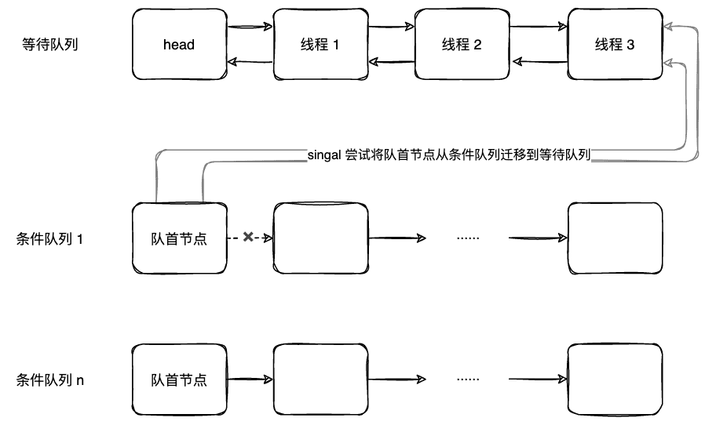
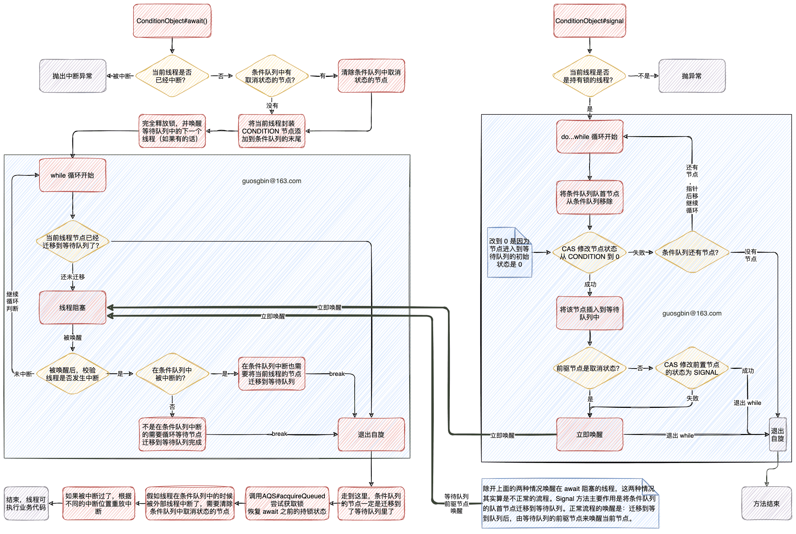

| 版本 | 内容 | 时间                   |
| ---- | ---- | ---------------------- |
| V1   | 新建 | 2022年09月14日22:50:30 |

## 概述

Synchronized 同步锁在同步代码块中可以通过锁对象的 wait 和 notify 方法来实现线程同步。

对于 JUC 中的 Condition 接口，配合 Lock 锁也可以实现线程同步，通过 Condition 接口中的 await 和 signal 方法实现。


一个 Synchronized 锁只能有一个共享的变量锁对象的 wait 和 notify 来实现线程同步，而一个 Lock 锁可配合多个 Condition 实例使用。

Condition 必须和 Lock 配合使用，这和 Synchronized 的使用要求是一样的。

> 注意：Condition 就是一个普通的对象，它也是可以配合 Synchronized 使用的，例如把它当成一个锁对象，但是防止混淆最好不要这样做。

## Condition 接口介绍

```java
public interface Condition {
    void await() throws InterruptedException;
    void awaitUninterruptibly();
    long awaitNanos(long nanosTimeout) throws InterruptedException;
    boolean await(long time, TimeUnit unit) throws InterruptedException;
    boolean awaitUntil(Date deadline) throws InterruptedException;
    void signal();
    void signalAll();
}
```

提供的 api 分为两类，一种是阻塞线程的，另外是唤醒线程的。

- 提供的阻塞线程的 await 系列方法，支持中断和超时机制；
- 唤醒方法支持唤醒一个和所有；

## Condition 官方案例

SimpleBlockingQueue 是一个支持 put 和 take 方法的有界缓冲区。如果在空缓冲区上调用 take 方法，则线程将阻塞直到缓冲区中有数据；如果在缓冲区满了的时候调用 put 放，则线程将阻塞直到缓冲区未满。

```java
public class SimpleBlockingQueue<T> implements BlockingQueue {

    private ReentrantLock lock = new ReentrantLock();
    private Condition notFull = lock.newCondition();
    private Condition notEmpty = lock.newCondition();

    // 队列大小
    private int size;

    // 底层数组
    private Object[] queues;

    // 当前队列中的数据量
    private int count;

    // 记录生产者存放数据的下一次位置，每个生产者生产完一个数据后，将 putPtr++
    private int putPtr;

    // 记录消费者消费数据的下一次位置，每个消费者消费完一个数据后，将 takePtr++
    private int takePtr;

    public SimpleBlockingQueue(int size) {
        this.size = size;
        this.queues = new Object[size];
    }

    @Override
    public void put(Object element) {
        lock.lock();
        try {
            while (count == size) {
                // 队列是满的，需要睡眠，等待消费者去唤醒
                notFull.await();
            }

            queues[putPtr] = element;
            putPtr++;
            if (putPtr == size) {
                putPtr = 0;
            }
            count++;
            // 这里因为添加了一个数据，需要唤醒消费者线程
            notEmpty.signalAll();
        } catch (InterruptedException e) {
            e.printStackTrace();
        } finally {
            lock.unlock();
        }
    }

    @Override
    public Object take() throws InterruptedException {
        lock.lock();
        try {
            while (count == 0) {
                // 队列是空的，需要睡眠，等待生产者去唤醒
                notEmpty.await();
            }

            Object element = queues[takePtr];
            takePtr++;
            if (takePtr == size) {
                takePtr = 0;
            }
            count--;
            // 这里因为添加了一个数据，需要唤醒消费者线程
            notFull.signalAll();
            return element;
        } finally {
            lock.unlock();
        }
    }
}
```

## Condition 源码分析

AQS 的内部类 ConditionObject 实现了 Condition 接口，本次也是主要分析这个实现类。

### ConditionObject 的创建

Condition 的创建是通过 Lock#newCondition 创建的，看下 ReentrantLock 中的实现：

```java
public Condition newCondition() {
    return sync.newCondition();
}
```

继续跟下去：

```java
final ConditionObject newCondition() {
    return new ConditionObject();
}
```

可以看到，就是 new 了一个 ConditionObject 对象出来。

### 条件队列介绍

在 AbstractQueuedSynchronizer.Node 的属性中有个 nextWaiter 属性前面没有分析过，这个 nextWaiter 的含义是指向条件队列中当前节点的后驱节点。

条件队列是一个单向链表，通过 nextWaiter 连接。


当我们调用 await 方法后，当前线程就会被封装成一个节点加入到条件队列中去。因为 Lock 可以配合多个 Condition 使用，每个 Condition 都有自己的条件队列。

当调用指定 Condition 的 signal 方法后，就会将它的条件队列中的节点迁移到等待队列中，等待唤醒。当唤醒之前就会尝试重新获取锁，当获取到锁之后就可以执行自己的业务代码了。


条件队列示意图：




### ConditionObject 的属性

```java
// Condition 队列首结点指针
private transient Node firstWaiter;
// Condition 队列尾结点指针
private transient Node lastWaiter;
```

ConditionObject 主要就是两个指针，一个指向条件队列的头结点，一个指向了条件队列的尾结点。

### await 方法阻塞前代码分析

分析下 ConditionObject#await() 阻塞线程的方法，本小结只会分析阻塞前的代码

```java
public final void await() throws InterruptedException {
    if (Thread.interrupted())
        throw new InterruptedException();
    // 将当前线程封装成 CONDITION 节点加入到条件队列中
    Node node = addConditionWaiter();
    // 完全释放锁，使用临时变量 savedState 保存释放前的同步状态
    int savedState = fullyRelease(node);
    // 0 在条件队列挂起期间未发生过中断
    // -1 在条件队列挂起期间接收到中断信号了
    // 1 在条件队列挂起期间未接收到中断信号，但是迁移到"等待队列"之后，接收过中断信号
    int interruptMode = 0;
    // isOnSyncQueue 返回 true 表示当前线程对应的节点已经迁移到等待队列了
    while (!isOnSyncQueue(node)) {
        // 因为当前 node 仍然还在条件队列中，需要继续 park
        LockSupport.park(this);
        if ((interruptMode = checkInterruptWhileWaiting(node)) != 0)
            break;
    }

    if (acquireQueued(node, savedState) && interruptMode != THROW_IE)
        interruptMode = REINTERRUPT;
    if (node.nextWaiter != null) // clean up if cancelled
        unlinkCancelledWaiters();
    if (interruptMode != 0)
        reportInterruptAfterWait(interruptMode);
}
```

首先是将当前线程封装成一个 CONDITION 状态的节点，并将其添加到条件队列（单向链表），具体体现在ConditionObject#addConditionWaiter 方法，这个方法里面完全就是链表的操作，可自行查看。

然后调用 AbstractQueuedSynchronizer#fullyRelease 完全释放锁，并唤醒在等待队列中等待的线程（如果有的话），最后会将释放锁前的 state 状态保存到临时变量 savedState 中，用于唤醒后的恢复操作。

看下 AbstractQueuedSynchronizer#fullyRelease  方法：

```java
/*
 * 完全释放锁，并返回之前的持锁次数
 */
final int fullyRelease(Node node) {
    boolean failed = true;
    try {
        int savedState = getState();
        if (release(savedState)) {
            // 释放锁成功
            failed = false;
            return savedState;
        } else {
            // 释放锁失败
            throw new IllegalMonitorStateException();
        }
    } finally {
        if (failed)
            node.waitStatus = Node.CANCELLED;
    }
}
```

ß然后进入到一个 while 循环的判断， AbstractQueuedSynchronizer#isOnSyncQueue 方法，这个方法的含义是：

1. 返回 false 表示当前线程的节点还在队列中，这是就会进入到循环体中，当前线程就会被阻塞；
2. 返回 true 表示当前线程的节点已经到等待队列中去了；

这个方法具体源码后面分析。

### signal 唤醒线程

ConditionObject#signal 和 ConditionObject#doSignal

```java
public final void signal() {
    if (!isHeldExclusively())
        // 当前线程未持有锁，抛异常
        throw new IllegalMonitorStateException();
    Node first = firstWaiter;
    if (first != null)
        // 将条件队列的节点迁移到等待队列
        doSignal(first);
}

// 将节点从条件队列转移到等待队列
private void doSignal(Node first) {
    do {
        // 这里的逻辑就是从头往后遍历Condition链表
        // 找到一个节点不是null的，然后调用唤醒，就那么简单
        if ( (firstWaiter = first.nextWaiter) == null)
            lastWaiter = null;

        // 当前first节点出队，断开和下一个节点的关系
        first.nextWaiter = null;

        // transferForSignal(first) true 表示当前 first 节点迁移到等待队列成功
        // 直至迁移某个节点成功，或者条件队列为 null 为止
    } while (!transferForSignal(first) &&
             (first = firstWaiter) != null);
}
```

在迁移之前会将条件队列的队首节点出队，然后尝试将该队首节点迁移到等待队列中去。

真正的迁移方法在 AbstractQueuedSynchronizer#transferForSignal 方法中，假如这个队首节点迁移失败了，则会尝试迁移下一个节点。

```java
final boolean transferForSignal(Node node) {
    // 将节点的状态从 CONDTION 改为 0
    // 因为后面唤醒之后还要进入等待队列去争抢锁，所以改为 0 也就是等待队列的初始状态
    if (!compareAndSetWaitStatus(node, Node.CONDITION, 0))
        return false;

    // 将节点插入到等待队列，返回的 p 是节点的前驱节点
    Node p = enq(node);
    int ws = p.waitStatus;
    // 如果上一个节点是取消状态，或者尝试设置上一个节点的状态为 SIGNAL 失败了，就立即唤醒 await 的线程
    if (ws > 0 || !compareAndSetWaitStatus(p, ws, Node.SIGNAL))
        LockSupport.unpark(node.thread);
    return true;
}
```

其实 signal 方法的作用就是将条件队列的队首节点迁移到等待队列中，等待前驱结点唤醒它。

首先 CAS 尝试将节点的状态从 CONDITION 改为 0，CAS 失败则说明当前节点在条件队列中不正常，不正常的情况有两种：

1. 一种是当前节点被取消了；
2. 一种是当前节点因为被中断了，节点已经被迁移到等待队列且状态被改为 0 了；

节点不正常返回 false 让外层的 do...while 循环处理，其实就是尝试迁移下一个节点。

假如节点正常的话，此时节点的状态被改为 0，调用 AbstractQueuedSynchronizer#enq 插入等待队列的尾部，并尝试将前驱节点的状态改为 SIGNAL。

根据前驱节点的状态来确定是否立即唤醒 await 的线程，在下面两种情况会立即唤醒：

- 如果上一个节点是取消状态，或者尝试设置上一个节点的状态为 SIGNAL 失败了。

那么正常情况下的节点是怎么唤醒的呢？

其实就是在等待队列中等待它的前驱节点释放锁后唤醒它。


OK，这里已经分析完了 signal 方法了，其实就是将节点从条件队列转移到等待队列。

### await 方法里被唤醒后的代码分析

```java
public final void await() throws InterruptedException {
    if (Thread.interrupted())
        throw new InterruptedException();
    Node node = addConditionWaiter();
    int savedState = fullyRelease(node);
    int interruptMode = 0;
    // isOnSyncQueue 返回 true 表示当前线程对应的节点已经迁移到等待队列了
    while (!isOnSyncQueue(node)) {
        // 因为当前 node 仍然还在条件队列中，需要继续 park
        LockSupport.park(this);

        if ((interruptMode = checkInterruptWhileWaiting(node)) != 0)
            // != 0 说明发生中断了，需要跳出循环
            break;
    }

	// 节点一定是被迁移到了等待队列中
    // 重新获取锁，acquireQueued 会阻塞直到获取到锁
    if (acquireQueued(node, savedState) && interruptMode != THROW_IE)
        interruptMode = REINTERRUPT;

    // 什么时候会 node.nextWaiter != null ？
    // 其实是因为 node 在条件队列内被外部线程中断唤醒时，会加入到等待队列，但是并未设置 nextWaiter = null
    // 被信号唤醒或信号后中断唤醒的节点，将首先移出条件队列，再进行状态转换并迁移到等待队列。
    if (node.nextWaiter != null) // clean up if cancelled
        // 这里就是删除一下无效的条件队列节点
        unlinkCancelledWaiters();
    // 如果之前发生了中断，则根据中断模式重放中断
    if (interruptMode != 0)
        reportInterruptAfterWait(interruptMode);
}
```


首先看线程被唤醒后的第一个方法 ConditionObject#checkInterruptWhileWaiting

```java
private int checkInterruptWhileWaiting(Node node) {
    return Thread.interrupted() ?
        (transferAfterCancelledWait(node) ? THROW_IE : REINTERRUPT) :
    0;
}


// 返回 true 表示节点是在条件队列中被中断的
// 返回 false 表示节点是在条件队列外被中断的，是收到信号后发生的中断
final boolean transferAfterCancelledWait(Node node) {

    if (compareAndSetWaitStatus(node, Node.CONDITION, 0)) {
        // 说明当前节点是在条件队列里的，因为 signal 时迁移节点到等待队列时，需要将节点的状态修改为 0
        // 被中断唤醒的节点也会入到同步队列
        enq(node);
        // 返回 true 表示在条件队列内被中断的
        return true;
    }
    /*
         * If we lost out to a signal(), then we can't proceed
         * until it finishes its enq().  Cancelling during an
         * incomplete transfer is both rare and transient, so just
         * spin.
         */
    // 到这里的情况
    // 1.当前 node 已经被外部线程调用 signal 方法将其迁移到等待队列了
    // 2.当前 node 已经被外部线程调用 signal 方法将其迁移到等待队列进行中的状态
    // 一定是在收到信号后发生了中断，但可能 AQS#transferForSignal() node未完成入队，因此，空等待至node完成入队，然后返回false，
    while (!isOnSyncQueue(node))
        Thread.yield();
    // 表示当前节点被中断唤醒时，不在条件队列了
    return false;
}

```

假如当前线程被中断了，这个方法主要就是为了确定是在什么时候发送中断的。

1. 没有发生中断返回 0；
2. 节点在条件队列中发生的中断返回 THROW_IE；
3. 节点不是在条件队列中发送的中断返回 REINTERRUPT，这个时机可能是再在等待队列中，也可能是迁移到等待队列的操作一半的时候；

在代码中可以看到，假如是在条件队列中的时候被中断了，是会调用 enq 方法将当前节点迁移到等待队列中。


OK 反正当退出 await 方法的 while 循环后，当前节点一定是从条件队列中迁移到了等待队列中去了。

**重点是要恢复当前线程在 await 之前的持锁状态，那么会调用 AbstractQueuedSynchronizer#acquireQueued 方法尝试获取锁，这里也可能会被阻塞，直到获取锁。**


最后的两个 if 判断很简单：

第一个

```java
if (node.nextWaiter != null) // clean up if cancelled
    // 这里就是删除一下无效的条件队列节点
    unlinkCancelledWaiters();
```

这里是因为线程在条件队列中被中断的时候，是没有断开 nextWaiter 的指针，这里是给他擦屁股，其实就是删除条件队列中的取消状态的节点。


第二个

```java
// 如果之前发生了中断，则根据中断模式重放中断
if (interruptMode != 0)
    reportInterruptAfterWait(interruptMode);
```

假如线程被中断过了，则根据中断模式重放中断。这个为什么这么设计，其实这是 JSR 中规定的，按照 Doug Lea 的 AQS 论文原文说的

As revised in JSR133, these require that if an interrupt occurs before a signal, then the await method must, after re-acquiring the lock, throw InterruptedException. But if it is interrupted after a signal, then the method must return without throwing an exception, but with its thread interrupt status set.

意思就是 在 JSR133 修订之后，规范要求如果中断先于 signal 发生，那么 await 在重新获取锁之后必须抛出 InterruptedException 异常。但如果中断比 signal 发生得晚，那么 await 必须不抛异常返回，然后设置当前线程的中断标志。

## 小结

当线程在指定 Condition 对象上等待的时候，其实就是将线程包装成节点并添加到了条件队列，然后阻塞。

当线程被通知唤醒时，则是将条件队列中的节点转换成等待队列中的节点，之后的处理就和独占功能完全一样。


Condition 的接口中还支持非中断等待和带潮湿的等待，代码其实都比较相似，可以自行查看。


await 和 signal 方法的流程图

