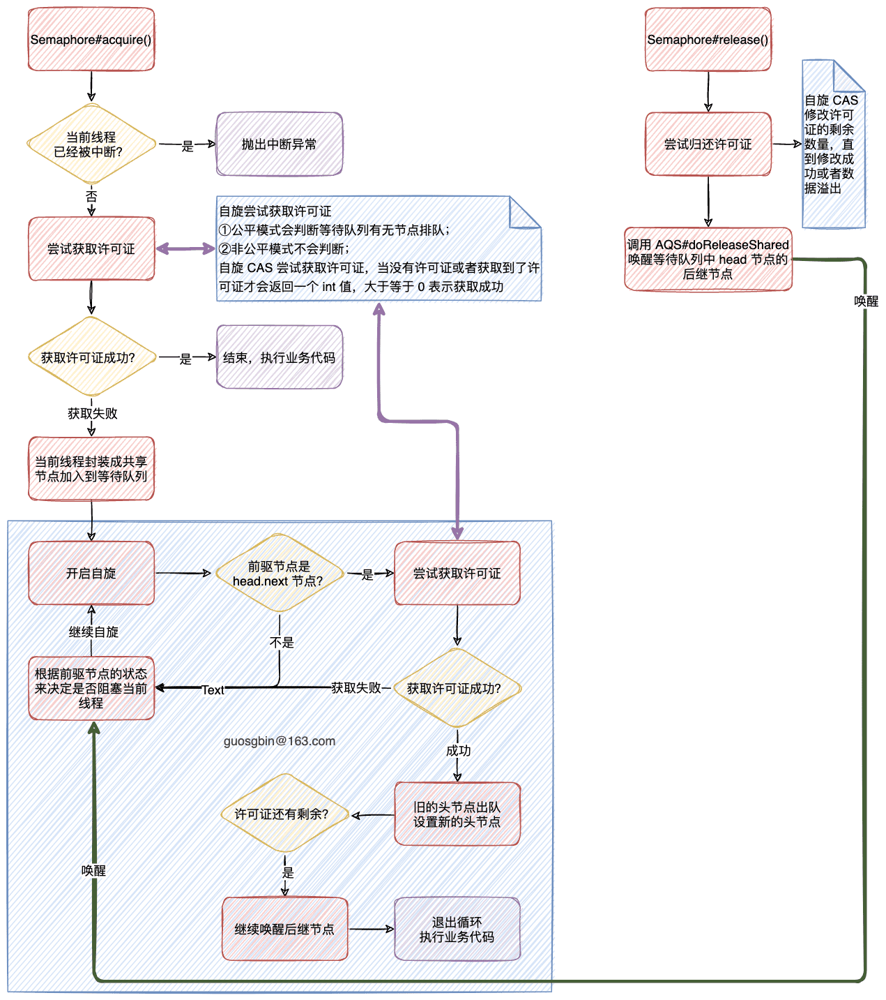

| 版本 | 内容 | 时间                   |
| ---- | ---- | ---------------------- |
| V1   | 新建 | 2022年09月19日22:05:38 |

## 概述

信号量 Semaphore 是通过 AQS 的**共享模式**实现的。

在某些时候我们可能需要控制访问某个资源的最大线程数，比如说要对某个服务做限流。

例如 RocketMQ 中生产者、消费者和 nameServer 之间的单向和异步的 RPC 调用就是用 Semaphore 做限流的。


**信号量 Semaphore 是基于 AQS 的共享模式实现的，支持公平和非公平模式**。Semaphore 中的资源相当于是维护一个“许可证”的计数，初始时给 Semaphore 赋值指定个数的“许可证”，

- 每次线程就可以获取一个“许可证”然后就执行自己的业务，执行完后归还“许可证”；
- 假如获取不到许可证，当前线程就需要那在 AQS 的等待队列中阻塞了，等待被唤醒；

## JDK给的案例

```java
class Pool {
    // 池子的最大容量
    private static final int MAX_AVAILABLE = 100;
    // 信号量，最大并发是 100，true 表示是公平锁，
    private final Semaphore available = new Semaphore(MAX_AVAILABLE, true);

    // 尝试获取资源
    public Object getItem() throws InterruptedException {
        // 尝试获取锁
        available.acquire();
        return getNextAvailableItem();
    }

    // 归还资源到池子
    public void putItem(Object x) {
        if (markAsUnused(x)) {
            available.release();
        }
    }

    // 池子
    protected Object[] items = new Object[MAX_AVAILABLE];
    // 标记池子中的指定索引处的资源是否被使用
    protected boolean[] used = new boolean[MAX_AVAILABLE];

    // 从头开始遍历 used 数组，获取第一个空闲的资源
    protected synchronized Object getNextAvailableItem() {
        for (int i = 0; i < MAX_AVAILABLE; i++) {
            if (!used[i]) {
                used[i] = true;
                return items[i];
            }
        }
        // 什么也没找到
        return null;
    }

    // 因为归还资源了，把池子中对应的资源标记位可用
    protected synchronized boolean markAsUnused(Object item) {
        for (int i = 0; i < MAX_AVAILABLE; i++) {
            if (item == items[i]) {
                if (used[i]) {
                    used[i] = false;
                    return true;
                } else {
                    return false;
                }
            }
        }
        return false;
    }
}
```

item 数组是一个共享资源，当有线程尝试获取资源时，必须从 Semaphore 中获取“许可证”。线程使用完资源后，需要将“许可证”归还。

## 构造方法

```java
public Semaphore(int permits) {
    sync = new NonfairSync(permits);
}

public Semaphore(int permits, boolean fair) {
    sync = fair ? new FairSync(permits) : new NonfairSync(permits);
}
```

有两个构造方法，可以看到 Semaphore **默认是非公平模式**的。

## 获取许可证方法

在 Semaphore 中有许多获取许可证的方法，如下：

```java
void acquire();
void acquireUninterruptibly();
boolean tryAcquire();
boolean tryAcquire(long timeout, TimeUnit unit);
void acquire(int permits);
void acquireUninterruptibly(int permits);
boolean tryAcquire(int permits);
boolean tryAcquire(int permits, long timeout, TimeUnit unit);
```

基本上就是一些支持中断和超时的方法，本篇以  Semaphore#acquire() 方法为例分析获取许可证的流程，其他方法的实现基本类似。

```java
public void acquire() throws InterruptedException {
    sync.acquireSharedInterruptibly(1);
}
```

通过调用的方法名就能看到，Semaphore#acquire() 就是获取共享资源，并且支持中断的。


继续向下跟进 AbstractQueuedSynchronizer#acquireSharedInterruptibly 

```java
// 共享地获取资源（响应中断）
public final void acquireSharedInterruptibly(int arg)
        throws InterruptedException {
    if (Thread.interrupted())
        // 当前线程已经被中断了
        throw new InterruptedException();
    // 尝试获取资源，小于 0 表示获取资源失败
    if (tryAcquireShared(arg) < 0)
        doAcquireSharedInterruptibly(arg);
}
```

首先会判断当前线程是否中断，假如已经被外部线程中断了，那就直接抛异常出去。

假如当前线程没有被中断，就会根据当前 Semaphore 是允许在公平还是非公平模式下去调用不同的方法尝试获取共享资源，也就是尝试获取“许可证”。

### 公平模式

假设 Semaphore 是允许在公平模式的，就会调用 Semaphore.FairSync#tryAcquireShared 尝试获取共享资源。

```java
/**
     * 公平锁，自旋尝试获取共享锁
     *
     * 返回
     * -1 表示已经有线程在等待了
     * > 0 表示获取许可证成功
     * < 0 许可证不够，有一种 -1 表示已经有线程在等待了
     */
protected int tryAcquireShared(int acquires) {
    // 自旋
    for (;;) {
        // 假如阻塞队列中有线程节点在等待，那么返回 -1
        if (hasQueuedPredecessors())
            return -1;
        // 获取许可证的个数
        int available = getState();
        int remaining = available - acquires;
        if (remaining < 0 ||
            compareAndSetState(available, remaining))
            return remaining;
    }
}
}
```

尝试获取“许可证”的代码很简单，就是**开启一个自旋尝试获取“许可证”**

公平模式的关键就是 AbstractQueuedSynchronizer#hasQueuedPredecessors 方法，这个方法在分析 ReentrantLock 的时候分析过，就是判断在 AQS 的等待队列中是否已经有线程在排队等待获取资源。假如有就返回 true。

```java
public final boolean hasQueuedPredecessors() {
    // The correctness of this depends on head being initialized
    // before tail and on head.next being accurate if the current
    // thread is first in queue.
    Node t = tail; // Read fields in reverse initialization order
    Node h = head;
    Node s;
    return h != t &&
        ((s = h.next) == null || s.thread != Thread.currentThread());
}
```

那么对应到 Semaphore 的尝试公平获取共享资源的 tryAcquireShared 方法来说，假如已经有线程在 AQS 中排队了，那就直接返回 -1 表示获取“许可证”失败。 

后面就是计算当前线程在获取指定个数“许可证”之后还剩余“许可证”的个数，然后尝试 CAS 修改剩余个数。

对于 Semaphore.FairSync#tryAcquireShared 方法的返回值的解释：

1. 假如已经有线程在 AQS 中排队等待获取“许可证”，直接返回 -1 表示获取“许可证”失败；
2. 返回值大于等于 0，表示 CAS 成功，获取到“许可证”了，返回值表示剩余“许可证”的个数；
3. 返回值小于 0，除开第一种情况，其他的情况表示许可证不够用了，表示获取“许可证”失败；

总的来说，就是返回值大于等于 0 表示获取成功，小于 0 表示获取失败。

### 非公平模式

对于 Semaphore 的非公平模式，需要关注 Semaphore.NonfairSync#tryAcquireShared 方法

```java
/**
 * 非公平获取许可证
 */
protected int tryAcquireShared(int acquires) {
    return nonfairTryAcquireShared(acquires);
}

/**
 * 非公平锁取许可证
 */
final int nonfairTryAcquireShared(int acquires) {
    // 自旋
    for (;;) {
        int available = getState();
        int remaining = available - acquires;
        if (remaining < 0 ||
            compareAndSetState(available, remaining))
            return remaining;
    }
}
```

可以看到非公平模式和公平模式比就只是少了一个校验，非公平模式才不会管有没有线程在 AQS 的等待队列中排队，它直接自旋获取“许可证”。

### 获取许可证失败进入等待队列

在 AbstractQueuedSynchronizer#acquireSharedInterruptibly 方法中尝试获取“许可证”失败后，会将当前线程封装成节点并插入到等待队列中去。

这部分和之前 CountDownLatch 分析的共享节点进入等待队列的逻辑是一样的，这里只简述下流程。

```java
// 共享地获取资源（响应中断）
private void doAcquireSharedInterruptibly(int arg)
    throws InterruptedException {
    // 包装成共享节点，插入等待队列
    final Node node = addWaiter(Node.SHARED);
    boolean failed = true;
    try {
        for (;;) {
            // 获取前驱节点
            final Node p = node.predecessor();
            if (p == head) {
                // 尝试获取锁
                int r = tryAcquireShared(arg);
                if (r >= 0) {
                    // 根据传播状态判断是否要唤醒并释放后继结点
                    setHeadAndPropagate(node, r);
                    p.next = null; // help GC
                    failed = false;
                    return;
                }
            }
            // 判断线程是否需要阻塞
            if (shouldParkAfterFailedAcquire(p, node) &&
                parkAndCheckInterrupt())
             	// 线程被中断唤醒，抛出中断异常
                throw new InterruptedException();
        }
    } finally {
        if (failed)
            cancelAcquire(node);
    }
}
```

流程是：

1. 首先将当前线程封装成共享节点，然后插入到等待队列；

2. 开启自旋：

   1. 假如当前节点的前驱节点是 head 节点，则尝试获取许可证，获取成功则唤醒后继节点；

   2. 假如当前节点的前驱节点不是 head 节点，则需要判断线程是否需要阻塞；

      假如被阻塞后是正常被前驱节点唤醒就再次自旋判断；

      假如被阻塞后时被外部线程中断唤醒了，就抛出中断异常，然后再 finally 中将当前节点的状态改成取消状态；

### 设置新头节点唤醒后继

假如线程A 的节点是等待队列中的 head.next 节点，而且它在等待队列被正常唤醒并尝试获取锁成功，这是就会走到 AbstractQueuedSynchronizer#setHeadAndPropagate 方法，当许可证还有剩余时，就会继续调用 doReleaseShared 方法尝试唤醒后继节点。

```java
private void setHeadAndPropagate(Node node, int propagate) {
    // 将当前节点设置为头节点（记录下旧的头节点）
    Node h = head; // Record old head for check below
    // 设置新的头节点
    setHead(node);
    // 判断是否需要唤醒后继节点
    // 在 countDownLatch 调进来的时 propagate 是 1
    // Semaphore 调进来就不一定是 1 了，它调进来 propagate 表示的是许可证的剩余个数
    if (propagate > 0 || h == null || h.waitStatus < 0 ||
        (h = head) == null || h.waitStatus < 0) {
        Node s = node.next;
        if (s == null || s.isShared())
            doReleaseShared();
    }
}
```

## 释放许可证

释放许可证的方法有两个重载的方法，可以释放指定个数的许可证。

```java
// 释放许可证
public void release() {
    sync.releaseShared(1);
}

public void release(int permits) {
    if (permits < 0) throw new IllegalArgumentException();
    sync.releaseShared(permits);
}
```

它们都是调用的 AbstractQueuedSynchronizer#releaseShared

```java
// 释放共享资源
public final boolean releaseShared(int arg) {
    if (tryReleaseShared(arg)) {
        doReleaseShared();
        return true;
    }
    return false;
}
```


第一步是尝试释放共享资源，Semaphore.Sync#tryReleaseShared，就是开启一个自旋使用 CAS 修改许可证的个数。可以看到正常情况下是肯定返回 true 的。

```java
/**
 * 归还许可证
 */
protected final boolean tryReleaseShared(int releases) {
    for (;;) {
        int current = getState();
        int next = current + releases;
        if (next < current) // overflow
            throw new Error("Maximum permit count exceeded");
        if (compareAndSetState(current, next))
            return true;
    }
}
```


第二步释放共享节点。首先可是开启自旋，使用 unparkSuccessor 方法唤醒后继节点，这样节点就可以在上面分析的 AbstractQueuedSynchronizer#acquireSharedInterruptibly  方法中唤醒，根据

```java
// 释放共享结点
private void doReleaseShared() {
    for (;;) {
        Node h = head;
        if (h != null && h != tail) {
            // 走到这里说明，当前节点一定有后继节点
            int ws = h.waitStatus;
            // 说明可以唤醒后继节点，在唤醒后继节点前，将 head 节点的状态改为 0
            if (ws == Node.SIGNAL) {
                // 这里使用 cas 是因为该方法可能会有多个线程调用
                // t1 此时执行到 cas 操作成功，t2 线程也在尝试cas，这个线程就会失败
                if (!compareAndSetWaitStatus(h, Node.SIGNAL, 0))
                    continue;            // loop to recheck cases
                // 唤醒后继节点
                unparkSuccessor(h);
            }
            else if (ws == 0 &&
                     !compareAndSetWaitStatus(h, 0, Node.PROPAGATE))
                continue;                // loop on failed CAS
        }
     
        // 头节点发生改变了，说明释放节点成功了
        if (h == head)                   // loop if head changed
            break;
    }
}
```

## 小结 

信号量获取和释放许可证的流程：


