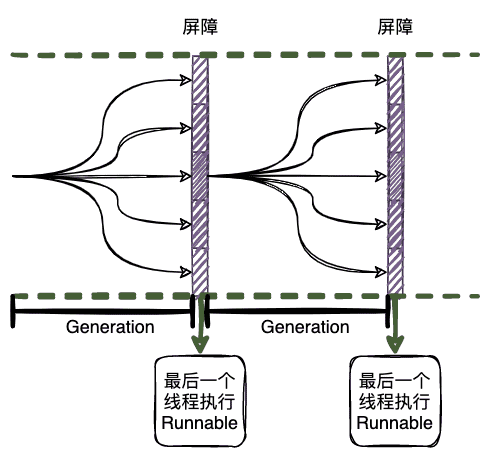
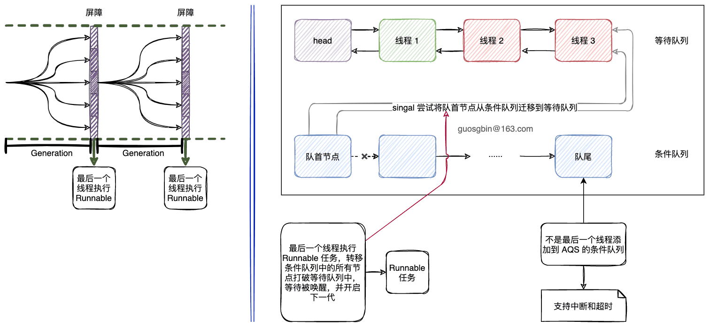

| 版本 | 内容 | 时间                   |
| ---- | ---- | ---------------------- |
| V1   | 新建 | 2022年09月22日22:01:43 |

## 概述

CyclicBarrier 直接翻译就是循环屏障，他的作用是，让一组线程到到达一个屏障时阻塞，知道最后一个线程到达屏障时，就会放行所有的线程执行自己的后续业务代码。

CyclicBarrier 和 CountDownLatch 的作用很类似，都是可以让多个线程同时开始执行。



## 案例

给个案例，假如公司团建出去玩，那么则需要等待所有同事都到齐了再出发：

```java
public static void main(String[] args) {
        int colleague = 10;
        CyclicBarrier cb = new CyclicBarrier(colleague,
                () -> System.out.println("所有同事都到齐了,开始出发..."));
        for (int i = 0; i < colleague; i++) {
            Thread t = new Thread(new GatherTask(cb), "同事『" + i + "』");
            t.start();
        }
    }
    
    static class GatherTask implements Runnable {
        private final CyclicBarrier cb;

        GatherTask(CyclicBarrier cb) {
            this.cb = cb;
        }

        @Override
        public void run() {
            try {
                TimeUnit.MILLISECONDS.sleep(ThreadLocalRandom.current().nextInt(1000));
                System.out.printf("%s 到集合地点了\n", Thread.currentThread().getName());
                // 在屏障处等待
                cb.await();
            } catch (InterruptedException e) {
                e.printStackTrace();
            } catch (BrokenBarrierException e) {
                e.printStackTrace();
            }
        }
    }
```

控制台：

```
同事『4』 到集合地点了
同事『7』 到集合地点了
同事『3』 到集合地点了
同事『2』 到集合地点了
同事『6』 到集合地点了
同事『5』 到集合地点了
同事『1』 到集合地点了
同事『0』 到集合地点了
同事『8』 到集合地点了
同事『9』 到集合地点了
所有同事都到齐了,开始出发...
```

## 属性

```java
/** The lock for guarding barrier entry */
private final ReentrantLock lock = new ReentrantLock();
/** Condition to wait on until tripped */
private final Condition trip = lock.newCondition();
/** The number of parties */
// 线程数
private final int parties;
/* The command to run when tripped */
// 最后一个通过的线程执行的任务，可以为 null，代表不执行
private final Runnable barrierCommand;
/** The current generation */
// 代
private Generation generation = new Generation();

/**
 * Number of parties still waiting. Counts down from parties to 0
 * on each generation.  It is reset to parties on each new
 * generation or when broken.
 */
// 表示当前代中还在等待的线程
private int count;
```


| 字段名                  | 作用                                                         |
| ----------------------- | ------------------------------------------------------------ |
| ReentrantLock lock      | 锁，为了配合 Condition 使用                                  |
| Condition trip          | 为了使用 Condition 的阻塞唤醒的 API                          |
| int parties             | 需要多少个线程完成await 才能继续向下执行                     |
| Runnable barrierCommand | 最后一个通过的线程执行的任务，可以为 null，代表不执行        |
| Generation generation   | 代，这是 CyclicBarrier 能够循环的关键属性，一代就代表一个循环 |
| int count               | 表示当前代中还有多少个线程未到达                             |


上面说的代，内部类 Generation，很简单就一个 broken 属性，表示当前代是否被打破。

```java
private static class Generation {
    boolean broken = false;
}
```

## 构造方法

```java
public CyclicBarrier(int parties) {
    this(parties, null);
}

public CyclicBarrier(int parties, Runnable barrierAction) {
    if (parties <= 0) throw new IllegalArgumentException();
    this.parties = parties;
    this.count = parties;
    this.barrierCommand = barrierAction;
}
```

两个构造方法，一个指定所有线程都通过后执行的 Runnable 任务，一个不指定。

## 核心方法 dowait

前面说过当线程调用 await 方法时，正常情况下就会阻塞直到最后一个线程调 await 方法。

await 方法提供了一个支持超时的重载方法，它们最终都会调用 CyclicBarrier#dowait 方法。

```java
public int await() throws InterruptedException, BrokenBarrierException {
    try {
        return dowait(false, 0L);
    } catch (TimeoutException toe) {
        throw new Error(toe); // cannot happen
    }
}

public int await(long timeout, TimeUnit unit)
    throws InterruptedException,
BrokenBarrierException,
TimeoutException {
    return dowait(true, unit.toNanos(timeout));
}
```

CyclicBarrier#dowait  方法比较长，下面我们来逐步分块分析。

### 前置的一些校验

入参

1. timed：表示是否支持超时；
2. nanos：表示超时时间；


```java
private int dowait(boolean timed, long nanos)
    throws InterruptedException, BrokenBarrierException,
TimeoutException {
    final ReentrantLock lock = this.lock;
    lock.lock();
    try {
        // 创建一个"代"
        final Generation g = generation;

        if (g.broken)
            // 如果当前代是被打破状态，直接抛出异常
            throw new BrokenBarrierException();

        if (Thread.interrupted()) {
            // 如果当前线程被中断，则打断当前代
            breakBarrier();
            throw new InterruptedException();
        }

        // ......省略部分代码###### 4.2 和 4.3分析
    } finally {
        lock.unlock();
    }
}
```

首先会创建一个 Lock 锁对象，这个对象是为了得到 Condition 对象。

获取表示当前循环的“代” Generation 对象。假如当前代已经被打破则抛出异常，假如当前线程已经中断，那么会调用 CyclicBarrier#breakBarrier 方法打破当前代，并唤醒所有在 Condition 上等待的线程。

```java
private void breakBarrier() {
    // 打断当前代
    generation.broken = true;
    // 重置 count
    count = parties;
    // 唤醒所有 await 的线程
    trip.signalAll();
}
```

这里也就说明了，假如某个线程中断之后，其他在 Condition 上阻塞的线程会被唤醒。

### 调用 await 方法不是最后一个线程

省略 CyclicBarrier#dowait 的部分代码

```java
private int dowait(boolean timed, long nanos)
    throws InterruptedException, BrokenBarrierException,
           TimeoutException {
    final ReentrantLock lock = this.lock;
    lock.lock();
    try {
        // ......省略部分代码###### 4.1 分析的代码和 4.3 待分析的代码

        // 走到这里说明当前线程不是最后一个进入的线程

        // loop until tripped, broken, interrupted, or timed out
        // 自旋，直到条件满足，当前代被打破，当前线程被中断，或者超时
        for (;;) {
            try {
                // timed false 表示不带超时的条件，表示一直阻塞
                if (!timed)
                    // 将当前线程封装成节点加入到 condition 队列中等待被唤醒
                    trip.await();
                else if (nanos > 0L)
                    // 带超时的 await
                    nanos = trip.awaitNanos(nanos);
            } catch (InterruptedException ie) {
                // 走到到这里面说明被中断了，
                // condition 的 await 方法抛出异常的地方是在 condition 队列中被中断，才会抛出中断异常
                if (g == generation && ! g.broken) {
                    // 说明当前代没有被打破，需要打破当前代，并唤醒所有等待的线程
                    breakBarrier();
                    // 继续向外抛异常
                    throw ie;
                } else {
                    // We're about to finish waiting even if we had not
                    // been interrupted, so this interrupt is deemed to
                    // "belong" to subsequent execution.
                    // 整个中断标记
                    Thread.currentThread().interrupt();
                }
                // 到这里当前代肯定是被打破了的
            }

            // 1.正常情况，当前 barrier 已经开启了新的一代
            // 2.当前代被打断了
            // 3.当前代超时了

            if (g.broken)
                // 说明当前代被打破了，抛个异常
                throw new BrokenBarrierException();

            if (g != generation)
                // 说明当前代正常结束了，直接返回
                // 正常结束时在最后一个线程里调用了 CyclicBarrier.nextGeneration 方法开启下一代
                return index;

            if (timed && nanos <= 0L) {
                // 说明当前代超时了，需要打破当前代
                breakBarrier();
                throw new TimeoutException();
            }
        }
    } finally {
        lock.unlock();
    }
}
```

OK 前面说过只有所有的线程到达屏障处，才会继续向下执行自己的业务代码，也就是说不是最后一个线程就会阻塞。


上面的代码中可以分成两部分，一部分是唤醒前的操作，一部分是唤醒后的操作

唤醒前的操作：

1. 不是最后一个线程调的 await 方法，就会进入一个自旋中，这个自旋是为了**防止虚假唤醒**。
2. 根据是否支持超时，来调用 Condition 的不同的阻塞等待的 API。
3. 假如线程在阻塞的时候被中断，此时也会分两个情况
   1. 当前代被打破，则需要调用 CyclicBarrier#breakBarrier 方法打破当前代，并唤醒所有在 Condition 上等待的线程。继续向外抛出中断异常。
   2. 当前代已经过了或者当前代没有被打破，就设置下线程的中断标记。

唤醒后的操作：

走出上面的 try...catch 块有如下几种情况：

1. 第一种情况就是最后一个线程正常唤醒了阻塞的线程；
2. 第二种情况就是当前“代”被打破了，具体的情况可能是某个线程被中断了或者调用了 CyclicBarrier#reset 方法，会间接调用 CyclicBarrier#breakBarrier 方法唤醒所有线程了；
3. 第三种就是某个线程调用的 await 方法超时了，此时也会走到这里；

### 调用 await 方法是最后一个线程

```java
private int dowait(boolean timed, long nanos)
    throws InterruptedException, BrokenBarrierException,
           TimeoutException {
    final ReentrantLock lock = this.lock;
    lock.lock();
    try {
        // ......省略部分代码###### 4.1 分析的代码

        // index 的作用是，找到最后一个 await 的线程来调用 barrierCommand 任务
        int index = --count;
        if (index == 0) {  // tripped
            // 标记执行任务是否是正常执行结束，false 表示有问题
            boolean ranAction = false;
            try {
                final Runnable command = barrierCommand;
                if (command != null)
                    // 执行任务
                    command.run();
                ranAction = true;
                // 当前代结束，开启下一代
                nextGeneration();
                return 0;
            } finally {
                if (!ranAction)
                    // 执行任务发生异常，打断当前代
                    breakBarrier();
            }
            
            // ......省略部分代码###### 4.2 分析的代码
        }
    } finally {
        lock.unlock();
    }
}
```

最后一个线程的任务就是执行指定的 Runnable 任务（假如存在的话），这个任务是在构造方法中指定的。

然后调用 CyclicBarrier#nextGeneration 方法，开启下一个循环。

```java
private void nextGeneration() {
    // signal completion of last generation
    // 唤醒所有等待的线程
    trip.signalAll();
    // set up next generation
    // 重置 count
    count = parties;
    // 开启下一代
    generation = new Generation();
}
```

假如执行任务发送异常的话，就调用 CyclicBarrier#breakBarrier 方法打破当前代。

### dowait 方法小结

假如在构造方法中指定了 5 个线程和一个 Runnable 任务。5 个线程依次调用 await 方法，正常情况下最后一个调用 await 的线程会执行 Runnable 任务，然后开启下一个循环。

阻塞当前线程直到所有的线程都在此代（屏障）上调用了 await 方法，或者等待超时了。

不是最后一个调用 await 的方法会在以下几种情况发生前一直阻塞：

1. 最后一个线程调了 await 方法，会唤醒所有阻塞的线程；
2. 外部线程中断了当前线程，当前代（屏障）会被打破，会唤醒所有阻塞的线程；
3. 外部线程中断了某个阻塞中的线程，当前代（屏障）会被打破，会唤醒所有阻塞的线程；
4. 支持超时的模式下，当前线程的阻塞的时间到了，则会打破当前代（屏障），会唤醒所有阻塞的线程；
5. 支持超时的模式下，别的线程的阻塞的时间到了，则会打破当前代（屏障），会唤醒所有阻塞的线程；
6. 外部线程调用了 CyclicBarrier#reset 方法打破了当前代（屏障），会唤醒所有阻塞的线程；

## CyclicBarrier#reset

其实就是打破当前代（屏障），并且开启下一代（屏障）。

```java
public void reset() {
    final ReentrantLock lock = this.lock;
    lock.lock();
    try {
        breakBarrier();   // break the current generation
        nextGeneration(); // start a new generation
    } finally {
        lock.unlock();
    }
}
```

## CyclicBarrier 和 CountDownLatch 的比较

CyclicBarrier 和 CountDownLatch 的作用很类似，下面说下他们的区别。

1. CountDownLatch 是使用内部类 Sync 继承 AQS 的，使用的是 AQS 的共享模式。而 CyclicBarrier 是使用 AQS 的 Condition 机制来做等待和唤醒的；
2. CountDownLatch 的计数器只能使用一次，而 CyclicBarrier 能够使用多次；
3. CyclicBarrier 在所有线程到达屏障之后可选择执行一个 Runnable 任务；

## 小结


