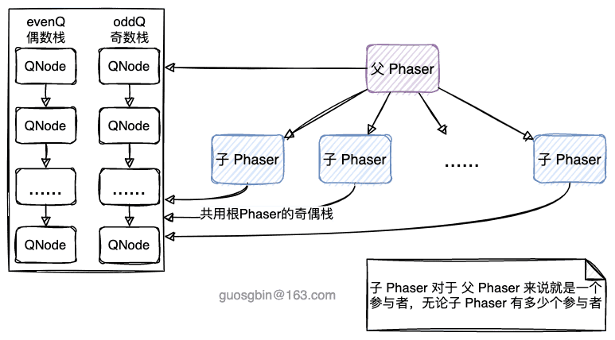
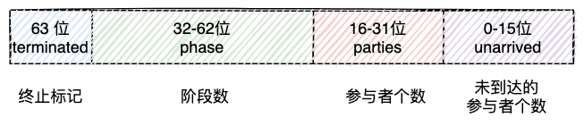
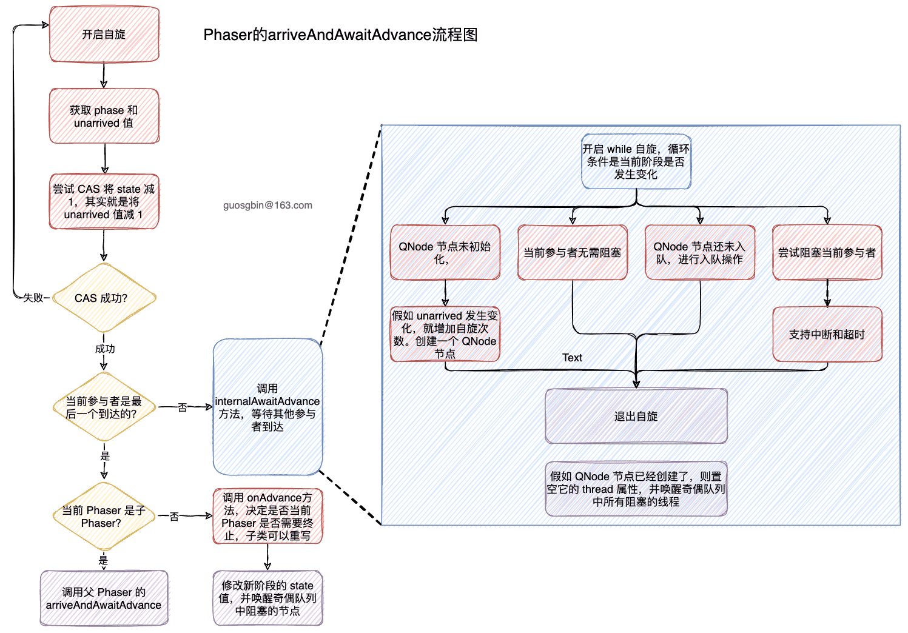

| 版本 | 内容 | 时间                   |
| ---- | ---- | ---------------------- |
| V1   | 新建 | 2022年09月25日00:35:53 |

## 概述

Phaser 是 JDK7 新加的类，提供了一些类似 CountDownLatch 和 CyclicBarrier 的功能，这两个同步组件能实现的，Phaser 都能实现。

## Phaser 的一些概念

- **parties（参与者）**：和 CountDownLatch 和 CyclicBarrier 的构造方法的参数的含义差不多，**就是参与的线程**。CyclicBarrier 的参与者的个数在构造方法中指定之后，就不能再改变了。而 Phaser 的参与者的个数可以在构造方法中指定之外，还可以随时注册和注销；
- **register（注册）/ deregister（注销）**：调用注册系列的方法就是通知 Phaser 当前参与者的个数增加了。调用注销类型的方法就是通知当前 Phaser 的参与者个数减少了；
- **phase（阶段）**：表示执行任务的阶段，初始值是 0，当加到 Integer.MAX_VALUE 时就重新到 0 计算。
- **arrive（到达）/advance（进阶）**：arrive 就是某个参与者到达屏障的意思。advance 就是当所有参与者都到达了屏障，阶段（phase）就发生进阶，其实就是阶段（phase）加 1。
- **termination（终止状态）**：代表当前 Phaser 已经终止了。
- **tiering（分层）**：当一个Phaser有大量参与者（parties）的时候，内部的同步操作会使性能急剧下降，而分层可以降低竞争，从而减小因同步导致的额外开销。
  - 子 Phaser 的 parties 线程可以有多个，但是对于父 Phaser 来说就只视为一个；
  - 只有子 Phaser 的所有参与者都达到屏障后，才会通知父 Phaser 当前子 Phaser 已经到达；
  - 只有子 Phaser 的所有参与者都注销后，才会向父 Phaser 注销当前子 Phaser；
  - 无论是父子 Phaser 共用的都是 root Phaser 的奇偶队列；





## 案例

### 案例 1

可以使用 Phaser 代替 CountDownLatch 来作为开关，让多个线程在某个时刻同时执行

```java
@Test
public void test01() {
    Runnable task1 = () -> {
        System.out.println("晓明在煮饭..." + System.currentTimeMillis());
    };
    Runnable task2 = () -> {
        System.out.println("冈冈在洗菜..." + System.currentTimeMillis());
    };
    Runnable task3 = () -> {
        System.out.println("炸雷在煲汤..." + System.currentTimeMillis());
    };
    List<Runnable> tasks = new ArrayList<>(Arrays.asList(task1, task2, task3));
    runTasks(tasks);
    System.out.println("完毕" + System.currentTimeMillis());
}

/**
 * 执行任务
 */
void runTasks(List<Runnable> tasks) {
    final Phaser phaser = new Phaser(1); // "1" to register self
    // create and start threads
    for (final Runnable task : tasks) {
        phaser.register();
        new Thread(() -> {
            phaser.arriveAndAwaitAdvance(); // await all creation
            task.run();
        }).start();
    }
    System.out.println("为了更明显，这里等待 1 秒...");
    sleep(TimeUnit.SECONDS, 1);
    // 等待所有线程准备就绪，就继续向下执行
    phaser.arriveAndDeregister();
}
```

控制台：

```
为了更明显，这里等待 1 秒...
完毕1664035934424
晓明在煮饭...1664035934424
冈冈在洗菜...1664035934424
炸雷在煲汤...1664035934424
```

### 案例 2

CyclicBarrier 能在每次循环最后执行一个 Runnable 任务，Phaser 也可以实现类似的功能，需要重写 Phaser#onAdvance 方法。

下面的案例是重写 Phaser#onAdvance 方法，让 Phaser 只执行三个阶段。

```java
@Test
public void test02() {
    Runnable task1 = () -> {
        System.out.println("晓明在煮饭..." + System.currentTimeMillis());
    };
    Runnable task2 = () -> {
        System.out.println("冈冈在洗菜..." + System.currentTimeMillis());
    };
    Runnable task3 = () -> {
        System.out.println("炸雷在煲汤..." + System.currentTimeMillis());
    };
    List<Runnable> tasks = new ArrayList<>(Arrays.asList(task1, task2, task3));
    // 重复执行 3 次
    startTasks(tasks, 3);
}

void startTasks(List<Runnable> tasks, final int iterations) {
    final Phaser phaser = new Phaser() {
        // 返回 true 表示需要停止 phaser
        protected boolean onAdvance(int phase, int registeredParties) {
            System.out.printf("=====[phase=%s]=====[parties=%s]=====\n", phase, registeredParties);
            return phase >= iterations - 1 || registeredParties == 0;
        }
    };
    phaser.register();
    for (final Runnable task : tasks) {
        phaser.register();
        new Thread(() -> {
            while (!phaser.isTerminated()) {
                task.run();
                phaser.arriveAndAwaitAdvance();
            }
        }).start();
    }
    phaser.arriveAndDeregister(); // deregister self, don't wait
}
```

控制台：

```
晓明在煮饭...1664036093841
冈冈在洗菜...1664036093842
炸雷在煲汤...1664036093842
=====[phase=0]=====[parties=3]=====
炸雷在煲汤...1664036093844
冈冈在洗菜...1664036093844
晓明在煮饭...1664036093844
=====[phase=1]=====[parties=3]=====
晓明在煮饭...1664036093845
炸雷在煲汤...1664036093845
冈冈在洗菜...1664036093845
=====[phase=2]=====[parties=3]=====
```

### Phaser 的分层案例

利用Phaser的分层来实现高并发时的优化。

```java
@Test
public void test03() {
    int iterations = 3;
    Phaser phaser = new Phaser() {
        @Override
        protected boolean onAdvance(int phase, int registeredParties) {
            System.out.printf("=====[phase=%s]=====[parties=%s]=====\n", phase, registeredParties);
            return phase >= iterations - 1 || registeredParties == 0;
        }
    };

    Task[] tasks = new Task[10];
    build(tasks, 0, tasks.length, phaser);
    for (int i = 0; i < tasks.length; i++) {          // 执行任务
        Thread thread = new Thread(tasks[i]);
        thread.start();
    }
}

// 每个 Phaser 最多三个参与者
final int TASKS_PER_PHASER = 3;

/**
 * 每个 Phaser 最多分 3 个任务
 */
void build(Task[] tasks, int lo, int hi, Phaser phaser) {
    if (hi - lo < TASKS_PER_PHASER) {
        for (int k = lo; k < hi; ++k)
            tasks[k] = new Task(phaser);
    } else {
        for (int i = lo; i < hi; i += TASKS_PER_PHASER) {
            int j = Math.min(i + TASKS_PER_PHASER, hi);
            Phaser subPhaser = new Phaser(phaser);
            for (int k = i; k < j; ++k)
                tasks[k] = new Task(subPhaser);         // assumes new Task(ph) performs ph.register()
        }
    }

}
```

## 原理

### 同步状态

既然有 Phaser 有这么多概念，那么就需要字段来存储这些数据。

Phaser 中使用一个 long 类型的变量来保存 Phaser 的状态，按照不同的位划分区域，代表不同的含义。

```java
private volatile long state;
```

对于这个 state 的解释如下：

- unarrived：未到达屏障的参与者的个数 (bits  0-15)；
- parties：总参与者（需要等待的参与者）的个数 (bits 16-31)；
- phase：当前阶段 (bits 32-62)；
- terminated：屏障终止标志 (bit  63 / sign)；





既然用一个状态表示这么多信息，那肯定少不了位运算了，

```java
// 最多的参与者个数 65535
private static final int  MAX_PARTIES     = 0xffff;
// 最多 PHASE 个数，int 最大值
private static final int  MAX_PHASE       = Integer.MAX_VALUE;
// 参与者个数位移数
private static final int  PARTIES_SHIFT   = 16;
// PHASE 个数位移数
private static final int  PHASE_SHIFT     = 32;
// 用于计算未到达的参与者数目
private static final int  UNARRIVED_MASK  = 0xffff;      // to mask ints
// 用于计算参与者数目
private static final long PARTIES_MASK    = 0xffff0000L; // to mask longs
// counts的掩码，counts等于参与者数和未完成的参与者数的'|'操作
private static final long COUNTS_MASK     = 0xffffffffL;
// 表示屏障终止的标志位
private static final long TERMINATION_BIT = 1L << 63;
```


还有一些特殊值：

```java
// some special values
// 一个参与者到达
private static final int  ONE_ARRIVAL     = 1;
// 一个参与者
private static final int  ONE_PARTY       = 1 << PARTIES_SHIFT;
// 注销一个参与者
private static final int  ONE_DEREGISTER  = ONE_ARRIVAL|ONE_PARTY;
// 初始值
private static final int  EMPTY           = 1;
```


### 构造方法

Phaser 有四个构造方法，最终都会调用到下面这个

```java
public Phaser(Phaser parent, int parties) {
    if (parties >>> PARTIES_SHIFT != 0)
        // 超过了 65535 个
        throw new IllegalArgumentException("Illegal number of parties");
    // 初始状态阶段是 0
    int phase = 0;
    this.parent = parent;
    if (parent != null) {
        // 设置根节点
        final Phaser root = parent.root;
        this.root = root;
        // 共用父节点的奇偶无锁栈
        this.evenQ = root.evenQ;
        this.oddQ = root.oddQ;
        if (parties != 0)
            // 假如参与者不是 0，则向父 Phaser 注册一个参与者，注意这里是 1 个
            phase = parent.doRegister(1);
    }
    else {
        // 根节点设置为自己
        this.root = this;
        // 偶数栈
        this.evenQ = new AtomicReference<QNode>();
        // 奇数栈
        this.oddQ = new AtomicReference<QNode>();
    }
    // 初始化 Phaser 的 state
    this.state = (parties == 0) ? (long)EMPTY :
    ((long)phase << PHASE_SHIFT) |
        ((long)parties << PARTIES_SHIFT) |
        ((long)parties);
}
```

对于不分层的 Phaser 来说，就是设置根节点和奇偶栈，然后初始化 Phaser 的 state 字段。

对于分层的 Phaser，则需要拿父级 Phaser 的 root 作为自己的 root，并且共用根节点的奇偶栈，假如子 Phaser 的参与者的个数不是 0，那么需要向父 Phaser 注册一个参与者。

也就是说，无论子 Phaser 有多少个参与者，它只会向父 Phaser 注册一个参与者，代表自己。

需要注意的是，假如没有设置参与者梳理 parties 的值，默认是特殊值 EMPTY，其实就是 1。TODO-KWOK 为什么这么设计？

### 栈节点 QNode

这里主要分析栈节点的属性，方法在后面用到了再分析。

```java
static final class QNode implements ForkJoinPool.ManagedBlocker {
    final Phaser phaser;
    // 当前节点所处的屏障 Phaser 阶段
    final int phase;
    // 当前等待节点封装的线程是否可被中断，true-可被中断
    final boolean interruptible;
    // 当前等待节点是否支持等待超时，true-支持
    final boolean timed;
    // 当前等待节点线程在等待的过程中是否被中断过的标记，true-被中断过了
    boolean wasInterrupted;
    // 当前等待节点等待的超时时间
    long nanos;
    // 当前等待节点等待的超时的时间点
    final long deadline;
    // 当前等待节点的线程，可能为空，当前节点被取消等待
    volatile Thread thread; // nulled to cancel wait
    // 由于QNode是个链表，当前等待节点的下一等待节点
    QNode next;
}
```

### 注册一个或多个参与者

在 Phaser 中可以在构造方法中指定参与者的个数，除此之外还可以调用 register、bulkRegiste来增加参与者的个数。

```java
// 注册单个参与者到 phaser
public int register() {
    return doRegister(1);
}

// 注册多个参与者到 phaser
public int bulkRegister(int parties) {
    if (parties < 0)
        throw new IllegalArgumentException();
    if (parties == 0)
        return getPhase();
    return doRegister(parties);
}
```


最终都是调用的 doRegister 方法

```java
private int doRegister(int registrations) {
    // adjustment to state
    // 这里相当于 parties 和 unarrived 都加了 registrations
    long adjust = ((long)registrations << PARTIES_SHIFT) | registrations;
    final Phaser parent = this.parent;
    int phase;
    for (;;) {
        long s = (parent == null) ? state : reconcileState();
        int counts = (int)s;
        // 位移获取 parties 和 unarrived
        int parties = counts >>> PARTIES_SHIFT;
        int unarrived = counts & UNARRIVED_MASK;
        // 检查参与者个数是否有溢出
        if (registrations > MAX_PARTIES - parties)
            throw new IllegalStateException(badRegister(s));
        phase = (int)(s >>> PHASE_SHIFT);
        if (phase < 0)
            break;
        // 不是第一个参与者
        if (counts != EMPTY) {                  // not 1st registration
            if (parent == null || reconcileState() == s) {
                // unarrived 等于 0 说明当前阶段正在执行 onAdvance() 方法，等待其执行完毕
                if (unarrived == 0)             // wait out advance
                    root.internalAwaitAdvance(phase, null);
                // 否则就修改 state 的值，增加 adjust，如果成功就跳出循环
                else if (UNSAFE.compareAndSwapLong(this, stateOffset,
                                                   s, s + adjust))
                    break;
            }
        }
        // 是第一个参与者
        else if (parent == null) {              // 1st root registration
            // 计算 state 的值
            long next = ((long)phase << PHASE_SHIFT) | adjust;
            // 修改 state 的值，如果成功就跳出循环
            if (UNSAFE.compareAndSwapLong(this, stateOffset, s, next))
                break;
        }
        // 多层级阶段的处理方式
        else {
            synchronized (this) {               // 1st sub registration
                if (state == s) {               // recheck under lock
                    phase = parent.doRegister(1);
                    if (phase < 0)
                        break;
                    // finish registration whenever parent registration
                    // succeeded, even when racing with termination,
                    // since these are part of the same "transaction".
                    while (!UNSAFE.compareAndSwapLong
                           (this, stateOffset, s,
                            ((long)phase << PHASE_SHIFT) | adjust)) {
                        s = state;
                        phase = (int)(root.state >>> PHASE_SHIFT);
                        // assert (int)s == EMPTY;
                    }
                    break;
                }
            }
        }
    }
    return phase;
}
```

首先就是开启一个自旋，总共有三个分支：

CASE1：调用 register 方法注册的是该 Phaser 的第一个参与者

- 假如当前阶段的 unarrived 是 0，说明当前 Phaser 的所有参与者都到达屏障了，需要等待 onAdvance() 方法执行完毕（等待的具体实现后面分析）；
- 假如当前阶段的 unarrived 不是 0，尝试 CAS 更新 state 值，更新成功则跳出自旋，否则继续自旋；

CASE2：调用 register 方法注册的不是该 Phaser 的第一个参与者，直接尝试更新 state 值；

CASE3：说明当前注册的 Phaser 是一个子 Phaser，需要向父 Phaser 注册一个参与者，代表自己；

### arrive 参与者到达屏障

这个方法就是表示当前参与者已经到达屏障处了，但是不会阻塞当前线程。

```java
public int arrive() {
    return doArrive(ONE_ARRIVAL);
}
```

Phaser#doArrive

```java
private int doArrive(int adjust) {
    final Phaser root = this.root;
    for (;;) {
        long s = (root == this) ? state : reconcileState();
        // 获取当前阶段数
        int phase = (int)(s >>> PHASE_SHIFT);
        if (phase < 0)
            return phase;
        int counts = (int)s;
        // 获取当前阶段还有多少参与者未到达屏障
        int unarrived = (counts == EMPTY) ? 0 : (counts & UNARRIVED_MASK);
        if (unarrived <= 0)
            throw new IllegalStateException(badArrive(s));
        // 尝试 CAS 更新 state, 其实就是尝试将 unarrived 减 1
        if (UNSAFE.compareAndSwapLong(this, stateOffset, s, s-=adjust)) {
            // unarrived == 1 说明当前参与者是最后一个到达屏障的
            if (unarrived == 1) {
                // 组装下一个阶段的 state
                long n = s & PARTIES_MASK;  // base of next state
                int nextUnarrived = (int)n >>> PARTIES_SHIFT;
                if (root == this) {
                    // 调用子类可重写的 onAdvance 方法
                    if (onAdvance(phase, nextUnarrived))
                        n |= TERMINATION_BIT;
                    else if (nextUnarrived == 0)
                        // unarrived 的初始值是 1
                        n |= EMPTY;
                    else
                        n |= nextUnarrived;
                    // 阶段 phase 加 1
                    int nextPhase = (phase + 1) & MAX_PHASE;
                    n |= (long)nextPhase << PHASE_SHIFT;
                    // CAS 更新 state 值
                    UNSAFE.compareAndSwapLong(this, stateOffset, s, n);
                    // 移除节点并唤醒线程
                    releaseWaiters(phase);
                }
                else if (nextUnarrived == 0) { // propagate deregistration
                    phase = parent.doArrive(ONE_DEREGISTER);
                    UNSAFE.compareAndSwapLong(this, stateOffset,
                                              s, s | EMPTY);
                }
                else
                    phase = parent.doArrive(ONE_ARRIVAL);
            }
            return phase;
        }
    }
}
```

Phaser#doArrive 方法就是开启一个自旋尝试更新 state 的值，更新成功就会退出自旋。

假如当前线程是最后一个参与者，则会去组装下一个阶段的 state 值。

1. 假如当前 Phaser 是 root 的话，就会先调用 Phaser#onAdvance 方法判断 Phaser 是否需要终止，然后 CAS 更新 state，最后唤醒在奇偶栈中阻塞的线程；
2. 假如当前 Phaser 是子 Phaser 的话，
   1. 下个阶段的参与者个数是 0 的话，则向父级 Phaser 注销自己，然后更新自己的 state。
   2. 下个阶段的参与者大于 0 的话，则向父级 Phaser 注册自己，注意这里是注册的 1 个，这里也说明了，子 Phaser 的所有参与者都到达后，只会向父级 Phaser 注册 1 个。

### arriveAndDeregister 到达并注销

这个方法和 arrive 方法调用的都是 Phaser#doArrive 方法，只是入参不一样。

arriveAndDeregister 表示当前参与者到达屏障，并且注销自己，这个方法也不会阻塞当前线程。

```java
public int arriveAndDeregister() {
    return doArrive(ONE_DEREGISTER);
}
```

### awaitAdvance 等待所有参与者到达

一般先调用 arrive 或者 arriveAndDeregister 后，再调用该方法等待所有参与者到达屏障。

需要调用 Phaser#internalAwaitAdvance 方法去等待，这个方法后面讲解。

```java
public int awaitAdvance(int phase) {
    final Phaser root = this.root;
    // 获取 state
    long s = (root == this) ? state : reconcileState();
    // 获取当前 phaser 的阶段值
    int p = (int)(s >>> PHASE_SHIFT);
    if (phase < 0)
        return phase;
    if (p == phase)
        // 等待 onAdvance() 方法执行完毕
        return root.internalAwaitAdvance(phase, null);
    return p;
}
```

### arriveAndAwaitAdvance 到达并等待其他参与者

这个方法的功能有点类似 CyclicBarrier 的 await 方法。

这个方法的功能等效于调用 `awaitAdvance(arrive())`。其实这个方法的流程和 doArrive 方法的基本上一样，区别就是假如当前参与者不是最后一个，则会调用  Phaser#internalAwaitAdvance  阻塞等待所有参与者到达。


这个方法并不支持中断和超时，假如需要支持中断和超时可以使用 Phaser#awaitAdvanceInterruptibly(int) 或者 Phaser#awaitAdvanceInterruptibly(int, long, TimeUnit) 方法。

```java
public int arriveAndAwaitAdvance() {
    // Specialization of doArrive+awaitAdvance eliminating some reads/paths
    final Phaser root = this.root;
    for (;;) {
        // state的值
        long s = (root == this) ? state : reconcileState();
        // 获取 phase
        int phase = (int)(s >>> PHASE_SHIFT);
        if (phase < 0)
            return phase;
        int counts = (int)s;
        // 获取 unarrived
        int unarrived = (counts == EMPTY) ? 0 : (counts & UNARRIVED_MASK);
        if (unarrived <= 0)
            throw new IllegalStateException(badArrive(s));
        // CAS 尝试更新 unarrived 的值，将其减1
        if (UNSAFE.compareAndSwapLong(this, stateOffset, s, s -= ONE_ARRIVAL)) {
            if (unarrived > 1)
                // 说明当前线程不是最后一个到达的线程，等待onAdvance()方法执行完毕
                return root.internalAwaitAdvance(phase, null);
            if (root != this)
                return parent.arriveAndAwaitAdvance();
            // 获取参与者的数量
            long n = s & PARTIES_MASK;  // base of next state
            // 获取下一个阶段的 unarrived 的值
            int nextUnarrived = (int)n >>> PARTIES_SHIFT;
            // 调用子类可重写的 onAdvance 方法
            if (onAdvance(phase, nextUnarrived))
                // 置为终止状态
                n |= TERMINATION_BIT;
            else if (nextUnarrived == 0)
                n |= EMPTY;
            else
                // n 加上unarrived的值
                n |= nextUnarrived;
            // 下一个阶段等待当前阶段加 1
            int nextPhase = (phase + 1) & MAX_PHASE;
            // n 加上下一阶段的值
            n |= (long)nextPhase << PHASE_SHIFT;
            // 修改state的值为n
            if (!UNSAFE.compareAndSwapLong(this, stateOffset, s, n))
                return (int)(state >>> PHASE_SHIFT); // terminated
            // 唤醒其它参与者并进入下一个阶段
            releaseWaiters(phase);
            return nextPhase;
        }
    }
}
```

### 等待的核心方法

```java
private int internalAwaitAdvance(int phase, QNode node) {
    // assert root == this;
    // 保证旧的队列为空，其实就是移除并唤醒之前的节点
    releaseWaiters(phase-1);          // ensure old queue clean
    boolean queued = false;           // true when node is enqueued
    int lastUnarrived = 0;            // to increase spins upon change
    // 自旋的次数
    int spins = SPINS_PER_ARRIVAL;
    long s;     // 当前循环的 state
    int p;      // 当前循环的 phase
    // 检查当前阶段是否变化，如果变化了说明进入下一个阶段了，这时候就没有必要自旋了
    while ((p = (int)((s = state) >>> PHASE_SHIFT)) == phase) {
        if (node == null) {           // spinning in noninterruptible mode
            // 未完成的参与者数量
            int unarrived = (int)s & UNARRIVED_MASK;
            // unarrived 有变化，增加自旋次数
            if (unarrived != lastUnarrived && (lastUnarrived = unarrived) < NCPU)
                spins += SPINS_PER_ARRIVAL;
            boolean interrupted = Thread.interrupted();
            // 自旋次数完了，则新建一个节点，记录当前线程是否被中断
            if (interrupted || --spins < 0) { // need node to record intr
                node = new QNode(this, phase, false, false, 0L);
                node.wasInterrupted = interrupted;
            }
        }
        else if (node.isReleasable()) // done or aborted
            break;
        else if (!queued) {           // push onto queue
            // 节点入队列
            AtomicReference<QNode> head = (phase & 1) == 0 ? evenQ : oddQ;
            QNode q = node.next = head.get();
            if ((q == null || q.phase == phase) &&
                (int)(state >>> PHASE_SHIFT) == phase) // avoid stale enq
                queued = head.compareAndSet(q, node);
        }
        else {
            try {
                // 当前线程进入阻塞状态，等待被唤醒
                ForkJoinPool.managedBlock(node);
            } catch (InterruptedException ie) {
                node.wasInterrupted = true;
            }
        }
    }

    if (node != null) {
        // 置空节点中的线程
        if (node.thread != null)
            node.thread = null;       // avoid need for unpark()
        if (node.wasInterrupted && !node.interruptible)
            Thread.currentThread().interrupt();
        if (p == phase && (p = (int)(state >>> PHASE_SHIFT)) == phase)
            return abortWait(phase); // possibly clean up on abort
    }
    // 唤醒当前阶段阻塞着的线程
    releaseWaiters(phase);
    return p;
}
```

这个方法一般是某个参与者需要在某个地方等待所有参与者到达屏障。下面分析下这个方法的流程。

1. 调用 Phaser#releaseWaiters 移除并唤醒上一个阶段 phase 阻塞的节点；
2. 开启自旋，自旋的判断条件是检查当前 Phaser 的阶段是否发生变化：
   1. CASE1  (node == null)：根据 unarrived 数量是否发生变化，来决定是否增加自旋次数。 然后创建一个新的节点；
   2. CASE2 (node.isReleasable())：根据是否支持超时和中断等，来判断是否可退出自旋；
   3. CASE3 (!queued)：需要将节点入队，根据 Phaser 阶段的奇偶性，选择一个队列入队；
   4. CASE4：调用 ForkJoinPool#managedBlock 方法阻塞当前线程，这里会根据 QNode 的QNode#isReleasable 和 QNode#block 方法决定是否阻塞当前线程。
3. 退出循环，说明当前线程阻塞被唤醒了，也可能压根就没有阻塞，假如节点存在就做一些处理。最后唤醒当前阶段队列中阻塞的其他线程。

### QNode 的两个方法

这两个方法主要在 ForkJoinPool#managedBlock 方法中调用，而 ForkJoinPool#managedBlock 方法是在 Phaser#internalAwaitAdvance 的自旋中调用的。

我们看下 ForkJoinPool#managedBlock 的代码，省略了部分

```java
public static void managedBlock(ManagedBlocker blocker)
        throws InterruptedException {
        ForkJoinPool p;
        ForkJoinWorkerThread wt;
        Thread t = Thread.currentThread();
        if ((t instanceof ForkJoinWorkerThread) &&
           // 省略...
        }
        else {
            do {} while (!blocker.isReleasable() &&
                         !blocker.block());
        }
    }
```

可以看到 else 分支里面就是一个 do...while 循环，里面的条件就是 QNode 中的两个方法。

- ForkJoinPool.ManagedBlocker#isReleasable：返回 true 表示不需要阻塞当前线程；
- ForkJoinPool.ManagedBlocker#block：尝试阻塞当前线程，返回 true 表示不需要阻塞当前线程；

下面看 QNode 中这两个方法的实现。

```java
public boolean isReleasable() {
    if (thread == null)
        return true;
    // 不是当前阶段不阻塞了
    if (phaser.getPhase() != phase) {
        thread = null;
        return true;
    }
    // 当前线程被中断了，赋值中断标记
    if (Thread.interrupted())
        wasInterrupted = true;
    // 假如当前线程被中断了，而且当前线程封装的节点允许中断，那么就会返回 true
    if (wasInterrupted && interruptible) {
        thread = null;
        return true;
    }
    // 支持超时的判断
    if (timed) {
        if (nanos > 0L) {
            nanos = deadline - System.nanoTime();
        }
        if (nanos <= 0L) {
            thread = null;
            return true;
        }
    }
    return false;
}

public boolean block() {
    if (isReleasable())
        return true;
    else if (!timed)
        LockSupport.park(this);
    else if (nanos > 0L)
        LockSupport.parkNanos(this, nanos);
    return isReleasable();
}
```

## 小结


