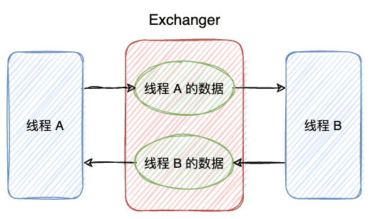
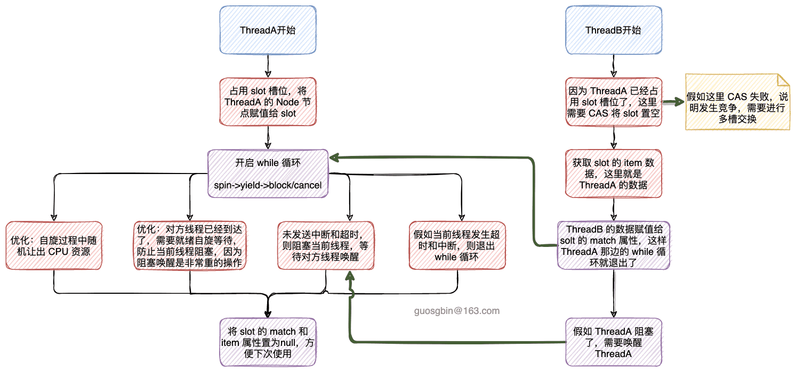
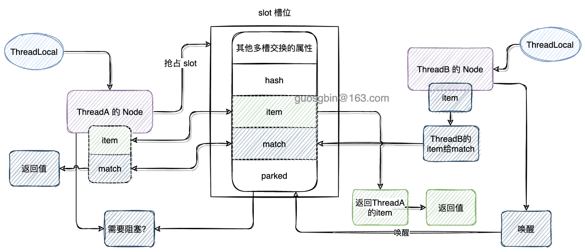
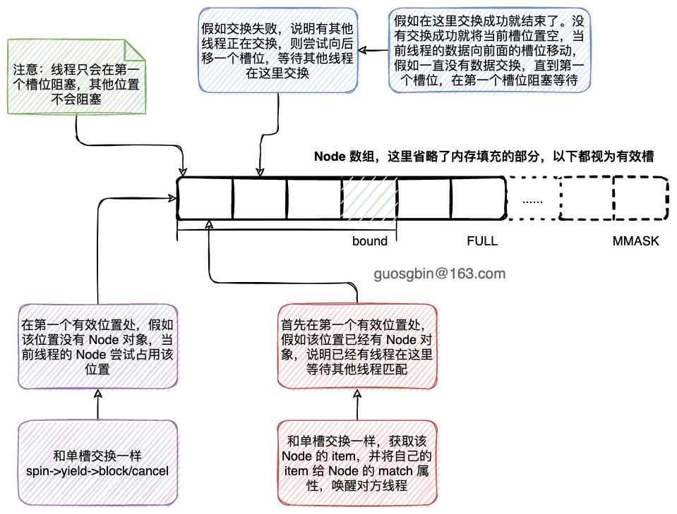

| 版本 | 内容 | 时间                   |
| ---- | ---- | ---------------------- |
| V1   | 新建 | 2022年09月26日23:57:49 |

## 概述

Exchanger 的作用是交换两个线程的数据，Exchanger 可以被视为SynchronousQueue的双向形式。

举个例子，线程 A 和 线程 B 交换数据，假如线程 A 数据准备好了，而另外一个线程的数据还没有准备好，此时会让线程 A 等待，直到线程 B 数据准备好了，就交换彼此的数据。



## 案例

```java
@Test
public void test01() throws InterruptedException {
    // 定义 Exchanger 类，该类是一个泛型类，String 类型标明一对线程交换的数据只能是 String 类型
    Exchanger<String> exchanger = new Exchanger<>();
    // 定义线程T1
    Thread t1 = new Thread(() -> {
        try {
            // 随机休眠1～10秒钟
            TimeUnit.SECONDS.sleep(ThreadLocalRandom.current().nextInt(10));
            // 执行 exchange 方法，将对应的数据传递给 T2 线程，同时从 T2 线程获取交换的数据
            // 返回值是T2线程中返回的数据
            System.out.println(Thread.currentThread().getName() + " 开始..." + LocalDateTime.now());
            String dataFromT2 = exchanger.exchange("T1的数据");
            System.out.println(Thread.currentThread().getName() + " 获得: " + dataFromT2 + ">>>"+LocalDateTime.now());
        } catch (InterruptedException e) {
            e.printStackTrace();
        }
        System.out.println(Thread.currentThread().getName() + " 结束...");
    }, "T1");

    // 定义线程T1
    Thread t2 = new Thread(() -> {
        try {
            // 随机休眠1～10秒钟
            TimeUnit.SECONDS.sleep(ThreadLocalRandom.current().nextInt(10));
            // 执行exchange方法，将对应的数据传递给T2线程，同时从T2线程获取交换的数据
            // 返回值是T1线程中返回的数据
            System.out.println(Thread.currentThread().getName() + " 开始..." + LocalDateTime.now());
            String dataFromT1 = exchanger.exchange("T2的数据");
            System.out.println(Thread.currentThread().getName() + " 获取: " + dataFromT1 + ">>>"+LocalDateTime.now());
        } catch (InterruptedException e) {
            e.printStackTrace();
        }
        System.out.println(Thread.currentThread().getName() + " 结束...");
    }, "T2");

    t1.start();
    t2.start();

    t1.join();
    t1.join();
}
```

控制台：

从控制台的输出可以看到，线程 T2 先到，T2 会等待直到 T1到达后并交换数据。

```
T2 开始...2022-09-26T16:27:49.078
T1 开始...2022-09-26T16:27:57.059
T1 获得: T2的数据>>>2022-09-26T16:27:57.059
T1 结束...
T2 获取: T1的数据>>>2022-09-26T16:27:57.060
T2 end...
```


## Exchanger 原理

### 构造方法

```java
public Exchanger() {
    participant = new Participant();
}

/** The corresponding thread local class */
// 线程本地变量，就是保存一个 Node
static final class Participant extends ThreadLocal<Node> {
    public Node initialValue() { return new Node(); }
}
```

可以看到，Exchanger 的构造方法就是创建一个 Participant 对象，这个对象其实就是一个 ThreadLocal，里面封装了 Node 对象。


### Node 节点

```java
// @sun.misc.Contended 填充以减少内存争用。 伪共享
@sun.misc.Contended static final class Node {
    // arena 数组的索引
    int index;              // Arena index
    // 记录上次的 bound
    int bound;              // Last recorded value of Exchanger.bound
    // 在当前 bound 下 CAS 失败的次数
    int collides;           // Number of CAS failures at current bound

    // 线程的伪随机数，用于自旋优化
    int hash;               // Pseudo-random for spins
    // Node 封装的数据
    Object item;            // This thread's current item
    // 配对线程提供的数据
    volatile Object match;  // Item provided by releasing thread
    // 此节点上的阻塞线程
    volatile Thread parked; // Set to this thread when parked, else null
}
```

Node 的前面三个属性是多槽交换使用的，后面几个属性是在单槽交换使用。什么是多槽交换和单槽交换后面解释。

> 需要注意的是该类使用 @sun.misc.Contended 修饰，表示填充以防止伪共享。

### Exchanger 的交换 API

Exchanger 就提供了两个交换方法，用于交换两个线程的数据。

exchange 交换数据，支持中断，不支持超时

```java
public V exchange(V x) throws InterruptedException {
    Object v;
    Object item = (x == null) ? NULL_ITEM : x; // translate null args
    /*
     * 决定数据的交换方式
     * 1. 单槽交换：arena == null
     * 2. 多槽交换：arena != null，或者单槽交换失败
     */
    if ((arena != null || (v = slotExchange(item, false, 0L)) == null)
            && ((Thread.interrupted() || (v = arenaExchange(item, false, 0L)) == null)))
        throw new InterruptedException();
    return (v == NULL_ITEM) ? null : (V)v;
}
```

Exchanger#exchange(V)  方法其实就是判断当前线程交换使用单槽交换还是多槽交换。

- 单槽交换的条件：多槽交换的数据还未初始化，即 `arena == null`，这个数组是在单槽交换的时候发生竞争才会创建这个数组；
- 多槽交换的条件：
  - 前置条件是单槽交换的时候发生竞争了，只要发生竞争就会创建 Node 数组 arena，也就是说，只要发生过一次竞争，该 Exchanger 后续的交换都不会走单槽交换了。
  - 假如当前线程未被中断，就会尝试去多槽交换了。


还有一个支持中断且支持超时的重载方法，主体流程和上面的方法一样。

```java
public V exchange(V x, long timeout, TimeUnit unit)
    throws InterruptedException, TimeoutException {
    Object v;
    Object item = (x == null) ? NULL_ITEM : x;
    long ns = unit.toNanos(timeout);
    if ((arena != null || (v = slotExchange(item, true, ns)) == null)
            && ((Thread.interrupted() || (v = arenaExchange(item, true, ns)) == null)))
        throw new InterruptedException();
    if (v == TIMED_OUT)
        throw new TimeoutException();
    return (v == NULL_ITEM) ? null : (V)v;
}
```

### 单槽交换

单槽交换涉及到一个 slot 属性，这个属性会被设置为先到达的节点，交换结束后置 null。

```java
// 单槽交换节点
private volatile Node slot;
```


单槽交换的代码有点长，举个案例讲：ThreadA 先到达并尝试等待 ThreadB 到达，都到达后交换数据。

```java
private final Object slotExchange(Object item, boolean timed, long ns) {
    // 获取当前线程的 Node 对象
    Node p = participant.get();
    Thread t = Thread.currentThread();
    if (t.isInterrupted()) // preserve interrupt status so caller can recheck
        return null;

    for (Node q;;) {
        // CASE1： slot != null 说明已经有线程先到并占用了 solt，这个数据是先到达的线程设置的
        if ((q = slot) != null) {
            // CAS 尝试让 slot 置为 null
            if (U.compareAndSwapObject(this, SLOT, q, null)) {
                // 获取当前线程要交换的交换值
                Object v = q.item;
                // 设置交换值给匹配线程的 Node
                q.match = item;
                Thread w = q.parked;
                if (w != null)
                    // 唤醒在该槽位等待的线程
                    U.unpark(w);
                // 交换成功返回结果
                return v;
            }
            // create arena on contention, but continue until slot null
            // 上面 CAS 设置 solt 值为 null 失败，说明出现竞争，需要改为多槽交换
            // CPU核数数多于1个, 且bound为0时创建arena数组，并将bound设置为SEQ大小
            if (NCPU > 1 && bound == 0 && U.compareAndSwapInt(this, BOUND, 0, SEQ))
                // arena的大小为(FULL + 2) << ASHIFT，因为1 << ASHIFT 是用于避免伪共享的，
                // 因此实际有效的Node 只有FULL + 2 个
                arena = new Node[(FULL + 2) << ASHIFT];
        }
        // CASE2：前置条件 slot == null
        else if (arena != null)
            // 单槽交换中途出现了初始化arena的操作，需要重新直接路由到多槽交换(arenaExchange)
            return null; // caller must reroute to arenaExchange
        // CASE3：前置条件 slot == null && arena == null
        // 当前线程先到达，则占用此 solt
        else {
            p.item = item;
            // 占用 slot 槽位，占用成功则退出循环
            if (U.compareAndSwapObject(this, SLOT, null, p))
                break;
            // 当前 cas 失败，自旋重试
            p.item = null;
        }
    }

    // await release
    // 执行到这, 说明当前线程先到达, 且已经占用了slot槽, 需要等待配对线程到达
    int h = p.hash;
    // 计算超时时间
    long end = timed ? System.nanoTime() + ns : 0L;
    int spins = (NCPU > 1) ? SPINS : 1;
    Object v;
    // p.match == null 说明对方线程还未提供它要交换的数据
    // 当前线程需要自旋等待，假如自旋足够次数后对方线程还未到达，需要阻塞当前线程
    while ((v = p.match) == null) {
        // 优化：自旋过程中随机让出 CPU
        if (spins > 0) {
            h ^= h << 1; h ^= h >>> 3; h ^= h << 10;
            System.out.println("h值：" + h);
            if (h == 0)
                h = SPINS | (int)t.getId();
            else if (h < 0 && (--spins & ((SPINS >>> 1) - 1)) == 0)
                Thread.yield();
        }
        // 优化：说明配对线程已经到达，并把 slot 给改了, 但是交换操作还未执行完, 所以需要再自旋等待一会儿
        else if (slot != p)
            spins = SPINS;
        // 已经自旋很久了, 还是等不到配对, 此时才阻塞当前线程
        // 条件：当前线程未被中断 && arena == null && (不支持超时 || 支持超时但未超时)
        else if (!t.isInterrupted() && arena == null &&
                 (!timed || (ns = end - System.nanoTime()) > 0L)) {
            // 设置阻塞当前线程的 parkBlocker
            U.putObject(t, BLOCKER, this);
            p.parked = t;
            if (slot == p)
                // 阻塞当前线程
                U.park(false, ns);
            // 被唤醒后，删除一些数据
            p.parked = null;
            U.putObject(t, BLOCKER, null);
        }
        // 超时或被中断, 给其他线程腾出slot
        else if (U.compareAndSwapObject(this, SLOT, p, null)) {
            v = timed && ns <= 0L && !t.isInterrupted() ? TIMED_OUT : null;
            break;
        }
    }
    U.putOrderedObject(p, MATCH, null);
    p.item = null;
    p.hash = h;
    return v;
}
```


举个案例讲：ThreadA 先到达并尝试等待 ThreadB 到达，都到达后交换数据。

#### ThreadA 走的流程

(1)首先是开启一个自旋，我们案例的顺序是 ThreadA 先到，所以 for 循环的前面两个判断就是 false，直接到最后的else 代码块。在这个代码块中，就是尝试将 slot 属性设置为当前线程的 Node，假如设置成后就退出自旋；

```java
else {
    p.item = item;
    // 占用 slot 槽位，占用成功则退出循环
    if (U.compareAndSwapObject(this, SLOT, null, p))
        break;
    // 当前 cas 失败，自旋重试
    p.item = null;
}
```

(2)退出 for 自旋后，会进入一个 while 循环，循环的条件是 `p.match == null`，当 p.match 不是 null 的时候，说明是 ThreadB 将自己的数据设置到了 p.match 里。

OK，我们看 while 循环中做了什么事情，主要有四个条件块：

- CASE1：`spins > 0`，做一个优化操作，在自旋过程中随机让出 CPU 资源；
- CASE2：`slot != p`，说明另外一个线程将 slot 改成 null 了，但是还未完成赋值 p.match 的操作，需要继续自旋等待；
- CASE3：`!t.isInterrupted() && arena == null && (!timed || (ns = end - System.nanoTime()) > 0L)`，条件是`当前线程未被中断 && arena == null && (不支持超时 || 支持超时但未超时)`，说明已经自旋足够次数了，对方线程还未到达，需要阻塞当前线程，并将 slot 的 parked 属性设置为当前线程；
- CASE4：说明当前线程超时后，或者被中断了，需要退出 while 循环；


退出 while 循环的条件：

1. 假如在自旋过程中，ThreadB 已经准备数据了，此时  p.match 不是 null 了；
2. 线程被阻塞了，被 ThreadB 唤醒了，然后 p.match 不是 null 了；
3. 线程被中断或者超时了，直接退出循环；


退出 while 循环后，需要将 slot 的 match 和 item 属性置为 null，方便下次使用。

#### ThreadB 走的流程

案例中，此时 ThreadA 已经把 slot 槽位占了，并且设置了 item 属性。假如 ThreadA 被阻塞了，也会设置 parked 属性。

所以 ThreadB 会在最开始的 for 循环里面循环，尝试交换数据。

```java
if ((q = slot) != null) {
    // CAS 尝试让 slot 置为 null
    if (U.compareAndSwapObject(this, SLOT, q, null)) {
        // 获取当前线程要交换的交换值
        Object v = q.item;
        // 设置交换值给匹配线程的 Node
        q.match = item;
        Thread w = q.parked;
        if (w != null)
            // 唤醒在该槽位等待的线程
            U.unpark(w);
        // 交换成功返回结果
        return v;
    }
    // create arena on contention, but continue until slot null
    // 上面 CAS 设置 solt 值为 null 失败，说明出现竞争，需要改为多槽交换
    // CPU核数数多于1个, 且bound为0时创建arena数组，并将bound设置为SEQ大小
    if (NCPU > 1 && bound == 0 && U.compareAndSwapInt(this, BOUND, 0, SEQ))
        // arena的大小为(FULL + 2) << ASHIFT，因为1 << ASHIFT 是用于避免伪共享的，
        // 因此实际有效的Node 只有FULL + 2 个
        arena = new Node[(FULL + 2) << ASHIFT];
}
```

主要是第一个 if 分支，其实就是简单的和 slot 节点交换数据，并唤醒 parked 线程。在这里 slot 就是 ThreadA 节点的数据，就是这么简单。

假如上面将 slot 属性置为 null 的 CAS 操作失败，说明出现竞争，需要创建 Node 数组 arena，退出单槽交换的逻辑，进入到多槽交换的逻辑；

#### 单槽交换示意图

以上面的案例来画图：ThreadA 先到达并尝试等待 ThreadB 到达，都到达后交换数据。




下面补一张原理图




### 多槽交换

当竞争激烈的时候，一个槽位就会成性能瓶颈了，因此就衍生出了多槽位交换。

多槽交换的代码太长了，而且里面太绕了，自己目前也没完全搞明白，只能看个大概，这里只给出多槽交换的主体思路。


arena 数组在单槽交换里发生竞争时创建的。

```java
 if (NCPU > 1 && bound == 0 && U.compareAndSwapInt(this, BOUND, 0, SEQ))
        // arena的大小为(FULL + 2) << ASHIFT，因为1 << ASHIFT 是用于避免伪共享的，
        // 因此实际有效的 Node 只有FULL + 2 个
        arena = new Node[(FULL + 2) << ASHIFT];
```

多槽交换和单槽交换的整体流程和单槽交换的差不多。

arena 是一个数组，但是它里面并不是所有位置都是可用的，Exchanger 里面有个 ASHIFT 常量（值是 7），这个值是为了防止内存伪共享的，`1 << ASHIFT`的值就是 128。




注意：以下分析仅个人理解，代码没有完全搞明白，自行斟酌哦。

多槽交换中，每个可用位置可以看成一个 slot，单个槽的交换逻辑和单槽交换的思路基本一样。

拿个案例分析：假如有三个线程 ThreadA，ThreadB，ThreadC 尝试交换数据。

- 首先是 ThreadA 进来发现第一个槽的位置是 null，则自己 CAS 占领这个槽，等待其他线程来交换数据；
- ThreadB 和 ThreadC 进来发现第一个槽已经有 Node 了，则它们都会 CAS 尝试尝试将该槽置为 null；
  - 假如 ThreadB 置换成功了，那么它就会和 ThreadA 进行数据交换，流程和单槽交换是一样的，就是 `spin->yield->block/cancel`。具体可参考前面的单槽交换的分析；
  - ThreadC 置换失败了，则会去向后一个位置去占领槽位，等待其它线程来和它进行线程交换数据。假如有其他线程来了，就和这个线程交换数。假如等了半天发现没有线程进来交换数据，则会将该槽位置 null，将自己的数据向前移槽位，（只有在第一个槽位才会阻塞线程），当一直没有线程和它交换数据，而且它又移动到了第一个槽位，那么这时候就会将其阻塞在第一个槽位，等到别的线程来交换数据并唤醒它。

> 多槽交换还涉及到了数组的扩容和缩减

## 小结

Exchanger 作用就是交换两个线程之间的数据。

一般情况使用就是两个线程参与交换。假如多个线程同时进行交换数据的话，那么到底是那两个线程的数据互换就是不可控的了，所以多个线程交换数据的场景很少了。

Exchanger 里面内部实现有单槽交换和多槽交换，只有在单槽交换的时候发生竞争了才会进行多槽交换。

多槽交换的时候的槽数组里面的位置并不是都是可用的，每个元素都间隔了`1 << ASHIFT `，这主要是防止伪共享的问题，也就是缓存行的影响。因为高速缓存和内存每次交换是通过缓存行交换的，数组是连续的内存地址空间，相邻位置的数据很大可能是被加载到高速缓存的同一个缓存行上，假如这样的话，如果一个槽位数据失效了，那么就会影响到同一缓存行其他槽位的数据，迫使它们失效，需要从内存重新加载，影响性能。

Exchanger 的多槽交换感觉和 LongAdder 有点像，都是通过**无锁+分散**热点来提升性能。