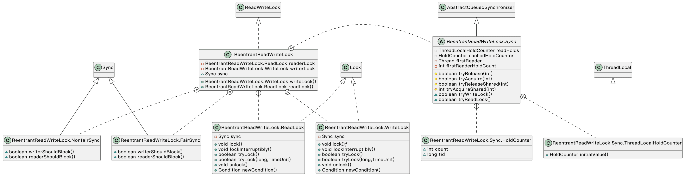
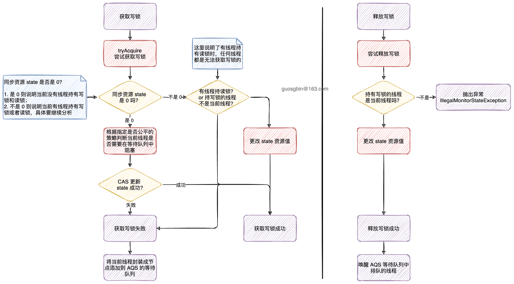
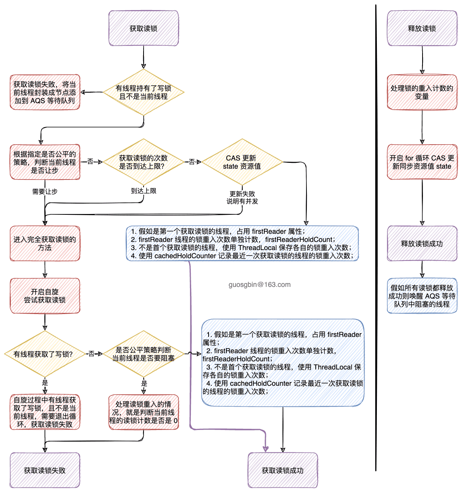

| 版本 | 内容 | 时间                   |
| ---- | ---- | ---------------------- |
| V1   | 新建 | 2022年09月29日23:50:27 |


## 概述

ReentrantReadWriteLock 顾名思义就是一个可重入的读写锁，内部也是基于 AQS 的。

- 读写锁的写锁和读锁都**可以重入**；
- 读写锁的读锁和写锁都**支持公平模式和非公平模式**；
- 互斥
  - 当一个线程获取了写锁，其他线程无法获取写锁（独占锁）；
  - 当一个线程获取了读锁，所有线程都无法获取写锁；
- 支持锁降级：**写锁可以降级为读锁，读锁不能升级为写锁**；
  - 锁降级，就是先获取写锁，然后获取读锁，最后释放写锁，这样写锁就降级成了读锁。

## 案例

JDK 中提供了两个案例

### 案例 1

展示了如何在更新缓存后执行**锁降级**

```java
class CachedData {
    // 保存的数据
    Object data;
    // 缓存数据是否有效的标志
    volatile boolean cacheValid;
    // 读写锁对象
    final ReentrantReadWriteLock rwl = new ReentrantReadWriteLock();

    /**
     * 处理缓存数据
     */
    void processCachedData() {
        // 获取读锁
        rwl.readLock().lock();
        // 校验缓存是否有效
        if (!cacheValid) {
            // Must release read lock before acquiring write lock
            // 释放读锁，尝试获取写锁
            rwl.readLock().unlock();
            rwl.writeLock().lock();
            try {
                // Recheck state because another thread might have
                // acquired write lock and changed state before we did.
                // 双重检查，再次检查缓存的状态
                if (!cacheValid) {
                    data = getData();
                    cacheValid = true;
                }
                // Downgrade by acquiring read lock before releasing write lock
                // 再次获取读锁
                rwl.readLock().lock();
            } finally {
                rwl.writeLock().unlock(); // Unlock write, still hold read
            }
        }
        try {
            useDate(data);
        } finally {
            rwl.readLock().unlock();
        }
    }

    private String getData() {
        return "模拟获取数据...";
    }

    private void useDate(Object data) {
        System.out.println(data);
    }
}
```

### 案例 2

ReentrantReadWriteLocks 可用于**改善某些类型集合的某些使用中的并发性**。 

只有当集合预期很大，读线程比写线程访问的多，并且需要的操作开销超过同步开销时，这通常才是值得的。

下面的案例使用 ReentrantReadWriteLock 控制对 TreeMap 的访问，将 TreeMap 封装成一个线程安全的集合。

```java
class RWDictionary<T> {
    // 封装的 map
    private final Map<String, T> m = new TreeMap<String, T>();
    // 读写锁对象
    private final ReentrantReadWriteLock rwl = new ReentrantReadWriteLock();
    private final Lock r = rwl.readLock();
    private final Lock w = rwl.writeLock();

    public T get(String key) {
        r.lock();
        try {
            return m.get(key);
        } finally {
            r.unlock();
        }
    }

    public String[] allKeys() {
        r.lock();
        try {
            return m.keySet().toArray(new String[0]);
        } finally {
            r.unlock();
        }
    }

    public T put(String key, T value) {
        w.lock();
        try {
            return m.put(key, value);
        } finally {
            w.unlock();
        }
    }

    public void clear() {
        w.lock();
        try {
            m.clear();
        } finally {
            w.unlock();
        }
    }
}
```

## 继承关系




读写锁的接口

ReentrantReadWriteLock 实现了 ReadWriteLock 接口，该接口就两个获取读锁和写锁的方法。

```java
public interface ReadWriteLock {
    Lock readLock();
    Lock writeLock();
}
```


ReentrantReadWriteLock 里面有以下几个内部类：

- Sync：抽象类，继承 AbstractQueuedSynchronizer，这个类主要就是实现 AQS 的模板方法；
  - HoldCounter 类：**记录当前线程的读锁重入的次数**；
  - ThreadLocalHoldCounter 类：**就是一个 ThreadLocal，用于保存 HoldCounter 对象**；
- NonfairSync：继承自 Sync，是 Sync 的非公平实现；
- FairSync：继承自 Sync，是 Sync 的公平实现；
- ReadLock：读锁实现；
- WriteLock：写锁实现；

后面会依次分析这些内部类的作用。

## 读写锁的原理

### 构造方法

```java
// 默认非公平锁
public ReentrantReadWriteLock() {
    this(false);
}

public ReentrantReadWriteLock(boolean fair) {
    sync = fair ? new FairSync() : new NonfairSync();
    readerLock = new ReadLock(this);
    writerLock = new WriteLock(this);
}
```

ReentrantReadWriteLock **默认非公平锁**，在构造方法中就是创建了 Sync 类、读锁对象和写锁对象。

### 内部类 Sync

在看 Sync 内部类之前思考一下，ReentrantLock 的 AQS 的同步资源 state 表示独占锁的重入次数。

ReentrantReadWriteLock 有读锁和写锁，那么怎么用一个 int 表示这两个锁的数据呢？在 JUC 中有很多是根据位来分割不同的数据的，这里也是一样。

**ReentrantReadWriteLock 的同步资源 state 是 int 类型**，它的

- **高 16 位表示共享锁的计数；**
- **低 16 位表示独占锁的计数；**


这里只分析 Sync 类的一些属性，具体方法在调用处分析。

####  Sync 的常量

```java
abstract static class Sync extends AbstractQueuedSynchronizer {

    private static final long serialVersionUID = 6317671515068378041L;

    /*
     * Read vs write count extraction constants and functions.
     * Lock state is logically divided into two unsigned shorts:
     * The lower one representing the exclusive (writer) lock hold count,
     * and the upper the shared (reader) hold count.
     */

    // 低位表示独占锁定保持计数
    // 高位表示共享保持计数
    static final int SHARED_SHIFT   = 16;
    // 1 00000000 00000000
    static final int SHARED_UNIT    = (1 << SHARED_SHIFT);
    // 11111111 11111111
    static final int MAX_COUNT      = (1 << SHARED_SHIFT) - 1;
    // 初始值 11111111 11111111
    static final int EXCLUSIVE_MASK = (1 << SHARED_SHIFT) - 1;

    /** Returns the number of shared holds represented in count  */
    // 获取共享的个数，int 32 位，右移 16 位则得到高位值
    static int sharedCount(int c)    { return c >>> SHARED_SHIFT; }
    /** Returns the number of exclusive holds represented in count  */
    // 获取独占的个数，int 32 位，& 上 EXCLUSIVE_MASK 则得到地位值
    static int exclusiveCount(int c) { return c & EXCLUSIVE_MASK; }

    // 省略......
}
```

分析上面常量的作用

- **SHARED_SHIFT**：用于计算当前读锁和写锁的个数，将 AQS 的同步资源 state 分为两部分；
- **SHARED_UNIT**：因为高 16 代表读锁的计数，将读锁加 1 需要在 state 上加 SHARED_UNIT 的值；
- **MAX_COUNT**：读锁或者写锁的最大持有个数；
- **EXCLUSIVE_MASK**：用于获得写锁的个数的掩码，低 16 位都是 1；

下面两个方法就是用于获取共享锁的个数和独占锁的个数。

#### 线程读锁计数

在 Sync 中有两个内部类 HoldCounter 和 ThreadLocalHoldCounter。

```java
static final class HoldCounter {
    // 当前线程重入读锁的次数
    int count = 0;
    // Use id, not reference, to avoid garbage retention
    // 获取线程 id
    final long tid = getThreadId(Thread.currentThread());
}

// THreadLocal 保存 HoldCounter
static final class ThreadLocalHoldCounter
    extends ThreadLocal<HoldCounter> {
    public HoldCounter initialValue() {
        return new HoldCounter();
    }
}

// 当前线程持有的可重入读锁数。
// 每个线程保存 一个 HoldCounter 对象
private transient ThreadLocalHoldCounter readHolds;
```

**HoldCounter 用于记录每个线程的读锁的重入次数，这个对象保存在 ThreadLocal 中**。

#### 最近获取读锁线程缓存

```java
private transient HoldCounter cachedHoldCounter;
```

在 Sync 中还有一个 HoldCounter 变量

**关于 cachedHoldCounter 的作用**，一般获取和释放读锁的线程都是最后一个线程，虽然每个线程的重入次数都会使用 readHolds 这个 ThreadLocal 来保存，但是假如每次获取读锁重入次数都要去 ThreadLocal 里面去查的话，就比较费时。这是就可以用 cachedHoldCounter 保存最后一个线程的读锁重入次数，这样就可以较少很多查询了，直接拿这个缓存用即可，这算是一个优化吧，**空间换时间**。

#### 记录首个获取读锁的线程

```java
// 第一个获取读锁的线程
private transient Thread firstReader = null;
// firstReaderHoldCount 是 firstReader 的计数（持有的读锁数）
private transient int firstReaderHoldCount;
```

### 获取写锁

内部类 WriteLock 实现了 Lock 接口，本次分析它的 WriteLock#lock 方法，其他支持中断的那些方法的流程基本类似。

```s
public void lock() {
    sync.acquire(1);
}
```


直接调的 AQS 的方法，AbstractQueuedSynchronizer#acquire

```java
// 独占地获取资源，忽略中断
public final void acquire(int arg) {
    // tryAcquire 方法尝试获取资源，获取成功返回 true
    // 获取资源失败返回 false，则需要将当前线程包装成节点加入等待队列
    if (!tryAcquire(arg) &&
        acquireQueued(addWaiter(Node.EXCLUSIVE), arg))
        selfInterrupt();
}
```

这个方法之前分析 AQS 的时候分析过，大致的思路就是先尝试获取锁，获取失败就将当前线程封装成节点加入到等待队列中阻塞等待被唤醒。

那么此次重点分析读写锁类重写的 tryAcquire 方法，Sync#tryAcquire

```java
/**
 * 尝试获取写锁
 */
protected final boolean tryAcquire(int acquires) {
    /*
     * Walkthrough:
     * 1. If read count nonzero or write count nonzero
     *    and owner is a different thread, fail.
     * 2. If count would saturate, fail. (This can only
     *    happen if count is already nonzero.)
     * 3. Otherwise, this thread is eligible for lock if
     *    it is either a reentrant acquire or
     *    queue policy allows it. If so, update state
     *    and set owner.
     */
    Thread current = Thread.currentThread();
    // 同步状态
    int c = getState();
    // 获取独占锁的次数
    int w = exclusiveCount(c);
    // c != 0 说明读锁和写锁至少有一个
    if (c != 0) {
        // (Note: if c != 0 and w == 0 then shared count != 0)
        if (w == 0 || current != getExclusiveOwnerThread())
            // 如果有线程持有读锁，或写锁被获取但不是当前线程获取的，则获取失败
            return false;
        if (w + exclusiveCount(acquires) > MAX_COUNT)
            throw new Error("Maximum lock count exceeded");
        // Reentrant acquire
        // 锁重入，直接 set 是因为只有当前线程能重入
        setState(c + acquires);
        return true;
    }

    // 走到这里的前置条件 c == 0，说明既没有读锁也没有写锁

    // 条件 1 根据是否是公平锁做不同的判断
    // 条件 2 就是尝试抢锁了
    if (writerShouldBlock() || !compareAndSetState(c, c + acquires))
        return false;
    // 抢锁成功，设置独占线程
    setExclusiveOwnerThread(current);
    return true;
}
```

读锁和写锁的互斥关系

- **读锁和写锁是互斥的**：只要有线程持有读锁，所有线程都不能获取写锁；
- **写锁和写锁是互斥的**：写锁被其他线程占用时，当前线程不能获取写锁；


当前线程持有读锁时，当前线程不能获取写锁，也就是说**读锁无法升级成写锁**的；


**获取写锁小结：**

1. 调用 Sync#tryAcquire 方法尝试获取写锁，获取写锁成功则直接结束方法，未获取成功走后面的代码；
2. 将当前线程封装成一个 Node 节点并加入到 AQS 的等待队列中；
3. 假如当前是等待队列的 head.next 节点则尝试获取锁，不是这个节点或者获取失败则阻塞等待前驱节点唤醒； 

### 释放写锁

```java
public void unlock() {
    sync.release(1);
}
```


释放写锁是直接调用的 AbstractQueuedSynchronizer#release 方法

```java
// 释放独占资源
public final boolean release(int arg) {
    // 尝试释放独占资源
    if (tryRelease(arg)) {
        Node h = head;
        // h.waitStatus != 0 说明等待队列中有线程在排队
        if (h != null && h.waitStatus != 0)
            // 通过 head 节点唤醒队首节点
            unparkSuccessor(h);
        return true;
    }
    return false;
}
```

这个方法之前分析过，这里主要分析读写锁重写的 tryRelease 方法。

```java
/**
 * 释放写锁
 */
protected final boolean tryRelease(int releases) {
    if (!isHeldExclusively())
        throw new IllegalMonitorStateException();
    int nextc = getState() - releases;
    boolean free = exclusiveCount(nextc) == 0;
    if (free)
        // 如果释放锁之后锁空闲，那么需要将锁持有者置为null
        setExclusiveOwnerThread(null);
    setState(nextc);
    return free;
}
```

很简单，就是直接将 state 的写锁计数减 1。


释放写锁小结：

1. 调用 AbstractQueuedSynchronizer#release 方法尝试释放读锁，将 state 的写锁计数减 1；
2. 唤醒 AQS 的等待队列的 head.next 节点（如果存在的话），该节点就可以继续尝试获取写锁了；

### 获取读锁

ReadLock#lock

```java
public void lock() {
    sync.acquireShared(1);
}
```

也是直接调用 AQS 的方法，AbstractQueuedSynchronizer#acquireShared

```java
// 共享地获取资源
public final void acquireShared(int arg) {
    if (tryAcquireShared(arg) < 0)
        doAcquireShared(arg);
}
```

这个方法之前分析过，这里我们需要分析读写锁重写的 tryAcquireShared 方法。

Sync#tryAcquireShared

```java
protected final int tryAcquireShared(int unused) {
    Thread current = Thread.currentThread();
    int c = getState();
    if (exclusiveCount(c) != 0 && getExclusiveOwnerThread() != current)
        // 有线程使用了独占锁，且不是当前线程，那么直接返回失败
        // 这里也说明了获取写锁的线程还是有机会获取读锁的
        return -1;
    int r = sharedCount(c);

    if (!readerShouldBlock() &&     // 先进行公平性判断是否应该让步，这可能会导致重入读锁的线程获取失败
        r < MAX_COUNT &&    // r < MAX_COUNT 判断读锁是否到上限
        compareAndSetState(c, c + SHARED_UNIT)) { // CAS失败会进入下面的完全获取读锁的方法

        // 到这里获取共享锁成功，且写锁计数已经增加
        if (r == 0) {
            // 第一个获取读锁的线程的处理
            firstReader = current;
            firstReaderHoldCount = 1;
        } else if (firstReader == current) {
            // 将第一个获取读锁的线程的计数 +1
            firstReaderHoldCount++;
        }
        // 该线程不是首个获取读锁的线程，需要记录到 readHolds 中
        else {
            // 获取最近获取读锁的 HoldCounter 缓存
            HoldCounter rh = cachedHoldCounter;
            // 判断这个 HoldCounter 缓存是不是属于当前线程的
            if (rh == null || rh.tid != getThreadId(current))
                // 到这里说明 rh 是 null，或者 rh 的线程 id 不是当前线程
                // 获取当前线程的 HoldCounter 值放到 cachedHoldCounter 中，也就是目前来说的最后一个线程获取读锁的线程
                cachedHoldCounter = rh = readHolds.get();
            // 前置条件：cachedHoldC ounter 是属于当前线程的
            else if (rh.count == 0)
                readHolds.set(rh);
            // 读锁次数加 1
            rh.count++;
        }
        // 只要进了这个 if 代码块就返回 1 表示成功
        return 1;
    }
    // 前置条件：readerShouldBlock() 返回的 true，或者读锁计数超过最大值了，或者 cas 更改读锁计数失败了
    // 前面 if 代码块并未处理读锁锁重入
    return fullTryAcquireShared(current);
}
```

关于这个 Sync#tryAcquireShared 方法，这个方法的返回值

1. 返回 1 表示获取读锁成功；
2. 返回 -1 表示获取读锁失败，那么会在 AbstractQueuedSynchronizer#acquireShared 将当前节点封装成读模式的节点并添加到 AQS 的等待队列中；


 Sync#tryAcquireShared 简单分析：

1. 首先会校验一下锁的状态，假如有线程持有了写锁，且不是当前线程，那么会直接返回 -1 表示获取读锁失败；
2. 然后会走一个 if 判断，据当前读写锁的公平模式来决定是否尝试阻塞当前线程，判断读锁计数是否溢出，CAS 更新 state 是否成功；
   1. 假如通过校验，说明 readerShouldBlock() 返回 false 且 CAS 更新成功了，此时会处理增加读锁重入计数，处理 cachedHoldCounter 等。走到这里面肯定是获取读锁成功了，直接返回 1；
   2. 假如没有通过校验，可能的情况是 readerShouldBlock() 返回 true，或者 CAS 更新 state 失败，此时需要调用 ReentrantReadWriteLock.Sync#fullTryAcquireShared 方法去获取读锁；


 Sync#tryAcquireShared 的前半部分并没有处理读锁重入和 CAS 更新 state 失败的情况，所有需要调用 ReentrantReadWriteLock.Sync#fullTryAcquireShared  去处理这里个场景。

```java
final int fullTryAcquireShared(Thread current) {
    HoldCounter rh = null;
    for (;;) {
        int c = getState();
        // exclusiveCount(c) != 0 说明有线程已经获取了写锁了
        if (exclusiveCount(c) != 0) {
            if (getExclusiveOwnerThread() != current)
                // 持有写锁的线程不是当前线程，返回 -1 表示获取读锁失败
                return -1;
            // else we hold the exclusive lock; blocking here
            // would cause deadlock.
        }
        // 前置条件：exclusiveCount(c) == 0 说明当前是没有线程持有写锁的
        else if (readerShouldBlock()) { // 这个分支是在处理读锁重入的情况
            // Make sure we're not acquiring read lock reentrantly
            // 如果当前线程就是firstReader，那么它一定是重入读，不让它失败，
            if (firstReader == current) {
                // assert firstReaderHoldCount > 0;
            } else {
                if (rh == null) {
                    // 获取最近一次获取读锁的线程信息
                    rh = cachedHoldCounter;
                    // 条件成立说明，rh 没有 或者 rh 里存的线程不是当前线程
                    if (rh == null || rh.tid != getThreadId(current)) {
                        // 赋值当前线程的 HoldCounter
                        rh = readHolds.get();
                        // 条件成立：说明当前线程的 readHolds 是上一行代码 rh = readHolds.get() 创建的，
                        // 可以推断出来，当前线程不是锁重入的情况
                        if (rh.count == 0)
                            // 说明当前线程没有持有读锁，直接移除当前线程的 HoldCounter
                            readHolds.remove();
                    }
                }
                if (rh.count == 0)
                    // 条件成立：说明当前线程的 readHolds 是上一行代码 rh = readHolds.get() 创建的，
                    // 可以推断出来，当前线程不是锁重入的情况
                    // 当前线程既不持有读锁（不是重入读），并且被公平性判断为应该阻塞，那么就获取失败
                    return -1;
            }
        }
        if (sharedCount(c) == MAX_COUNT)
            throw new Error("Maximum lock count exceeded");

        // 那些情况会进入到下面的代码呢？
        // 1.无线程占用写锁，当前线程 CAS 修改 state 失败，，然后进入到 fullTryAcquireShared 方法（没有抢过其他读锁线程）
        // 2.持有读锁的线程进行读锁重入

        // 下面的逻辑基本上和 tryAcquire 中差不多，不过这里的 CAS 如果失败，会重新 loop 直到成功为止
        if (compareAndSetState(c, c + SHARED_UNIT)) {
            if (sharedCount(c) == 0) {
                firstReader = current;
                firstReaderHoldCount = 1;
            } else if (firstReader == current) {
                firstReaderHoldCount++;
            } else {
                if (rh == null)
                    rh = cachedHoldCounter;
                if (rh == null || rh.tid != getThreadId(current))
                    rh = readHolds.get();
                else if (rh.count == 0)
                    readHolds.set(rh);
                rh.count++;
                cachedHoldCounter = rh; // cache for release
            }
            return 1;
        }
    }
}
```

关于读锁的重入处理，假如上面的 readerShouldBlock() 返回 true，这个条件说明需要将当前的线程阻塞，**需要进一步判断是否是已经获取读锁的线程的读锁重入**，假如不是读锁重入，这里会返回 -1 表示需要将当前线程封装节点添加到等待队列中阻塞等待； 

### 释放读锁

ReadLock#unlock

```java
public void unlock() {
    sync.releaseShared(1);
}
```

直接调用的 AQS 的 AbstractQueuedSynchronizer#releaseShared 方法

```java
// 释放共享资源
public final boolean releaseShared(int arg) {
    // tryReleaseShared 返回true 表示已经释放完了
    if (tryReleaseShared(arg)) {
        doReleaseShared();
        return true;
    }
    return false;
}
```


我们需要看读写锁重写的 tryReleaseShared 方法

```java
/**
 * 尝试释放读锁
 */
protected final boolean tryReleaseShared(int unused) {
    Thread current = Thread.currentThread();
    if (firstReader == current) {
        // assert firstReaderHoldCount > 0;
        if (firstReaderHoldCount == 1)
            firstReader = null;
        else
            firstReaderHoldCount--;
    } else {
        // 一般释放读锁的都是最后获取读锁的那个线程
        HoldCounter rh = cachedHoldCounter;
        if (rh == null || rh.tid != getThreadId(current))
            rh = readHolds.get();
        int count = rh.count;
        if (count <= 1) {
            // 如果释放读锁后不再持有锁，那么移除 readHolds 保存的线程局部 HoldCounter 变量
            readHolds.remove();
            if (count <= 0)
                throw unmatchedUnlockException();
        }
        --rh.count;
    }
    // 循环 CAS 保证修改同步资源 state 成功
    for (;;) {
        int c = getState();
        int nextc = c - SHARED_UNIT;
        if (compareAndSetState(c, nextc))
            // Releasing the read lock has no effect on readers,
            // but it may allow waiting writers to proceed if
            // both read and write locks are now free.
            // 如果释放后锁空闲，那么返回true，否则返回false
            return nextc == 0;
    }
}
```

可以看到释放读锁的方法就简单很多了

- 假如当前线程是第一个获取读锁的线程，则需要特殊处理；
- 假如当前线程不是第一个获取读锁的线程，则配合 cachedHoldCounter 去释放读锁；
- 最后会使用 CAS 保证修改同步资源 state 一定成功；
- 释放读锁成功后，会调用 AbstractQueuedSynchronizer#doReleaseShared 方法，这个方法会传播唤醒等待队列中的共享节点，也就是等待获取读锁的节点；


**关于 cachedHoldCounter 的作用**，一般获取和释放读锁的线程都是最后一个线程，虽然每个线程的重入次数都会使用 readHolds 这个 ThreadLocal 来保存，但是假如每次获取读锁重入次数都要去 ThreadLocal 里面去查的话，就比较费时。这是就可以用 cachedHoldCounter 保存最后一个线程的读锁重入次数，这样就可以较少很多查询了，直接拿这个缓存用即可，这算是一个优化吧，空间换时间。

## 读写锁的特点

### 读锁与写锁的互斥关系

- **读锁和写锁的互斥：当一个线程持有了读锁时，所有线程都无法获取写锁（共享锁）；**
- **写锁和写锁的互斥：当一个线程持有了写锁时，其他线程无法获取写锁（独占锁）；**


分析下上面的结论：

先看获取写锁的方法 ReentrantReadWriteLock.Sync#tryAcquire

- 首先 `c != 0` 表示肯定有线程持有读写锁；
- 然后 `w == 0 || current != getExclusiveOwnerThread()` 
  - 第一个条件` w == 0` 表示写锁计数是 0，那么肯定是**有别的线程持有读锁了，这时直接获取写锁失败**；
  - 第二个条件 `w != 0 && current != getExclusiveOwnerThread()` 说明有线程持有写锁，但是不是当前线程，那么也会获取写锁失败；

```java
protected final boolean tryAcquire(int acquires) {
    Thread current = Thread.currentThread();
    int c = getState();
    int w = exclusiveCount(c);
    if (c != 0) {
        // (Note: if c != 0 and w == 0 then shared count != 0)
        if (w == 0 || current != getExclusiveOwnerThread())
            return false;
        // 省略...
    }

    // 省略....
    return true;
}
```


再看获取读锁的方法

- `exclusiveCount(c) != 0 && getExclusiveOwnerThread() != current` 表示有线程获取了写锁，但不是当前线程，

```java
protected final int tryAcquireShared(int unused) {
    Thread current = Thread.currentThread();
    int c = getState();
    if (exclusiveCount(c) != 0 && getExclusiveOwnerThread() != current)
        return -1;
    
    // 省略......
    
    return fullTryAcquireShared(current);
}
```


### 可重入性

ReentrantReadWriteLock 的读锁和写锁都支持重入。

- 写锁的重入：在 ReentrantReadWriteLock.Sync#tryAcquire 里会判断当前持有写锁的线程是不是当前线程，假如是当前线程的话，就会尝试获取写锁；
- 读锁的重入：读锁的重入是在 ReentrantReadWriteLock.Sync#fullTryAcquireShared 方法里面处理的。

###  锁的升降级

- 当一个线程获取了读锁后，是不能升级为写锁的。也就是说不能从读锁升级为写锁；
- 当一个线程获取了写锁后，可以继续获取读锁。

### 公平模式和非公平模式

主要涉及到了两个内部类

```java
/**
 * 公平模式的 Sync 实现
 */
static final class FairSync extends Sync {
    private static final long serialVersionUID = -2274990926593161451L;
    final boolean writerShouldBlock() {
        return hasQueuedPredecessors();
    }
    final boolean readerShouldBlock() {
        return hasQueuedPredecessors();
    }
}

/**
 * 非公平模式的 Sync 实现
 */
static final class NonfairSync extends Sync {
    private static final long serialVersionUID = -8159625535654395037L;
    final boolean writerShouldBlock() {
        return false; // writers can always barge
    }
    final boolean readerShouldBlock() {
        return apparentlyFirstQueuedIsExclusive();
    }
}
```


公平模式无论是获取读锁还是获取写锁都需要调用 AbstractQueuedSynchronizer#hasQueuedPredecessors 校验是否需要阻塞等待，这个方法之前分析过，其实就是查询当前线程前面是否有别的线程在排队。

```java
public final boolean hasQueuedPredecessors() {
    // The correctness of this depends on head being initialized
    // before tail and on head.next being accurate if the current
    // thread is first in queue.
    Node t = tail; // Read fields in reverse initialization order
    Node h = head;
    Node s;
    // 条件 1：h != t 说明等待队列内有元素
    // 条件 2：(s = h.next) == null || s.thread != Thread.currentThread()
    // (s = h.next) == null
    return h != t &&
        ((s = h.next) == null || s.thread != Thread.currentThread());
}
```


非公平模式的获取写锁的 writerShouldBlock() 方法直接返回的 false，表示在尝试获取写锁的时候，不管 AQS 中是否有尝试获取写锁的线程在等待，直接 CAS 尝试修改 state 的值。（**这可能会导致在等待队列中的等待的尝试获取写锁的线程饥饿**）

非公平模式的获取读锁的 readerShouldBlock() 方法是调用 AQS#apparentlyFirstQueuedIsExclusive 方法，这个方法就是判断当 head.next 节点是独占模式的节点的话，需要将当前尝试获取读锁的线程阻塞（当然前面分析了，ReentrantReadWriteLock 在这里不一定会阻塞，因为有读锁重入的情况）；

```java
final boolean apparentlyFirstQueuedIsExclusive() {
    Node h, s;
    // case1 有 head 节点
    // case2 有 head.next 节点
    // case3 不是共享节点
    // case4 节点的线程不是 null
    return (h = head) != null &&
        (s = h.next)  != null &&
        !s.isShared()         &&
        s.thread != null;
}
```

## 小结

ReentrantReadWriteLock 是基于 AQS 实现的一个读写锁，它有以下特性：

- 读锁和写锁**都支持锁重入**；
- 读锁和写锁**都支持公平模式和非公平模式**；
- 锁之间的互斥关系：
  - 假如一个线程获取了写锁，其他线程无法获取写锁，写锁是一个独占锁；
  - 假如一个线程获取了读锁，所有线程都无法获取写锁，这也说明了**锁是无法升级的**；
  - 假如一个线程获取了写锁，这个线程还是可以获取读锁的，这也说明了**锁是可以从写锁降级为读锁的**；


写锁的获取和释放流程和 ReentrantLock 基本上一样：

**写锁的获取**

1. 先判断同步资源的状态
   1. 假如有一个线程持有读锁，不允许获取写锁；
   2. 假如有线程持有写锁，且不是当前线程持有的，不允许当前线程获取写锁。如果是当前线程持有的那就执行锁重入的逻辑；
2. 根据是否公平的策略决定当前线程是否需要在 AQS 中阻塞等待，假如不需要则尝试 CAS 更新状态获取写锁。

**写锁的释放**

1. 首先需要判断当前线程是否是持有写锁的线程，假如不是则抛出异常；
2. 修改同步资源 state 的值，释放写锁；

**写锁获取和释放流程图**




**读锁的获取**

1. 先判断同步资源的状态
   1. 假如有线程持有了读锁，但是不是当前线程持有的，此时不允许获取读锁；
2. 先判断是否需要在 AQS 等待队列阻塞挂起（是否公平），如果不需要，则尝试 CAS 更新同步资源值，更新成功则说明获取读锁成功，需要注意的是，第二步并未处理读锁重入的情况；
3. 进入到第 3 步有两种情况，（1）第二步的线程需要在 AQS 等待队列阻塞挂起（2） CAS 更新同步资源失败，说明有并发情况。这两种情况需要进入循环尝试获取读锁的 fullTryAcquireShared 方法，这里面主要做两件事。
   1. 循环处理读锁重入的情况；
   2. 循环尝试 CAS 更新同步资源值；

**读锁的释放**

1. 处理用于读锁重入计数的变量，例如 firstReaderHoldCount 和 cachedHoldCounter 这些变量的值；
2. 开启一个自旋尝试修改同步资源值 state，更新成功则释放读锁成功；

**读锁获取和释放流程图**


