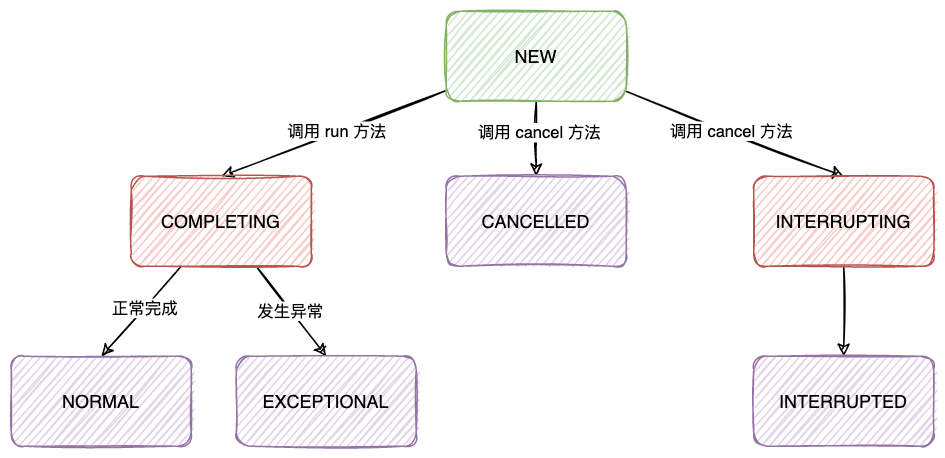

| 版本 | 内容 | 时间                   |
| ---- | ---- | ---------------------- |
| V1   | 新建 | 2022年10月05日21:25:59 |

## Future模式

Future 模式就是异步执行任务，调用者得到一个凭证，然后在需要的时候根据这个凭证去获取结果。

## JUC中的Future模式

可以通过 Runnable 定义一个任务，然后开启一个线程去执行。

```java
new Thread(new Runnable() {
    @Override
    public void run() {
        System.out.println("任务执行...");
    }
}, "ThreadA").start();
```

但是 Runnable 不支持获取任务的返回结果，JDK 另外提供了一个可获取返回结果的 Callable 接口。

```java
Callable<String> task = new Callable<String>() {
    @Override
    public String call() throws Exception {
        System.out.println("任务执行...");
        return "我是返回结果";
    }
};
Future<String> future = new FutureTask<>(task);
// 执行任务
Executors.newSingleThreadExecutor().execute(future);
String result = future.get();
System.out.println(result);
```

本次需要分析 Future 接口和它的实现类 FutureTask

## Future 接口

Future 接口定义

```java
public interface Future<V> {
  	// 尝试取消这个任务
    boolean cancel(boolean mayInterruptIfRunning);

    // 如果此任务在正常完成之前被取消，则返回 true
    boolean isCancelled();

    // 返回 true 表示任务已经完成
    // 完成的情况可能是， 正常关闭、发生异常、或者被取消了。这些情况该方法都会返回 true
    boolean isDone();

    // 等待任务完成，返回计算结果
    V get() throws InterruptedException, ExecutionException;

    // 等待任务完成，返回计算结果，支持超时
    V get(long timeout, TimeUnit unit)
        throws InterruptedException, ExecutionException, TimeoutException;
```


为了能够被线程或者线程池执行任务，提供了一个 RunnableFuture 接口，它继承了 Runnable 接口。

```java
public interface RunnableFuture<V> extends Runnable, Future<V> {
    void run();
}
```


## FutureTask 原理

### 构造方法

```java
public FutureTask(Callable<V> callable) {
    if (callable == null)
        throw new NullPointerException();
    this.callable = callable;
    this.state = NEW;       // ensure visibility of callable
}

public FutureTask(Runnable runnable, V result) {
    this.callable = Executors.callable(runnable, result);
    this.state = NEW;       // ensure visibility of callable
}
```

主要提供了两个构造方法，第一个是指定支持返回值的 Callable 对象，第二个入参是 Runnable 类型的对象和一个 result 值，在执行 Runnable 任务成功时候就会返回这个 result 值。


Runnable 在 Executors#callable 方法中通过适配器模式将 Runnable 适配成 Callable 对象了

```java
static final class RunnableAdapter<T> implements Callable<T> {
    final Runnable task;
    final T result;
    RunnableAdapter(Runnable task, T result) {
        this.task = task;
        this.result = result;
    }
    public T call() {
        task.run();
        return result;
    }
}
```


### FutureTask 的状态

```java
// 当前 FutureTask 的状态
private volatile int state;
// 当前任务新建状态，还没执行
private static final int NEW          = 0;
// 当前任务完成临界状态，快完成了，有可能是正常结束可能是抛出异常
private static final int COMPLETING   = 1;
// 当前任务正常完成的状态
private static final int NORMAL       = 2;
// 当前任务在执行过程中发生了异常，内部封装的callable.run()向上抛出异常了
private static final int EXCEPTIONAL  = 3;
// 当前任务被取消
private static final int CANCELLED    = 4;
// 当前任务正在中断中
private static final int INTERRUPTING = 5;
// 当前任务已经被中断
private static final int INTERRUPTED  = 6;
```

FutureTask 中定义了 7 种状态

- NEW：表示任务的新建状态，任务还未执行；
- COMPLETING：当前任务完成的临界状态，任务已经完成或者出异常了，但是还未设置返回值或者异常对象；
- NORMAL：表示任务正常完成的状态，返回值已经设置；
- EXCEPTIONAL：表示任务在执行过程中发生了异常，异常值已经设置；
- CANCELLED：表示任务还未开始执行就被取消；
- INTERRUPTING：表示任务还未开始执行就被中断取消，但是是中断中的临界状态；
- INTERRUPTED：表示任务还未开始执行就被中断取消；


状态流转图：



### WaitNode 节点

FutureTask 中有个内部类 WaitNode，是一个节点对象。

```java
static final class WaitNode {
    volatile Thread thread;
    volatile WaitNode next;
    WaitNode() { thread = Thread.currentThread(); }
}
```

在 Future 接口中有两个 get 方法，其中一个在没获取到任务的结果时候会一直阻塞，假如有多个线程在获取这个任务的结果，再未获取到返回值的这一段时间，这些线程都会阻塞。

 具体是会阻塞在一个栈上，每个节点就是 WaitNode 对象。

### 执行任务

任务的执行是通过 FutureTask#run 方法来执行了。FutureTask 是 RunnableFuture 的实现类，所以 FutureTask 也是 Runnable 类型，所以可以直接通过线程和线程池的方式执行。

```java
public void run() {
    // 首先需要判断当前的状态是否是新建状态 NEW，防止被取消或中断
    // 再尝试 CAS 将 runner 变量设置为当前线程引用，设置成功则说明没有别的线程竞争。
    if (state != NEW ||
        !UNSAFE.compareAndSwapObject(this, runnerOffset,
                                     null, Thread.currentThread()))
        return;
    try {
        Callable<V> c = callable;
        // 再次判断 state 是否是 NEW，防止其他线程修改了状态
        if (c != null && state == NEW) {
            // 返回值
            V result;
            boolean ran;
            try {
                result = c.call();
                ran = true;
            } catch (Throwable ex) {
                // 发生异常了
                result = null;
                ran = false;
                setException(ex);
            }
            // 根据是否执行成功，设置返回值
            if (ran)
                set(result);
        }
    } finally {
        // runner must be non-null until state is settled to
        // prevent concurrent calls to run()
        // 直到 set 状态前，runner 一直都是非空的，为了防止并发调用 run() 方法。
        runner = null;
        // state must be re-read after nulling runner to prevent
        // leaked interrupts
        // 有别的线程要中断当前线程，把CPU让出去，自旋等一下
        int s = state;
        if (s >= INTERRUPTING)
            handlePossibleCancellationInterrupt(s);
    }
}
```

FutureTask#run 做的事情就是首先调用 Callable 的 call 方法执行任务，然后根据是否发生异常来调用不同的方法设置返回值或者异常值。

```java
protected void set(V v) {
    // 尝试 CAS 将状态从 NEW 修改为 COMPLETING
    if (UNSAFE.compareAndSwapInt(this, stateOffset, NEW, COMPLETING)) {
        // 设置返回值
        outcome = v;
        // 设置 state 是 NORMAL，表示正常完成
        UNSAFE.putOrderedInt(this, stateOffset, NORMAL); // final state
        finishCompletion();
    }
}

protected void setException(Throwable t) {
    // CAS 将 state 从 NEW 修改为 COMPLETING
    if (UNSAFE.compareAndSwapInt(this, stateOffset, NEW, COMPLETING)) {
        outcome = t;
        // CAS 将 state 设置为 EXCEPTIONAL
        UNSAFE.putOrderedInt(this, stateOffset, EXCEPTIONAL); // final state
        finishCompletion();
    }
}
```

- 从这里也可以看出，在最终设置返回值之前会 CAS 将 NEW 状态改成临界状态 COMPLETING；
- 根据不同的方法设置任务的结果或者异常值；
- 最后调用 FutureTask#finishCompletion 方法移除并唤醒所有在 WaitNode 栈上等待的线程；

```java
// 移除并唤醒所有的等待线程，
private void finishCompletion() {
    // assert state > COMPLETING;
    for (WaitNode q; (q = waiters) != null;) {
        // 尝试CAS更新队列的头结点为null
        // 可能失败，失败原因可能是被其他线程CANCEL掉了，再出去就可能外循环条件不成立并退出
        if (UNSAFE.compareAndSwapObject(this, waitersOffset, q, null)) {
            for (;;) {
                Thread t = q.thread;
                if (t != null) {
                    q.thread = null;
                    // 唤醒线程
                    LockSupport.unpark(t);
                }
                WaitNode next = q.next;
                if (next == null)
                    break;
                q.next = null; // unlink to help gc
                q = next;
            }
            break;
        }
    }

    done();

    callable = null;        // to reduce footprint
}
```

### 取消任务

FutureTask#cancel 取消任务，只有在当前 FutureTask 的状态是 NEW 且 CAS 更新状态成功才会去执行任务取消。

- `mayInterruptIfRunning`如果为 true，表示中断正在执行任务的线程；
- `mayInterruptIfRunning`如果为 false，否则仅仅是将任务状态置为 CANCELLED；
- 最后调用 FutureTask#finishCompletion 方法移除并唤醒所有在 WaitNode 栈上等待的线程；

> 注意：调用 FutureTask#cancel 方法并不一定会取消任务的执行，只有在当前 FutureTask 的状态是 NEW 且 CAS 更新状态成功才会去执行任务取消。

```java
public boolean cancel(boolean mayInterruptIfRunning) {
    // 条件 1：说明当前状态是 NEW 状态
    // 条件 2：尝试 CAS 更改状态
    if (!(state == NEW &&
          UNSAFE.compareAndSwapInt(this, stateOffset, NEW,
                                   mayInterruptIfRunning ? INTERRUPTING : CANCELLED)))
        // 状态不是NEW，或者是NEW但是CAS操作失败
        return false;
    try {    // in case call to interrupt throws exception
        if (mayInterruptIfRunning) {
            try {
                Thread t = runner;
                if (t != null)
                    // 中断正在执行任务的线程
                    t.interrupt();
            } finally { // final state
                // 中断后设置状态为 INTERRUPTED
                UNSAFE.putOrderedInt(this, stateOffset, INTERRUPTED);
            }
        }
    } finally {
        // 移除并唤醒所有的等待线程
        finishCompletion();
    }
    return true;
}
```

### 获取任务结果

```java
// 阻塞获取结果
public V get() throws InterruptedException, ExecutionException {
    int s = state;
    // 条件成立说明当前任务还未执行完，需要去阻塞等待
    if (s <= COMPLETING)
        s = awaitDone(false, 0L);
    return report(s);
}

// 超时等待获取结果
public V get(long timeout, TimeUnit unit)
    throws InterruptedException, ExecutionException, TimeoutException {
    if (unit == null)
        throw new NullPointerException();
    int s = state;
    // 调用支持超时的 awaitDone 方法
    if (s <= COMPLETING &&
        (s = awaitDone(true, unit.toNanos(timeout))) <= COMPLETING)
        throw new TimeoutException();
    return report(s);
}
```

获取任务结果的流程是：

- 假如当前 FutureTask 的状态是 NEW 和 COMPLETING 状态是，说明任务还未完成，则需调用 FutureTask#awaitDone 方法去阻塞当前线程等待任务执行完；
- 假如任务已经完成了，则调用 FutureTask#report 方法去上报返回值或者异常值；


FutureTask#awaitDone

```java
// 创建节点入栈，阻塞当前线程
private int awaitDone(boolean timed, long nanos)
    throws InterruptedException {
    // 计算超时的截止时间
    final long deadline = timed ? System.nanoTime() + nanos : 0L;
    WaitNode q = null;
    boolean queued = false;
    for (;;) {
        if (Thread.interrupted()) {
            // 假如当前线程被中断了，需要移除等待的线程
            removeWaiter(q);
            throw new InterruptedException();
        }

        int s = state;
        // CASE1：条件成立说明当前任务已经执行结束或者发生异常了，被取消了等
        if (s > COMPLETING) {
            if (q != null)
                q.thread = null; // help GC
            return s;
        }
        // CASE2：任务在完成的临界，需要让出 cpu 资源等待
        else if (s == COMPLETING) // cannot time out yet
            Thread.yield();
        // CASE3：第一次自旋，当前线程还未创建 WaitNode 对象，等待线程节点为空,则初始化新节点并关联当前线程
        else if (q == null)
            q = new WaitNode();
        // CASE4：第二次自旋，当前线程已经创建了WaitNode对象，但是还未入栈
        // 头插法
        else if (!queued)
            queued = UNSAFE.compareAndSwapObject(this, waitersOffset,
                                                 q.next = waiters, q);
        // CASE5：假如支持超时，当超时后移除等待的线程并返回 state，当未超时则阻塞当前线程
        else if (timed) {
            nanos = deadline - System.nanoTime();
            if (nanos <= 0L) {
                removeWaiter(q);
                return state;
            }
            LockSupport.parkNanos(this, nanos);
        }
        // CASE6：直接阻塞当前线程
        else
            LockSupport.park(this);
    }
}
```

主要流程就是创建 WaitNode 节点入栈，并阻塞当前线程。


FutureTask#report

```java
// 上报返回值，可能是正常的返回值，也可能是返回的异常
@SuppressWarnings("unchecked")
private V report(int s) throws ExecutionException {
    Object x = outcome;
    if (s == NORMAL)
        // 返回正常执行结束的值
        return (V)x;
    if (s >= CANCELLED)
        throw new CancellationException();
    // 抛出异常
    throw new ExecutionException((Throwable)x);
}
```

## 小结

FutureTask 的基本用法

首先创建一个 FutureTask 封装一个任务对象，然后提交给线程池执行，随后使用 Future#get 方法获取任务的执行结果。

```java
Callable<String> task = new Callable<String>() {
    @Override
    public String call() throws Exception {
        System.out.println("任务执行...");
        return "我是返回结果";
    }
};
Future<String> future = new FutureTask<>(task);
// 执行任务
Executors.newSingleThreadExecutor().execute(future);
String result = future.get();
System.out.println(result);
```

FutureTask 的基本原理很简单，就是

- 使用线程池执行指定的任务，然后调用 FutureTask 的 get 方法获取任务的结果；
- 当任务还未执行完或者未等待超时的时候，调用 get 方法的线程会被封装成一个节点入栈；
- 当任务执行完时，会设置任务的执行结果或者异常，然后唤醒去栈内依次唤醒阻塞的线程。
