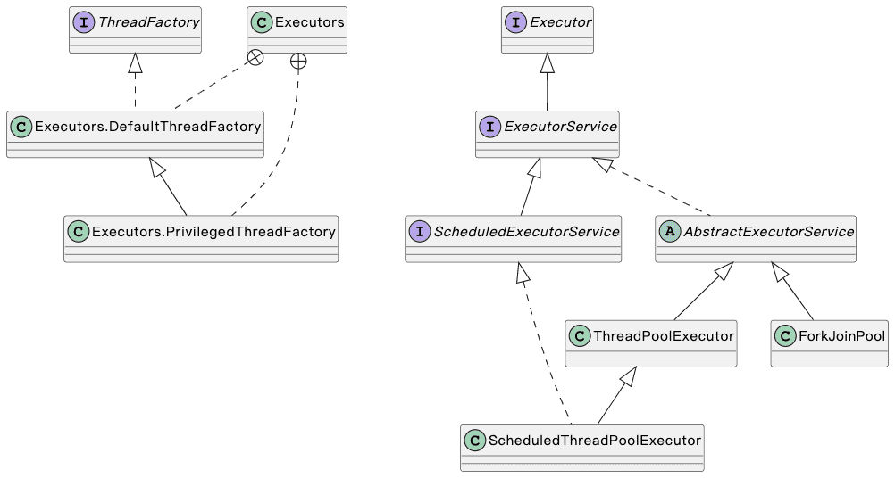

| 版本 | 内容 | 时间                   |
| ---- | ---- | ---------------------- |
| V1   | 新建 | 2022年10月07日23:46:55 |

## executors 框架的接口

### 顶级接口 Executor

```java
public interface Executor {
    // 提交任务，会在将来的某个时间执行任务
    void execute(Runnable command);
}
```


执行提交的 Runnable 任务的对象，该接口**提供了一种将任务提交与每个任务将如何运行的机制解耦的方法**，包括线程使用、调度等的细节。


在之前都是创建一个线程，然后执行任务。例如：

```java
new Thread(() -> { /* do something */ }).start();
```

现在我们可以创建一个 Executor 线程池去执行任务，不用关心线程是如何创建的：

```java
Executors.newSingleThreadExecutor().execute(() -> { /* do something 1 */});
Executors.newSingleThreadExecutor().execute(() -> { /* do something 2 */});
```


我们可以根据 Executor  接口实现自己的执行器，看下 JDK 提供的案例：

**第一种：这种是直接在调用者的线程中执行任务；**

```java
class DirectExecutor implements Executor {
   public void execute(Runnable r) {
       r.run();
   }
}
```

**第二种：每次创建一个新的线程去执行任务；**

```java
class ThreadPerTaskExecutor implements Executor {
   public void execute(Runnable r) {
       new Thread(r).start();
   }
}
```

**第三种：许多Executor实现对任务的调度方式和时间施加了某种限制，下面的 SerialExecutor 将任务提交内部的 Executor，按照顺序执行任务。** 

```java
class SerialExecutor implements Executor {
    final Queue<Runnable> tasks = new ArrayDeque<Runnable>();
    final Executor executor;
    Runnable active;
    SerialExecutor(Executor executor) {
        this.executor = executor;
    }
    public synchronized void execute(final Runnable r) {
        tasks.offer(new Runnable() {
            public void run() {
                try {
                    r.run();
                } finally {
                    scheduleNext();
                }
            }
        });
        if (active == null) {
            scheduleNext();
        }
    }
    protected synchronized void scheduleNext() {
        if ((active = tasks.poll()) != null) {
            executor.execute(active);
        }
    }
}
```

### 带生命周期的 ExecutorService

```java
public interface ExecutorService extends Executor {
	/*
     * 关闭执行器
     * 会执行先前提交的任务，但不会接受新任务。如果已经关闭，调用没有额外的效果。
     */
    void shutdown();
    
    /*
     * 立即关闭执行器
     * 尝试停止所有正在执行的任务，停止等待任务的处理，并返回等待执行的任务列表。
     */
    List<Runnable> shutdownNow();
    
    /*
     * 如果此执行程序已关闭，则返回true 。
     */
    boolean isShutdown();
    
    /*
     * 如果所有任务在关闭后都已完成，则返回true 。
     * 除非首先调用了shutdown或shutdownNow ，否则isTerminated永远不会为true 。
     */
    boolean isTerminated();
    
    /*
     * 阻塞调用线程，直到所有任务都完成执行，或者发生超时，或者当前线程被中断，以先发生者为准。
     */
    boolean awaitTermination(long timeout, TimeUnit unit)
        throws InterruptedException;
    
    /*
     * 提交一个有返回值的任务以供执行，并返回一个表示该任务待处理结果的 Future。
     * Future 的 get 方法将在成功完成后返回任务的结果。
     */
    <T> Future<T> submit(Callable<T> task);
    
 	/*
     * 提交 Runnable 任务以执行并返回代表该任务的 Future。任务完成时返回指定值 result
     */
    <T> Future<T> submit(Runnable task, T result);
    
    /*
     * 提交 Runnable 任务以执行并返回代表该任务的 Future。
     * Future 的 get 方法将在成功完成后返回null 。
     */
    Future<?> submit(Runnable task);
    
    /*
     * 执行给定的任务，返回一个 Futures 列表，在所有完成时保存它们的状态和结果。
     */
    <T> List<Future<T>> invokeAll(Collection<? extends Callable<T>> tasks)
        throws InterruptedException;
    
    /*
     * 执行给定的任务，返回一个 Futures 列表，在所有完成时保存它们的状态和结果。
     * 支持超时
     */
    <T> List<Future<T>> invokeAll(Collection<? extends Callable<T>> tasks,
                                  long timeout, TimeUnit unit)
        throws InterruptedException;
    
    /*
     * 执行给定的任务，当其中任意一个执行完毕后（没有抛出异常），其他剩余的任务都取消掉
     */
    <T> T invokeAny(Collection<? extends Callable<T>> tasks)
        throws InterruptedException, ExecutionException;

    /*
     * 执行给定的任务，当其中任意一个执行完毕后（没有抛出异常），其他剩余的任务都取消掉
     * 支持超时
     */
    <T> T invokeAny(Collection<? extends Callable<T>> tasks,
                    long timeout, TimeUnit unit)
        throws InterruptedException, ExecutionException, TimeoutException;
    
    
}
```

**ExecutorService 接口相对 Executor 接口来说，提供了关闭线程池和多种提交任务的方法。**

### 周期任务的 ScheduledExecutorService

ScheduledExecutorService 继承 ExecutorService 接口，**提供了延迟执行任务和周期执行任务的方法。**

```java
public interface ScheduledExecutorService extends ExecutorService {
    /*
     * 延迟任务，在给定延迟后执行一次任务
     */
    public ScheduledFuture<?> schedule(Runnable command,
                                       long delay, TimeUnit unit);

    /*
     * 延迟任务，在给定延迟后执行一次任务，返回 ScheduledFuture
     */
    public <V> ScheduledFuture<V> schedule(Callable<V> callable,
                                           long delay, TimeUnit unit);

    /*
     * 周期任务，在给定延迟后执行周期任务
     */
    public ScheduledFuture<?> scheduleAtFixedRate(Runnable command,
                                                  long initialDelay,
                                                  long period,
                                                  TimeUnit unit);
    /*
     * 周期任务，在给定延迟后执行周期任务
     */
    public ScheduledFuture<?> scheduleWithFixedDelay(Runnable command,
                                                     long initialDelay,
                                                     long delay,
                                                     TimeUnit unit);
```

## Executors 线程池工厂

### 获取线程池对象

为了方便创建线程池，JDK 提供了一个 Executors 工厂类，可以通过这个工厂类获取线程池对象。

大概有下面几种类型

1. 获取固定线程数的线程池；
2. 获取单个线程数的线程池；（可保证所有任务按照指定顺序执行，FIFO，LIFO，优先级的顺序）
3. 获取缓存线程池；（如果线程池长度超过处理需要，可灵活回收空闲线程）
4. 获取固定线程数的调度线程池；
5. 获取单个线程数的调度线程池；
6. 获取 ForkJoinPool 线程池；


### 线程工厂 ThreadFactory

除开获取线程池，Executors 还提供了 ThreadFactory 的默认实现 DefaultThreadFactory。

```java
// 默认的线程工厂
static class DefaultThreadFactory implements ThreadFactory {
    private static final AtomicInteger poolNumber = new AtomicInteger(1);
    private final ThreadGroup group;
    private final AtomicInteger threadNumber = new AtomicInteger(1);
    private final String namePrefix;

    DefaultThreadFactory() {
        SecurityManager s = System.getSecurityManager();
        group = (s != null) ? s.getThreadGroup() :
                              Thread.currentThread().getThreadGroup();
        namePrefix = "pool-" +
                      poolNumber.getAndIncrement() +
                     "-thread-";
    }

    public Thread newThread(Runnable r) {
        Thread t = new Thread(group, r,
                              namePrefix + threadNumber.getAndIncrement(),
                              0);
        if (t.isDaemon())
            t.setDaemon(false);
        if (t.getPriority() != Thread.NORM_PRIORITY)
            t.setPriority(Thread.NORM_PRIORITY);
        return t;
    }
}
```


可以看到上面的 DefaultThreadFactory 创建的线程都有相同的线程组、守护状态和优先级。

除开 DefaultThreadFactory，Executors 还提供了 PrivilegedThreadFactory，通过这种方式创建出来的线程，将与创建 privilegedThreadFactory 的线程拥有相同的访问权限、 AccessControlContext、ContextClassLoader。如果不使用privilegedThreadFactory， 线程池创建的线程将从在需要新线程时调用 execute 或 submit 的客户程序中继承访问权限。

我们也可以自定义一个线程工厂，就是实现 ThreadFactory 接口实现方法即可：

```java
class SimpleThreadFactory implements ThreadFactory {
    public Thread newThread(Runnable r) {
        return new Thread(r);
    }
}
```

## 线程池的继承体系



## 为什么要线程池

当 new Thread 创建一个线程，执行任务，然后销毁经历了下面的步骤：

1. 创建 Java 的 Thread 对象，**会在堆中分配内存**。（创建线程消耗了时间和内存）；
2. **JVM 为线程创建私有资源：虚拟机栈和程序计数器**；
3. 调用 start 方法开启 Java 线程，**操作系统为 Java 线程创建对应的内核线程**，线程处于就绪状态。（内核线程是操作系统的资源，创建需要消耗时间和内存）；
4. 线程获取了 CPU 的资源后，开始执行任务，后续运行也需要 CPU 的调度；
5. 任务执行结束，Java 线程被垃圾回收器回收；


上面的流程的问题：

1. 创建和销毁 Java 线程和内核线程都需要时间和内存，**当频繁创建和销毁线程会浪费很多时间**；
2. CPU 的切换需要时间，**当线程数量很多时，CPU 会频繁切换线程上下文，会影响系统的性能**；
3. **线程缺乏统一的管理**，可能无限制的新建和销毁线程，相互之间竞争，极可能占用过多的系统资源；


**线程池的优点**：

1. **降低系统资源消耗，提高线程的可管理性**：可以复用线程，降低了线程创建和销毁的性能开销，线程是稀缺资源，使用线程池可以进行对线程进行统一的分配、调优和监控；
2. **提高响应速度**：当有任务到达时，无需等待新线程的创建就可以立即执行；

