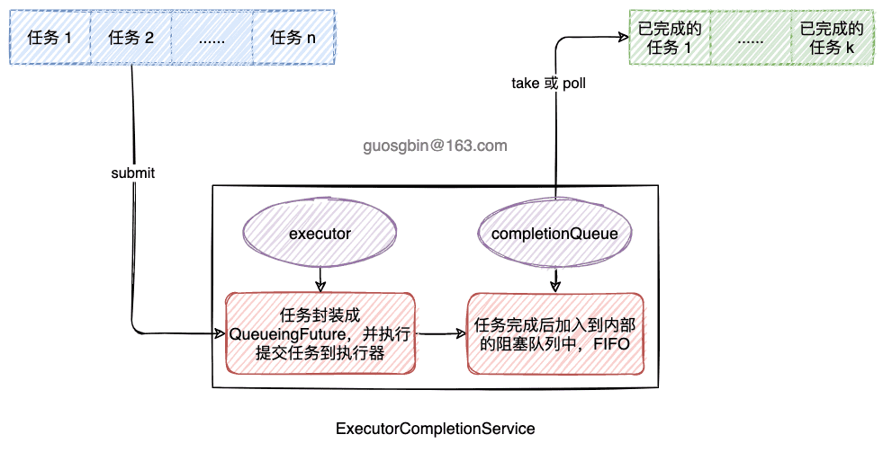

| 版本 | 内容 | 时间                   |
| ---- | ---- | ---------------------- |
| V1   | 新建 | 2022年10月09日22:58:16 |

## AbstractExecutorService 概述

```java
public abstract class AbstractExecutorService implements ExecutorService {
    // 省略...
}
```

AbstractExecutorService 是一个抽象类，是 ExecutorService 的一个默认实现。

主要是实现了 ExecutorService 的提交单个任务和批量任务的方法，submit、invokeAny 和 invokeAll 方法；

在看 invokeAny 方法之前，还需要了解 CompletionService 接口，后面会一一分析；

## AbstractExecutorService 的 submit 方法

AbstractExecutorService 中有三个重载的 submit 方法，基本上流程都相似，已一个为例分析。

```java
// 提交一个 Callable 任务
public <T> Future<T> submit(Callable<T> task) {
    if (task == null) throw new NullPointerException();
    RunnableFuture<T> ftask = newTaskFor(task);
    execute(ftask);
    return ftask;
}

// 通过传入 Callable 返回 RunnableFuture
protected <T> RunnableFuture<T> newTaskFor(Callable<T> callable) {
    return new FutureTask<T>(callable);
}
```

流程就是：首先创建一个 FutureTask 对象，然后执行 Executor#execute 方法提交任务，并将 FutureTask 返回给调用者；

## CompletionService 接口

在看 invokeAny 方法之前，需要了解 CompletionService 接口。

```java
public interface CompletionService<V> {
    // 提交一个 Callable 任务，任务完成后这个任务可能会被 take 或者 poll
    Future<V> submit(Callable<V> task);

    // 提交一个 Runnable 任务
    Future<V> submit(Runnable task, V result);

    // 获取并移除表示下一个已完成任务的Future，如果没有则阻塞等待
    Future<V> take() throws InterruptedException;

    // 获取并移除表示下一个已完成任务的Future，如果没有则返回 null
    Future<V> poll();

    // 获取并移除表示下一个已完成任务的Future，如果没有则阻塞等待
    // 支持超时
    Future<V> poll(long timeout, TimeUnit unit) throws InterruptedException;
}
```

这个接口的作用是，将异步任务的生成与已完成的任务的结果的使用分离，单独不好分析，我们看一下它的默认实现  ExecutorCompletionService。

## ExecutorCompletionService 类

### 简介

ExecutorCompletionService 是 CompletionService 接口的默认实现。

**ExecutorCompletionService 内部委托 Executor 去执行任务。ExecutorCompletionService 中的任务在执行完后会将所有任务的 Future 添加到 ExecutorCompletionService 内部的队列中。调用队列的 take 和 poll 方法可以获取已经完成的任务的 Future 对象。**

ExecutorCompletionService 是轻量级的，适合多个任务临时使用。


### 案例

ExecutorCompletionService 的 JDK 提供的案例：


先创建一个 Result 类表示任务的执行结果。

```java
static class Result {

}
```


**案例 1：提交一个待执行的任务列表，依次使用它们异步执行的结果**

```java
void solve(Executor e, Collection<Callable<Result>> solvers)
        throws InterruptedException, ExecutionException {
    CompletionService<Result> ecs = new ExecutorCompletionService<>(e);
    // 提交所有要执行的 Callable 任务
    for (Callable<Result> s : solvers) {
        ecs.submit(s);
    }
    // 总共要执行任务的个数
    int n = solvers.size();
    // 依次获取 ExecutorCompletionService 的内部队列中已完成的任务的结果
    for (int i = 0; i < n; ++i) {
        Result r = ecs.take().get();
        if (r != null) {
            // 使用异步执行的结果
            use(r);
        }
    }
}
```


**案例 2：提交一批任务，获取其中最先完成的任务的 Future，获取它的结果并使用，取消其他任务的执行**

```java
void solve2(Executor e, Collection<Callable<Result>> solvers)
    throws InterruptedException {
    CompletionService<Result> ecs = new ExecutorCompletionService<>(e);
    int n = solvers.size();
    //
    List<Future<Result>> futures = new ArrayList<>(n);
    Result result = null;
    try {
        // 提交所有要执行的 Callable 任务，并将它们的 Future 对象添加到集合中
        for (Callable<Result> s : solvers) {
            futures.add(ecs.submit(s));
        }
        // 这个 for 循环其实就是获取 ExecutorCompletionService 内部队列的队首的元素，
        // 只要第一个完成的任务的 Future 不是 null 就退出循环
        for (int i = 0; i < n; ++i) {
            try {
                Result r = ecs.take().get();
                if (r != null) {
                    result = r;
                    break;
                }
            } catch (ExecutionException ignore) {
            }
        }
    } finally {
        // 取消所有任务
        for (Future<Result> f : futures)
            f.cancel(true);
    }
    if (result != null)
        use(result);
}
```

### 原理

首先看它的成员属性：

重要的有两个：

1. **executor**：ExecutorCompletionService 内部的执行任务的操作是委托了这个执行器执行的；
2. **completionQueue**：只要提交的任务完成就会将任务的 Future 添加到这个阻塞队列中去，后续可以获取使用；

```java
// 委托的执行器 Executor
private final Executor executor;
// 抽象的执行器，主要作用是为了调用它的 AbstractExecutorService.newTaskFor
// 可以为 null
private final AbstractExecutorService aes;
// 每个任务执行完或者异常或者取消，都会将任务添加到这个阻塞队列里
private final BlockingQueue<Future<V>> completionQueue;
```


主要看 ExecutorCompletionService 的 submit 方法，选一个分析：

```java
/**
 * 提交一个 Callable 任务
 */
public Future<V> submit(Callable<V> task) {
    if (task == null) throw new NullPointerException();
    RunnableFuture<V> f = newTaskFor(task);
    // 封装成 QueueingFuture 对象，这个重写了 FutureTask 的钩子方法 done()
    executor.execute(new QueueingFuture(f));
    return f;
}
```

可以看到主要就是创建一个 RunnableFuture 对象，然后将该 RunnableFuture 对象封装成特殊的 QueueingFuture 对象并让执行器执行。


QueueingFuture 继承 FutureTask，它的特殊性就在于它重写了 FutureTask#done 方法，这个方法在 FutureTask 中定义的是一个空方法，也就是钩子方法，可以由子类去实现。

QueueingFuture 的 done 方法就是将已经完成（包括异常和取消的）的任务添加到 ExecutorCompletionService 的内部队列中。

```java
// 继承 FutureTask，重写了钩子方法 done
private class QueueingFuture extends FutureTask<Void> {
    QueueingFuture(RunnableFuture<V> task) {
        super(task, null);
        this.task = task;
    }
    // 在任务完成时，或者异常结束，或者被取消了，之后调用该方法
    protected void done() { completionQueue.add(task); }
    private final Future<V> task;
}
```


调用方可以调用队列的 take 或者 poll 方法获取已经完成的任务的 Future 对象，就可以获取对应任务的结果了。


简单一张图概述 ExecutorCompletionService 的原理：



## AbstractExecutorService 的 invokeAny 方法

**invokeAny 方法的定义是：执行给定的任务，当其中任意一个执行完毕后（没有抛出异常），其他剩余的任务都取消掉。**

AbstractExecutorService 的两个重载的 invokeAny 方法最终都调用了 AbstractExecutorService#doInvokeAny 方法。

这个方法里面使用了ExecutorCompletionService，主体流程和上面的案例 2 差不多。

```java
private <T> T doInvokeAny(Collection<? extends Callable<T>> tasks,
                          boolean timed, long nanos)
    throws InterruptedException, ExecutionException, TimeoutException {
    if (tasks == null)
        throw new NullPointerException();
    // 剩余任务数，初始值是任务总数
    int ntasks = tasks.size();
    if (ntasks == 0)
        throw new IllegalArgumentException();
    // 任务返回的 Future 列表
    ArrayList<Future<T>> futures = new ArrayList<Future<T>>(ntasks);
    ExecutorCompletionService<T> ecs =
        new ExecutorCompletionService<T>(this);

    try {
        // 记录异常，以便如果我们无法获得任何结果，我们可以抛出最后一个异常。
        ExecutionException ee = null;
        // 计算任务的截止时间
        final long deadline = timed ? System.nanoTime() + nanos : 0L;
        Iterator<? extends Callable<T>> it = tasks.iterator();

        // 一定要开始一项任务；其余部分递增
        futures.add(ecs.submit(it.next()));
        --ntasks;
        // 记录正在执行的任务数量
        int active = 1;

        // 每次提交一个任务，都会重新检查 ecs 在是否有任务已经完成了
        for (;;) {
            // 尝试获取并移除 ecs 的队首元素
            Future<T> f = ecs.poll();
            // 条件成立，说明还没有任何一个任务完成
            if (f == null) {
                // 如果还有剩余的任务，则提交下一个任务
                if (ntasks > 0) {
                    --ntasks;
                    // 提交一个任务
                    futures.add(ecs.submit(it.next()));
                    ++active;
                }
                // 前置条件：ntasks <= 0 说明所有任务都已经提交到执行器了
                // active == 0 说明任务出现异常了
                // 捕获到了异常，则跳出主循环，进行异常的抛出
                else if (active == 0)
                    break;
                // 前置条件 ntasks <= 0 && active != 0 说明有任务在执行
                // 添加成立，说明当前支持超时
                else if (timed) {
                    // 获取 ExecutorCompletionService 的队首元素
                    f = ecs.poll(nanos, TimeUnit.NANOSECONDS);
                    // f == null 说明没有任务执行完，也没有取消，也没有异常，说明执行超时了
                    if (f == null)
                        throw new TimeoutException();
                    // 重新计算超时时间
                    nanos = deadline - System.nanoTime();
                }
                // 前置条件：ntasks <= 0 && active != 0 且不支持超时，说明有任务在执行，需要等待
                else
                    // 阻塞等待获取队首元素
                    f = ecs.take();
            }
            // f!=null 说明有任务执行完了(包括出现异常)
            if (f != null) {
                --active;
                try {
                    return f.get();
                } catch (ExecutionException eex) {
                    ee = eex;
                } catch (RuntimeException rex) {
                    ee = new ExecutionException(rex);
                }
            }
        }

        if (ee == null)
            ee = new ExecutionException();
        throw ee;

    } finally {
        // 取消任务
        for (int i = 0, size = futures.size(); i < size; i++)
            futures.get(i).cancel(true);
    }
```

简单分析下这个方法：

1. 首先创建一个 ExecutorCompletionService 对象，将当前 Executor 对象作为其内部的委托处理器；
2. 先提交一个任务到 ExecutorCompletionService 中；
3. 开启一个 for 循环，
   1. 每次循环的第一步都会尝试从 ExecutorCompletionService 中的队列获取已经完成的任务的 Future；
   2. 有任务完成则获取它的结果，并取消其他已经提交的任务；
   3. 已经提交的任务还在执行，还未完成，则每次循环添加一个任务到 ExecutorCompletionService 中；
   4. 假如所有任务都提交了，还未有任务完成，则根据是否支持超时来做不同的阻塞等待的动作；
   5. 只要有一个任务正常完成，就结束方法；


有个点需要说一下：为了提高效率，特别是在并行度有限的执行器中，上面的代码在**提交一个任务之前都会检查之前添加的任务是否已经完成。**

## AbstractExecutorService 的 invokeAll

```java
/**
 * 执行所有任务
 */
public <T> List<Future<T>> invokeAll(Collection<? extends Callable<T>> tasks)
    throws InterruptedException {
    if (tasks == null)
        throw new NullPointerException();
    ArrayList<Future<T>> futures = new ArrayList<Future<T>>(tasks.size());
    boolean done = false;
    try {
        // 循环将 RunnableFuture 添加到列表，依次执行任务
        for (Callable<T> t : tasks) {
            RunnableFuture<T> f = newTaskFor(t);
            futures.add(f);
            execute(f);
        }
        // 循环获取任务的执行结果
        for (int i = 0, size = futures.size(); i < size; i++) {
            Future<T> f = futures.get(i);
            // 假如某个任务未完成，则阻塞直到任务完成
            if (!f.isDone()) {
                try {
                    f.get();
                } catch (CancellationException ignore) { // 忽略了一些异常
                } catch (ExecutionException ignore) {
                }
            }
        }
        // 当所有任务已经完成了（不管是正常完成还是异常完成，
        // 如发生CancellationException、ExecutionException ），
        // 则将完成标志设为true，并返回结果集合
        done = true;
        return futures;
    } finally {
        // 假如在 done 赋值为 true 之前出现异常了，则取消所有任务
        if (!done)
            for (int i = 0, size = futures.size(); i < size; i++)
                futures.get(i).cancel(true);
    }
}
```


还有一个支持超时版的 invokeAll 方法，和上面的流程差不多。

## 小结

**AbstractExecutorService 是 ExecutorService 的默认实现，重写了 ExecutorService 中部分抽象方法**，我们可以通过继承 AbstractExecutorService 自己实现一个线程池。

在 AbstractExecutorService 的 invokeAny 中使用了  ExecutorCompletionService 类，**ExecutorCompletionService 主要的作用就是为添加的任务封装成一个 QueueingFuture 对象**，该 Future 对象重写了 FutureTask#done，会**在任务完成时添加到一个 FIFO 的阻塞队列中**，调用方可以通过 take 或者 poll 方法获取完成的任务的 Future 对象。

