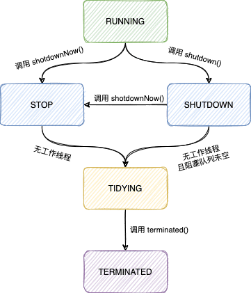
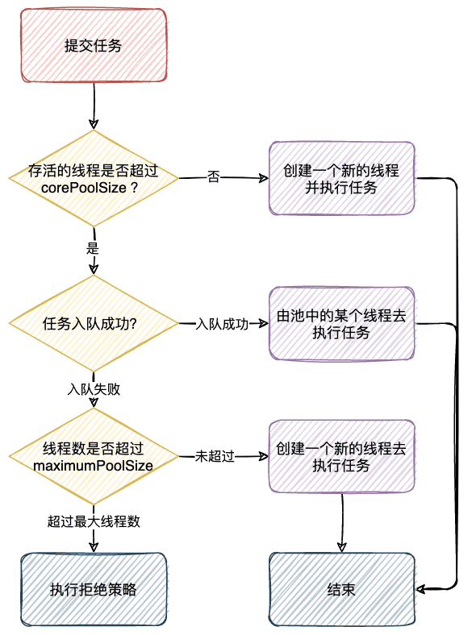

| 版本 | 内容                     | 时间                   |
| ---- | ------------------------ | ---------------------- |
| V1   | 新建                     | 2021年03月12日23:09:11 |
| V2   | 基于第一版修改并重新排版 | 2022年10月12日21:20:34 |

## 线程池的优势

<b>降低资源消耗</b>

我们知道，线程在Java堆里面是一个对象，也是操作系统的一部分资源，线程创建、销毁需要时间。如果创建线程加上销毁的时间大于执行任务的时间就很不划算了。所以，**线程池通过重复利用已创建的线程降低线程创建和销毁造成的消耗**。

Java对象占用堆内存，操作系统线程占用系统的内存，根据JVM虚拟机的规范，一个线程默认最大的是1M，我们可以通过-xss去修改，这个栈空间是需要内存分配的，**线程的增加，必然增加内存的消耗，所以线程不是越多越好**。

<b>提高响应速度</b>

当任务到达时，任务可以不需要等到线程创建就能立即执行。

<b>提高线程的可管理性</b>

**线程是稀缺资源，如果无限制地创建，不仅会消耗系统资源，还会降低系统的稳定性，使用线程池可以进行统一分配、调优和监控**。

## JUC中线程池体系的继承关系


## 线程池基本介绍

下面大部分翻译 JDK 的文档

### 引入

ThreadPoolExecutor 类是 ExecutorService 接口的一个实现，提交的任务由线程池中的线程来执行。<b>线程池工厂 Executors 可以用来创建各种已经配置好参数的线程池。</b>

线程池的引入主要解决下面的问题：

1. 线程池<b>提高了执行大量异步任务的性能，减少了每个任务的调用开销</b>，
2. 给线程提供了限制和管理的一些措施。线程池还提供了一些统计功能，例如线程池总共完成了多少个任务等。

<b>ThreadPoolExecutor提供了多个可配置的参数和大量的钩子方法，钩子方法可以由子类实现来完成扩展</b>。例如在执行任务前调用的 beforeExecute 方法，执行任务后调用的 afterExecute 方法等。

### 核心线程数和最大线程数

ThreadPoolExecutor 会根据 corePoolSize 和 maximumPoolSize 自动调整线程池的线程的个数。

当一个新的任务被提交到 execute 方法时：

- 假如**线程池中的线程的数量小于核心线程数 corePoolSize，此时会创建一个新的线程去处理这个任务**，即使线程池中的线程是空闲的。
- 如果此时**线程池的线程数量大于核心线程数但是小于最大线程数**maximumPoolSize，此时**只会在任务队列满了的时候才会创建一个新的线程**。


假如设置**核心线程数** corePoolSize 和**最大线程数** maximumPoolSize **相同**的话，**表示这是一个固定的线程池**。

假如将最大线程数 maximumPoolSize 设置的很大的话，如 Integer.MAX_VALUE，则表示允许线程池容纳任意数量的并发任务。核心线程个数 corePoolSize 和最大线程个数 maximumPoolSize 一般在构造器时赋值，但是也可以使用对应的 set 方法设置。

### 预启动线程

- **默认情况下，即使是核心线程也是在一个新任务提交的时候才会去创建**。但是可以使用方法 prestartCoreThread 和 prestartAllCoreThreads 动态覆盖。


预启动线程的相关方法：

```java
// 开启一个核心线程
public boolean prestartCoreThread() {
    return workerCountOf(ctl.get()) < corePoolSize &&
        addWorker(null, true);
}

// 与 prestartCoreThread 相同，
// 即使 corePoolSize为0，也至少启动一个线程。
void ensurePrestart() {
    int wc = workerCountOf(ctl.get());
    if (wc < corePoolSize)
        addWorker(null, true);
    else if (wc == 0)
        addWorker(null, false);
}

// 启动所有核心线程，不用等待任务到来时再创建线程
public int prestartAllCoreThreads() {
    int n = 0;
    while (addWorker(null, true))
        ++n;
    return n;
}
```


### 创建新线程

- **线程是通过线程工厂 ThreadFactory 创建的**。默认使用 DefaultThreadFactory 类来创建线程，它将创建具有相同线程组、优先级和守护状态。**通过提供不同的线程工厂，我们可以更改线程的名称、线程组、优先级、守护进程状态等**。

- 当线程工厂创建线程创建失败返回 null 时，代码会继续运行，但是可能任务无法执行成。


### 线程池存活时间

- 如果线程池当前拥有的线程个数大于核心线程数 corePoolSize，多出的线程会在空闲超过过期时间 keepAliveTime 时被杀死，有效减少了线程池的资源消耗。
- 默认情况下，这个超时时间是针对超过核心线程数之外的线程，我们可以使用 allowCoreThreadTimeOut 方法设置核心线程也可以超时。

```java
// 空闲线程超时机制是否应用到核心线程
public void allowCoreThreadTimeOut(boolean value) {
    if (value && keepAliveTime <= 0)
        throw new IllegalArgumentException("Core threads must have nonzero keep alive times");
    if (value != allowCoreThreadTimeOut) {
        allowCoreThreadTimeOut = value;
        // 假如是 true，需要中断线程，因为核心线程可能在 获取阻塞队列的任务时 被阻塞了
        if (value)
            interruptIdleWorkers();
    }
}
```

### 任务队列

可以使用任何阻塞队列BlockingQueue来传输和保存提交的任务。

- 如果线程池的线程个数小于核心线程数 corePoolSize，此时来了新任务时会新创建一个线程去执行，而不是放到任务队列。
- 如果线程池的线程个数大于核心线程数 corePoolSize，此时来了新任务时会将任务入队，而不是创建新线程去执行。
- 如果一个任务无法入队，假如当前线程池的线程个数小于最大线程数 maximumPoolSize，此时会创建一个新线程去执行此任务，否则执行拒绝策略。


**一般有三种入队的策略**：

- Direct handoffs。一个好的选择是使用 SynchronousQueue，它将任务交给线程而不用其他方式保存它们。如果没有立即可用的线程来运行任务，那么就表示对任务的尝试入队失败，因此将创建一个新线程。在处理可能具有内部依赖关系的请求集时，此策略避免了锁定。Direct handoffs 通常需要无限制的最大线程数 maximumPoolSizes，以避免拒绝新提交的任务。**有个缺点就是，当任务的平均提交速度超过了它们的处理速度时，就有可能导致无限制的线程增长**。


- Unbounded queues。**无界队列**，例如 LinkedBlockingQueue。**使用长度无限制的队列在所有的核心线程都在执行任务时，会导致任务在队列中等待。此时，线程池中永远不会创建超过核心线程数的线程，所以最大线程数 maximumPoolSize 没什么用了**。这种适合任务提交速度比较平缓的场景，假如是高并发访问的情况的话，就容易导致线程无限增长，导致OOM。


- Bounded queues。**有界队列**，例如 ArrayBlockingQueue。这种队列可以配合配置最大线程数 maximumPoolSizes 来避免资源耗尽，但可能更难以调整和控制。

  队列的长度和最大线程池个数可以相互权衡。**使用容量大的队列配合小的最大线程数 maximumPoolSizes 会最大限度地减少 CPU 使用率、操作系统资源和上下文切换开销，但是这种会人为的降低吞吐量**。

  如果任务经常阻塞，可以考虑调用设置最大线程数的方法，重新设置线程池最大线程数。使用小队列通常需要更大的池大小，这会使 CPU 长期忙碌。如果线程池的容量设置的过大，并发量就会增加，则需要考虑线程调度的问题，反而可能会降低任务的吞吐量。


线程池的线程可以这样配置：

- CPU 密集型任务：参考值可以设置为 NCPU + 1；
- IO 密集型任务：参考值可以设置为 2 * NCPU；

### 拒绝策略

执行拒绝策略的情况：

- **线程池被关闭了**，SHUTDOWN；
- **线程池的任务队列满了，且线程池的线程达到最大线程数了**；


有4个预定义的拒绝策略：

1. **默认的拒绝策略**，ThreadPoolExecutor.AbortPolicy，<b>在拒绝的时候抛出一个运行时异常</b>。
2. ThreadPoolExecutor.CallerRunsPolicy，假如线程池还未关闭，让调用 execute 方法的线程直接去执行 run 方法，否则不执行。
3. ThreadPoolExecutor.DiscardPolicy，<b>这个拒绝策略，什么都没做。其实就是把任务抛弃了</b>。
4. ThreadPoolExecutor.DiscardOldestPolicy，用于被拒绝任务的处理程序，它放弃最旧的未处理请求，也就是<b>让最旧的任务出队，自己入队，然后重试 execute 。如果执行程序已关闭，在这种情况下，任务将被丢弃</b>。


调用 reject 方法拒绝任务，根据设置的拒绝策略处理。

```java
final void reject(Runnable command) {
    handler.rejectedExecution(command, this);
}
```


默认 AbortPolicy，可以看到是直接抛出一个异常；

```java
public static class AbortPolicy implements RejectedExecutionHandler {
    public AbortPolicy() { }
    public void rejectedExecution(Runnable r, ThreadPoolExecutor e) {
        throw new RejectedExecutionException("Task " + r.toString() +
                                             " rejected from " +
                                             e.toString());
    }
}
```


CallerRunsPolicy，就是在线程池运行状态下让调用 execute 方法的线程去执行这个拒绝的任务。

```java
public static class CallerRunsPolicy implements RejectedExecutionHandler {
    public CallerRunsPolicy() { }
    public void rejectedExecution(Runnable r, ThreadPoolExecutor e) {
        if (!e.isShutdown()) {
            r.run();
        }
    }
}
```


DiscardPolicy，什么也没做，其实就是把任务抛弃了。

```java
public static class DiscardPolicy implements RejectedExecutionHandler {
    public DiscardPolicy() { }
    public void rejectedExecution(Runnable r, ThreadPoolExecutor e) {
    }
}
```


DiscardOldestPolicy，顾名思义，就是在线程池是运行态时丢掉最旧的任务，然后调用 execute 方法重新提交任务。

```java
public static class DiscardOldestPolicy implements RejectedExecutionHandler {
    public DiscardOldestPolicy() { }
    /**
     * Obtains and ignores the next task that the executor
     * would otherwise execute, if one is immediately available,
     * and then retries execution of task r, unless the executor
     * is shut down, in which case task r is instead discarded.
     *
     * @param r the runnable task requested to be executed
     * @param e the executor attempting to execute this task
     */
    public void rejectedExecution(Runnable r, ThreadPoolExecutor e) {
        if (!e.isShutdown()) {
            e.getQueue().poll();
            e.execute(r);
        }
    }
}
```


我们可以自定义一个拒绝策略，做一下记录，例如：

```java
public class CustomRejectedExecutionHandler implements RejectedExecutionHandler {
    // 共抛弃多少个任务
    private final AtomicLong handlerCount = new AtomicLong(0L);
    // 每抛弃多少个任务报警一次
    private Long period;
    private CustomRejectedExecutionHandler(Long period) {
        this.period = period;
    }

    @Override
    public void rejectedExecution(Runnable r, ThreadPoolExecutor executor) {
        if (!executor.isShutdown()) {
            executor.getQueue().poll();
            executor.execute(r);
        }
        try {
            long currentCount = handlerCount.incrementAndGet();
            long model = currentCount % period;
            if (currentCount == 1L || model == 0L) {
                // 打日志，发送短信或者钉钉......
            }
        } catch (Exception e) {
            // 处理...
        }
    }
}
```

### 钩子方法

提供了一些给子类实现的钩子方法，

例如在执行任务之前执行的 beforeExecute 方法，在执行任务之后执行的 afterExecute 方法。我们可以在这些方法里面加一些统计的操作。

此外，方法 terminated 可以被重写，以执行在线程池完全终止后需要完成的任何特殊处理。

如果钩子方法和回调方法抛出异常，内部工作线程可能会依次失败并突然终止。

### 移除队列的任务

可以使用 getQueue 方法去获取任务队列对象。强烈建议不要将此方法用于任何其他目的。

提供的两个方法，remove(Runnable) 和 purge，可用于在取消大量排队的任务时帮助进行存储回收。


### 线程池关闭

如果一个线程池在程序中不再被引用，并且内部没有剩余的线程，那么它将**自动被 shutdown 关闭**。

如果你想确保即使用户忘记调用 shutdown 也能回收未引用的线程，我们必须要让未使用的线程最终死亡。可以通过设置适当的线程的活跃超时时间，0 核心线程或者通过 allowCoreThreadTimeOut 方法设置核心线程是否允许超时等。

## 构造方法

&emsp;&emsp;线程池的构造方法有 4 个，其实都是基于一个参数最多的构造方法，只需要关注这个即可。

&emsp;&emsp;构造方法中针对某些参数有些限制

- 核心线程数不能小于 0；
- 最大线程数量不能小于等于 0，且不小于核心线程数；
- 线程超时时间不能小于 0；

```java
/**
 *
 * @param corePoolSize 核心线程数
 * @param maximumPoolSize 最大线程数
 * @param keepAliveTime 线程的超时时间
 * @param unit 超时时间的单位
 * @param workQueue 存放任务的任务队列
 * @param threadFactory 创建线程的线程工厂类
 * @param handler 线程池的拒绝策略
 */
public ThreadPoolExecutor(int corePoolSize,
                          int maximumPoolSize,
                          long keepAliveTime,
                          TimeUnit unit,
                          BlockingQueue<Runnable> workQueue,
                          ThreadFactory threadFactory,
                          RejectedExecutionHandler handler) {
    // 核心线程数不能小于0
    // 最大线程数量不能小于等于0，且不小于核心线程数
    // 超时时间不能小于0
    if (corePoolSize < 0 ||
        maximumPoolSize <= 0 ||
        maximumPoolSize < corePoolSize ||
        keepAliveTime < 0)
        throw new IllegalArgumentException(); 
    if (workQueue == null || threadFactory == null || handler == null)
        throw new NullPointerException();
    // 下面是这些参数的赋值
    this.acc = System.getSecurityManager() == null ?
            null :
            AccessController.getContext();
    this.corePoolSize = corePoolSize;
    this.maximumPoolSize = maximumPoolSize;
    this.workQueue = workQueue;
    this.keepAliveTime = unit.toNanos(keepAliveTime);
    this.threadFactory = threadFactory;
    this.handler = handler;
}
```

## 线程池状态和原子变量 ctl

### 原子变量 ctl

ThreadPoolExecutor 使用一个 AtomicInteger 的原子变量 ctl 来记录线程池的状态和当前线程池的有效线程的个数。

```java
private final AtomicInteger ctl = new AtomicInteger(ctlOf(RUNNING, 0));
```

ctl 按照位数分隔表示了两个属性：

- **wokerCount：表明了存活的有效的线程的个数**；
- **runState：表明线程池的状态，例如正在运行，关闭等**；

ctl 是 int 类型的数，前面 3 位表示线程池的状态，后面 29 为表示有效线程的个数。也就说最多`(2 ^ 29) - 1` (大约5个亿)个线程。

> 注意：<b>wokerCount表示正在运行没有停止的的线程的个数，该值可能暂时不等于实际的活动线程数</b>。


### 线程池生命周期

runState 表示线程池的生命周期的状态：

- **RUNNING：接受新的任务并处理队列中的任务。**

- **SHUTDOWN：不接受新的任务，但是会去处理队列中的任务。**

- **STOP：不接受新的任务，不处理队列中的任务，中断正在执行中的任务。**

- **TIDYING：临时状态。如果所有的任务终止，wokerCount 为 0（阻塞队列为空，线程池中的工作线程数量为 0），线程池就会进入这个状态，是一个过渡状态，会在 TERMINATED 状态之前执行 terminated() 的钩子方法。**
  
- **TERMINATED：处于 TIDYING 状态的线程池调用 terminated() 方法执行完了，就会进入这个状态**


为了给这些个状态作比较，也就是判断数值的大小，所以它们的数值大小很重要，运行状态随时间增加，但不保证能够到达每个状态。


线程池的状态过度过程如下：

- `RUNNING -> SHUTDOWN`：**调用了shutdown()方法，该方法还隐藏在finalize()方法中。**

- `(RUNNING or SHUTDOWN) -> STOP`：**调用了shutdownNow()方法。**

- `SHUTDOWN -> TIDYING`：**队列和池子都为空。**

- `STOP -> TIDYING`：**当池子为空时。**

- `TIDYING -> TERMINATED`：**当terminated()的钩子方法执行完成后。**




当状态是TERMINATED时，在awaitTermination()方法中等待的线程将会返回。

检测从SHUTDOWN状态到TIDYING状态，没有我们想象的那么简单，因为队列可能在非空之后变为空，反之亦然。但是我们只能在看到队列为空之后终止，我们看到workerCount为0（这有时需要重新检查——见下文）

### 原子变量 ctl 的位操作

```java
/**
 * ctl变量，代表两个含义，高三位代表状态，低位表示线程池中线程的数量
 */
private final AtomicInteger ctl = new AtomicInteger(ctlOf(RUNNING, 0));

/**
 * COUNT_BITS表示带代表表示线程数量的上限的位数
 * 一般来说Integer.SIZE为32，所以COUNT_BITS值为29
 */
private static final int COUNT_BITS = Integer.SIZE - 3; // 一般来说是29

/**
 * CAPACITY表示线程个数的上限 大约5亿多  (2 ^ 29) - 1
 */
private static final int CAPACITY   = (1 << COUNT_BITS) - 1;


/* ---- runState存储在ctl的高三位 ---- */

/**
 * RUNNING：线程池RUNNING状态
 * 接受新的任务，也会去处理队列中的任务
 * -1右移29位 11100000 00000000 00000000 00000000 负数
 */
private static final int RUNNING    = -1 << COUNT_BITS;

/**
 * SHUTDOWN：线程池SHUTDOWN状态
 * 不接受新的任务，但是会去处理线程池的任务
 * 0右移29位 00000000 00000000 00000000 00000000
 */
private static final int SHUTDOWN   =  0 << COUNT_BITS;

/**
 * STOP：线程池STOP状态
 * 不接受新的任务，不处理队列中的任务，中断正在执行中的任务
 * 1右移29位 00100000 00000000 00000000 00000000
 */
private static final int STOP       =  1 << COUNT_BITS;

/**
 * TIDYING：TERMINATED前的过渡状态，用于执行钩子方法
 * 2右移29位 01000000 00000000 00000000 00000000
 */
private static final int TIDYING    =  2 << COUNT_BITS;

/**
 * TERMINATED：线程池TERMINATED状态，表示线程池关闭了
 * 3右移29位 01100000 00000000 00000000 00000000
 */
private static final int TERMINATED =  3 << COUNT_BITS;
```

线程池运行的状态runState存储在ctl的高三位，所以上面每个状态值对应的二进制就是

RUNNING：`11100000 00000000 00000000 00000000`;

SHUTDOWN：`00000000 00000000 00000000 00000000`;

STOP：`00100000 00000000 00000000 00000000`;

TIDYING：`01000000 00000000 00000000 00000000`;

TERMINATED：`01100000 00000000 00000000 00000000`;


<b>获取或组装 ctl 变量中代表线程池状态 runState 和线程个数 workCount 部分的值</b>

**（1）获取 ctl 中表示当前线程池运行状态的值，高三位**

```java
/**
 * ~CAPACITY为 11100000 00000000 00000000 00000000
 */
private static int runStateOf(int c) { 
    return c & ~CAPACITY; 
}
```

**（2）获取 ctl 中 worker 的数量**

```java
/**
 * CAPACITY为 00011111 11111111 11111111 11111111
 */
private static int workerCountOf(int c) {
    return c & CAPACITY; 
}
```

**（3）用在重置当前线程池 ctl 值时会用到**

```java
/**
 * rs 表示线程池状态   wc 表示当前线程池中worker（线程）数量
 */
private static int ctlOf(int rs, int wc) {
    return rs | wc; 
}
```


<b>比较线程池各个状态的值的大小的方法</b>

` RUNNING < SHUTDOWN < STOP < TIDYING < TERMINATED`

```java
/**
 * 比较当前线程池ctl所表示的状态c，是否小于某个状态s
 */
private static boolean runStateLessThan(int c, int s) {
    return c < s;
}

/**
 * 比较当前线程池ctl所表示的状态c，是否大于等于某个状态s
 */
private static boolean runStateAtLeast(int c, int s) {
    return c >= s;
}

/**
 * 判断当前线程池是否是RUNNING状态，因为SHUTDOWN状态是0，只有RUNNING是负数
 */
private static boolean isRunning(int c) {
    return c < SHUTDOWN;
}
```


<b>CAS 更新线程池线程个数的方法</b>

```java
/**
 * 尝试CAS更新workerCount，线程的数量加1
 */
private boolean compareAndIncrementWorkerCount(int expect) {
    return ctl.compareAndSet(expect, expect + 1);
}

/**
 * 尝试CAS更新workerCount，线程的数量减1
 */
private boolean compareAndDecrementWorkerCount(int expect) {
    return ctl.compareAndSet(expect, expect - 1);
}

/**
 * 更新workerCount，线程的数量减1。
 * 只有更新成功才会返回
 */
private void decrementWorkerCount() {
    do {} while (! compareAndDecrementWorkerCount(ctl.get()));
}
```


除了上面这些个方法，还有一些判断当前状态的一些方法，比较简单，就不罗列了。

## 其他属性

- `BlockingQueue<Runnable> workQueue`：阻塞队列；
- ReentrantLock mainLock：全局锁；
- `HashSet<Worker> workers`：所有工作线程的 set 池子（只能在 mainLock 下访问）；
- Condition termination：用于线程交互，阻塞唤醒；
-  int largestPoolSize：线程池的曾经到达过的最大工作线程个数（只能在 mainLock 下访问）；
- long completedTaskCount：线程池完成的任务总数的近似值（只能在 mainLock 下访问）；
- ThreadFactory  threadFactory：线程工厂；
- RejectedExecutionHandler handler：拒绝策略；
- long keepAliveTime：空闲线程的超时时间；
- boolean allowCoreThreadTimeOut：控制 keepAliveTime 的策略是否应用到核心线程；
- int corePoolSize：核心线程数；
- int maximumPoolSize：最大线程数；

## 内部类 Worker

Worker 类继承 AbstractQueuedSynchronizer，并实现了 Runnable 接口。

**Worker 继承 AbstractQueuedSynchronizer，以简化获取和释放每个任务执行的锁，为了防止线程被中断**。因为这些中断旨在唤醒等待任务的工作线程，而不是中断正在运行的任务。

lock 方法一旦获取了独占锁，表示当前线程正在执行任务中，有下面几个作用：

- 如果正在执行任务，则不应该中断线程；
- 如果线程现在不是独占锁的状态，也就是空闲状态，说明它没有在处理任务，这时可以对线程进行中断；

线程池在执行 shutdown 方法或 tryTerminate 方法时会调用 interruptIdleWorkers 方法来中断空闲的线程，interruptIdleWorkers 方法会使用 tryLock 方法来判断线程池中的线程是否是空闲状态。

**在运行 Worke的时候之所以没有用 ReentrantLock 作为独占锁来使用是因为这里是要求不可重入的**，线程池实现了一个简单的不可重入互斥锁，而不是使用可重入锁。因为我们不希望任务在调用像setCorePoolSize这样的线程池控制方法时重新获取锁，这样会中断正在运行的线程。

此外，**为了在线程实际开始运行任务之前抑制中断，我们将锁状态初始化为 -1，并在启动时将其清除（在runWorker 中）**。


属性：

- Thread thread：Worker 封装的线程；
- Runnable firstTask：Worker 封装的任务，假如此变量不为 null，则 worker 的线程就优先执行此任务；
- long completedTasks：每个线程完成任务个数的计数器；

```java
private final class Worker
    extends AbstractQueuedSynchronizer
    implements Runnable
{
    private static final long serialVersionUID = 6138294804551838833L;

    // worker 的线程，当在线程工厂创建失败的时候是 null
    final Thread thread;
    // 不是 null 的话，当线程启动后会第一个执行这个任务
    Runnable firstTask;
    // 线程完成任务个数
    volatile long completedTasks;

    Worker(Runnable firstTask) {
        // 防止在 runWorker 之前被中断
        setState(-1); // inhibit interrupts until runWorker
        this.firstTask = firstTask;
        // 通过线程工厂创建线程，注意线程可能创建失败
        this.thread = getThreadFactory().newThread(this);
    }

    // 线程执行入口
    public void run() {
        runWorker(this);
    }

    // Lock methods
    //
    // The value 0 represents the unlocked state.
    // The value 1 represents the locked state.

    protected boolean isHeldExclusively() {
        return getState() != 0;
    }

    /**
     * 尝试加锁
     */
    protected boolean tryAcquire(int unused) {
        // 尝试修改同步状态为 0 -> 1 ，修改成功表示加锁成功
        if (compareAndSetState(0, 1)) {
            setExclusiveOwnerThread(Thread.currentThread());
            return true;
        }
        return false;
    }

    /**
     * 尝试释放锁
     */
    protected boolean tryRelease(int unused) {
        setExclusiveOwnerThread(null);
        setState(0);
        return true;
    }

    // 加锁
    public void lock()        { acquire(1); }
    // 尝试加锁
    public boolean tryLock()  { return tryAcquire(1); }
    // 释放锁
    // 启动worker之前会先调用unlock()这个方法,
    // 会强制刷新独占线程会强制刷新独占线程ExclusiveOwnerThread为null，同步状态State为0
    public void unlock()      { release(1); }
    // 返回当前worker的独占锁lock是否被占用
    public boolean isLocked() { return isHeldExclusively(); }

    void interruptIfStarted() {
        Thread t;
        if (getState() >= 0 && (t = thread) != null && !t.isInterrupted()) {
            try {
                t.interrupt();
            } catch (SecurityException ignore) {
            }
        }
    }
}
```

## 线程池提交任务流程

### 提交任务入口 execute 

提交任务入口，我们从 ThreadPoolExecutor#execute 分析

```java
public void execute(Runnable command) {
    if (command == null)
        throw new NullPointerException();
    int c = ctl.get();
    // 校验：当前线程池的存活的线程数量 小于 核心线程数吗？
    if (workerCountOf(c) < corePoolSize) {
        // 小于核心线程数就尝试创建一个新的线程，添加成功后直接 return
        // 入参 true 表示使用核心线程数 corePoolSize 来限制
        if (addWorker(command, true))
            return;
        // 到这里说明添加新线程失败（并发），重新获取原子值
        c = ctl.get();
    }
    // 前置条件：当前线程池的线程数 >= 核心线程容量，或者是 addWorker 创建线程失败了
    // 校验：当前线程池是运行状态 && 任务入队成功
    if (isRunning(c) && workQueue.offer(command)) {
        // 重新获取原子状态 double-check
        int recheck = ctl.get();
        // 校验：当前线程池不是运行状态 && 从队列移除任务成功，则执行拒绝策略
        /*
         * CASE 1：!isRunning(recheck) 为 true 的话
         *   说明任务提交到队列之后，线程池状态被外部线程给修改 比如：shutdown() shutdownNow()
         *   此时需要用 remove 将刚刚提交的任务从队列移除
         * CASE 2：remove(command)
         *   移除成功：说明这个任务提交之后，没有线程过来处理
         *   移除失败：说明这个任务提交之后，在线程池关闭前被其他线程给处理了
         */
        if (! isRunning(recheck) && remove(command))
            reject(command);
        // 前置条件：线程池是运行态，或者不是运行态但是移除队列失败了
        // 假如线程池的线程个数是 0，那么需要创建一个 worker 线程保证这个任务执行
        // 此处是保证线程池此时至少得有一个线程，防止线程池没有线程了
        else if (workerCountOf(recheck) == 0)
            addWorker(null, false);
    }
    // 前置条件：线程池不是运行态，或者是运行态但是任务入队失败
    // 此时尝试创建新 worker 线程去执行，
    // 1.线程池状态不是运行态，addWorker 肯定会失败，执行拒绝策略
    // 2.假如是任务入队失败，需要调用 addWorker 方法去尝试创建新线程，添加失败需要执行拒绝策略
    else if (!addWorker(command, false))
        reject(command);
}
```

在线程池刚创建时，默认情况下线程池中的线程数是 0。当我们向线程池提交一个任务时，这个方法的流程：

1. 如果当前线程池的线程数小于 corePoolSize，说明线程数还未到核心线程数，这时**即使是有空闲线程也会去创建一个新的线程去执行任务**。具体对应代码就是调用 addWorker 方法去创建线程；
2. **如果当前线程池的线程数大于等于 corePoolSize**，或者是第一步 addWorker 创建线程失败了的情况。假如此时线程池是运行状态，就会**尝试将任务入队，等待线程池中有空闲线程时，就会执行任务队列中的任务**。这里需要检查线程池状态，**如果线程池状态是非运行状态时，需要拒绝新任务，执行拒绝策略；**
3. 假如在步骤 2 中任务入队成功，其他线程可能会修改线程池的状态，需要对线程池的状态进行 double-check；
   1. 假如线程池当前状态不再是运行态时，需要将刚刚添加的任务从阻塞队列中移除，移除成功则执行后续的拒绝策略（移除失败可能是因为已经执行了）；
   2. 假如线程池当前状态还是运行态时，需要判断线程池的线程个数是否为 0，如果线程池中没有线程了，需要新建一个线程到线程池中（保证线程池此时至少得有一个线程，防止线程池没有线程执行这个任务）；
4. **假如在步骤 2 中任务入队失败，说明阻塞队列已经满了，则会尝试开启新的线程去执行任务。假如当前线程池的线程个数已经到达 maximumPoolSize，则执行拒绝策略**；

### addWorker

前面分析的代码中，有很多地方调用了 addWorker 方法，顾名思义，就是尝试创建一个工作线程。

首先看 addWorker 方法的参数解释：

- Runnable firstTask：假如不为 null 的话，创建的线程会首先执行这个任务；
- boolean core：true 表示使用 corePoolSize 限制线程数量，false 表示使用 maximumPoolSize 限制；

```java
private boolean addWorker(Runnable firstTask, boolean core) {
    // 外部循环标记 retry
    retry:
    for (;;) {
        int c = ctl.get();
        int rs = runStateOf(c);

        /*
         * 判断线程池在此状态是否允许添加线程
         * 条件 1：rs >= SHUTDOWN：成立则说明不是 running 状态
         * 条件 2：结果取反，注意的是当线程池是 SHOTDOWN 状态时，如果队列中还有任务未处理完
         *      这时是允许添加 Worker 的，但是不允许再次提交任务
         *
         * 那么这么说，什么时候走后面的逻辑呢？就是 if 条件返回 false 的时候
         * 1. rs 运行态
         * 2. rs 是 SHUTDOWN 且 firstTask == null 且队列不是空
         */
        if (rs >= SHUTDOWN &&
            ! (rs == SHUTDOWN && firstTask == null && ! workQueue.isEmpty()))
            // 进入这个的情况
            // 1. 当前池子的状态 > SHUTDOWN
            // 2. 当前池子状态是 SHUTDOWN，但是 firstTask 不是 null
            // 3. 当前池子状态是 SHUTDOWN，但是 firstTask 是 null 且队列是空的，也就是没任务了
            return false;

        // 内部自旋，主要是为了增加线程的个数
        for (;;) {
            int wc = workerCountOf(c);
            // 假如当前线程池的线程个数已经达到了 CAPACITY 或者根据 core 变量校验线程个数
            if (wc >= CAPACITY ||
                wc >= (core ? corePoolSize : maximumPoolSize))
                // 线程个数被限制了，返回 false
                return false;
            // CAS 增加 WorkerCount，增加成功退出外循环 retry
            if (compareAndIncrementWorkerCount(c))
                break retry;
            c = ctl.get();  // Re-read ctl
            // 自旋过程中，发现线程池的状态改变了，重新开始外循环，重新校验
            if (runStateOf(c) != rs)
                continue retry;
            // else CAS failed due to workerCount change; retry inner loop
        }
    }

    // 走到这里 workCount 已经成功 +1 了

    // 表示创建的 Worker 是否已经启动
    boolean workerStarted = false;
    // 表示创建的 Worker 是否添加到池子中
    boolean workerAdded = false;
    Worker w = null;
    try {
        // 创建新线程
        w = new Worker(firstTask);
        final Thread t = w.thread;
        // 判断 t != null 的原因是，线程是通过线程工厂获取的，线程工厂可能返回的是 null
        if (t != null) {
            final ReentrantLock mainLock = this.mainLock;
            mainLock.lock();
            try {               
                // 双重检查，如果出现ThreadFactory故障或在获取锁之前关闭，请退出。
                int rs = runStateOf(ctl.get());

                // 校验：线程池运行态 || (SHUTDOWN && firstTask == null)
                if (rs < SHUTDOWN ||
                    (rs == SHUTDOWN && firstTask == null)) {
                    // 校验线程是否调用了 start 方法，这是防止自己实现的 ThreadFactory 在创建线程的时候调了 start
                    if (t.isAlive()) // precheck that t is startable
                        throw new IllegalThreadStateException();
                    workers.add(w);
                    int s = workers.size();
                    // 获取 Set 的大小，假如大于记录的最大 worker 数量 largestPoolSize，则更新
                    if (s > largestPoolSize)
                        largestPoolSize = s;
                    // worker 添加成功标志
                    workerAdded = true;
                }
            } finally {
                mainLock.unlock();
            }
            // 线程校验添加处理成功，则开启线程
            if (workerAdded) {
                t.start();
                workerStarted = true;
            }
        }
    } finally {
        if (! workerStarted)
            // 线程启动失败，则进入这里
            // 主要就是将 Worker 数量减 1，移除刚刚保存到 set 的 worker
            addWorkerFailed(w);
    }
    // 返回是否成功启动线程
    return workerStarted;
}
```

分析下这个方法，大概可以分成两部分，第一步是添加线程池的 workerCount，第二步是创建并开启线程；

（1）首先开启一个外循环，外循环主要是校验线程池的状态：

```java
/*
 * 判断线程池在此状态是否允许添加线程
 * 条件 1：rs >= SHUTDOWN：成立则说明不是 running 状态
 * 条件 2：结果取反，注意的是当线程池是 SHOTDOWN 状态时，如果队列中还有任务未处理完
 *      这时是允许添加 Worker 的，但是不允许再次提交任务
 *
 * 那么这么说，什么时候走后面的逻辑呢？就是 if 条件返回 false 的时候
 * 1. rs 运行态
 * 2. rs 是 SHUTDOWN 且 firstTask == null 且队列不是空
 */
if (rs >= SHUTDOWN &&
    ! (rs == SHUTDOWN && firstTask == null && ! workQueue.isEmpty()))
    // 进入这个的情况
    // 1. 当前池子的状态 > SHUTDOWN
    // 2. 当前池子状态是 SHUTDOWN，但是 firstTask 不是 null
    // 3. 当前池子状态是 SHUTDOWN，但是 firstTask 是 null 且队列是空的，也就是没任务了
    return false;
```

（2） 假如上面的状态校验通过，则进入内循环，内循环是为了增加线程池工作线程的数量。根据 core 参数控制当前是否允许创建 Worker 线程。

- 假如增加工作线程数量成功，则退出外循环继续向后走；
- 假如增加工作线程数量失败，需要校验线程池是否发生改变；
  - 线程池发生改变，继续外循环，重新校验线程池状态；
  - 线程池未发生改变，继续内循环尝试增加工作线程的个数；

```java
// 内部自旋，主要是为了增加线程的个数
for (;;) {
    int wc = workerCountOf(c);
    // 假如当前线程池的线程个数已经达到了 CAPACITY 或者根据 core 变量校验线程个数
    if (wc >= CAPACITY ||
        wc >= (core ? corePoolSize : maximumPoolSize))
        // 线程个数被限制了，返回 false
        return false;
    // CAS 增加 WorkerCount，增加成功退出外循环 retry
    if (compareAndIncrementWorkerCount(c))
        break retry;
    c = ctl.get();  // Re-read ctl
    // 自旋过程中，发现线程池的状态改变了，重新开始外循环，重新校验
    if (runStateOf(c) != rs)
        continue retry;
    // else CAS failed due to workerCount change; retry inner loop
}
```

（3）走完上面的步骤后，线程池的工作线程个数已经加 1 成功了，此时需要创建 Worker 线程，并开启线程。假如线程开启失败，则需要调用 addWorkerFailed 方法处理；

（4）假如线程正常创建并 start 启动成功，则结束方法。否则调用 addWorkerFailed 方法；

```java
private void addWorkerFailed(Worker w) {
    final ReentrantLock mainLock = this.mainLock;
    mainLock.lock();
    try {
        if (w != null)
            // 假如worker已经创建了，则移除它
            workers.remove(w);
        // worker的数量减1 因为在 addWorker 方法的循环校验阶段就增加了线程个数
        decrementWorkerCount();
        tryTerminate();
    } finally {
        mainLock.unlock();
    }
}
```


我们需要知道线程池的状态是**SHUTDOWN时，线程池不接受新的任务，但是会去处理队列中的任务**。这个时候是**允许添加worker，但是不允许再次提交任务**。


**那么什么时候 addWorker 方法会创建线程失败呢？**

- 当前线程池状态大于 SHUTDOWN 状态，即**STOP、TIDYING、TERMINATED状态**；
- 当前线程池状态是 **SHUTDOWN 状态，且参数 firstTask 不为 null**；
- 当前线程池状态是 **SHUTDOWN 状态，且参数 firstTask 为 null，且任务队列是空的，也就是没任务**；
- 当前线程池的线**程个数超过上限 5亿，基本不可能**；
- 当前线程池的**线程个数超过核心线程数或最大线程个数，具体哪一个需要根据参数 core 决定**；
- 当前线程池的 ThreadFactory 有问题，创建的线程是 null，或者是工厂中创建线程后立马调用了 start 方法；
- 可能发生异常了，通常是 Thread.start() 中发生 OOM 了；

## 线程池任务的执行

### runWorker 方法

线程创建并启动完成后就会调用 Worker 的 run 方法。

```java
// 线程执行入口
public void run() {
    runWorker(this);
}
```


所以线程运行后，就会调用 ThreadPoolExecutor#runWorker 方法。

这个方法主要就是执行 firstTask 任务和阻塞队列中的任务。

```java
final void runWorker(Worker w) {
    Thread wt = Thread.currentThread();
    Runnable task = w.firstTask;
    w.firstTask = null; // help GC
    /*
     * 因为之前创建 Worker 的时候将 AQS 的 state 初始为 -1，是为了防止线程被中断
     * 而这里 unlock 方法是把 state 重置为 0，exclusiveOwnerThread ==null。
     * 意思就是已经进入到 runWorker 方法中，可以允许中断了
     */
    w.unlock(); // allow interrupts
    // 是否是正常退出标志，false 正常退出 true 字面意思突然退出，也就是有异常
    boolean completedAbruptly = true;
    try {
        // 执行 firstTask 任务，或者从阻塞队列中获取任务执行
        while (task != null || (task = getTask()) != null) {
            // 设置独占锁 不是可重入锁，为了确保下面的代码不会被同一线程所重入，同时可以做到不同线程可以并发执行
            // shutdown 时会判断当前 worker 状态，根据独占锁是否空闲来判断当前 worker 是否正在工作。
            w.lock();
            // 假如线程池的状态 >= STOP 需要保证线程被中断。
            // 线程池的状态 < STOP，需要保证线程未被中断。
            // 这需要在第二种情况下重新检查，以处理 shutdownNow 争用，同时清除中断状态
            // ((当前线程池的状态 >= STOP) || (当前线程是否被中断 && 当前线程池的状态 >= STOP)) && 当前线程未被中断
            if ((runStateAtLeast(ctl.get(), STOP) || (Thread.interrupted() && runStateAtLeast(ctl.get(), STOP)))
                    && !wt.isInterrupted())
                // 中断线程
                wt.interrupt();
            try {
                // 执行任务前的逻辑
                beforeExecute(wt, task);
                Throwable thrown = null;
                try {
                    // 执行任务的 run 方法
                    task.run();
                } catch (RuntimeException x) {
                    thrown = x; throw x;
                } catch (Error x) {
                    thrown = x; throw x;
                } catch (Throwable x) {
                    thrown = x; throw new Error(x);
                } finally {
                    // 执行任务后执行的逻辑
                    afterExecute(task, thrown);
                }
            } finally {
                // beforeExecute，run，afterExecute都可能会抛出异常
                // 任务置null 下次循环的时候就会在阻塞队列中拿取下一个任务了
                task = null;
                // 完成任务+1
                w.completedTasks++;
                // 释放独占锁
                w.unlock();
                // 正常情况下，会继续进行while循环
                // 异常情况下，会直接退出循环，直接跳到processWorkerExit，此时completedAbruptly为true
            }
        }
        // 走到此处说明 Worker 和队列中都已经没有了任务
        completedAbruptly = false;
    } finally {
        // 执行退出 Worker 的逻辑
        processWorkerExit(w, completedAbruptly);
    }
}
```

分析下上面这个方法：

- 首先调用 unlock 方法，允许线程被中断；
- 开启一个 while 循环，执行 firstTask 任务或者阻塞队列中的任务；
- 每次执行任务让线程持有独占锁，任务执行完后释放独占锁；
- 获取独占锁后，需要校验线程池的状态，
  - 假如线程池的状态 >= STOP 需要保证线程被中断；
  - 假如线程池的状态 < STOP，需要保证线程未被中断；
- 任务执行前，需要执行钩子方法 ThreadPoolExecutor#beforeExecute，任务执行完后，需要执行钩子方法ThreadPoolExecutor#afterExecute；
- 没有任务执行或者发生异常了会退出 while 循环，最后会调用 ThreadPoolExecutor#processWorkerExit 方法退出任务线程。beforeExecute，run，afterExecute 方法都可能会抛出异常，此时入参 completedAbruptly 会是 true；


### 获取任务 getTask 方法

在 ThreadPoolExecutor#runWorker 方法中，通过 ThreadPoolExecutor#getTask 方法从阻塞队列中获取任务执行，当 getTask 方法返回 null 的时候，说明阻塞队列中没有任务了，需要 Worker 执行退出逻辑。

```java
private Runnable getTask() {
    boolean timedOut = false; // Did the last poll() time out?

    for (;;) {
        int c = ctl.get();
        int rs = runStateOf(c);

        /*
         * Check if queue empty only if necessary.
         * 条件1：rs >= SHUTDOWN 线程池的状态不是RUNNING状态
         * 条件2：rs >= STOP || workQueue.isEmpty()
         *     线程池的状态为STOP，TIDYING，TERMINATED
         *  或者 线程池的状态为SHUTDOWN状态且队列中没有任务了
         * 这两种状态已经不需要获取任务了，返回null之后runWorker就退出循环了
         */
        if (rs >= SHUTDOWN && (rs >= STOP || workQueue.isEmpty())) {
            decrementWorkerCount();
            return null;
        }

        // 走到这里说明：1-线程池时RUNNING 2-SHUTDOWN但是阻塞队列中还有任务

        int wc = workerCountOf(c);

        // Are workers subject to culling?
        // allowCoreThreadTimeOut 是控制核心线程是否允许超时的
        // timed表示当前线程是否允许超时 销毁
        boolean timed = allowCoreThreadTimeOut || wc > corePoolSize;
        /*
         * timedOut 为 true说明不是第一次循环了 上次循环中已经发生了poll的超时
         * 条件一：(wc > maximumPoolSize || (timed && timedOut))
         * 1.1：wc > maximumPoolSize  为什么会成立？setMaximumPoolSize()方法，可能外部线程将线程池最大线程数设置为比初始化时的要小
         * 1.2: (timed && timedOut) 条件成立：前置条件，当前线程使用 poll方式获取task。上一次循环时  使用poll方式获取任务时，超时了
         * 条件一 为true 表示 线程可以被回收，达到回收标准，当确实需要回收时再回收。
         * 条件二：(wc > 1 || workQueue.isEmpty())
         * 2.1: wc > 1  条件成立，说明当前线程池中还有其他线程，当前线程可以直接回收，返回null
         * 2.2: workQueue.isEmpty() 前置条件 wc == 1， 条件成立：说明当前任务队列 已经空了，最后一个线程，也可以放心的退出。
         */
        if ((wc > maximumPoolSize || (timed && timedOut))
            && (wc > 1 || workQueue.isEmpty())) {
            if (compareAndDecrementWorkerCount(c))
                return null;
            continue;
        }

        try {
            /*
             * 如果 timed 为true，则通过 poll 方法进行限时拿取
             *（超过 keepAliveTime 时间没有拿取到，就直接返回 null），
             * 否则通过 take 方法进行拿取
             *（如果阻塞队列为空，take 方法在此时就会被阻塞住，也就是本线程会被阻塞住，直到阻塞队列
             * 中有数据了。也就是说如果 timed 为 false 的话，这些工作线程会一直被阻塞在这里）
             */
            Runnable r = timed ?
                workQueue.poll(keepAliveTime, TimeUnit.NANOSECONDS) :
                workQueue.take();
            if (r != null)
                return r;
            timedOut = true;
        } catch (InterruptedException retry) {
            timedOut = false;
        }
    }
}
```

分析下上面的方法：

getTask 方法可能会使当前线程阻塞或等待，取决于当前的配置。

getTask返回 null 是因为当前的 worker 必须退出了，退出的可能情况有下：

- 线程池里的线程数量大于 maximumPoolSize 了，这是因为调用了 setMaximumPoolSize 方法；
- 线程池在 STOP 状态。此时不会接收新的任务，也不会去执行队列的任务；
- 线程池在 SHUTDOWN 状态，且队列中没有任务了。因为此状态不会接收新的任务，假如队列中还有任务的话，还是会去执行队列里的任务；
- Worker 等待任务超时，当前的 worker 必须退出了；


**可以看到 keepAliveTime 就是控制线程从阻塞队列中获取任务的超时时间。**

### processWorkerExit 方法

当线程在运行时，在获取任务超时或者执行任务的时候发生异常了，需要 Worker 退出，就会调用 processWorkerExit 方法处理。

这个方法将要退出的线程从 WorkerSet 中移除，并尝试 tryTerminate，在下面几种情况会创建新的 Worker 添加到池中，前提都是当前线程池的状态是 RUNNING 或者 SHUTDOWN。

- 当前线程在执行任务时发生异常，需要创建一个新 worker 到线程池；
- !workQueue.isEmpty() 说明任务队列中还有任务，最起码要留一个线程；
- 当前线程数量小于 corePoolSize 值，此时会创建线程，维护线程池数量在corePoolSize个；

```java
private void processWorkerExit(Worker w, boolean completedAbruptly) {
    if (completedAbruptly) // If abrupt, then workerCount wasn't adjusted
        // 如果是发生异常退出循环的，需要减少worker的数量
        // 异常退出时，ctl 计数，并没有-1
        decrementWorkerCount();

    final ReentrantLock mainLock = this.mainLock;
    mainLock.lock();
    try {
        // 将单个 worker 完成的任务数量累加到线程池的完成数量
        completedTaskCount += w.completedTasks;
        /*
         * 把当前 Worker（也就是当前线程）剔除出 workers 集合中，等待GC
         * 要么是空闲的核心线程超时需要被销毁，要么是空闲的非核心线程超时需要被销毁。
         * 不管属于哪一种，当前线程都是要被销毁的
         */
        workers.remove(w);
    } finally {
        mainLock.unlock();
    }

    // 尝试将线程池改为Terminate状态
    tryTerminate();

    int c = ctl.get();
    // 条件成立，说明当前线程池的状态是 RUNNING 或者 SHUTDOWN
    if (runStateLessThan(c, STOP)) {
        // 条件成立说明，当前线程的退出是正常退出，不是异常
        if (!completedAbruptly) {
            int min = allowCoreThreadTimeOut ? 0 : corePoolSize;
            // 此时如果队列里还有任务没执行（可能在执行到此处的时候，又有人提交了任务到队列中了），
            // 就使 min=1，因为还需要至少留一个线程去执行task任务
            if (min == 0 && ! workQueue.isEmpty())
                min = 1;
            // 假如当前线程池的worker的数量大于等于min，说明线程池的worker数量足够，直接返回
            if (workerCountOf(c) >= min)
                return; // replacement not needed
        }
        // 此处前置条件：1-线程执行任务发生异常 2-正常执行任务但是workerCountOf(c) < min
        // 1.当前线程在执行任务时发生异常，需要创建一个新 worker 到线程池。
        // 2.!workQueue.isEmpty() 说明任务队列中还有任务，最起码要留一个线程。 当前状态为 RUNNING || SHUTDOWN
        // 3.当前线程数量 < corePoolSize值，此时会创建线程，维护线程池数量在corePoolSize个。
        addWorker(null, false);
    }
}
```

## 线程池优雅关闭

### shutdown 方法

关闭线程池时一般调用的是 shutdown 方法，而不是 shutdownNow 方法：

**SHUTDOWN 状态，这个状态不会接受新的任务，但是会去执行队列中的任务**。如果当前的状态已经是 SHUTDOWN状态或者之后的状态，则此次调用，没有什么额外的效果。

需要注意的是：**此方法不等待先前提交的任务完成执行**。我们可以用 awaitTermination 方法等待之前的任务执行完成。

```java
public void shutdown() {
    final ReentrantLock mainLock = this.mainLock;
    mainLock.lock();
    try {
        // 检查关闭的权限
        checkShutdownAccess();
        // 尝试将线程池的状态改为 SHUTDOWN
        advanceRunState(SHUTDOWN);
        // 中断空闲线程（线程可能在阻塞等待阻塞队列中的任务）
        interruptIdleWorkers();
        // ScheduledThreadPoolExecutor 的钩子方法
        onShutdown(); // hook for ScheduledThreadPoolExecutor
    } finally {
        mainLock.unlock();
    }
    tryTerminate();
}
```


### shutdownNow 方法

**尝试停止所有正在执行的任务，停止处理等待中的任务，返回那些等待执行的任务的集合。**从该方法返回时，这些任务将从任务队列中删除。


这个方法不会等待正在执行的任务执行完毕。使用 awaitTermination 方法完成的。

除了尽最大努力尝试停止正在执行的任务之外，没有任何保证。此实现通过 interrupt 取消任务，**因此任何未能响应中断的任务可能永远不会终止**。

```java
public List<Runnable> shutdownNow() {
    List<Runnable> tasks;
    final ReentrantLock mainLock = this.mainLock;
    mainLock.lock();
    try {
        // 校验关闭线程的权限
        checkShutdownAccess();
        // 线程池的状态改为 STOP
        advanceRunState(STOP);
        // 中断所有已经启动的线程
        interruptWorkers();
        // 导出未处理的任务列表
        tasks = drainQueue();
    } finally {
        mainLock.unlock();
    }
    // 根据线程池状态来判断是否应该结束线程池
    tryTerminate();
    // 返回当前任务队列中 未处理的任务。
    return tasks;
}
```

shutdownNow 方法和 shutdown 方法的逻辑大体相同，只是 shutdownNow 方法是将线程池状态改为 STOP，中断所有的 Worker 线程，并将任务队列中剩余未执行的任务返回给调用方法了。

### tryTerminate 方法

在看 awaitTermination 方法之前，需要先看看 tryTerminate 方法。

tryTerminate 在线程池中有很多地方在调用，这个方法的作用就是尝试将线程池的状态改成 TERMINATED。

- **addWorkerFailed(Worker)**
- **processWorkerExit(Worker, boolean)**
- purge()
- remove(Runnable)
- **shutdown()**
- **shutdownNow()**


需要注意的地方：

1. 当线程池的工作线程的个数是 0 的时候，调用 interruptIdleWorkers 方法中断一个空闲的线程，相当于传播一个关闭的信号。因为这里中断是 getTask 方法中阻塞等待任务的线程，中断后 getTask 返回 null，返回 null 后，就会调用 processWorkerExit 中继续调用 tryTerminate 方法；
2. 会调用钩子方法 terminated() 方法；
3.  在线程池的状态被改为 TERMINATED 时，就会调用 Condition 的 await 方法唤醒可能在 方法在awaitTermination() 中阻塞的线程；

```java
final void tryTerminate() {
    // 自旋
    for (;;) {
        int c = ctl.get();
        /*
         * 1 当前线程池是RUNNING状态 此时无需结束线程池
         * 2 当前线程池的状态大于等于TIDYING，说明已经有其它线程在执行TIDYING -> TERMINATED状态了，
         *   也就是已经走到了下面的步骤，线程池即将终结，此线程直接返回
         * 3 当前线程池是SHUTDOWN状态且任务队列不为空。说明还有任务需要处理 不能改变线程池状态
         */
        if (isRunning(c) ||
            runStateAtLeast(c, TIDYING) ||
            (runStateOf(c) == SHUTDOWN && ! workQueue.isEmpty()))
            return;
        /*
         * 运行到此处前提是
         * 1-线程池的状态为STOP
         * 2-线程池的状态为SHUTDOWN，但是队列为空
         */
        if (workerCountOf(c) != 0) { // Eligible to terminate
            // 中断一个空闲的线程
            // 这里中断是 getTask 方法中阻塞等待任务的线程，中断后 getTask 返回 null
            // 返回 null 后，就会调用 processWorkerExit 中继续调用 tryTerminate 方法
            // 中断一个空闲的线程，相当于传播一个关闭线程池的信号
            interruptIdleWorkers(ONLY_ONE);
            return;
        }

        // 走到这里说明当前工作线程数已经为0了，
        // 也就是说当前线程是最后一个执行任务的线程，此时需要完成结束线程池的动作
        final ReentrantLock mainLock = this.mainLock;
        mainLock.lock();
        try {
            // CAS 尝试创建 c   是 TIDYING 状态且 workcount 是 0
            if (ctl.compareAndSet(c, ctlOf(TIDYING, 0))) {
                try {
                    // 终止，钩子方法，子类实现
                    terminated();
                } finally {
                    // 设置 TERMINATED 状态且 workcount 是 0
                    ctl.set(ctlOf(TERMINATED, 0));
                    // 唤醒阻塞在termination条件的所有线程，这个变量的await()方法在awaitTermination()中调用
                    termination.signalAll();
                }
                return;
            }
        } finally {
            mainLock.unlock();
        }
        // else retry on failed CAS
    }
}
```


###  awaitTermination 等待任务完成

该方法调用会被阻塞，直到所有任务执行完毕并且 shutdown 请求被调用，或者参数中定义的 timeout 时间到达或者当前线程被打断，

```java
/**
 * 等待线程池的状态是 TERMINATED，才退出阻塞
 * 其实就是等待任务全部完成，具体可在 tryTerminated 方法看到
 */
public boolean awaitTermination(long timeout, TimeUnit unit)
    throws InterruptedException {
    long nanos = unit.toNanos(timeout);
    final ReentrantLock mainLock = this.mainLock;
    mainLock.lock();
    try {
        for (;;) {
            // 自旋直到线程池的状态是 TERMINATED
            if (runStateAtLeast(ctl.get(), TERMINATED))
                return true;
            if (nanos <= 0)
                return false;
            // 阻塞等待
            nanos = termination.awaitNanos(nanos);
        }
    } finally {
        mainLock.unlock();
    }
}
```

## 小结

线程池的核心方法是 execute 方法，控制着工作线程的创建和任务的执行。



关于线程池，我们需要了解的是：

- 线程池有那些优点；
- 创建线程池的参数的如何设置，例如核心线程池数，最大线程数等；
- 线程池的执行流程；


关于线程池的优点可以看文章的开头。线程池的执行流程可以看上面的图。

关于线程池的参数，JDK 的注释里面给我们的建议是

- CPU 密集型任务：就是任务需要 CPU 参与大量的计算，参考值可以设置为 NCPU + 1，这样可以避免很多线程在争抢资源；
- IO 密集型任务：就是任务主要时间都消耗在 I/O 时，参考值可以设置为 2 * NCPU；
