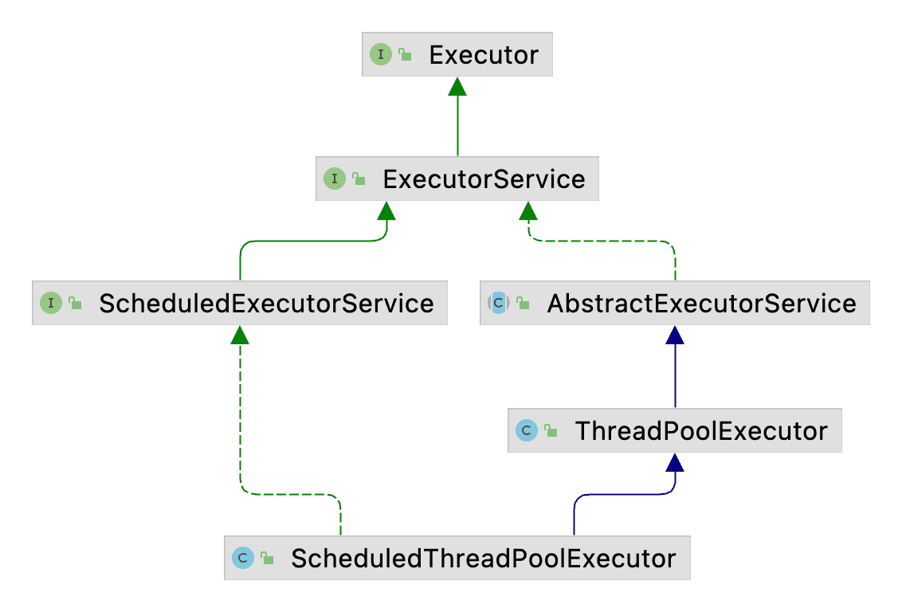
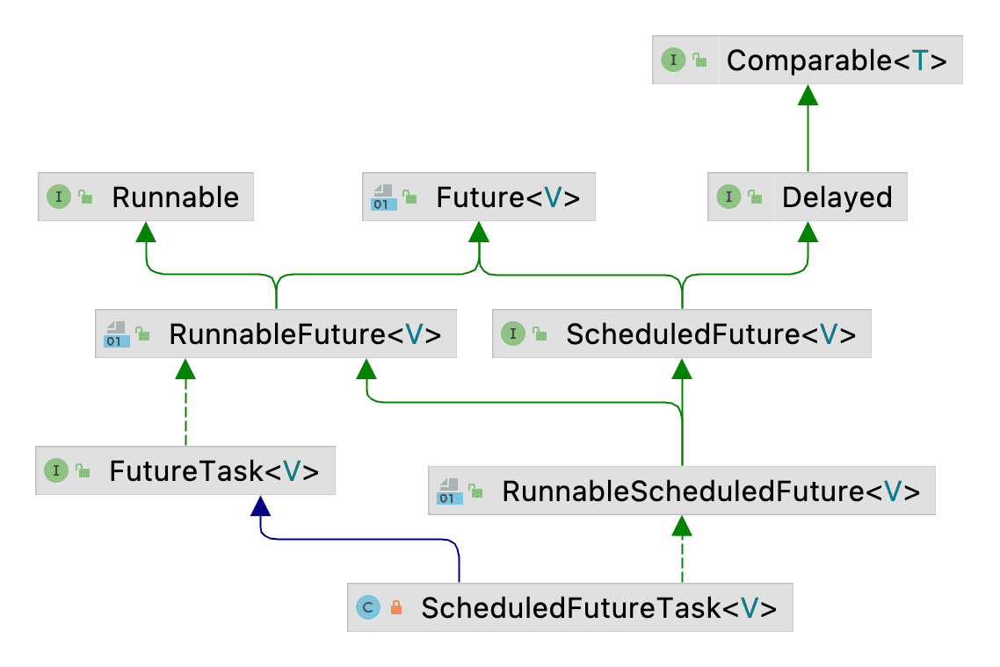

| 版本 | 内容 | 时间                   |
| ---- | ---- | ---------------------- |
| V1   | 新建 | 2022年10月17日23:06:45 |

## 调度线程池简介



调度线程池 ScheduledThreadPoolExecutor 实现了 ScheduledExecutorService 接口，继承了 ThreadPoolExecutor。

ScheduledExecutorService 接口定义了延迟和周期执行任务的接口。

在 ThreadPoolExecutor 中需要指定一个阻塞队列来存放待执行的任务，ScheduledThreadPoolExecutor 也需要指定一个阻塞队列，只不过指定的是一个特殊的延迟任务队列 DelayedWorkQueue，它是一个**优先队列**（最小堆）。

## 调度线程池原理

### 构造方法

ScheduledThreadPoolExecutor 直接调用的是父类 ThreadPoolExecutor 的构造方法。

```java
public ScheduledThreadPoolExecutor(int corePoolSize) {
    super(corePoolSize, Integer.MAX_VALUE, 0, NANOSECONDS,
          new DelayedWorkQueue());
}

public ScheduledThreadPoolExecutor(int corePoolSize,
                                   ThreadFactory threadFactory) {
    super(corePoolSize, Integer.MAX_VALUE, 0, NANOSECONDS,
          new DelayedWorkQueue(), threadFactory);
}

public ScheduledThreadPoolExecutor(int corePoolSize,
                                   RejectedExecutionHandler handler) {
    super(corePoolSize, Integer.MAX_VALUE, 0, NANOSECONDS,
          new DelayedWorkQueue(), handler);
}

public ScheduledThreadPoolExecutor(int corePoolSize,
                                   ThreadFactory threadFactory,
                                   RejectedExecutionHandler handler) {
    super(corePoolSize, Integer.MAX_VALUE, 0, NANOSECONDS,
          new DelayedWorkQueue(), threadFactory, handler);
}
```

从上面的构造方法可以小结下：

- maximumPoolSize 参数的值都是给的 Integer.MAX_VALUE；
- 线程的空闲超时时间 keepAliveTime 给的都是 0；
- 阻塞队列都是指定的优先队列 DelayedWorkQueue（最小堆）；

### ScheduledExecutorService 接口

ScheduledExecutorService 定义了延迟和周期调用的方法，实现类 ScheduledThreadPoolExecutor 具体实现。

```java
public interface ScheduledExecutorService extends ExecutorService {
    /*
     * 延迟任务，在给定延迟后执行一次任务
     */
    public ScheduledFuture<?> schedule(Runnable command,
                                       long delay, TimeUnit unit);
    /*
     * 延迟任务，在给定延迟后执行一次任务，返回 ScheduledFuture
     */
    public <V> ScheduledFuture<V> schedule(Callable<V> callable,
                                           long delay, TimeUnit unit);
    /*
     * 周期任务，在给定延迟后执行周期任务，不考虑任务执行的时间
     */
    public ScheduledFuture<?> scheduleAtFixedRate(Runnable command,
                                                  long initialDelay,
                                                  long period,
                                                  TimeUnit unit);
    /*
     * 周期任务，在给定延迟后执行周期任务，考虑任务执行的时间
     */
    public ScheduledFuture<?> scheduleWithFixedDelay(Runnable command,
                                                     long initialDelay,
                                                     long delay,
                                                     TimeUnit unit);
```

主要是三种类型的方法

- schedule：在给定延迟后执行一次任务；
- scheduleAtFixedRate：在给定延迟后周期性执行任务，这个不会考虑任务的执行时间；
- scheduleWithFixedDelay：在给定延迟后周期性执行任务，这个会考虑任务的执行时间；

考虑任务的延迟时间指的是，一个任务执行完和下一个任务执行开始的时间是固定的。

### ScheduledFutureTask 任务对象

```java
private class ScheduledFutureTask<V>
        extends FutureTask<V> implements RunnableScheduledFuture<V> {}
```



从上面的类的继承关系图可以看到，ScheduledFutureTask 实现了 Comparable 接口，这是因为调度线程池的阻塞队列是一个优先队列（最小堆）。

```java
/** Sequence number to break ties FIFO */
// 任务的序列号
private final long sequenceNumber;

/** The time the task is enabled to execute in nanoTime units */
// 任务的执行时间，相对时间
private long time;

/**
 * Period in nanoseconds for repeating tasks.  A positive
 * value indicates fixed-rate execution.  A negative value
 * indicates fixed-delay execution.  A value of 0 indicates a
 * non-repeating task.
 */
/*
 * 任务的执行周期
 * > 0 表示固定的周期任务，scheduleAtFixedRate 提交的，不考虑任务的执行时间
 * < 0 表示固定的周期任务，scheduleWithFixedDelay 提交的，考虑任务的执行时间
 * = 0 表示不重复的任务
 */
private final long period;

/** The actual task to be re-enqueued by reExecutePeriodic */
// 周期性任务需要重新排队（reExecutePeriodic 方法）
RunnableScheduledFuture<V> outerTask = this;

/**
 * Index into delay queue, to support faster cancellation.
 */
// 索引到延迟队列，以支持更快的取消
int heapIndex;
```

- long sequenceNumber：任务的序号，主要作用就是在判断任务优先级的时候，假如两个任务的执行时间相同，需要根据 sequenceNumber 来判断任务的优先级。这个值是原子递增的；
- long time：任务的执行时间（相对时间）；
- long period：任务的执行周期
  1. period > 0：表示固定速率的周期任务，scheduleAtFixedRate 提交的，不考虑任务的执行时间；
  2. period < 0：表示固定延迟的周期任务，scheduleWithFixedDelay 提交的，考虑任务的执行时间；
  3. period = 0：表示执行一次的延迟任务；
- `RunnableScheduledFuture<V> outerTask`：周期任务需要重新入队，就是将 outerTask 入队；
- int heapIndex：调度线程池的阻塞队列是最小堆的优先队列，heapIndex 表示当前任务在最小堆中的索引；

核心方法 ScheduledFutureTask#run 分析

```java
// 重写 FutureTask 方法，以便定期重置/重新排队。
public void run() {
    // 是否是周期任务
    boolean periodic = isPeriodic();
    // 校验是否可执行任务，如果不能执行，则取消任务
    if (!canRunInCurrentRunState(periodic))
        cancel(false);
    // 假如不是周期任务直接调用父类的 run 方法
    else if (!periodic)
        ScheduledFutureTask.super.run();
    // 走到这里说明是周期任务，调用 FutureTask 的 runAndReset 方法执行任务
    // 当任务执行成功，则返回 true
    else if (ScheduledFutureTask.super.runAndReset()) {
        // 设置下一次任务的执行时间
        setNextRunTime();
        // 将任务重新入队
        reExecutePeriodic(outerTask);
    }
}
}
```


这个方法的流程很简单，

- 首先根据当前任务是延迟任务还是周期任务判断，canRunInCurrentRunState 很简单，就是根据当前线程池的状态来决定任务是否可以执行。假如不能执行，就只想 cancel 方法取消任务；
- 假如任务可以执行，并且当前任务是延迟任务，那么就执行父类的 run 方法；
- 假如任务可以执行，并且当前任务是周期任务，就调用 FutureTask#runAndReset 方法执行任务。任务执行成功后调用  ScheduledFutureTask#setNextRunTime 计算任务的下次执行时间，然后将任务重新入队；


### 核心方法 delayedExecute

ScheduledExecutorService 接口中有三种类型的接口，在 ScheduledThreadPoolExecutor 中都调用了 delayedExecute 方法。

拿一个例子来说 scheduleWithFixedDelay 方法如下：

```java
public ScheduledFuture<?> scheduleWithFixedDelay(Runnable command,
                                                 long initialDelay,
                                                 long delay,
                                                 TimeUnit unit) {
    if (command == null || unit == null)
        throw new NullPointerException();
    if (delay <= 0)
        throw new IllegalArgumentException();
    // 将 Runnable 对象封装成 ScheduledFutureTask
    ScheduledFutureTask<Void> sft =
        new ScheduledFutureTask<Void>(command,
                                      null,
                                      triggerTime(initialDelay, unit),
                                      unit.toNanos(-delay));
    RunnableScheduledFuture<Void> t = decorateTask(command, sft);
    sft.outerTask = t;
    // 执行延迟任务
    delayedExecute(t);
    return t;
}
```


 那么我们需要分析 delayedExecute 方法

```java
private void delayedExecute(RunnableScheduledFuture<?> task) {
    if (isShutdown())
        // shutdown 状态拒绝任务
        reject(task);
    else {
        // 添加任务到阻塞队列
        super.getQueue().add(task);
        // 线程池状态是 shutdown，且当前任务是周期任务
        // 参数控制不允许在 shutdown 执行任务时，且阻塞队列移除任务成功
        if (isShutdown() &&
            !canRunInCurrentRunState(task.isPeriodic()) &&
            remove(task))
            // 取消任务
            task.cancel(false);
        else
            // 确保线程足够
            ensurePrestart();
    }
}
```


分析下这个过程：

1. 首先会判断线程的状态，假如当前线程池的状态不是 RUNNING 状态就执行拒绝策略；
2. 然后将任务添加到优先队列中去；
3. 重新判断线程池的状态，根据参数决定线程池不是 RUNNING 态的时候任务是否允许执行。假如不允许执行就将刚添加的任务从优先队列中移除，并取消任务。
4. 假如允许执行任务的话，就调用 ensurePrestart 方法，确保线程足够执行任务；


```java
void ensurePrestart() {
    int wc = workerCountOf(ctl.get());
    if (wc < corePoolSize)
        addWorker(null, true);
    else if (wc == 0)
        addWorker(null, false);
}
```

这里也说明调度线程池会至少保证有一个线程，最多也只会创建 corePoolSize 个工作线程。

任务提交完成后，会在 Worker 线程的 run 方法中的 ThreadPoolExecutor#getTask 中尝试从优先队列中获取任务执行。

## 延迟队列

### 概述

这里我们看调度线程池的延迟队列 DelayedWorkQueue，它是一个最小堆的优先队列，按照任务的执行任务的时间排序。

这个延迟队列只能存入 RunnableScheduledFutures 对象。

使用数组来表示这个满二叉树，在分析源码之前我们需要了解下面的概念：

- 查询父节点索引：(i -1) / 2
- 查询左子节点： i * 2 + 1
- 查询右子节点：i * 2 + 2


### 插入和删除元素的流程

**插入元素的流程**：

执行向上冒泡的逻辑，首先会将要插入节点放到数组的最后一个节点的后面，然后依次和父节点做比较，假如当前节点的优先级比父节点的高，就交换它们的位置。直到当前节点比父节点的优先级低或者已经冒泡到了根节点了。


**移除元素的流程**：

执行向下冒泡的逻辑，将数组中最后一个节点和根节点的左右节点比较，假如最后一个节点的优先级要比左右子节点的优先级要低，就交换它们的位置。直到已经比较到二叉树的底层了或者当前节点优先级比左右子节点都高。


### 成员属性

```java
// 队列初始容量 16
private static final int INITIAL_CAPACITY = 16;
// 创建 INITIAL_CAPACITY 的 RunnableScheduledFuture 数组
// 满二叉树，存储提交的任务
private RunnableScheduledFuture<?>[] queue = new RunnableScheduledFuture<?>[INITIAL_CAPACITY];
private final ReentrantLock lock = new ReentrantLock();
// 任务队列中存储的任务数量
private int size = 0;
private Thread leader = null;

/**
* Condition signalled when a newer task becomes available at the
* head of the queue or a new thread may need to become leader.
*/
// 当队列前端有新任务可用或新线程可能需要成为引导线程时，会发出条件信号。
private final Condition available = lock.newCondition();
```

可以看到，底层数据结构是使用数组来表示二叉树的，且初始容量是 16。

leader 属性是用来存放在挂起等待堆顶任务的线程。


### 添加任务 offer

```java
/**
 * 添加任务的入口
 */
public boolean offer(Runnable x) {
    if (x == null)
        throw new NullPointerException();
    RunnableScheduledFuture<?> e = (RunnableScheduledFuture<?>)x;
    final ReentrantLock lock = this.lock;
    lock.lock();
    try {
        int i = size;
        if (i >= queue.length)
            // 扩容
            grow();
        size = i + 1;
        // 条件成立，说明当前节点是最小堆的第一个节点（任务）
        if (i == 0) {
            queue[0] = e;
            setIndex(e, 0);
        } else {
            // 说明不是第一个任务，需要进行向上冒泡
            // i：是新节点的冒泡前的位置
            // e：新任务的节点
            siftUp(i, e);
        }
        if (queue[0] == e) {
            leader = null;
            available.signal();
        }
    } finally {
        lock.unlock();
    }
    return true;
}
```


- 添加任务的操作都是加锁的，在内部的数组容量不够时会自动扩容 1.5 倍。

- 添加任务的时候，假如优先队列中已经有任务了，需要调用 siftUp 方法向上冒泡，找到当前任务在数组中的合适位置。
- 添加任务成功后，会判断 `queue[0] == e`，满足这个条件有两种情况
  - 情况 1 ：当前任务是这个优先队列中的第一个任务，此时 leader 肯定是空的，后面的 available.signal() 是为了唤醒在 take() 挂起线程。因为线程池的工作线程启动后会尝试从阻塞队列获取任务；
  - 情况 2：当前任务添加到优先队列后，可能它的优先级比较高，被冒泡到堆顶了，此时的 leader 可能是之前的某个线程占用了，这里需要把它置空，然后调用  available.signal() 唤醒一个线程。


向上冒泡的方法

```java
private void siftUp(int k, RunnableScheduledFuture<?> key) {
    // k == 0 表示找到最小堆的堆顶元素了，
    while (k > 0) {
        // 获取父节点的索引
        int parent = (k - 1) >>> 1;
        // 获取父节点封装的任务
        RunnableScheduledFuture<?> e = queue[parent];
        // 比较两个任务的优先级
        // 条件成立，说明新添加的元素 key 的值要比父节点的值要大（最小堆），说明找到位置了，直接退出循环
        if (key.compareTo(e) >= 0)
            break;
        // 走到这里，说明 key 的值要比父节点的要小，这里需要交换位置，继续向上冒泡
        queue[k] = e;
        setIndex(e, k);
        // 将待比较的索引更新
        k = parent;
    }
    // 走到这里，已经找到要存放的位置了
    queue[k] = key;
    setIndex(key, k);
}
```

执行向上冒泡的逻辑，

- 首先会将要插入节点放到数组的最后一个节点的后面，然后依次和父节点做比较，
- 假如当前节点的优先级比父节点的高，就交换它们的位置。
- 直到当前节点比父节点的优先级低或者已经冒泡到了根节点了。


### 获取任务 take

线程池会在 ThreadPoolExecutor#getTask 中尝试从优先队列中获取任务执行。

```java
/*
 * 阻塞获取任务
 */
public RunnableScheduledFuture<?> take() throws InterruptedException {
    final ReentrantLock lock = this.lock;
    lock.lockInterruptibly();
    try {
        // 自旋，退出自旋说明获取到任务了，或者收到了中断异常
        for (;;) {
            RunnableScheduledFuture<?> first = queue[0];
            if (first == null)
                // 假如堆内没有元素，在条件队列不设置超时时间的等待，会在添加任务的时候被唤醒
                available.await();
            else {
                // 走到这里说明堆顶是有元素的

                // 获取延迟时间
                long delay = first.getDelay(NANOSECONDS);
                if (delay <= 0)
                    // 说明堆顶任务已经到执行时间了，需要将堆顶元素移除，返回堆顶任务
                    return finishPoll(first);
                // 走到这里，说明堆顶任务还未到执行时间
                first = null; // don't retain ref while waiting
                if (leader != null)
                    // 无限等待，
                    // 有堆顶任务，会在最下面的 finally 块里唤醒
                    // 没有堆顶任务，会在添加 offer 任务的时候唤醒
                    available.await();
                else {
                    // 尝试占用 leader
                    Thread thisThread = Thread.currentThread();
                    leader = thisThread;
                    try {
                        // 注意，这整块代码都在锁里面的
                        // 等待指定时间，这个 delay 是堆顶任务要执行相对时间
                        // 等待指定时间后会自动唤醒，也可能是 offer 了一个优先级更高的任务，这时也会唤醒这里的
                        // 从这里醒来肯定是拿到锁了的
                        available.awaitNanos(delay);
                    } finally {
                        // 如果唤醒后，leader 还是当前线程，需要置空
                        if (leader == thisThread)
                            leader = null;
                    }
                }
            }
        }
    } finally {
        if (leader == null && queue[0] != null)
            // 说明队列中还有下一个等待者，需要唤醒，让他去尝试获取最新的堆顶节点
            available.signal();
        lock.unlock();
    }
}
```

分析下上面阻塞获取任务是如何实现的。

上面获取任务的操作也是在持有锁的情况下操作的，AQS 的条件队列也需要配合锁对象来使用。


- 首先拿到锁后会开启一个 for 循环，退出自旋的情况就是获得到任务了，或者被中断了。
- 在自旋里，假如优先队列中没有任务，则线程会被无限挂起；
- 假如优先队列中有任务，会判断任务是否已经到了执行时间了。假如已经到任务的执行时间，则会重新排序堆中的元素，向上冒泡，并将任务返回给调用方。
- 假如优先队列中的堆顶任务还未到执行时间，需要根据 leader 属性来走不同的分支，leader 是正在等待获取堆顶任务的线程；
  - 假如 leader 是空，当前线程占用 leader，并限时等待，这个时间就是任务执行的相对时间；
  - 假如 leader 不是空，说明已经有线程在占用 leader 了，它在等待堆顶任务，当前线程需要无限等待，后续会被唤醒；
- 在最后的 finally 块中，假如 leader 是空且优先队列中还有任务，则需要唤醒阻塞的线程。这个线程就是在 take 方法的这个位置阻塞的。

```java
if (leader != null)
// 无限等待，
// 有堆顶任务，会在最下面的 finally 块里唤醒
// 没有堆顶任务，会在添加 offer 任务的时候唤醒
available.await();
else {
    // ...省略
}
```

## 小结

ScheduledThreadPoolExecutor 调度线程池是对普通线程池 ThreadPoolExecutor 的扩展，**额外提供了周期任务和延迟任务**。

需要注意的是，ScheduledThreadPoolExecutor 的阻塞队列是内部类 **DelayedWorkQueue，这个是一个最小堆的优先队列，使用一个 leader 属性保存在等待获取堆顶任务时挂起的线程**。

线程的阻塞是通过 AQS 的条件队列来实现的。

还有一个是 maximumPoolSize 这个参数对 ScheduledThreadPoolExecutor 是没有任何作用的。
