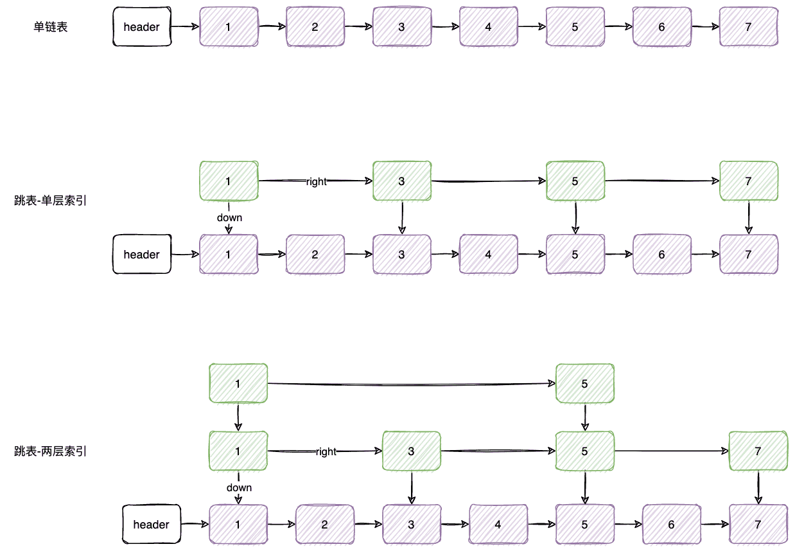
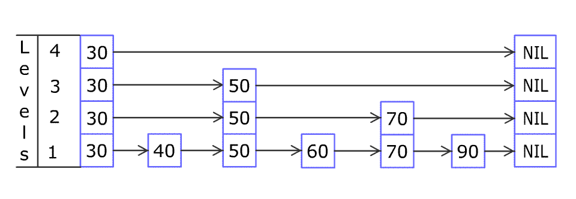
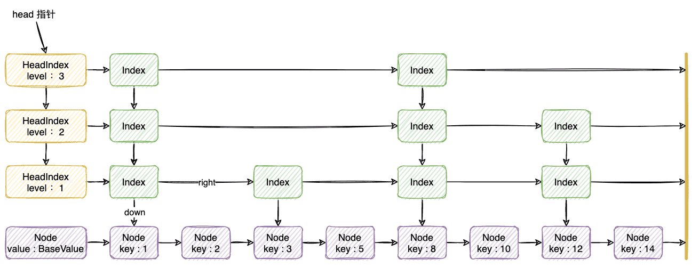
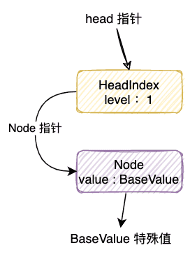
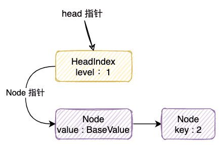
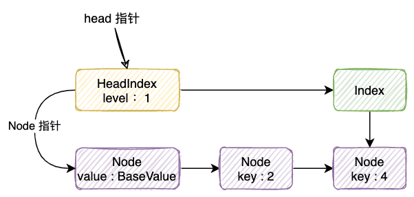
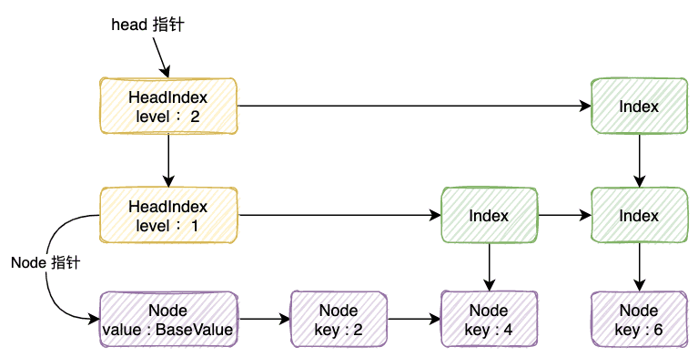
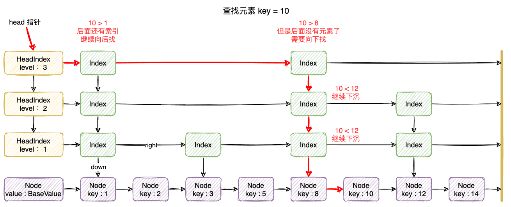
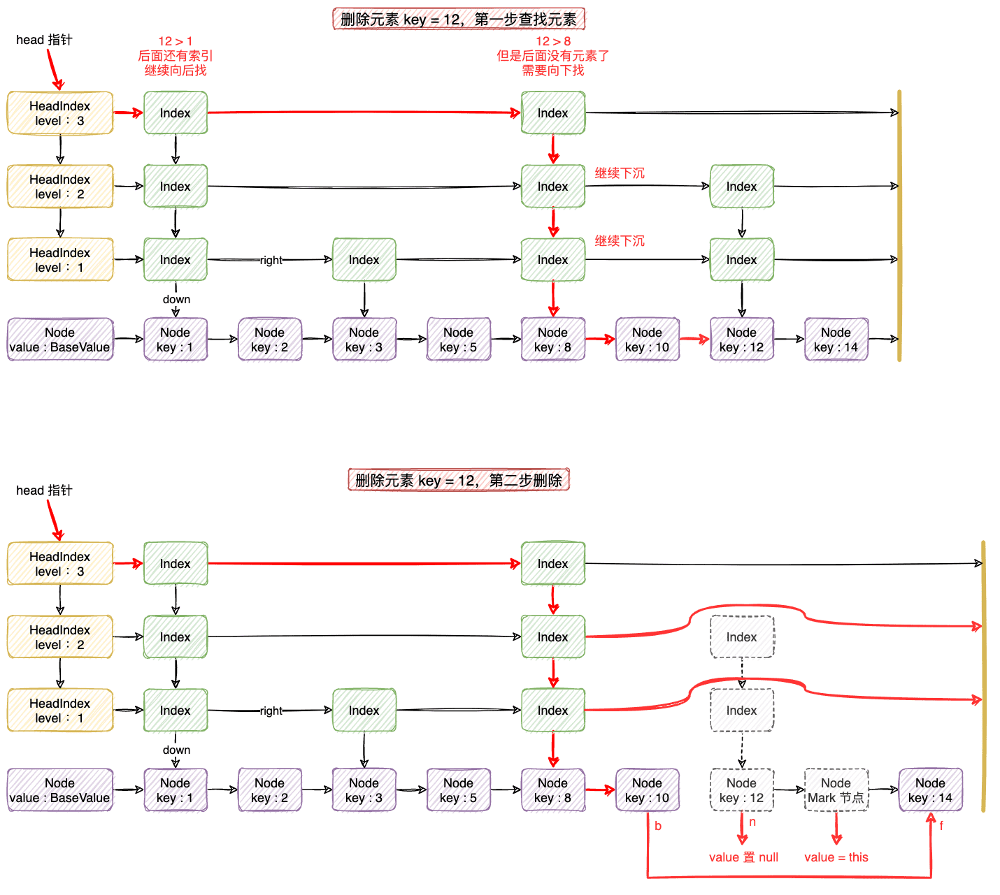

| 版本 | 内容 | 时间                   |
| ---- | ---- | ---------------------- |
| V1   | 新建 | 2022年11月12日11:25:30 |


## 跳表概述

### 什么是跳表




先从单链表说起，单链表就是维护了一个指向后继节点的指针，可以通过前一个节点找到后面的节点。查找元素的效率很低，平均时间复杂度 O(n)。

为了提高查找的效率，可以给元素加一层索引（如上图的第二部分）。

为了更进一步提高查找效率，可以继续给元素添加一层索引（如上图的第三部分）。

当然不能无限制的添加层数，一般我们在实现的时候是会增加限制的。这是一种空间换时间的做法，具体的实现我们其实可以看成二分查找。

### 跳表操作的复杂度

| Algorithm | **Average** | **Worst case** |
| :-------- | ----------- | -------------- |
| Space     | O(n)        | O(nlogn)       |
| Search    | O(logn)     | O(n)           |
| Insert    | O(logn)     | O(n)           |
| Delete    | O(logn)     | O(n)           |

插入元素到跳表的示意图，（来自维基百科）



## ConcurrentSkipListMap 的概述

### 节点对象

ConcurrentSkipListMap 中有三种节点

1. HeadIndex：高层的索引节点的头节点对象；
2. Index：高层的索引节点对象；
3. Node：最底层真正存储数据的节点对象；


ConcurrentSkipListMap 的内部结构如下




Node 节点

```java
static final class Node<K,V> {
    final K key;                // key
    volatile Object value;      // value
    volatile Node<K,V> next;    // 链表中的下一个节点
 
    // ... 省略
}
```

底层节点就是一个单向链表，索引会有一个指向后继节点的 next 指针。


Index 索引节点

```java
static class Index<K,V> {
    final Node<K,V> node;       // node 指向最底层链表的 Node 结点
    final Index<K,V> down;      // down 指向下层 Index 结点
    volatile Index<K,V> right;  // right 指向右边的 Index 结点

	// ... 省略
}
```

Index 索引节点主要存放的就是几个指针：

1. **node**：指向最底层单链表的数据节点 Node；
2. **down**：指向 Index 节点的下一层的节点的指针；
3. **right**：指向 Index 节点的右边索引节点的指针；


HeadIndex 头部索引节点

```java
static final class HeadIndex<K,V> extends Index<K,V> {
    // 链表的层级
    final int level;
    HeadIndex(Node<K,V> node, Index<K,V> down, Index<K,V> right, int level) {
        super(node, down, right);
        this.level = level;
    }
}
```

HeadIndex 就比 Index 多一个 **level 属性，表示索引的层数**。

### 构造方法

```java
public ConcurrentSkipListMap() {
    this.comparator = null;
    initialize();
}

public ConcurrentSkipListMap(Comparator<? super K> comparator) {
    this.comparator = comparator;
    initialize();
}

public ConcurrentSkipListMap(Map<? extends K, ? extends V> m) {
    this.comparator = null;
    initialize();
    putAll(m);
}

public ConcurrentSkipListMap(SortedMap<K, ? extends V> m) {
    this.comparator = m.comparator();
    initialize();
    buildFromSorted(m);
}
```

构造方法可以指定比较器 Comparator，假如不指定的话就是默认的自然排序。


所有构造器都调用了 initialize 方法

```java
/**
 * Initializes or resets state. Needed by constructors, clone,
 * clear, readObject. and ConcurrentSkipListSet.clone.
 * (Note that comparator must be separately initialized.)
 * 初始化或者重置状态
 */
private void initialize() {
    keySet = null;
    entrySet = null;
    values = null;
    descendingMap = null;
    head = new HeadIndex<K,V>(new Node<K,V>(null, BASE_HEADER, null),
                              null, null, 1);
}
```

这个方法主要就是将一些属性置空，然后创建一个 HeadIndex 对象。

初始化的这个 HeadIndex 的特点是：

- Node 的值是 BASE_HEADER；
- 层数 level 是 1；
- down 和 right 的指针都是 null；

关于 head 和 BASE_HEADER 属性：

```java
/**
 * Special value used to identify base-level header
 */
// 特殊值，最底层链表的头指针 BASE_HEADER
private static final Object BASE_HEADER = new Object();

/**
 * The topmost head index of the skiplist.
 */
// 最上层链表的头指针 head
private transient volatile HeadIndex<K,V> head;
```

## ConcurrentSkipListMap 核心操作

### 添加元素 put 的流程

（1）跳表的初始状态



（2）添加第一个元素 key 是 2，假如此时投硬币算法后不需要建立索引节点，那么此时的状态如下



（3）添加第二个元素 key 是 4，假如此时投硬币算法后需要建立 1 层索引节点，那么此时的状态如下



（4）添加第三个元素，key 是 6，假如此时投硬币算法后需要建立 2 层索引节点，因为多了一层，所以需要创建一个新的 HeadIndex。那么此时的状态如下




### 添加元素 put

```java
public V put(K key, V value) {
    if (value == null)
        throw new NullPointerException();
    return doPut(key, value, false);
}
```


doPut 方法比较长，需要分段慢慢看。


第一个部分就是创建一个 Node 节点放到底层 Node 链表的合适位置。

```java
private V doPut(K key, V value, boolean onlyIfAbsent) {
    Node<K,V> z;             // added node
    if (key == null)
        throw new NullPointerException();
    // 比较器
    Comparator<? super K> cmp = comparator;

    /*
     * 第一个循环，作用就是找到底层链表的插入点，然后插入结点（在查找过程中可能会删除一些已标记的删除结点）。
     */
    outer: for (;;) {
        // b 是通过索引 Index 找到小于并且最接近的 key 的 Node 节点（也有可能返回底层链表的头节点）
        // b -> n
        for (Node<K,V> b = findPredecessor(key, cmp), n = b.next;;) {
            if (n != null) {
                Object v; int c;
                Node<K,V> f = n.next;
                // 此时 b -> n -> f
                if (n != b.next)               // inconsistent read
                    // 说明并发有被修改过，重新开始自旋
                    break;
                if ((v = n.value) == null) {   // n is deleted
                    // 说明 n 是标记删除的节点，被别的线程删除了，需要删除
                    n.helpDelete(b, f);
                    // 重新开始自旋
                    break;
                }
                if (b.value == null || v == n) // b is deleted
                    // 说明 b 是标记删除节点，重新开始自旋
                    break;
                // 比较待加入的 key 和 n.key 的大小，向后遍历,找到第一个大于key的结点
                if ((c = cpr(cmp, key, n.key)) > 0) {
                    // c > 0 说明 key 要比 n.key 大，需要往后继续找位置
                    b = n;
                    n = f;
                    continue;
                }
                // 两个相等，根据 onlyIfAbsent 决定是否替换值
                if (c == 0) {
                    if (onlyIfAbsent || n.casValue(v, value)) {
                        @SuppressWarnings("unchecked") V vv = (V)v;
                        return vv;
                    }
                    // CAS 失败重新开始自旋重试
                    break; // restart if lost race to replace value
                }
                // else c < 0; fall through
            }

            // 走到这里说明找到要插入的位置了，创建一个新的节点 z
            z = new Node<K,V>(key, value, n);
            // 尝试将 next 节点从 n 改为 z， b -> z -> n
            if (!b.casNext(n, z))
                // CAS 失败重新开始自旋重试
                break;         // restart if lost race to append to b
            break outer;
        }
    }
    
    // ..... 省略
}
```

下面分析下这个方法，先忽略 ConcurrentSkipListMap#findPredecessor 方法的具体实现，这里我们只需要知道这个方法是按照索引节点找到最接近给定 key 的 Node 节点。

这部分就是创建一个 Node 节点放到底层 Node 链表的合适位置，

- 首先通过 ConcurrentSkipListMap#findPredecessor 方法找到最接近给的 key 的 Index 节点对应的 Node 节点；
- 找到 Node 节点后，按照单链表的查找方式依次向后遍历查找合适的位置；
- 找到合适的位置后创建新的 Node 节点插入到底层单链表中；

需要注意的是，在整个遍历过程中，会遇到并发的问题，例如有其他线程修改了跳表的结构，这时需要自旋重试。


第一部分有个重要的 findPredecessor 方法，下面来分析下这个方法

```java
private Node<K,V> findPredecessor(Object key, Comparator<? super K> cmp) {
    if (key == null)
        throw new NullPointerException(); // don't postpone errors
    // 开启自旋，从最上层开始，往右下方向查找
    for (;;) {
        /*
         * q: 遍历的指针，当前节点
         * r: 是 q 的 right 节点
         * d: down 就是下一层节点
         *
         *  q -> r
         * \|/
         *  d
         * 从左至右，从上往下查找
         */
        for (Index<K,V> q = head, r = q.right, d;;) {
            if (r != null) { // 从左至右查找
                Node<K,V> n = r.node;
                K k = n.key;
                if (n.value == null) {
                    // 说明被删除了，需要 unlink 节点
                    if (!q.unlink(r))
                        break;           // restart
                    // 重新向后读取 r，因为已经删除的需要跳过
                    r = q.right;         // reread r
                    continue;
                }
                // 比较 key 和 k 的大小，
                if (cpr(cmp, key, k) > 0) {
                    // >0 说明 key 大于 k，需要更新 q 和 r 的值，继续向右找位置
                    q = r;
                    r = r.right;
                    continue;
                }
            }
            // 前置条件：r == null，或者 key 比 k 小，说明找到位置了
            if ((d = q.down) == null)
                // q.down 是 null，说明已经到底层节点了，找到这个节点了
                return q.node;
            // 走到这里，说明还未到达底层节点，向下找，需要从 d 这一层开始寻找
            q = d;
            r = d.right;
        }
    }
}
```

这个方法很简单，就是从 head 节点开始从左至右，从上往下查找接近 key 的位置的节点。


put 方法的第一步只是将新建的节点插入到底层 Node 链表。接下来分析 put 方法的第二步，需要判断这个新加的 Node 节点是否需要创建 Index 索引节点，需要创建几层。

先判断 Node 是否需要建立 Index 索引，假如需要建立索引则需要判断建立几层索引，这时也分为两步：

1. 第一步建立需要的层数的索引的节点；
2. 第二步处理好新建立的这些索引的节点的指针的指向，也就是将新建的 Index 的插入到它对应的链表中；

具体分析：

（1）第一步就是通过一个算法判断需要构建几层索引，就是一个抛硬币的算法，最大抛 32 次，也就是最大的层数限制在 32 层。

```java
int level = 1, max; // level 表示新的层级,通过下面这个 while 循环可以确认新的层级数
// 与上 1，就是判断奇偶性，只要是偶数就是 0，就退出，最大 level 是 32
while (((rnd >>>= 1) & 1) != 0)
    ++level;
```

（2）这里需要分为两种情况，假如当前跳表的最大层数是 max 层，那么新建的节点就有可能大于 max 和小于等于 max 的情况。假如当前随机的层数是 L。

第一种情况：假如小于等于 max 的情况，就先创建 L 个 Index 节点，使用头插法将这几个几点链接起来，这里链接的是 down 指针；

```java
if (level <= (max = h.level)) {
    // 以“头插法”创建 level 个 Index 结点, idx 最终指向最高层的 Index 结点
    // 竖起来
    for (int i = 1; i <= level; ++i)
        idx = new Index<K,V>(z, idx, null);
}
```

第二种情况：假如当前随机的层数 L 大于 max 时，将 L 置为 max+1，就先创建 L 个 Index 节点，使用头插法将这几个几点链接起来，这里链接的是 down 指针；

```java
level = max + 1; // hold in array and later pick the one to use
// 生成一个Index结点数组,idxs[0]不会使用
@SuppressWarnings("unchecked")
Index<K,V>[] idxs = (Index<K,V>[])new Index<?,?>[level+1];
for (int i = 1; i <= level; ++i)
    // z 是待新加的节点，头插法，竖起来
    idxs[i] = idx = new Index<K,V>(z, idx, null);
```

创建好 Index 节点后，因为新建了一层，所以需要创建新的一层的 HeadIndex 节点。

```java
// 生成新的HeadIndex结点
for (;;) {
    h = head;
    // 原来的最大层级
    int oldLevel = h.level;
    if (level <= oldLevel) // lost race to add level
        // 另外的线程进行了index 层增加操作, 所以 不需要增加 HeadIndex 层数
        break;
    HeadIndex<K,V> newh = h;
    // 原来的 base 节点,这里的 oldbase 就是BASE_HEADER
    Node<K,V> oldbase = h.node;
    // 这里其实就是增加一层（一般来说）的 HeadIndex (level = max + 1)
    for (int j = oldLevel+1; j <= level; ++j)
        newh = new HeadIndex<K,V>(oldbase, newh, idxs[j], j);
    // 设置新的 head
    if (casHead(h, newh)) {
        // 这里的 h 变成了 new HeadIndex
        h = newh;
        // 这里的 idx 上从上往下第二层的 index 节点 level 也变成的 第二
        idx = idxs[level = oldLevel];
        break;
    }
}
```

（3）依次处理各个层的新建的 Index 节点的指针的指向，就是将新建的 Index 插入到各层的链表中。

```java
splice: for (int insertionLevel = level;;) {
    // j 最大的层数
    int j = h.level;
    // q -> r   t 是新建的 index 节点
    for (Index<K,V> q = h, r = q.right, t = idx;;) {
        if (q == null || t == null)
            // 节点都被删除 直接 break
            break splice;
        if (r != null) {
            // 获取底层 node
            Node<K,V> n = r.node;
            // compare before deletion check avoids needing recheck
            // 比较待插入的key 和 node 的 key 的大小
            int c = cpr(cmp, key, n.key);
            // 处理 node 被删除的情况
            if (n.value == null) {
                if (!q.unlink(r))
                    break;
                // 右移继续查找
                r = q.right;
                continue;
            }
            // c>0 说明 key 大于 n.key，需要继续右移遍历查找
            if (c > 0) {
                q = r;
                r = r.right;
                continue;
            }
        }

        if (j == insertionLevel) {
            // 将 q 的 right 后继节点由 r 改为 t
            // q -> t -> r
            if (!q.link(r, t))
                break; // restart
            if (t.node.value == null) {
                findNode(key);
                break splice;
            }
            // index 层添加成功， --1 为下层插入 index 做准备
            if (--insertionLevel == 0)
                break splice;
        }

        if (--j >= insertionLevel && j < level)
            // 将 t 改为下一层的 index 节点
            t = t.down;
        q = q.down;
        r = q.right;
    }
}
```

### 查找元素 get

```java
public V get(Object key) {
    return doGet(key);
}
```


```java
// 获取元素
private V doGet(Object key) {
    if (key == null)
        throw new NullPointerException();
    Comparator<? super K> cmp = comparator;
    // 开启自旋
    outer: for (;;) {
        // 找到底层的 node b
        for (Node<K,V> b = findPredecessor(key, cmp), n = b.next;;) {
            // b -> n -> f
            Object v; int c;
            if (n == null)
                break outer;
            Node<K,V> f = n.next;
            if (n != b.next)                // inconsistent read
                // 被修改了，重新尝试找
                break;
            if ((v = n.value) == null) {    // n is deleted
                // 删除
                n.helpDelete(b, f);
                break;
            }
            if (b.value == null || v == n)  // b is deleted
                break;
            if ((c = cpr(cmp, key, n.key)) == 0) {
                // 找到了
                @SuppressWarnings("unchecked") V vv = (V)v;
                return vv;
            }
            if (c < 0)
                // c < 0 说明 key 要比 n.key 小，没找到
                break outer;
            b = n;
            n = f;
        }
    }
    return null;
}
```

查找方法非常简单，其实大部分和 put 部分的代码类似，就是从左至右，从上向下找元素。


举个例子：



### 删除元素 remove

```java
public V remove(Object key) {
    return doRemove(key, null);
}
```


```java
final V doRemove(Object key, Object value) {
    if (key == null)
        throw new NullPointerException();
    Comparator<? super K> cmp = comparator;
    outer: for (;;) {
        // 返回“小于且最接近给定key”的数据结点.
        for (Node<K,V> b = findPredecessor(key, cmp), n = b.next;;) {
            // b -> n -> f
            Object v; int c;
            if (n == null)
                // 节点 n 被删除 直接 return null 返回 , 因为理论上 b.key < key < n.key
                break outer;
            Node<K,V> f = n.next;
            if (n != b.next)                    // inconsistent read
                break;
            if ((v = n.value) == null) {        // n is deleted
                n.helpDelete(b, f);
                break;
            }
            if (b.value == null || v == n)      // b is deleted
                break;
            if ((c = cpr(cmp, key, n.key)) < 0)
                // c < 0 条件成立，说明 key 小于 n.key，没有这个 key，break
                break outer;
            if (c > 0) {
                // c>0，说明 key 大于 n.key，继续向右找
                b = n;
                n = f;
                continue;
            }
            // 走到这里说明 c == 0，找到位置了
            if (value != null && !value.equals(v))
                // 假如 value != null，后面的条件成立说明 value 不同，不删了
                break outer;
            // 设置 n 的 value 为 null
            if (!n.casValue(v, null))
                break;
            // 在 n 和 f 之间添加标记结点，并将 b 直接指向f
            // b -> n -> mark -> f
            // |                /|\
            // |-----------------|
            if (!n.appendMarker(f) || !b.casNext(n, f))
                findNode(key);                  // retry via findNode
            else {
                // 重新调用一遍findPredecessor方法，解除被删除结点上的Index结点之间的引用：
                findPredecessor(key, cmp);      // clean index
                if (head.right == null)
                    // 减少层级
                    tryReduceLevel();
            }
            @SuppressWarnings("unchecked") V vv = (V)v;
            return vv;
        }
    }
    return null;
}
```

删除操作主要分为三步：

1. 首先通过 ConcurrentSkipListMap#findPredecessor 方法找到最接近给的 key 的 Index 节点对应的 Node 节点；
2. 找到最近的 Index 节点对应的 Node 节点后，按照单链表的查找方式依次向后遍历，直到找到要删除的节点；
3. 将要删除的节点的 value 置为 null，并在后面增加一个 mark 节点，再调用一次 findPredecessor 去删除 Index 节点，假如最上面一层的 Index 节点都删除了，则需要减少层级；

