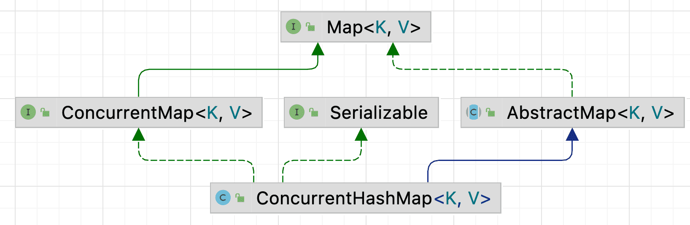
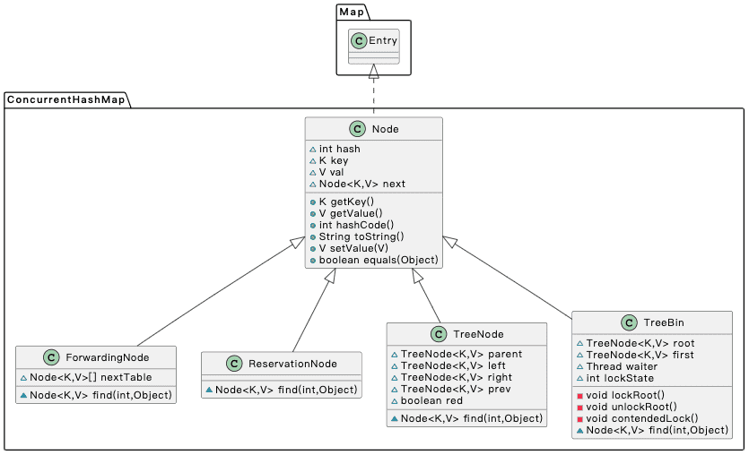
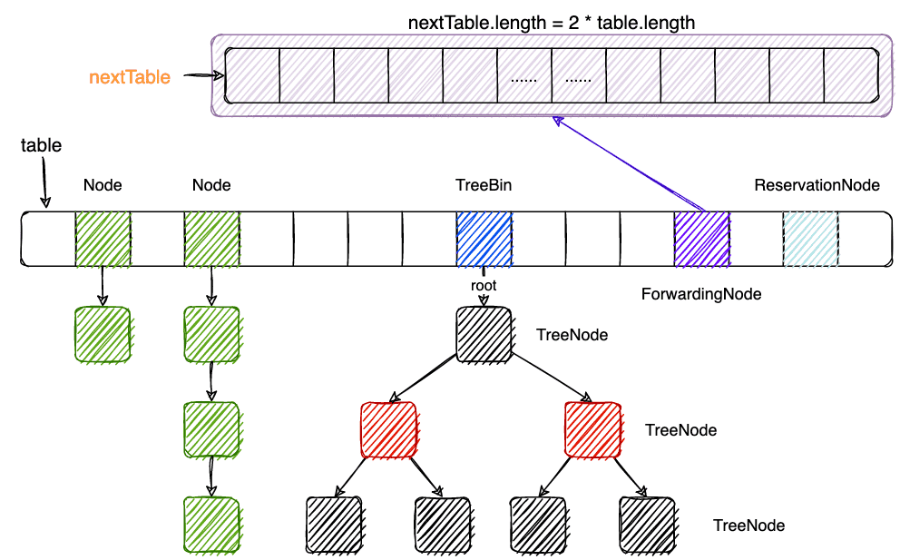
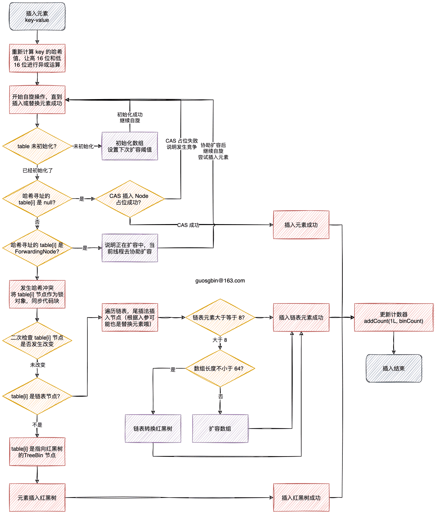
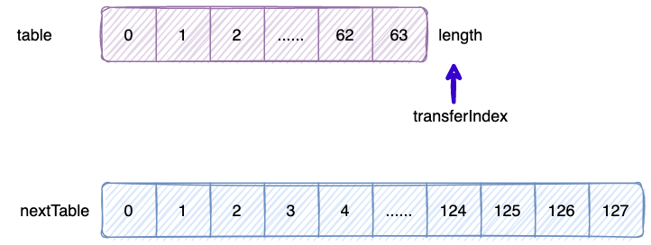
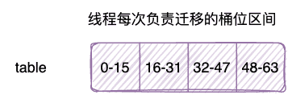
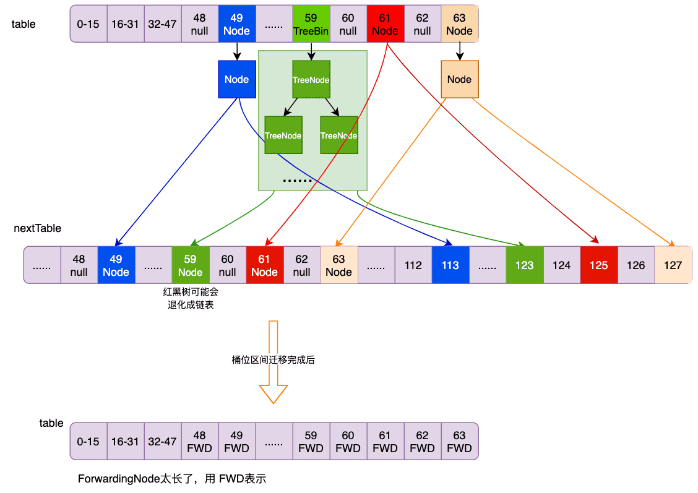

| 版本 | 内容 | 时间                   |
| ---- | ---- | ---------------------- |
| V1   | 新建 | 2022年12月02日00:23:46 |

## 概述

我们知道 HashMap 不是线程安全的，在 JDK1.5 之前JDK 提供的同步的 Map 有 Hashtable 和使用 Collections. synchronizedMap 返回一个同步代理类 SynchronizedMap，这两种方式都是在 Map 的每个方法添加一个 Synchronized 关键字实现同步的。

JDK1.5 的时候出现了 ConcurrentHashMap，由于每个版本的 JDK 的 ConcurrentHashMap 的实现方式不同，本次分析的是 JDK8。

JDK1.6 的时候出现了 ConcurrentSkipListSet，跳表结构，前面已经分析了。

## 继承关系

首先看下 ConcurrentHashMap 的类的继承关系：




在 ConcurrentHashMap 中有很多内部类，先看下它们的类关系，再看下他们代表什么含义。

## ConcurrentHashMap 的内部结构

### 各个节点的继承关系



ConcurrentHashMap 和 HashMap 一样都有一个数组 table，ConcurrentHashMap 这个 table 上有四种类型的节点，分别是 Node、ForwardingNode、TreeBin、TreeNode、ReservationNode。

### 节点的作用




下面分别说下它们都有什么用处：

- **Node**：Node 节点存放在数组的一个桶位中，当发生哈希冲突的时候会以 Node 链表的形式存储。(当满足一定条件的时候会变成红黑树)；
- **ForwardingNode**：临时节点，哈希值固定为 -1，只会在扩容的时候出现。当哈希表中的元素个数超过阈值后会进行扩容，扩容会将旧数组高位索引处开始迁移每个桶位的节点到新数组 nextTable 中，某个桶位迁移完成后，就会给旧数组的该桶位放一个 ForwardingNode 节点。其他线程在扩容期间访问数据的时候，假如发现桶位是 ForwardingNode 节点，就需要去新数组里去查询了；
- **TreeBin**：哈希值固定为 -2。TreeBin 指向红黑树的根节点。当某个桶位满足了转变红黑树的条件，会在桶位处放置一个 TreeBin 节点，桶位之前的链表数据会转变成一个 TreeNode 节点的红黑树，挂在 TreeBin 节点下；
- **TreeNode**：红黑树节点；
- **ReservationNode**：保留节点，哈希值固定为 -3。在ConcurrentHashMap中就相当于一个占位符，不存储实际的数据，正常情况不会出现。在 computeIfAbsent  和 compute 这两个函数在加锁时会使用 ReservationNode 作占位符；

### 节点的定义

**单链表链表 Node 节点**

```java
static class Node<K,V> implements Map.Entry<K,V> {
    final int hash;             // 哈希值
    final K key;                // key
    volatile V val;             // value
    volatile Node<K,V> next;    // next 指针
    
    // 省略...
}
```


**TreeBin 节点**

- root：指向红黑树的根节点；
- first：链表结构的根节点，红黑树中也维护了链表结构；
- waiter：最近的一个设置 WAITER 标志位的线程，当前 lockstate 是读锁状态；
- lockState：整体的锁状态标志位，写是独占状态（同一个 TreeBin 对象），读是共享的；

TreeBin 节点用一个 int 数表示读写锁的状态

| 常量   | 值   | 说明                                                         |
| ------ | ---- | ------------------------------------------------------------ |
| WRITER | 1    | 二进制 001，红黑树的写锁状态                                 |
| WAITER | 2    | 二进制 010，红黑树的等待获取写锁状态                         |
| READER | 4    | 二进制 100，红黑树的读锁状态，读可以并发，每多一个读线程，lockState 都就上一个 READER 值 |

```java
static final class TreeBin<K,V> extends Node<K,V> {
    TreeNode<K,V> root;                
    volatile TreeNode<K,V> first;
    volatile Thread waiter;             
    volatile int lockState;    
    // values for lockState
    static final int WRITER = 1;// set while holding write lock             
    static final int WAITER = 2;// set when waiting for write lock          
    static final int READER = 4;// increment value for setting read lock
    
    
	// 省略...
}
```


**Q：为什么要用一个 TreeBin 节点指向红黑树的根节点呢？**

因为 ConcurrentHashMap 中处理某个的桶位的一些节点的时候是需要给在数组桶位上的节点加同步锁的，而红黑树的插入、删除这些操作时，平衡过程中的左旋右旋操作可能旧的根节点不再是根节点，这样同步就比较麻烦了。但是新加一个 TreeBin 节点，就可以在这个节点上做同步操作了。


**红黑树的 TreeNode 节点**

```java
static final class TreeNode<K,V> extends Node<K,V> {
    TreeNode<K,V> parent;  // red-black tree links
    TreeNode<K,V> left;    // 左子节点
    TreeNode<K,V> right;   // 右子节点
    /*
     * prev指针是为了方便删除.
     * 删除链表的非头结点时，需要知道它的前驱结点才能删除，所以直接提供一个prev指针
     */
    TreeNode<K,V> prev;    // needed to unlink next upon deletion
    boolean red;

	// 省略...
}
```


**扩容临时节点 ForwardingNode**

可以看到有个 nextTable 属性，这个属性就是指向扩容后的新的数组。

```java
static final class ForwardingNode<K,V> extends Node<K,V> {
    final Node<K,V>[] nextTable;

    // 省略...
}
```


**占位节点 ReservationNode**，没什么新的属性，和 Node 的一样。

## ConcurrentHashMap 构造方法

ConcurrentHashMap 的数组一定是 2 的 n 次幂。

**一个原因是可以使用位运算高效的计算索引值，让 key 均匀分布，减少哈希冲突；**

**另一个原因就是扩容迁移的便捷及高效，可以实现多线程并发协作完成数据迁移。**


**（1）空构造**

数组的默认初始容量是 16。

```java
public ConcurrentHashMap() {
}
```


**（2）设置初始容量的构造函数**

根据入参计算出数组的初始容量，`initialCapacity + (initialCapacity >>> 1) + 1)`的最小 2 的次幂值。

> sizeCtl 在不同的情况下存的值的含义不同，这个情况表示的是创建数组时的初始容量。

```java
public ConcurrentHashMap(int initialCapacity) {
        if (initialCapacity < 0)
            throw new IllegalArgumentException();
        int cap = ((initialCapacity >= (MAXIMUM_CAPACITY >>> 1)) ?
                   MAXIMUM_CAPACITY :
                   tableSizeFor(initialCapacity + (initialCapacity >>> 1) + 1));
        // 这个时候存的是数组的初始长度
        this.sizeCtl = cap;
    }
```


**（3）通过已有的 Map 构造**

```java
public ConcurrentHashMap(Map<? extends K, ? extends V> m) {
    this.sizeCtl = DEFAULT_CAPACITY;
    putAll(m);
}
```


**（4）初始容量和加载因子**

```java
public ConcurrentHashMap(int initialCapacity, float loadFactor) {
    this(initialCapacity, loadFactor, 1);
}
```


**（5）初始容量，加载因子和并发级别**

> loadFactor 并不是真正的加载因子，仅仅在构造函数中计算了下初始容量，失去了原来的意义，JDK8 的 ConcurrentHashMap 的加载因子固定 0.75。
>
> concurrencyLevel 只是为了兼容 JDK8 之前的版本，在 JDK8 中也不代表并发级别了，这里只是做了点校验，没有实际的作用。

```java
public ConcurrentHashMap(int initialCapacity,
                         float loadFactor, int concurrencyLevel) {
    if (!(loadFactor > 0.0f) || initialCapacity < 0 || concurrencyLevel <= 0)
        throw new IllegalArgumentException();
    if (initialCapacity < concurrencyLevel)   // Use at least as many bins
        initialCapacity = concurrencyLevel;   // as estimated threads
    long size = (long)(1.0 + (long)initialCapacity / loadFactor);
    int cap = (size >= (long)MAXIMUM_CAPACITY) ?
        MAXIMUM_CAPACITY : tableSizeFor((int)size);
    this.sizeCtl = cap;
}
```

## ConcurrentHashMap 属性

首先是两个数组相关的属性：

```java
// 哈希表的底层桶的数组，在第一次新增元素的时候初始化
transient volatile Node<K,V>[] table;

// 扩容后的新 Node 数组，只有在扩容时才非空。
private transient volatile Node<K,V>[] nextTable;
```


关于计数相关的属性，就是 LongAdder 类里的属性，只是把 LongAdder 的实现方式搬到 ConcurrentHashMap 里面来了。

关于这几个属性不理解的，可以去看 LongAdder 的实现方式。

```java
// 类似 LongAdder 的 base
private transient volatile long baseCount;

// 类似 LongAdder 的 cellsBusy，锁，在扩容和创建 cell 时使用，1-有锁状态， 0-无锁状态
private transient volatile int cellsBusy;

//  类似 LongAdder 的 Cell[] 数组
private transient volatile CounterCell[] counterCells;
```


线程扩容用到的转移桶位的索引。

```java
// 扩容时需要用到的一个下标变量
// table[transferIndex-stride, transferIndex-1]就是当前线程要进行数据迁移的桶区间：
private transient volatile int transferIndex;
```


sizeCtl 变量，这个属性的值在不同的场景下的取值表示的含义不同。

- **sizeCtl 等于 0**： 表示在初始化数组的时候，使用默认的初始容量；
- **sizeCtl 大于 0**：两种情况
  1. 数组初始化时使用的容量；
  2. 初始化或者扩容完成后，下次扩容的阈值，其实就是 0.75n（n 是数组长度）；
- **sizeCtl 等于 -1**：表示数组正在被某个线程初始化；
- **sizeCtl 低位等于  -(1 + nThreads)**：记录正在执行扩容任务的线程数；高 16 位保存着扩容戳，低 16 位保存着并发扩容的线程总数；

```java
/**
 * Table initialization and resizing control.  When negative, the
 * table is being initialized or resized: -1 for initialization,
 * else -(1 + the number of active resizing threads).  Otherwise,
 * when table is null, holds the initial table size to use upon
 * creation, or 0 for default. After initialization, holds the
 * next element count value upon which to resize the table.
 */
private transient volatile int sizeCtl;

```

## ConcurrentHashMap 的 put 操作

ConcurrentHashMap 的 key 和 value 都不能为 null，否则会报错。

```java
public V put(K key, V value) {
    return putVal(key, value, false);
}
```

put 操作的流程有点长，接下来会分几个步骤去分析。

先看下 ConcurrentHashMap#spread 方法，`(h ^ (h >>> 16))`操作是将 h 的高 16 位和低 16 位做异或操作，这样得到的数就具有高位和低位的特性了，最后与上 `0x7fffffff`是为了将最高位强制设为 0（正数）。

```java
static final int HASH_BITS = 0x7fffffff; // usable bits of normal node hash

static final int spread(int h) {
    return (h ^ (h >>> 16)) & HASH_BITS;
}
```


看下 put 的完整代码

```java
final V putVal(K key, V value, boolean onlyIfAbsent) {
    if (key == null || value == null) throw new NullPointerException();
    // 再次计算 key 的哈希值
    int hash = spread(key.hashCode());
    /*
     * 使用链表保存时，binCount 记录 table[i] 这个桶中所保存的结点数；
     * 使用红黑树保存时，binCount == 2，保证 put 后更改计数值时能够进行扩容检查，同时不触发红黑树化操作
     */
    int binCount = 0;
    // 开启自旋，插入结点，直到成功
    for (Node<K,V>[] tab = table;;) {
        /*
             * f:   根据哈希路由寻址得到的数组的索引的元素，可能是 null
             * n:   底层数组的长度
             * i:   根据哈希路由寻址得到的数组的索引
             * fh:  f 的哈希值
             */
        Node<K,V> f; int n, i, fh;
        // CASE 1：底层数组未初始化，需要初始化数组
        if (tab == null || (n = tab.length) == 0)
            tab = initTable();
        // CASE 2：前提是底层数组已经初始化了，下面这个条件成立，
        // 说明哈希寻址的位置还未被占用，其实就是未发生哈希冲突
        else if ((f = tabAt(tab, i = (n - 1) & hash)) == null) {
            // CAS 尝试将 i 位置的元素由 null 改为新建的节点 Node
            if (casTabAt(tab, i, null, new Node<K,V>(hash, key, value, null)))
                // 修改成功，则直接退出自旋
                break;                   // no lock when adding to empty bin
        }
        // CASE 3：前置条件是数组已经初始化了，且哈希寻址的位置被占用了，也就是哈希冲突了
        // 发现 ForwardingNode 结点，哈希是 MOVED 的时候，说明此时数组正在扩容，当前线程需要去帮助扩容
        else if ((fh = f.hash) == MOVED)
            tab = helpTransfer(tab, f);
        // CASE 4：前置条件是数组已经初始化了，也就是哈希冲突，且当前数组未正在扩容
        // 这是需要新建节点挂载链表，或者红黑树上
        else {
            V oldVal = null;
            // 给 table[i] 桶节点加锁
            synchronized (f) {
                // 二次检查，防止其它线程的写修改
                if (tabAt(tab, i) == f) {
                    // 判断 table[i] 是链表结点
                    if (fh >= 0) {
                        // 这个桶位的元素个数，初始值是 1，
                        binCount = 1;
                        // 处理链表
                        for (Node<K,V> e = f;; ++binCount) {
                            K ek;
                            // 找到“相等”的结点，根据 onlyIfAbsent 参数决定是否需要替换 value，并退出循环
                            if (e.hash == hash && ((ek = e.key) == key || (ek != null && key.equals(ek)))) {
                                oldVal = e.val;
                                if (!onlyIfAbsent)
                                    e.val = value;
                                break;
                            }

                            Node<K,V> pred = e;
                            // e 每次后移一个节点
                            // 直到到达了最后一个节点，就创建一个新节点将元素插到链表最后（尾插法）
                            if ((e = e.next) == null) {
                                pred.next = new Node<K,V>(hash, key, value, null);
                                break;
                            }
                        }
                    }
                    else if (f instanceof TreeBin) { // 说明 tablep[i] 位置的元素是红黑树节点 TreeBin
                        Node<K,V> p;
                        binCount = 2;
                        if ((p = ((TreeBin<K,V>)f).putTreeVal(hash, key, value)) != null) {
                            oldVal = p.val;
                            if (!onlyIfAbsent)
                                p.val = value;
                        }
                    }
                }
            }
            // binCount != 0 说明发送哈希冲突了
            if (binCount != 0) {
                // 当链表长度大于等于 8 的时候尝试树化
                if (binCount >= TREEIFY_THRESHOLD)
                    treeifyBin(tab, i);
                if (oldVal != null)
                    // 表明本次 put 操作只是替换了旧值，不用更改计数值
                    return oldVal;
                break;
            }
        }
    }

    addCount(1L, binCount);
    return null;
}
```


- 第一步就是开启一个自旋，直到插入元素或者替换元素成功。
- 第二步就是调用 ConcurrentHashMap#addCount 方法，增加计数和判断是否需要扩容。（计数部分下节分析）

### 懒加载-初始化 table

```java
if (tab == null || (n = tab.length) == 0)
    tab = initTable();
```

添加元素时，假如数组还未初始化，需要调用 ConcurrentHashMap#initTable 方法去初始化数组。

```java
// 初始化底层数组，使用 sizeCtl 作为初始化容量
private final Node<K,V>[] initTable() {
    Node<K,V>[] tab; int sc;
    // 自旋直到数组初始化成功
    while ((tab = table) == null || tab.length == 0) {
        // sizeCtl 小于 0，说明此时数组正在被其他线程初始化或者扩容，在这个场景下就是初始化了，需要当前线程需要让步
        if ((sc = sizeCtl) < 0)
            Thread.yield(); // lost initialization race; just spin
        else if (U.compareAndSwapInt(this, SIZECTL, sc, -1)) {
            // 进入这里，说明 CAS 将 SIZECTL 改为 -1 了，让当前线程去做初始化数组的操作
            try {
                // 二次检查
                if ((tab = table) == null || tab.length == 0) {
                    // n 初始容量，2 的 n 次幂
                    int n = (sc > 0) ? sc : DEFAULT_CAPACITY;
                    @SuppressWarnings("unchecked")
                    Node<K,V>[] nt = (Node<K,V>[])new Node<?,?>[n];
                    table = tab = nt;
                    // 得到的 sc 就是 0.75n, loadFactor 已在 JDK8 废弃，固定就是 0.75
                    sc = n - (n >>> 2);
                }
            } finally {
                // 设置下次扩容阈值 0.75 * table.length
                // 也有可能是上面的二次检查不通过，这里需要将 sizeCtl 从 -1 改为之前的值
                sizeCtl = sc;
            }
            break;
        }
    }
    return tab;
}
```

初始化的流程很简单，

1. 就是尝试 CAS 将 sizeCtl 改为 -1，表示线程正在初始化数组，修改成功后进行二次检查；
2. 然后根据 sizeCtl 的值来决定数组的初始长度。sizeCtl 大于 0 则创建 sizeCtl 大小的数组，否则使用默认的 16 作为数组长度；
3. 最后计算 Map 的下次扩容阈值，`n - (n >>> 2)`，就是 0.75n；


### 哈希寻址到的桶位为空

```java
else if ((f = tabAt(tab, i = (n - 1) & hash)) == null) {
    // CAS 尝试将 i 位置的元素由 null 改为新建的节点 Node
    if (casTabAt(tab, i, null, new Node<K,V>(hash, key, value, null)))
        // 修改成功，则直接退出自旋
        break;                   // no lock when adding to empty bin
}
```

因为 ConcurrentHashMap 的数组的长度已经限制为 2 的 n 次幂了，所以 `(n - 1) & hash)` 就是等于是取余运算了。

假如哈希寻址得到的桶位 table[i] 的位置是空的，那么尝试 CAS 去设置该位置的值，假如设置成功了，那就是 put 元素成功了，直接退出循环。假如设置失败了，那么就说明发生竞争了，重新开始自旋操作。

### 找到 ForwardingNode 节点

ForwardingNode 节点的哈希值默认就是 MOVED（-1），说明 ConcurrentHashMap 正在进行扩容操作，**当前线程需要尝试协助扩容。**

关于扩容操作后面分析，这里先不讲了。

```java
else if ((fh = f.hash) == MOVED)
    tab = helpTransfer(tab, f);
```

### 发送哈希冲突了且并未在扩容

```java
else {
    V oldVal = null;
    // 给 table[i] 桶节点加锁
    synchronized (f) {
        // 二次检查，防止其它线程的写修改
        if (tabAt(tab, i) == f) {
            // 判断 table[i] 是链表结点
            if (fh >= 0) {
                // 这个桶位的元素个数，初始值是 1，
                binCount = 1;
                // 处理链表
                for (Node<K,V> e = f;; ++binCount) {
                    K ek;
                    // 找到“相等”的结点，根据 onlyIfAbsent 参数决定是否需要替换 value，并退出循环
                    if (e.hash == hash && ((ek = e.key) == key || (ek != null && key.equals(ek)))) {
                        oldVal = e.val;
                        if (!onlyIfAbsent)
                            e.val = value;
                        break;
                    }

                    Node<K,V> pred = e;
                    // e 每次后移一个节点
                    // 直到到达了最后一个节点，就创建一个新节点将元素插到链表最后（尾插法）
                    if ((e = e.next) == null) {
                        pred.next = new Node<K,V>(hash, key, value, null);
                        break;
                    }
                }
            }
            else if (f instanceof TreeBin) { // 说明 tablep[i] 位置的元素是红黑树节点 TreeBin
                Node<K,V> p;
                binCount = 2;
                if ((p = ((TreeBin<K,V>)f).putTreeVal(hash, key, value)) != null) {
                    oldVal = p.val;
                    if (!onlyIfAbsent)
                        p.val = value;
                }
            }
        }
    }
    // binCount != 0 说明发送哈希冲突了
    if (binCount != 0) {
        // 当链表长度大于等于 8 的时候尝试树化
        if (binCount >= TREEIFY_THRESHOLD)
            treeifyBin(tab, i);
        if (oldVal != null)
            // 表明本次 put 操作只是替换了旧值，不用更改计数值
            return oldVal;
        break;
    }
}
```

处理哈希冲突的代码比较长，但是逻辑还是比较清楚的。主要分为两部分来处理，一种是链表一种是红黑树。

1. 首先将 table[i] 桶位节点当做锁对象给代码块加锁，加锁成功后还需要进行二次检查桶位节点是否有改变；
2. 处理插入操作，分为链表和红黑树不同的情况：
   1. 链表：使用 binCount 记录链表的元素个数，使用尾插法将新添加的元素插入到链表中；
   2. 红黑树：binCount 固定为 2，调用 TreeBin#putTreeVal 的方法将元素插入到红黑树中，然后平衡红黑树；
3. 最后，判断链表的长度是否大于等于 8，如果大于登录则尝试树化链表；

### ConcurrentHashMap 树化操作

**假如链表的长度大于等于 8，则尝试树化链表，但是这并不是树化链表的唯一条件。**

**还需要满足数组长度至少是 64 才会去树化链表，小于 64 则会去尝试将数组扩容一倍。**


**Q：为什么还要满足 64 才去触发树化链表呢？**

因为当数组的长度比较小的时候，很容易发生哈希冲突，出于性能考虑，为了减少哈希冲突和避免频繁的扩容迁移，除了需要满足链表的长度大于等于 8，还需满足数组的长度至少是 64，才会去进行树化操作。


treeifyBin 方法是尝试树化链表的操作。

```java
private final void treeifyBin(Node<K,V>[] tab, int index) {
    Node<K,V> b; int n, sc;
    if (tab != null) {
        if ((n = tab.length) < MIN_TREEIFY_CAPACITY)
            // 说明数组的长度小于 64，需要进行扩容数组一倍，而不是树化
            // 因为数组长度小的时候，容易发生哈希碰撞
            tryPresize(n << 1);
        // 进行链表树化的操作
        else if ((b = tabAt(tab, index)) != null && b.hash >= 0) {
            synchronized (b) {
                if (tabAt(tab, index) == b) {
                    TreeNode<K,V> hd = null, tl = null;
                    // 遍历链表，建立红黑树，TreeNode是一个双向链表
                    for (Node<K,V> e = b; e != null; e = e.next) {
                        TreeNode<K,V> p = new TreeNode<K,V>(e.hash, e.key, e.val, null, null);
                        if ((p.prev = tl) == null)
                            hd = p;
                        else
                            tl.next = p;
                        tl = p;
                    }
                    // 用 TreeBin 节点包装，并存到 table[index] 中
                    setTabAt(tab, index, new TreeBin<K,V>(hd));
                }
            }
        }
    }
}
```

### putVal 操作的整体流程图



## ConcurrentHashMap 的计数操作

前面分析 ConcurrentHashMap 的 put 的操作时，没有分析 ConcurrentHashMap#addCount 方法，现在来分析下 ConcurrentHashMap 计数功能。

前面说了 ConcurrentHashMap 的 计数功能就是将 LongAdder 的实现的代码照搬过来了。

这里大概说明下原理。

**LongAdder 使用分段锁的思想，在线程没有发生竞争的时候针对 base 字段进行累加。在线程发生竞争时，将这些线程按照哈希路由寻址的路由到 cell 数组的某个索引处，每个线程针对对应的 cell 数组的元素进行 CAS 操作，这样就将一个热点分散成了多个热点，发生竞争的概率就会小很多。**

LongAdder 的 sum 方法返回的并不是一个准确的值，这也是 LongAdder 不能替代 AtomicLong 的一个原因。

下面是 ConcurrentHashMap#sumCount 的代码。

```java
final long sumCount() {
    CounterCell[] as = counterCells; CounterCell a;
    long sum = baseCount;
    if (as != null) {
        for (int i = 0; i < as.length; ++i) {
            if ((a = as[i]) != null)
                sum += a.value;
        }
    }
    return sum;
}
```


那么来看下 ConcurrentHashMap#addCount 方法，主要分为两个部分：

1. 增加计数；（这里不再分析，不懂的可以去看我的 LongAdder 分析）
2. 判断是否需要扩容；（这里不分析，后面章节分析扩容的时候分析）

```java
private final void addCount(long x, int check) {
    CounterCell[] as; long b, s;
    if ((as = counterCells) != null
            || !U.compareAndSwapLong(this, BASECOUNT, b = baseCount, s = b + x)) { /
        CounterCell a; long v; int m;
        boolean uncontended = true;
        if (as == null
                || (m = as.length - 1) < 0
                || (a = as[ThreadLocalRandom.getProbe() & m]) == null
                || !(uncontended = U.compareAndSwapLong(a, CELLVALUE, v = a.value, v + x))) {
            // 增加 count 值
            fullAddCount(x, uncontended);

            // 这里直接 return 的原因，我猜是因为多运行了 fullAddCount 方法，多了些耗时，
            // 为了 put 的效率，就不检查扩容了
            return;
        }
        // check <= 1 不检查扩容，仅检查是否发生竞争
        if (check <= 1)
            return;
        // 获取 count 的个数，并不是实时性的
        s = sumCount();
    }

    // 检查是否扩容
    if (check >= 0) {
        Node<K,V>[] tab, nt; int n, sc;
        // while 条件成立，说明已经到了扩容阈值了(或者是已经有线程在扩容了，需要去帮忙)，需要去尝试扩容
        while (s >= (long)(sc = sizeCtl) && (tab = table) != null &&
               (n = tab.length) < MAXIMUM_CAPACITY) {
            // 计算一个戳，相同的数组长度 n 计算出来的戳是一样的
            int rs = resizeStamp(n);
            // CASE 1 : 表示正在扩容，此时 sizeCtl 的组成就是  -(1 + nThreads)
            if (sc < 0) {
                /*
                 * sc >>> RESIZE_STAMP_SHIFT) != rs 校验扩容的戳
                 * (nt = nextTable) == null         成立则说明 nextTable 还未创建，还扩个锤子
                 */
                if ((sc >>> RESIZE_STAMP_SHIFT) != rs
                        || sc == rs + 1
                        || sc == rs + MAX_RESIZERS
                        || (nt = nextTable) == null
                        || transferIndex <= 0)
                    break;
                if (U.compareAndSwapInt(this, SIZECTL, sc, sc + 1))
                    transfer(tab, nt);
            }
            /*
             * CASE 2 : 说明是首次进行扩容操作的线程，尝试 CAS 修改 sizeCtl
             * 因为 sizeCtl 扩容的时候 -(1 + nThreads) : 记录正在执行扩容任务的线程数
             * 最后 +2，就是 -(1 + 1)，表示有一个线程在扩容，
             * 高 16 位是戳，低 16 位记录正在执行扩容任务的线程数
             */
            else if (U.compareAndSwapInt(this, SIZECTL, sc, (rs << RESIZE_STAMP_SHIFT) + 2))
                transfer(tab, null);
            s = sumCount();
        }
    }
}
```


## ConcurrentHashMap 的扩容操作

### 扩容的基本原理

ConcurrentHashMap 的扩容操作分为两个步骤：

1. **创建一个新的 2 倍于原来的数组长度的新数组**（这个操作只能一个线程完成）；
2. **将旧数组的每个桶位的节点迁移到新数组对应桶位处**；


那么如何计算旧的节点在新数组的位置呢？索引位置的计算公式就是 `key.hash & (table.length - 1)`。

ConcurrentHashMap 在处理 rehash 的时候并不会重新计算 key 的哈希值，因为数组的长度必定是 2 的 n 次幂，根据这一特性，通过  `key.hash & (table.length - 1)`计算出来的索引 i，**当数组 table 扩容一倍后，在数组的位置要么是 i，要么是 i + n。**


举个例子看：

假如数组的长度是 16，假如 key1 的哈希是 1010 1010， key2 的哈希是 1011 1010。

旧数组长度 16 - 1 是 15，二进制就是 00001111。

在旧的数组中通过公式计算出来的索引是 

1. 00001111 & 1010 1010 = 0000 1010 = 10
2. 00001111 & 1011 1010 = 0000 1010 = 10

新数组长度是 32，32 -1 = 31，二进制就是 00011111。

在新的数组中通过公式计算出来的索引是 

1. 00011111 & 1010 1010 = 0000 1010 = 10
2. 00011111 & 1011 1010 = 0001 1010 = 26

从这个例子可以看出 key1 在扩容后的位置是 10 不变，key2 在扩容后的位置是 10 + 16 = 26。


扩容原理小结：

因为数组长度是 2 的 n 次幂值，假如目前 key 键在旧数组的索引位置为i，当数组扩容一倍后，key 键在新数组的索引的规律是：

1. 如果 key 的哈希值`hash & table.length==0`，说明哈希二进制的从右向左的第 n 个 bit 位为 0，迁移后 key 在新数组中索引值不变，仍为 i。
2. 如果key的哈希值`hash & table.length＞0`，说明哈希二进制的从右向左的第 n 个bit位为 1，迁移后 key 在新数组中索引值为 i + table.length。


另外如果两个不同的键值在旧数组中索引位置就已经不同了，那么这两个键值映射到新数组的位置肯定也是不同的。所以数组中每个桶节点的迁移不会相互影响，利用这个特性在数据迁移时，可以多线程并发迁移不同桶的元素。**所以在扩容的时候需要给每个线程在数组上划分一个区间，让某个线程负责给这个区间的桶位节点的迁移。**

### 触发扩容的时机

前面在分析 ConcurrentHashMap 的计数操作的时候，ConcurrentHashMap#addCount 方法最后会检查是否需要扩容。下面分析下 ConcurrentHashMap#addCount 中检查扩容的部分代码。

```java
private final void addCount(long x, int check) {
        // 省略计数逻辑的代码.....

        // 检查是否扩容
        if (check >= 0) {
            Node<K,V>[] tab, nt; int n, sc;
            // while 条件成立，说明已经到了扩容阈值了(或者是已经有线程在扩容了，需要去帮忙)，需要去尝试扩容
            while (s >= (long)(sc = sizeCtl) && (tab = table) != null &&
                   (n = tab.length) < MAXIMUM_CAPACITY) {
                // 计算一个戳，相同的数组长度 n 计算出来的戳是一样的
                int rs = resizeStamp(n);
                // CASE 1 : 表示正在扩容，此时 sizeCtl 的组成就是  -(1 + nThreads)
                if (sc < 0) {
                    /*
                     * sc >>> RESIZE_STAMP_SHIFT) != rs 校验扩容的戳
                     * (nt = nextTable) == null         成立则说明 nextTable 还未创建，还扩个锤子
                     */
                    if ((sc >>> RESIZE_STAMP_SHIFT) != rs
                            || sc == rs + 1
                            || sc == rs + MAX_RESIZERS
                            || (nt = nextTable) == null
                            || transferIndex <= 0)
                        break;
                    if (U.compareAndSwapInt(this, SIZECTL, sc, sc + 1))
                        transfer(tab, nt);
                }
                /*
                 * CASE 2 : 说明是首次进行扩容操作的线程，尝试 CAS 修改 sizeCtl
                 * 因为 sizeCtl 扩容的时候 -(1 + nThreads) : 记录正在执行扩容任务的线程数
                 * 最后 +2，就是 -(1 + 1)，表示有一个线程在扩容，
                 * 高 16 位是戳，低 16 位记录正在执行扩容任务的线程数
                 */
                else if (U.compareAndSwapInt(this, SIZECTL, sc, (rs << RESIZE_STAMP_SHIFT) + 2))
                    transfer(tab, null);
                s = sumCount();
            }
        }
    }
```

需要重点看 while 循环部分的代码

（1）首先看 while 条件，这个 s 是 ConcurrentHashMap 中元素的个数（期望值，因为计数用的是 LongAdder 的实现），sizeCtl 是正数且数组已经初始化的情况下表示的是下次扩容的阈值。假如  `s >= (long)(sc = sizeCtl)` 成立，则说明需要扩容了；

```java
while (s >= (long)(sc = sizeCtl) && (tab = table) != null &&
       (n = tab.length) < MAXIMUM_CAPACITY) {
       // ...
       }
```

（2）根据旧数组的长度，计算出一个扩容的戳出来。在扩容的时候，sizeCtl 表示扩容状态，高 16 位保存着扩容戳，低 16 位保存着并发扩容的线程总数；

```java
int rs = resizeStamp(n);
```

（3）根据此时 sizeCtl 的取值去走不同的逻辑，协助扩容还是初始化扩容逻辑。

先看初始化扩容的逻辑。走到 else if 的前提是 `sc >= 0`，说明是首次进行扩容的操作，尝试 CAS 修改 sizeCtl 的值，因为 sizeCtl 扩容的时候 -(1 + nThreads) ，记录正在执行扩容任务的线程数，最后 +2，就是 -(1 + 1)，表示有一个线程在扩容。最后调用了 ConcurrentHashMap#transfer 方法。

为什么第一个线程尝试扩容时是 +2，而不是 +1 呢？这是因为 `rs << 16 +1`有其他含义，表示扩容结束。当第一个线程扩容结束后，会将 sizeCtl 减 1，即：`rs << 16 +1`。

```java
/*
 * CASE 2 : 说明是首次进行扩容操作的线程，尝试 CAS 修改 sizeCtl
 * 因为 sizeCtl 扩容的时候 -(1 + nThreads) : 记录正在执行扩容任务的线程数
 * 最后 +2，就是 -(1 + 1)，表示有一个线程在扩容，
 * 高 16 位是戳，低 16 位记录正在执行扩容任务的线程数
 */
else if (U.compareAndSwapInt(this, SIZECTL, sc, (rs << RESIZE_STAMP_SHIFT) + 2))
    transfer(tab, null);
```

假如 `sc < 0`，说明 ConcurrentHashMap 已经在扩容进行中了，此时线程需要协助扩容。

首先有一个 if 判断，这里面 JDK8 是有 bug 的，下面依次分析这几个条件：

1. `(sc >>> RESIZE_STAMP_SHIFT) != rs`：这是检验扩容戳是否一致，相同数组长度扩容的扩容戳一致；
2. `sc == rs + 1`：JDK8 的 Bug，本意是`sc == (rs >>> 16) + 1`，表示本次扩容已经完了，没有线程在扩容了；
3. `sc == rs + MAX_RESIZERS`：JDK8 的 Bug，本意是`sc == (rs >>> 16) + MAX_RESIZERS`，表示本次扩容的线程个数已经超限了；
4. `(nt = nextTable) == null`：nextTable 为 null 说明已经扩容完毕了，或者根本没扩容的意思；
5. `transferIndex <= 0`：扩容过程中 transferIndex 的是大于 0 的，因为扩容是从数组的高索引向 0 迁移数组的；

校验通过后会调用 ConcurrentHashMap#transfer 方法去进行扩容和迁移数据。

```java
// CASE 1 : 表示正在扩容，此时 sizeCtl 的组成就是  -(1 + nThreads)
if (sc < 0) {
    /*
     * sc >>> RESIZE_STAMP_SHIFT) != rs 校验扩容的戳
     * (nt = nextTable) == null         成立则说明 nextTable 还未创建，还扩个锤子
     */
    if ((sc >>> RESIZE_STAMP_SHIFT) != rs
            || sc == rs + 1
            || sc == rs + MAX_RESIZERS
            || (nt = nextTable) == null
            || transferIndex <= 0)
        break;
    if (U.compareAndSwapInt(this, SIZECTL, sc, sc + 1))
        transfer(tab, nt);
}
```

### 迁移数据的操作

数据迁移的操作在 ConcurrentHashMap#transfer 方法中处理。

```java
private final void transfer(Node<K,V>[] tab, Node<K,V>[] nextTab) {
    // 省略...
}
```

看下 ConcurrentHashMap#transfer 的入参：

1. tab：扩容前的旧的数组；
2. nextTab：扩容中的新的数组，其他线程协助扩容的时候才会传这个参数；


数据迁移的代码非常长，这里也是分段分析。

（1）首先需要计算步长 stride，就是扩容时单个线程负责多少个桶位的数据迁移。

- 当机器的核心数是 1 的时候，步长是 n，也就是最多只允许单个线程进行数据迁移；
- 步长的最小值是 16，也就说单个线程最少负责 16 个桶位的数据迁移；

```java
if ((stride = (NCPU > 1) ? (n >>> 3) / NCPU : n) < MIN_TRANSFER_STRIDE)
    stride = MIN_TRANSFER_STRIDE; // subdivide range
```


（2）假如是第一个到 transfer 方法里面来做数据迁移的线程，那么此时 nextTable 一定是 null，所以此时需要初始化一个 nextTable 数组。并初始化 transferIndex 的值为旧数组的长度。

这里给 transferIndex 赋值为 n 说明是按照索引的大到小的顺序转移的，范围` [transferIndex-stride, transferIndex-1] `表示当前线程要进行数据迁移的桶区间。

```java
if (nextTab == null) {            // initiating
    try {
        @SuppressWarnings("unchecked")
        Node<K,V>[] nt = (Node<K,V>[])new Node<?,?>[n << 1];
        nextTab = nt;
    } catch (Throwable ex) {      // try to cope with OOME
        sizeCtl = Integer.MAX_VALUE;
        return;
    }
    nextTable = nextTab;
    // [transferIndex-stride, transferIndex-1] 表示当前线程要进行数据迁移的桶区间
    transferIndex = n;
}
```

（3）接下来就是开启一个自旋来进行数据迁移了，分为三个步骤：

- 第一步就是确认线程负责迁移那些桶位的数据（定位）；
- 第二步就是依次迁移数据（迁移）；
- 第三步是在所有桶位迁移完后，再次检查一遍所有桶位是否迁移完毕（检查）;

```java
// 新数组的长度
int nextn = nextTab.length;
// 创建 ForwardingNode 结点，当旧数组的某个桶中的所有结点都迁移完后，用该结点占据这个桶
ForwardingNode<K,V> fwd = new ForwardingNode<K,V>(nextTab);
// 标识一个桶的迁移工作是否完成，advance == true 表示可以进行下一个位置的迁移
boolean advance = true;
// 最后一个数据迁移的线程将该值置为 true，并进行本轮扩容的收尾工作
boolean finishing = false; // to ensure sweep before committing nextTab
// 开启自旋，i 标识桶索引, bound 标识边界
for (int i = 0, bound = 0;;) {
    Node<K,V> f; int fh;
    // 每一次自旋前的预处理，主要是定位本轮处理的桶区间
    // 正常情况下，预处理完成后：i == transferIndex-1，bound == transferIndex-stride
    // 1.给当前线程分配任务区间
    // 2.维护当前线程任务进度（i 表示当前处理的桶位）
    // 3.维护 map 对象的全局范围内的进度 transferIndex
    while (advance) {
        // nextIndex 分配任务的开始下标，nextBound 分配任务的结束下标
        int nextIndex, nextBound;
        // CASE1: --i >= bound，成立表示当前线的任务任务尚未完成，还有相应的桶位需要处理，--i 就是让当前线程处理下一个桶位
        // 不成立则说明当前线程任务已完成，或者未分配
        if (--i >= bound || finishing)
            advance = false;
        // CASE2: 说明数组的桶位已经分配完了，则设置当前线程的 i 变量为 -1，执行退出迁移任务相关的逻辑
        else if ((nextIndex = transferIndex) <= 0) {
            i = -1;
            advance = false;
        }
        // CASE3: 将 transferIndex 由 nextIndex 改为 nextBound，修改成功后修改 bound 和 i 为新值
        else if (U.compareAndSwapInt(this, TRANSFERINDEX, nextIndex,
                nextBound = (nextIndex > stride ? nextIndex - stride : 0))) {
            bound = nextBound;
            i = nextIndex - 1;
            advance = false;
        }
    }
    // CASE1：当前是处理最后一个 tranfer 任务的线程或出现扩容冲突
    if (i < 0 || i >= n || i + n >= nextn) {
        int sc;
        if (finishing) {
            // 所有桶迁移均已完成
            nextTable = null;
            table = nextTab;
            // 2n - 0.5n = 1.5n = 0.75 * 2n 也就是下次扩容的阈值
            sizeCtl = (n << 1) - (n >>> 1);
            return;
        }
        // 扩容线程数减1，表示当前线程已完成自己的 transfer 任务
        if (U.compareAndSwapInt(this, SIZECTL, sc = sizeCtl, sc - 1)) {
            // 判断当前线程是否是本轮扩容中的最后一个线程，如果不是，则直接退出
            if ((sc - 2) != resizeStamp(n) << RESIZE_STAMP_SHIFT)
                return;
            /*
             * 最后一个数据迁移线程要重新检查一次旧table中的所有桶，看是否都被正确迁移到新table了：
             * ①正常情况下，重新检查时，旧table的所有桶都应该是ForwardingNode;
             * ②特殊情况下，比如扩容冲突(多个线程申请到了同一个transfer任务)，此时当前线程领取的任务会作废，那么最后检查时，
             * 还要处理因为作废而没有被迁移的桶，把它们正确迁移到新table中
             */
            finishing = advance = true;
            // 旧表的长度
            i = n; // recheck before commit
        }
    }
    // CASE2：旧桶本身为null，不用迁移，直接尝试放一个ForwardingNode
    else if ((f = tabAt(tab, i)) == null)
        advance = casTabAt(tab, i, null, fwd);
    // CASE3：该旧桶已经迁移完成，直接跳过
    else if ((fh = f.hash) == MOVED)
        advance = true; // already processed
    // CASE4：该旧桶未迁移完成，进行数据迁移，链表迁移、红黑树迁移
    else {
        synchronized (f) {
            if (tabAt(tab, i) == f) {
                // ln 低位链表引用，hn 高位链表引用
                Node<K,V> ln, hn;
                // CASE4.1：桶的hash>0，说明是链表迁移
                /*
                 * 既然是在同一个桶位里，那么就是说明发送哈希碰撞了
                 *
                 * 下面的过程会将旧桶中的链表分成两部分：ln链和hn链
                 * ln链会插入到新table的槽i中，hn链会插入到新table的槽i+n中
                 */
                if (fh >= 0) {
                    /*
                     * n 是 2 的次幂， eg. 1000，fh & n 就结果就两种，n 或者 0
                     * eg.
                     *   .... 1011 0100
                     * & .... 0001 0000   这种出来就是 1000，也就是 n
                     *
                     *   .... 1010 1010
                     * & .... 0001 0000   这种出来就是 0
                     */
                    int runBit = fh & n;
                    // 获取当前链表末尾连续高位不变的 node
                    // lastRun 指向最后一个相邻 runBit 不同的结点
                    // 1 - 1 - 1 - 0 -1 -0 - 1-0 -0
                    //                       lastrun
                    Node<K,V> lastRun = f;
                    for (Node<K,V> p = f.next; p != null; p = p.next) {
                        int b = p.hash & n;
                        if (b != runBit) {
                            runBit = b;
                            lastRun = p;
                        }
                    }
                    if (runBit == 0) {
                        ln = lastRun;
                        hn = null;
                    }
                    else {
                        hn = lastRun;
                        ln = null;
                    }
                    // 以lastRun所指向的结点为分界，将链表拆成2个子链表ln、hn
                    for (Node<K,V> p = f; p != lastRun; p = p.next) {
                        int ph = p.hash; K pk = p.key; V pv = p.val;
                        if ((ph & n) == 0)
                            ln = new Node<K,V>(ph, pk, pv, ln);
                        else
                            hn = new Node<K,V>(ph, pk, pv, hn);
                    }
                    // ln链表存入新桶的索引i位置
                    setTabAt(nextTab, i, ln);
                    // hn链表存入新桶的索引i+n位置
                    setTabAt(nextTab, i + n, hn);
                    // 设置ForwardingNode占位
                    setTabAt(tab, i, fwd);
                    // 表示当前旧桶的结点已迁移完毕
                    advance = true;
                }
                // 红黑树
                else if (f instanceof TreeBin) {
                    /*
                     * 下面的过程会先以链表方式遍历，复制所有结点，然后根据高低位组装成两个链表；
                     * 然后看下是否需要进行红黑树转换，最后放到新table对应的桶中
                     *
                     * t     : 用作链表遍历的指针，这里把红黑树当成链表遍历
                     * lo    : 低桶位链表的头指针
                     * loTail: 低桶位链表的尾指针
                     * hi    : 高桶位链表的头指针
                     * hiTail: 高桶位链表的尾指针
                     * lc    : 低桶位节点个数
                     * hc    : 高桶位节点个数
                     */
                    TreeBin<K,V> t = (TreeBin<K,V>)f;
                    TreeNode<K,V> lo = null, loTail = null;
                    TreeNode<K,V> hi = null, hiTail = null;
                    int lc = 0, hc = 0;
                    for (Node<K,V> e = t.first; e != null; e = e.next) {
                        int h = e.hash;
                        TreeNode<K,V> p = new TreeNode<K,V>(h, e.key, e.val, null, null);
                        // (h & n) == 0 说明是要放在低位桶的
                        if ((h & n) == 0) {
                            if ((p.prev = loTail) == null)
                                lo = p;
                            else
                                loTail.next = p;
                            loTail = p;
                            ++lc;
                        }
                        // else 分支说明是要放高位桶的
                        else {
                            if ((p.prev = hiTail) == null)
                                hi = p;
                            else
                                hiTail.next = p;
                            hiTail = p;
                            ++hc;
                        }
                    }
                    // 判断是否需要取消树化，退为链表
                    ln = (lc <= UNTREEIFY_THRESHOLD) ? untreeify(lo) : (hc != 0) ? new TreeBin<K,V>(lo) : t;
                    hn = (hc <= UNTREEIFY_THRESHOLD) ? untreeify(hi) : (lc != 0) ? new TreeBin<K,V>(hi) : t;
                    setTabAt(nextTab, i, ln);
                    setTabAt(nextTab, i + n, hn);
                    setTabAt(tab, i, fwd);
                    advance = true;
                }
            }
        }
    }
}
```

### 迁移数据的流程示例

假如当前旧的数组 table 的长度是 64，线程每次负责的桶位个数是 16（即步长）。

此时第一个扩容的线程进来需要创建一个长度为 128 的 nextTable，然后将 transferIndex 指针赋值为 table 的长度。此时的状态如下。




创建好 nextTable 数组后就开始分配线程负责的迁移桶位区间，假如此次步长是 16，那么分的区间如下：



这里并不是一次性全部分配完毕，会从高至低每次给线程分配 16 个桶位，当一个线程分配到一个桶位区间时，就回去迁移数据。

在遍历桶位区间的节点时，可能会遇到三种情况：

1. Node 节点：需要迁移节点到新数组中去，然后再旧数组中插入 ForwardingNode；
2. TreeBin 节点：需要迁移红黑树的节点到新数组中去，需要考虑迁移后红黑树是否需要退化为链表，然后再旧数组中插入 ForwardingNode；
3. null：没有元素了不用迁移，然后再旧数组中插入 ForwardingNode；

 


最后迁移完后，旧数组的所有位置的节点都是 ForwardingNode 对象。

迁移完后依次将 sizeCtl 的值减 1 表示正在扩容的线程数减 1，假如是最后一个退出扩容的线程，需要将 finishing 和 advance 都置为 true，将 i 置为 n，这样做的目的是重新从 table 数组的高位开始遍历，依次检查是不是所有桶位节点都是 ForwardingNode 节点了，如果不是继续迁移节点。

如果所有的桶位都是 ForwardingNode 节点了，那么需要将 table 指针指向 nextTable， nextTable 置为 null，并把 sizeCtl 设置为下次扩容的阈值。

## ConcurrentHashMap 的 get 操作

```java
// 获取 key 对应的元素
public V get(Object key) {
    Node<K,V>[] tab; Node<K,V> e, p; int n, eh; K ek;
    // 再次计算 key 的哈希值
    int h = spread(key.hashCode());
    // 条件成立：说明哈希路由到的 table[i] 位置有元素
    if ((tab = table) != null && (n = tab.length) > 0 && (e = tabAt(tab, (n - 1) & h)) != null) {
        if ((eh = e.hash) == h) {
            if ((ek = e.key) == key || (ek != null && key.equals(ek)))
                // hash 和 key 都"相等"，说明找到元素了，直接返回
                return e.val;
        }
        // eh < 0 说明命中的 table[i] 的元素，不是 Node 节点，非链表结点
        // 可能是 TreeBin 节点，也可能是 ForwardingNode 节点，需要调用对应的 find 方法去查找
        else if (eh < 0)
            return (p = e.find(h, key)) != null ? p.val : null;
        // 这里是遍历链表操作，直到找到元素
        while ((e = e.next) != null) {
            if (e.hash == h && ((ek = e.key) == key || (ek != null && key.equals(ek))))
                return e.val;
        }
    }
    return null;
}
```

这个方法的流程很简单：

1. 计算哈希值，路由寻址到 table[i] 位置，假如不存在元素则直接返回 null，否则继续查找；
2. 继续查找有多种情况，最简单的一种情况是遍历链表。假如计算出来的哈希值小于 0，说明当前 table[i] 可能是 TreeBin 节点，也可能是 ForwardingNode 或者 ReservationNode节点，需要调用对应的 find 方法去查找元素。


当哈希寻址到的 table[i] 节点是 Node 节点时，那就是依次遍历链表找到 key-value 即可。其他情况下面分析。

### TreeBin 的 get 方法

 从根结点开始遍历查找，找到"相等"的结点就返回它，没找到就返回 null。

由于红黑树的插入、删除会涉及整个结构的调整，所以通常存在读写并发操作的时候，是需要加锁的。当存在写锁时，会以链表方式进行查找。因为 ConcurrentHashMap 的红黑树也维护了链表的指针。

```java
final Node<K,V> find(int h, Object k) {
    if (k != null) {
        for (Node<K,V> e = first; e != null; ) {
            int s; K ek;
            /*
             * 两种特殊情况下以链表的方式进行查找:
             * 1 有线程正持有写锁，这样做能够不阻塞读线程
             * 2 有线程等待获取写锁，不再继续加读锁，类似于写优先
             */
            // lockstate & 0011 != 0 成立说明当前 TreeBin 有等待着线程，或者目前有写操作线程正在加锁
            if (((s = lockState) & (WAITER|WRITER)) != 0) {
                if (e.hash == h && ((ek = e.key) == k || (ek != null && k.equals(ek))))
                    return e;
                e = e.next;
            }
            // 说明当前 lockState 不是  等待写锁状态和写状态
            // 尝试将 lockState 的值加一个读计数，READER，就是尝试获取读锁
            else if (U.compareAndSwapInt(this, LOCKSTATE, s, s + READER)) {
                TreeNode<K,V> r, p;
                try {
                    // 调用 TreeNode 的红黑树节点的查找方法，查找 key
                    p = ((r = root) == null ? null : r.findTreeNode(h, k, null));
                } finally {
                    // 表示等待者线程
                    Thread w;
                    // READER|WAITER 0110，表示当前只有一个线程在读，且有一个线程在等待
                    // 第一步尝试将 lockState 减去一个 READER 值（释放读锁），getAndAddInt 是先获取 previous 值，再加上指定值，
                    // 如果当前线程是最后一个读线程，且有写线程因为读锁而阻塞，则写线程，告诉它可以尝试获取写锁了
                    if (U.getAndAddInt(this, LOCKSTATE, -READER) == (READER|WAITER) && (w = waiter) != null)
                        LockSupport.unpark(w);
                }
                return p;
            }
        }
    }
    return null;
}
```

需要说下 finally 代码块的逻辑：

假如 lockState 在减 READER 的值之前的值是 (READER|WAITER)，也就是 0110，说明当前只有一个线程在读，且有一个线程在等待。

在减去 READER 之后就是，哦 0010 了，说明有一个等待线程在等待获取写锁而阻塞，这里需要将其唤醒。


**这里分析下是在哪里加锁的**

前面在分析 put 操作时，TreeBin#putTreeVal 给红黑树添加节点时最下面有这些代码：

```java
// 表示当前新插入节点后，新插入节点与父节点形成"红红相连"
lockRoot();
try {
    // 平衡红黑树
    root = balanceInsertion(root, x);
} finally {
    unlockRoot();
}
```


对红黑树的根节点加写锁

```java
private final void lockRoot() {
    // 条件成立，说明 lockstate 并不是 0，说明有其他读线程在 treebin 的红黑树中读数据
    if (!U.compareAndSwapInt(this, LOCKSTATE, 0, WRITER))
        contendedLock(); // offload to separate method
}
```

尝试将 TreeBin 的 lockstate 从 0 改到 WRITER 状态加写锁。假如加锁失败了，说明已经有写锁了，需要在 contendedLock 方法中竞争锁。

```java
/**
 * Possibly blocks awaiting root lock.
 */
private final void contendedLock() {
    boolean waiting = false;
    for (int s;;) {
        if (((s = lockState) & ~WAITER) == 0) { // 说明没有treebin 中没有读线程在访问红黑树
            if (U.compareAndSwapInt(this, LOCKSTATE, s, WRITER)) {
                if (waiting)
                    waiter = null;
                return;
            }
        }
        // 前置条件是有线程在读红黑树
        // 说明 waiter 标志位位 0，可以将当前线程设置到 waiter 中了
        else if ((s & WAITER) == 0) {
            if (U.compareAndSwapInt(this, LOCKSTATE, s, s | WAITER)) {
                waiting = true;
                waiter = Thread.currentThread();
            }
        }
        else if (waiting)
            // 挂起
            LockSupport.park(this);
    }
}
```

contendedLock 方法里面有个自旋操作，直到获取到了写锁才会退出，所以里面可能会阻塞线程。

### ForwardingNode 的 get 方法

前面说了 ForwardingNode 是一个临时节点，会在 ConcurrentHashMap 扩容的过程中出现。当哈希寻址得到的 table[i] 桶位的节点是 ForwardingNode 节点，说明当前桶位的节点已经迁移到新的数组 nextTable 里了，这里需要去 nextTable 数组中去查找元素了。

ForwardingNode 节点的 find 方法做的就是去新数组里查找元素。

```java
Node<K,V> find(int h, Object k) {
    // loop to avoid arbitrarily deep recursion on forwarding nodes
    // 循环以避免转发节点上的任意深度递归
    outer: for (Node<K,V>[] tab = nextTable;;) {
        Node<K,V> e; int n;
        if (k == null || tab == null || (n = tab.length) == 0
                || (e = tabAt(tab, (n - 1) & h)) == null)
            // 哈希寻址到的桶位没有元素，直接返回 null
            return null;
        for (;;) {
            int eh; K ek;
            if ((eh = e.hash) == h && ((ek = e.key) == k || (ek != null && k.equals(ek))))
                // 找到元素了
                return e;
            if (eh < 0) {
                // 又遇到了 ForwardingNode 节点
                if (e instanceof ForwardingNode) {
                    tab = ((ForwardingNode<K,V>)e).nextTable;
                    continue outer;
                }
                // else 是 TreeBin 节点
                else
                    return e.find(h, k);
            }
            // 链表指针后移
            if ((e = e.next) == null)
                return null;
        }
    }
}
```

## ConcurrentHashMap 的 remove 方法

```java
public V remove(Object key) {
    return replaceNode(key, null, null);
}

final V replaceNode(Object key, V value, Object cv) {
    int hash = spread(key.hashCode());
    for (Node<K,V>[] tab = table;;) {
        /*
             * f : 哈希寻址到的桶位的元素
             * n : 数组的长度
             * i : 桶位索引
             * fh: 桶位元素的哈希值
             */
        Node<K,V> f; int n, i, fh;
        if (tab == null || (n = tab.length) == 0 ||
            (f = tabAt(tab, i = (n - 1) & hash)) == null)
            break;
        else if ((fh = f.hash) == MOVED)
            // 帮助扩容
            tab = helpTransfer(tab, f);
        else {
            V oldVal = null;
            boolean validated = false;
            synchronized (f) {
                // 二次检查
                if (tabAt(tab, i) == f) {
                    // 链表节点
                    if (fh >= 0) {
                        validated = true;
                        // f 是指向 ， pred 是 f 的前驱
                        for (Node<K,V> e = f, pred = null;;) {
                            K ek;
                            if (e.hash == hash
                                && ((ek = e.key) == key || (ek != null && key.equals(ek)))) {
                                // 进入这个条件说明找到了要删除的元素
                                V ev = e.val;
                                if (cv == null || cv == ev ||
                                    (ev != null && cv.equals(ev))) {
                                    // 删除或者替换
                                    oldVal = ev;
                                    if (value != null)
                                        // 说明是替换操作
                                        e.val = value;
                                    else if (pred != null)
                                        // 说明是在链表中间，需要通过前驱 pred 来删除元素
                                        pred.next = e.next;
                                    else
                                        // 说明是链表的头节点，也就是桶位，直接 cas 设置
                                        setTabAt(tab, i, e.next);
                                }
                                break;
                            }
                            pred = e;
                            // 指针后移
                            if ((e = e.next) == null)
                                break;
                        }
                    }
                    // 红黑树节点
                    else if (f instanceof TreeBin) {
                        validated = true;
                        TreeBin<K,V> t = (TreeBin<K,V>)f;
                        /*
                             * r: 红黑树的根节点
                             * p: 红黑树中查找到对应的 key，哈希一致的 node
                             */
                        TreeNode<K,V> r, p;
                        if ((r = t.root) != null &&
                            (p = r.findTreeNode(hash, key, null)) != null) {
                            V pv = p.val;
                            // cv == null 成立则说明不需要比对 value，就做替换或者删除操作
                            // cv == pv || (pv != null && cv.equals(pv) 成立则说明"对比值"与当前 p 节点的值一致
                            if (cv == null || cv == pv || (pv != null && cv.equals(pv))) {
                                oldVal = pv;
                                if (value != null)
                                    p.val = value;
                                // 删除 p 节点
                                else if (t.removeTreeNode(p))
                                    setTabAt(tab, i, untreeify(t.first));
                            }
                        }
                    }
                }
            }
            if (validated) {
                if (oldVal != null) {
                    if (value == null)
                        // 减少计数
                        addCount(-1L, -1);
                    return oldVal;
                }
                break;
            }
        }
    }
    return null;
}
```

删除操作主要也分为三种情况：

1. 哈希路由寻址到的 table[i] 位置的元素是 null，直接退出自旋并返回 null；
2. 哈希路由寻址到的 table[i] 位置的元素 ForwardingNode，需要调用 helpTransfer 方法协助扩容；
3. 删除元素，
   1. 将 table[i] 元素当做锁对象同步代码块，根据是否是链表和红黑树做不同的删除操作；
   2. 红黑树的删除操作需要校验是否需要将红黑树退化成链表；
   3. 最后减少计数；

## ConcurrentHashMap 小结

ConcurrentHashMap 通过 **CAS + Synchronized** 方式实现并发安全，通过**多线程进行扩容**。

**当写元素未发送哈希冲突时，使用 CAS 进行无锁化写入，当发生哈希冲突时，使用 Synchronized 给桶位锁定进行吸写入操作，这样降低了锁的粒度**。

因为 ConcurrentHashMap 的 get 和 size 方法并未使用锁进行同步，特别是 size 方法，返回的只是一个期望值，并不是实际值，所以 ConcurrentHashMap 是**弱一致性**的。

ConcurrentHashMap 底层是通过数组 + 红黑树 + 链表**构成的，主要还是数组存数据多些，所以 ConcurrentHashMap 不适合存储大量数据。

最后 ConcurrentHashMap 适合不存储大量数据，读操作比写操作多的场景。
