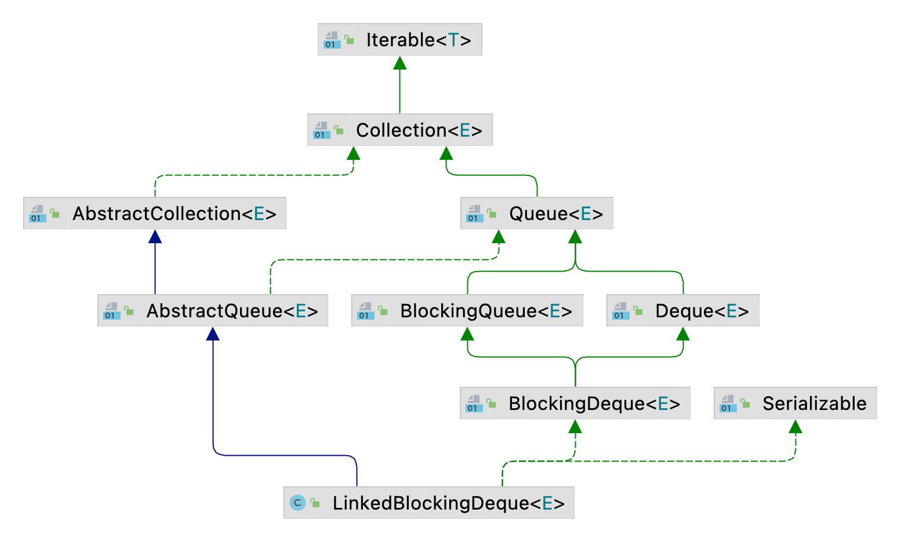

| 版本 | 内容 | 时间                   |
| ---- | ---- | ---------------------- |
| V1   | 新建 | 2022年12月06日23:52:45 |

## LinkedBlockingDeque概述

LinkedBlockingDeque 是基于双链表的无界阻塞队列，FIFO。

LinkedBlockingDeque 使用 ReentrantLock 实现同步操作。

需要注意的是 LinkedBlockingDeque 是一个近似的无界队列，默认的容量是 `Integer.MAX_VALUE`。

## LinkedBlockingDeque 继承体系

LinkedBlockingDeque 实现 BlockingDeque 接口，它提供了一些双端队列的操作。例如 addFirst，addLast 等。

而 BlockingDeque 接口继承自 BlockingQueue 接口。



## 双链表节点对象

LinkedBlockingDeque 是基于双链表实现的，所以节点里面定义了前驱指针和后驱指针。

```java
/** Doubly-linked list node class */
// 双端队列的节点对象
static final class Node<E> {
    /**
     * The item, or null if this node has been removed.
     */
    E item;

    /**
     * One of:
     * - the real predecessor Node
     * - this Node, meaning the predecessor is tail
     * - null, meaning there is no predecessor
     */
    /*
     * 1. 指向真正的前驱
     * 2. 指向自己的时候，说明前驱是 tail
     * 3. null 说明没有前驱
     */
    Node<E> prev;

    /**
     * One of:
     * - the real successor Node
     * - this Node, meaning the successor is head
     * - null, meaning there is no successor
     */
    /*
     * 1. 指向真正的后驱节点
     * 2. 指向自己的时候，说明后驱是 header
     * 3. null 说明没有后驱
     */
    Node<E> next;

    Node(E x) {
        item = x;
    }
}
```

## LinkedBlockingDeque 成员属性

```java
/**
 * Pointer to first node.
 * Invariant: (first == null && last == null) ||
 *            (first.prev == null && first.item != null)
 */
// 指向头节点的指针
transient Node<E> first;

/**
 * Pointer to last node.
 * Invariant: (first == null && last == null) ||
 *            (last.next == null && last.item != null)
 */
// 指向尾结点的指针
transient Node<E> last;

/** Number of items in the deque */
// 队列中元素的数量
private transient int count;

/** Maximum number of items in the deque */
// 队列的容量
private final int capacity;

/** Main lock guarding all access */
// 锁对象
final ReentrantLock lock = new ReentrantLock();

/** Condition for waiting takes */
private final Condition notEmpty = lock.newCondition();

/** Condition for waiting puts */
private final Condition notFull = lock.newCondition();
```


| 属性                 | 含义                                           |
| -------------------- | ---------------------------------------------- |
| `Node<E> first`      | 指向头节点的指针                               |
| `Node<E> last`       | 指向尾结点的指针                               |
| `int count`          | 队列中元素数量                                 |
| `int capacity`       | 队列的总容量                                   |
| `ReentrantLock lock` | 阻塞队列的同步锁                               |
| `Condition notEmpty` | 当队列为空的时候，入队线程需要在此条件队列阻塞 |
| `Condition notFull`  | 当队列满了的时候，出队线程需要在此条件队列阻塞 |

## LinkedBlockingDeque 构造函数

近似无界队列，默认的容量是 `Integer.MAX_VALUE`。

```java
/**
 * Creates a {@code LinkedBlockingDeque} with a capacity of
 * {@link Integer#MAX_VALUE}.
 */
public LinkedBlockingDeque() {
    this(Integer.MAX_VALUE);
}

/**
 * Creates a {@code LinkedBlockingDeque} with the given (fixed) capacity.
 *
 * @param capacity the capacity of this deque
 * @throws IllegalArgumentException if {@code capacity} is less than 1
 */
public LinkedBlockingDeque(int capacity) {
    if (capacity <= 0) throw new IllegalArgumentException();
    this.capacity = capacity;
}

/**
 * Creates a {@code LinkedBlockingDeque} with a capacity of
 * {@link Integer#MAX_VALUE}, initially containing the elements of
 * the given collection, added in traversal order of the
 * collection's iterator.
 *
 * @param c the collection of elements to initially contain
 * @throws NullPointerException if the specified collection or any
 *         of its elements are null
 */
public LinkedBlockingDeque(Collection<? extends E> c) {
    this(Integer.MAX_VALUE);
    final ReentrantLock lock = this.lock;
    lock.lock(); // Never contended, but necessary for visibility
    try {
        for (E e : c) {
            if (e == null)
                throw new NullPointerException();
            if (!linkLast(new Node<E>(e)))
                throw new IllegalStateException("Deque full");
        }
    } finally {
        lock.unlock();
    }
}
```

## LinkedBlockingDeque 核心方法

既然是双端队列，所以核心方法就是

1. 队首入队；
2. 队尾入队；
3. 队首出队；
4. 队尾出队；


### 队首阻塞入队 putFirst

```java
// 插入元素到对队首，阻塞等待
public void putFirst(E e) throws InterruptedException {
    if (e == null) throw new NullPointerException();
    Node<E> node = new Node<E>(e);
    final ReentrantLock lock = this.lock;
    lock.lock();
    try {
        while (!linkFirst(node))
            // 假如队列已经满了，入队现场阻塞等待
            notFull.await();
    } finally {
        lock.unlock();
    }
}
```

1. 首先创建 Node 节点；
2. 获取锁对象；
3. while 循环条件调用 LinkedBlockingDeque#linkFirst 方法，该方法返回 false 时表示队列已满。假如队列满了，则需要在条件队列上阻塞等待；
4. 最后释放锁；


LinkedBlockingDeque#linkFirst  方法很简单，就是双端链表的插入队首的操作。

```java
/**
 * Links node as first element, or returns false if full.
 */
// 插入元素到队首，假如队列已经满了则返回 false
private boolean linkFirst(Node<E> node) {
    // assert lock.isHeldByCurrentThread();
    if (count >= capacity)
        return false;
    Node<E> f = first;
    node.next = f;
    first = node;
    if (last == null)
        last = node;
    else
        f.prev = node;
    ++count;
    // 唤醒可能因为队列没有元素而阻塞的出队线程
    notEmpty.signal();
    return true;
}
```

### 队尾阻塞入队 putLast 

```java
// 插入元素到对队尾，阻塞等待
public void putLast(E e) throws InterruptedException {
    if (e == null) throw new NullPointerException();
    Node<E> node = new Node<E>(e);
    final ReentrantLock lock = this.lock;
    lock.lock();
    try {
        while (!linkLast(node))
            // 假如队列已经满了，入队线程阻塞等待
            notFull.await();
    } finally {
        lock.unlock();
    }
}
```

代码和 putFirst 十分类似，区别调用了 LinkedBlockingDeque#linkLast 方法。


LinkedBlockingDeque#linkLast

```java
// 插入元素到队尾
private boolean linkLast(Node<E> node) {
    // assert lock.isHeldByCurrentThread();
    if (count >= capacity)
        return false;
    Node<E> l = last;
    node.prev = l;
    last = node;
    if (first == null)
        first = node;
    else
        l.next = node;
    ++count;
    // 唤醒可能因为队列没有元素而阻塞的出队线程
    notEmpty.signal();
    return true;
}

```

### 队首阻塞出队 takeFirst

```java
// 出队，阻塞移除队首元素
public E takeFirst() throws InterruptedException {
    final ReentrantLock lock = this.lock;
    lock.lock();
    try {
        E x;
        while ( (x = unlinkFirst()) == null) {
            // 假如队列为空，则让当前出队线程阻塞等待
            notEmpty.await();
        }
        return x;
    } finally {
        lock.unlock();
    }
}

// 移除队首元素，假如队列中没有元素则返回 null
private E unlinkFirst() {
    // assert lock.isHeldByCurrentThread();
    Node<E> f = first;
    if (f == null)
        return null;
    Node<E> n = f.next;
    E item = f.item;
    f.item = null;
    f.next = f; // help GC
    first = n;
    if (n == null)
        last = null;
    else
        n.prev = null;
    --count;
    // 唤醒可能因为队列满了而阻塞的入队线程
    notFull.signal();
    return item;
}
```

### 队尾阻塞出队 takeLast

```java
// 出队，阻塞移除队尾元素
public E takeLast() throws InterruptedException {
    final ReentrantLock lock = this.lock;
    lock.lock();
    try {
        E x;
        while ( (x = unlinkLast()) == null)
            // 假如队列为空，则让当前出队线程阻塞等待
            notEmpty.await();
        return x;
    } finally {
        lock.unlock();
    }
}

// 移除队尾元素，假如队列中没有元素则返回 null
private E unlinkLast() {
    // assert lock.isHeldByCurrentThread();
    Node<E> l = last;
    if (l == null)
        return null;
    Node<E> p = l.prev;
    E item = l.item;
    l.item = null;
    l.prev = l; // help GC
    last = p;
    if (p == null)
        first = null;
    else
        p.next = null;
    --count;
    // 唤醒可能因为队列满了而阻塞的入队线程
    notFull.signal();
    return item;
}
```


## 小结

LinkedBlockingDeque 基于双链表实现的近似无界阻塞队列，内部仅使用一个 ReentrantLock 来实现入队和出队的同步操作。源码还是很简单的，就是简单的双链表的操作。
