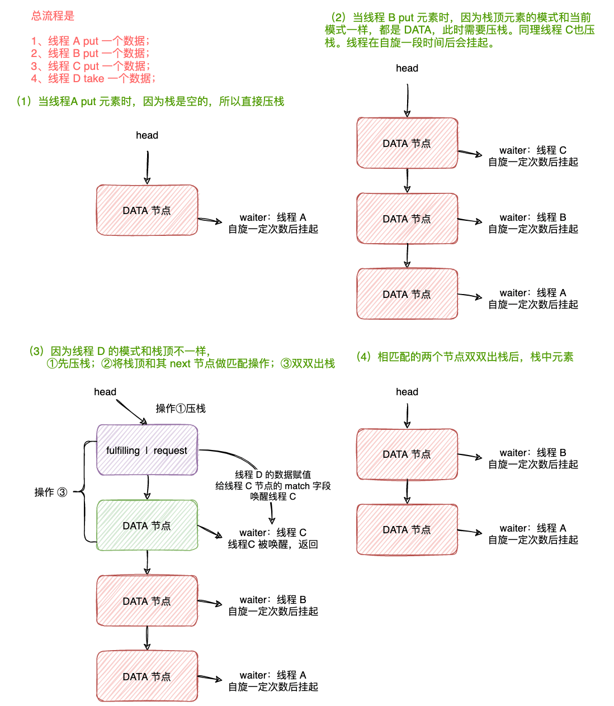
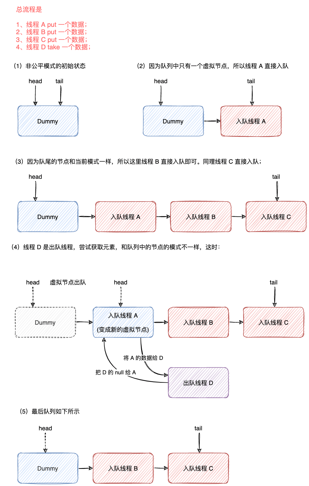

| 版本 | 内容 | 时间                   |
| ---- | ---- | ---------------------- |
| V1   | 新建 | 2022年12月13日23:34:22 |

## SynchronousQueue 简介

SynchronousQueue 是一个特殊的阻塞队列，实现了 BlockingQueue 接口。

```java
public class SynchronousQueue<E> extends AbstractQueue<E>
    implements BlockingQueue<E>, java.io.Serializable {
    // ...省略...
}
```


SynchronousQueue 的特点如下：

1. SynchronousQueue 底层使用**栈**和**双端队列**来实现。
2. SynchronousQueue 支持**公平模式和非公平模式**。其中**公平模式使用双端队列实现，非公平模式使用栈来实现**。
3. SynchronousQueue **内部不存储元素**，**入队和出队线程必须匹配才不会阻塞**，没有匹配会一直阻塞直到有对应的线程来匹配。


SynchronousQueue 基于 `dual stack and dual queue algorithms ` 论文实现的。

http://www.cs.rochester.edu/u/scott/synchronization/pseudocode/duals.html

源码注释：

This class implements extensions of the dual stack and dual queue algorithms described in "Nonblocking Concurrent Objects with Condition Synchronization", by W. N. Scherer III and M. L. Scott.  18th Annual Conf. on Distributed Computing, Oct. 2004 (see also http://www.cs.rochester.edu/u/scott/synchronization/pseudocode/duals.html). The (Lifo) stack is used for non-fair mode, and the (Fifo) queue for fair mode. The performance of the two is generally similar. Fifo usually supports higher throughput under contention but Lifo maintains higher thread locality in common applications.


## Transferer 抽象类

SynchronousQueue 底层使用**栈**和**双端队列**来实现，栈和双端队列的实现类都必须继承这个抽象类。

其中

- 栈是 TransferStack 类；
- 双端队列是 TransferQueue 类；


下面看下 Transfer 接口定义的方法

```java
abstract static class Transferer<E> {
    abstract E transfer(E e, boolean timed, long nanos);
}
```

可以看到就定义了 transfer 这一个方法。

既然是阻塞队列，那就包含的入队和出队的操作，在 SynchronousQueue 中 Transferer#transfer 方法既表示了入队操作也表示了出队操作。


入参：

- `E e`：假如是入队操作，e 就表示要入队的数据。出队操作时 e 是 null，不传这个；
- `boolean timed`：表示当前入队或出队的操作是否支持超时；
- `long nanos`：假如支持超时，nanos 表示超时时间；


返回值：

- 返回值非空：假如当前表示的是入队操作，那么返回值就是当前入参 e 的值；
- 返回值非空：假如当前表示的是出队操作，那么返回值就是匹配到入队的数据值了；
- 返回值是 null：表示当前入队或出队操作超时了，或者线程被中断了。

## SynchronousQueue 属性和构造方法

transferer 属性

```java
private transient volatile Transferer<E> transferer;
```

构造方法：

```java
public SynchronousQueue() {
    this(false);
}

public SynchronousQueue(boolean fair) {
    transferer = fair ? new TransferQueue<E>() : new TransferStack<E>();
}
```

会根据入参创建不同的 Transferer 对象，具体实现由栈和双端队列，分别代表非公平模式和公平模式。

 **默认是非公平的 TransferStack**。

具体是怎么公平和非公平的，后面详细分析。

## SynchronousQueue 非公平模式

SynchronousQueue 非公平模式使用的是栈这个数据结构，需要看 TransferStack 类的实现。

**为什么在这里栈是非公平模式的呢？**

因为每次相同模式的节点都是直接压栈，当来一个不同模式的节点时，此时会与栈顶元素匹配，这就是不公平了，栈顶元素是后到的，反而先匹配。

### TransferStack 的节点模式

TransferStack 中定义了栈中节点的模式，主要就是 0，1，2。

```java
/* Modes for SNodes, ORed together in node fields */
/** Node represents an unfulfilled consumer */
static final int REQUEST    = 0;    // 00 未配对的消费者
/** Node represents an unfulfilled producer */
static final int DATA       = 1;    // 01 未配对的生产者
/** Node is fulfilling another unfulfilled DATA or REQUEST */
/*
 * 表示 Node 类型为匹配中的类型
 * 假设栈顶元素是 REQUEST-Node 类型，当前请求类型是 DATA 的话，入栈会修改类型为 FULFILLING
 * 假设栈顶元素是 DATA-Node 类型，当前请求类型是 REQUEST 的话，入栈会修改类型为 FULFILLING
 */
static final int FULFILLING = 2;    // 10 配对成功的消费者/生产者
```

- REQUEST 模式：表示尝试 take 元素的线程封装的节点，也就是消费者；
- DATA 模式：表示尝试 put 元素的线程封装的节点，也就是生产者；
- FULFILLING 模式：这时说明 take 和 put 的两个节点发生匹配了；

### TransferStack.SNode 节点对象

```java
static final class SNode {
    volatile SNode next;        // next node in stack           栈中的指向下一个栈帧
    volatile SNode match;       // the node matched to this     与当前结点配对的结点
    volatile Thread waiter;     // to control park/unpark      
    // data 不是空的话表示当前是 DATA请求，入队
    // data 是空的话表示当前是 REQUEST 请求，出队
    Object item;                // data; or null for REQUESTs   实际数据或null
    int mode;                   // 结点类型，DATA,REQUEST,FULFILLING
}
```


| 属性名          | 功能                                                         |
| --------------- | ------------------------------------------------------------ |
| `SNode next`    | 执行栈中的下一个栈帧                                         |
| `SNode match`   | 与当前节点匹配的节点                                         |
| `Thread waiter` | 假如节点入队后发现没有节点匹配，在尝试一段时间后假如还未匹配，<br />此时会挂起，并把线程引用赋值到 waiter |
| `Object item`   | DATA 模式，就是存的数据；<br />REQUEST 模式是 null；TODO-KWOK 存疑 |
| `int mode`      | 节点的模式，DATA、REQUEST、FULFILLING                        |


### 核心方法 TransferStack#transfer

先看下入队 put 和出队 take 方法

```java
public void put(E e) throws InterruptedException {
    if (e == null) throw new NullPointerException();
    if (transferer.transfer(e, false, 0) == null) {
        Thread.interrupted();
        throw new InterruptedException();
    }
}

public E take() throws InterruptedException {
    E e = transferer.transfer(null, false, 0);
    if (e != null)
        return e;
    Thread.interrupted();
    throw new InterruptedException();
}
```

可以看到 put 和 take 方法都是调用的抽象方法 transfer，区别就是 put 方法传了数据，而 take 传的是 null。


接下来看核心方法 TransferStack#transfer 的分析。

先分析下大概的流程，整个 TransferStack#transfer 方法是在一个自旋中，尝试做下面三件事其中之一：

1. 如果栈是空的，或者已经有相同模式的节点，那么就将当前节点压栈，并等待对应模式的节点来匹配；
2. 如果栈的节点与当前的节点的模式相反，此时会将当前节点设置为 FULFILLING 模式并压栈，与相应的节点进行匹配；
3. 如果栈顶元素已经是 FULFILLING 模式的节点了，说明已经此时栈中已经有两个节点在匹配的操作中了，此时需要协助匹配或出栈操作；


完整看下 TransferStack#transfer 的代码，后面依次分析。

```java
E transfer(E e, boolean timed, long nanos) {
    SNode s = null; // constructed/reused as needed
    int mode = (e == null) ? REQUEST : DATA;

    for (;;) {
        SNode h = head;
        // CASE1: 栈为空 或 栈顶结点的模式与当前mode相同，都需要做入栈操作
        if (h == null || h.mode == mode) {  // empty or same-mode
            if (timed && nanos <= 0) {      // can't wait
                if (h != null && h.isCancelled())
                    casHead(h, h.next);     // pop cancelled node
                else
                    return null;
            }
            else if (casHead(h, s = snode(s, e, h, mode))) {
                SNode m = awaitFulfill(s, timed, nanos);
                if (m == s) {               // wait was cancelled
                    clean(s);
                    return null;
                }
                if ((h = head) != null && h.next == s)
                    casHead(h, s.next);     // help s's fulfiller
                return (E) ((mode == REQUEST) ? m.item : s.item);
            }
        }
        // CASE2: 前置条件，栈顶结点的模式与当前mode不相同，栈顶结点还未配对成功
        // 条件：栈顶元素的模式不是 FULFILLING，进入该分支去匹配
        else if (!isFulfilling(h.mode)) { // try to fulfill
            if (h.isCancelled())            // already cancelled
                casHead(h, h.next);         // pop and retry
            else if (casHead(h, s=snode(s, e, h, FULFILLING|mode))) {
                for (;;) { // loop until matched or waiters disappear
                    SNode m = s.next;       // m is s's match
                    if (m == null) {        // all waiters are gone
                        // 将整个栈清空，因为 s.next 都是 null 了，只有 s 一个节点
                        casHead(s, null);   // pop fulfill node
                        s = null;           // use new node next time
                        break;              // restart main loop
                    }
                    SNode mn = m.next;
                    if (m.tryMatch(s)) {
                        casHead(s, mn);     // pop both s and m
                        return (E) ((mode == REQUEST) ? m.item : s.item);
                    } else                  // lost match
                        s.casNext(m, mn);   // help unlink
                }
            }
        }
        // CASE3：栈顶模式是 FULFILLING，表示栈顶和栈顶的 next 节点正在匹配
        // 当前请求需要做协助工作
        else {                            // help a fulfiller
            SNode m = h.next;               // m is h's match
            if (m == null)                  // waiter is gone
                casHead(h, null);           // pop fulfilling node
            else {
                SNode mn = m.next;
                if (m.tryMatch(h))          // help match
                    casHead(h, mn);         // pop both h and m
                else                        // lost match
                    h.casNext(m, mn);       // help unlink
            }
        }
    }
}
```

**第（1）步**，判断当前 TransferStack#transfer 操作的模式，DATA 模式是会传数据进来的。

```java
SNode s = null; // constructed/reused as needed
int mode = (e == null) ? REQUEST : DATA;
```

后面就开始自旋针对三种不同的情况做操作了。

**第（2）步**，开始自旋。

**自旋 CASE1**：栈中没有元素，或者栈顶元素与当前模式相同。此时需要进行入栈操作。

这里会判断是否支持超时的情况。假如不支持超时或者未超时，这时需要将创建一个节点并将其压栈。假如压栈成功，就会调用 TransferStack#awaitFulfill 方法等待匹配的节点，该方法返回值有两种：①**匹配到相反模式的节点了；②出现中断或者超时取消了**。

假如节点取消了，就需要将节点从栈中移除。假如匹配到节点了就需要将当前节点和匹配到的节点一起出栈。

最后根据当前模式返回数据。

```java
for (;;) {
    SNode h = head;
    // CASE1: 栈为空 或 栈顶结点的模式与当前mode相同，都需要做入栈操作
    if (h == null || h.mode == mode) {  // empty or same-mode
        // case1.1: timed 成立表示当前是支持超时的，nanos <= 0 表示已经等待超时了
        if (timed && nanos <= 0) {      // can't wait
            // 条件成立表示栈顶元素是取消状态，需要弹出取消状态的节点
            if (h != null && h.isCancelled())
                casHead(h, h.next);     // pop cancelled node
            else
                return null;
        }
        // case1.2 前置条件是栈顶元素是 null 或者当前模式与栈顶元素模式一样
        // 且 timed 是 false 或者支持超时但是超时时间未到
        // 这里将 s 压栈
        else if (casHead(h, s = snode(s, e, h, mode))) {
            // 走到这里说明入栈成功， 阻塞当前调用线程，等待被匹配
            SNode m = awaitFulfill(s, timed, nanos);
            // 1. 正常情况是匹配到值了，就是匹配到的节点
            // 2. 异常情况就是被取消了，match 是 this，指向当前节点
            if (m == s) {               // wait was cancelled
                // 将取消的节点移除栈，直接移除，并不是 pop
                clean(s);
                return null;
            }
            // 此时m为配对结点
            // (h = head) != null 表示栈顶不为 null
            // h.next == s 说明栈顶的下一个元素是当前线程封装的节点 s，说明匹配的两个节点还未出栈
            if ((h = head) != null && h.next == s)
                // 出栈匹配的 两个节点
                casHead(h, s.next);     // help s's fulfiller
            // 入队DATA线程就是  提交的值, 出队线程返回配对结点的值
            return (E) ((mode == REQUEST) ? m.item : s.item);
        }
        // 执行到此处说明入栈失败(多个线程同时入栈导致CAS操作head失败),则进入下一次自旋继续执行
    }
 
    // 省略其他 CASE.........
}
```


**自旋 CASE2**：前置条件是**栈顶元素的模式和当前的模式不同**。这里 TransferStack#isFulfilling 判断栈顶节点是否是正在匹配中的状态。进入该 CASE 说明**栈顶元素还未开始做匹配操作**，需要进入该 CASE 处理。

首先会判断栈顶节点是否已经取消了，假如取消了就移除该节点，并设置新的栈顶，继续自旋判断；

否则尝试压栈一个 SNode 节点，该节点特殊的是 mode 属性是`FULFILLING|mode`。压栈成功后会开启一个自旋，会自旋直到节点匹配成功或者等待的线程不存在了。

调用 TransferStack.SNode#tryMatch 方法尝试匹配节点，在改方法中会尝试唤醒阻塞的线程。

```java
boolean tryMatch(SNode s) {
    // match == null 说明当前 Node 还未匹配，然后 CAS 尝试将 match 设置为 s
    if (match == null &&
        UNSAFE.compareAndSwapObject(this, matchOffset, null, s)) {
        // 当前 NOde 如果自旋结束后，会调用 park 方法挂起，挂起之前会将挂起的线程存到 waiter 字段里
        Thread w = waiter;
        if (w != null) {    // waiters need at most one unpark
            waiter = null;
            // 唤醒
            LockSupport.unpark(w);
        }
        return true;
    }
    return match == s;
}
```

假如匹配节点成功后，就将匹配成功的这两个节点出栈，最后返回值。

```java
// CASE2: 前置条件，栈顶结点的模式与当前mode不相同，栈顶结点还未配对成功
// 条件：栈顶元素的模式不是 FULFILLING，进入该分支去匹配
else if (!isFulfilling(h.mode)) { // try to fulfill
    // case2.1: 元素取消情况（因中断或超时）的处理
    if (h.isCancelled())            // already cancelled
        // 移除取消节点
        casHead(h, h.next);         // pop and retry
    // case2.2: 将当前结点压入栈中，将当前节点的 mode 改为 FULFILLING|mode
    else if (casHead(h, s=snode(s, e, h, FULFILLING|mode))) {
        // 自旋直到匹配成功或者 waiter 没了
        for (;;) { // loop until matched or waiters disappear
            SNode m = s.next;       // m is s's match
            // m == null 什么时候成立？
            // 当 s.next 节点超时或者外部线程中断唤醒后，会执行 clean 操作将自己清理出站
            // 此时站在匹配者线程来看，s.next 是有可能是 null 的
            if (m == null) {        // all waiters are gone
                // 将整个栈清空，因为 s.next 都是 null 了，只有 s 一个节点
                casHead(s, null);   // pop fulfill node
                s = null;           // use new node next time
                break;              // restart main loop
            }
            SNode mn = m.next;
            if (m.tryMatch(s)) {
                // 假如匹配成功，就将 m 和 s 一起弹出栈，将 mn 设置为新的栈顶
                casHead(s, mn);     // pop both s and m
                return (E) ((mode == REQUEST) ? m.item : s.item);
            } else                  // lost match
                // 假如匹配失败，说明 m 可能出现了超时了等情况，帮助将 m 移出栈
                s.casNext(m, mn);   // help unlink
        }
    }
}
```


**自旋CASE3**：这个 CASE 表示栈顶元素是 FULFILLING 模式，进入这个 CASE 协助匹配节点。代码和 CASE2 一样，只是没有返回值。

```java
// CASE3：栈顶模式是 FULFILLING，表示栈顶和栈顶的 next 节点正在匹配
// 当前请求需要做协助工作
else {                            // help a fulfiller
    SNode m = h.next;               // m is h's match
    if (m == null)                  // waiter is gone
        casHead(h, null);           // pop fulfilling node
    else {
        SNode mn = m.next;
        if (m.tryMatch(h))          // help match
            // 假如匹配成功，就将 m 和 s 一起弹出栈，将 mn 设置为新的栈顶
            casHead(h, mn);         // pop both h and m
        else                        // lost match
            // 假如匹配失败，说明 m 可能出现了超时了等情况，帮助将 m 移出栈
            h.casNext(m, mn);       // help unlink
    }
}
```

### 核心方法 TransferStack#awaitFulfill

这个方法主要在上一节的 CASE1 中因为栈中的元素的模式都相同，此时需要压栈等待匹配。那么等待就是调用改的 TransferStack#awaitFulfill 这个方法。


这个方法的思路很明显，就是在实际阻塞线程前需要自旋一段时间等待匹配，因为阻塞线程的代价比短暂的自旋代价要大。

```java
SNode awaitFulfill(SNode s, boolean timed, long nanos) {
    final long deadline = timed ? System.nanoTime() + nanos : 0L;
    Thread w = Thread.currentThread();
    // 当前请求线程在下面的 for 自旋中的自旋次数，自选次数后还未匹配成功则 park 线程
    int spins = (shouldSpin(s) ?
                 (timed ? maxTimedSpins : maxUntimedSpins) : 0);
    // 自旋检查逻辑 1.是否超时 2.是否中断 3.是否匹配成功
    for (;;) {
        if (w.isInterrupted())
            // 收到中断信息，取消
            s.tryCancel();
        // s.match 两种情况
        // 1. 正常情况是匹配到值了，就是匹配到的节点
        // 2. 异常情况就是被取消了，match 是 this，指向当前节点
        SNode m = s.match;
        if (m != null)
            // 匹配到值了，获取取消了，直接返回
            return m;
        if (timed) {
            nanos = deadline - System.nanoTime();
            if (nanos <= 0L) {
                // 超时了，取消
                s.tryCancel();
                // 继续循环，会在上面返回 return
                continue;
            }
        }
        if (spins > 0)
            // 自旋次数-1
            spins = shouldSpin(s) ? (spins-1) : 0;
        // 说明自旋次数完了，保存当前线程对象到 waiter 中
        else if (s.waiter == null)
            s.waiter = w; // establish waiter so can park next iter
        else if (!timed)
            // 无限挂起，等待唤醒
            LockSupport.park(this);
        else if (nanos > spinForTimeoutThreshold)
            // 超时挂起
            LockSupport.parkNanos(this, nanos);
    }
}
```

### 非公平模式图解

假设一个流程：

1. 线程 A put 一个元素；
2. 线程 B put 一个元素；
3. 线程 C put 一个元素；
4. 线程 D take 一个元素；




## SynchronousQueue 公平模式

SynchronousQueue 公平模式是使用双端队列实现的。

前面的非公平模式使用栈，当栈顶遇到不同模式的节点后，此时会与栈顶元素匹配，不公平。

这里使用双端队列的公平性体现在，当栈顶遇到不同模式的节点时，会与双端队列的队首元素匹配。

SynchronousQueue 公平模式的实现可以自己去看，这里就做一个简单的图解。

### 公平模式图解



## 小结

无
