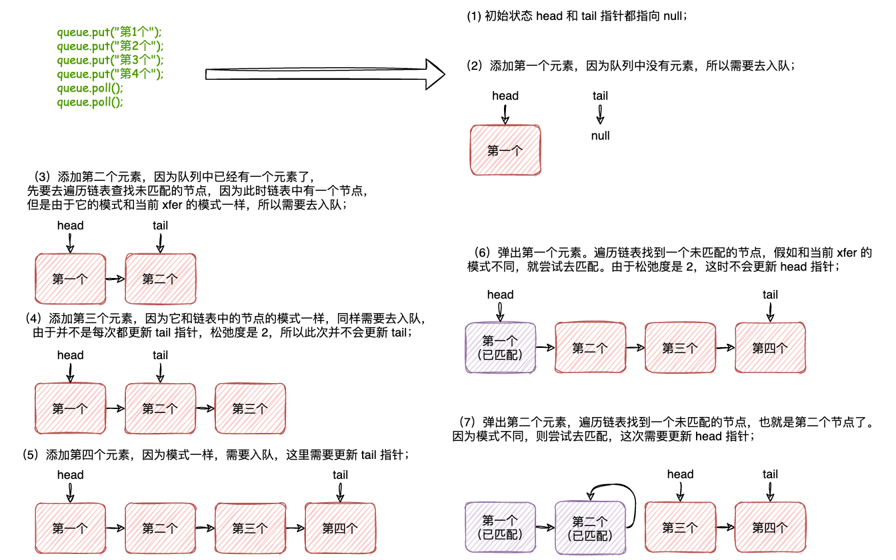

| 版本 | 内容 | 时间 |
| ---- | ---- | ---- |
| V1   | 新建 |      |

## LinkedTransferQueue 简介

LinkedTransferQueue 是 JDK1.7 引入的一个支持并发的无界的阻塞队列。相对于之前的 LinkedBlockingQueue 和SynchronousQueue 有了很多改进的地方，性能也更加强大。


在 LinkedTransferQueue 源码的注释中有下面几句话：

- Blocking Dual Queues arrange that threads enqueuing unmatched requests block until other threads provide the match. 
- Dual Synchronous Queues (see Scherer, Lea, & Scott http://www.cs.rochester.edu/u/scott/papers/2009_Scherer_CACM_SSQ.pdf) additionally arrange that threads enqueuing unmatched data also block.  
- Dual Transfer Queues support all of these modes, as dictated by callers.


LinkedTransferQueue 底层是一个单链表组成的双重队列，和 SynchronousQueue 的公平模式有点类似。

## TransferQueue 接口

LinkedTransferQueue 实现了 TransferQueue 接口。

这是相对于其他的阻塞队列额外提供的一些方法，接口定义如下

```java
public interface TransferQueue<E> extends BlockingQueue<E> {
    /*
     * 假如有消费者在等待（take 方法或者 poll(long,TimeUnit)），立刻传递元素到已经在等待的消费者
     * 假如没有消费者在等待，则返回 false，不进行入队操作，也就意味着直接丢弃尝试入队的数据
     */
    boolean tryTransfer(E e);

    /*
     * 假如有消费者在等待（take 方法或者 poll(long,TimeUnit)），立刻传递元素到已经在等待的消费者
     * 假如没有消费者在等待，当前生产者需要等待直到一个消费者接收数据
     */
    void transfer(E e) throws InterruptedException;

    /*
     * 假如有消费者在等待，立刻传递元素到已经在等待的消费者
     * 假如没有消费者在等待，等待指定时间后，假如还没有消费者在等待，则返回 false，不进行入队操作
     */
    boolean tryTransfer(E e, long timeout, TimeUnit unit)
        throws InterruptedException;

    /*
     * 返回 true 表示至少有一个消费者在等待获取元素，一般是消费者线程调用 take 或者 poll 方法
     * 这个返回值表示某个时候瞬时的状态
     */
    boolean hasWaitingConsumer();

    /*
     * 获取有多少个消费者在 take 或者 poll 显示等待
     * 这是一个估计值（近似值）
     * 可能是错误估计，消费者可能已经完成获取元素或者放弃等待了。
     * 这个值可以在监控的时候有用，
     */
    int getWaitingConsumerCount();
}
```


TransferQueue 接口就是扩展了 BlockingQueue 接口，提供了一些额外的方法。

主要是 tryTransfer 和 tryTransfer 方法

1. `tryTransfer(E)`：尝试传递数据到消费者，假如消费者已经在等待了（take 或者  poll(long,TimeUnit)），那么直接传递数据到消费者。否则不进行入队，直接将数据丢弃；
2. `tryTransfer(E, long, TimeUnit)`：`tryTransfer(E)`方法的支持超时版本。
3. `transfer`：尝试传递数据到消费者，假如消费者已经在等待数据，那么直接传递数据到消费者，否则等待直到有消费者在等待；
4. `hasWaitingConsumer`：判断是否有消费者在等待（瞬态值）；
5. `getWaitingConsumerCount`：获取有多少个消费者在等待数据；


## 节点对象

LinkedTransferQueue 是底层是基于单链表的，看一下它的节点对象

```java
static final class Node {
    // false 表示请求 Node，就是消费者啦，REQUEST
    // true 表示生产者，DATA
    final boolean isData;   // false if this is a request node
    // 生产者的数据，假如是消费者那就是匹配到的数据
    volatile Object item;   // initially non-null if isData; CASed to match
    // 节点的后驱
    volatile Node next;
    // 不为 null 时，表示阻塞的线程
    volatile Thread waiter; // null until waiting
    
    // ... 省略 ...
}
```


| 属性             | 解释                                            |
| ---------------- | ----------------------------------------------- |
| `boolean isData` | true - 生产者  DATA<br />false - 消费者 REQUEST |
| `Object item`    | 生产者时表示等待匹配的数据                      |
| `Node next`      | 当前节点的后驱指针                              |
| `Thread waiter`  | 当节点需要阻塞时，用于存放等待的线程            |

## 属性和常量介绍

LinkedTransferQueue 是一个单链表，用 head 和 tail 指针指向队列的头节点和尾结点。

但是 head 和 tail 指针在实际可能并不是指向真正的头节点和尾结点，这个后面分析。

```java
/** head of the queue; null until first enqueue */
// 指向队列头节点的指针，在第一次入队前是 null
transient volatile Node head;

/** tail of the queue; null until first append */
// 指向队列尾结点的指针，在第一次入队前是 null
private transient volatile Node tail;
```


LinkedTransferQueue 支持很多模式。

LinkedBlockingQueue 当阻塞队列中没有元素时，调用方尝试获取元素时会阻塞线程；

SynchronousQueue 需要入队节点和出队节点相匹配，假如仅有入队节点，或者仅有出队节点，此时会阻塞入队或者出队线程。

而 LinkedTransferQueue 支持这些所有模式，还有一些普通阻塞队列的模式。


为了区分这些模式，LinkedTransferQueue 里面定义了一些常量：

```java
// 立刻操作，不会阻塞线程
private static final int NOW   = 0; // for untimed poll, tryTransfer
// 异步，不会阻塞线程
private static final int ASYNC = 1; // for offer, put, add
// 同步操作，会阻塞线程
private static final int SYNC  = 2; // for transfer, take
// 同步操作，会阻塞线程，指定超时时间
private static final int TIMED = 3; // for timed poll, tryTransfer
```

- NOW：表示该操作不会阻塞线程，主要用在不支持超时的 poll 和 不支持超时 tryTransfer 方法；
- ASYNC：表示该操作是一个异步操作，不会阻塞线程，主要在 put，offer，和 add 方法中；
- SYNC：表示该操作是一个同步操作，会阻塞线程，主要在 transfer 和 take 方法中；
- TIMED：表示该操作是一个支持超时的操作，只要用在支持超时的 poll 和 tryTransfer 方法中；


下面是 LinkedTransferQueue 主要的一些方法的模式：

| 方法                           | 入队 or 出队 | 模式  |
| ------------------------------ | ------------ | ----- |
| `put(E)`                       | 入队         | ASYNC |
| `offer(E,long,TimeUnit)`       | 入队         | ASYNC |
| `offer(E)`                     | 入队         | ASYNC |
| `add(E)`                       | 入队         | ASYNC |
| `tryTransfer(E)`               | 入队         | NOW   |
| `transfer(E)`                  | 入队         | SYNC  |
| `tryTransfer(E,long,TimeUnit)` | 入队         | TIMED |
| `take`                         | 出队         | SYNC  |
| `poll(long,TimeUnit)`          | 出队         | TIMED |
| `poll`                         | 出队         | NOW   |

## 核心方法 xfer

所有的入队和出队方法都是调用的一个 xfer 方法，通过传入不同的入参实现。

先看下 xfer 方法的整体实现：

```java
private E xfer(E e, boolean haveData, int how, long nanos) {
    if (haveData && (e == null))
        throw new NullPointerException();
    Node s = null;                        // the node to append, if needed
    retry:
    for (;;) {                            // restart on append race
        for (Node h = head, p = h; p != null;) { // find & match first node
            boolean isData = p.isData;
            Object item = p.item;
            if (item != p && (item != null) == isData) { // unmatched
                if (isData == haveData)   // can't match
                    break;
                if (p.casItem(item, e)) { // match
                    for (Node q = p; q != h;) {
                        Node n = q.next;  // update by 2 unless singleton 
                        if (head == h && casHead(h, n == null ? q : n)) {
                            h.forgetNext();
                            break;
                        }                 // advance and retry
                        if ((h = head)   == null ||
                            (q = h.next) == null || !q.isMatched())
                            break;        // unless slack < 2
                    }
                    LockSupport.unpark(p.waiter);
                    return LinkedTransferQueue.<E>cast(item);
                }
            }
            Node n = p.next;
            p = (p != n) ? n : (h = head); // Use head if p offlist
        }
        if (how != NOW) {                 // No matches available
            if (s == null)
                s = new Node(e, haveData);
            Node pred = tryAppend(s, haveData);
            if (pred == null)
                continue retry;           // lost race vs opposite mode
            if (how != ASYNC)
                return awaitMatch(s, pred, e, (how == TIMED), nanos);
        }
        return e; // not waiting
    }
}
```

看上去就几十行代码，其实麻烦的不行。

先分析下入参的意义：

1. `E e`：入队的方法传的值表示要入队的数据，出队的方法传的是 null；
2. `boolean haveData`：true 表示入队，false 表示出队；
3. `int how`：模式，NOW，ASYNC，SYNC，TIMED；
4. `long nanos`：假如是 TIMED 模式，这个参数表示的是线程等待的超时时间；

整体逻辑都在一个自旋中，大致可以分为两部分，①从头开始遍历链表，找到一个与当前 xfer 的相匹配的节点，假如能匹配则进行匹配操作；②假如遍历完发现都不能匹配，那么就需要根据 xfer 的入参 how 来决定是否入队，是否挂起线程等待了；

下面按照步骤分析代码

### xfer 第一步：查找能匹配的节点并匹配

先看第一步，就是遍历链表查找一个可以匹配的节点。

```java
// 从 head 遍历找到一个可匹配的节点。假如没找到，说明队列中的元素都是当前 xfer 的模式，那就入队
// p 是遍历链表的指针
for (Node h = head, p = h; p != null;) { // find & match first node
    boolean isData = p.isData;
    Object item = p.item;
    /*
     * item != p 表示 p 节点尚未取消，也没有匹配（或者匹配的流程还没走完），
     * 因为 p 在匹配完成或者取消后会将它的 item 指向自己
     * (item != null) == isData， 表示这个节点还未匹配
     * CASE1:这个就是判断 p 是否已经匹配了,true 表示未匹配
     */
    if (item != p && (item != null) == isData) { // unmatched
        if (isData == haveData)   // can't match
            // 模式相同，无法匹配，当前操作需要去入队
            break;
        /*
         * CAS 将 p 的 item 改为当前 xfer 的 e，交换数据
         * 如果CAS失败，那么表示匹配失败，可能是被取消了，或者被其他请求抢先匹配了
         */
        if (p.casItem(item, e)) { // match
            /*
             * 走到这里说明匹配成功，需要做匹配后的操作
             * 这个循环的操作是尝试查找并移除已经被匹配/取消的节点，以及更新 head 引用的指向
             * 假如队列中只有一个元素，那么就不更新 head 指针，否则每次更新 head 向后移两位
             * 只有在更新head 指针成功后才去移除已经匹配的节点，这就是"松弛度"
             */
            for (Node q = p; q != h;) {
                Node n = q.next;  // update by 2 unless singleton
                /*
                 * 假如head还是指向 h，就是说没有被别的线程修改，此时需要将 head 改为指向 q 或者 n
                 * 移除元素，三元运算是为了判断移除一个还是两个，一般是移除两个
                 */
                if (head == h && casHead(h, n == null ? q : n)) {
                    h.forgetNext(); // 原来的 head 可以出队了
                    break;
                }                 // advance and retry
                /*
                 * 到这里说明上面的 head != null，或者 cas 失败了，也就是 head 指针被别的线程给改了
                 * 有可能此时h被其他请求移除了，有可能此时h和p都被其他请求帮助移除了
                 * 此时 h 指向最新的 head，q 是 head.next
                 * h == null 新的头是 null
                 * h != null && q == null 说明就一个元素
                 * h != null && q != null && !q.isMatched() 说明 head.next 节点未匹配
                 */
                if ((h = head)   == null ||
                    (q = h.next) == null || !q.isMatched())
                    // 即如果结点数量小于2，或被匹配和取消的结点数量小于2，那么break跳出第二层内循环
                    // 继续循环的条件那就是节点的数量不小于 2，至少有两个元素已经匹配了，那么需要继续循环移除元素
                    break;        // unless slack < 2
            }
            // 走出上面的 for 循环 说明"松弛度"已经控制好了
            // 唤醒可能阻塞的线程
            LockSupport.unpark(p.waiter);
            // 这是所有的入队、传递、出队方法在主动匹配成功之后的共同唯一出口
            return LinkedTransferQueue.<E>cast(item);
        }
    }
    // 当前节点匹配失败，遍历链表继续后移查找
    Node n = p.next;
    // 如果 p 已经出队则使用 head 再去遍历
    p = (p != n) ? n : (h = head); // Use head if p offlist
}
```

具体流程可看代码的注释。

这里解释下大概的流程：

1. 首先从链表头开始遍历链表，校验链表中的元素是否已经匹配（或者正在匹配中），假如已经匹配，则继续向后查找未匹配的节点；
2. 假如查找完整个链表还未找到未匹配的节点，那么就需要去入队了；
3. 假如查找到当中某个节点未匹配时，且该节点的模式和当前 xfer 的模式相同，则无法匹配，需要去入队了；
4. 假如查找到当中某个节点未匹配时，且该节点的模式和当前 xfer 的模式不相同，则尝试去匹配；
   1. 交换节点的 item 和 xfer 入参 e 的值；
   2. 尝试修改 head 指针；
   3. 假如因为并发原因导致修改 head 指针失败，则需要保证链表的头部已匹配的节点的松弛度小于等于 2；
   4. 唤醒可能阻塞的线程，并组装返回值；


### xfer 第二步：未匹配成功后的操作

假如在链表中未找到能够匹配的节点，此时就需要根据 xfer 方法的入参「模式」来做不同的处理。

模式有下面几种

- NOW：表示该操作不会阻塞线程，主要用在不支持超时的 poll 和 不支持超时 tryTransfer 方法；
- ASYNC：表示该操作是一个异步操作，不会阻塞线程，主要在 put，offer，和 add 方法中；
- SYNC：表示该操作是一个同步操作，会阻塞线程，主要在 transfer 和 take 方法中；
- TIMED：表示该操作是一个支持超时的操作，只要用在支持超时的 poll 和 tryTransfer 方法中；


```java
/*
 * 可能是队列为空，也可能是遍历完队列后还是没有可以匹配的节点，做入队操作
 * 假如是 NOW 模式则立即返回，此时数据也丢了，并没有入队，直接返回
 * 假如不是 NOW 模式则需要创建节点入队了
 */
if (how != NOW) {                 // No matches available
    // 创建一个新的 Node
    if (s == null)
        s = new Node(e, haveData);
    /*
     * 调用 tryAppend 方法尝试将 s 节点追加到队列尾部，返回值如下：
     * 1、null，追加失败
     * 2、s 的前驱
     * 3、this 自身，表示 s 没有前驱
     */
    Node pred = tryAppend(s, haveData);
    if (pred == null)
        continue retry;           // lost race vs opposite mode， 竞争失败重新自旋重试
    // 到这里说明追加节点成功
    if (how != ASYNC) // ASYNC 模式不走下面的等待方法，直接下面 return 了
        /*
         * 不是异步的情况，就要去等待了
         * 在awaitMatch方法中等待直到被后续的请求匹配或者被取消
         * 1.如果匹配成功，返回匹配的请求的 item 值；
         * 2.假如因为超时或者中断被取消等待，返回当前节点的 e（item）
         */
        return awaitMatch(s, pred, e, (how == TIMED), nanos);
}
return e; // not waiting
```

这部分代码就比较好理解了

1. 假如 xfer 的模式是 NOW，那么直接 return 了；
2. 假如 xfer 的模式不是 NOW，那么可能就是 ASYNC，SYNC，TIMED 中的一种了。此时需要创建一个 Node 节点。并调用 tryAppend 方法尝试将新建的 Node 追加到链表尾部。
3. 追加节点成功后
   1. 假如当前 xfer 的模式是 ASYNC 异步，此时直接返回；
   2. 假如当前 xfer 的模式是 SYNC 或者 TIMED，则会调用 awaitMatch 方法去「自旋/yields/阻塞」；


xfer 方法的整体大概流程基本到这里就分析完了，下面分析下一些私有方法。

### 追加节点 tryAppend

tryAppend 的作用是追加节点到链表尾部。

这个方法的实现比较复杂，就是开启一个自旋，然后处理不同的情况，这里大概说下ß流程吧：

1. CASE1：假如 tail 指针和 head 指针都是 null，说明链表还未初始化，此时需要初始化链表，将 head 指向节点 s；
2. CASE2：假如 tail 指针不是 null，调用 cannotPrecede 方法判断节点 s 是否能够追加到链表尾部
   1. 假如不能追加，则返回 null，在调用方处理；
   2. 假如能追加，就继续向下走 CASE3；
3. CASE3：前置条件是可以追加到链表尾部，这里`(n = p.next) != null`的作用是，判断 p 是不是最新的尾结点，假如不是就找到真正的尾结点，然后循环重试；
4. CASE4：走到这里说明已经找到真正的尾结点了，尝试 CAS 将当前节点追加到链表尾部。
   1. 追加成功，就走 CASE5；
   2. 追加失败，修改 p 的指向，继续自旋重试；
5. CASE5：走到此处说明追加节点到链表尾部成功，这里是处理尾部的松弛度的操作，在松弛度大于等于 2 的时候更新 tail；

```java
private Node tryAppend(Node s, boolean haveData) {
    // 自旋，初始值 t=p=tail
    for (Node t = tail, p = t;;) {        // move p to last node and append
        // n保存临时后继，u保存临时tail
        Node n, u;                        // temps for reads of next & tail
        // CASE1: 条件成立，说明队列尚未初始化
        // 如果 p == null，那么说明 尾结点的引用是 null，或者被移除出队了，此时将 p 指针指向 head，表示从头开始查找
        if (p == null && (p = head) == null) {
            // 将 s 设置为 head 节点
            if (casHead(null, s))
                return s;                 // initialize
        }
        // 走到这里说明 p 不是 null
        // CASE2: 校验 p 节点能否作为 s 节点的前驱
        else if (p.cannotPrecede(haveData))
            // 如果不能追加，那么返回null
            return null;                  // lost race vs opposite mode
        // 获取p的后继n，如果n不为null，说明此时又新追加了结点到队列，
        // 或者tail不是真正的队尾，或者还没有遍历完整个队列（重头开始的情况），需要向后推进
        // CASE3: 判断 p 的 next 节点是否存在
        else if ((n = p.next) != null)    // not last; keep traversing
            p = p != t && t != (u = tail) ? (t = u) : // stale tail
                (p != n) ? n : null;      // restart if off list
        // CASE4: 尝试将 p 的 next 指针由 null 改为 s，假如失败了，就 p = p.next，就是入队
        /*
         * 到这里，p的后继为null，作为最后一个结点，开始追加，尝试CAS的将p的后继从null设置为s
         * 返回true表示成功，返回false表示失败
         */
        else if (!p.casNext(null, s))
            p = p.next;                   // re-read on CAS failure
        /*如果CAS成功，那么尝试改变tail的指向*/
        // CASE5: 处理松弛操作
        else {
            if (p != t) {                 // update if slack now >= 2
               //直到：本线程CAS改变tail成功，或者tail后面的结点小于等于两个，或者tail被移除队列了
                // 有两个 next，表示松弛度两个，在松弛度大于等于 2 的时候更新 tail
                while ((tail != t || !casTail(t, s)) &&
                       (t = tail)   != null &&
                       (s = t.next) != null && // advance and retry
                       (s = s.next) != null && s != t);
            }
            return p;
        }
    }
}
```


### 等待方法 awaitMatch

这个方法只会在模式是 SYNC 和 TIMED 时才会调用。

内部实现就是典型的 **Spins/yields/blocks**。

主要就是**先尝试自旋一段时间，假如自旋一段时间后还未匹配成功，就去将线程挂起了**。

需要说一下的是，当线程被中断或者等待超时了，会尝试将节点的 item 指向自己，然后将节点从链表中移除（unsplice 方法）。

```java
/*
 * Spins/yields/blocks
 * 自旋/让步/阻塞 直到节点匹配到了数据，或者调用方放弃了
 *
 * @param s     等待匹配的节点
 * @param pred  s 的前驱，如果是 s 自身表示 s 没有前驱，  如果未知，则为null（null情况不会出现在任何当前调用中，但可能出现在未来的扩展中）
 * @param e     用于检查匹配的比较值
 * @param timed 是否支持超时
 * @param nanos 超时时间
 * @return
 */
private E awaitMatch(Node s, Node pred, E e, boolean timed, long nanos) {
    final long deadline = timed ? System.nanoTime() + nanos : 0L;
    Thread w = Thread.currentThread();
    int spins = -1; // initialized after first item and cancel checks
    ThreadLocalRandom randomYields = null; // bound if needed

    // 自旋，等待被匹配或者取消 Spins/yields/blocks
    for (;;) {
        Object item = s.item;
        // item != e，说明 item 已经和对方交换了
        if (item != e) {                  // matched
            // assert item != s;
            // 表示匹配完成
            s.forgetContents();           // avoid garbage
            return LinkedTransferQueue.<E>cast(item);
        }
        // (被中断 || 超时) && (s 的 item 指向自己)
        if ((w.isInterrupted() || (timed && nanos <= 0))
                && s.casItem(e, s)) {        // cancel
            // 取消节点移除
            unsplice(pred, s);
            return e;
        }

        if (spins < 0) {                  // establish spins at/near front
            // 获取自旋次数
            if ((spins = spinsFor(pred, s.isData)) > 0)
                randomYields = ThreadLocalRandom.current();
        }
        else if (spins > 0) {             // spin
            // 自旋次数减 1
            --spins;
            if (randomYields.nextInt(CHAINED_SPINS) == 0)
                Thread.yield();           // occasionally yield
        }
        else if (s.waiter == null) {
            s.waiter = w;                 // request unpark then recheck
        }
        else if (timed) {
            nanos = deadline - System.nanoTime();
            if (nanos > 0L)
                // 计时等待
                LockSupport.parkNanos(this, nanos);
        }
        else {
            // 无限等待
            LockSupport.park(this);
        }
    }
}
```

## 入队出队案例图解

```java
LinkedTransferQueue<String> queue = new LinkedTransferQueue<>();
queue.put("我是第1个");
queue.put("我是第2个");
queue.put("我是第3个");
queue.put("我是第4个");

queue.poll();
queue.poll();
```



## 小结

LinkedTransferQueue 小结。

LinkedTransferQueue 是一个**无界的、FIFO 的、无锁化**的阻塞队列。

LinkedTransferQueue 和 SynchronousQueue 相比，

- **LinkedTransferQueue 可以存储元素，而 SynchronousQueue 是不能存储元素的；**
- **LinkedTransferQueue 支持的模式比 SynchronousQueue 多。LinkedTransferQueue 支持非阻塞的 API；**


关于 LinkedTransferQueue 的松弛度的理解，LinkedTransferQueue 在队列的头尾的松弛度为 2。

队首的松弛度表示 head 指针与第一个未匹配的节点的最大值，队尾的松弛值同理。

**松弛度是一个折中的设计**，假如每次出队或者入队都更新头指针或者尾指针，那么可能就会增加 CAS 更新的开销；假如每次都不更新头尾指针就会增加遍历查找匹配节点的时间。

松弛度的值使用 1 - 3 范围内的非常小的常数在一系列平台上效果最好。较大的值会增加遍历链表过多的风险，而较小的值则会增加 CAS 争用和开销。
