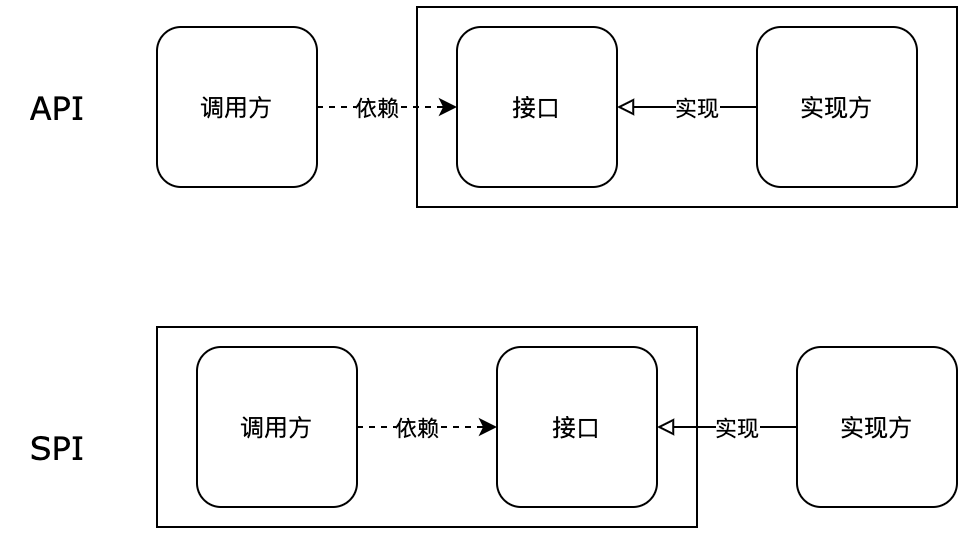
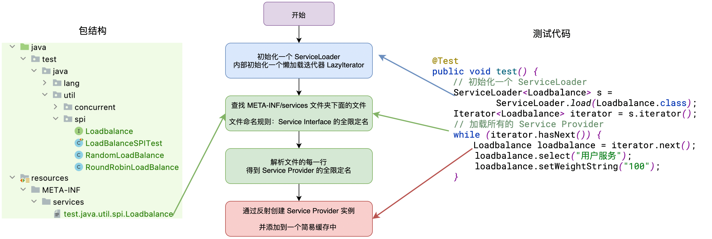
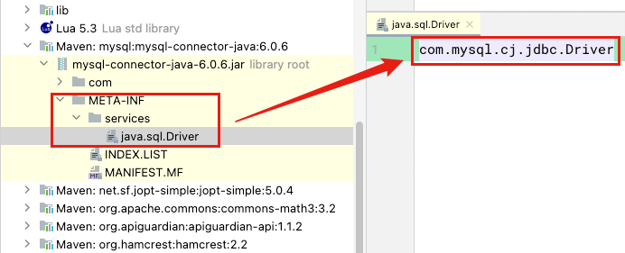
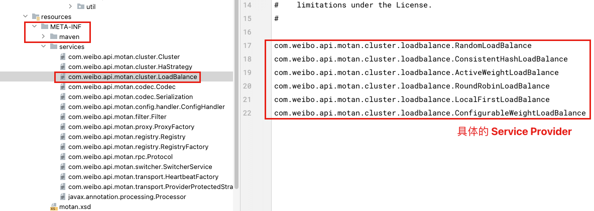

| 版本 | 内容 | 时间                   |
| ---- | ---- | ---------------------- |
| V1   | 新建 | 2023年07月11日19:29:22 |

## 什么是 SPI？和 API 的比较？

SPI 即 Service Provider Interface。

面向的对象的设计里，我们一般推荐模块之间基于接口编程，模块之间不对实现类进行硬编码。一旦代码里涉及具体的实现类，就违反了**可拔插的原则**，如果需要替换一种实现，就需要修改代码。为了实现在模块装配的时候不用在程序里动态指明，这就需要一种服务发现机制。Java SPI 就是提供这样的一个机制：为某个接口寻找服务实现的机制。这有点类似 IOC 的思想，将装配的控制权移到了程序之外。



- API：当实现方提供了接口和实现，我们可以通过调用实现方的接口从而拥有实现方给我们提供的能力，这就是 API ，这种接口和实现都是放在实现方的；
- SPI：当接口存在于调用方这边时，调用方定义接口规则，不同的实现按照这个接口规则去实现，提供各种的服务；

有很多开源框架都涉及到了 SPI 技术，例如 JDBC 的数据驱动、Motan 和 Dubbo 扩展的 SPI 机制、Spring 的 SPI 机制、日志框架中的 SPI 机制。

## JDK 的 SPI 使用案例

JDK 自带 SPI 的实现，就是通过 ServiceLoader 类来实现的，先看一个简单案例。假如我们需要实现集群中的负载均衡机制，目前有随机和轮询两种机制。

先看下我电脑上这个案例的整个文件结构：

```
├── java
│   └── test
│       └── java
│           └── util
│               └── spi
│                   ├── LoadBalanceSPITest.java
│                   ├── Loadbalance.java
│                   ├── RandomLoadBalance.java
│                   └── RoundRobinLoadBalance.java
└── resources
    └── META-INF
        └── services
            └── test.java.util.spi.Loadbalance
```

第一步：定义一下负载均衡的接口和这两个实现

```java
public interface Loadbalance {
    /* 选择一个服务 */
    String select(String request);

    /* 设置权重 */
    void setWeightString(String weightString);
}

public class RandomLoadBalance implements Loadbalance{
    @Override
    public String select(String request) {
        System.out.println("随机机制 需要一个服务: " + request);
        return null;
    }

    @Override
    public void setWeightString(String weightString) {
        System.out.println("随机机制 设置权重: " + weightString);
    }
}

public class RoundRobinLoadBalance implements Loadbalance{
    @Override
    public String select(String request) {
        System.out.println("轮询机制 需要一个服务: " + request);
        return null;
    }

    @Override
    public void setWeightString(String weightString) {
        System.out.println("轮询机制 设置权重: " + weightString);
    }
}
```

第二步：在 resource 文件夹中创建一个 `/META-INF/services` 文件夹，然后创建一个名称为 Loadbalance 接口的全限定名的文件，这里我的 Loadbalance 全限定名是 test.java.util.spi.Loadbalance，我创建的文件名就是这个。文件内容就是我们的接口实现的全限定名了，就是例子中的 RandomLoadBalance 和 RoundRobinLoadBalance 的全限定名。

这里我创建的文件名是 test.java.util.spi.Loadbalance，文件内容入下：

```
test.java.util.spi.RandomLoadBalance
test.java.util.spi.RoundRobinLoadBalance
```

第三步：创建测试类，测试 JDK 自带的 SPI 机制

```java
public class LoadBalanceSPITest {
    @Test
    public void test() {
        // 初始化一个 ServiceLoader
        ServiceLoader<Loadbalance> s = ServiceLoader.load(Loadbalance.class);
        Iterator<Loadbalance> iterator = s.iterator();
        // 加载所有的 Service Provider
        while (iterator.hasNext()) {
            Loadbalance loadbalance = iterator.next();
            loadbalance.select("用户服务");
            loadbalance.setWeightString("100");
        }
    }
}
```

打印控制台如下：

```
随机机制 需要一个服务: 用户服务
随机机制 设置权重: 100
轮询机制 需要一个服务: 用户服务
轮询机制 设置权重: 100
```

可以看到我们在 `/META-INF/services`  文件夹中的文件中填了两个 LoadBalance 的实现的全限定名，在测试类中就能获取到对应的实现类的对象，并调用它的方法实现。

## JDK 的 SPI 机制源码分析

为什么要在 resource 的  `/META-INF/services`   文件夹下面创建文件呢？其实这个路径是 JDK 的 ServiceLoader 类源码中写死的，如下：

```java
private static final String PREFIX = "META-INF/services/";
```

这里我们分析下 ServiceLoader 实现 SPI 的机制，也就是分析上面的案例的代码是如何得到实现类对象的，案例测试代码如下：

```java
@Test
public void test() {
    // 初始化一个 ServiceLoader
    ServiceLoader<Loadbalance> s = ServiceLoader.load(Loadbalance.class);
    Iterator<Loadbalance> iterator = s.iterator();
    // 加载所有的 Service Provider
    while (iterator.hasNext()) {
        Loadbalance loadbalance = iterator.next();
        loadbalance.select("用户服务");
        loadbalance.setWeightString("100");
    }
}
```

老样子先看一下整体的流程图：



第一步：调用 java.util.ServiceLoader#load(Class) 方法获取一个 ServiceLoader 对象，这一步没有做什么特殊处理，就是初始化一个 ServiceLoader 实例，并且初始化了一个延迟加载 Service 的迭代器 lookupIterator。

```java
private ServiceLoader(Class<S> svc, ClassLoader cl) {
    service = Objects.requireNonNull(svc, "Service interface cannot be null");
    loader = (cl == null) ? ClassLoader.getSystemClassLoader() : cl;
    acc = (System.getSecurityManager() != null) ? AccessController.getContext() : null;
    reload();
}

public void reload() {
    providers.clear();
    // 创建一个懒加载用的迭代器
    lookupIterator = new LazyIterator(service, loader);
}
```

第二步：调用迭代器的 hasNext() 方法查看是否有 Service 实现可以获取，第一次获取会去前面说的延迟加载的迭代器 lookupIterator 中去尝试获取 Service 实现，最后会调用 java.util.ServiceLoader.LazyIterator#hasNextService 方法

```java
/* 是否有更多的 service */
private boolean hasNextService() {
    if (nextName != null) {
        return true;
    }
    if (configs == null) {
        try {
            // PREFIX = "META-INF/services/"
            String fullName = PREFIX + service.getName();
            if (loader == null)
                configs = ClassLoader.getSystemResources(fullName);
            else
                configs = loader.getResources(fullName);
        } catch (IOException x) {
            fail(service, "Error locating configuration files", x);
        }
    }
    while ((pending == null) || !pending.hasNext()) {
        if (!configs.hasMoreElements()) {
            return false;
        }
        pending = parse(service, configs.nextElement());
    }
    nextName = pending.next();
    return true;
}
```

上面 java.util.ServiceLoader.LazyIterator#hasNextService 方法的关键部分就是获取文件路径，也就是 `String fullName = PREFIX + service.getName();`，然后通过加载器去加载这个资源，最后调用 java.util.ServiceLoader#parse 方法去解析这个文件里面的内容，也就是我们写在里面的 Service 的实现类的全限定名称。该 parse 方法的实现如下

```java
private Iterator<String> parse(Class<?> service, URL u)
    throws ServiceConfigurationError
{
    InputStream in = null;
    BufferedReader r = null;
    ArrayList<String> names = new ArrayList<>();
    try {
        in = u.openStream();
        r = new BufferedReader(new InputStreamReader(in, "utf-8"));
        int lc = 1;
        while ((lc = parseLine(service, u, r, lc, names)) >= 0);
    } catch (IOException x) {
        fail(service, "Error reading configuration file", x);
    } finally {
       // ...... 省略关流处理 ......
    }
    return names.iterator();
}
```

这个方法的作用就是，没解析一行就去尝试将解析出来的 Service 实现类的全限定名存到 names 集合里面去。

第三步：调用迭代器的 next() 方法获取 Service 实现类的实例，ServiceLoader 中有缓存机制，这里就不分析它的缓存机制了。如果 Service 实现类的实例还没有创建，就会去调用 java.util.ServiceLoader.LazyIterator#nextService 去实例化 Service 实现类。

```java
private S nextService() {
    if (!hasNextService())
        throw new NoSuchElementException();
    String cn = nextName;
    nextName = null;
    Class<?> c = null;
    try {
        c = Class.forName(cn, false, loader);
    } catch (ClassNotFoundException x) {
        // ...... 省略异常处理 ......
    }
    if (!service.isAssignableFrom(c)) {
        // ...... 省略异常处理 ......
    }
    try {
        S p = service.cast(c.newInstance());
        providers.put(cn, p);
        return p;
    } catch (Throwable x) {
       // ...... 省略异常处理 ......
    }
    throw new Error();          // This cannot happen
}
```

其实就是通过反射去创建 Service 的实现类了。

## JDBC 的 SPI 机制的体现

首先看一下 JDBC 获取 MySQL 数据库的连接的原生代码

```java
@Test
public void testJDBC() throws SQLException {
    String url = "jdbc:mysql://127.0.0.1:3306/dbname?autoReconnect=true";
    String userId = "root";
    String passwd = "123456";
    Connection connection = DriverManager.getConnection(url, userId, passwd);
    System.out.println(connection);
}
```

首先丢出个疑问 Connection 和 DriverManager 都是 JDK 的接口，这里为什么能获取 MySQL 数据库的连接呢？

这里其实就是使用的 JDK 的 SPI 机制，java.sql.DriverManager 中有个静态代码块，主要调用 java.sql.DriverManager#loadInitialDrivers 方法去加载驱动 java.sql.Driver。

```java
static {
    loadInitialDrivers();
    println("JDBC DriverManager initialized");
}
```

 在 java.sql.DriverManager#loadInitialDrivers 中又看到了熟悉的 ServiceLoader 了，这里其实就是去查找 `META-INF/services/` 文件夹下面有没有文件名是 java.sql.Driver 的文件，然后调用 driversIterator 迭代器的 next() 方法去反射创建 mysql-connector 中的 java.sql.Driver 的实现类了。

```java
private static void loadInitialDrivers() {
    // 省略通过系统属性获取的方式的代码 System.getProperty("jdbc.drivers")
    AccessController.doPrivileged(new PrivilegedAction<Void>() {
        public Void run() {
            ServiceLoader<Driver> loadedDrivers = ServiceLoader.load(Driver.class);
            Iterator<Driver> driversIterator = loadedDrivers.iterator();

            try{
                while(driversIterator.hasNext()) {
                    driversIterator.next();
                }
            } catch(Throwable t) {
            // Do nothing
            }
            return null;
        }
    });

    // 省略通过系统属性获取的方式的代码 System.getProperty("jdbc.drivers")
}
```

mysql-connector-java-6.0.6.jar 的包结构如下，可以看到就是有个 `META-INF/services/` 文件夹，下面有一个文件名为 java.sql.Driver 的文件



 在知道 MySQL 实现的 java.sql.Driver 是如何初始化的之后，在 MySQL 的实现的 com.mysql.cj.jdbc.Driver 类中，有个静态代码块，会将自己注册到 java.sql.DriverManager 的一个 Map 中，这样就可以通过 java.sql.DriverManager#getConnection 相关方法获取对应的数据库的连接了。

```java
// MySQL 的实现的 com.mysql.cj.jdbc.Driver 类
public class Driver extends NonRegisteringDriver implements java.sql.Driver {
    public Driver() throws SQLException {
    }

    static {
        try {
            DriverManager.registerDriver(new Driver());
        } catch (SQLException var1) {
            throw new RuntimeException("Can't register driver!");
        }
    }
}
```

## Motan/Dubbo 中的 SPI 机制的提现

以 Motan 为例分析，Motan 自己实现了类似 JDK 的 ServiceProvider 的 SPI 机制，在 JDK 的 SPI 机制上做了自己的扩展。

com.weibo.api.motan.core.extension.ExtensionLoader 类是 SPI 机制的核心，它支持 JDK ServiceProvider 和注解方式去配置 SPI，获取 Service 实现类的实例核心代码如下：

```java
public T getExtension(String name, boolean throwWhenNotFound) {
    checkInit();
    
    // ...... 省略异常处理 ......

    try {
        Spi spi = type.getAnnotation(Spi.class);

        if (spi.scope() == Scope.SINGLETON) {
            // 单例处理
            return getSingletonInstance(name, throwWhenNotFound);
        } else {
            // 获取保存的 name 对应类的 Class 文件
            Class<T> clz = extensionClasses.get(name);

            // ...... 省略异常处理 ......

            // 反射创建实例
            return clz.newInstance();
        }
    } catch (MotanFrameworkException mfe) {
        // ...... 省略异常处理 ......
    }

    return null;
}
```

简单看一下 motan-core 包下的 `META-INF/services/` 中有多少个 LoadBalance 的实现类。



关于 Motan、Dubbo 的 SPI 机制后面有机会再详细分析。

## SPI 小结

**SPI（Service Provider Interface）机制是一种用于实现松耦合、可扩展插件系统的机制。**它允许应用程序在运行时发现和加载实现某个特定服务接口的提供者。

JDK 的 SPI 机制由三个主要组成部分组成：

1. 服务接口（Service Interface）：定义了一个或多个服务提供者需要实现的接口。这个接口通常作为一个标准接口，应用程序可以通过它与各个服务提供者进行交互；
2. 服务提供者（Service Provider）：为每个服务提供者定义了一个接口。这个接口包含了服务提供者需要实现的方法；
3. 服务提供者配置文件（Service Provider Configuration File）：在 META-INF/services 目录下，以服务接口的全限定名命名的文本文件。该文件中的内容是服务提供者的实现类的全限定名，每行一个实现类；

JDK 的 ServiceLoader 类提供了 SPI 的一种实现。各种开源框架中也使用了 SPI 技术。例如例如 JDBC 的数据驱动、Motan 和 Dubbo 扩展的 SPI 机制、Spring 的 SPI 机制、日志框架中的 SPI 机制。
