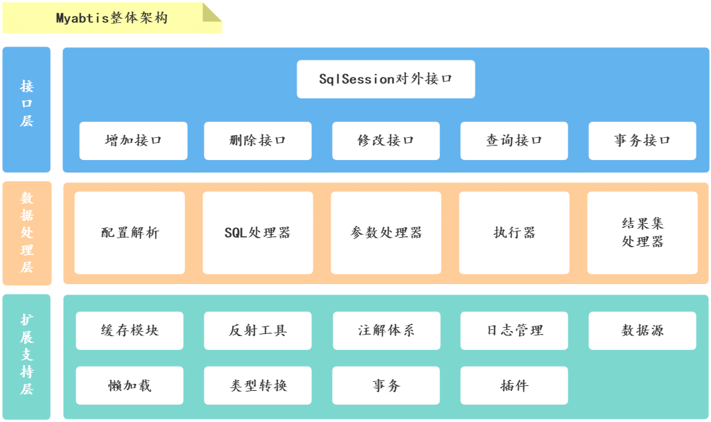
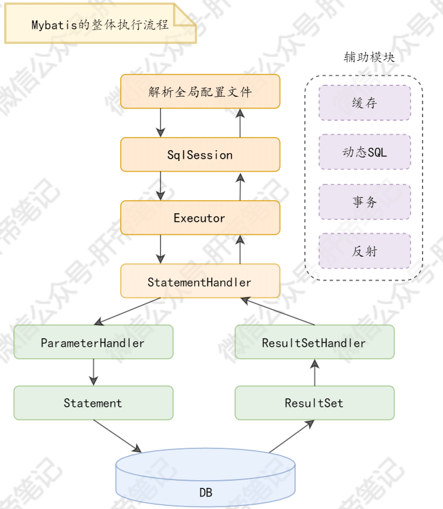

| 版本 | 内容     | 时间                 |
| ---- | -------- | -------------------- |
| V1   | 新增     | 2021年6月6日18:34:32 |
| V2   | 文案修改 | 2023年3月5日11:35:44 |

主要讲述 Mybatis 的整体架构，给出每个包的作用，并阐明本次源码阅读的顺序。

## Mybatis 整体架构

## Mybatis 各个包的作用

**基础功能包**：

1. exception：为 mybatis 提供了大部分异常类的父类和异常类的生产工厂；
2. reflection：为 myabtis 提供反射功能的 API，方便上层调用；
3. annotations：注解包，为 mybatis 增加了注解开发的功能；
4. lang：注解包，只有两个注解；
5. type：提供 JDBC 类型和 Java 类型转换的功能，提供了别名配置；
6. io：负责完成 mybatis 中对磁盘文件读操作；
7. logging：日志包，能够集成多种第三方日志框架；
8. parsing：xml 解析包；

**配置解析包**：

1. binding：处理 Java 方法和 SQL 语句之间的绑定关系；
2. builder：解析 xml 配置文件和映射文件，解析注解形式的 Mapper 声明；
3. mapping：此包有以下功能
   1. SQL 语句处理功能；
   2. 输出结果处理功能；
   3. 输入参数处理功能；
   4. 多数据库种类处理功能；
4. scripting：动态SQL；
5. datasource：完成数据源的获取、数据连接等工作；

**核心操作包**：

1. jdbc：提供数据库操作语句的执行能力和脚本执行能力；
2. cache：缓存包；
3. transaction：提供事务管理。一种基于 JDBC 的事务管理，另一种基于容器进行事务管理；
4. cursor：提供游标查询的功能；
5. executor：执行器包，用于处理 session 包的请求；
6. session：门面模式  提供一个统一的门面接口 API，使得系统更容易使用；
7. plugin：插件包；

## 此次源码阅读顺序

Mybatis 的主要作用就是简化传统的 JDBC的操作，也就是说 Mybatis 就是给 JDBC 操作封装好方便我们使用。

此次阅读Mybatis源码主要围绕 SQL 的执行流程，直接学习核心流程，然后再去学习核心流程牵扯到了那些技术要点。

在 SQL 执行流程中有四个重要的组件，这个四个组件分别是，执行器(Executor)、SQL 处理器(StatementHandler)、参数处理器(ParameterHandler)、结果集处理器(ResultSetHandler)。

