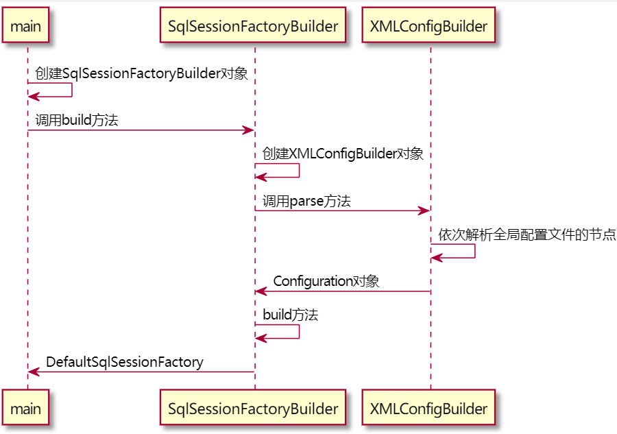

| 版本 | 内容 | 时间                 |
| ---- | ---- | -------------------- |
| V1   | 新建 | 2021年6月7日00:21:08 |

摘要：本篇主要讲解Mybatis的全局配置文件时如何解析的，在解析完配置文件后会得到一个默认的SqlSession工厂SqlSessionFactory对象。


在入门案例中我们得到SqlSession对象去调用它的API去完成数据库的操作，而SqlSession对象的创建时比较复杂的。

SqlSession及相关的类组成了一个链，先是SqlSessionFactoryBuilder生成SqlSessionFactory，然后SqlSessionFactory生成SqlSession。

那我们首先看SqlSessionFactoryBuilder类。

```java
// 1. 读取核心配置文件SqlMapConfig.xml
InputStream is = Resources.getResourceAsStream("mybatis.xml");
// 2. 创建SqlSessionFactoryBuilder构造者对象
SqlSessionFactoryBuilder builder = new SqlSessionFactoryBuilder();
// 3. 使用构造者builder，根据配置文件的信息is，构造一个SqlSessionFactory工厂对象
SqlSessionFactory factory = builder.build(is);
// 4. 使用工厂对象factory，生产一个SqlSession对象
SqlSession session = factory.openSession();
```

先看下解析全局配置文件的时序图，有个印象，本篇看完后回过头来再看就有收获了。



## SqlSessionFactoryBuilder

SqlSessionFactoryBuilder类是SqlSessionFactory类的建造者类，里面有很多重载的build方法，都是用来创建SqlSessionFactory对象的，里面有两个核心的build方法，但是这两个方法代码基本相同，拿一个出来如下

```java
/**
 * 建造一个SqlSessionFactory对象
 *
 * @param reader 读取字符流的抽象类
 * @param environment 环境信息
 * @param properties 配置信息
 * @return SqlSessionFactory对象
 */
public SqlSessionFactory build(Reader reader, String environment, Properties properties) {
    try {
        // 根据传入的配置文件，创建一个XMLConfigBuilder类
        XMLConfigBuilder parser = new XMLConfigBuilder(reader, environment, properties);
        // 首先XMLConfigBuilder解析配置文件，得到配置文件对应的Configuration对象
        // 根据Configuration对象，调用build方法，获得一个DefaultSqlSessionFactory
        return build(parser.parse());
    } catch (Exception e) {
        throw ExceptionFactory.wrapException("Error building SqlSession.", e);
    } finally {
        ErrorContext.instance().reset();
        try {
            reader.close();
        } catch (IOException e) {
            // Intentionally ignore. Prefer previous error.
        }
    }
}
```

上面解析得到Configuration对象对象后，会调用一个build方法得到一个默认的DefaultSqlSessionFactory，如下：

```java
/**
 * 根据配置信息建造一个SqlSessionFactory对象
 *
 * @param config 配置信息
 * @return SqlSessionFactory对象 总是DefaultSqlSessionFactory对象
 */
public SqlSessionFactory build(Configuration config) {
    return new DefaultSqlSessionFactory(config);
}
```


小结：

SqlSessionFactory对象的创建主要有以下步骤：

1. **首先根据传入的配置文件，创建一个XMLConfigBuilder类，为后续的配置文件的解析做准备。**
2. **调用XMLConfigBuilder对象的parse()方法对配置文件进行解析，得到一个Configuration对象。**
3. **调用SqlSessionFactoryBuilder的build方法，传入解析好的Configuration得到一个DefaultSqlSessionFactory。**

## 创建XMLConfigBuilder

在讲解XMLConfigBuilder类之前，先简单分析下整个Builder的结构。

**虽然BaseBuilder类是抽象类，但是BaseBuilder类中并没有抽象方法**。它的各个子类的功能都不同，例如本篇要分析的XMLConfigBuilder就是用来解析全局配置文件的，而XMLMapperBuilder是用来解析Mapper映射文件的，等等。


XMLConfigBuilder类继承自BaseBuilder基类，从XMLConfigBuilder类的名字就可以看出它时候用来解析配置文件的。

XMLConfigBuilder的字段如下：

```java
// 存储是否已经对config文件完成解析
private boolean parsed;
// 解析器
private final XPathParser parser;
// 要读取哪一个Environment节点，这里存储节点名
private String environment;
// 反射工厂
private final ReflectorFactory localReflectorFactory = new DefaultReflectorFactory();
```

还有继承BaseBuilder的一些字段

```java
// 全局配置类
protected final Configuration configuration;
// 类型别名注册表
protected final TypeAliasRegistry typeAliasRegistry;
// 类型处理器注册表
protected final TypeHandlerRegistry typeHandlerRegistry;
```

在SqlSessionFactoryBuilder类中调用了下面的方法来创建XMLConfigBuilder对象。

```java
XMLConfigBuilder parser = new XMLConfigBuilder(reader, environment, properties);
```

依次会调用下面两个构造方法：

```java
public XMLConfigBuilder(Reader reader, String environment, Properties props) {
    this(new XPathParser(reader, true, props, new XMLMapperEntityResolver()), environment, props);
}

private XMLConfigBuilder(XPathParser parser, String environment, Properties props) {
    super(new Configuration()); // 调用父类的构造方法赋值
    ErrorContext.instance().resource("SQL Mapper Configuration");
    this.configuration.setVariables(props); // 设置参数
    this.parsed = false; // parsed对象表示是否已经对配置文件解析过
    this.environment = environment; // 环境相关
    this.parser = parser;
}
```

这样XMLConfigBuilder就创建成功了，先不用管其它字段有什么用，先混个眼熟，主流程为主。

## XMLConfigBuilder的parse方法

在得到XMLConfigBuilder对象后，**直接调用其它的`parse()`方法去解析配置文件**。

XMLConfigBuilder的**parsed字段是为了防止Mybatis重复解析配置文件**。

```java
/**
 * 解析配置文件的入口方法
 *
 * @return Configuration对象
 */
public Configuration parse() {
    // 不允许重复解析
    if (parsed) {
        throw new BuilderException("Each XMLConfigBuilder can only be used once.");
    }
    // 标志已经解析过配置文件
    parsed = true;
    // 从根节点开展解析
    parseConfiguration(parser.evalNode("/configuration"));
    return configuration;
}
```

解析配置文件的重点来了，就是上面的`parseConfiguration(XNode)`方法。Myabtis规定配置文件的根标签是`<configuration>`，所以上面的`parser.evalNode("/configuration")`，**表示从根节点开始解析**。

在看下`parseConfiguration(XNode)`方法之前，我们看下Mybatis的配置文件能够配置那些东西，就是根节点`<configuration>`下面有那些允许的子节点：

**Mybatis的配置文件的结构如下**：

```
configuration（配置）
	properties（属性）
	settings（设置）
	typeAliases（类型别名）
	typeHandlers（类型处理器）
	objectFactory（对象工厂）
	plugins（插件）
	environments（环境配置）
		environment（环境变量）
			transactionManager（事务管理器）
			dataSource（数据源）
    databaseIdProvider（数据库厂商标识）
	mappers（映射器）
```

看了Myabtis配置文件的结构之后再看`parseConfiguration(XNode)`方法就很明了了，就是挨个节点去解析而已。

```java
/**
 * 从根节点configuration开始解析下层节点
 *
 * @param root 根节点configuration节点
 */
private void parseConfiguration(XNode root) {
    try {
        // 解析信息放入Configuration
        // 首先解析properties，以保证在解析其他节点时便可以生效
        // issue #117 read properties first
        // 解析properties属性
        propertiesElement(root.evalNode("properties"));
        // 解析setting
        Properties settings = settingsAsProperties(root.evalNode("settings"));
        // 解析我们配置指定的 VFS 的实现
        loadCustomVfs(settings);
        // 指定 MyBatis 所用日志的具体实现，未指定时将自动查找
        loadCustomLogImpl(settings);
        // 解析类型别名
        typeAliasesElement(root.evalNode("typeAliases"));
        // 解析插件
        pluginElement(root.evalNode("plugins"));
        // 解析对象工厂
        objectFactoryElement(root.evalNode("objectFactory"));
        objectWrapperFactoryElement(root.evalNode("objectWrapperFactory"));
        reflectorFactoryElement(root.evalNode("reflectorFactory"));
        // 设置上面解析出来的settings的信息到configuration中
        settingsElement(settings);
        // read it after objectFactory and objectWrapperFactory issue #631
        // 解析环境
        environmentsElement(root.evalNode("environments"));
        // 解析数据库厂商标识
        databaseIdProviderElement(root.evalNode("databaseIdProvider"));
        // 解析类型处理器
        typeHandlerElement(root.evalNode("typeHandlers"));
        // 解析映射器
        mapperElement(root.evalNode("mappers"));
    } catch (Exception e) {
        throw new BuilderException("Error parsing SQL Mapper Configuration. Cause: " + e, e);
    }
}
```

上面这么多解析节点的方法，拿出几个来讲

1. 解析properties节点。
2. 解析setting节点。
3. 解析mapper节点。（本篇不介绍，内容很多，后面再分析）

### 解析properties节点

首先看下` propertiesElement(root.evalNode("properties"));`，这个主要是用来解析properties节点的信息。

```java
private void propertiesElement(XNode context) throws Exception {
  if (context != null) {
    // 获得配置的Properties属性
    Properties defaults = context.getChildrenAsProperties();
    String resource = context.getStringAttribute("resource");
    String url = context.getStringAttribute("url");
     // 只允许resource和url同时存在一个
    if (resource != null && url != null) {
      throw new BuilderException("The properties element cannot specify both a URL and a resource based property file reference.  Please specify one or the other.");
    }
    if (resource != null) {
      // 读取resource配置的Properties属性，假如同名的话就会覆盖
      defaults.putAll(Resources.getResourceAsProperties(resource));
    } else if (url != null) {
      // 读取url配置的Properties属性，假如同名的话就会覆盖
      defaults.putAll(Resources.getUrlAsProperties(url));
    }
    Properties vars = configuration.getVariables();
    if (vars != null) {
      defaults.putAll(vars);
    }
    parser.setVariables(defaults);
    configuration.setVariables(defaults);
  }
}
```

从上面的源码可以很容易看到，如果一个属性在不只一个地方进行了配置，那么，MyBatis 将按照下面的顺序来加载：

- 首先读取在 properties 元素体内指定的属性。
- 然后根据 properties 元素中的 resource 属性读取类路径下属性文件，或根据 url 属性指定的路径读取属性文件，并覆盖之前读取过的同名属性。
- 最后读取作为方法参数传递的属性，并覆盖之前读取过的同名属性。

因此，**通过方法参数传递的属性具有最高优先级，resource/url 属性中指定的配置文件次之，最低优先级的则是 properties 元素中指定的属性**。

**需要注意的是，把解析properties属性放在首位的原因是，先解析properties属性可以方便后续解析其他节点的时候这些properties属性可以被使用。**

### 解析setting节点

```java
private Properties settingsAsProperties(XNode context) {
    if (context == null) {
        return new Properties();
    }
    // 读取setting的子节点的信息为Properties
    Properties props = context.getChildrenAsProperties();
    // Check that all settings are known to the configuration class
    // 下面的操作就是为了检查setting中的配置是否存在
    // 就是判断Configuration类中是否有对应的setter方法
    MetaClass metaConfig = MetaClass.forClass(Configuration.class, localReflectorFactory);
    for (Object key : props.keySet()) {
        if (!metaConfig.hasSetter(String.valueOf(key))) {
            // 大小写敏感
            throw new BuilderException("The setting " + key + " is not known.  Make sure you spelled it correctly (case sensitive).");
        }
    }
    return props;
}
```

关于解析setting节点需要注意的是，我们必须把我们要设置的属性名字写对，不能瞎写，瞎写Mybatis不认识也是白搭，会直接报错。

Mybatis中有个核心配置类`Configuration`类，里面有很多属性可以配置，判断配置文件中的setting标签的属性是否写对就是判断`Configuration`类中是否有对应的setter方法而已。

在解析setting得到一个Properties之后，会调用`settingsElement(settings);`方法设置到`configuration`属性中，当遇到没有setting标签没有配置时，会给出一个默认值。

给出部分代码上来：

```java
private void settingsElement(Properties props) {
	// 省略部分...
    configuration.setCacheEnabled(booleanValueOf(props.getProperty("cacheEnabled"), true));
    configuration.setProxyFactory((ProxyFactory) createInstance(props.getProperty("proxyFactory")));
    // 省略部分...
}
```

### 其他配置解析

最后的解析mapper节点的内容比较多，本篇不介绍，后续再说。

关于其他配置，大家自己去看，都是很简单的操作，最后将解析出来的信息设置到Configuration全局配置类中。

## 获取SqlSessionFactory工厂 

在得到Configuration对象后，调用SqlSessionFactoryBuilder的build方法得到默认的DefaultSqlSessionFactory。

```java
/**
 * 根据配置信息建造一个SqlSessionFactory对象
 *
 * @param config 配置信息
 * @return SqlSessionFactory对象 总是DefaultSqlSessionFactory对象
 */
public SqlSessionFactory build(Configuration config) {
    return new DefaultSqlSessionFactory(config);
}
```

好了，此处讲到解析配置文件得到SqlSessionFactory工厂，那么Mybatis的配置文件到这里基本讲了个大概。

## 小结

总结一下是如何得到DefaultSqlSessionFactory对象的。

1. 创建SqlSessionFactoryBuilder建造者对象。
2. 调用SqlSessionFactoryBuilder的build方法
3. 在SqlSessionFactoryBuilder的build方法内，会创建专门用于解析去全局配置文件的XMLConfigBuilder对象。
4. 创建好XMLConfigBuilder对象后，会调用该对象的parse方法挨个解析全局配置文件的节点，最终都会把解析的信息设置到全局配置类Configuration中。
5. 在得到Configuration的对象后，调用build的一个重载方法后，得到一个默认的DefaultSqlSessionFactory工厂对象。