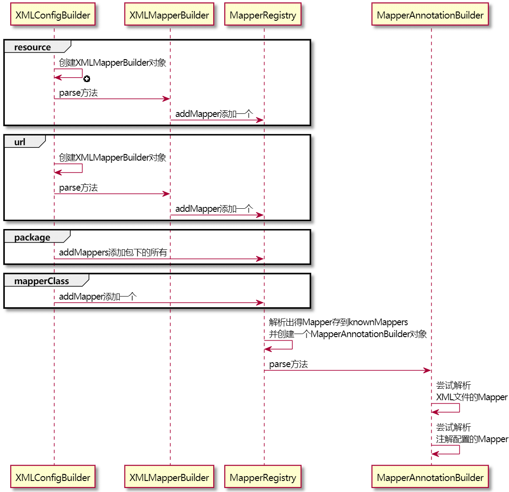

| 版本 | 内容 | 时间                 |
| ---- | ---- | -------------------- |
| V1   | 新建 | 2021年6月2日22:55:41 |

摘要：本篇主要分析Mapper映射文件是如何解析的，主要分析解析出来的Mapper的XML文件和Mapper接口是如何对应的，内部的方法解析暂时不分析，下一篇分析。


在解析配置文件的`parseConfiguration(XNode)`方法中有如下方法，是用来解析我们编写的Mapper映射文件的

```java
mapperElement(root.evalNode("mappers")); // 解析映射器
```

这篇文章看它是如何解析的。



## 解析mapper节点

在配置文件中，有几种方法配置mapper节点，如下：

```xml
<!-- 使用相对于类路径的资源引用 -->
<mappers>
  <mapper resource="cn/guosgbin/mybatis/example/mapper/UserMapper.xml"/>
</mappers>

<!-- 使用完全限定资源定位符（URL） -->
<mappers>
  <mapper url="file:///cn/guosgbin/mybatis/example/mapper/UserMapper.xml"/>
</mappers>

<!-- 使用映射器接口实现类的完全限定类名 -->
<mappers>
  <mapper class="cn.guosgbin.mybatis.example.mapper.UserMapper"/>
</mappers>


<!-- 将包内的映射器接口实现全部注册为映射器 -->
<mappers>
  <package name="cn.guosgbin.mybatis.example.mapper"/>
</mappers>
```

在配置完上面的mapper节点后，Mybatis就会去指定的位置去找映射文件了。

解析mapper节点的源码：

```java
/**
 * 解析mappers节点
 * <mappers>
 *    <mapper resource="cn/guosgbin/mybatis/example/mapper/UserMapper.xml"/>
 *    <package name="cn.guosgbin.mybatis.example.mapper" />
 * </mappers>
 *
 * @param parent mappers节点
 * @throws Exception
 */
private void mapperElement(XNode parent) throws Exception {
  if (parent != null) {
    // 处理mappers的子节点，即mapper节点或者package节点
    for (XNode child : parent.getChildren()) {
      if ("package".equals(child.getName())) { // 处理包下的mapper
        // 取出包的路径
        String mapperPackage = child.getStringAttribute("name");
        // 全部加入Mappers中
        configuration.addMappers(mapperPackage);
      } else { // 不是包扫描
        // resource、url、class这三个属性只有一个生效
        String resource = child.getStringAttribute("resource");
        String url = child.getStringAttribute("url");
        String mapperClass = child.getStringAttribute("class");
        if (resource != null && url == null && mapperClass == null) { // resource生效
          ErrorContext.instance().resource(resource);
          // 获取文件的输入流
          try(InputStream inputStream = Resources.getResourceAsStream(resource)) {
            // 使用XMLMapperBuilder解析Mapper文件
            XMLMapperBuilder mapperParser = new XMLMapperBuilder(inputStream, configuration, resource, configuration.getSqlFragments());
            mapperParser.parse();
          }
        } else if (resource == null && url != null && mapperClass == null) { // url生效
          ErrorContext.instance().resource(url);
          // 从网络获得输入流
          try(InputStream inputStream = Resources.getUrlAsStream(url)){
            // 使用XMLMapperBuilder解析Mapper文件
            XMLMapperBuilder mapperParser = new XMLMapperBuilder(inputStream, configuration, url, configuration.getSqlFragments());
            mapperParser.parse();
          }
        } else if (resource == null && url == null && mapperClass != null) { // mapperClass生效
          // 配置的不是Mapper文件，而是Mapper接口
          Class<?> mapperInterface = Resources.classForName(mapperClass);
          configuration.addMapper(mapperInterface);
        } else {
          throw new BuilderException("A mapper element may only specify a url, resource or class, but not more than one.");
        }
      }
    }
  }
}
```

上面的源码很明了，**先会去判断是否是配置package包的方式配置解析mapper的**

1、假如是，则**会去扫描包下面的所有的mapper接口存入到Configuration对象的MapperRegistry属性中，其实就是存在MapperRegistry的knownMappers字段中。**

```java
public class MapperRegistry {

    private final Configuration config;

    /**
     * 已知的所有映射
     *  key:mapperInterface,即dao的数据库（映射）接口，不是方法
     *  value:MapperProxyFactory,即映射器代理工厂
     */
    private final Map<Class<?>, MapperProxyFactory<?>> knownMappers = new HashMap<>();

    // ...
}
```

2、**假如不是配置package包的方式，则就是resource、url、class这三种了，当然这三种最多只能配置一种，否则会抛出异常。**

在resource、url这两种配置方式时，会调用XMLMapperBuilder方法的`parse()`方法去解析mapper文件。


分析一下这几种情况是如何解析的。

先要知道解析出来Mapper信息会存到Configuration类的MapperRegistry类型的knownMappers属性中，它是一个Map集合。

1. 包扫描的方式：首先会通过Myabtis的ResolverUtil工具类得到包下所有的类的Set集合。然后依次调用`addMapper(Class)`方法去添加到knownMappers属性中。
2. resource方式：使用XMLMapperBuilder去解析mapper，最终会设置到knownMappers属性中。
3. url方式：使用XMLMapperBuilder去解析mapper，最终会设置到knownMappers属性中。
4. class方式：直接调用`addMapper(Class)`方法设置到knownMappers属性中。

上面四种方式，其实最终都会调用一个`addMapper(Class<T> type)`方法，后面分析。

## XMLMapperBuilder

XMLMapperBuilder类是专门用来解析Mapper映射文件的，前面看过解析全局配置文件的XMLConfigBuilder类，它们都有共同的基类BaseBuilder，这是建造者模式的应用。

再看XMLMapperBuilder类的解析源码之前，回顾一下mapper的xml文件长什么样子

```xml
<?xml version="1.0" encoding="utf-8"?>
<!DOCTYPE mapper
        PUBLIC "-//mybatis.org//DTD Mapper 3.0//EN"
        "http://mybatis.org/dtd/mybatis-3-mapper.dtd">
<!--namespace：给哪个接口配置的映射，写接口的全限定类名-->
<mapper namespace="cn.guosgbin.mybatis.example.mapper.UserMapper">

    <cache/>

    <!--select标签：表示要执行查询语句； id：给接口里哪个方法配置的，写方法名；resultType：结果集封装类型-->
    <select id="list" resultType="cn.guosgbin.mybatis.example.entity.User">
        select * from tb_user
    </select>

    <select id="selectById" resultType="cn.guosgbin.mybatis.example.entity.User"> <!--flushCache="true"-->
        <!-- 开启二级缓存 -->
        SELECT * FROM tb_user WHERE id = #{id}
    </select>
</mapper>
```

可以看到，Mapper的映射文件的根节点是`<mapper>`，所以解析源码就从`<mapper>`节点开始解析。

```java
/**
 * 解析Mapper文件
 */
public void parse() {
    // 该节点是否被解析过
    if (!configuration.isResourceLoaded(resource)) {
        // 处理mapper节点
        configurationElement(parser.evalNode("/mapper"));
        // 加入到已经解析的列表，防止重复解析
        configuration.addLoadedResource(resource);
        // 将mapper注册给Configuration
        bindMapperForNamespace();
    }

    // 下面是用于处理暂时性错误的，例如一个节点引用的一个结点还未加载，这时就出现暂时性错误了
    // 下面分别用来处理失败的<resultMap>、<cache-ref>、SQL语句
    parsePendingResultMaps();
    parsePendingCacheRefs();
    parsePendingStatements();
}
```

**configuration对象中有一个存储已经解析好的mapper的Set集合**，所以在解析最开始的时候可以通过这个Set去校验当前resource或者url是否被解析过。

没有解析过的话，就会调用`configurationElement(parser.evalNode("/mapper"));`方法去解析映射文件的mapper节点的子节点。

```java
/**
 * 解析Mapper文件的子节点
 *
 * @param context Mapper文件的根节点
 */
private void configurationElement(XNode context) {
    try {
        // 获取当前Mapper映射文件的命名空间
        String namespace = context.getStringAttribute("namespace");
        if (namespace == null || namespace.isEmpty()) {
            throw new BuilderException("Mapper's namespace cannot be empty");
        }
        // 设置当前Mapper接口的命名空间
        builderAssistant.setCurrentNamespace(namespace);
        // mapper文件中其他配置节点的解析
        // 解析cache-ref标签
        cacheRefElement(context.evalNode("cache-ref"));
        // 解析cache标签
        cacheElement(context.evalNode("cache"));
        // 解析/mapper/parameterMap
        parameterMapElement(context.evalNodes("/mapper/parameterMap"));
        // 解析/mapper/resultMap 返回参数映射标签
        resultMapElements(context.evalNodes("/mapper/resultMap"));
        // 解析/mapper/sql 即SQL碎片标签
        sqlElement(context.evalNodes("/mapper/sql"));
        // 读取并处理各个数据库操作语句 各个标签
        buildStatementFromContext(context.evalNodes("select|insert|update|delete"));
    } catch (Exception e) {
        throw new BuilderException("Error parsing Mapper XML. The XML location is '" + resource + "'. Cause: " + e, e);
    }
}
```

本篇主要讲解解析的主流程，其他详细的后面再说。

当我们执行完`configurationElement`方法之后，就会调用`bindMapperForNamespace();`方法将mapper注册给Configuration。

```java
/**
 * 将mapper注册给Configuration
 */
private void bindMapperForNamespace() {
    // 获取当前xml的命名空间
    String namespace = builderAssistant.getCurrentNamespace();
    if (namespace != null) {
        Class<?> boundType = null;
        try {
            // 加载命名空间的类
            boundType = Resources.classForName(namespace);
        } catch (ClassNotFoundException e) {
            // ignore, bound type is not required
        }
        if (boundType != null && !configuration.hasMapper(boundType)) {
            // Spring may not know the real resource name so we set a flag
            // to prevent loading again this resource from the mapper interface
            // look at MapperAnnotationBuilder#loadXmlResource
            // 添加到mapper到configuration配置中去
            configuration.addLoadedResource("namespace:" + namespace);
            configuration.addMapper(boundType);
        }
    }
}
```

最终还是调用了`configuration.addMapper(boundType);`，将Mapper存到了configuration对象中的mapperRegistry属性中去了。


上面说过，上面配置Mapper映射文件位置的四种方式，其实最终都会调用一个`addMapper(Class<T> type)`方法，看一下它的源码：

```java
public <T> void addMapper(Class<T> type) {
    // 要加入的肯定是接口，否则不添加
    if (type.isInterface()) {
        // 加入的是接口
        if (hasMapper(type)) {
            // 如果添加重复，直接抛异常
            throw new BindingException("Type " + type + " is already known to the MapperRegistry.");
        }
        boolean loadCompleted = false;
        try {
            // 添加到knownMappers属性中
            knownMappers.put(type, new MapperProxyFactory<>(type));
            // It's important that the type is added before the parser is run
            // otherwise the binding may automatically be attempted by the
            // mapper parser. If the type is already known, it won't try.
            // 创建MapperAnnotationBuilder对象去解析
            MapperAnnotationBuilder parser = new MapperAnnotationBuilder(config, type);
            parser.parse();
            loadCompleted = true;
        } finally {
            // 假如解析失败，那就不添加了，移出去
            if (!loadCompleted) {
                knownMappers.remove(type);
            }
        }
    }
}
```

## MapperAnnotationBuilder

MapperAnnotationBuilder类其实也是一个建造者类，有可能会有疑问为什么不去继承BaseBuilder。

这是因为MapperAnnotationBuilder类压根就不需要BaseBuilder类提供的功能。。。

通过名字很容易就能看出，这是用来**解析注解形式配置映射的**。

上面的addMapper方法中，使用构造方法创建了一个MapperAnnotationBuilder对象。

```java
MapperAnnotationBuilder parser = new MapperAnnotationBuilder(config, type);
```

MapperAnnotationBuilder构造方法如下：

```java
public MapperAnnotationBuilder(Configuration configuration, Class<?> type) {
  // 把“.”换成“/”就从类名得到了Mapper的路径
  String resource = type.getName().replace('.', '/') + ".java (best guess)";
  this.assistant = new MapperBuilderAssistant(configuration, resource);
  this.configuration = configuration;
  this.type = type;
}
```

**构造方法中为什么要将点`.`替换为斜杠`/`呢？**

这是因为现在是解析基于注解来配置的映射，我们的包名是`.`来分割的，XML文件的路径是按照斜杠`/`来分割的，所以在这里替换一下，为后续做准备。

MapperAnnotationBuilder的`parse()`方法

```java
public void parse() {
    String resource = type.toString();
    // 防止重复解析 判断是否已经加载过了
    if (!configuration.isResourceLoaded(resource)) {
        // 寻找类名对应的resource路径下是否有xml配置，如果有则解析掉。这样就支持注解和xml混合使用
        loadXmlResource();
        // 记录资源路径
        configuration.addLoadedResource(resource);
        // 设置命名空间
        assistant.setCurrentNamespace(type.getName());
        // 处理缓存
        parseCache();
        parseCacheRef();
        for (Method method : type.getMethods()) {
            if (!canHaveStatement(method)) {
                continue;
            }
            if (getAnnotationWrapper(method, false, Select.class, SelectProvider.class).isPresent()
                && method.getAnnotation(ResultMap.class) == null) {
                parseResultMap(method);
            }
            try {
                // 解析该方法
                parseStatement(method);
            } catch (IncompleteElementException e) {
                // 解析异常的方法暂存起来
                configuration.addIncompleteMethod(new MethodResolver(this, method));
            }
        }
    }
    // 处理解析异常的方法
    parsePendingMethods();
}
```

在`parse()`方法中首先调用的`loadXmlResource()`方法是寻找类名对应的resource路径下是否有xml配置，如果有则解析掉，这样就支持注解和XML配置来混合使用了。

## 处理暂时性解析错误

**在XMLMapperBuilder类的`parse()`方法中最后有三个方法**，这三个方法用处很大。

```java
// 下面是用于处理暂时性错误的，例如一个节点引用的一个结点还未加载，这时就出现暂时性错误了
// 下面分别用来处理失败的<resultMap>、<cache-ref>、SQL语句
parsePendingResultMaps();
parsePendingCacheRefs();
parsePendingStatements();
```

在Mapper映射文件中，有些标签的上下位置可以随便写，比如`<resultMap>`等标签，但是由于xml文件的解析是从上往下的，可能我们读取到了地方引用了`<resultMap>`节点，但是这个`<resultMap>`节点还没有被解析到，这个时候就是解析不成功了，但是这也不是错误，只是暂时未解析成功而已。

所以这最后的三个方法就是**为了解决这些暂时性错误的**。

**同样的在MapperAnnotationBuilder的`parse()`方法中**，同样一个相同作用的`parsePendingMethods()`方法。

在Configuration类中有几个属性就是用来暂时保存这些暂时性的错误的

```java
// 暂存未处理完成的一些节点
protected final Collection<XMLStatementBuilder> incompleteStatements = new LinkedList<>();
protected final Collection<CacheRefResolver> incompleteCacheRefs = new LinkedList<>();
protected final Collection<ResultMapResolver> incompleteResultMaps = new LinkedList<>();
protected final Collection<MethodResolver> incompleteMethods = new LinkedList<>();
```

这种处理方式时，先第一此解析文件，把暂时解析失败的信息存起来，第二次再去解析就可以了。

## 小结

总结一下是解析Mapper映射文件的流程

1. 首先需要判断当前的`<mapper>`节点是何种方式配置的，每种方式配置的解析的方式并不一样。
2. 但是四种配置方式，其实最终调用的方法都是差不多的，`addMapper`方法添加Mapper信息到Configuration

类中，使用XMLMapperBuilder或者MapperAnnotationBuilder的`parse()`来解析Mapper映射文件。

