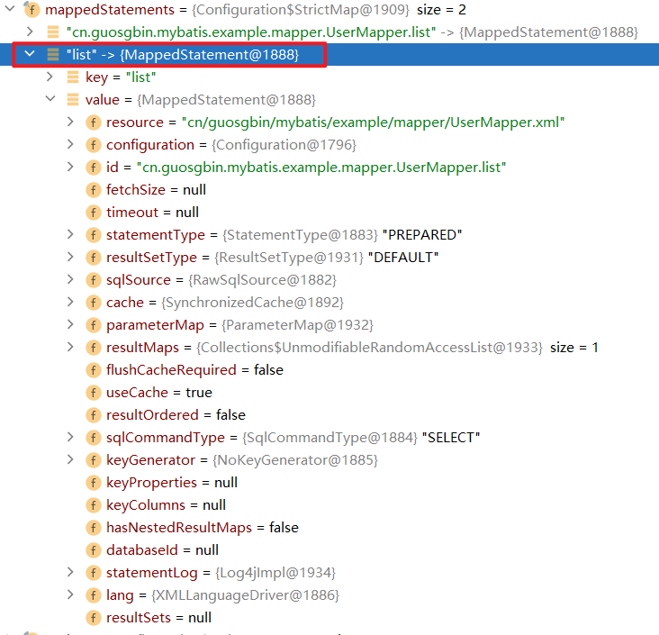
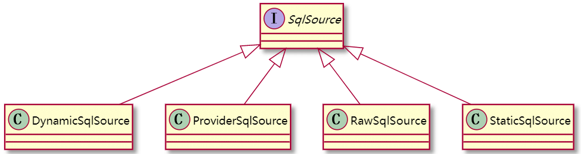
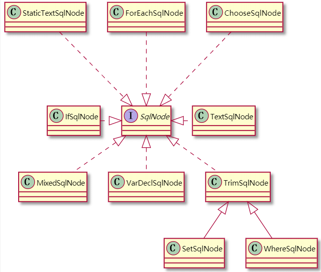
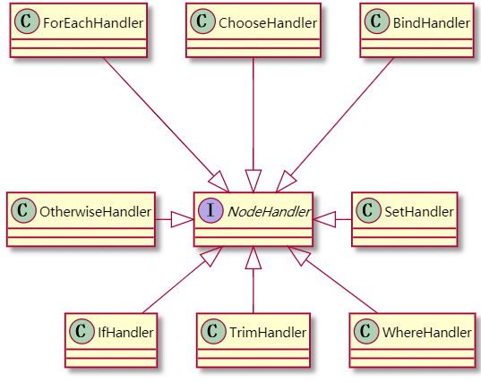
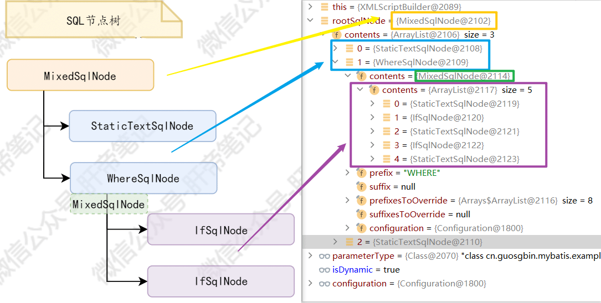
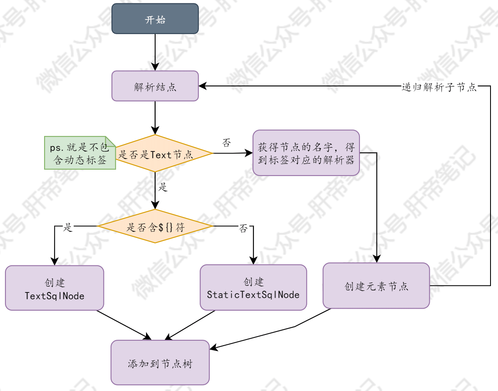

| 版本 | 内容 | 时间                 |
| ---- | ---- | -------------------- |
| V1   | 新建 | 2021年6月9日23:50:39 |

摘要：解析我们写的SQL脚本，构建一个节点树，获得SqlSource对象。


在看解析SQL语句的源码的时候，需要知道一些类。

## 准备知识

### MappedStatement

首先有一个很重要的MappedStatement类，它其实就是对应一个数据库操作节点，也就是SELECT、INSERT、UPDATE、DELETE这些。

例如有一个节点的操作如下：

```xml
<select id="list" resultType="cn.guosgbin.mybatis.example.entity.User">
    select * from tb_user
</select>
```

那么它解析出来的MappedStatement的对象就如下：



### SqlSource

这个类其实就是对应的数据库操作节点中我们手写的原始SQL，例如

```xml
SELECT * FROM tb_user WHERE id = #{id}
```

又或者：

```xml
SELECT * FROM tb_user
<where>
    <if test="user.name != null and user.name !=''">
        AND name = #{user.name}
    </if>
    <if test="user.age != null">
        AND age = #{user.age}
    </if>
</where>
```

需要注意的是第一个算是普通的SQL，第二个因为它带了`<if>`这种标签，所以它算是动态SQL，还有一个特别的情况是`${}`符号，它也算是动态SQL。


SqlSource是一个接口，就只有一个`getBoundSql()`抽象方法，下面是SqlSource的继承关系。



四种实现类作用和区别如下：

- **DynamicSqlSource**：动态的SQL语句，就是我们写的SQL中代用`<if>`这种标签或者含有`${}`符的SQl语句。
- **RawSqlSource**：原生的SQL语句，没有任何标签或者仅仅是`#{}`占位符的。
- **StaticSqlSource**：静态的SQL语句，也就是数据库能直接执行的语句，或者是有`?`占位符的SQL。
- ProviderSqlSource：注解得到的SQL语句。

因为DynamicSqlSource和RawSqlSource这两种SQL是不能直接交给数据库去执行的，最终是要**转换为StaticSqlSource**才能交给数据库去执行。

### BoundSql

这个类是由SqlSource对象得到的，具体包含数据库能够直接执行的SQL，和一些参数映射列表等。

```java
// 可能含有“?”占位符的sql语句
private final String sql;
// 参数映射列表
private final List<ParameterMapping> parameterMappings;
// 入参
private final Object parameterObject;
private final Map<String, Object> additionalParameters;
// additionalParameters的包装对象
private final MetaObject metaParameters;
```

### 动态标签SqlNode

我们知道，在Mybatis中支持很多动态标签，如下：

1. if
2. choose
3. when
4. otherwise
5. trim
6. where
7. set
8. foreach

Myabtis中有一个SqlNode接口代表动态标签，它有很多的子类，上面的那些动态标签都对应一个SqlNode的实现类。




### XMLScriptBuilder

XMLScriptBuilder是继承自BaseBuilder，很明显它是用来解析SQL脚本的。成员属性如下：

```java
// 当前要处理的XML节点
private final XNode context;
// 当前节点是否为动态节点
private boolean isDynamic;
// 输入参数的类型
private final Class<?> parameterType;
// 节点类型和对应的处理器组成的Map
private final Map<String, NodeHandler> nodeHandlerMap = new HashMap<>();
```

因为SQL脚本有很多动态的标签，最后有一个Map存放解析每种动态标签的处理器。


在XMLScriptBuilder中有一个NodeHandler接口，根据不同的标签有不同的实现，



每个NodeHandler都有自己的`handleNode()`方法，用于解析不同的动态节点。

在XMLScriptBuilder中会有一个Map来存储各个节点的NodeHandler实现。

```java
/**
 * 初始化 动态sql的节点的名称和对应的处理器
 */
private void initNodeHandlerMap() {
    nodeHandlerMap.put("trim", new TrimHandler());
    nodeHandlerMap.put("where", new WhereHandler());
    nodeHandlerMap.put("set", new SetHandler());
    nodeHandlerMap.put("foreach", new ForEachHandler());
    nodeHandlerMap.put("if", new IfHandler());
    nodeHandlerMap.put("choose", new ChooseHandler());
    nodeHandlerMap.put("when", new IfHandler());
    nodeHandlerMap.put("otherwise", new OtherwiseHandler());
    nodeHandlerMap.put("bind", new BindHandler());
}
```

### LanguageDriver

用于创建SqlSource对象和ParameterHandler对象。

```java
public interface LanguageDriver {

  /**
   * 创建参数处理器。参数处理器能将实参传递给JDBC statement。
   *
   * @author Frank D. Martinez [mnesarco]
   * @param mappedStatement The mapped statement that is being executed 完整的数据库操作节点
   * @param parameterObject The input parameter object (can be null) 参数对象
   * @param boundSql The resulting SQL once the dynamic language has been executed.数据库操作语句转化的BoundSql对象
   * @return the parameter handler 参数处理器
   * @see DefaultParameterHandler
   */
  ParameterHandler createParameterHandler(MappedStatement mappedStatement, Object parameterObject, BoundSql boundSql);

  /**
   * 创建SqlSource对象（基于映射文件的方式）。该方法在MyBatis启动阶段，读取映射接口或映射文件时被调用
   *
   * @param configuration The MyBatis configuration 配置信息
   * @param script XNode parsed from a XML file 映射文件中的数据库操作节点
   * @param parameterType input parameter type got from a mapper method or specified in the parameterType xml attribute. Can be null. 参数类型
   * @return the sql source SqlSource对象
   */
  SqlSource createSqlSource(Configuration configuration, XNode script, Class<?> parameterType);

  /**
   * 创建SqlSource对象（基于注解的方式）。该方法在MyBatis启动阶段，读取映射接口或映射文件时被调用
   *
   * @param configuration The MyBatis configuration 配置信息
   * @param script The content of the annotation 注解中的SQL字符串
   * @param parameterType input parameter type got from a mapper method or specified in the parameterType xml attribute. Can be null. 参数类型
   * @return the sql source  SqlSource对象，具体来说是DynamicSqlSource和RawSqlSource中的一种
   */
  SqlSource createSqlSource(Configuration configuration, String script, Class<?> parameterType);
```

### DynamicContext

在解析SQL节点树的时候，我们需要不断的去保存已经解析出来的SQL段，DynamicContext类就是用来保存解析出得SQL片段的。另外解析SQL树的时候需要的一些环境的信息，也是由它来提供的。

字段如下：很明显**sqlBuilder就是用来保存解析出来的SQL段的。**

```java
// 上下文环境
private final ContextMap bindings;
// 用于拼装SQL语句片段
private final StringJoiner sqlBuilder = new StringJoiner(" ");
// 解析时的唯一编号，防止解析混乱
private int uniqueNumber = 0;
```

## 解析SQL入口

在解析阶段，其实就是需要把SQL解析成SqlSource对象，作为属性添加到MappedStatement类中，最终设置到了Configuration类中去了。

**基于XML的解析SQL的入口是**：XMLStatementBuilder中有个`parseStatementNode()`方法，其中有下面这一句，这就是解析SQL的入口。

```java
SqlSource sqlSource = langDriver.createSqlSource(configuration, context, parameterTypeClass);
```

**基于注解的解析SQL的入口是**：MapperAnnotationBuilder中有个`parseStatement(Method)`方法，其中有下面这一句，就是解析SQL语句的入口

```java
final SqlSource sqlSource = buildSqlSource(statementAnnotation.getAnnotation(), parameterTypeClass, languageDriver, method);
```

在解析阶段，其实就是将原生写的SQL变成一个SqlSource对象。

## 解析流程分析

### 节点树结构

关于动态节点，给个例子如下：

```xml
<select id="selectByCondition01" parameterType="cn.guosgbin.mybatis.example.entity.User"
        resultType="cn.guosgbin.mybatis.example.entity.User">
    SELECT * FROM tb_user
    <where>
        <if test="user.name != null and user.name !=''">
            AND name = #{user.name}
        </if>
        <if test="user.age != null">
            AND age = #{user.age}
        </if>
    </where>
</select>
```

这种结构可以看成是一个节点树，Mybatis是使用XMLScriptBuilder来构建这个节点树的。

上面的`SELECT * FROM tb_user`是不带`${}`和动态标签的，所以这行是StaticTextSqlNode。

` <where>`标签下面还有`<if>`标签，它算是混合的Node，也就是MixedSqlNode。

`<if>`标签下没有别的标签了，它是IfSqlNode。

上面SQL的整体构造可以如下图所示




当然IfSqlNode下面也还可以再嵌套子标签。

实际debug出来的where标签里面有5个，但是我们只有两个if标签，其实里面是换行符号，所以被转换成了StaticTextSqlNode加到SQL节点树里去了。

### 解析流程



## 源码阅读

在XMLLanguageDriver的针对XML的createSqlSource方法如下：

```java
@Override
public SqlSource createSqlSource(Configuration configuration, XNode script, Class<?> parameterType) {
    XMLScriptBuilder builder = new XMLScriptBuilder(configuration, script, parameterType);
    return builder.parseScriptNode();
}
```

### 创建XMLScriptBuilder

创建一个XMLScriptBuilder对象，调用其`parseScriptNode()`方法去解析我们写的SQL。源码如下：

```java
/**
 * 解析节点生成SqlSource对象
 *
 * @return SqlSource对象
 */
public SqlSource parseScriptNode() {
    // 解析XML节点节点，得到节点树MixedSqlNode
    MixedSqlNode rootSqlNode = parseDynamicTags(context);
    SqlSource sqlSource;
    // 根据节点树是否为动态，创建对应的SqlSource对象
    if (isDynamic) {
        sqlSource = new DynamicSqlSource(configuration, rootSqlNode);
    } else {
        sqlSource = new RawSqlSource(configuration, rootSqlNode, parameterType);
    }
    return sqlSource;
}
```

前面说过我们写的SQL分为动态和非动态的，

- **DynamicSqlSource**：动态的SQL语句，就是我们写的SQL中代用`<if>`这种标签或者含有`${}`符的SQl语句。
- **RawSqlSource**：原生的SQL语句，没有任何标签或者仅仅是`#{}`占位符的。

具体判断是否是动态的SQL，是`parseScriptNode()`的`parseDynamicTags(context)`去判断的。

### 判断是否是动态SQL

```java
/**
 * 将XNode对象解析为节点树
 *
 * @param node XNode对象，即数据库操作节点
 * @return 解析后得到的节点树
 */
protected MixedSqlNode parseDynamicTags(XNode node) {
    // XNode拆分出的SqlNode列表
    List<SqlNode> contents = new ArrayList<>();
    // 输入XNode的子XNode
    NodeList children = node.getNode().getChildNodes();
    for (int i = 0; i < children.getLength(); i++) {
        // 循环遍历每一个子XNode
        XNode child = node.newXNode(children.item(i));
        if (child.getNode().getNodeType() == Node.CDATA_SECTION_NODE || child.getNode().getNodeType() == Node.TEXT_NODE) {
            // 获取XNode内的信息
            String data = child.getStringBody("");
            TextSqlNode textSqlNode = new TextSqlNode(data);
            // 只要有一个TextSqlNode对象是动态的，则整个MixedSqlNode是动态的
            if (textSqlNode.isDynamic()) {
                contents.add(textSqlNode);
                isDynamic = true;
            } else {
                contents.add(new StaticTextSqlNode(data));
            }
        } else if (child.getNode().getNodeType() == Node.ELEMENT_NODE) { // issue #628
            String nodeName = child.getNode().getNodeName();
            // 找到对应的处理器
            NodeHandler handler = nodeHandlerMap.get(nodeName);
            if (handler == null) {
                throw new BuilderException("Unknown element <" + nodeName + "> in SQL statement.");
            }
            // 用处理器处理节点
            handler.handleNode(child, contents);
            isDynamic = true;
        }
    }
    // 返回一个混合节点，其实就是一个SQL节点树
    return new MixedSqlNode(contents);
}
```

抽取上面的代码讲解：

第一行的List，其实就是存放节点树的。

```java
List<SqlNode> contents = new ArrayList<>();
```

**假如是文本节点**，就是不带动态标签的SQL，先会传入解析出来的SQL段调用构造方法创建TextSqlNode对象，

创建TextSqlNode的对象的目的是因为它能够处理`${}`符，里面还带有一个`isDynamic()`方法，它能够判断这个SQL段里面有没有`${}`，如果有则说明是动态的，没有的话就创建一个StaticTextSqlNode对象，表示是一个静态的SqlNode。

最终**都会添加到节点树中去**。

```java
TextSqlNode textSqlNode = new TextSqlNode(data);
// 只要有一个TextSqlNode对象是动态的，则整个MixedSqlNode是动态的
if (textSqlNode.isDynamic()) {
    contents.add(textSqlNode);
    isDynamic = true;
} else {
    contents.add(new StaticTextSqlNode(data));
}
```

**假如解析出来某一段还是Node对象，也就是动态标签**，此时会拿到动态标签的名称，根据名称去得到对应的标签的处理器，就是最上面的讲到的NodeHandler接口。

```java
String nodeName = child.getNode().getNodeName();
// 找到对应的处理器
NodeHandler handler = nodeHandlerMap.get(nodeName);
if (handler == null) {
    throw new BuilderException("Unknown element <" + nodeName + "> in SQL statement.");
}
// 用处理器处理节点
handler.handleNode(child, contents);
isDynamic = true;
```

接下来拿几个动态节点处理器讲解

### IfHandler

```xml
<if test="user.name != null and user.name !=''">
    AND name = #{user.name}
</if>
```

假如解析SQL的时候遇到了if标签，此时会用到IfHandler的`handleNode()`方法。在里面会继续调用`parseDynamicTags()`递归解析。

会获取`<if>`标签的test属性存的表达式，就上上面的`user.name != null and user.name !=''`，然后就去创建IfSqlNode对象了。

```java
 /**
   * 该方法将当前节点拼装到节点树中
   *
   * @param nodeToHandle 要被拼接的节点
   * @param targetContents 节点树
   */
  @Override
  public void handleNode(XNode nodeToHandle, List<SqlNode> targetContents) {
    // 解析该节点的下级节点
    MixedSqlNode mixedSqlNode = parseDynamicTags(nodeToHandle);
    // 获取该节点的test属性
    String test = nodeToHandle.getStringAttribute("test");
    // 创建一个IfSqlNode
    IfSqlNode ifSqlNode = new IfSqlNode(mixedSqlNode, test);
    // 将创建的IfSqlNode放入到SQL节点树中
    targetContents.add(ifSqlNode);
  }
}
```

### ForEachHandler

其实就是把标签的属性都存起来了，放到节点树里了。

```java
@Override
public void handleNode(XNode nodeToHandle, List<SqlNode> targetContents) {
    MixedSqlNode mixedSqlNode = parseDynamicTags(nodeToHandle);
    String collection = nodeToHandle.getStringAttribute("collection");
    String item = nodeToHandle.getStringAttribute("item");
    String index = nodeToHandle.getStringAttribute("index");
    String open = nodeToHandle.getStringAttribute("open");
    String close = nodeToHandle.getStringAttribute("close");
    String separator = nodeToHandle.getStringAttribute("separator");
    ForEachSqlNode forEachSqlNode = new ForEachSqlNode(configuration, mixedSqlNode, collection, index, item, open, close, separator);
    targetContents.add(forEachSqlNode);
}
```

## 创建SqlSource

假如是动态SQL的话则会去创建DynamicSqlSource对象。

假如不是动态SQL则会去创建RawSqlSource对象。


RawqlSource对象最终会调用到org.apache.ibatis.builder.SqlSourceBuilder#parse方法

```java
/**
 * 将DynamicSqlSource和RawSqlSource中的“#{}”符号替换掉，从而将他们转化为StaticSqlSource
 *
 * @param originalSql sqlNode.apply()拼接之后的sql语句。已经不包含<if> <where>等节点，也不含有${}符号
 * @param parameterType 实参类型
 * @param additionalParameters 附加参数
 * @return 解析结束的StaticSqlSource
 */
public SqlSource parse(String originalSql, Class<?> parameterType, Map<String, Object> additionalParameters) {
    // 用来完成#{}处理的处理器
    ParameterMappingTokenHandler handler = new ParameterMappingTokenHandler(configuration, parameterType, additionalParameters);
    // 通用的占位符解析器，用来进行占位符替换
    GenericTokenParser parser = new GenericTokenParser("#{", "}", handler);
    // 将#{}替换为?的SQL语句
    String sql;
    if (configuration.isShrinkWhitespacesInSql()) {
        sql = parser.parse(removeExtraWhitespaces(originalSql));
    } else {
        sql = parser.parse(originalSql);
    }
    // 生成新的StaticSqlSource对象
    return new StaticSqlSource(configuration, sql, handler.getParameterMappings());
}
```

在GenericTokenParser的`parse()`方法中，会将`#{}`中的字符串提出出来放到参数映射列表parameterMappings中去保存。


由于DynamicSqlSource是动态SQL，所以每次的参数映射列表可能不一样，所以会在每次执行SQL之前去调用org.apache.ibatis.scripting.xmltags.DynamicSqlSource#getBoundSql方法，这样才会去根据参数不同来组装SQL。

最后还是会调用在GenericTokenParser的`parse()`方法。


可以看到无论是DynamicSqlSource，还是RawSqlSource最终都会转为StaticSqlSource。

## 小结

本篇只是讲解解析配置的时候，是如何解析获得SqlSource对象的，最后是存入到MappedStatement里去了。

具体使用的时候，后续再说。因为有动态标签的存在，所以每次传参可能不同，所以动态SQL会在执行SQL的时候再去解析一遍。后面说。

也没什么好小结的，再回过头去看一下上面的图就可以了。