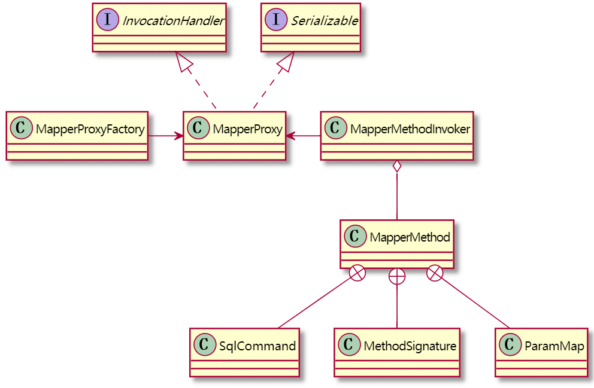

| 版本 | 内容 | 时间                  |
| ---- | ---- | --------------------- |
| V1   | 新建 | 2021年6月14日17:12:31 |

摘要：本篇主要分析Mybatis是如何将Mapper映射接口的方法和XML文件的SQL语句绑定的。

## 引入

在入门案例中我们使用如下的方式去调用Mapper的方法。

```java
// 4. 使用工厂对象factory，生产一个SqlSession对象
SqlSession session = factory.openSession();
// 5. 使用SqlSession对象，获取映射器UserDao接口的代理对象
UserMapper dao = session.getMapper(UserMapper.class);
// 6. 调用UserDao代理对象的方法，查询所有用户
List<User> users = dao.list();
```

对应的XML的节点

```xml
<select id="list" resultType="cn.guosgbin.mybatis.example.entity.User">
	select * from tb_user
</select>
```

Myabtis中维护了数据库操作节点和接口方法之间的映射关系，所以在调用方法的时候才会去执行对应的SQL。


## 准备知识

**注意：准备知识可以先不看，在后面流程分析的时候遇到了再看。**

### 创建代理对象的相关类图



### MapperProxyFactory

这个类是用来创建Mapper代理对象的工厂，就只做这个功能。

### MapperMethod

MapperMethod类是一个很重要的核心类，它**将数据库操作节点（XML映射文件的一个节点）转化为一个方法**，MapperMethod对象就表示数据库操作转化后的方法，**每个MapperMethod对象都对应了一个数据库操作节点**，调**用MapperMethod的excute方法就可以触发节点中的SQL语句**。

它的字段如下：

```java
/**
 * 记录SQL名称和类型
 */
private final SqlCommand command;

/**
 * 对应的方法签名
 */
private final MethodSignature method;
```

构造方法如下：

```java
/**
 * MapperMethod的构造方法
 *
 * @param mapperInterface 映射接口，也就是方法所在的接口
 * @param method 映射接口中的具体方法
 * @param config 配置信息Configuration
 */
public MapperMethod(Class<?> mapperInterface, Method method, Configuration config) {
    this.command = new SqlCommand(config, mapperInterface, method);
    this.method = new MethodSignature(config, mapperInterface, method);
}
```

其实MapperMethod就是封装了两个对象，一个SqlCommand和一个MethodSignature。

SqlCommand就是代表了一条SQL语句。

MethodSignature表示一个具体方法的签名。

### SqlCommand

SqlCommand是MapperMethod对象的一个属性，它的**主要作用是获得方法对应的MappedStatement对象。**

```java
// SQL语句的名称 其实就是类似cn.guosgbin.mybatis.example.mapper.UserMapper.list这种
private final String name;
// SQL语句的种类，一共分为以下六种：增、删、改、查、清缓存、未知
private final SqlCommandType type;
```

SqlCommand的构造方法就是根据传入的参数获得SQL语句的名称和类型。

在SqlCommand类中有一个重要的方法`resolveMappedStatement`，它的主要作用就是**从全局配置类configuration中找到方法对应的MappedStatement对象。**

下面的方法为什么会有递归呢？

是**因为Mapper接口可能会有实现类，所以需要递归查询父接口是否存在该MappedStatement对象**，知道递归到了Mapper的顶层接口。

```java
/**
 * 获取指定接口的方法对应的MappedStatement对象
 *
 * @param mapperInterface 映射接口,方法所在的接口
 * @param methodName 映射接口中具体操作方法的名字
 * @param declaringClass 方法所在的接口。大部分情况是映射接口本身，也可能是映射接口的实现类
 * @param configuration 配置信息
 * @return MappedStatement对象
 */
private MappedStatement resolveMappedStatement(Class<?> mapperInterface, String methodName,
                                               Class<?> declaringClass, Configuration configuration) {
    // 数据库操作语句的ID：接口名.方法名
    String statementId = mapperInterface.getName() + "." + methodName;
    if (configuration.hasStatement(statementId)) {
        return configuration.getMappedStatement(statementId);
    } else if (mapperInterface.equals(declaringClass)) {
        // 说明递归调用已经到终点
        return null;
    }
    // 从方法的定义类开始，沿着父类向上寻找。找到映射接口类时停止
    for (Class<?> superInterface : mapperInterface.getInterfaces()) {
        if (declaringClass.isAssignableFrom(superInterface)) {
            // 找出指定接口指定方法对应的MappedStatement对象
            MappedStatement ms = resolveMappedStatement(superInterface, methodName,
                                                        declaringClass, configuration);
            if (ms != null) {
                return ms;
            }
        }
    }
    return null;
}
```

### MethodSignature

通过MethodSignature的字段，其实可以很清楚的知道这个类的含义，就是封装了方法对应的一些信息，例如返回值类型，参数解析器ParamNameResolver等。

```java
// 返回类型是否为集合类型
private final boolean returnsMany;
// 返回类型是否是map
private final boolean returnsMap;
// 返回类型是否是空
private final boolean returnsVoid;
// 返回类型是否是cursor类型
private final boolean returnsCursor;
// 返回类型是否是optional类型
private final boolean returnsOptional;
// 返回类型
private final Class<?> returnType;
// 如果返回为map,这里记录所有的map的key
private final String mapKey;
// resultHandler参数的位置
private final Integer resultHandlerIndex;
// rowBounds参数的位置
private final Integer rowBoundsIndex;
// 引用参数名称解析器
private final ParamNameResolver paramNameResolver;
```

### PlainMethodInvoker

**PlainMethodInvoker类仅仅是拿着MapperMethod对象的引用，最终的操作还是委托给了MapperMethod对象去执行。**

```java
private static class PlainMethodInvoker implements MapperMethodInvoker {
    private final MapperMethod mapperMethod;

    public PlainMethodInvoker(MapperMethod mapperMethod) {
        super();
        this.mapperMethod = mapperMethod;
    }

    @Override
    public Object invoke(Object proxy, Method method, Object[] args, SqlSession sqlSession) throws Throwable {
        return mapperMethod.execute(sqlSession, args);
    }
}
```

## 代理对象执行方法流程

### 维护映射关系

**解析mapper时维护数据库操作节点和接口方法之间的映射关系**

其实之前已经介绍了如何将映射接口存在Configuration中去了，这里再简单阐述下：

1. 在解析全局配置文件时，解析到`<mapper>`结点的时候，会根据不同的配置方式使用不同的方式去解析。

2. 几种解析方式最终都会调用MapperRegistry的`addMapper(Class<T> type)`方法，里面有一个关键的代码就是下面这句，会将**接口的Class类型作为key，创建一个与之关联的MapperProxyFactory对象作为value**。

   ```java
   knownMappers.put(type, new MapperProxyFactory<>(type));
   ```

3. 当调用MapperRegistry的`getMapper`方法时就会从knownMappers获取对应的MapperProxyFactory了。

上面的源码以前分析过。

### 动态代理获取代理对象

从下面的代码作为入口分析：

```java
UserMapper dao = session.getMapper(UserMapper.class);
```

一步一步点下去，最终会到MapperRegistry的`getMapper`方法：

```java
/**
 * 找到映射接口的对应的MapperProxyFactory，并根据MapperProxyFactory为该映射接口生成一个代理对象
 *
 * @param type 映射接口
 * @param sqlSession sqlSession
 * @param <T> 映射接口类型
 * @return 代理实现对象
 */
@SuppressWarnings("unchecked")
public <T> T getMapper(Class<T> type, SqlSession sqlSession) {
    // 找出指定映射接口的代理工厂
    final MapperProxyFactory<T> mapperProxyFactory = (MapperProxyFactory<T>) knownMappers.get(type);
    if (mapperProxyFactory == null) {
        throw new BindingException("Type " + type + " is not known to the MapperRegistry.");
    }
    try {
        // 通过mapperProxyFactory给出对应代理器的对象
        return mapperProxyFactory.newInstance(sqlSession);
    } catch (Exception e) {
        throw new BindingException("Error getting mapper instance. Cause: " + e, e);
    }
}
```

此时调用了MapperProxyFactory代理工厂的`newInstance`方法创建一个代理对象。

**Mybatis是基于JDK的动态代理得到的代理对象。**

在该方法中，首先会根据传入的参数构建**一个MapperProxy对象，该对象实现了InvocationHandler接口。它是Mapper动态代理的核心类。**

**然后直接使用JDK动态代理创建一个代理对象返回。**

```java
public T newInstance(SqlSession sqlSession) {
    // MapperProxy实现了InvocationHandler接口。它是Mapper动态代理的核心类
    final MapperProxy<T> mapperProxy = new MapperProxy<>(sqlSession, mapperInterface, methodCache);
    // 创建动态代理实例
    return newInstance(mapperProxy);
}

@SuppressWarnings("unchecked")
protected T newInstance(MapperProxy<T> mapperProxy) {
    return (T) Proxy.newProxyInstance(mapperInterface.getClassLoader(), new Class[] { mapperInterface }, mapperProxy);
}
```

### 代理对象的方法的执行

从下面的代码作为入口分析：

```java
List<User> users = dao.list();
```

因为MapperProxy对象实现了InvocationHandler接口，所以当代理对象调用方法的时候都会被MapperProxy的`invoke`方法拦截。

```java
@Override
public Object invoke(Object proxy, Method method, Object[] args) throws Throwable {
    try {
        // 判断是否是继承自Object的方法
        if (Object.class.equals(method.getDeclaringClass())) {
            // 直接执行原有方法
            return method.invoke(this, args);
        } else {
            // 根据被调用接口方法的Method对象，从缓存中获取MapperMethodInvoker对象，如果没有则创建一个并放入缓存，然后调用invoke。
            // 换句话说，Mapper接口中的每一个方法都对应一个MapperMethodInvoker对象，而MapperMethodInvoker对象里面的MapperMethod保存着对应的SQL信息和返回类型以完成SQL调用
            return cachedInvoker(method).invoke(proxy, method, args, sqlSession);
        }
    } catch (Throwable t) {
        throw ExceptionUtil.unwrapThrowable(t);
    }
}
```

假如是代理对象执行的方法是继承自Object的方法，那么不进行其他的操作。

假如执行的方法不是继承自Object的方法，那么会调用`cachedInvoker(method)`去获取方法对应的SQL信息。


下用到了一个Mybatis自己封装的工具类MapUtil，使用了它的`computeIfAbsent`方法，这个方法的作用是**如果某个对象在Map中不存在，就添加到Map中去**

**在这里的作用就是从缓存中获取MapperMethodInvoker对象，如果没有则创建一个并放入缓存，然后调用invoke。**

```java
private MapperMethodInvoker cachedInvoker(Method method) throws Throwable {
    try {
        return MapUtil.computeIfAbsent(methodCache, method, m -> {
            // 假如是接口的默认方法
            if (m.isDefault()) {
                try {
                    if (privateLookupInMethod == null) {
                        // 执行默认方法
                        return new DefaultMethodInvoker(getMethodHandleJava8(method));
                    } else {
                        // 执行默认方法
                        return new DefaultMethodInvoker(getMethodHandleJava9(method));
                    }
                } catch (IllegalAccessException | InstantiationException | InvocationTargetException
                         | NoSuchMethodException e) {
                    throw new RuntimeException(e);
                }
            } else {
                // 如果调用的普通方法（非default方法），则创建一个PlainMethodInvoker并放入缓存，其中MapperMethod保存对应接口方法的SQL以及入参和出参的数据类型等信息
                return new PlainMethodInvoker(new MapperMethod(mapperInterface, method, sqlSession.getConfiguration()));
            }
        });
    } catch (RuntimeException re) {
        Throwable cause = re.getCause();
        throw cause == null ? re : cause;
    }
}
```

在``cachedInvoker(method)``方法中会判断代理对象调用的方法是不是接口的默认方法，因为JDK8以后接口可以允许存在默认方法。

**当不是默认方法的时候，会去创建MapperMethod对象作为参数去构造PlainMethodInvoker对象。**

关于MapperMethod对象的作用，可以去回头看上面的准备知识。

关于PlainMethodInvoker对象的作用，可以去回头看上面的准备知识。

此时拿到了MapperMethodInvoker的对象，此时会调用`cachedInvoker(method)`方法得到的MapperMethodInvoker对象的`invoke`方法，最终其实就是委托给了MapperMethod方法去执行它的`execute`方法。

```java
return cachedInvoker(method).invoke(proxy, method, args, sqlSession);
```

### 核心方法execute

上面分析那么多，其实代理对象调用方法的时候最终都是到了MapperMethod的`execute`对象。

```java
public Object execute(SqlSession sqlSession, Object[] args) {
    Object result;
    // 根据SQL语句类型，执行不同操作
    switch (command.getType()) {
        case INSERT: {
            // 将参数顺序与实参对应好
            // 将args进行解析，如果是多个参数则，则根据@Param注解指定名称将参数转换为Map，
            // 如果是封装实体则不转换
            Object param = method.convertArgsToSqlCommandParam(args);
            result = rowCountResult(sqlSession.insert(command.getName(), param));
            break;
        }
        case UPDATE: {
            // 将参数顺序与实参对应好
            Object param = method.convertArgsToSqlCommandParam(args);
            // 执行操作并返回结果
            result = rowCountResult(sqlSession.update(command.getName(), param));
            break;
        }
        case DELETE: {
            Object param = method.convertArgsToSqlCommandParam(args);
            // 执行操作并返回结果
            result = rowCountResult(sqlSession.delete(command.getName(), param));
            break;
        }
        case SELECT:
            // 方法返回值为void，且有结果处理器
            if (method.returnsVoid() && method.hasResultHandler()) {
                // 使用结果处理器执行查询
                executeWithResultHandler(sqlSession, args);
                result = null;
            } else if (method.returnsMany()) {
                // 多条结果查询
                result = executeForMany(sqlSession, args);
            } else if (method.returnsMap()) {
                // Map结果查询
                result = executeForMap(sqlSession, args);
            } else if (method.returnsCursor()) {
                // 游标类型结果查询
                result = executeForCursor(sqlSession, args);
            } else {
                // 单条结果查询
                // 有可能是通过@Param注解指定参数名，所以这里需要将Mapper接口方法中的多个参数转化为一个ParamMap,
                // 如果是传入的单个封装实体，那么直接返回出来；如果传入的是多个参数，实际上都转换成了Map
                Object param = method.convertArgsToSqlCommandParam(args);
                // 可以看到动态代理最后还是使用SqlSession操作数据库的
                result = sqlSession.selectOne(command.getName(), param);
                if (method.returnsOptional()
                    && (result == null || !method.getReturnType().equals(result.getClass()))) {
                    result = Optional.ofNullable(result);
                }
            }
            break;
            // 清空缓存语句
        case FLUSH:
            result = sqlSession.flushStatements();
            break;
        default:
            // 未知语句类型，抛出异常
            throw new BindingException("Unknown execution method for: " + command.getName());
    }
    // 查询结果为null,但返回类型为基本类型
    // 因此返回无法接收查询结果，抛出异常。
    if (result == null && method.getReturnType().isPrimitive() && !method.returnsVoid()) {
        throw new BindingException("Mapper method '" + command.getName()
                                   + " attempted to return null from a method with a primitive return type (" + method.getReturnType() + ").");
    }
    return result;
}
```

这个方法很明了，最终都将操作委托给SqlSession去执行了，SqlSession怎么执行后面分析，本篇到此结束。

