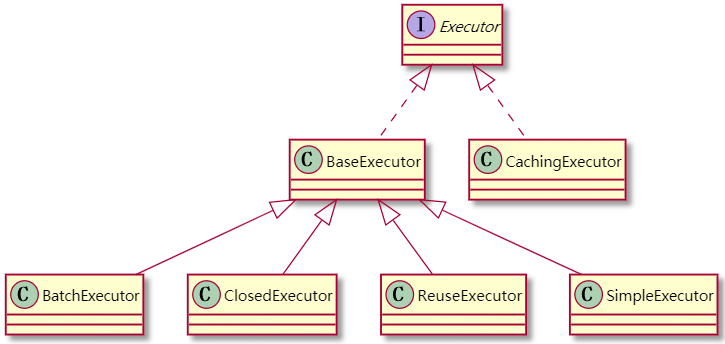
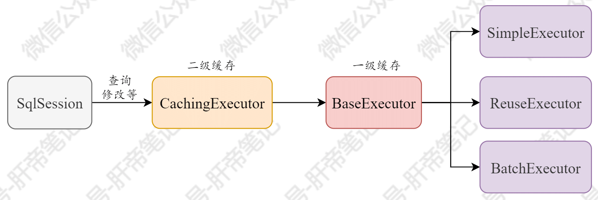

| 版本 | 内容 | 时间                  |
| ---- | ---- | --------------------- |
| V1   | 新建 | 2021年6月14日18:59:34 |

摘要：本篇主要讲执行器的继承关系，通过示例来介绍各种执行器的作用，已经执行器的源码分析。


前面学习，可以看到SqlSession对象的方法，最后都是委托给了Executor对象去执行。这篇来介绍Executor执行器对象。

## Executor执行器的继承关系




Executor是执行器的顶层接口，有一个抽象的实现类BaseExecutor类，BaseExecutor类又有很多子类，这些子类的作用如下：

- SimpleExecutor：简单的执行器。
- ReuseExecutor：支持Statement对象可重复使用的执行器。
- BatchExecutor：批量执行的执行器。
- ClosedExecutor：这个对象其实没什么实际的作用，就仅仅代表自身已经关闭的执行器。

Mybatis在有一个ExecutorType枚举存放了这几个执行器的类型，没放ClosedExecutor进去，我觉得是它没什么用。

```java
/**
 * @author Clinton Begin
 */
public enum ExecutorType {
  // 简单的执行器
  SIMPLE,
  // 支持复用的执行器
  REUSE,
  // 支持批量操作的执行器
  BATCH
}
```

还有一个直接实现Executor的实现类是CachingExecutor，它是Mybatis的二级缓存相关的执行器。

**由于Myabtis的二级缓存是默认开启的**（当然需要你去映射文件设置`<cache>`或`<cache-ref>`），所以每次请求会首先创建CachingExecutor，处理二级缓存后委托给BaseExecutor，最后交给SimpleExecutor这三个其中的一个去处理。

它们的执行流程如下图所示



## 指定Executor执行器

前面我们在入门案例中获得SqlSession对象的时候，我们是这样操作的：

```java
// 4. 使用工厂对象factory，生产一个SqlSession对象
SqlSession session = factory.openSession();
```

这个构造方法如下

```java
@Override
public SqlSession openSession() {
  return openSessionFromDataSource(configuration.getDefaultExecutorType(), null, false);
}
```

其实这是获得Mybatis默认的执行器，它是在Configuration类中配置的，当然我们可以在全局配置文件的`<setting>`标签中修改Mybatis的默认执行器。

```java
protected ExecutorType defaultExecutorType = ExecutorType.SIMPLE;
```

除开空参构造，我们还可以传入ExecutorType类型来创建指定的执行器，如下

```java
// 4. 使用工厂对象factory，生产一个SqlSession对象
SqlSession session = factory.openSession(ExecutorType.BATCH);
```

## 测试三种Executor的功能

### 初始操作

我们其实可以使用`openSession()`传ExecutorType类型来创建指定的执行器，但是为了直观一点，我直接new一个Executor出来。

编写一个测试类

```java
public class BaseExecutorTest {
    private Configuration configuration;
    private Connection connection;
    private JdbcTransaction jdbcTransaction;

    @Before
    public void init() throws Exception {
        InputStream is = Resources.getResourceAsStream("mybatis.xml");
        SqlSessionFactoryBuilder factoryBuilder = new SqlSessionFactoryBuilder();
        SqlSessionFactory factory = factoryBuilder.build(is);
        configuration = factory.getConfiguration();
        // 获得连接
        connection = DriverManager.getConnection(URL, USERNAME, PASSWORD);
        // 获得JDBC事务
        jdbcTransaction = new JdbcTransaction(connection);
    }

}
```

### 测试SimpleExecutor

```java
@Test
public void simpleTest() throws SQLException {
    // 创建一个简单执行器
    SimpleExecutor executor = new SimpleExecutor(configuration, jdbcTransaction);
    // 获得映射的语句对象
    MappedStatement ms = configuration.getMappedStatement("cn.guosgbin.mybatis.example.mapper.UserMapper.selectById");
    // 第一次执行查询
    List<Object> list = executor.doQuery(ms, 1, RowBounds.DEFAULT,
            SimpleExecutor.NO_RESULT_HANDLER, ms.getBoundSql(10));

    // 这里重复执行相同的SQL， 还是去执行两次预处理  （从打印日志可以看出）
    List<Object> list2 = executor.doQuery(ms, 1, RowBounds.DEFAULT,
    		SimpleExecutor.NO_RESULT_HANDLER, ms.getBoundSql(10));
}
```

控制台：

```
mapper.UserMapper.selectById  - ==>  Preparing: SELECT * FROM tb_user WHERE id = ?
mapper.UserMapper.selectById  - ==> Parameters: 1(Integer)
mapper.UserMapper.selectById  - <==      Total: 1
mapper.UserMapper.selectById  - ==>  Preparing: SELECT * FROM tb_user WHERE id = ?
mapper.UserMapper.selectById  - ==> Parameters: 1(Integer)
mapper.UserMapper.selectById  - <==      Total: 1
```

可以看到，简单执行器，相同的SQL语句会预编译两次。

### 测试ReuseExecutor

```java
@Test
public void reuseTest() throws SQLException {
  ReuseExecutor executor = new ReuseExecutor(configuration, jdbcTransaction);
  MappedStatement ms = configuration.getMappedStatement("cn.guosgbin.mybatis.example.mapper.UserMapper.selectById");
  List<Object> list = executor.doQuery(ms, 1, RowBounds.DEFAULT,
          SimpleExecutor.NO_RESULT_HANDLER, ms.getBoundSql(10));

  // 这里重复执行相同的SQL， 只会执行一次预处理  （从打印日志可以看出）
  List<Object> list2 = executor.doQuery(ms, 1, RowBounds.DEFAULT,
          SimpleExecutor.NO_RESULT_HANDLER, ms.getBoundSql(10));
}
```

控制台：

```
mapper.UserMapper.selectById  - ==>  Preparing: SELECT * FROM tb_user WHERE id = ?
mapper.UserMapper.selectById  - ==> Parameters: 1(Integer)
mapper.UserMapper.selectById  - <==      Total: 1
mapper.UserMapper.selectById  - ==> Parameters: 1(Integer)
mapper.UserMapper.selectById  - <==      Total: 1
```

ReuseExecutor是一个复用Statement对象的执行器，可以看到相同的SQL语句会预编译一次。

### 测试BatchExecutor

批处理执行器是针对修改操作的，也就是增删改，只会一次预处理。

对于查询操作来说BatchExecutor和SimpleExecutor没什么区别。

需要注意的是批处理操作必须手动刷新，就算是自动提交的事务处理器也要手动刷新。

```java
@Test
public void batchTest() throws SQLException {
  BatchExecutor executor = new BatchExecutor(configuration, jdbcTransaction);
  MappedStatement ms = configuration.getMappedStatement("cn.guosgbin.mybatis.example.mapper.UserMapper.updateNameById");
  Map map = new HashMap<>();
  map.put("name", "烧瓶");
  map.put("id", 1);

  // 只有一次预处理
  executor.doUpdate(ms, map);
  executor.doUpdate(ms, map);
  executor.doUpdate(ms, map); // 设置参数
  // 批处理刷新,刷新后才能提交
  executor.doFlushStatements(false);
}
```

控制台：

```java
UserMapper.updateNameById  - ==>  Preparing: UPDATE tb_user SET name = ? WHERE id = ?
UserMapper.updateNameById  - ==> Parameters: 烧瓶(String), 1(Integer)
UserMapper.updateNameById  - ==> Parameters: 烧瓶(String), 1(Integer)
UserMapper.updateNameById  - ==> Parameters: 烧瓶(String), 1(Integer)
```

## CachingExecutor源码分析

之前说过，Myabtis默认是开启二级缓存的，在Configuration中的创建执行器的方法当cacheEnabled为true时会创建CachingExecutor对象。

```java
/**
 * 创建一个执行器
 *
 * @param transaction 事务
 * @param executorType 数据库操作类型
 * @return 执行器
 */
public Executor newExecutor(Transaction transaction, ExecutorType executorType) {
    executorType = executorType == null ? defaultExecutorType : executorType;
    executorType = executorType == null ? ExecutorType.SIMPLE : executorType;
    Executor executor;
    // 根据数据操作类型创建实际执行器
    if (ExecutorType.BATCH == executorType) {
        executor = new BatchExecutor(this, transaction);
    } else if (ExecutorType.REUSE == executorType) {
        executor = new ReuseExecutor(this, transaction);
    } else {
        executor = new SimpleExecutor(this, transaction);
    }
    // 根据配置文件中settings节点cacheEnabled配置项确定是否启用缓存
    if (cacheEnabled) { // 如果配置启用缓存
        // 使用CachingExecutor装饰实际执行器
        executor = new CachingExecutor(executor);
    }
    // 为执行器增加拦截器（插件），以启用各个拦截器的功能
    executor = (Executor) interceptorChain.pluginAll(executor);
    return executor;
}
```


CacheExecutor的成员属性，其中delegate字段就是BatchExecutor这三个中的一种。

CacheExecutor执行器的主要作用就是处理二级缓存相关的操作，其他的操作会委托给被装饰的执行器去执行。

```java
// 被装饰的执行器
private final Executor delegate;
// 事务缓存管理器
private final TransactionalCacheManager tcm = new TransactionalCacheManager();
```

### 修改方法

```java
/**
 * 更新数据库数据，INSERT/UPDATE/DELETE三种操作都会调用该方法
 *
 * @param ms 映射语句
 * @param parameterObject 参数对象
 * @return 数据库操作结果
 * @throws SQLException
 */
@Override
public int update(MappedStatement ms, Object parameterObject) throws SQLException {
    // 根据要求判断语句执行前是否要清除二级缓存，如果需要，清除二级缓存
    // 对于update来说呢  isFlushCacheRequired() 一直返回true，也就是总会清除二级缓存
    flushCacheIfRequired(ms);
    return delegate.update(ms, parameterObject);
}
```

### 查询方法

```java
/**
 * 查询数据库中的数据
 *
 * @param ms 映射语句
 * @param parameterObject 参数对象
 * @param rowBounds 翻页限制条件
 * @param resultHandler 结果处理器
 * @param key 缓存的键
 * @param boundSql 查询语句
 * @param <E> 结果类型
 * @return 结果列表
 * @throws SQLException
 */
@Override
public <E> List<E> query(MappedStatement ms, Object parameterObject, RowBounds rowBounds, ResultHandler resultHandler, CacheKey key, BoundSql boundSql)
    throws SQLException {
    // 获取MappedStatement对应的缓存，可能的结果有：该命名空间的缓存或者其它命名空间的缓存、无缓存
    Cache cache = ms.getCache();
    // 如果映射文件未设置<cache>或<cache-ref>则，此处cache变量为null
    if (cache != null) {
        // 根据要求判断语句执行前是否要清除二级缓存，如果需要，清除二级缓存
        flushCacheIfRequired(ms);
        // 该语句使用缓存且没有输出结果处理器
        if (ms.isUseCache() && resultHandler == null) {
            // 二级缓存不支持含有输出参数的CALLABLE语句，故在这里进行判断
            ensureNoOutParams(ms, boundSql);
            // 从缓存中读取结果
            @SuppressWarnings("unchecked")
            List<E> list = (List<E>) tcm.getObject(cache, key);
            if (list == null) { // 缓存中没有结果
                // 交给被包装的执行器执行
                list = delegate.query(ms, parameterObject, rowBounds, resultHandler, key, boundSql);
                // 缓存被包装执行器返回的结果
                tcm.putObject(cache, key, list); // issue #578 and #116
            }
            return list;
        }
    }
    // 交由被包装的实际执行器执行
    return delegate.query(ms, parameterObject, rowBounds, resultHandler, key, boundSql);
}
```

## BaseExecutor源码解析

由于Executor是使用的模板模式，所以先从抽象基类BaseExecutor的源码入手。由于此次不涉及到一二级缓存和懒加载等相关的源码阅读，所以关于这些等地方会先忽略，主要是阅读查询和修改的方法。

前面说到SqlSession对象的增删改查方法，最后都是委托个了Executor对象去执行，先看下查询方法，在看查询方法的时候，由于BaseExecutor是抽取了三个执行器的共有特性，比如说缓存，懒加载等，这些部分先忽略，后面专门讲。

### 查询方法

```java
/**
 * 查询数据库中的数据
 *
 * @param ms 映射语句
 * @param parameter 参数对象
 * @param rowBounds 翻页限制条件
 * @param resultHandler 结果处理器
 * @param key 缓存的键
 * @param boundSql 查询语句
 * @param <E> 结果类型
 * @return 结果列表
 * @throws SQLException
 */
@SuppressWarnings("unchecked")
@Override
public <E> List<E> query(MappedStatement ms, Object parameter, RowBounds rowBounds, ResultHandler resultHandler, CacheKey key, BoundSql boundSql) throws SQLException {
    ErrorContext.instance().resource(ms.getResource()).activity("executing a query").object(ms.getId());
    if (closed) {
        // 执行器已经关闭
        throw new ExecutorException("Executor was closed.");
    }
    if (queryStack == 0 && ms.isFlushCacheRequired()) { // 新的查询栈且要求清除缓存
        // 清除一级缓存
        clearLocalCache();
    }
    List<E> list;
    try {
        queryStack++;
        // 尝试从本地缓存获取结果
        list = resultHandler == null ? (List<E>) localCache.getObject(key) : null;
        if (list != null) {
            // 本地缓存中有结果，则对于CALLA BLE语句还需要绑定到IN/INOUT参数上
            handleLocallyCachedOutputParameters(ms, key, parameter, boundSql);
        } else { // 本地缓存没有结果，故需要查询数据库
            list = queryFromDatabase(ms, parameter, rowBounds, resultHandler, key, boundSql);
        }
    } finally {
        queryStack--;
    }
    if (queryStack == 0) {
        // 懒加载操作的处理
        for (DeferredLoad deferredLoad : deferredLoads) {
            deferredLoad.load();
        }
        // issue #601
        deferredLoads.clear();
        // 如果本地缓存的作用域为STATEMENT，则立刻清除本地缓存
        if (configuration.getLocalCacheScope() == LocalCacheScope.STATEMENT) {
            // issue #482
            clearLocalCache();
        }
    }
    return list;
}
```

可以看到忽略掉一些共性操作之后，就剩下下面的方法了。

```java
list = queryFromDatabase(ms, parameter, rowBounds, resultHandler, key, boundSql);
```

`queryFromDatabase`方法是真正去查数据库的

```java
/**
 * 从数据库中查询结果
 *
 * @param ms 映射语句
 * @param parameter 参数对象
 * @param rowBounds 翻页限制条件
 * @param resultHandler 结果处理器
 * @param key 缓存的键
 * @param boundSql 查询语句
 * @param <E> 结果类型
 * @return 结果列表
 * @throws SQLException
 */
private <E> List<E> queryFromDatabase(MappedStatement ms, Object parameter, RowBounds rowBounds, ResultHandler resultHandler, CacheKey key, BoundSql boundSql) throws SQLException {
    List<E> list;
    // 向缓存中增加占位符，表示正在查询
    localCache.putObject(key, EXECUTION_PLACEHOLDER);
    try {
		// 由子类实现
        list = doQuery(ms, parameter, rowBounds, resultHandler, boundSql);
    } finally {
        // 删除占位符
        localCache.removeObject(key);
    }
    // 将查询结果写入缓存
    localCache.putObject(key, list);
    if (ms.getStatementType() == StatementType.CALLABLE) {
        localOutputParameterCache.putObject(key, parameter);
    }
    return list;
}
```

可以看到，最终是调用了自己的抽象方法`doQuery`方法，具体的实现，就由三个子类去实现了。

### 修改方法

修改方法最终也是调用子类的`doUpdate`方法操作的

```java
/**
 * 更新数据库数据
 * INSERT，UPDATE，DELETE三种操作都会调用该方法
 *
 * @param ms 映射语句
 * @param parameter 参数对象
 * @return 数据库操作结果
 * @throws SQLException
 */
@Override
public int update(MappedStatement ms, Object parameter) throws SQLException {
  ErrorContext.instance().resource(ms.getResource()).activity("executing an update").object(ms.getId());
  if (closed) {
    // 执行器已经关闭，则抛出异常
    throw new ExecutorException("Executor was closed.");
  }
  // 清理本地缓存
  clearLocalCache();
  // 调用子类实现进行操作
  return doUpdate(ms, parameter);
}
```

### 抽象方法

在BaseExecutor执行器中，有几个抽象方法，需要子类去实现。这样就可以让子类去实现不同的功能。

```java
protected abstract int doUpdate(MappedStatement ms, Object parameter) throws SQLException;

protected abstract List<BatchResult> doFlushStatements(boolean isRollback) throws SQLException;

protected abstract <E> List<E> doQuery(MappedStatement ms, Object parameter, RowBounds rowBounds, ResultHandler resultHandler, BoundSql boundSql)
    throws SQLException;

protected abstract <E> Cursor<E> doQueryCursor(MappedStatement ms, Object parameter, RowBounds rowBounds, BoundSql boundSql)
    throws SQLException;
```

## SimpleExecutor源码分析

SimpleExecutor是简单执行器，也是Mybatis默认的执行器，继承自BaseExecutor。它需要实现BaseExecutor的四个抽象方法。

看一下它的修改和查询的方法。

```java
@Override
public int doUpdate(MappedStatement ms, Object parameter) throws SQLException {
    Statement stmt = null;
    try {
        Configuration configuration = ms.getConfiguration();
        // 获得语句处理对象
        StatementHandler handler = configuration.newStatementHandler(this, ms, parameter, RowBounds.DEFAULT, null, null);
        // 获得连接 设置参数等
        stmt = prepareStatement(handler, ms.getStatementLog());
        // 原生statement直接执行
        return handler.update(stmt);
    } finally {
        closeStatement(stmt);
    }
}

@Override
public <E> List<E> doQuery(MappedStatement ms, Object parameter, RowBounds rowBounds, ResultHandler resultHandler, BoundSql boundSql) throws SQLException {
    Statement stmt = null;
    try {
        Configuration configuration = ms.getConfiguration();
        // 获得语句处理对象
        StatementHandler handler = configuration.newStatementHandler(wrapper, ms, parameter, rowBounds, resultHandler, boundSql);
        // 获得连接 设置参数等
        stmt = prepareStatement(handler, ms.getStatementLog());
        // 原生statement直接执行
        return handler.query(stmt, resultHandler);
    } finally {
        closeStatement(stmt);
    }
}
```

其他两个执行器的代码其实差不多。