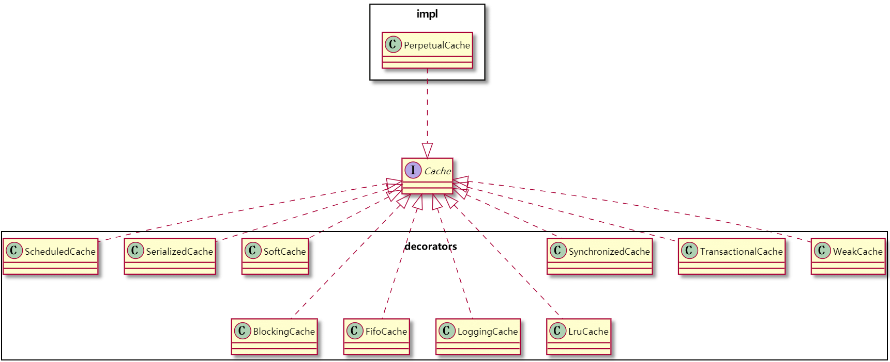
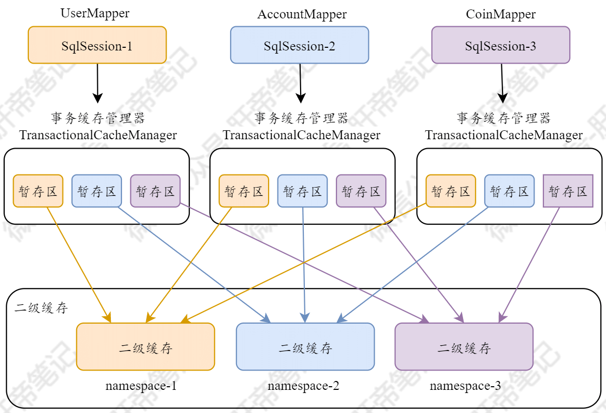
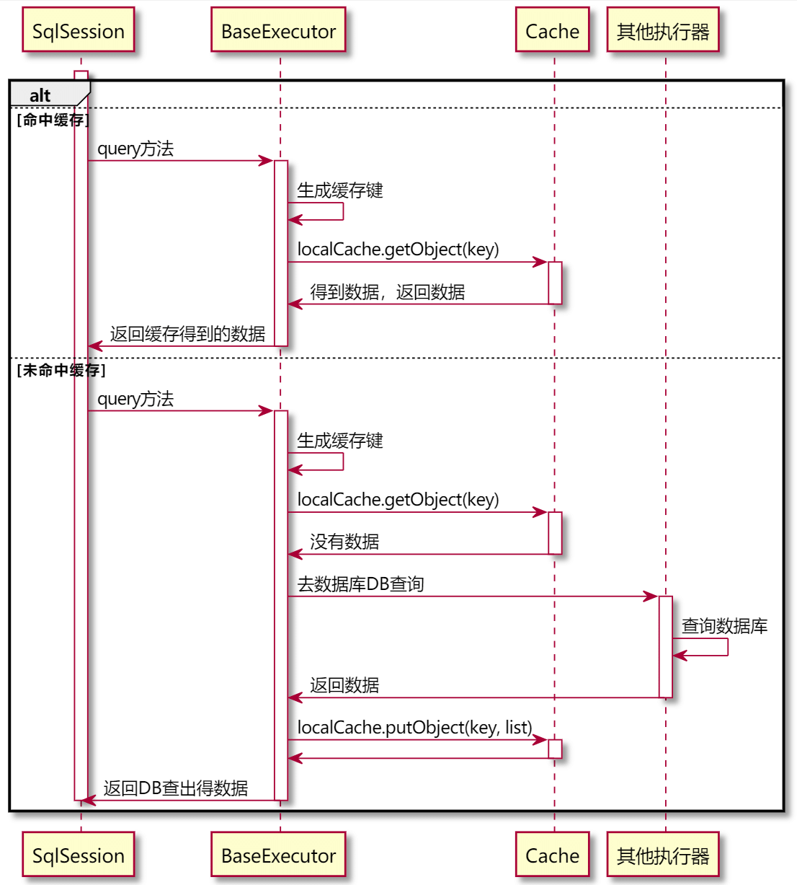
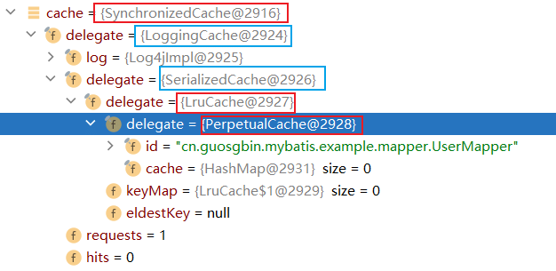
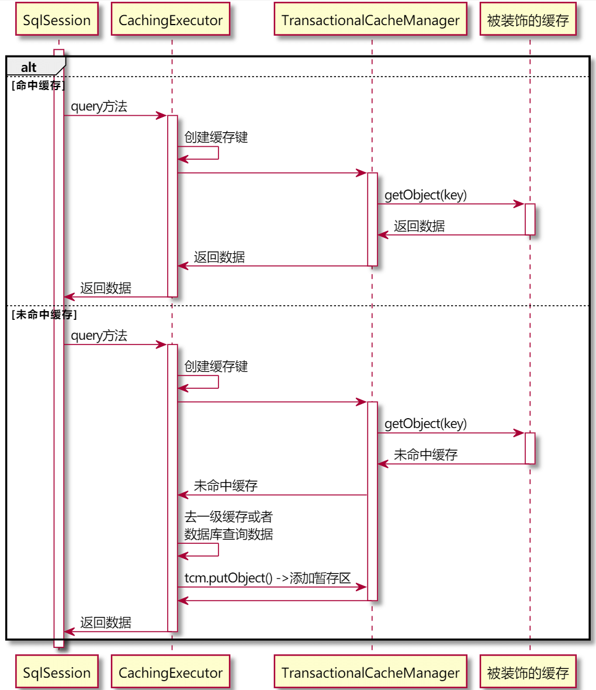
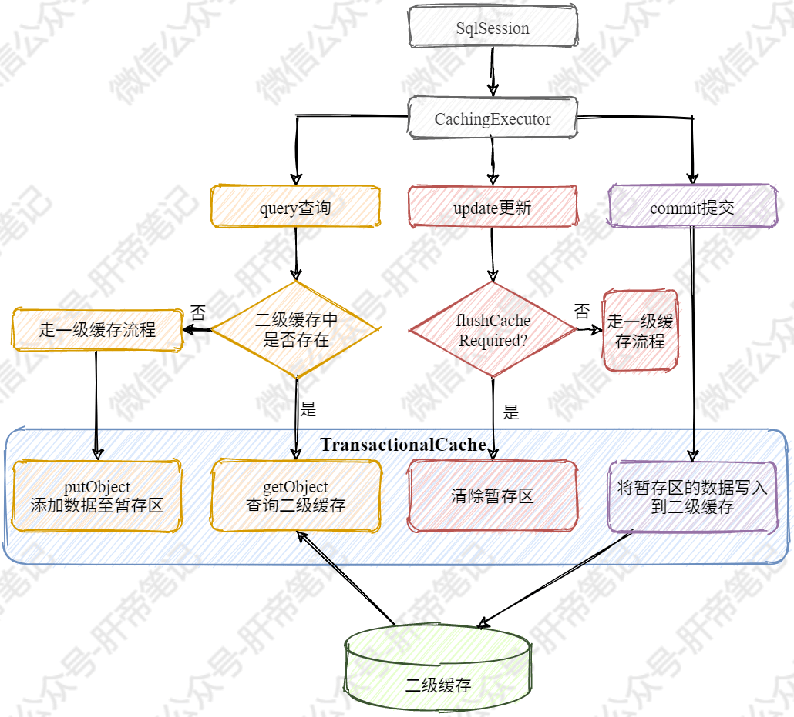

| 版本 | 内容 | 时间                  |
| ---- | ---- | --------------------- |
| V1   | 新建 | 2021年6月17日23:26:31 |

摘要：本篇主要介绍Mybatis的一二级缓存的实现逻辑。


MyBatis是用的非常多的Java数据库访问层框架。在日常工作中，我们在多数情况下都是使用MyBatis的默认缓存配置，但是MyBatis缓存机制有一些不足之处，在使用中容易引起脏数据，形成一些潜在的隐患。


本文顺序

1. cache包
2. 一级缓存
3. 二级缓存

## cache包

cache包使用的是装饰者模式，有一个Cache接口，impl包中存放着实现类，decorators包存放着装饰器类。

Cache接口提供了缓存的一些基本操作，例如获取缓存，清除缓存，设置缓存等操作。

| 方法                                | 作用                 |
| ----------------------------------- | -------------------- |
| getId()                             | 获取缓存id           |
| putObject(Object key, Object value) | 向缓存写入一条信息   |
| getObject(Object key)               | 从缓存中读取一条信息 |
| removeObject(Object key)            | 从缓存中删除一条信息 |
| clear()                             | 清空缓存             |
| getSize()                           | 读取缓存中资源的个数 |

### 继承关系



总共有十个装饰类，让其实现类有多个不同的功能。

### 缓存键CacheKey

因为Mybatis每次查询操作会调用很多信息，例如查询语句的ID，翻页限制等。所以Mybatis设计了一个类CacheKey专门作为缓存的key。

CacheKey的成员变量

```java
private static final int DEFAULT_MULTIPLIER = 37;
private static final int DEFAULT_HASHCODE = 17;

// 计算hashcode时使用
private final int multiplier;
// 哈希值，整个CacheKey的哈希值。如果两个CacheKey该值不同，则两个CacheKey一定不同
private int hashcode;
// 求和的校验值，整个CacheKey的求和校验值。如果两个CacheKey该值不同，则两个CacheKey一定不同
private long checksum;
// 更新次数，整个CacheKey的更新次数
private int count;
// 8/21/2017 - Sonarlint flags this as needing to be marked transient. While true if content is not serializable, this
// is not always true and thus should not be marked transient.
// 更新历史
private List<Object> updateList;
```

每一次更新操作都会使得count，checksum和hashcode发生改变，并且会把更新的值放入到updateList。

**update方法**：

```java
public void update(Object object) {
    // 计算hash值
    int baseHashCode = object == null ? 1 : ArrayUtil.hashCode(object);

    count++;
    checksum += baseHashCode;
    baseHashCode *= count;

    hashcode = multiplier * hashcode + baseHashCode;
    // 把更新的值放入到updateList
    updateList.add(object);
}
```

**equals方法**：

```java
public boolean equals(Object object) {
    // 如果地址一样，是一个对象，肯定相等
    if (this == object) {
        return true;
    }
    // 如果入参不是CacheKey类型，肯定不相等
    if (!(object instanceof CacheKey)) {
        return false;
    }

    final CacheKey cacheKey = (CacheKey) object;

    // 依次通过hashcode、checksum、count判断。必须完全一致才相等
    if (hashcode != cacheKey.hashcode) {
        return false;
    }
    if (checksum != cacheKey.checksum) {
        return false;
    }
    if (count != cacheKey.count) {
        return false;
    }

    // 假如上面三个条件都相等
    // 则详细比较变更历史中的每次变更
    for (int i = 0; i < updateList.size(); i++) {
        Object thisObject = updateList.get(i);
        Object thatObject = cacheKey.updateList.get(i);
        if (!ArrayUtil.equals(thisObject, thatObject)) {
            return false;
        }
    }
    return true;
}
```

缓存键的创建在`org.apache.ibatis.executor.CachingExecutor#query()`方法

```java
@Override
public <E> List<E> query(MappedStatement ms, Object parameterObject, RowBounds rowBounds, ResultHandler resultHandler) throws SQLException {
    BoundSql boundSql = ms.getBoundSql(parameterObject);
    // 创建缓存键
    CacheKey key = createCacheKey(ms, parameterObject, rowBounds, boundSql);
    return query(ms, parameterObject, rowBounds, resultHandler, key, boundSql);
}
```

createCacheKey方法

```java
@Override
public CacheKey createCacheKey(MappedStatement ms, Object parameterObject, RowBounds rowBounds, BoundSql boundSql) {
    if (closed) {
        throw new ExecutorException("Executor was closed.");
    }
    // 创建CacheKey，并将所有查询参数依次更新写入
    CacheKey cacheKey = new CacheKey();
    // 查询语句ID
    cacheKey.update(ms.getId());
    // 分页相关
    cacheKey.update(rowBounds.getOffset());
    cacheKey.update(rowBounds.getLimit());
    // 完整SQL
    cacheKey.update(boundSql.getSql());
    List<ParameterMapping> parameterMappings = boundSql.getParameterMappings();
    TypeHandlerRegistry typeHandlerRegistry = ms.getConfiguration().getTypeHandlerRegistry();
    // mimic DefaultParameterHandler logic
    for (ParameterMapping parameterMapping : parameterMappings) {
        if (parameterMapping.getMode() != ParameterMode.OUT) {
            Object value;
            String propertyName = parameterMapping.getProperty();
            if (boundSql.hasAdditionalParameter(propertyName)) {
                value = boundSql.getAdditionalParameter(propertyName);
            } else if (parameterObject == null) {
                value = null;
            } else if (typeHandlerRegistry.hasTypeHandler(parameterObject.getClass())) {
                value = parameterObject;
            } else {
                MetaObject metaObject = configuration.newMetaObject(parameterObject);
                value = metaObject.getValue(propertyName);
            }
            // 参数
            cacheKey.update(value);
        }
    }
    if (configuration.getEnvironment() != null) {
        // issue #176
        // 环境ID
        cacheKey.update(configuration.getEnvironment().getId());
    }
    return cacheKey;
}
```

可以看到，缓存键中包含了查询语句ID，分页相关，完整SQL，参数等信息。

### PerpetualCache

PerpetualCache是Cache接口的一个实现类，它提供了基本的缓存相关的操作。

成员属性：

```java
// Cache的id，一般为所在的namespace
private final String id;

// 用来存储要缓存的信息
private final Map<Object, Object> cache = new HashMap<>();
```

Mybatis的一二级缓存其实都是HashMap。

### 缓存装饰器

在Mybatis中提供了10个装饰器，每种装饰器的作用不一样，例如提供日志功能的装饰器，提供清理功能的装饰器，事务装饰器等等。

举一个例子，FifoCache是一个先进先出的装饰器，里面维护了一个队列Deque，成员变量如下：

```java
// 被装饰对象
private final Cache delegate;
// 按照写入顺序保存了缓存数据的键
private final Deque<Object> keyList;
// 缓存空间的大小
private int size;
```

写入数据的方法

```java
@Override
public void putObject(Object key, Object value) {
    cycleKeyList(key);
    delegate.putObject(key, value);
}

private void cycleKeyList(Object key) {
    keyList.addLast(key);
    if (keyList.size() > size) {
        // 删除最旧的一条缓存
        Object oldestKey = keyList.removeFirst();
        delegate.removeObject(oldestKey);
    }
}
```

### 事务缓存装饰器

有一个重要一点的装饰器，TransactionalCache，事务的操作需要在事务提交时写入缓存，事务回滚时直接销毁掉。

```java
// 被装饰的缓存
private final Cache delegate;
// 事务提交后是否直接清理缓存
// true表示事务结束后直接将暂时保存的数据销毁掉，而不是写入缓存中
private boolean clearOnCommit;
// 事务提交时需要写入缓存的数据 暂存区
private final Map<Object, Object> entriesToAddOnCommit;
// 缓存查询未命中的数据
private final Set<Object> entriesMissedInCache;
```

该类代码很简单。

举个例子：

```
开启事务
DELETE FROM tb_user WHERE id = 1;
SELECT * FROM tb_user;
回滚事务
```

假如在执行第一句DELETE语句时，就将其添加到缓存，此时假如其他的操作读到了此缓存，但是由于回滚事务了，则就出现了脏读现象。

事务缓存装饰器就是用来解决这个问题的。

在一个事务中可能会涉及到多个缓存，TransactionalCacheManager用来管理多个缓存，它的最重要的一个成员变量就是

```java
// 管理多个缓存的映射
private final Map<Cache, TransactionalCache> transactionalCaches = new HashMap<>();
```

TransactionalCacheManager的作用就是维护多个缓存的映射，key是原本的Cache对象，value是装饰事务之后的TransactionalCache对象，最后二级缓存用的是TransactionalCache。

**二级缓存的空间图：**



## 一级缓存

可以在配置文件的`<setting>`标签配置一级缓存的级别，可配置SESSION和STATEMENT。默认是SESSION。

| 配置名          | 作用                                                         | 可选值               | 默认值  |
| --------------- | ------------------------------------------------------------ | -------------------- | ------- |
| localCacheScope | MyBatis 利用本地缓存机制（Local Cache）防止循环引用和加速重复的嵌套查询。 默认值为 SESSION，会缓存一个会话中执行的所有查询。 若设置值为 STATEMENT，本地缓存将仅用于执行语句，对相同 SqlSession 的不同查询将不会进行缓存。 | SESSION \| STATEMENT | SESSION |

### 一级缓存流程



### 一级缓存实现过程

在多次查询SQL的执行的时候，可能有些SQL其实是一模一样的，这时候针对相同的SQL可以去走一级缓存来提高查询性能。

关于相同的SQL，它们大小写这些也必须是一样的，从上面的cacheKey的实现也是能看出来的，否则是无法命中缓存的。

在BaseExecutor中有个成员变量localCache，它就是一级缓存。

```java
// 数据库查询操作的结果缓存
protected PerpetualCache localCache;
```

在每次查询的时候，会根据**CacheKey去localCache中查询对应的缓存是否存在**，假如存在则会直接返回缓存的数据，不存在的话则会调用`queryFromDatabase()`方法去数据库查询。

在`queryFromDatabase()`方法中查询完毕后，会将从数据库中查询到的数据存到一级缓存localCache中。

```java
@Override
public <E> List<E> query(MappedStatement ms, Object parameter, RowBounds rowBounds, ResultHandler resultHandler, CacheKey key, BoundSql boundSql) throws SQLException {
    ErrorContext.instance().resource(ms.getResource()).activity("executing a query").object(ms.getId());
    if (closed) {
        // 执行器已经关闭
        throw new ExecutorException("Executor was closed.");
    }
    if (queryStack == 0 && ms.isFlushCacheRequired()) { // 新的查询栈且要求清除缓存
        // 清除一级缓存
        clearLocalCache();
    }
    List<E> list;
    try {
        queryStack++;
        // 尝试从本地缓存获取结果
        list = resultHandler == null ? (List<E>) localCache.getObject(key) : null;
        if (list != null) {
            // 本地缓存中有结果，则对于CALLABLE语句还需要绑定到IN/INOUT参数上
            // 存储过程
            handleLocallyCachedOutputParameters(ms, key, parameter, boundSql);
        } else { // 本地缓存没有结果，故需要查询数据库
            list = queryFromDatabase(ms, parameter, rowBounds, resultHandler, key, boundSql);
        }
    } finally {
        queryStack--;
    }
    if (queryStack == 0) {
        // 懒加载操作的处理
        for (DeferredLoad deferredLoad : deferredLoads) {
            deferredLoad.load();
        }
        // issue #601
        deferredLoads.clear();
        // 如果本地缓存的作用域为STATEMENT，则立刻清除本地缓存
        if (configuration.getLocalCacheScope() == LocalCacheScope.STATEMENT) {
            // issue #482
            clearLocalCache();
        }
    }
    return list;
}
```


**上面是查询相关的操作，关于更新操作每次都会清除一级缓存**

```java
@Override
public int update(MappedStatement ms, Object parameter) throws SQLException {
    ErrorContext.instance().resource(ms.getResource()).activity("executing an update").object(ms.getId());
    if (closed) {
        // 执行器已经关闭，则抛出异常
        throw new ExecutorException("Executor was closed.");
    }
    // 清理本地缓存
    clearLocalCache();
    // 调用子类实现进行操作
    return doUpdate(ms, parameter);
}

@Override
public void clearLocalCache() {
    if (!closed) {
        localCache.clear();
        localOutputParameterCache.clear();
    }
}
```

### 一级缓存测试

**测试一级缓存是会话级别**

```java
@Test
public void test1() {
    // 第一个SqlSession得到的Mapper查询两次
    UserMapper mapper = session.getMapper(UserMapper.class);
    User user = mapper.selectById(1);
    User user1 = mapper.selectById(1);
    // 第一个SqlSession得到的Mapper查询一次
    UserMapper mapper2 = session2.getMapper(UserMapper.class);
    User user2 = mapper2.selectById(1);

    System.out.println(user == user1); // true
    System.out.println(user == user2); // fasle
}
```

控制台：

```
e.mapper.UserMapper.selectById  - ==>  Preparing: SELECT * FROM tb_user WHERE id = ?
e.mapper.UserMapper.selectById  - ==> Parameters: 1(Integer)
e.mapper.UserMapper.selectById  - <==      Total: 1
true
false
```

**CacheKey涉及到的信息必须相同：如查询语句ID，分页相关，完整SQL，参数等信息。**

测试分页吧：

```java
@Test
public void test2() {
    Object o1 = session.selectList("cn.guosgbin.mybatis.example.mapper.UserMapper.selectById", 1);
    Object o2 = session.selectList("cn.guosgbin.mybatis.example.mapper.UserMapper.selectById", 1);
    RowBounds rowBounds = new RowBounds(5, 10);
    Object o3 = session.selectList("cn.guosgbin.mybatis.example.mapper.UserMapper.selectById", 1, rowBounds);
    System.out.println(o1 == o2);
    System.out.println(o1 == o3);
}
```

控制台：

```
DEBUG e.mapper.UserMapper.selectById  - ==>  Preparing: SELECT * FROM tb_user WHERE id = ?
DEBUG e.mapper.UserMapper.selectById  - ==> Parameters: 1(Integer)
DEBUG e.mapper.UserMapper.selectById  - <==      Total: 1
DEBUG e.mapper.UserMapper.selectById  - ==>  Preparing: SELECT * FROM tb_user WHERE id = ?
DEBUG e.mapper.UserMapper.selectById  - ==> Parameters: 1(Integer)
DEBUG e.mapper.UserMapper.selectById  - <==      Total: 1
DEBUG e.mapper.UserMapper.selectById  - <==      Total: 1
true
false
```

**手动清空缓存**

```java
@Test
public void test3() {
    UserMapper mapper = session.getMapper(UserMapper.class);
    User user = mapper.selectById(1);
    User user1 = mapper.selectById(1);

    session.clearCache();

    User user2 = mapper.selectById(1);
    System.out.println(user == user1); // true
    System.out.println(user == user2); // fasle
}
```

影响一级缓存的一些操作：

1. **手动调用clearCache清空缓存了。**
2. **只要执行了任何一个`flushCache = true`的查询都会清掉缓存。**
3. **只要执行了更新方法就会清空缓存。**
4. **一级缓存的级别是SESSION，和STATEMENT。STATEMENT级别会禁用掉会话级别的一级缓存，嵌套查询时还会有一级缓存。**

### 一级缓存小结

1. 一级缓存的PerpetualCache仅仅是有一个HashMap，并没有其他的一些装饰类来增加缓存的功能，在缓存的功能性上有所欠缺。
2. 一级缓存也叫会话级别的缓存，有SESSION，和STATEMENT两个级别。
3. SESSION级别的缓存在有有多个SqlSession或者分布式的环境下，数据库写操作会引起脏数据，建议设定缓存级别为STATEMENT。

## 二级缓存

二级缓存的作用范围是一个命名空间namespace，可以和多个命名空间进行共享缓存操作。

可以在配置文件设置二级缓存的开启，默认是true。

```java
<settings>
    <!--开启mybatis二级缓存-->
    <setting name="cacheEnabled" value="false"></setting>
</settings>
```

二级缓存的配置映射文件中的配置有`<cache>`、`<cache-ref>`，还有`<select>`这些节点的属性`useCache`、`flushCache`

### 二级缓存责任链

从前面我们知道了缓存的装饰器类有很多，但是还不知道这些装饰器类是什么时候设置的。

其实是在解析Mapper配置文件的时候去解析的，

在XMLMapperBuilder类的`configurationElement()`方法中有一个`cacheElement()`方法。

```java
private void cacheElement(XNode context) {
    if (context != null) {
        String type = context.getStringAttribute("type", "PERPETUAL");
        Class<? extends Cache> typeClass = typeAliasRegistry.resolveAlias(type);
        String eviction = context.getStringAttribute("eviction", "LRU");
        Class<? extends Cache> evictionClass = typeAliasRegistry.resolveAlias(eviction);
        Long flushInterval = context.getLongAttribute("flushIntearval");
        Integer size = context.getIntAttribute("size");
        boolean readWrite = !context.getBooleanAttribute("readOnly", false);
        boolean blocking = context.getBooleanAttribute("blocking", false);
        Properties props = context.getChildrenAsProperties();
        builderAssistant.useNewCache(typeClass, evictionClass, flushInterval, size, readWrite, blocking, props);
    }
}

```

最后会调用`useNewCache()`方法进行设置。

```java
public Cache useNewCache(Class<? extends Cache> typeClass,
    Class<? extends Cache> evictionClass,
    Long flushInterval,
    Integer size,
    boolean readWrite,
    boolean blocking,
    Properties props) {
  Cache cache = new CacheBuilder(currentNamespace)
      .implementation(valueOrDefault(typeClass, PerpetualCache.class))
      .addDecorator(valueOrDefault(evictionClass, LruCache.class))
      .clearInterval(flushInterval)
      .size(size)
      .readWrite(readWrite)
      .blocking(blocking)
      .properties(props)
      .build();
  configuration.addCache(cache);
  currentCache = cache;
  return cache;
}
```

默认使用的装饰器：



### 二级缓存流程

查询流程




总体流程



### 二级缓存实现过程

假如二级缓存开启的话，会先去CacheExecutor处理二级缓存，然后才会去BaseExecutor处理一级缓存。

**查询方法**

```java
@Override
public <E> List<E> query(MappedStatement ms, Object parameterObject, RowBounds rowBounds, ResultHandler resultHandler) throws SQLException {
    BoundSql boundSql = ms.getBoundSql(parameterObject);
    // 创建缓存键
    CacheKey key = createCacheKey(ms, parameterObject, rowBounds, boundSql);
    return query(ms, parameterObject, rowBounds, resultHandler, key, boundSql);
}

@Override
public <E> List<E> query(MappedStatement ms, Object parameterObject, RowBounds rowBounds, ResultHandler resultHandler, CacheKey key, BoundSql boundSql)
    throws SQLException {
    // 获取MappedStatement对应的缓存，可能的结果有：该命名空间的缓存或者共享的其它命名空间的缓存、无缓存
    Cache cache = ms.getCache();
    // 如果映射文件未设置<cache>或<cache-ref>则，此处cache变量为null
    if (cache != null) {
        // 根据要求判断语句执行前是否要清除二级缓存，如果需要，清除二级缓存
        flushCacheIfRequired(ms);
        // 该语句使用缓存且没有输出结果处理器
        if (ms.isUseCache() && resultHandler == null) {
            // 二级缓存不支持含有输出参数的CALLABLE语句，故在这里进行判断
            ensureNoOutParams(ms, boundSql);
            // 从缓存中读取结果
            @SuppressWarnings("unchecked")
            List<E> list = (List<E>) tcm.getObject(cache, key);
            if (list == null) { // 缓存中没有结果
                // 交给被包装的执行器执行
                list = delegate.query(ms, parameterObject, rowBounds, resultHandler, key, boundSql);
                // 缓存被包装执行器返回的结果
                tcm.putObject(cache, key, list); // issue #578 and #116
            }
            return list;
        }
    }
    // 交由被包装的实际执行器执行
    return delegate.query(ms, parameterObject, rowBounds, resultHandler, key, boundSql);
}
```

关于`flushCacheIfRequired()`方法

在默认的设置中`SELECT`语句不会刷新缓存，`INSERT`、`UPDATE`、`DELETE`操作会刷新缓存。

当执行到下面这行时：

```java
List<E> list = (List<E>) tcm.getObject(cache, key);
```

tcm是TransactionalCacheManager对象，是**事务缓存的管理器**，里面有一个Map存放了多个缓存的TransactionalCache装饰器对象。因为**一个事务可能会设计到多个缓存，所以需要使用TransactionalCacheManager来管理这些缓存。**

假如没有命中二级缓存，则会去让BaseExecutor执行器继续往下执行，去一级缓存或者数据库查询。

查询完得到数据后，就会调用tcm的`putObject()`方法将数据添加到TransactionalCache的暂存区，注意此时得到的数据并没有直接添加到二级缓存，而是放到暂存区里去了。

**当事务commit之后，就会将暂存区的数据添加到二级缓存。**

**当事务rollback时，会将暂存区清空。**

### 二级缓存小结

1. 二级缓存相对于一级缓存来说作用范围更大了，可以在一个映射文件内或多个映射文件实现缓存的共享。
2. 在多表查询时可能会出现脏数据。
3. 尽量在生产中关闭Mybatis的缓存功能。


别人的总结：

https://www.cnblogs.com/yezhaohui/p/14676625.html