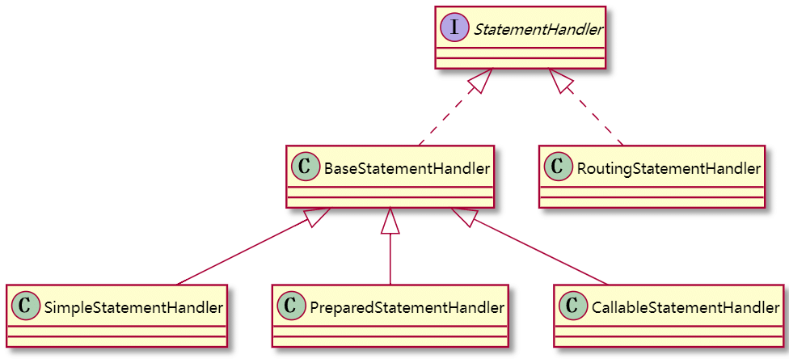

| 版本 | 内容 | 时间                  |
| ---- | ---- | --------------------- |
| V1   | 新建 | 2021年6月18日08:56:56 |

摘要：本篇主要讲StatementHandler的四大对象的StatementHandler，在Mybatis中到底是如何使用的。

## JDK的Statement

在JDK的java.sql包下有一个Statement接口，它是用于执行静态SQL语句并返回结果的对象，一般都是返回ResultSet作为结果。

Statement接口有一个子接口PreparedStatement，PreparedStatement也有一个子接口CallableStatement。

它们的作用分别是:

1. Statement提供一些执行SQL的基本方法。
2. PreparedStatement新增了一些set方法，可以使用预编译执行SQL。
3. CallableStatement用于处理存储过程。

正是由于JDK中有这三种Statement接口，所以Mybatis会存在针对这三种不同的Statement做不同的处理。

## StatementHandler

### 继承关系

Mybatis中有三种StatementHandler：分别是SimpleStatementHandler，PreparedStatementHandler和CallableStatementHandler，分别和JDK在的三种对应。

继承关系如下：



**BaseStatementHandler**是下面三种处理器的基类，使用模板模式抽取了一些公用的代码。

**RoutingStatementHandler**从名字就可以看出它是用于路由到指定StatementHandler的一个类。

**SimpleStatementHandler**：简单处理器。

**PreparedStatementHandler**：提供预编译功能。

**CallableStatementHandler**：用于存储过程。

### StatementHandler

StatementHandler接口提供了一些API

```java
public interface StatementHandler {

  /**
   * 创建一个Statement对象
   */
  Statement prepare(Connection connection, Integer transactionTimeout)
      throws SQLException;

  /**
   * 设置参数
   */
  void parameterize(Statement statement)
      throws SQLException;

  /**
   * 批处理
   */
  void batch(Statement statement)
      throws SQLException;

  /**
   * 更新
   */
  int update(Statement statement)
      throws SQLException;

  <E> List<E> query(Statement statement, ResultHandler resultHandler)
      throws SQLException;

  <E> Cursor<E> queryCursor(Statement statement)
      throws SQLException;

  BoundSql getBoundSql();

  ParameterHandler getParameterHandler();

}
```

### BaseStatementHandler

BaseStatementHandler是其他三个处理器的基类，使用模板模式将prepare方法的主体流程定义了，由子类去实现自己独有的功能。

prepare作用是从Connection中获取Statement对象，共性内容有，设置查询的超时时间，设置数据大小限制等。

源码如下：

```java
@Override
public Statement prepare(Connection connection, Integer transactionTimeout) throws SQLException {
    ErrorContext.instance().sql(boundSql.getSql());
    Statement statement = null;
    try {
        statement = instantiateStatement(connection);
        // 设置查询超时时间
        setStatementTimeout(statement, transactionTimeout);
        setFetchSize(statement);
        return statement;
    } catch (SQLException e) {
        closeStatement(statement);
        throw e;
    } catch (Exception e) {
        closeStatement(statement);
        throw new ExecutorException("Error preparing statement.  Cause: " + e, e);
    }
}
```

其中`instantiateStatement()`方法是抽象方法，需要由子类去实现。

```java
protected abstract Statement instantiateStatement(Connection connection) throws SQLException;

```

### PreparedStatementHandler

由于实际上我们写SQL使用预编译的方式时最多的，所以拿PreparedStatementHandler为例。

PreparedStatementHandler的`instantiateStatement()`方法，最终会生产一个PreparedStatement对象。

```java
@Override
protected Statement instantiateStatement(Connection connection) throws SQLException {
    // 获取真正能执行的SQL，可能还有?占位符
    String sql = boundSql.getSql();
    // 根据不同的情况生产PreparedStatement对象
    if (mappedStatement.getKeyGenerator() instanceof Jdbc3KeyGenerator) {
        String[] keyColumnNames = mappedStatement.getKeyColumns();
        if (keyColumnNames == null) {
            return connection.prepareStatement(sql, PreparedStatement.RETURN_GENERATED_KEYS);
        } else {
            return connection.prepareStatement(sql, keyColumnNames);
        }
    } else if (mappedStatement.getResultSetType() == ResultSetType.DEFAULT) {
        return connection.prepareStatement(sql);
    } else {
        return connection.prepareStatement(sql, mappedStatement.getResultSetType().getValue(), ResultSet.CONCUR_READ_ONLY);
    }
}
```

在执行一次SQL时，假如使用了二级缓存则先回走二级缓存（CachingExecutor），再走一级缓存（BaseExecutor）,最后会走到三个执行器，例如SimpleExecutor。

还要一个重要的方法就是`parameterize()`，它是通过ParameterHandler去设置预编译参数的，后面讲ParameterHandler再说。

## 执行器中StatementHandler相关

SimpleExecutor的`doQuery()`方法如下，

```java
@Override
public <E> List<E> doQuery(MappedStatement ms, Object parameter, RowBounds rowBounds, ResultHandler resultHandler, BoundSql boundSql) throws SQLException {
    Statement stmt = null;
    try {
        Configuration configuration = ms.getConfiguration();
        // 获得语句处理对象
        StatementHandler handler = configuration.newStatementHandler(wrapper, ms, parameter, rowBounds, resultHandler, boundSql);
        // 获得连接 设置参数等
        stmt = prepareStatement(handler, ms.getStatementLog());
        // 原生statement直接执行				
        return handler.query(stmt, resultHandler);
    } finally {
        closeStatement(stmt);
    }
}
```

会先通过Configuration的`newStatementHandler()`方法去创建一个StatementHandler，将创建StatementHandler放在Configuration中，就是一个工厂模式，统一管理，其实就是为了方便增加拦截器的操作。

不止是创建StatementHandler，其他的一些对象也是在Configuration中创建的，例如Executor、ResultSetHandler、ParameterHandler。

```java
public StatementHandler newStatementHandler(Executor executor, MappedStatement mappedStatement, Object parameterObject, RowBounds rowBounds, ResultHandler resultHandler, BoundSql boundSql) {
    StatementHandler statementHandler = new RoutingStatementHandler(executor, mappedStatement, parameterObject, rowBounds, resultHandler, boundSql);
    statementHandler = (StatementHandler) interceptorChain.pluginAll(statementHandler);
    return statementHandler;
}
```

RoutingStatementHandler类的作用就是根据MappedStatement对象的StatementType类型来创建不同的处理器。

Mybatis默认是PREPARED类型。

```java
public RoutingStatementHandler(Executor executor, MappedStatement ms, Object parameter, RowBounds rowBounds, ResultHandler resultHandler, BoundSql boundSql) {
    // 根据语句类型选择被代理对象
    switch (ms.getStatementType()) {
      case STATEMENT:
        delegate = new SimpleStatementHandler(executor, ms, parameter, rowBounds, resultHandler, boundSql);
        break;
      case PREPARED:
        delegate = new PreparedStatementHandler(executor, ms, parameter, rowBounds, resultHandler, boundSql);
        break;
      case CALLABLE:
        delegate = new CallableStatementHandler(executor, ms, parameter, rowBounds, resultHandler, boundSql);
        break;
      default:
        throw new ExecutorException("Unknown statement type: " + ms.getStatementType());
    }

  }
```

在创建好PreparedStatementHandler对象之后，会调用`prepareStatement()`方法去做设置参数，执行SQL等操作。

```java
private Statement prepareStatement(StatementHandler handler, Log statementLog) throws SQLException {
  Statement stmt;
  Connection connection = getConnection(statementLog);
  stmt = handler.prepare(connection, transaction.getTimeout());
  handler.parameterize(stmt);
  return stmt;
}
```

关于PreparedStatementHandler的`parameterize()`方法主要是设置参数的，后面讲。

设置完参数后，回到SimpleExecutor的`doQuery()`，直接调用PreparedStatementHandler的`query()`方法执行SQL，返回结果集。

```java
@Override
public <E> List<E> query(Statement statement, ResultHandler resultHandler) throws SQLException {
    PreparedStatement ps = (PreparedStatement) statement;
    // 执行真正的查询，查询完成后，结果就在ps中了
    ps.execute();
    // 由resultSetHandler继续处理结果
    return resultSetHandler.handleResultSets(ps);
}
```

整个StatementHandler就完了。