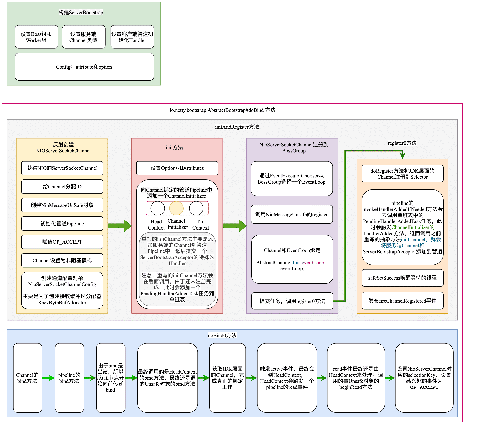
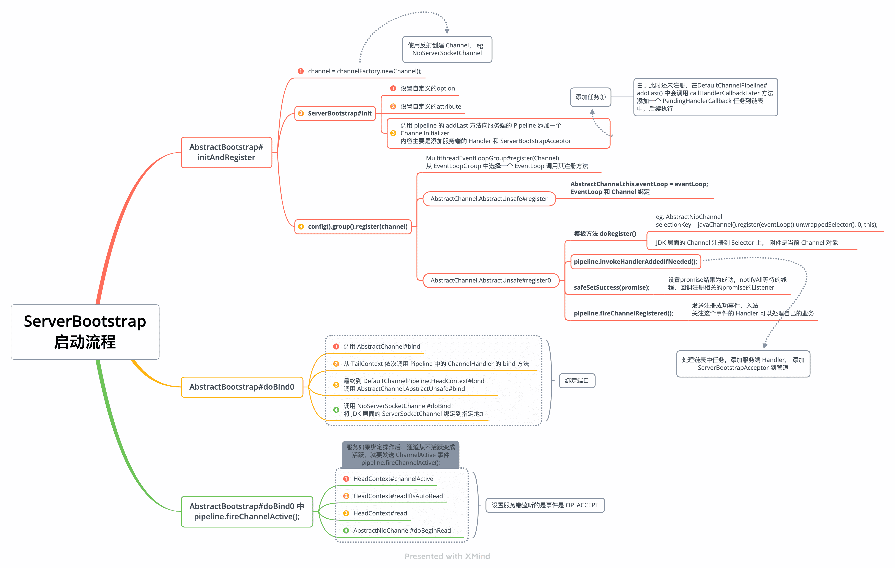

| 版本 | 内容     | 时间                   |
| ---- | -------- | ---------------------- |
| V1   | 新建     | 2022年3月8日08:47:52   |
| V2   | 增加图片 | 2022年03月16日15:08:42 |
| V3   | 重构内容 | 2023年05月09日23:39:41 |

## 服务端代码案例

使用 io.netty.example.echo 包来分析 Netty 服务端的代码，针对 io.netty.example.echo.EchoServer 类做了简单的修改。

```java
public final class EchoServer {

    static final boolean SSL = System.getProperty("ssl") != null;
    static final int PORT = Integer.parseInt(System.getProperty("port", "8007"));
    private static InternalLogger logger = InternalLoggerFactory.getInstance(EchoServer.class);

    public static void main(String[] args) throws Exception {
        // Configure the server.
        EventLoopGroup bossGroup = new NioEventLoopGroup(1);
        EventLoopGroup workerGroup = new NioEventLoopGroup();
        final EchoServerHandler serverHandler = new EchoServerHandler();
        try {
            ServerBootstrap b = new ServerBootstrap();
            b.group(bossGroup, workerGroup)
                .channel(NioServerSocketChannel.class)
                .option(ChannelOption.SO_BACKLOG, 100)
                .handler(new LoggingHandler(LogLevel.INFO))
                .childHandler(new ChannelInitializer<SocketChannel>() {
                    @Override
                    public void initChannel(SocketChannel ch) throws Exception {
                        ChannelPipeline p = ch.pipeline();
                        p.addLast(serverHandler);
                    }
                });

            // Start the server.
            ChannelFuture f = b.bind(PORT).sync();
            logger.warn("======服务端启动完成======");

            f.channel().writeAndFlush("666");
            // Wait until the server socket is closed.
            f.channel().closeFuture().sync();
        } finally {
            // Shut down all event loops to terminate all threads.
            bossGroup.shutdownGracefully();
            workerGroup.shutdownGracefully();
        }
    }
}
```

## 服务端启动流程概要

1. 创建两个线程组，一个 bossGroup ，一个 workerGroup，这两个线程组主要是处理网络 IO 事件；
   - 设置 boss 线程组为一个线程；
   - worker 线程组的默认线程个数是 CPU 核心数的 2 倍；
2. 创建 ServerBootstrap 对象，并给该对象的部分属性进行赋值。该对象是服务端的核心对象；
   - 首先是将两个线程组赋值给 ServerBootstrap 属性；
   - 使用 NioServerSocketChannel 作为此次服务端使用的 SocketChannel；
   - option 方法给服务端 ServerBootstrap 设置一些参数；
   - handler 方法设置服务端的 ChannelHandler；
   - childHandler 方法设置客户端的 childHandler；
3. ServerBootstrap 对象创建完成后，就调用 bind 方法，
   1. 创建 Channel；
   2. 将 Channel 和 EventLoop 绑定；
   3. Channel 注册到 Selector；
   4. 绑定端口，启动完成；
   5. 传播事件；

## 创建线程组

案例代码：

```java
EventLoopGroup bossGroup = new NioEventLoopGroup(1);
EventLoopGroup workerGroup = new NioEventLoopGroup();
```

服务端创建两个 EventLoopGroup 线程组，一个 bossGroup ，一个 workerGroup。

具体内容查看 NioEventLoopGroup 源码分析。

## 创建 ServerBootstrap 并赋值属性

```java
ServerBootstrap b = new ServerBootstrap();
b.group(bossGroup, workerGroup)
    .channel(NioServerSocketChannel.class)
    .option(ChannelOption.SO_BACKLOG, 100)
    .handler(new LoggingHandler(LogLevel.INFO))
    .childHandler(new ChannelInitializer<SocketChannel>() {
        @Override
        public void initChannel(SocketChannel ch) throws Exception {
            ChannelPipeline p = ch.pipeline();
            if (sslCtx != null) {
                p.addLast(sslCtx.newHandler(ch.alloc()));
            }
            //p.addLast(new LoggingHandler(LogLevel.INFO));
            p.addLast(serverHandler);
        }
    });
```

创建 ServerBootstrap 对象，并给该对象的部分属性进行赋值。该对象是服务端的核心对象；

- 首先是将两个线程组赋值给 ServerBootstrap 属性；
- 使用 NioServerSocketChannel 作为此次服务端使用的 SocketChannel；
- option 方法给服务端 ServerBootstrap 设置一些参数；
- handler 方法设置服务端的 ChannelHandler；
- childHandler 方法设置客户端的 childHandler；

### 赋值线程组

```java
b.group(bossGroup, workerGroup)
```

简单的属性赋值。

### 设置 NioServerSocketChannel

io.netty.bootstrap.AbstractBootstrap#channel 方法如下：

```java
public B channel(Class<? extends C> channelClass) {
    return channelFactory(new ReflectiveChannelFactory<C>(
        ObjectUtil.checkNotNull(channelClass, "channelClass")
    ));
}
```

就是创建一个 ReflectiveChannelFactory 类型的对象，赋值给 io.netty.bootstrap.AbstractBootstrap#channelFactory 属性了。

关于 ReflectiveChannelFactory 类很简单，就是保存一个构造器 Constructor 对象，使用 newChannel 方法根据 Constructor 对象创建出一个实例对象。拿案例中的来说就是创建一个 NioServerSocketChannel 对象了。

```java
public class ReflectiveChannelFactory<T extends Channel> implements ChannelFactory<T> {

    // 空参构造函数对象
    private final Constructor<? extends T> constructor;

    public ReflectiveChannelFactory(Class<? extends T> clazz) {
        ObjectUtil.checkNotNull(clazz, "clazz");
        try {
            this.constructor = clazz.getConstructor();
        } catch (NoSuchMethodException e) {
            throw new IllegalArgumentException("Class " + StringUtil.simpleClassName(clazz) +
                                               " does not have a public non-arg constructor", e);
        }
    }

    @Override
    public T newChannel() {
        try {
            return constructor.newInstance();
        } catch (Throwable t) {
            throw new ChannelException("Unable to create Channel from class " + constructor.getDeclaringClass(), t);
        }
    }
    
    // 省略 toString 方法...
}
```

### 服务端配置相关参数

通过 io.netty.bootstrap.AbstractBootstrap#option 方法给服务端的 ServerBootstrap 配置一些参数，ChannelOption.SO_BACKLOG 表示设置服务端连接等待队列的长度。

还有很多配置项在 io.netty.channel.ChannelOption 中可以看到，需要注意的是不同的 Netty 版本支持的配置项可能有些许区别。

### 设置 ChannelHandler

设置服务端和客户端通道的处理器。

```java
.handler(new LoggingHandler(LogLevel.INFO))
.childHandler(new ChannelInitializer<SocketChannel>() {
    @Override
    public void initChannel(SocketChannel ch) throws Exception {
        ChannelPipeline p = ch.pipeline();
        //p.addLast(new LoggingHandler(LogLevel.INFO));
        p.addLast(serverHandler);
    }
});
```

这里目前也是简单的赋值，需要注意一下 ChannelInitializer 对象，后面会重点分析。

## 绑定端口 bind

前面已经创建 ServerBootstrap 并赋值好属性了，接下来就调用 io.netty.bootstrap.AbstractBootstrap#bind(int) 方法绑定端口了。最后调用的核心方法是 io.netty.bootstrap.AbstractBootstrap#doBind。

其中 doBind 方法也分为两个部分，一个是：

- io.netty.bootstrap.AbstractBootstrap#initAndRegister，主要是TODO
- bind

### 反射创建 Channel 

```java
final ChannelFuture initAndRegister() {
    Channel channel = null;
    try {
        // 反射创建Channel对象，使用的是空参构造方法
        channel = channelFactory.newChannel();
        // 初始化Channel，具体实现由客户端和服务端的BootStrap实现
        init(channel);
    } catch (Throwable t) {
       // 省略异常处理代码...
    }
    
    // 省略注册相关的代码...
}
```

通过 AbstractBootstrap#channelFactory 属性反射创建 Channel 实例。在 AbstractBootstrap#initAndRegister 方法在使用下面的代码反射创建一个 Channel。

```
channel = channelFactory.newChannel();
```

对于案例中的代码来说，就是创建的 NioServerSocketChannel 对象，创建 NioServerSocketChannel 对象会调用该类的空参构造方法，如下：

（1）**在 newSocket 方法中会返回一个 JDK 层面的 ServerSocketChannel 服务端的 Channel 对象。**

```java
public NioServerSocketChannel() {
    // newSocket方法会返回一个JDK层面的ServerSocketChannel实例
    this(newSocket(DEFAULT_SELECTOR_PROVIDER));
}
```

（2）**调用父类构造函数，由于是服务端，所以设置的监听的事件为 accept 事件。**

创建一个 NioServerSocketChannelConfig 对象，主要是**创建一个 RecvByteBufAllocator 接收区内存分配器**。

```java
public NioServerSocketChannel(ServerSocketChannel channel) {
    // 因为是服务端Channel，所以设置监听的事件为accept事件，最终会注册到Selector选择器上
    super(null, channel, SelectionKey.OP_ACCEPT);
    // 创建通道配置对象
    config = new NioServerSocketChannelConfig(this, javaChannel().socket());
}
```

> 上面构造方法的第二行没有分析 `config = new NioServerSocketChannelConfig(this, javaChannel().socket());`，这行涉及到了内存分配相关的配置，后续分析内存池的时候再分析这块。

（3）**调用父类构造函数。赋值参数，并将 ServerSocketChannel 服务端 Channel 设置为非阻塞**。

```java
protected AbstractNioChannel(Channel parent, SelectableChannel ch, int readInterestOp) {
    super(parent);
    this.ch = ch;
    this.readInterestOp = readInterestOp;
    try {
        // Channel设置为非阻塞模式
        ch.configureBlocking(false);
    } catch (IOException e) {
      // 省略部分代码
    }
}
```

（4）**给服务端 Channel 分配一个ID**。

由于是服务端所以 newUnsafe 方法创建的是 NioMessageUnSafe 对象。

**创建一个 DefaultChannelPipeline 管道，绑定到 Channel。管道就是一个双向链表。**

```java
protected AbstractChannel(Channel parent) {
    this.parent = parent;
    // 给Channel实例分配一个唯一的ID对象
    id = newId();
    // 封装一个unsafe对象
    // 当Channel是NioServerSocketChannel时，Unsafe实例是NioMessageUnSafe
    // 当Channel是NioSocketChannel时，实例是NioByteUnSafe
    unsafe = newUnsafe();
    // 构建Channel消息处理管道Pipeline
    // 设置好两个节点(默认的处理器)，一个头结点HeadContext，一个尾节点TailContext
    pipeline = newChannelPipeline();
}
```

此时的 DefaultChannelPipeline 管道，只有 HeadContext 和 TailContext 两个节点。


**小结一下**：可以看到创建 NioServerSocketChannel 做的事情还是比较多的：

1. 获取 JDK 原生的 ServerSocketChannel，并设置为非阻塞模式；
2. 并将服务端要监听的事件设置为 accept，注意这里只是保存在 io.netty.channel.nio.AbstractNioChannel 的属性中；
3. 给服务端的 Channel 分配一个 ID；
4. 创建一个服务端使用的 NioMessageUnSafe 实例；
5. 创建管道对象 DefaultChannelPipeline，默认有两个节点  HeadContext 和 TailContext；

### ServerBootstrap 初始化操作

前面已经创建好 NioServerSocketChannel 了，接下来需要 AbstractBootstrap#init 方法去做一些初始化的操作，这个方法是个模板方法，需要子类去实现，因为我们是 ServerBootstrap 对象调进来的，所以最终会调到 ServerBootstrap#init 中去，下面是 ServerBootstrap#init 方法的实现。

```java
@Override
void init(Channel channel) {
    // 设置自定义的option
    setChannelOptions(channel, newOptionsArray(), logger);
    // 设置自定义的attribute
    setAttributes(channel, newAttributesArray());

    // 获取已经分配的服务端的Pipeline管道
    ChannelPipeline p = channel.pipeline();

    // 其实就是再Demo里的workGroup
    final EventLoopGroup currentChildGroup = childGroup;
    final ChannelHandler currentChildHandler = childHandler;
    // 客户端Socket选项
    final Entry<ChannelOption<?>, Object>[] currentChildOptions = newOptionsArray(childOptions);
    // 客户端的Attribute参数
    final Entry<AttributeKey<?>, Object>[] currentChildAttrs = newAttributesArray(childAttrs);

    // 再服务端管道后面添加一个ChannelInitializer
    // ChannelInitializer本身不是一个Handler，只是通过Adapter实现了Handler接口
    // 它存在的意义，就是为了延迟初始化Pipeline
    // 目前管道是这个样子 head <--> ChannelInitializer <--> tail
    p.addLast(new ChannelInitializer<Channel>() {
        // 这个initChannel会在 io.netty.channel.ChannelInitializer.handlerAdded处调用
        @Override
        public void initChannel(final Channel ch) {
            final ChannelPipeline pipeline = ch.pipeline();
            // 获得服务端配置的Handler
            ChannelHandler handler = config.handler();
            if (handler != null) {
                pipeline.addLast(handler);
            }

            ch.eventLoop().execute(new Runnable() {
                @Override
                public void run() {
                    // 参数1：服务端Channel
                    // 参数2：worket线程组
                    // 参数3：初始化客户端channel的Handler
                    // 参数4：参数
                    // 参数5：参数
                    pipeline.addLast(new ServerBootstrapAcceptor(
                        ch, currentChildGroup, currentChildHandler, currentChildOptions, currentChildAttrs));
                }
            });
        }
    });
}
```

初始化的流程主要做的是：

1. 设置自定义的 option；
2. 设置自定义的 attribute；
3. 在服务端的 Pipeline 中添加一个 匿名类 ChannelInitializer。重写了 initChannel 方法，会做下面两件事（ps.后续会触发 initChannel 方法）：
   1. 将服务端的 ChannelHandler 处理器添加到服务端 Pipeline 中；
   2. 添加 Runnable 任务，目的是添加一个特殊的服务端处理器 ServerBootstrapAcceptor；

> 这里只需要知道添加了一个 ChannelInitializer 到管道中了，具体后续发生什么后面单独一篇分析。

### Channel 绑定 EventLoop

此时走到了 initAndRegister 方法的第三个步骤了

```java
ChannelFuture regFuture = config().group().register(channel);
```

在 register 方法中，会通过 EventExecutorChooser 选择器对象从 EventLoopGroup 线程组中获得一个 EventLoop 线程。然后会调用到 SingleThreadEventLoop#register(ChannelPromise) 这个方法。

```java
@Override
public ChannelFuture register(final ChannelPromise promise) {
    ObjectUtil.checkNotNull(promise, "promise");
    promise.channel().unsafe().register(this, promise);
    return promise;
}
```

前面已经分析过服务端的 unsafe 是 NioMessageUnsafe 对象。

在 AbstractChannel.AbstractUnsafe#register 方法中，`    AbstractChannel.this.eventLoop = eventLoop`，就是将 EventLoop 和 Channel 绑定了。

```java
public final void register(EventLoop eventLoop, final ChannelPromise promise) {
    ObjectUtil.checkNotNull(eventLoop, "eventLoop");
    // 防止Channel重复注册
    if (isRegistered()) {
        // 已经注册过 设置promise结果是失败，这样监听者会回调失败的逻辑
        promise.setFailure(new IllegalStateException("registered to an event loop already"));
        return;
    }
    if (!isCompatible(eventLoop)) {
        // 传入的 EventLoop 和当前 Channel 类型不兼容
        promise.setFailure(
                new IllegalStateException("incompatible event loop type: " + eventLoop.getClass().getName()));
        return;
    }

    // 绑定Channel和EventLoop的关系
    // 后续Channel上的事件或者任务都会用这个EventLoop线程去处理
    AbstractChannel.this.eventLoop = eventLoop;

    // 当前线程是否是当前EventLoop线程自己
    // 目的是，为了线程安全，最终都是EventLoop这个线程去执行注册
    if (eventLoop.inEventLoop()) {
        register0(promise);
    } else {
        try {
            // 将注册的任务提交到eventLoop的队列中
            eventLoop.execute(new Runnable() {
                @Override
                public void run() {
                    register0(promise);
                }
            });
        } catch (Throwable t) {
           // 省略异常处理代码......
        }
    }
}
```

### Channel 注册到 Selector

在上一小节分析的 AbstractChannel.AbstractUnsafe#register 中有下面这部分代码

```java
@Override
public final void register(EventLoop eventLoop, final ChannelPromise promise) {
	// 省略部分代码......

    AbstractChannel.this.eventLoop = eventLoop;
    
    // 当前线程是否是当前EventLoop线程自己
    // 目的是，为了线程安全，最终都是EventLoop这个线程去执行注册
    if (eventLoop.inEventLoop()) {
        register0(promise);
    } else {
        try {
            // 将注册的任务提交到eventLoop的队列中
            eventLoop.execute(new Runnable() {
                @Override
                public void run() {
                    register0(promise);
                }
            });
        } catch (Throwable t) {
            // 省略异常处理代码......
        }
    }
}
```

Channel 绑定 EventLoop 之后，该 Channel 上的一些事情都由绑定的 EventLoop 来处理，使用 EventLoop 线程去执行 AbstractChannel.AbstractUnsafe#register0 方法。

```java
private void register0(ChannelPromise promise) {
    try {
        // check if the channel is still open as it could be closed in the mean time when the register
        // call was outside of the eventLoop
        // 检查通道是否仍处于打开状态，因为在register方法调用位于eventLoop之外的时，
        // 有可能这时通道被别的线程关闭了
        if (!promise.setUncancellable() || !ensureOpen(promise)) {
            return;
        }
        boolean firstRegistration = neverRegistered;
        // 模板方法-子类实现
        doRegister();
        
        // 省略后面的一些方法，后面小结分析...
        
    } catch (Throwable t) {
       // 省略异常处理代码......
    }
}
```

有个关键的 AbstractChannel#doRegister 方法，这个方法也是一个模板方法，需要由具体的子类来实现，因为案例中的 Channel 使用的是 NioServerSocketChannel，所以会调用 AbstractNioChannel#doRegister 的实现，如下：

```java
@Override
    protected void doRegister() throws Exception {
        boolean selected = false;
        for (;;) {
            try {
                // javaChannel() 获得jdk层面的channel
                // JDK层面的Selector
                selectionKey = javaChannel().register(eventLoop().unwrappedSelector(), 0, this);
                return;
            } catch (CancelledKeyException e) {
               // 省略异常处理代码......
            }
        }
    }
```

通过 AbstractNioChannel#doRegister 的实现可以看到，其实就是将 JDK 层面的 Channel 注册到 JDK 层面的 Selector 上去。

> 需要注意的是：此时关注的事件的值是 0，具体的监听事件在后面会赋值。

### AbstractUnsafe#register0 方法

再次把视角转换到 AbstractChannel.AbstractUnsafe#register0 方法，上一小节我们已经分析过了模板方法 doRegister 的 AbstractChannel#doRegister 实现，就是将 JDK 层面的 Channel 注册到 JDK 层面的 Selector 上去。

注册完之后还有一些其他的操作，例如

- `pipeline.invokeHandlerAddedIfNeeded()`：在 Channel 为注册完成时，会向管道添加一些处理器，但是因为这是 Channel 还未完成注册，此时会封装一个任务，等到 Channel 注册好了后，就调用当前方法去处理这个任务；后面单独一篇分析。
- `safeSetSuccess`方法：设置注册完成，唤醒监听者；
- `pipeline.fireChannelRegistered()`：管道传播 channelRegistered 事件；
- `pipeline.fireChannelActive()`：管道传播 channelActive 事件（服务端不是在这里发的这个事件，客户端在这里发）；

```java
private void register0(ChannelPromise promise) {
    try {
        boolean firstRegistration = neverRegistered;
        // 模板方法-子类实现
        doRegister();
        // 表示不是第一次实现
        neverRegistered = false;
        // 表示当前Channel已经注册到Selector了
        registered = true;

        // Ensure we call handlerAdded(...) before we actually notify the promise. This is needed as the
        // user may already fire events through the pipeline in the ChannelFutureListener.
        // 确保在通道未注册前添加到管道上的 ChannelHandler 的 handlerAdded(…) 也会被调用
        // 这是必需的，因为用户可能已经通过ChannelFutureListener中的管道触发了事件。
        pipeline.invokeHandlerAddedIfNeeded();

        // 设置promise结果为成功，notifyAll等待的线程，回调注册相关的promise的Listener
        safeSetSuccess(promise);
        // 向当前Channel的pipeline发起一个 注册完成事件， 关注这个事件的handlder可以做一些自己的事情
        pipeline.fireChannelRegistered();
        // Only fire a channelActive if the channel has never been registered. This prevents firing
        // multiple channel actives if the channel is deregistered and re-registered.
        // NIoServerSocketChannel角度来说
        // 这一步bind操作肯定没有完成，因为register0和bind0操作都是 eventloop线程，而eventloop现在在执行register0
        if (isActive()) {
            // firstRegistration 客户端是true 服务端是false
            if (firstRegistration) {
                pipeline.fireChannelActive();
            } else if (config().isAutoRead()) {
                // This channel was registered before and autoRead() is set. This means we need to begin read
                // again so that we process inbound data.
                //
                // See https://github.com/netty/netty/issues/4805
                beginRead();
            }
        }
    } catch (Throwable t) {
        // 省略异常处理代码......
    }
}
```

### 绑定端口

前面已经把 AbstractBootstrap#initAndRegister 分析完了，接下来需要把视角转换到 AbstractBootstrap#doBind：

```java
private ChannelFuture doBind(final SocketAddress localAddress) {
    // 创建Channel并初始化Channel
    // 返回的regFuture就是 注册相关的promise对象，关联的异步任务是register0，最终是EventLoop这个线程去执行
    final ChannelFuture regFuture = initAndRegister();
    final Channel channel = regFuture.channel();
    if (regFuture.cause() != null) {
        // 注册失败
        return regFuture;
    }

    if (regFuture.isDone()) {
        // At this point we know that the registration was complete and successful.
        ChannelPromise promise = channel.newPromise();
        doBind0(regFuture, channel, localAddress, promise);
        return promise;
    } else {
        // Registration future is almost always fulfilled already, but just in case it's not.
        final PendingRegistrationPromise promise = new PendingRegistrationPromise(channel);
        // 向register0任务 相关的promise添加一个回调对象，回调执行的线程是EventLoop线程
        regFuture.addListener(new ChannelFutureListener() {
            @Override
            public void operationComplete(ChannelFuture future) throws Exception {
                Throwable cause = future.cause();
                if (cause != null) {
                    promise.setFailure(cause);
                } else {
                    promise.registered();
                    doBind0(regFuture, channel, localAddress, promise);
                }
            }
        });
        return promise;
    }
}
```

AbstractBootstrap#initAndRegister 流程走完以后，其实后续步骤就是为了执行 AbstractBootstrap#doBind0 方法去绑定端口。因为前面的流程有异步处理，所以需要判断 initAndRegister 方法的返回值 ChannelFuture 是否是已经处理完成了：

- 已经处理完成了：直接调用 AbstractBootstrap#doBind0 方法；
- 还未处理完成：等待监听器 Listener 监听处理完成后，回调 AbstractBootstrap#doBind0 方法；

那么看一下 AbstractBootstrap#doBind0 方法的实现：

```java
private static void doBind0(
        final ChannelFuture regFuture, final Channel channel,
        final SocketAddress localAddress, final ChannelPromise promise) {

    // This method is invoked before channelRegistered() is triggered.  Give user handlers a chance to set up
    // the pipeline in its channelRegistered() implementation.
    channel.eventLoop().execute(new Runnable() {
        @Override
        public void run() {
            if (regFuture.isSuccess()) {
                channel.bind(localAddress, promise)
                        .addListener(ChannelFutureListener.CLOSE_ON_FAILURE);
            } else {
                promise.setFailure(regFuture.cause());
            }
        }
    });
}
```

AbstractBootstrap#doBind0 就是通过 Channel 绑定的 EventLoop 去执行ChannelOutboundInvoker#bind(SocketAddress, ChannelPromise) 方法，

继续跟进可以看到就是在管道内传播一个 bind 事件，AbstractChannel#bind(SocketAddress, ChannelPromise)

```java
@Override
public ChannelFuture bind(SocketAddress localAddress, ChannelPromise promise) {
    return pipeline.bind(localAddress, promise);
}
```

因为 bind 事件是一个出站事件，会从管道的 TailContext 节点将事件传播到 HeadContext 节点，那么看一下 HeadContext#bind 方法：

```java
@Override
public void bind(
    ChannelHandlerContext ctx, SocketAddress localAddress, ChannelPromise promise) {
    unsafe.bind(localAddress, promise);
}
```

可以看到最终调用的就是 AbstractChannel.AbstractUnsafe#bind 方法

```java
Override
    public final void bind(final SocketAddress localAddress, final ChannelPromise promise) {
    assertEventLoop();

    if (!promise.setUncancellable() || !ensureOpen(promise)) {
        return;
    }

    // 省略非核心代码......

    boolean wasActive = isActive();
    try {
        // 获取JDK层面的ServerSocketChannel，完成真正的绑定工作
        doBind(localAddress);
    } catch (Throwable t) {
        safeSetFailure(promise, t);
        closeIfClosed();
        return;
    }

    // 如果绑定操作后，通道从不活跃变成活跃，就要发送 ChannelActive 事件
    if (!wasActive && isActive()) {
        logger.warn("服务端已经启动完成了，调用管道fireChannelActive方法，发布Active事件");
        invokeLater(new Runnable() {
            @Override
            public void run() {
                //
                pipeline.fireChannelActive();
            }
        });
    }
    // 设置绑定成功，唤醒sync()操作，
    safeSetSuccess(promise);
}
```

核心方法 AbstractChannel#doBind，该方法也是一个模板方法，不同类型的 Channel 的实现不一样，我们看下 NioServerSocketChannel#doBind 的实现：就是调用 JDK 层面的 API。

```java
@SuppressJava6Requirement(reason = "Usage guarded by java version check")
@Override
protected void doBind(SocketAddress localAddress) throws Exception {
    logger.warn("服务端完成绑定, localAddress = {}...", localAddress);
    if (PlatformDependent.javaVersion() >= 7) {
        javaChannel().bind(localAddress, config.getBacklog());
    } else {
        javaChannel().socket().bind(localAddress, config.getBacklog());
    }
}
```

### 设置 Channel 监听事件

在上一小节的 AbstractChannel.AbstractUnsafe#bind 方法中，会发送一个 channelActive 事件，它是一个入站时间，我们看下 HeadContext 的处理：

```java
@Override
public void channelActive(ChannelHandlerContext ctx) {
    ctx.fireChannelActive();

    // 是否需要主动触发读操作
    readIfIsAutoRead();
}
```

可以看到是先向管道中传播事件，直到 TailContext。紧接着调用 HeadContext#readIfIsAutoRead 方法去触发一个出站的 read 事件，出站事件从 TailContext 向前传播，最后会到HeadContext#read 中处理：

```java
@Override
public void read(ChannelHandlerContext ctx) {
    unsafe.beginRead();
}
```

AbstractUnsafe#beginRead：

```java
@Override
public final void beginRead() {
    assertEventLoop();

    try {
        doBeginRead();
    } catch (final Exception e) {
        invokeLater(new Runnable() {
            @Override
            public void run() {
                // 假如有异常的话，传递异常事件
                pipeline.fireExceptionCaught(e);
            }
        });
        close(voidPromise());
    }
}
```

最终会传递到 AbstractNioChannel#doBeginRead

```java
/**
 * 设置感兴趣的事件
 * @throws Exception
 */
@Override
protected void doBeginRead() throws Exception {
    // Channel.read() or ChannelHandlerContext.read() was called
    final SelectionKey selectionKey = this.selectionKey;
    if (!selectionKey.isValid()) {
        return;
    }

    // 设置当前通道是 可读状态
    readPending = true;

    final int interestOps = selectionKey.interestOps();
    // 设置底层NIO通道读事件
    if ((interestOps & readInterestOp) == 0) {
        selectionKey.interestOps(interestOps | readInterestOp);
    }
}
```

其中 readInterestOp 是在创建 NioServerSocketChannel 对象的时候赋值为 SelectionKey.OP_ACCEPT 的，这里将 SelectionKey 感兴趣的事件设置为 OP_ACCEPT ，监听客户端的连接。

## 小结

本篇分析了服务端 ServerBootstrap 的启动流程，除开 ServerBootstrap#init 方法中的往管道添加一个 ChannelInitializer 处理器外，其它的核心逻辑已经全部分析了。关于向管道添加 ChannelInitializer 处理器下一篇单独分析。






