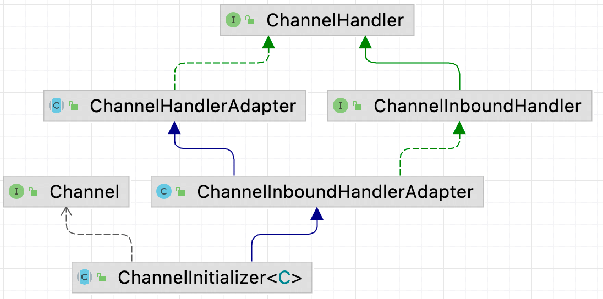

| 版本 | 内容     | 时间                   |
| ---- | -------- | ---------------------- |
| V1   | 新建     | 2022年3月8日08:47:52   |
| V2   | 增加图片 | 2022年03月16日15:08:42 |
| V3   | 重构内容 | 2023年05月10日21:36:49 |

## 服务端启动流程回顾

接着上篇文章：在创建完 ServerBootstrap 对象后，会调到 AbstractBootstrap#initAndRegister 方法中，反射创建好 Channel 后，会调 ServerBootstrap#init 方法，该方法的实现如下：

```java
@Override
void init(Channel channel) {
    // 设置自定义的option
    setChannelOptions(channel, newOptionsArray(), logger);
    // 设置自定义的attribute
    setAttributes(channel, newAttributesArray());

    // 获取已经分配的服务端的Pipeline管道
    ChannelPipeline p = channel.pipeline();

    // 其实就是再Demo里的workGroup
    final EventLoopGroup currentChildGroup = childGroup;
    final ChannelHandler currentChildHandler = childHandler;
    // 客户端Socket选项
    final Entry<ChannelOption<?>, Object>[] currentChildOptions = newOptionsArray(childOptions);
    // 客户端的Attribute参数
    final Entry<AttributeKey<?>, Object>[] currentChildAttrs = newAttributesArray(childAttrs);

    // 再服务端管道后面添加一个ChannelInitializer
    // ChannelInitializer本身不是一个Handler，只是通过Adapter实现了Handler接口
    // 它存在的意义，就是为了延迟初始化Pipeline
    // 目前管道是这个样子 head <--> ChannelInitializer <--> tail
    p.addLast(new ChannelInitializer<Channel>() {
        // 这个initChannel会在 io.netty.channel.ChannelInitializer.handlerAdded处调用
        @Override
        public void initChannel(final Channel ch) {
            final ChannelPipeline pipeline = ch.pipeline();
            // 获得服务端配置的Handler
            ChannelHandler handler = config.handler();
            if (handler != null) {
                pipeline.addLast(handler);
            }

            ch.eventLoop().execute(new Runnable() {
                @Override
                public void run() {
                    // 参数1：服务端Channel
                    // 参数2：worket线程组
                    // 参数3：初始化客户端channel的Handler
                    // 参数4：参数
                    // 参数5：参数
                    logger.warn("开始添加ServerBootstrapAcceptor...");
                    pipeline.addLast(new ServerBootstrapAcceptor(
                            ch, currentChildGroup, currentChildHandler, currentChildOptions, currentChildAttrs));
                }
            });
        }
    });
}
```

核心代码就是向 Pipeline 中添加一个匿名对象 ChannelInitializer。

## ChannelInitializer类继承体系

ChannelInitializer 类继承体系如下：



可以看到它是一个入站处理器。

## ChannelPipeline添加处理器简要分析

沿着调用链最终会调到 DefaultChannelPipeline#addLast(EventExecutorGroup, String, ChannelHandler) 方法

```java
@Override
public final ChannelPipeline addLast(EventExecutorGroup group, String name, ChannelHandler handler) {
    final AbstractChannelHandlerContext newCtx;
    synchronized (this) {
        // 检查是否可以多个线程使用这个Handler    @Sharable
        checkMultiplicity(handler);

        newCtx = newContext(group, filterName(name, handler), handler);

        // 将newCtx放到Head和tail之间
        addLast0(newCtx);

        // If the registered is false it means that the channel was not registered on an eventLoop yet.
        // In this case we add the context to the pipeline and add a task that will call
        // ChannelHandler.handlerAdded(...) once the channel is registered.
        // 如果 registered是false则表示Channel还未注册到EventLoop上去
        // 此时会添加ctx到pipeline，然后添加一个任务去ChannelHandler.handlerAdded(...)
        // 由于此时Channel和EventLoop还未绑定, 所以会创建一个任务到pendingHandlerCallbackHead单链表中
        if (!registered) {
            newCtx.setAddPending();
            // 添加一个任务
            callHandlerCallbackLater(newCtx, true);
            return this;
        }

        // 执行到这里，说明添加的ChannelHanddler已经完成了注册
        EventExecutor executor = newCtx.executor();
        if (!executor.inEventLoop()) {
            callHandlerAddedInEventLoop(newCtx, executor);
            return this;
        }
    }
    callHandlerAdded0(newCtx);
    return this;
}
```

下面分析这个方法在服务端启动时添加 ChannelInitializer 时的流程：

- `addLast0(newCtx)`：将 ChannelInitializer 封装成一个 AbstractChannelHandlerContext 对象添加到管道中，也就是 HeadContext 和 TailContext 之间；
- 关于 registered 属性，
  - 服务端启动流程中添加 ChannelInitializer 到管道的时候，此时服务端启动流程肯定没有走完，Channel 和 EventLoop 还没有绑定，换句话说走到这里 registered 属性是 false；
  - 因为 registered 是 false，所以需要调用 DefaultChannelPipeline#callHandlerCallbackLater 方法将添加 ChannelInitializer 到管道封装成一个任务，添加到一个单链表中；
  - 等待 Channel 和 EventLoop 绑定成功后，就会去消费单链表中的任务了。也就是在 AbstractUnsafe#register0 方法中的 `pipeline.invokeHandlerAddedIfNeeded()` 代码去处理的；

## 添加任务到单链表

前面已经说过，添加任务到链表是在 DefaultChannelPipeline#callHandlerCallbackLater 方法中做的，看下具体实现：

```java
/**
     * 入队操作
     *
     * @param ctx
     * @param added
     */
    private void callHandlerCallbackLater(AbstractChannelHandlerContext ctx, boolean added) {
        assert !registered;

        PendingHandlerCallback task = added ? new PendingHandlerAddedTask(ctx) : new PendingHandlerRemovedTask(ctx);
        // 单向链表 存储这些task对象  PendingHandlerCallback
        PendingHandlerCallback pending = pendingHandlerCallbackHead;
        if (pending == null) {
            pendingHandlerCallbackHead = task;
        } else {
            // Find the tail of the linked-list.
            while (pending.next != null) {
                pending = pending.next;
            }
            pending.next = task;
        }
    }
```

可以看到非常简单，就是将添加 ChannelInitializer 到管道中视为一个任务，存到 DefaultChannelPipeline 的 pendingHandlerCallbackHead 属性中了，组成一个单向链表。

## Channel 注册完成后消费任务

在上一篇分析的启动流程中，会调用到 AbstractUnsafe#register0 方法

```java
private void register0(ChannelPromise promise) {
            try {
                // ... 省略其他流程......
                
                boolean firstRegistration = neverRegistered;
                // 模板方法-子类实现
                doRegister();
                // 表示不是第一次实现
                neverRegistered = false;
                // 表示当前Channel已经注册到Selector了
                registered = true;

                pipeline.invokeHandlerAddedIfNeeded();

                // ... 省略其他流程......
            } catch (Throwable t) {
                // ... 省略异常处理逻辑......
            }
        }
```

可以看到，当调用 doRegister() 方法后，Channel 就已经注册到 Selector 上去了，此时就会调用 DefaultChannelPipeline 的 invokeHandlerAddedIfNeeded 方法去消费单向链表中的任务了。

最后会调到 DefaultChannelPipeline#callHandlerAddedForAllHandlers 方法

```java
private void callHandlerAddedForAllHandlers() {
    final PendingHandlerCallback pendingHandlerCallbackHead;
    synchronized (this) {
        assert !registered;

        // This Channel itself was registered.
        registered = true;

        // 拿到单链表的头结点
        pendingHandlerCallbackHead = this.pendingHandlerCallbackHead;
        // Null out so it can be GC'ed.
        this.pendingHandlerCallbackHead = null;
    }

    // This must happen outside of the synchronized(...) block as otherwise handlerAdded(...) may be called while
    // holding the lock and so produce a deadlock if handlerAdded(...) will try to add another handler from outside
    // the EventLoop.
    PendingHandlerCallback task = pendingHandlerCallbackHead;
    logger.warn("遍历pendingHandlerCallbackHead单链表，拿到任务去执行任务...");
    while (task != null) {
        task.execute();
        task = task.next;
    }
}
```

这个方法其实就是遍历 pendingHandlerCallbackHead 单链表，拿到任务去执行任务。

绕来绕去，最后会调用 ChannelInitializer#handlerAdded 方法

```java
public void handlerAdded(ChannelHandlerContext ctx) throws Exception {
    logger.warn("调用ChannelInitializer的handlerAdded方法");
    if (ctx.channel().isRegistered()) {
        // This should always be true with our current DefaultChannelPipeline implementation.
        // The good thing about calling initChannel(...) in handlerAdded(...) is that there will be no ordering
        // surprises if a ChannelInitializer will add another ChannelInitializer. This is as all handlers
        // will be added in the expected order.
        if (initChannel(ctx)) {

            // We are done with init the Channel, removing the initializer now.
            removeState(ctx);
        }
    }
}

@SuppressWarnings("unchecked")
private boolean initChannel(ChannelHandlerContext ctx) throws Exception {
    if (initMap.add(ctx)) { // Guard against re-entrance.
        try {
            initChannel((C) ctx.channel());
        } catch (Throwable cause) {
            // Explicitly call exceptionCaught(...) as we removed the handler before calling initChannel(...).
            // We do so to prevent multiple calls to initChannel(...).
            exceptionCaught(ctx, cause);
        } finally {
            ChannelPipeline pipeline = ctx.pipeline();
            if (pipeline.context(this) != null) {
                // 将自己从ChannelPipeline中删除
                pipeline.remove(this);
            }
        }
        return true;
    }
    return false;
}
```

在 ChannelInitializer#initChannel(ChannelHandlerContext) 方法中，可以看到调用了 ChannelInitializer#initChannel(Channel) 方法，这个方法就是走到了 ServerBootstrap#init 中的 ChannelInitializer 的匿名实现中，如下：

```java
@Override
void init(Channel channel) {
	// 省略部分......

    // 再服务端管道后面添加一个ChannelInitializer
    // ChannelInitializer本身不是一个Handler，只是通过Adapter实现了Handler接口
    // 它存在的意义，就是为了延迟初始化Pipeline
    // 目前管道是这个样子 head <--> ChannelInitializer <--> tail
    p.addLast(new ChannelInitializer<Channel>() {
        // 这个initChannel会在 io.netty.channel.ChannelInitializer.handlerAdded处调用
        @Override
        public void initChannel(final Channel ch) {
            final ChannelPipeline pipeline = ch.pipeline();
            // 获得服务端配置的Handler
            ChannelHandler handler = config.handler();
            if (handler != null) {
                pipeline.addLast(handler);
            }

            ch.eventLoop().execute(new Runnable() {
                @Override
                public void run() {
                    // 参数1：服务端Channel
                    // 参数2：worket线程组
                    // 参数3：初始化客户端channel的Handler
                    // 参数4：参数
                    // 参数5：参数
                    logger.warn("开始添加ServerBootstrapAcceptor...");
                    pipeline.addLast(new ServerBootstrapAcceptor(
                        ch, currentChildGroup, currentChildHandler, currentChildOptions, currentChildAttrs));
                }
            });
        }
    });
}
```

也就是向管道添加了一个配置的 ChannelHandler 和一个 ServerBootstrapAcceptor 的特殊处理器。(ServerBootstrapAcceptor 这个特殊的处理器是在服务端接收客户端的连接的时候使用的，后续分析)

在调用完模板方法 ChannelInitializer#initChannel 后，会在ChannelInitializer#initChannel(ChannelHandlerContext) 方法中将当前 ChannelInitializer 从管道移除。

## 小结

ChannelInitializer 是一个特殊的 ChannelInboundHandler，在创建服务端或客户端时，通常会使用它来设置消息处理器和其他必要的管道组件。例如，在服务端上，可以将该处理器用于设置新连接的初始处理程序。

本篇主要分析服务端启动流程中，向管道中添加 ChannelInitializer，注册完成后又将 ChannelInitializer 从管道移除的过程。

简要流程是：

- 向管道添加 ChannelInitializer，封装成一个对象，添加到管道中的 HeadContext 和 TailContext 之间；
- 等待 Channel 注册到 Selector 上后，就会调用抽象方法 ChannelInitializer#initChannel(C) 的实现，最后将 ChannelInitializer 封装后的对象从管道中移除；

下面是 ChannelInitializer 处理的完整流程：

