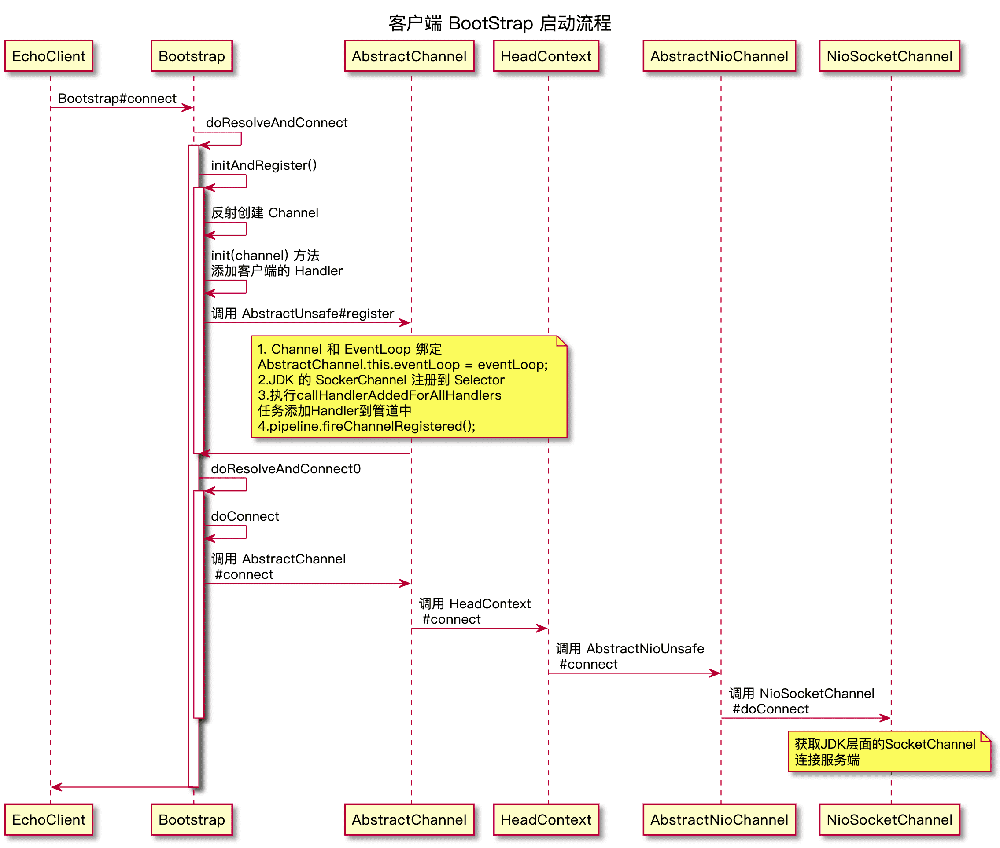

| 版本 | 内容       | 时间                   |
| ---- | ---------- | ---------------------- |
| V1   | 新建       | 2022年3月8日08:47:52   |
| V2   | 增加流程图 | 2022年03月16日15:21:35 |
| V3   | 重构       | 2023年05月15日23:19:44 |

## 客户端代码案例

使用 io.netty.example.echo 包来分析 Netty客户端的代码，针对 io.netty.example.echo.EchoClient 类做了简单的修改。

```java
public final class EchoClient {

    static final boolean SSL = System.getProperty("ssl") != null;
    static final String HOST = System.getProperty("host", "127.0.0.1");
    static final int PORT = Integer.parseInt(System.getProperty("port", "8007"));
    static final int SIZE = Integer.parseInt(System.getProperty("size", "256"));

    public static void main(String[] args) throws Exception {
        // Configure the client.
        EventLoopGroup group = new NioEventLoopGroup();
        try {
            Bootstrap b = new Bootstrap();
            b.group(group)
                .channel(NioSocketChannel.class)
                .option(ChannelOption.TCP_NODELAY, true)
                .handler(new ChannelInitializer<SocketChannel>() {
                    @Override
                    public void initChannel(SocketChannel ch) throws Exception {
                        ChannelPipeline p = ch.pipeline();
                        //p.addLast(new LoggingHandler(LogLevel.INFO));
                        p.addLast(new EchoClientHandler());
                    }
                });

            // Start the client.
            ChannelFuture f = b.connect(HOST, PORT).sync();

            // Wait until the connection is closed.
            f.channel().closeFuture().sync();
        } finally {
            // Shut down the event loop to terminate all threads.
            group.shutdownGracefully();
        }
    }
}
```

## 客户端启动流程概要

客户端的启动流程和服务端的启动流程十分相似，仅部分逻辑不同。本篇会默认你已经了解服务端启动流程，相同的处理逻辑不会重复讲解，或者简单带过。

1. 创建线程组；
2. 创建 Bootstrap 并赋值参数；
3. 反射创建 NioSocketChannel；
4. Channel 绑定 EventLoop；
5. Channel 注册到 Selector 中去；
6. java.nio.channels.SocketChannel#connect 连接服务端；

## 创建线程组

```java
EventLoopGroup group = new NioEventLoopGroup();
```

创建一个 EventLoopGroup 线程组，其实就是一个线程池。

EventLoopGroup 源码分析见相关文章。

## 创建 Bootstrap 并赋值参数

创建 Bootstrap 和赋值的流程与服务端的 ServerBootstrap 基本上相同。例如设置 Channel 类型、客户端的配置、客户端管道的处理器。具体源码分析可以参考服务端 ServerBootstrap 的处理。

## 连接 Bootstrap#connect(String, int)

客户端连接服务端的核心处理逻辑再 Bootstrap#connect(String, int) 方法，该方法最终会调用到 Bootstrap#doResolveAndConnect 方法

```java
/**
 * @see #connect()
 */
private ChannelFuture doResolveAndConnect(final SocketAddress remoteAddress, final SocketAddress localAddress) {
    final ChannelFuture regFuture = initAndRegister();
    final Channel channel = regFuture.channel();

    if (regFuture.isDone()) {
        if (!regFuture.isSuccess()) {
            return regFuture;
        }
        return doResolveAndConnect0(channel, remoteAddress, localAddress, channel.newPromise());
    } else {
        // Registration future is almost always fulfilled already, but just in case it's not.
        final PendingRegistrationPromise promise = new PendingRegistrationPromise(channel);
        regFuture.addListener(new ChannelFutureListener() {
            @Override
            public void operationComplete(ChannelFuture future) throws Exception {
                // Directly obtain the cause and do a null check so we only need one volatile read in case of a
                // failure.
                Throwable cause = future.cause();
                if (cause != null) {
                    promise.setFailure(cause);
                } else {
                    // Registration was successful, so set the correct executor to use.
                    // See https://github.com/netty/netty/issues/2586
                    promise.registered();
                    doResolveAndConnect0(channel, remoteAddress, localAddress, promise);
                }
            }
        });
        return promise;
    }
}
```

可以看到 Bootstrap#doResolveAndConnect 的核心逻辑其实就是两个方法：

- AbstractBootstrap#initAndRegister：和服务端启动是调用的是同一个方法，主要做的就是创建 NioSocketChannel，初始化管道，EventLoop 和 Channel 绑定，添加处理器到管道。其实和服务端做的是相同的事情；
- Bootstrap#doResolveAndConnect0：在 Pipeline 在传递出站的连接事件，最终在 HeadContext 处理对应的逻辑，也就是调用 JDK 的 API 去连接服务端；

关于 AbstractBootstrap#initAndRegister 方法，里面大部分处理流程和服务端的启动流程类似，这里只分析不同的部分，相同的逻辑见服务端启动流程。

### 反射创建 NioSocketChannel

AbstractBootstrap#initAndRegister 中 `channelFactory.newChannel()` 其实就是通过 ChannelFactory 的默认实现 ReflectiveChannelFactory 反射创建 Channel。

对于给出的客户端的案例来说就是反射创建 NioSocketChannel 对象了。

```java
final ChannelFuture initAndRegister() {
    Channel channel = null;
    try {
        // 反射创建Channel对象，使用的是空参构造方法
        channel = channelFactory.newChannel();
        // 初始化Channel，具体实现由客户端和服务端的BootStrap实现
        init(channel);
    } catch (Throwable t) {
        // 省略异常处理代码......
    }

	// 省略注册部分的逻辑代码.....
    
    return regFuture;
}
```

这里就需要去看 NioSocketChannel 的空参构造方法了，如下：newSocket 方法会返回一个 JDK 层面的 SocketChannel 对象。

```java
public NioSocketChannel() {
    this(DEFAULT_SELECTOR_PROVIDER);
}

public NioSocketChannel(SelectorProvider provider) {
    this(newSocket(provider));
}

/**
 * 创建JDK原生的SocketChannel
 *
 * @param provider
 * @return
 */
private static SocketChannel newSocket(SelectorProvider provider) {
    try {
        return provider.openSocketChannel();
    } catch (IOException e) {
        throw new ChannelException("Failed to open a socket.", e);
    }
}
```

构造方法最终会调用到 NioSocketChannel#NioSocketChannel(Channel, SocketChannel)

```java
public NioSocketChannel(Channel parent, SocketChannel socket) {
    super(parent, socket);
    config = new NioSocketChannelConfig(this, socket.socket());
}
```

这里主要分析 super 调用父类的构造方法，第二行的 NioSocketChannelConfig 对象是和内存分配相关的，后面分析内存池的时候再分析。父类构造器 AbstractNioByteChannel#AbstractNioByteChannel

```java
protected AbstractNioByteChannel(Channel parent, SelectableChannel ch) {
    // 参数1 服务端channel
    // 餐数2 原生客户端channel
    // 参数3 是初始化事件
    super(parent, ch, SelectionKey.OP_READ);
}
```

可以看到，还是继续调用父类构造方法，传入一个关键参数 SelectionKey.OP_READ，表示当前 Channel 监听 SelectionKey.OP_READ 事件，需要注意的是在构造方法中并没有立即让 Channel 监听该事件，这里只是保存起来，后续会在 connect 事件中去监听 SelectionKey.OP_READ 事件。

io.netty.channel.nio.AbstractNioChannel#AbstractNioChannel

```java
protected AbstractNioChannel(Channel parent, SelectableChannel ch, int readInterestOp) {
    super(parent);
    this.ch = ch;
    this.readInterestOp = readInterestOp;
    try {
        // Channel设置为非阻塞模式
        ch.configureBlocking(false);
    } catch (IOException e) {
       // 省略异常处理代码.....
    }
}
```

io.netty.channel.AbstractChannel#AbstractChannel(Channel)

```java
protected AbstractChannel(Channel parent) {
    this.parent = parent;
    // 给Channel实例分配一个唯一的ID对象
    id = newId();
    // 封装一个unsafe对象
    // 当Channel是NioServerSocketChannel时，Unsafe实例是NioMessageUnSafe
    // 当Channel是NioSocketChannel时，实例是NioByteUnSafe
    unsafe = newUnsafe();
    // 构建Channel消息处理管道Pipeline
    // 设置好两个节点(默认的处理器)，一个头结点HeadContext，一个尾节点TailContext
    pipeline = newChannelPipeline();
}
```

通过这两个构造方法：

- 保存了当前 Channel 感兴趣的 SelectionKey.OP_READ 事件；
- 将 Channel 设置为非阻塞模式；
- 给 Channel 实例分配一个唯一的 ID 对象；
- 封装一个 unsafe 对象，客户端对应的是 NioByteUnSafe 实例；
- 构建 Channel 消息处理管道 Pipeline，添加 HeadContext 和 TailContext 两个节点；

### Bootstrap#init

前面已经创建好 Channel 和对应的 Pipeline 了，在 Bootstrap#init 方法中，将 Bootstrap 中保存的一些属性和 Channel 关联一下：

```java
@Override
void init(Channel channel) {
    ChannelPipeline p = channel.pipeline();
    p.addLast(config.handler());

    setChannelOptions(channel, newOptionsArray(), logger);
    setAttributes(channel, newAttributesArray());
}
```

这个方法里面主要做了三件事

- 将案例代码 new 出来的匿名类 ChannelInitializer 添加到 Pipeline；

- 赋值 Options 参数；

- 赋值 Attributes 参数；

添加到管道的方法 io.netty.channel.DefaultChannelPipeline#addLast()，需要注意的是，假如当前的 EventLoop 还未绑定到 Channel 上， 那么此时会调用 `callHandlerCallbackLater(newCtx, true)` 方法添加一个任务到单链表中去，后续会在 register0 方法中 会遍历这个链表去操作。（ps.这部分在之前的文章已经详细分析过）

### Channel 绑定 EventLoop

客户端的初始化动作最终会走到 AbstractUnsafe#register 方法，省略部分代码：

```java
@Override
public final void register(EventLoop eventLoop, final ChannelPromise promise) {
	// ......省略部分校验代码.....    

    // 绑定Channel和EventLoop的关系
    // 后续Channel上的事件或者任务都会用这个EventLoop线程去处理
    AbstractChannel.this.eventLoop = eventLoop;

    // 当前线程是否是当前EventLoop线程自己
    // 目的是，为了线程安全，最终都是EventLoop这个线程去执行注册
    if (eventLoop.inEventLoop()) {
        register0(promise);
    } else {
        try {
            // 将注册的任务提交到eventLoop的队列中
            eventLoop.execute(new Runnable() {
                @Override
                public void run() {
                    register0(promise);
                }
            });
        } catch (Throwable t) {
            // ......省略异常校验代码......
        }
    }
}
```

### AbstractUnsafe#register0

在客户端 Channel 绑定 EventLoop 后，会走到 AbstractUnsafe#register0 方法，这部分逻辑大部分和服务端启动流程的逻辑是一样的，

```java
private void register0(ChannelPromise promise) {
    try {
        // ......省略校验相关的逻辑代码......
        
        boolean firstRegistration = neverRegistered;
        // 模板方法-子类实现
        doRegister();
        // 表示不是第一次实现
        neverRegistered = false;
        // 表示当前Channel已经注册到Selector了
        registered = true;

        // 确保在通道未注册前添加到管道上的 ChannelHandler 的 handlerAdded(…) 也会被调用
        // 这是必需的，因为用户可能已经通过ChannelFutureListener中的管道触发了事件。
        pipeline.invokeHandlerAddedIfNeeded();

        // 设置promise结果为成功，notifyAll等待的线程，回调注册相关的promise的Listener
        safeSetSuccess(promise);
        // 向当前Channel的pipeline发起一个 注册完成事件， 关注这个事件的handlder可以做一些自己的事情
        pipeline.fireChannelRegistered();
        if (isActive()) {
            // firstRegistration 客户端是true 服务端是false
            if (firstRegistration) {
                pipeline.fireChannelActive();
            } else if (config().isAutoRead()) {
                beginRead();
            }
        }
    } catch (Throwable t) {
       // ......省略异常处理逻辑代码......
    }
}
```

（1）doRegister 方法里面就是将 JDK 层面的 Channel 注册到 JDK 层面的 Selector 上去了。

（2）pipeline 的 invokeHandlerAddedIfNeeded 方法。前面已经分析过，此处的 invokeHandlerAddedIfNeeded 方法会拿到 pendingHandlerCallbackHead， 遍历这个链表，并执行里面的任务。然后会调用 AbstractChannelHandlerContext#callHandlerAdded 方法， 最终调用到了 ChannelInitializer 的 handlerAdded 方法，在里面调用了我们在代码案例中的 initChannel 方法。**最终会将 ChannelInitializer 从管道移除。**也就是这个 ChannelInitializer 里的 initChannel 方法。

```java
Bootstrap b = new Bootstrap();
b.group(group)
    .channel(NioSocketChannel.class)
    .option(ChannelOption.TCP_NODELAY, true)
    .handler(new ChannelInitializer<SocketChannel>() {
        @Override
        public void initChannel(SocketChannel ch) throws Exception {
            ChannelPipeline p = ch.pipeline();
            //p.addLast(new LoggingHandler(LogLevel.INFO));
            p.addLast(new EchoClientHandler());
        }
    });
```

（3） `safeSetSuccess(promise)` 设置 promise 结果为成功，notifyAll 等待的线程，回调注册相关的 promise 的 Listener。

（4）`pipeline.fireChannelRegistered()` 向当前 Channel 的 pipeline 发起一个注册完成事件， 关注这个事件的 handlder 可以做一些自己的事情。

### Bootstrap#doResolveAndConnect0

前面已经把 AbstractBootstrap#initAndRegister 分析完了，接下来分析 Bootstrap#doResolveAndConnect0 方法。该方法最终调用 Bootstrap#doConnect 方法

```java
private static void doConnect(
        final SocketAddress remoteAddress, final SocketAddress localAddress, final ChannelPromise connectPromise) {

    // This method is invoked before channelRegistered() is triggered.  Give user handlers a chance to set up
    // the pipeline in its channelRegistered() implementation.
    final Channel channel = connectPromise.channel();
    channel.eventLoop().execute(new Runnable() {
        @Override
        public void run() {
            if (localAddress == null) {
                channel.connect(remoteAddress, connectPromise);
            } else {
                channel.connect(remoteAddress, localAddress, connectPromise);
            }
            connectPromise.addListener(ChannelFutureListener.CLOSE_ON_FAILURE);
        }
    });
}
```

主要是向 NioEventLoop 提交一个任务，在 NioEventLoop 的 run 方法中执行任务，调用 NioSocketChannel 的 AbstractChannel#connect方法。

```java
/** AbstractChannel#connect  */
@Override
public ChannelFuture connect(SocketAddress remoteAddress, ChannelPromise promise) {
    return pipeline.connect(remoteAddress, promise);
}
```

可以看到，在 Pipeline 中传播连接的事件，因为是出站事件，所以最终会调到 HeadContext#connect 方法中。

```java
/** HeadContext#connect  */
@Override
public void connect(
        ChannelHandlerContext ctx,
        SocketAddress remoteAddress, SocketAddress localAddress,
        ChannelPromise promise) {
    unsafe.connect(remoteAddress, localAddress, promise);
}
```

后续调用 AbstractNioChannel.AbstractNioUnsafe#connect，在该方法中会调用模板方 AbstractNioChannel#doConnect，具体由子类实现，例如 NioSocketChannel#doConnect

```java
/**
 * 与服务端连接
 *
 * @param remoteAddress
 * @param localAddress
 * @return
 * @throws Exception
 */
@Override
protected boolean doConnect(SocketAddress remoteAddress, SocketAddress localAddress) throws Exception {
    if (localAddress != null) {
        // 先绑定底层NIO通道的本地地址
        doBind0(localAddress);
    }

    boolean success = false;
    try {
        // 获取JDK层面的SocketChannel，进行连接
        // 调用 connect 后除非立马能连接则返回 true，否则返回 false。连接是否能个建立要通过后续的 finshConnect 判断
        boolean connected = SocketUtils.connect(javaChannel(), remoteAddress);
        if (!connected) {
            // 没有连接成功，就将 SelectionKey 关注连接事件 OP_CONNECT
            selectionKey().interestOps(SelectionKey.OP_CONNECT);
        }
        success = true;
        return connected;
    } finally {
        if (!success) {
            doClose();
        }
    }
}
```

## 小结

