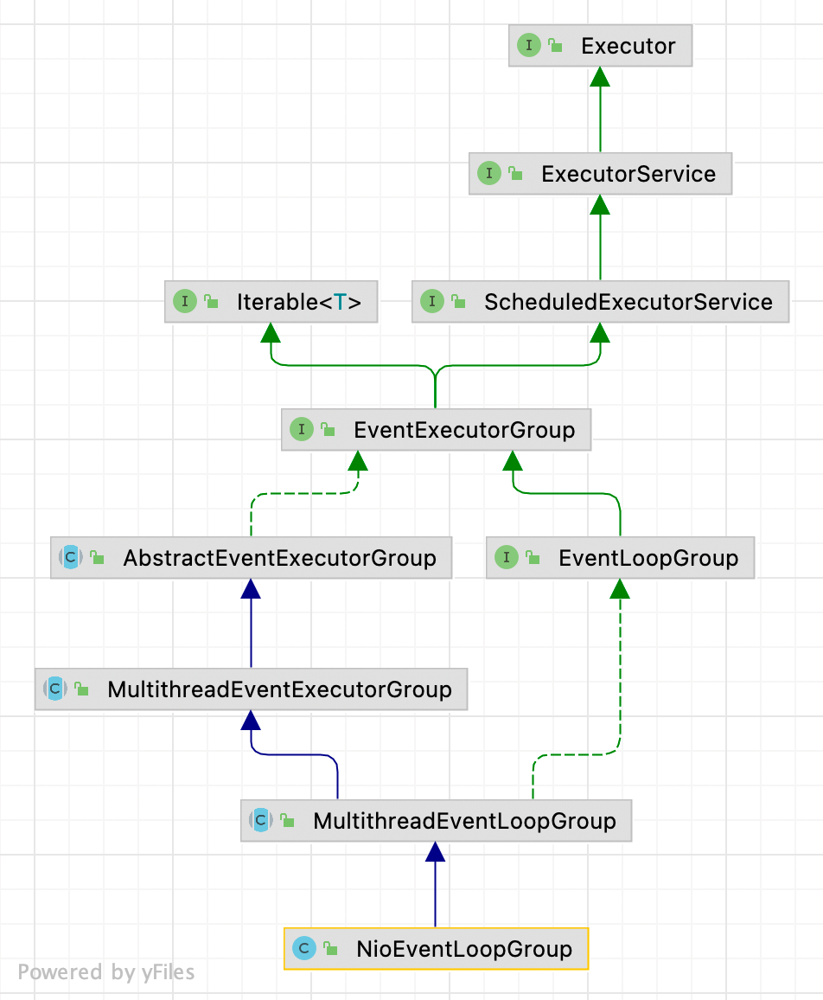
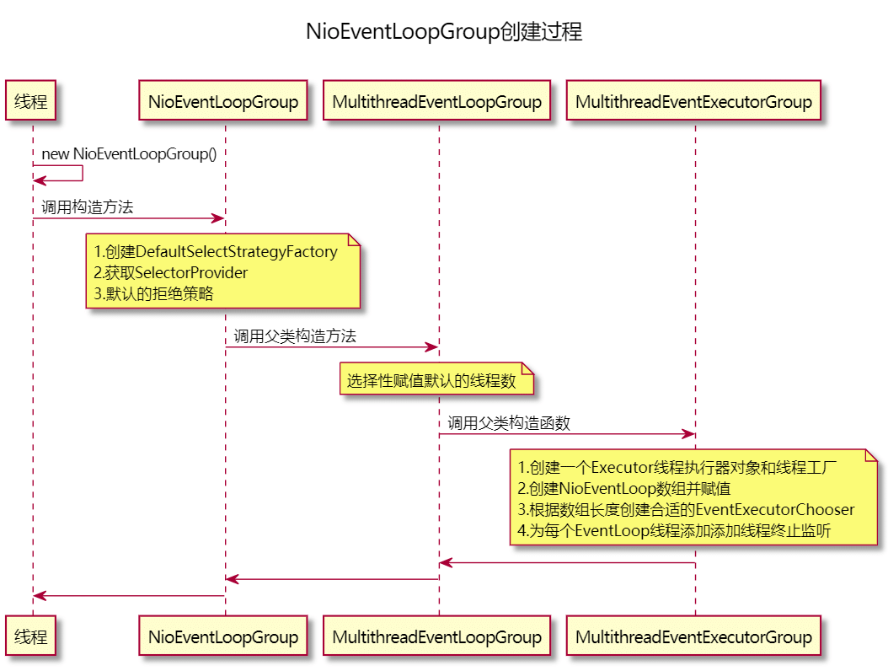
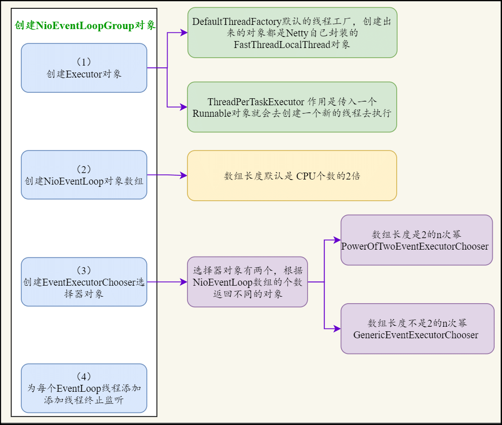

| 版本 | 内容 | 时间                   |
| ---- | ---- | ---------------------- |
| V1   | 新建 | 2021年12月19日21:53:39 |
| V2   | 重构 | 2023年05月18日23:24:27 |

## NioEventLoopGroup 继承关系



NioEventLoopGroup 和 NioEventLoop 继承体系其实大差不差，实现的接口基本上都一样，只是抽象实现类不太一样。NioEventLoopGroup 涉及的相关抽象类如下：

- io.netty.util.concurrent.AbstractEventExecutorGroup：提供一些执行任务和生命周期的方法，主要是使用 next() 方法从管理的 EventLoop 中获取其中的一个，去调用对应的 API；
- io.netty.util.concurrent.MultithreadEventExecutorGroup：提供管理 EventLoop 的功能（创建容器，就是一个数组）；
- io.netty.channel.MultithreadEventLoopGroup：提供向 EventLoop 注册 Channel 的功能（绑定关系）；
- io.netty.channel.nio.NioEventLoopGroup：提供创建 EventLoop 的功能；

NioEventLoopGroup 比较简单，下面从 NioEventLoopGroup 的创建来分析。

## NioEventLoopGroup 的创建

### NioEventLoopGroup 构造函数调用流程

从空参构造函数说起：

```java
public NioEventLoopGroup() {
    this(0);
}
```

在 NioEventLoopGroup 类中，最后会调到下面的构造函数

```java
public NioEventLoopGroup(int nThreads, Executor executor, final SelectorProvider 			  selectorProvider,final SelectStrategyFactory selectStrategyFactory) {
    // 最后一个参数是 线程池的拒绝策略
    super(nThreads, executor, selectorProvider, selectStrategyFactory, RejectedExecutionHandlers.reject());
}
```

接着调用父类构造函数，也就是 io.netty.channel.MultithreadEventLoopGroup 的构造函数：

```java
protected MultithreadEventLoopGroup(int nThreads, Executor executor, Object... args) {
    super(nThreads == 0 ? DEFAULT_EVENT_LOOP_THREADS : nThreads, executor, args);
}
```

关于 DEFAULT_EVENT_LOOP_THREADS 的值，默认是 CPU 的个数的两倍，这也就是说**默认情况下，NioEventLoopGroup 会创建 CPU 个数两倍的 EventLoop。**

```java
/**
 * EventLoop的默认线程数量 最小值是1
 *
 * 首先去拿 io.netty.eventLoopThreads：环境配置默认线程数
 * 假如没有配置 io.netty.eventLoopThreads， 默认为当前CPU的核心数的两倍
 */
private static final int DEFAULT_EVENT_LOOP_THREADS;

static {
    DEFAULT_EVENT_LOOP_THREADS = Math.max(1, SystemPropertyUtil.getInt(
            "io.netty.eventLoopThreads", NettyRuntime.availableProcessors() * 2));

    if (logger.isDebugEnabled()) {
        logger.debug("-Dio.netty.eventLoopThreads: {}", DEFAULT_EVENT_LOOP_THREADS);
    }
}
```

构造函数继续调用父类的构造函数，最后会到 io.netty.util.concurrent.MultithreadEventExecutorGroup，如下：

```java
protected MultithreadEventExecutorGroup(int nThreads, Executor executor,
                                        EventExecutorChooserFactory chooserFactory, Object... args) {
    checkPositive(nThreads, "nThreads");

    if (executor == null) {
        // 创建一个Executor执行器对象和线程工厂
        executor = new ThreadPerTaskExecutor(newDefaultThreadFactory());
    }

    children = new EventExecutor[nThreads];

    // 根据线程数循环创建EventExecutor
    for (int i = 0; i < nThreads; i ++) {
        boolean success = false;
        try {
            /*
             * 模板方法模式: 初始化线程组的线程
             * NioEventLoopGroup调用时参数为：
             *    args[0]是 SelectorProvider
             *    args[1]是 SelectStrategyFactory
             *    args[2]是 线程池拒绝策略
             */
            children[i] = newChild(executor, args);
            success = true;
        } catch (Exception e) {
            // TODO: Think about if this is a good exception type
            throw new IllegalStateException("failed to create a child event loop", e);
        } finally {
            // 假如初始化关闭失败，需要优雅的关闭，清理资源
            if (!success) {
                for (int j = 0; j < i; j ++) {
                    children[j].shutdownGracefully();
                }

                for (int j = 0; j < i; j ++) {
                    EventExecutor e = children[j];
                    try {
                        // 当线程没有终止时，等待终止
                        while (!e.isTerminated()) {
                            e.awaitTermination(Integer.MAX_VALUE, TimeUnit.SECONDS);
                        }
                    } catch (InterruptedException interrupted) {
                        // Let the caller handle the interruption.
                        Thread.currentThread().interrupt();
                        break;
                    }
                }
            }
        }
    }

    // 通过ChooserFactory根据当前Children的数量，构建一个合适的Chooser实例
    // Chooser是用来选择NioEventLoop
    chooser = chooserFactory.newChooser(children);

    final FutureListener<Object> terminationListener = new FutureListener<Object>() {
        @Override
        public void operationComplete(Future<Object> future) throws Exception {
            if (terminatedChildren.incrementAndGet() == children.length) {
                terminationFuture.setSuccess(null);
            }
        }
    };

    // 为每个EventLoop线程添加添加线程终止监听
    for (EventExecutor e: children) {
        e.terminationFuture().addListener(terminationListener);
    }

    Set<EventExecutor> childrenSet = new LinkedHashSet<EventExecutor>(children.length);
    Collections.addAll(childrenSet, children);
    // 执行器只读副本
    readonlyChildren = Collections.unmodifiableSet(childrenSet);
}
```

这个方法有点长，简单流程就是：

- **创建一个 Executor 线程执行器对象和线程工厂；**
- **创建指定数量的 NioEventLoop 线程数组并初始化；**
- **创建线程选择器 EventExecutorChooser，通过 EventExecutorChooser 选择一个线程；**
- 为每个 EventLoop 线程添加添加线程终止监听；

下面逐步分析 NioEventLoopGroup 的创建流程。



### 线程工厂 DefaultThreadFactory

在上面的构造函数中，假如构造函数传入的 Executor 对象为 null，则会去创建一个线程工厂。

```java
if (executor == null) {
    // 创建一个Executor执行器对象和线程工厂
    executor = new ThreadPerTaskExecutor(newDefaultThreadFactory());
}
```

**newDefaultThreadFactory() 方法会创建一个 DefaultThreadFactory 默认的线程工厂类。**

沿着方法调用一直到 io.netty.util.concurrent.DefaultThreadFactory#DefaultThreadFactory(String, boolean, int, ThreadGroup)，如下所示

```java
public DefaultThreadFactory(String poolName, boolean daemon, int priority, ThreadGroup threadGroup) {
    ObjectUtil.checkNotNull(poolName, "poolName");

    // 校验优先级
    if (priority < Thread.MIN_PRIORITY || priority > Thread.MAX_PRIORITY) {
        throw new IllegalArgumentException(
                "priority: " + priority + " (expected: Thread.MIN_PRIORITY <= priority <= Thread.MAX_PRIORITY)");
    }

    // 线程池前缀  "类简单名称-自增ID-"
    prefix = poolName + '-' + poolId.incrementAndGet() + '-';
    this.daemon = daemon;
    this.priority = priority;
    this.threadGroup = threadGroup;
}
```

**通过DefaultThreadFactory默认工厂创建出来的线程都是 FastThreadLocalThread 线程对象。**

```java
/**
 * 创建一个线程 类型:FastThreadLocalThread
 */
@Override
public Thread newThread(Runnable r) {
    Thread t = newThread(FastThreadLocalRunnable.wrap(r), prefix + nextId.incrementAndGet());
    try {
        if (t.isDaemon() != daemon) {
            t.setDaemon(daemon);
        }

        if (t.getPriority() != priority) {
            t.setPriority(priority);
        }
    } catch (Exception ignored) {
        // Doesn't matter even if failed to set.
    }
    return t;
}

protected Thread newThread(Runnable r, String name) {
    return new FastThreadLocalThread(threadGroup, r, name);
}
```

### ThreadPerTaskExecutor 执行器

这个执行器十分简单，**每来一个 Runnable 任务就会开一个新的线程去执行**。

```java
public final class ThreadPerTaskExecutor implements Executor {
    // 线程工厂
    private final ThreadFactory threadFactory;

    public ThreadPerTaskExecutor(ThreadFactory threadFactory) {
        this.threadFactory = ObjectUtil.checkNotNull(threadFactory, "threadFactory");
    }

    /**
     * 线程工厂创建一个线程去执行任务
     *
     * @param command 任务对象
     */
    @Override
    public void execute(Runnable command) {
        threadFactory.newThread(command).start();
    }
}
```

### 创建 EventExecutor 线程数组

经过前面的操作，已经获取到了 Executor 执行器对象了，现在需要创建的是 EventExecutor 数组。

- **第一步，创建指定长度的 EventExecutor 数组，长度为线程数；**
-  **第二步，调用子类的 newChild() 方法完成这些 EventExecutor 数组的初始化 ；**

```java
children = new EventExecutor[nThreads];

// 根据线程数循环创建EventExecutor
for (int i = 0; i < nThreads; i ++) {
    /*
     * 模板方法模式: 初始化线程组的线程
     * NioEventLoopGroup调用时参数为：
     *    args[0]是 SelectorProvider
     *    args[1]是 SelectStrategyFactory
     *    args[2]是 线程池拒绝策略
     */
    children[i] = newChild(executor, args);
}
```

此处我们看 NioEventLoopGroup 的 newChild() 方法的实现。

```java
@Override
protected EventLoop newChild(Executor executor, Object... args) throws Exception {
    // 获取可变参数的数据
    SelectorProvider selectorProvider = (SelectorProvider) args[0];
    SelectStrategyFactory selectStrategyFactory = (SelectStrategyFactory) args[1];
    RejectedExecutionHandler rejectedExecutionHandler = (RejectedExecutionHandler) args[2];
    EventLoopTaskQueueFactory taskQueueFactory = null;
    EventLoopTaskQueueFactory tailTaskQueueFactory = null;

    int argsLength = args.length;
    if (argsLength > 3) {
        taskQueueFactory = (EventLoopTaskQueueFactory) args[3];
    }
    if (argsLength > 4) {
        tailTaskQueueFactory = (EventLoopTaskQueueFactory) args[4];
    }
    // 参数一：当前NioEventLoopGroup
    // 参数二：ThreadPerTaskExecutor
    // 参数三：selectorProvider，选择器提供器
    // 参数四：选择器工作策略 DefaultSelectStrategy  再NIoEventLoop的run()方法中用于控制选择循环
    // 参数五：线程池拒绝策略
    // 参数六和七：一般正常情况下是null，除非argsLength > 3，或者argsLength > 4
    return new NioEventLoop(this, executor, selectorProvider,
            selectStrategyFactory.newSelectStrategy(),
            rejectedExecutionHandler, taskQueueFactory, tailTaskQueueFactory);
}
```

直接调用了 NioEventLoop 的构造函数，参数分别表示

- 参数一：**当前 NioEventLoopGroup 线程组本身；**
- 参数二：**线程执行器 ThreadPerTaskExecutor，用于创建线程并执行任务。在 SingleThreadEventExecutor 的doStartThread() 方法中被调用；**
- 参数三：**selectorProvider，选择器提供器；**
- 参数四：**选择器工作策略 DefaultSelectStrategy 再 NioEventLoop 的 run() 方法中用于控制选择循环；**
- 参数五：**线程池拒绝策略；**
- 参数六和七：**一般正常情况下是 null，除非 argsLength > 3，或者argsLength > 4；**

### EventExecutorChooser 线程选择器

```java
// 通过ChooserFactory根据当前Children的数量，构建一个合适的Chooser实例
// Chooser是用来选择NioEventLoop
chooser = chooserFactory.newChooser(children);
```

DefaultEventExecutorChooserFactory 选择器工厂中的 newChooser 方法，根据传入线程数组的大小创建合适的EventExecutorChooser 选择器对象。

```java
@Override
public EventExecutorChooser newChooser(EventExecutor[] executors) {
    if (isPowerOfTwo(executors.length)) {
        return new PowerOfTwoEventExecutorChooser(executors);
    } else {
        return new GenericEventExecutorChooser(executors);
    }
}
```

- 假如 executors 线程数组的大小是2的n次幂，就会创建 PowerOfTwoEventExecutorChooser 选择器；
- 假如 executors 线程数组的大小不是2的n次幂，就会创建 GenericEventExecutorChooser 选择器；

这两个选择器实现的功能是一样的，按照是否是 **2 的 n 次幂来区分选择器是因为取模 % 操作的性能比位运算 & 低很多**。

###  terminationListener 设置终止监听器

如果 EventLoop 线程要终止的时候，就会有回调

```java
final FutureListener<Object> terminationListener = new FutureListener<Object>() {
    @Override
    public void operationComplete(Future<Object> future) throws Exception {
        if (terminatedChildren.incrementAndGet() == children.length) {
            terminationFuture.setSuccess(null);
        }
    }
};

// 为每个EventLoop线程添加添加线程终止监听
for (EventExecutor e: children) {
    e.terminationFuture().addListener(terminationListener);
}
```

## 小结

本篇主要讲了 NioEventLoopGroup 对象的创建过程。

