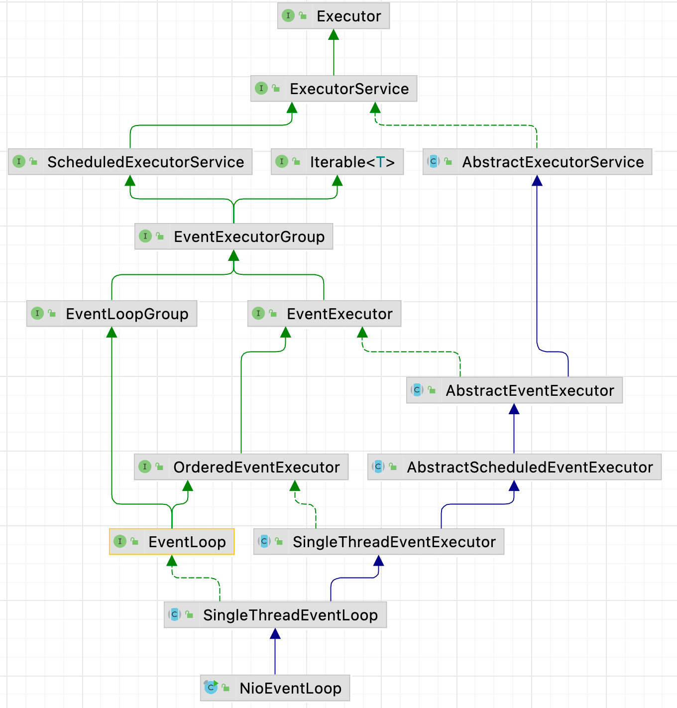

| 版本 | 内容               | 时间                   |
| ---- | ------------------ | ---------------------- |
| V1   | EventExecutorGroup | 2022年1月27日11:38:16  |
| V2   | 新增相关接口       | 2022年1月27日12:29:06  |
| V3   | 重构               | 2023年05月16日00:12:52 |

## NioEventLoop 继承体系



## NioEventLoop 父接口

NioEventLoop 的继承体系中，它的父接口如下：

- java.util.concurrent.Executor：JDK 提供的执行器的顶级接口；
- java.util.concurrent.ExecutorService：继承 Executor 接口，额外提供了一些线程池生命周期的方法；
- java.util.concurrent.ScheduledExecutorService：JDK 的调度线程池的接口，提供了一些周期、延迟的 API；
- java.lang.Iterable：JDK 的迭代接口；
- io.netty.util.concurrent.EventExecutorGroup：Netty 的接口，主要提供了一个 next 方法，用于获取池中的某个执行器；
- io.netty.channel.EventLoopGroup：主要提供了 Channel 绑定执行器的 register 方法；
- io.netty.util.concurrent.EventExecutor：主要提供一个 inEventLoop 方法，用于判断当前执行线程是不是指定的线程；
- io.netty.util.concurrent.OrderedEventExecutor：仅仅是一个标记接口；
- io.netty.channel.EventLoop：提供方法，返回当前 EventLoop 实例是属于那个 EventLoopGroup 管理的；

## EventExecutorGroup 接口

### 概要

继承体系：

```java
public interface EventExecutorGroup extends ScheduledExecutorService, Iterable<EventExecutor> {
}
```

该接口主要提供了下面的 API：

- EventExecutorGroup 通过 next 方法提供 EventExecutor 实例；
- 除此之外，EventExecutorGroup 还负责处理它们的生命周期并允许以全局方式关闭它们；
- EventExecutorGroup 中重写了 ScheduledExecutorService 接口中的一些方法，修改了方法的返回值；

### 接口源码

```java
public interface EventExecutorGroup extends ScheduledExecutorService, Iterable<EventExecutor> {

    /**
     * 当且仅当该 EventExecutorGroup 管理的所有 EventExecutor
     * 都使用 `shutdownGracefully()` 或者 `isShutdown()` 关闭时 才返回true。
     */
    boolean isShuttingDown();

    /**
     * 优雅地关闭 EventExecutorGroup
     * 使用默认值调用 shutdownGracefully(long, long, TimeUnit) 方法
     * 返回值就是 terminationFuture() 方法返回值
     */
    Future<?> shutdownGracefully();

    /**
     * 向此执行程序发出信号，表明调用者希望关闭执行程序。
     * 一旦调用此方法， isShuttingDown()开始返回true ，并且执行程序准备关闭自己。
     * 与shutdown()不同，优雅关机确保在它自己关闭之前，在“安静期” （通常是几秒钟）内不会提交任何任务。
     * 如果在静默期提交任务，则保证被接受，静默期将重新开始
     */
    Future<?> shutdownGracefully(long quietPeriod, long timeout, TimeUnit unit);

    /**
     * 当该 EventExecutorGroup 管理的所有 EventExecutor 被终止时，该Future会被通知。
     */
    Future<?> terminationFuture();

    /**
     * @deprecated {@link #shutdownGracefully(long, long, TimeUnit)} or {@link #shutdownGracefully()} instead.
     */
    @Override
    @Deprecated
    void shutdown();

    /**
     * @deprecated {@link #shutdownGracefully(long, long, TimeUnit)} or {@link #shutdownGracefully()} instead.
     */
    @Override
    @Deprecated
    List<Runnable> shutdownNow();

    /**
     * 返回该 EventExecutorGroup 所管理的一个 EventExecutor 实例
     */
    EventExecutor next();

    @Override
    Iterator<EventExecutor> iterator();

    @Override
    Future<?> submit(Runnable task);

    @Override
    <T> Future<T> submit(Runnable task, T result);

    @Override
    <T> Future<T> submit(Callable<T> task);

    @Override
    ScheduledFuture<?> schedule(Runnable command, long delay, TimeUnit unit);

    @Override
    <V> ScheduledFuture<V> schedule(Callable<V> callable, long delay, TimeUnit unit);

    @Override
    ScheduledFuture<?> scheduleAtFixedRate(Runnable command, long initialDelay, long period, TimeUnit unit);

    @Override
    ScheduledFuture<?> scheduleWithFixedDelay(Runnable command, long initialDelay, long delay, TimeUnit unit);
}
```

### 扩展的方法

**（1）shutdownGracefully 关闭系列方法。**

- `Future<?> shutdownGracefully();`

- `Future<?> shutdownGracefully(long quietPeriod, long timeout, TimeUnit unit);`

在 ScheduledExecutorService 接口中本来也有关闭执行器的 shutdown 和 shutdownNow 方法。shutdownGracefully 方法和它们的区别是在执行器关闭这段时间内，假如有任务添加，它也保证任务被接收。

**（2）isShuttingDown 方法**

表示 EventExecutorGroup 中的所有的执行器 EventExecutor 正在进行关闭，也就是调用了 shutdown 系列方法。

**（3）terminationFuture方法**

当 EventExecutorGroup 中所有的执行器 EventExecutor 都被关闭时会返回一个 Future 通知。

**（4）next 方法**

EventExecutorGroup 中管理多个执行器 EventExecutor，next 方法的作用是返回一个执行器对象。

### 重写的方法 

在 EventExecutorGroup 接口中重写了一些提交任务的方法。主要是将方法的返回值由 JDK 的（Future 和 ScheduledFuture）对象改为了 Netty 自己的（Future 和 ScheduledFuture）对象。如下：

```java
@Override
Future<?> submit(Runnable task);
```

## EventLoopGroup 接口

EventLoopGroup 接口**主要提供了 Channel 绑定执行器的 register 方法**。这样事件执行器就可以处理通道 Channel 的 I/O 操作，也就变成了事件轮询器 EventLoop。

```java
public interface EventLoopGroup extends EventExecutorGroup {
    /**
     * 返回下一个 EventLoop
     * 复写了 EventExecutorGroup 的方法，改变了返回值类型
     */
    @Override
    EventLoop next();

    /**
     * 向这个EventLoop注册一个Channel，一旦注册完成，返回的 ChannelFuture 将得到通知。
     */
    ChannelFuture register(Channel channel);

    /**
     * 使用参数 ChannelPromise 向 EventLoop 注册一个Channel。 
     * （ChannelPromise类中包含一个Channel）
     * 一旦注册完成，传递的 ChannelPromise 将得到通知，返回的 ChannelFuture 也将得到通知。
     */
    ChannelFuture register(ChannelPromise promise);

    @Deprecated
    ChannelFuture register(Channel channel, ChannelPromise promise);
}
```

## EventExecutor 接口

EventExecutor 接口主要提供了 inEventLoop 方法，用于判断当前执行代码的线程是否是指定线程。

```java
public interface EventExecutor extends EventExecutorGroup {

    /**
     * 返回自己
     */
    @Override
    EventExecutor next();

    /**
     * 返回管理该事件执行器EventExecutor的父EventExecutorGroup
     */
    EventExecutorGroup parent();

    /**
     * 相当于 inEventLoop(Thread.currentThread())
     */
    boolean inEventLoop();

    /**
     * 如果给定的Thread在事件循环中执行，则返回true否则返回false 。
     */
    boolean inEventLoop(Thread thread);

    /**
     * 返回一个新的 Promise 实例
     */
    <V> Promise<V> newPromise();

    /**
     * 返回一个新的 ProgressivePromise 实例
     */
    <V> ProgressivePromise<V> newProgressivePromise();

    /**
     * 创建一个新的已经标记为成功的 Future，所以Future.isSuccess()将返回true 。
     * 所有添加到它的FutureListener都会被直接通知。 此外，所有阻塞方法的调用都不会阻塞直接返回
     */
    <V> Future<V> newSucceededFuture(V result);

    /**
     * 创建一个新的已标记为失败的Future，所以Future.isSuccess()将返回false 。
     * 所有添加到它的FutureListener都会被直接通知。 此外，每次调用阻塞方法都会返回而不会阻塞
     */
    <V> Future<V> newFailedFuture(Throwable cause);
}
```

Q：EventExecutor  继承 EventExecutorGroup 接口，那么可能有疑问 EventExecutor 是不是也可以管理一些 EventExecutor  对象？

A：理论是是可行的，但是在一般情况下，在实现 EventExecutor  接口时，EventExecutor#next 返回的就是它自身。

## EventLoop 接口

EventLoop 接口比较简单，主要就是提供了一个 parent 方法，该方法返回当前 EventLoop 实例是被那个 EventLoopGroup 管理的

```java
public interface EventLoop extends OrderedEventExecutor, EventLoopGroup {
    /**
     * 返回管理该事件执行器EventLoop的父EventLoopGroup
     */
    @Override
    EventLoopGroup parent();
}
```
