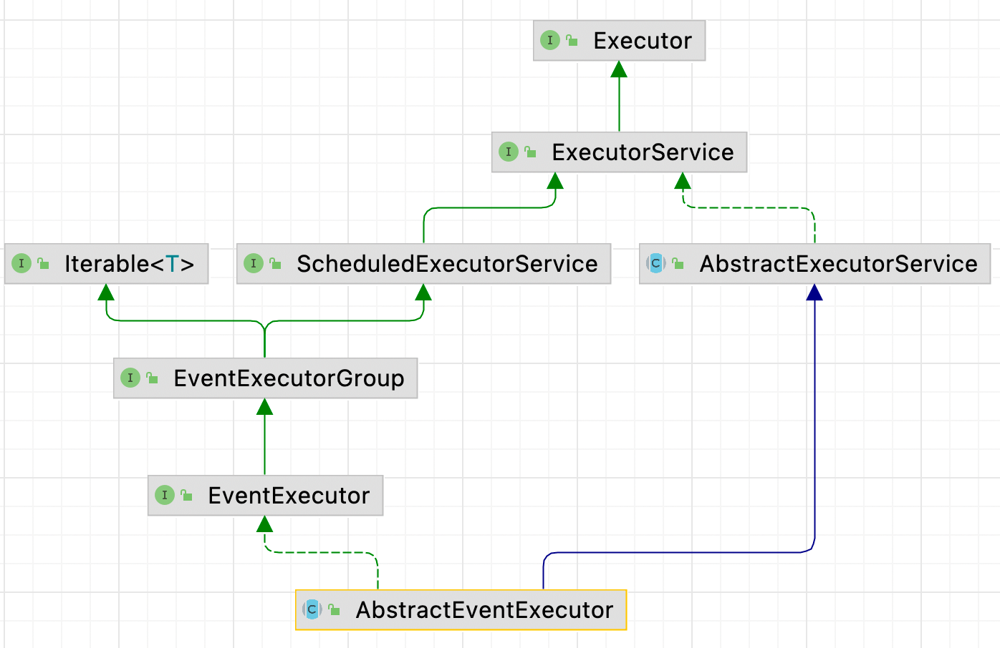

| 版本 | 内容                                   | 时间                   |
| ---- | -------------------------------------- | ---------------------- |
| V1   | 新建                                   | 2022年1月27日15:46:31  |
| V2   | 增加 shutdownGracefully 方法的参数含义 | 2022年2月18日16:03:33  |
| V3   | 重构                                   | 2023年05月16日20:11:48 |

## 继承体系



抽象类 AbstractEventExecutor 

- 是 io.netty.util.concurrent.EventExecutor 的实现类；
- 继承 java.util.concurrent.AbstractExecutorService 类；

## 基本功能

1. 实现了接口的抽象方法，如 inEventLoop 方法和一些创建 Future 通知对象的方法；
2. 重写了继承自 AbstractEventExecutor 的一些方法，把它们的返回值改成 netty 自己实现的类。如`Future<?> submit(Runnable task)`；
3. AbstractEventExecutor 抽象类不支持延时和周期性任务；

### 实现的主要的抽象方法

主要实现了io.netty.util.concurrent.EventExecutor 和 io.netty.util.concurrent.EventExecutorGroup 的一些抽象方法

实现了 io.netty.util.concurrent.EventExecutor 接口的重要的方法如下：

- AbstractEventExecutor#inEventLoop：判断当前执行代码的线程是否是当前线程，实现如下：

  ```java
  @Override
  public boolean inEventLoop() {
      return inEventLoop(Thread.currentThread());
  }
  ```

- 还有一堆创建 Future 对象的方法：如：

  ```java
  @Override
  public <V> Promise<V> newPromise() {
      return new DefaultPromise<V>(this);
  }
  
  @Override
  public <V> ProgressivePromise<V> newProgressivePromise() {
      return new DefaultProgressivePromise<V>(this);
  }
  
  @Override
  public <V> Future<V> newSucceededFuture(V result) {
      return new SucceededFuture<V>(this, result);
  }
  
  @Override
  public <V> Future<V> newFailedFuture(Throwable cause) {
      return new FailedFuture<V>(this, cause);
  }
  ```

- 关于 AbstractEventExecutor#shutdownGracefully 空参方法，有几个默认参数

  ```java
  // 调用 shutdownGracefully 方法默认安静期时间
  static final long DEFAULT_SHUTDOWN_QUIET_PERIOD = 2;
  // 调用 shutdownGracefully 方法默认 shutdown 超时时间
  static final long DEFAULT_SHUTDOWN_TIMEOUT = 15;
  
  @Override
  public Future<?> shutdownGracefully() {
      return shutdownGracefully(DEFAULT_SHUTDOWN_QUIET_PERIOD, DEFAULT_SHUTDOWN_TIMEOUT, TimeUnit.SECONDS);
  }
  ```

  -  **在静默期 2 秒内如果没有新的任务提交，则关闭**线程池;

  -  **每隔静默期 2 秒内有新的任务提交了，此时会添加 WAKEUP_TASK 任务唤醒线程去执行任务；** 

  -  **无论在静默期内是否有提交任务，超过 15 秒就不允许提交任务了；** 


实现  io.netty.util.concurrent.EventExecutorGroup，这个接口提供了线程池的生命周期的一些方法，在抽象类 AbstractEventExecutor 中其实也没怎么实现这些方法，只是做了一些返回值的转换，例如把接口的返回值 JDK 的 Future 对象，转为 Netty 自己实现的 Future 对象，例如：

```java
/**
 * 要将返回值变成 netty 的 Future
 */
@Override
public Future<?> submit(Runnable task) {
    return (Future<?>) super.submit(task);
}
```

另外：AbstractEventExecutor 不支持延时和周期性任务，例如：

```java
@Override
public ScheduledFuture<?> scheduleAtFixedRate(Runnable command, long initialDelay, long period, TimeUnit unit) {
    throw new UnsupportedOperationException();
}
```

### 标记接口 LazyRunnable

在 AbstractEventExecutor 中有个标记接口 LazyRunnable。

```java
/**
 * Marker interface for {@link Runnable} to indicate that it should be queued for execution
 * but does not need to run immediately.
 *
 * Runnable标记接口，指示它应该排队等待执行但不需要立即运行。
 */
@UnstableApi
public interface LazyRunnable extends Runnable { }
```

## 小结

**AbstractEventExecutor 类主要还是实现父接口一些简单的抽象方法，其中需要注意的就是 shutdownGracefully 空参方法。具体见上面的分析。**