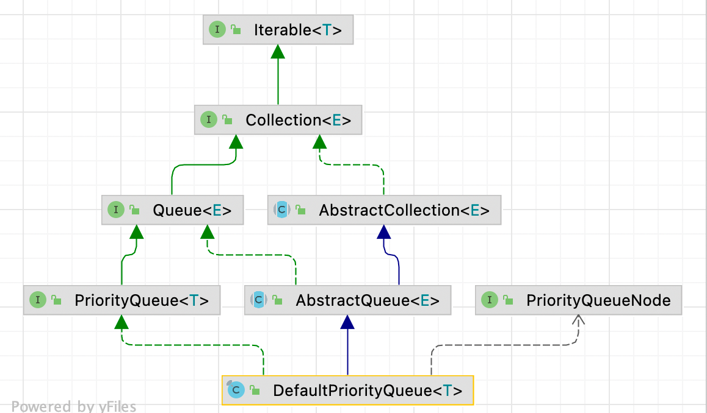
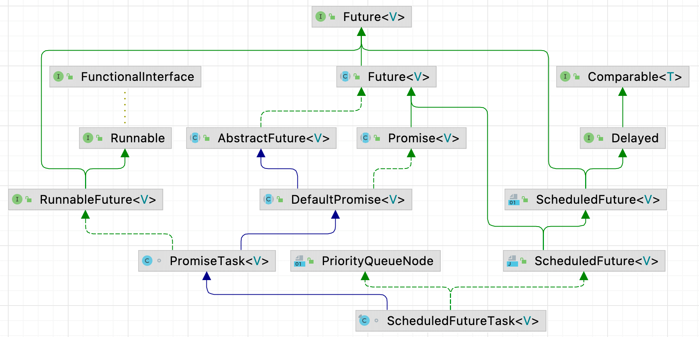
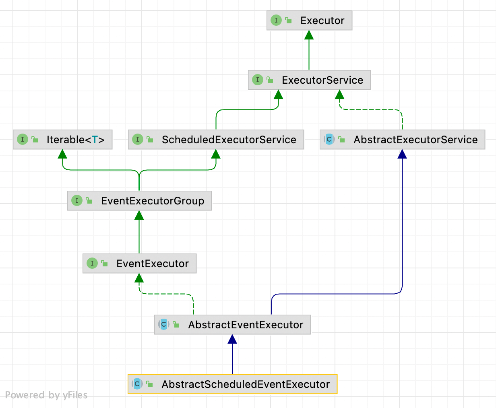
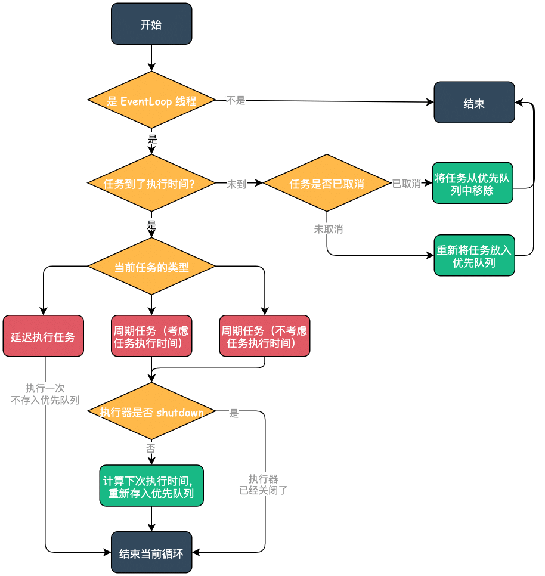

| 版本 | 内容                              | 时间                   |
| ---- | --------------------------------- | ---------------------- |
| V1   | 新建                              | 2022年2月13日14:51:20  |
| V2   | 重构，增加和 JDK 调度执行器的对比 | 2023年05月17日22:38:53 |

## Netty 调度线程池相关类

AbstractScheduledEventExecutor 是一个调度线程池，也就是一个提供延迟和周期性执行任务的线程池。可以把它和 JDK 的 ScheduledThreadPoolExecutor 关联起来看，它们的实现原理其实是一样的，都是通过一个优先队列来实现的。

AbstractScheduledEventExecutor 实现延迟和周期性执行任务，需要几个类配合使用：

1. io.netty.util.internal.PriorityQueue 接口：**优先队列**，默认实现 DefaultPriorityQueue；
2. io.netty.util.concurrent.ScheduledFutureTask：封装的**任务对象**；
3. io.netty.util.internal.PriorityQueueNode：优先队列存的元素的类型，为优先队列的元素**提供索引功能**；

## PriorityQueue 接口

Netty 的 PriorityQueue 接口继承 JDK 的 Queue 接口。

```java
public interface PriorityQueue<T> extends Queue<T> {
    /**
     * 和 {@link #remove(Object)} 方法一样，只是使用了泛型
     */
    boolean removeTyped(T node);

    /**
     * 和 {@link #contains(Object)} 方法一样，只是使用了泛型
     */
    boolean containsTyped(T node);

    /**
     *
     * 假如优先队列中的某个元素的属性值发生改变了，就可以使用这个方法修改优先级了
     */
    void priorityChanged(T node);

    /**
     * 只有在确定删除的节点不会被重新插入到这个或任何其他的PriorityQueue 中，
     * 并且这个PriorityQueue 队列本身将在调用之后被垃圾回收时，才应该使用这个方法。
     */
    void clearIgnoringIndexes();
}
```

## PriorityQueueNode 接口

优先队列使用堆来实现，堆使用数组来表示。是优先队列中的元素是 PriorityQueueNode 类型，PriorityQueueNode 接口提供了索引功能，这样就可以快速的获取指定位置的元素了。下面是 PriorityQueueNode 接口源码：

```java
public interface PriorityQueueNode {
    /**
     * -1 表示节点不在队列中
     */
    int INDEX_NOT_IN_QUEUE = -1;

    /**
     * 返回当前节点在优先队列中的索引
     */
    int priorityQueueIndex(DefaultPriorityQueue<?> queue);

    /**
     * 设置当前节点在优先队列中的索引
     */
    void priorityQueueIndex(DefaultPriorityQueue<?> queue, int i);
}
```

## 优先队列 DefaultPriorityQueue

### 继承关系



### 成员属性

```java
private static final PriorityQueueNode[] EMPTY_ARRAY = new PriorityQueueNode[0];
// 使用比较器 Comparator 进行排序
private final Comparator<T> comparator;
// 使用数组存储堆
private T[] queue;
// 表示队列中节点的数量
private int size;
```

DefaultPriorityQueue 使用数组表示堆。

关于DefaultPriorityQueue 成员方法下面分析完 AbstractScheduledEventExecutor 后再分析。

## 任务对象 ScheduledFutureTask

### ScheduledFutureTask 继承关系



可以看到 ScheduledFutureTask 的继承关系十分复杂，主要关注下下面几个接口：

- java.lang.Comparable：排序接口；
- java.util.concurrent.Delayed：计算剩余时间的接口；
- io.netty.util.internal.PriorityQueueNode：优先队列中存放的元素对象；

### 成员属性

```java
private static final long START_TIME = System.nanoTime();
```

常量 START_TIME 意义是：使用 Netty 程序刚开始运行时的纳秒时间作为 Netty 的基准时间，后续的延迟任务和周期性任务依赖这个时间。

```java
// set once when added to priority queue
private long id;

private long deadlineNanos;
/* 0 - no repeat, >0 - repeat at fixed rate, <0 - repeat with fixed delay */
// 0 不重复
// > 0 以固定速率重复  周期任务
// < 0 以固定延迟重复  延迟任务
private final long periodNanos;

private int queueIndex = INDEX_NOT_IN_QUEUE;
```

-  id：当前任务的 id；
-  deadlineNanos：任务执行的截止时间；
-  periodNanos：这个变量表示当前任务的类型； 
   -  0 表示不重复的任务；
   -  大于 0 表示以固定速率重复  周期任务 ；
   -  小于 0 表示以固定延迟重复  延迟任务 ；
-  queueIndex：节点在优先队列中的索引。任务需要放在堆中，这是任务节点在堆中的索引 ；

关于 ScheduledFutureTask 的核心成员 run 方法，在分析完 AbstractScheduledEventExecutor 后再分析；

## AbstractScheduledEventExecutor

### 继承关系



### 成员属性

**（1）SCHEDULED_FUTURE_TASK_COMPARATOR**：任务的 Comparator，根据任务的执行时间判断；

```java
private static final Comparator<ScheduledFutureTask<?>> SCHEDULED_FUTURE_TASK_COMPARATOR =
    new Comparator<ScheduledFutureTask<?>>() {
    @Override
    public int compare(ScheduledFutureTask<?> o1, ScheduledFutureTask<?> o2) {
        return o1.compareTo(o2);
    }
};
```

**（2）scheduledTaskQueue**：任务的优先队列；

**（3）nextTaskId**：为优先队列中的任务提供 ID，每次自增；

```java
// 任务优先队列
PriorityQueue<ScheduledFutureTask<?>> scheduledTaskQueue;

long nextTaskId;
```

### 成员方法概述

重要的成员方法概述：

- scheduledTaskQueue：获取优先队列，假如没有则创建一个默认的优先队列；
- cancelScheduledTasks：取消所有的任务；
- peekScheduledTask：获取优先队列的队首任务，可能返回 null；
- pollScheduledTask：获取并移除优先队列的队首任务，可能返回 null；
- nextScheduledTaskNano：获取优先队列的队首任务的执行时间的剩余纳秒，返回 -1 表示队列中没有任务；
- nextScheduledTaskDeadlineNanos：获取优先队列的队首任务的执行时间，返回 -1 表示队列中没有任务；
- schedule：发布延迟执行的任务；
- scheduleAtFixedRate：发布固定周期的周期性任务；
- scheduleWithFixedDelay：发布固定延迟的周期性任务；

### scheduledTaskQueue：获取优先队列

获取一个优先队列，假如没有设置，就获取一个默认的优先队列的实现 DefaultPriorityQueue，默认的比较规则。

```java
/**
 * 获得任务优先队列，没有的话就创建一个默认的优先队列 DefaultPriorityQueue
 */
PriorityQueue<ScheduledFutureTask<?>> scheduledTaskQueue() {
    if (scheduledTaskQueue == null) {
        scheduledTaskQueue = new DefaultPriorityQueue<ScheduledFutureTask<?>>(
            SCHEDULED_FUTURE_TASK_COMPARATOR,
            // Use same initial capacity as java.util.PriorityQueue
            11);
    }
    return scheduledTaskQueue;
}
```

### 发布任务相关方法

- schedule：发布延迟执行的任务；
- scheduleAtFixedRate：发布固定周期的周期性任务；
- scheduleWithFixedDelay：发布固定延迟的周期性任务；

上面几种方法最终会调用到 AbstractScheduledEventExecutor#schedule(ScheduledFutureTask)，可以看到就是最终就是将当前封装好的 ScheduledFutureTask 对象添加到优先队列中：

scheduleFromEventLoop 方法和 execute 方法都会把 ScheduledFutureTask 对象添加到优先队列中，关于 execute 方法会在 io.netty.util.concurrent.SingleThreadEventExecutor 中具体分析（后续单独章节），这里只需要知道会添加到优先队列中即可。

判断当前线程是否是绑定的 EventLoop 线程的目的是，让所有操作都让绑定的 EventLoop 线程去处理，就不会有线程安全的问题了。

```java
private <V> ScheduledFuture<V> schedule(final ScheduledFutureTask<V> task) {
    if (inEventLoop()) {
        // 如果当前线程就是Executor的线程，那么直接将计划任务 task 添加到计划任务队列中
        scheduleFromEventLoop(task);
    } else { // 当前执行的线程不是 Executor 所在的线程
        // 获取计划任务的截止时间
        final long deadlineNanos = task.deadlineNanos();
        // task will add itself to scheduled task queue when run if not expired
        if (beforeScheduledTaskSubmitted(deadlineNanos)) {
            // 如果任务未过期，则通过 execute 方法在运行时将自己添加到计划任务队列中
            execute(task);
        } else {
            // 如果任务已经过期，通过 lazyExecute 方法将在运行时从计划任务队列中删除自己
            lazyExecute(task);
            // Second hook after scheduling to facilitate race-avoidance
            if (afterScheduledTaskSubmitted(deadlineNanos)) {
                execute(WAKEUP_TASK);
            }
        }
    }

    return task;
}

/**
 * 将这个计划任务 task 添加到计划任务优先级队列中
 */
final void scheduleFromEventLoop(final ScheduledFutureTask<?> task) {
    // nextTaskId a long and so there is no chance it will overflow back to 0
    scheduledTaskQueue().add(task.setId(++nextTaskId));
}
```

### cancelScheduledTasks：取消所有任务

```java
/**
 * Cancel all scheduled tasks.
 *
 * This method MUST be called only when {@link #inEventLoop()} is {@code true}.
 *
 * 取消所有任务
 */
protected void cancelScheduledTasks() {
    assert inEventLoop();
    PriorityQueue<ScheduledFutureTask<?>> scheduledTaskQueue = this.scheduledTaskQueue;
    if (isNullOrEmpty(scheduledTaskQueue)) {
        return;
    }

    final ScheduledFutureTask<?>[] scheduledTasks =
            scheduledTaskQueue.toArray(new ScheduledFutureTask<?>[0]);

    // 循环遍历所有的任务并取消
    for (ScheduledFutureTask<?> task: scheduledTasks) {
        // 取消任务
        task.cancelWithoutRemove(false);
    }

    scheduledTaskQueue.clearIgnoringIndexes();
}
```

### peekScheduledTask：查看队首任务

```java
/**
 * 获取优先级队列的头节点,即最早需要执行的计划任务，有可能是 null
 */
final ScheduledFutureTask<?> peekScheduledTask() {
    Queue<ScheduledFutureTask<?>> scheduledTaskQueue = this.scheduledTaskQueue;
    return scheduledTaskQueue != null ? scheduledTaskQueue.peek() : null;
}
```

### pollScheduledTask：获取队首任务

判断队首任务时间是否到达执行时间，如果到了执行时间，将任务从优先队列移除，并返回该任务给调用方法。

```java
/**
 * 返回已经到了截止时间的计划任务，即准备执行的 Runnable，如果没有，那么返回 null
 *
 * @see #pollScheduledTask(long)
 */
protected final Runnable pollScheduledTask() {
    return pollScheduledTask(nanoTime());
}

/**
 * Return the {@link Runnable} which is ready to be executed with the given {@code nanoTime}.
 * You should use {@link #nanoTime()} to retrieve the correct {@code nanoTime}.
 *
 * 返回准备用给定的 nanoTime 内要执行执行的计划任务 Runnable。
 */
protected final Runnable pollScheduledTask(long nanoTime) {
    assert inEventLoop();

    // 查看队首任务对象 也就是最早需要执行的任务
    ScheduledFutureTask<?> scheduledTask = peekScheduledTask();
    // 假如队首没有任务，或者队首的任务的执行时间还未到，直接返回null
    if (scheduledTask == null || scheduledTask.deadlineNanos() - nanoTime > 0) {
        return null;
    }
    // 移除队首的任务
    scheduledTaskQueue.remove();
    // 将这个计划任务的截止时间设置为 0
    scheduledTask.setConsumed();
    return scheduledTask;
}
```

### 队首任务相关时间

```java
/**
 * Return the nanoseconds until the next scheduled task is ready to be run or {@code -1} if no task is scheduled.
 *
 * 假如队首有任务对象，返回该任务对象的执行的剩余时间的纳秒值
 * 假如队首没有任务对象 返回-1
 */
protected final long nextScheduledTaskNano() {
    // 查看队首任务对象
    ScheduledFutureTask<?> scheduledTask = peekScheduledTask();
    return scheduledTask != null ? scheduledTask.delayNanos() : -1;
}

/**
 * Return the deadline (in nanoseconds) when the next scheduled task is ready to be run or {@code -1}
 * if no task is scheduled.
 * 获取 可调用任务 的执行截至时间
 *
 * 假如队首有任务对象，返回该任务对象的 执行时间的纳秒值
 * 假如队首没有任务对象 返回-1
 */
protected final long nextScheduledTaskDeadlineNanos() {
    // 查看堆顶任务对象
    ScheduledFutureTask<?> scheduledTask = peekScheduledTask();
    return scheduledTask != null ? scheduledTask.deadlineNanos() : -1;
}
```

## DefaultPriorityQueue 的成员方法

在看完 AbstractScheduledEventExecutor 的成员方法后，可以发现基本上最终就是调用的 DefaultPriorityQueue 的一些成员方法。本小节分析 DefaultPriorityQueue 的成员方法，主要包括：

- 添加元素到堆中；
- 弹出堆顶元素；
- 删除堆中某个元素；

### 添加元素到堆中

```java
/**
 * 添加元素到优先队列
 */
@Override
public boolean offer(T e) {
    // 根据索引判断，当前待添加的元素是否在队列中
    if (e.priorityQueueIndex(this) != INDEX_NOT_IN_QUEUE) {
        throw new IllegalArgumentException("e.priorityQueueIndex(): " + e.priorityQueueIndex(this) +
                " (expected: " + INDEX_NOT_IN_QUEUE + ") + e: " + e);
    }

	// 检查是否需要扩容
    if (size >= queue.length) {
        // 与JDK的优先级队列策略相同，“小”时加倍，“大”时增加50%。
        queue = Arrays.copyOf(queue, queue.length + ((queue.length < 64) ?
                                                     (queue.length + 2) :
                                                     (queue.length >>> 1)));
    }
    // 计划在最后一个位置插入节点元素e，然后向上遍历树上浮，保持最小堆属性。
    bubbleUp(size++, e);
    return true;
}

/**
 * 上浮节点
 */
private void bubbleUp(int k, T node) {
    // 当 k==0 时，就到了堆二叉树的根节点了，跳出循环
    while (k > 0) {
        // 父节点位置坐标, 相当于(k - 1) / 2
        int iParent = (k - 1) >>> 1;
        // 获取父节点位置元素
        T parent = queue[iParent];

        if (comparator.compare(node, parent) >= 0) {
            // 待添加的元素比父节点大(或等于)，说明已经找到要插入的位置了，直接跳出循环
            break;
        }

        // 前置条件待添加的元素比父节点小，就将父节点元素存放到k位置
        queue[k] = parent;
        // 设置父节点的姓索引为k
        parent.priorityQueueIndex(this, k);

        // 重新赋值k，寻找元素key应该插入到堆二叉树的那个节点
        k = iParent;
    }

    // 我们已经找到了节点的位置，并且仍然满足最小堆属性，因此将它放入队列中。
    queue[k] = node;
    node.priorityQueueIndex(this, k);
}
```

流程分析：

- 首先是根据索引判断当前任务对象是否已经在优先队列中了；
- 检查是否需要扩容，按需扩容；
- 堆，向上冒泡插入节点；

### 弹出堆顶元素

```java
/**
 * 返回堆顶元素
 */
@Override
public T poll() {
    // 如果队列为空，返回 null
    if (size == 0) {
        return null;
    }
    // 记录树根节点
    T result = queue[0];
    // 设置树根节点的索引值
    result.priorityQueueIndex(this, INDEX_NOT_IN_QUEUE);

    // 得到堆最后一个节点， 并将队列节点数量 size 值减一
    T last = queue[--size];
    queue[size] = null;
    if (size != 0) { // Make sure we don't add the last element back.
        // 从树根向下遍历，保持最小堆属性。
        bubbleDown(0, last);
    }

    return result;
}

/**
     * 调用这个方法，表示当前 k 位置的节点值 node 可能比它的子节点的值大；
     * 为了保持最小堆属性，因此向下遍历树，将节点值 node 放到合适的位置
     *
     *     0
     *   1   2
     *  3 4 5
     */
private void bubbleDown(int k, T node) {
    // size 是树的最底一层， size >>> 1 就表示最底一层节点的父节点
    final int half = size >>> 1;
    // 通过循环，保证父节点的值不能大于子节点。
    while (k < half) {
        // Compare node to the children of index k.
        // 左子节点, 相当于 (k * 2) + 1
        int iChild = (k << 1) + 1;
        // 左节点存储的值 child
        T child = queue[iChild];

        // Make sure we get the smallest child to compare against.
        // 右子节点
        int rightChild = iChild + 1;
        // 当右节点在队列中，且左节点大于右节点，右节点才是较小的子节点，那么进行交换
        if (rightChild < size && comparator.compare(child, queue[rightChild]) > 0) {
            child = queue[iChild = rightChild];
        }
        // If the bubbleDown node is less than or equal to the smallest child then we will preserve the min-heap
        // property by inserting the bubbleDown node here.
        // 当 bubbleDown节点node 的值小于或者等于当前较小的子节点的值，
        // 那么我们将通过在这里插入bubbleDown节点来保持最小堆属性。
        // 直接 break 跳出循环
        if (comparator.compare(node, child) <= 0) {
            break;
        }

        // Bubble the child up.
        // 将较小值的子节点移动到父节点
        queue[k] = child;
        // 通知这个子节点，索引位置改变了
        child.priorityQueueIndex(this, k);

        // Move down k down the tree for the next iteration.
        // 将较小值的子节点位置赋值给 k
        // 即移动到树的下一层，寻找当前bubbleDown节点的位置
        k = iChild;
    }

    // We have found where node should live and still satisfy the min-heap property, so put it in the queue.
    //我们已经找到了节点的位置，并且仍然满足最小堆属性，因此将它放入队列中。
    queue[k] = node;
    node.priorityQueueIndex(this, k);
}
```

流程分析：

- 首先是获取堆顶节点，作为返回值；
- 然后将数组的最后一个元素，从堆顶向下冒泡，保持最小堆的属性；

### 从堆中移除元素

```java
@SuppressWarnings("unchecked")
@Override
public boolean remove(Object o) {
    final T node;
    try {
        // 只有是 PriorityQueueNode 的实例，才有可能删除
        node = (T) o;
    } catch (ClassCastException e) {
        return false;
    }
    return removeTyped(node);
}

@Override
public boolean removeTyped(T node) {
    // 获取节点对应的索引，可以快速查找
    int i = node.priorityQueueIndex(this);
    // 队列是否包含这个节点node
    if (!contains(node, i)) {
        return false;
    }

    // 改变这个节点的索引
    node.priorityQueueIndex(this, INDEX_NOT_IN_QUEUE);
    if (--size == 0 || size == i) {
        // If there are no node left, or this is the last node in the array just remove and return.
        // 如果没有节点剩下，或者这是数组中的最后一个节点，就不涉及到树的改动了，直接删除并返回
        queue[i] = null;
        return true;
    }

    // Move the last element where node currently lives in the array.
    // 将最后一个节点值移动到要删除节点位置i
    T moved = queue[i] = queue[size];
    // 最后一个节点值设置为 null
    queue[size] = null;
    // priorityQueueIndex will be updated below in bubbleUp or bubbleDown

    // Make sure the moved node still preserves the min-heap properties.
    // 为了确保移动的节点仍然保留最小堆属性
    if (comparator.compare(node, moved) < 0) {
        // 删除节点值node 小于 最后一个节点值 moved，
        // 这就说明 moved 放到 i 位置，肯定是大于 i 的父节点的值，
        // 那么从 i 向上的树是满足最小堆属性的，
        // 但是从 i 向下的树，就不一定了，
        // 所以需要bubbleDown(i, moved) 方法，保持最小堆属性。
        bubbleDown(i, moved);
    } else {
        // 删除节点值node 大于等于 最后一个节点值 moved，
        // 这就说明 moved 放到 i 位置，肯定是大于 i 的左右子节点的值，
        // 那么从 i 向下的树是满足最小堆属性的，
        // 但是从 i 向上的树，就不一定了，
        // 所以需要 bubbleUp(i, moved) 方法，保持最小堆属性。
        bubbleUp(i, moved);
    }
    return true;
}
```

流程分析：

- 首先移除指定元素；
- 将数组的最后一个元素放到删除的元素的位置上，根据大小进行冒泡处理，保持最小堆的属性；
  - 假如最后一个元素的值 小于 已删除元素的位置，那么需要向下冒泡；
  - 假如最后一个元素的值 大于等于 已删除元素的位置，那么需要向上冒泡；


## ScheduledFutureTask 的 run 方法

io.netty.util.concurrent.ScheduledFutureTask#run 是该类的核心方法，这个就是调度线程的执行任务的方法，源码如下：

```java
/**
 * 运行任务
 *
 * periodNanos == 0，执行任务然后退出；
 * periodNanos > 0代表每periodNanos时间执行一次，不考虑任务的耗时，所以下次任务的执行时间为deadlineNanos += p；
 * periodNanos < 0代表每periodNanos时间执行一次，每次以当此任务结束时间为开始计时，所以下次任务的执行时间为deadlineNanos = nanoTime() - p;
 * 计算完下次任务的开始执行时间后，就将其重新加入队列，scheduledTaskQueue.add(this);
 */
@Override
public void run() {
    // 当前线程是否是 Executor 执行器的线程
    assert executor().inEventLoop();
    try {
        // delayNanos() > 0L 表示任务截止时间还没有到
        if (delayNanos() > 0L) {
            // Not yet expired, need to add or remove from queue
            if (isCancelled()) {
                // 任务已经被取消，那么就从列表中移除
                scheduledExecutor().scheduledTaskQueue().removeTyped(this);
            } else {
                // 否则将任务重新放回队列
                scheduledExecutor().scheduleFromEventLoop(this);
            }
            return;
        }
        // 走到此处前置条件 任务截止时间已经到了
        if (periodNanos == 0) {
            // periodNanos == 0 表示只是延时任务。
            // 先将任务设置成不可取消
            if (setUncancellableInternal()) {
                // 执行任务
                V result = runTask();
                // 设置 PromiseTask 为成功，进行通知
                setSuccessInternal(result);
            }
        } else {
            // check if is done as it may was cancelled
            if (!isCancelled()) { // 检查任务是否被取消
                // 执行任务
                runTask();
                if (!executor().isShutdown()) { // 判断执行器是否被终止
                    if (periodNanos > 0) {
                        // periodNanos > 0 表示固定周期，那么下一次执行时间就是
                        // 本次截止时间deadlineNanos + 周期时间 periodNanos
                        // 但是这个值可能小于当前时间啊，只要任务执行时间比周期时间 periodNanos大，
                        // 那么这个值就小于当前时间。就代表会立即运行
                        deadlineNanos += periodNanos;
                    } else {
                        // periodNanos < 0 表示固定延时。
                        // 使用当前时间 nanoTime() 加上固定延时时间(- periodNanos)
                        deadlineNanos = nanoTime() - periodNanos;
                    }
                    if (!isCancelled()) {
                        // 重新添加到优先队列
                        scheduledExecutor().scheduledTaskQueue().add(this);
                    }
                }
            }
        }
    } catch (Throwable cause) {
        setFailureInternal(cause);
    }
}
```

在了解这个方法之前，回顾下 ScheduledFutureTask#periodNanos 属性的含义：

- periodNanos 等于 0，表示只是一个延迟任务；
- periodNanos 大于 0，表示每 periodNanos 时间执行一次任务，不考虑任务的耗时，所以下次任务的执行时间为『当前时间加 periodNanos 』；
- periodNanos 小于 0，表示每 periodNanos 时间执行一次任务，需要考虑任务的耗时，每次以当前任务结束时间为开始计时，所以下次任务的执行时间为『任务结束时间加 periodNanos 』;

上图：



## Netty 和 JDK 的调度执行器对比

Netty 的 AbstractScheduledEventExecutor 和 java.util.concurrent.ScheduledThreadPoolExecutor 的实现逻辑基本上都是一样的，**都是通过优先队列来实现的**。它们的区别是：**Netty 的调度执行器只允许一个线程（绑定的线程）去执行任务，这也是 Netty 防止并发的手段。而 JDK 的 ScheduledThreadPoolExecutor 需要去控制并发安全，在很多方法都使用 ReentrantLock 去处理的。**

例如 Netty 的 ScheduledFutureTask#run 方法，必须是当前绑定的线程才能执行任务，否则不执行

```java
@Override
public void run() {
    // 当前线程是否是 Executor 执行器的线程
    assert executor().inEventLoop();
    
    // ......省略后续代码......
}
```

另外，Netty 的 AbstractScheduledEventExecutor 的增加和取消任务的方法都是需要是绑定的线程才能去操作的，例如下面的增加任务：AbstractScheduledEventExecutor#schedule(ScheduledFutureTask)

```java
private <V> ScheduledFuture<V> schedule(final ScheduledFutureTask<V> task) {
    if (inEventLoop()) {
        // 如果当前线程就是Executor的线程，那么直接将计划任务 task 添加到计划任务队列中
        scheduleFromEventLoop(task);
    } else { // 当前执行的线程不是 Executor 所在的线程
        // 获取计划任务的截止时间
        final long deadlineNanos = task.deadlineNanos();
        // task will add itself to scheduled task queue when run if not expired
        if (beforeScheduledTaskSubmitted(deadlineNanos)) {
            // 如果任务未过期，则通过 execute 方法在运行时将自己添加到计划任务队列中
            execute(task);
        } else {
            // 如果任务已经过期，通过 lazyExecute 方法将在运行时从计划任务队列中删除自己
            lazyExecute(task);
            // Second hook after scheduling to facilitate race-avoidance
            if (afterScheduledTaskSubmitted(deadlineNanos)) {
                execute(WAKEUP_TASK);
            }
        }
    }

    return task;
}
```

这里要说明的是，假如是绑定的线程在增加任务，那么会直接去添加任务到优先队列。假如当前执行代码的线程不是绑定的线程，那么会调用 execute 方法去添加到队列（这里其实是另外一个线程安全的队列，在线程执行的时候会从该线程安全的队列中拉取任务，后面文章分析，这里只需要知道任务最终都是绑定的线程去执行的就行了）


而 JDK 的 ScheduledThreadPoolExecutor 大部分都是通过 ReentrantLock 加锁保证线程安全的，例如增加任务到优先队列的操作：ScheduledThreadPoolExecutor 的内部类 DelayedWorkQueue#offer(Runnable)

```java
public boolean offer(Runnable x) {
    if (x == null)
        throw new NullPointerException();
    RunnableScheduledFuture<?> e = (RunnableScheduledFuture<?>)x;
    final ReentrantLock lock = this.lock;
    lock.lock();
    try {
        // ......省略堆相关处理......
    } finally {
        lock.unlock();
    }
    return true;
}
```

## 小结

AbstractScheduledEventExecutor 是 Netty 中实现的一个支持调度任务的执行器实现，比如延迟性任务和周期性任务。具体的实现原理是：

- **优先队列**：使用最小堆，使用数组表示堆，最快要执行的任务在堆顶；
- 添加任务到优先队列，根据任务的执行时间做排序；

关于 Netty 和 JDK 的调度执行器对比，**Netty 的调度执行器 AbstractScheduledEventExecutor 绑定的线程去执行任务。而 JDK 的 ScheduledThreadPoolExecutor 需要去控制并发安全，在很多方法都使用 ReentrantLock 去处理的。**
