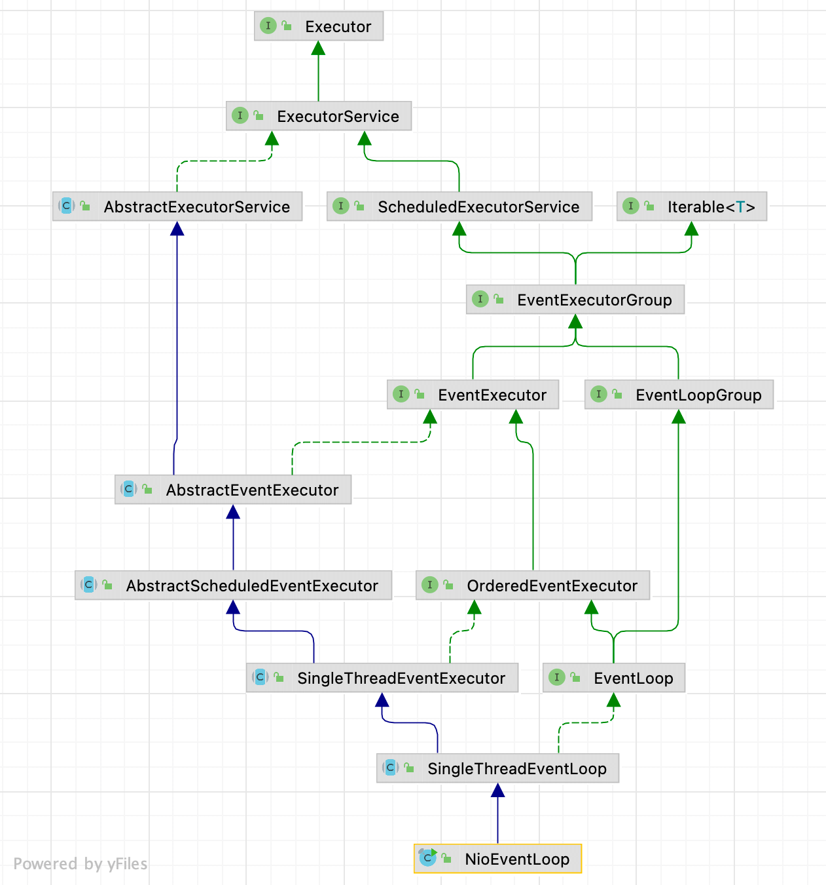

| 版本 | 内容 | 时间                  |
| ---- | ---- | --------------------- |
| V1   | 新建 | 2022年2月23日18:38:06 |
| V2   | 重构 | 2023年05月19日11:57:59 |

## NioEventLoop 的继承体系



在前面的下节中，我们已经分析了 NioEventLoop 的相关父接口，和两个抽象父类 AbstractEventExecutor 和 AbstractScheduledEventExecutor，不了解它们的作用可以看我之前的文章。
还有两个抽象父类没有分析，SingleThreadEventExecutor 和 SingleThreadEventLoop，它们之间的关系比较紧密，所以就不会单独分析这两个类，后面会在一起分析。

## NioEventLoop 的概述

NioEventLoop 继承自 SingleThreadEventLoop，而 SingleThreadEventLoop 继承自 SingleThreadEventExecutor。其中 SingleThreadEventExecutor 是 Netty 对本地线程的抽象，**内部持有一个 Thread 属性，实际上就是一个本地 Java 线程。所以我们可以简单认为一个 NioEventLoop 对象就是和一个特定的线程绑定，在 NioEventLoop 的生命周期内，其绑定的线程都不会再改变。**

每个 NioEventLoop 和 NIO 中的多路复用器 Selector 一样，要管理很多链路，所有链路的读写事件都由它来发起。NioEventLoop 有下面几个核心功能：

- **开启 Selector 并初始化；**
- **将 ServerSocketChannel 注册到 Selector 上；**
- **作为 IO 线程，执行与 Channel 相关的处理各种 IO 事件，如 OP_ACCEPT、OP_CONNECT、OP_READ、OP_WRITE 事件；**
- **作为任务队列，执行 taskQueue 中的普通任务和调度任务；**
- **处理 JDK 空轮询 bug；**

NioEventLoop 类本身的源码很少，基本上都是调用父类或者其他类的 API 来实现功能的。

## NioEventLoop 实例化

### 实例化入口

NioEventLoop 是由 NioEventLoopGroup 管理的，前面在分析 NioEventLoopGroup 的时候已经知道 NioEventLoop 的实例化是在 NioEventLoopGroup#newChild 方法中的，如下：

```java
@Override
protected EventLoop newChild(Executor executor, Object... args) throws Exception {
    // 获取可变参数的数据
    SelectorProvider selectorProvider = (SelectorProvider) args[0];
    SelectStrategyFactory selectStrategyFactory = (SelectStrategyFactory) args[1];
    RejectedExecutionHandler rejectedExecutionHandler = (RejectedExecutionHandler) args[2];
    EventLoopTaskQueueFactory taskQueueFactory = null;
    EventLoopTaskQueueFactory tailTaskQueueFactory = null;

    int argsLength = args.length;
    if (argsLength > 3) {
        taskQueueFactory = (EventLoopTaskQueueFactory) args[3];
    }
    if (argsLength > 4) {
        tailTaskQueueFactory = (EventLoopTaskQueueFactory) args[4];
    }
    // 参数一：当前NioEventLoopGroup
    // 参数二：ThreadPerTaskExecutor
    // 参数三：selectorProvider，选择器提供器
    // 参数四：选择器工作策略 DefaultSelectStrategy  再NIoEventLoop的run()方法中用于控制选择循环
    // 参数五：线程池拒绝策略
    // 参数六和七：一般正常情况下是null，除非argsLength > 3，或者argsLength > 4
    return new NioEventLoop(this, executor, selectorProvider,
                            selectStrategyFactory.newSelectStrategy(),
                            rejectedExecutionHandler, taskQueueFactory, tailTaskQueueFactory);
}
```

### NioEventLoop 构造方法

```java
NioEventLoop(NioEventLoopGroup parent, Executor executor, SelectorProvider selectorProvider,
             SelectStrategy strategy, RejectedExecutionHandler rejectedExecutionHandler,
             EventLoopTaskQueueFactory taskQueueFactory, EventLoopTaskQueueFactory tailTaskQueueFactory) {
    // 参数一：当前NioEventLoop所属的NioEventLoopGroup
    // 参数二：ThreadPerTaskExecutor, 是在Group中创建的
    // 参数三：
    // 参数四：最终返回的是一个队列，最大程度是Integer.MAX_VALUE，最小是16
    // 参数五：大部分用不到这个queue
    // 参数六：线程池拒绝策略
    super(parent, executor, false, newTaskQueue(taskQueueFactory), newTaskQueue(tailTaskQueueFactory),
            rejectedExecutionHandler);
    this.provider = ObjectUtil.checkNotNull(selectorProvider, "selectorProvider");
    this.selectStrategy = ObjectUtil.checkNotNull(strategy, "selectStrategy");
    // 创建包装后的Selector和未包装的Selector实例
    // 也就是每个NioEventLoop都持有有一个Selector实例
    final SelectorTuple selectorTuple = openSelector();
    this.selector = selectorTuple.selector;
    this.unwrappedSelector = selectorTuple.unwrappedSelector;
}
```

super 调用父类的构造方法下小节分析，这里先分析 NioEventLoop 构造方法的入参：

- 入参的 NioEventLoopGroup parent：就是当前 NioEventLoop 所属的 NioEventLoopGroup 对象；
- 入参 Executor executor：默认传进来的是 ThreadPerTaskExecutor 对象，这个执行器其实就是每个任务创建一个新的线程去处理；
- 入参 SelectorProvider selectorProvider：默认情况是 SelectorProvider.provider() 返回的实例，用于获取多路复用器 Selector 的；
- 入参 SelectStrategy strategy：默认情况是一个 DefaultSelectStrategyFactory 对象；
- 入参 RejectedExecutionHandler：任务拒绝策略；
- 最后两个参数是工厂类对象，用于创建对应的队列。一般情况下这两个对象都是 null；

其实 NioEventLoop 构造方法做的事情很简单，就是先调用父类的构造方法初始化父类，然后将传入的参数赋值给自己的属性。

其中关于获取多路复用器 Selector 后面单独一篇文章分析，这里先待过。

### 父类 SingleThreadEventLoop 构造方法

```java
protected SingleThreadEventLoop(EventLoopGroup parent, Executor executor,
                                boolean addTaskWakesUp, Queue<Runnable> taskQueue,
                                Queue<Runnable> tailTaskQueue,
                                RejectedExecutionHandler rejectedExecutionHandler) {
    super(parent, executor, addTaskWakesUp, taskQueue, rejectedExecutionHandler);
    tailTasks = ObjectUtil.checkNotNull(tailTaskQueue, "tailTaskQueue");
}
```

这个构造方法自己做的事情就是将在 NioEventLoop 构造方法中创建的 tailTaskQueue 赋值给自己的属性。

### 父类 SingleThreadEventExecutor 构造方法

```java
protected SingleThreadEventExecutor(EventExecutorGroup parent, Executor executor,
                                    boolean addTaskWakesUp, Queue<Runnable> taskQueue,
                                    RejectedExecutionHandler rejectedHandler) {
    super(parent);
    this.addTaskWakesUp = addTaskWakesUp;
    this.maxPendingTasks = DEFAULT_MAX_PENDING_EXECUTOR_TASKS;
    // 封装一下 Executor
    this.executor = ThreadExecutorMap.apply(executor, this);
    this.taskQueue = ObjectUtil.checkNotNull(taskQueue, "taskQueue");
    this.rejectedExecutionHandler = ObjectUtil.checkNotNull(rejectedHandler, "rejectedHandler");
}
```

这里也是字段赋值，没什么好说的。仅仅需要注意的是封装了一下 Executor 对象。默认情况下这里传进来的 Executor 参数是 ThreadPerTaskExecutor 对象，这个执行器作用是每个任务创建一个新的线程去执行。

```java
this.executor = ThreadExecutorMap.apply(executor, this);
```

这里对 ThreadPerTaskExecutor 对象使用 ThreadExecutorMap#apply(Executor, EventExecutor) 封装了一下，源码如下：

```java
private static final FastThreadLocal<EventExecutor> mappings = new FastThreadLocal<EventExecutor>();


public static Executor apply(final Executor executor, final EventExecutor eventExecutor) {
    ObjectUtil.checkNotNull(executor, "executor");
    ObjectUtil.checkNotNull(eventExecutor, "eventExecutor");
    return new Executor() {
        @Override
        public void execute(final Runnable command) {
            executor.execute(apply(command, eventExecutor));
        }
    };
}

public static Runnable apply(final Runnable command, final EventExecutor eventExecutor) {
    ObjectUtil.checkNotNull(command, "command");
    ObjectUtil.checkNotNull(eventExecutor, "eventExecutor");
    return new Runnable() {
        @Override
        public void run() {
            setCurrentEventExecutor(eventExecutor);
            try {
                command.run();
            } finally {
                setCurrentEventExecutor(null);
            }
        }
    };
}

private static void setCurrentEventExecutor(EventExecutor executor) {
    mappings.set(executor);
}
```

很简单，封装 Executor 的作用是：每次执行任务的时候，会将当前 NioEventLoop 保存到一个 ThreadLocal 中了，这样就可以获取当前线程绑定的 EventLoop 了。

## 小结

本篇分析了 NioEventLoop 的继承体系和实例化过程（其中开启 Selector 未详细分析），后面文章会按照 NioEventLoop 的核心功能依次分析：

- **开启 Selector 并初始化；**
- **将 ServerSocketChannel 注册到 Selector 上；**
- **作为 IO 线程，执行与 Channel 相关的处理各种 IO 事件，如 OP_ACCEPT、OP_CONNECT、OP_READ、OP_WRITE 事件；**
- **作为任务队列，执行 taskQueue 中的普通任务和调度任务；**
- **处理 JDK 空轮询 bug；**

