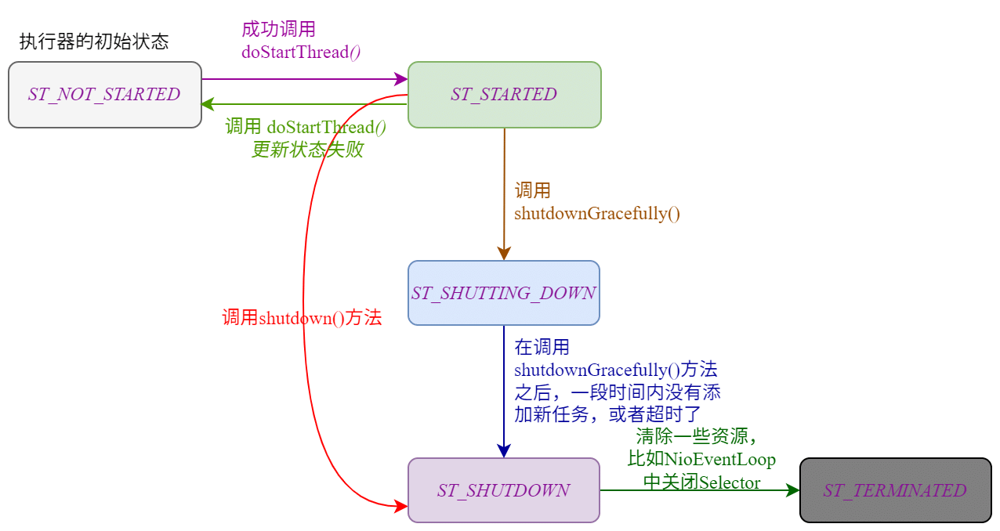

| 版本 | 内容 | 时间                   |
| ---- | ---- | ---------------------- |
| V1   | 新建 | 2022年2月18日18:34:24  |
| V2   | 重构 | 2023年05月20日23:54:04 |

## 案例引入

前面我们已经说过 NioEventLoop 内部属性存储了一个本地 Java 线程，并且在 NioEventLoop 的生命周期内，NioEventLoop  绑定的线程不会改变。

那么 NioEventLoop 内的 Thread 属性是什么时候被赋值的呢？也就是说 NioEventLoop 怎么绑定一个线程的？这里先通过一个案例引入：

既然 NioEventLoop 是 java.util.concurrent.Executor 的实现类，那么就能够调用 execute() 方法。

```java
public class MainTest {
    public static void main(String[] args) {
        EventLoopGroup group = new NioEventLoopGroup(2);
        EventLoop eventLoop =  group.next();
        eventLoop.execute(() -> {
            System.out.println("你好哇......");
        });
    }
}
```

其实 NioEventLoop 和线程绑定就是在 execute() 方法里面做的。NioEventLoop 类本身并没有实现 execute()  方法，这个方法在它的父类 SingleThreadEventExecutor 中实现的。接下来分析这个 execute()  方法。

## 执行器的状态

SingleThreadEventExecutor 执行器有 5 个状态，如下：

```java
// 执行器分为5个状态: ST_TERMINATED > ST_SHUTDOWN > ST_SHUTTING_DOWN > ST_STARTED > ST_NOT_STARTED

// 表示执行器还未开始运行
private static final int ST_NOT_STARTED = 1;
// 表示执行器正在运行
private static final int ST_STARTED = 2;
// 表示执行器开始 shutdown
private static final int ST_SHUTTING_DOWN = 3;
// 表示执行器已经 shutdown
private static final int ST_SHUTDOWN = 4;
// 表示执行器已经 terminated
private static final int ST_TERMINATED = 5;
```

- **ST_NOT_STARTED**：SingleThreadEventExecutor 刚初始化的默认状态，此时执行器的线程还未启动；

- **ST_STARTED**：表示线程已经成功调用了 `startThread();` 方法，此时会调用子类的 run 方法，子类的 run 方法一般都是死循环，除非调用了关闭执行器的方法。此时执行器已经是开启状态了；

- **ST_SHUTTING_DOWN**：表示线程调用了关闭执行器的方法，如`shutdownGracefully()`。这个状态会将 schedule 队列里的调度任务都 cancel 掉，然后运行 taskQueue 中的所有普通任务和 shutdownHooks 关闭的钩子任务。Netty 会根据设置的静默期和超时时间来决定是否在关闭期间接收任务；（下面详细解释）

- **ST_SHUTDOWN**：ST_SHUTTING_DOWN 状态下在一段时间没有新的任务加入或者等待超时时才会切换到这个状态，（直接调用 `shutdown()` 方法也会直接切到这个状态），这个状态是不接受新的任务的；

- **ST_TERMINATED**：当执行器中的资源清理完成，任务也全部完成后就会修改成这个状态；

关于执行器的状态转换的流程图如下：



## SingleThreadEventExecutor#execute

### execute 方法入口

```java
@Override
public void execute(Runnable task) {
    ObjectUtil.checkNotNull(task, "task");
    execute(task, !(task instanceof LazyRunnable) && wakesUpForTask(task));
}
```

重载方法

```java
private void execute(Runnable task, boolean immediate) {
    // 判断执行当前代码的线程是否是 eventloop的线程，是则true，否则fasle
    boolean inEventLoop = inEventLoop();
    // 将任务添加到待执行任务队列taskQueue中
    // 注意这里是可以被不同线程调用的，所以有并发冲突问题。
    // 因此任务队列taskQueue 必须是一个线程安全的队列
    addTask(task);
    if (!inEventLoop) {
        // 执行当前代码的线程不是eventloop线程，需要开启线程
        // 这个方法做了判断，只有当执行器状态是 ST_NOT_STARTED 才会开启执行器线程
        startThread();
        if (isShutdown()) {
            // 如果执行器状态已经 Shutdown 之后，就要拒绝任务。
            // 注意这里的状态是已经 Shutdown 之后，所以不包括开始 Shutdown 的状态。
            boolean reject = false;
            try {
                // 移除任务
                if (removeTask(task)) {
                    reject = true;
                }
            } catch (UnsupportedOperationException e) {

            }
            if (reject) {
                reject();
            }
        }
    }

    // 是否唤醒可能阻塞的执行器线程
    if (!addTaskWakesUp && immediate) {
        wakeup(inEventLoop);
    }
}
```

简单分析这个方法的流程：

1. 首先调用 addTask(task) 将任务添加到一个线程安全的队列，taskQueue，这个队列需要保证线程安全的原因是 execute() 方法可能会有多个线程来调用，默认情况用的是 LinkedBlockingQueue；
2. 如果当前执行代码的线程不是 EventLoop 绑定的线程，那么就需要将 EventLoop 和一个线程绑定，并且启动这个线程；
3. 一般情况下 startThread() 方法里面的实现都是一个死循环去处理，所以只有 NioEventLoop 关闭的时候才会从 startThread() 方法退出。
4. 退出后，假如 NioEventLoop 已经是 SHUTDOWN 状态了，这时候就需要把 taskQueue 任务队列中的任务移出队列，并且拒绝后面添加的任务；

### 绑定并启动线程

SingleThreadEventExecutor#startThread

```java
private void startThread() {
    if (state == ST_NOT_STARTED) {
        // 假如是线程未启动状态，使用CAS设置为线程启动状态
        if (STATE_UPDATER.compareAndSet(this, ST_NOT_STARTED, ST_STARTED)) {
            boolean success = false;
            try {
                doStartThread();
                success = true;
            } finally {
                if (!success) {
                    STATE_UPDATER.compareAndSet(this, ST_STARTED, ST_NOT_STARTED);
                }
            }
        }
    }
}
```

先是通过 CAS 修改执行器的状态，然后调用 SingleThreadEventExecutor#doStartThread 方法去真正的绑定和启动线程。

这里只展示 SingleThreadEventExecutor#doStartThread 的绑定线程和启动线程的代码，省略了关闭执行器的操作，这部分后面文章再分析。

```java
private void doStartThread() {
    assert thread == null;
    // 这里直接调用 executor.execute 方法，
    // 我们要确保该方法每次都能提供新线程，
    // 否则多个执行器绑定的线程是同一个，是会有问题。
    // 因为一般 SingleThreadEventExecutor.this.run() 方法都是死循环，
    // 这就导致它会占用线程，导致共享线程的其他执行器，是没有办法执行任务的。
    executor.execute(new Runnable() {
        @Override
        public void run() {
            // 获取当前线程，赋值给 thread，就是执行器线程
            thread = Thread.currentThread();
            if (interrupted) {
                // 调用interruptThread()中断当前任务时没有thread值时会设置interrupted标识,现在来调用interrupt方法
                thread.interrupt();
            }

            boolean success = false;
            // 更新最近一次执行任务时间
            updateLastExecutionTime();
            try {
                // 这个方法由子类实现，一般情况下，这个方法里面利用死循环，
                // 来获取待执行任务队列 taskQueue 中的任务并运行。
                SingleThreadEventExecutor.this.run();
                success = true;
            } catch (Throwable t) {
                logger.warn("Unexpected exception from an event executor: ", t);
            } finally {
                
                // ...... 省略关闭执行器的代码......
                
            }
        }
    });
}
```

`thread = Thread.currentThread();`将新创建出来的线程赋值给了 SingleThreadEventExecutor 的 thread 属性了，这样 NioEventLoop 就和一个线程绑定了。

最终调用了这一行代码 `SingleThreadEventExecutor.this.run();`，这个一般就是子类来实现的，例如 io.netty.channel.nio.NioEventLoop#run，这个也就是我们下一篇文章要分析的内容了。

## 小结

NioEventLoop 内部持有一个 thread 属性，和一个线程绑定，在 NIoEventLoop 的生命周期中这个 thread 属性都不会改变。线程绑定成功就会启动线程，对于 NioEventLoop 来说，就是调用 NioEventLoop#run 方法，这里面是一个死循环，除非调用执行器的关闭方法。

执行器和 JDK 的线程池一样，也有多个状态，分别是 ST_TERMINATED、ST_SHUTDOWN、 ST_SHUTTING_DOWN、 ST_STARTED、 ST_NOT_STARTED。它们的含义和状态转换见上面小节的分析。