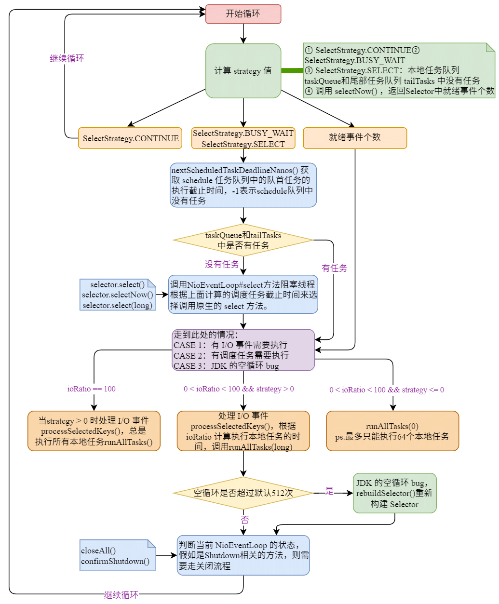

| 版本 | 内容 | 时间                   |
| ---- | ---- | ---------------------- |
| V1   | 新建 | 2022年2月23日18:38:06  |
| V2   | 重构 | 2023年05月21日14:50:59 |

## 引入

前面文章已经分析了，NioEventLoop 和一个线程绑定并且启动的流程。线程启动最终调用的方法就是 NioEventLoop#run 方法（当然还有别的 EventLoop 的实现）。

本篇主要分析 NioEventLoop#run 的实现逻辑。

## NioEventLoop#run 核心逻辑分析

### 概要

NioEventLoop#run 方法的代码比较长，直接看代码比较难懂，先简要了解下该方法的大概的处理思路。

首先我们需要知道的是 NioEventLoop 中需要执行那些任务：

- 调度任务队列  AbstractScheduledEventExecutor#scheduledTaskQueue 中的任务，前面文章已经分析过；
- 普通的任务队列 SingleThreadEventExecutor#taskQueue 中的任务；
- 尾部队列 SingleThreadEventLoop#tailTasks 中的任务；（这个队列没看到怎么用，应该不重要）
- 处理通道的 I/O 事件；

NioEventLoop#run 内部就是一个死循环，循环查找是否有上面要执行的任务到了执行的时间了，如果有任务要执行就去执行对应的任务，I/O 事件。

NioEventLoop#run 方法比较长，下面分步分析，分步分析的代码会精简一点，最后会贴出整个 NioEventLoop#run 的源代码。

### 查找要执行的任务

下面是死循环中，查找要执行任务的逻辑，省略了真正执行任务的代码。

```java
@Override
protected void run() {
    // epoll bug的一个特征计数变量
    int selectCnt = 0;
    for (;;) {
        try {
            // 1. >= 0 表示Selector的返回值，注册在Selector上就绪事件的个数
            // 2. < 0 状态常量 CONTINUE BUSY_WAIT SELECT
            int strategy;
            try {
                // 根据当前NioEventLoop是否有任务，来判断
                // 1.有任务，调用Selector的selectNow()方法，返回就绪事件的个数
                // 2.没有任务，直接返回SELECT 也就是-1
                strategy = selectStrategy.calculateStrategy(selectNowSupplier, hasTasks());
                switch (strategy) {
                    case SelectStrategy.CONTINUE:
                        continue;

                    case SelectStrategy.BUSY_WAIT:
                        // fall-through to SELECT since the busy-wait is not supported with NIO

                    case SelectStrategy.SELECT:
                        // 返回下一个计划任务准备运行的截止时间纳秒值
                        // 返回-1表示 NioEventLoop中没有需要周期性调度的任务
                        long curDeadlineNanos = nextScheduledTaskDeadlineNanos();
                        if (curDeadlineNanos == -1L) {
                            // 将 curDeadlineNanos 设置为 Long.MAX_VALUE，
                            curDeadlineNanos = NONE; // nothing on the calendar
                        }
                        // 设置 超时等待时间
                        nextWakeupNanos.set(curDeadlineNanos);
                        try {
                            // 条件成立：表示没有本地普通任务 需要执行
                            if (!hasTasks()) {
                                // curDeadlineNanos
                                // 1. NONE
                                // 2. 表示周期性任务需要执行的 截止时间
                                strategy = select(curDeadlineNanos);
                            }
                        } finally {
                            // This update is just to help block unnecessary selector wakeups
                            // so use of lazySet is ok (no race condition)
                            nextWakeupNanos.lazySet(AWAKE);
                        }
                        // fall through
                    default:
                }
            } catch (IOException e) {
                // https://github.com/netty/netty/issues/8566
                // 出现 I/O 异常时重新构建Selector
                rebuildSelector0();
                selectCnt = 0;
                handleLoopException(e);
                continue;
            }

            // ......省略处理任务的代码......
        }
    }
}
```

第一步：判断是否有任务需要执行。

1. `hasTasks()` 判断当前 NioEventLoop 的队列中是否有任务。

   1. 有任务：那么无需等待 I/O 事件，调用`selector.selectNow()`方法获取已经就绪的事件的个数，并赋值给 strategy 变量。此方法不阻塞线程；
   2. 没有任务：直接返回 `SelectStrategy.SELECT`，也就是 -1，赋值给 strategy 变量；

2. 根据 strategy 变量的值判断

   1. strategy 是 `SelectStrategy.SELECT` ，也就是 -1，此时需要查询 schedule 调度任务队列是否存在已经到了执行时间的任务了，方法`nextScheduledTaskDeadlineNanos()`返回值 curDeadlineNanos 可能是-1，也可能是一个时间戳。-1 表示 schedule 任务队列中没有调度任务，返回时间戳表示调度任务队列中的队首任务的执行时间；

      获取到 curDeadlineNanos 的值后，调用`select(long deadlineNanos) `方法阻塞线程，尝试获取就绪的 I/O 任务；

   2. strategy 不是 `SelectStrategy.SELECT`，继续往下走后面处理任务的代码；

### 处理 I/O 事件和其他任务

走到下面的代码，strategy 变量就表示 channel上就绪事件的个数。要么就是有 I/O 事件就绪了，要么就是有普通任务和调度任务，或者是JDK 的空轮询 BUG。

```java
@Override
protected void run() {
    // epoll bug的一个特征计数变量
    int selectCnt = 0;
    for (;;) {
        try {
            
            // ......省略查找要任务的代码......

            // 走到此处，strategy就表示 channel上就绪事件的个数
            // 要么就是有I/O事件，要么就是有scheduledTask，或者是JDK的 epoll 的空轮询 BUG

            selectCnt++;
            cancelledKeys = 0;
            needsToSelectAgain = false;

            // 线程处理IO事件的时间占比，默认是50%
            final int ioRatio = this.ioRatio;
            // 表示本轮线程有没有处理过本地任务
            boolean ranTasks;
            // 条件成立表示IO优先，IO处理完之后，再处理本地任务
            if (ioRatio == 100) {
                try {
                    // 条件成立：说明当前NIoEventLoop的Selector上有就绪事件
                    if (strategy > 0) {
                        // 处理IO事件
                        processSelectedKeys();
                    }
                } finally {
                    // Ensure we always run tasks.
                    // 确保运行了所有待执行任务，包括ScheduledTask任务
                    // 执行本地任务队列的任务
                    ranTasks = runAllTasks();
                }
            }
            // 条件成立，说明当前NIoEventLoop的Selector上有就绪事件
            else if (strategy > 0) {
                final long ioStartTime = System.nanoTime();
                try {
                    processSelectedKeys();
                } finally {
                    // Ensure we always run tasks.
                    // IO事件处理总耗时
                    final long ioTime = System.nanoTime() - ioStartTime;
                    // 计算执行本地队列任务的最大时间，根据ioRatio，有可能遗留一部分任务等待下次执行
                    ranTasks = runAllTasks(ioTime * (100 - ioRatio) / ioRatio);
                }
            }
            // 条件成立，说明当前NioEventLoop上没有就绪事件，只处理本地任务就行了
            // 也就是说没有IO事件了
            else {
                // 最多只能执行64个任务
                ranTasks = runAllTasks(0); // This will run the minimum number of tasks
            }

            if (ranTasks || strategy > 0) { // 要么有任务运行，要么有 IO 事件处理
                if (selectCnt > MIN_PREMATURE_SELECTOR_RETURNS && logger.isDebugEnabled()) {
                    logger.debug("Selector.select() returned prematurely {} times in a row for Selector {}.",
                            selectCnt - 1, selector);
                }
                // 正常流程进到这里面，NioEventLoop线程从Selector唤醒后工作，是因为有IO事件
                selectCnt = 0;
            }
            // 处理nio的bug
            else if (unexpectedSelectorWakeup(selectCnt)) { // Unexpected wakeup (unusual case)
                // 即没有任务运行，也没有IO 事件处理，就有可能是 JDK 的 epoll 的空轮询 BUG
                // 调用 unexpectedSelectorWakeup(selectCnt) 方法处理。
                // 可能会重新建立 Select
                selectCnt = 0;
            }
        } 
        
        // ......省略异常处理和关闭执行器的代码......
    }
}
```

第二步：处理 I/O 事件和任务 

根据成员变量 ioRatio 来判断，ioRatio的含义是表示在一次循环中 I/O 时间占一个循环时间的比例

1. 假如 ioRatio 是 100，则表示此次循环的时候 I/O 任务优先处理，处理完后再处理所有本地任务；
2. 假如 ioRatio 是其他，默认是 50，表示此次循环中先处理 I/O 任务，计算处理 I/O 任务的耗时，通过`ioTime * (100 - ioRatio) / ioRatio`，来计算本地任务的允许的最大执行时间；

> ioRatio 目前 Netty 没有提供参数来配置，默认是 50。

下面是几个处理的方法：

- NioEventLoop#processSelectedKeys：处理 I/O 任务；
- SingleThreadEventExecutor#runAllTasks()：处理所有调度任务、普通任务；
- SingleThreadEventExecutor#runAllTasks(long)：其中 long 参数是通过 ioRatio 属性来决定的，表示处理调度任务和普通任务允许的最大消耗时间；

关于这几个方法下面小结单独分析，这里先跳过。

### 处理 JDK 空循环 bug

第三步：处理 NIO 的空循环 bug（此处不讲，下面专门一小节讲）

假如确定了是 NIO 的空循环 bug，那么需要重新构建一个 Selector。

此处略。下一篇单独分析

### 关闭执行器的逻辑

上一篇文章已经分析过 NioEventLoop 有 5 个状态，分别是 ST_TERMINATED、ST_SHUTDOWN、 ST_SHUTTING_DOWN、 ST_STARTED、 ST_NOT_STARTED。它们之间的状态转换见上一篇文章。

在 NioEventLoop#run 的死循环中，最后一部分就是检查执行器的逻辑，假如执行器关闭了，就需要走关闭 NioEventLoop 的逻辑了。对应代码就是 NioEventLoop#run 中的 finally 代码块了。

```java
finally {
    // Always handle shutdown even if the loop processing threw an exception.
    try {
        if (isShuttingDown()) {
            // 如果事件轮询器开始 shutdown，就要关闭 IO 资源
            closeAll();
            if (confirmShutdown()) {
                return;
            }
        }
    } catch (Error e) {
        throw e;
    } catch (Throwable t) {
        handleLoopException(t);
    }
}
```

第四步：调用 `isShuttingDown()` 判断是否调用了 shutdown 相关的方法，假如已经调用了，那么就将执行退出循环操作。

1. 调用`closeAll();`清理资源，例如把原本注册再 selector 上的所有 Channel 都关闭，触发 unregistered事件等。
2. 调用`confirmShutdown()`确认是否可以 shutdown。假如返回 true，则退出循环。

关于 `confirmShutdown()` 方法，后面单独一篇文章分析。

### NioEventLoop#run 整体代码

```java
@Override
protected void run() {
    // epoll bug的一个特征计数变量
    int selectCnt = 0;
    for (;;) {
        try {
            // 1. >= 0 表示Selector的返回值，注册在Selector上就绪事件的个数
            // 2. < 0 状态常量 CONTINUE BUSY_WAIT SELECT
            int strategy;
            try {
                // 根据当前NioEventLoop是否有任务，来判断
                // 1.有任务，调用Selector的selectNow()方法，返回就绪事件的个数
                // 2.没有任务，直接返回SELECT 也就是-1
                strategy = selectStrategy.calculateStrategy(selectNowSupplier, hasTasks());
                switch (strategy) {
                case SelectStrategy.CONTINUE:
                    continue;

                case SelectStrategy.BUSY_WAIT:
                    // fall-through to SELECT since the busy-wait is not supported with NIO

                case SelectStrategy.SELECT:
                    // 返回下一个计划任务准备运行的截止时间纳秒值
                    // 返回-1表示 NioEventLoop中没有需要周期性调度的任务
                    long curDeadlineNanos = nextScheduledTaskDeadlineNanos();
                    if (curDeadlineNanos == -1L) {
                        // 将 curDeadlineNanos 设置为 Long.MAX_VALUE，
                        curDeadlineNanos = NONE; // nothing on the calendar
                    }
                    // 设置 超时等待时间
                    nextWakeupNanos.set(curDeadlineNanos);
                    try {
                        // 条件成立：表示没有本地普通任务 需要执行
                        if (!hasTasks()) {
                            // curDeadlineNanos
                            // 1. NONE
                            // 2. 表示周期性任务需要执行的 截止时间
                            strategy = select(curDeadlineNanos);
                        }
                    } finally {
                        // This update is just to help block unnecessary selector wakeups
                        // so use of lazySet is ok (no race condition)
                        nextWakeupNanos.lazySet(AWAKE);
                    }
                    // fall through
                default:
                }
            } catch (IOException e) {
                // If we receive an IOException here its because the Selector is messed up. Let's rebuild
                // the selector and retry. https://github.com/netty/netty/issues/8566
                // 出现I/O异常时重新构建Selector
                rebuildSelector0();
                selectCnt = 0;
                handleLoopException(e);
                continue;
            }

            // 走到此处，strategy就表示 channel上就绪事件的个数
            // 要么就是有I/O事件，要么就是有scheduledTask，或者是JDK的 epoll 的空轮询 BUG

            selectCnt++;
            cancelledKeys = 0;
            needsToSelectAgain = false;

            // 线程处理IO事件的时间占比，默认是50%
            final int ioRatio = this.ioRatio;
            // 表示本轮线程有没有处理过本地任务
            boolean ranTasks;
            // 条件成立表示IO优先，IO处理完之后，再处理本地任务
            if (ioRatio == 100) {
                try {
                    // 条件成立：说明当前NIoEventLoop的Selector上有就绪事件
                    if (strategy > 0) {
                        // 处理IO事件
                        processSelectedKeys();
                    }
                } finally {
                    // Ensure we always run tasks.
                    // 确保运行了所有待执行任务，包括ScheduledTask任务
                    // 执行本地任务队列的任务
                    ranTasks = runAllTasks();
                }
            }
            // 条件成立，说明当前NIoEventLoop的Selector上有就绪事件
            else if (strategy > 0) {
                final long ioStartTime = System.nanoTime();
                try {
                    processSelectedKeys();
                } finally {
                    // Ensure we always run tasks.
                    // IO事件处理总耗时
                    final long ioTime = System.nanoTime() - ioStartTime;
                    // 计算执行本地队列任务的最大时间，根据ioRatio，有可能遗留一部分任务等待下次执行
                    ranTasks = runAllTasks(ioTime * (100 - ioRatio) / ioRatio);
                }
            }
            // 条件成立，说明当前NioEventLoop上没有就绪事件，只处理本地任务就行了
            // 也就是说没有IO事件了
            else {
                // 最多只能执行64个任务
                ranTasks = runAllTasks(0); // This will run the minimum number of tasks
            }

            if (ranTasks || strategy > 0) { // 要么有任务运行，要么有 IO 事件处理
                if (selectCnt > MIN_PREMATURE_SELECTOR_RETURNS && logger.isDebugEnabled()) {
                    logger.debug("Selector.select() returned prematurely {} times in a row for Selector {}.",
                            selectCnt - 1, selector);
                }
                // 正常流程进到这里面，NioEventLoop线程从Selector唤醒后工作，是因为有IO事件
                selectCnt = 0;
            }
            // 处理nio的bug
            else if (unexpectedSelectorWakeup(selectCnt)) { // Unexpected wakeup (unusual case)
                // 即没有任务运行，也没有IO 事件处理，就有可能是 JDK 的 epoll 的空轮询 BUG
                // 调用 unexpectedSelectorWakeup(selectCnt) 方法处理。
                // 可能会重新建立 Select
                selectCnt = 0;
            }
        } catch (CancelledKeyException e) {
            // Harmless exception - log anyway
            if (logger.isDebugEnabled()) {
                logger.debug(CancelledKeyException.class.getSimpleName() + " raised by a Selector {} - JDK bug?",
                        selector, e);
            }
        } catch (Error e) {
            throw e;
        } catch (Throwable t) {
            handleLoopException(t);
        } finally {
            // Always handle shutdown even if the loop processing threw an exception.
            try {
                if (isShuttingDown()) {
                    // 如果事件轮询器开始 shutdown，就要关闭 IO 资源
                    closeAll();
                    if (confirmShutdown()) {
                        return;
                    }
                }
            } catch (Error e) {
                throw e;
            } catch (Throwable t) {
                handleLoopException(t);
            }
        }
    }
}
```

## 处理 I/O 事件和其他任务

### 处理 I/O 事件

io.netty.channel.nio.NioEventLoop#processSelectedKeys

```java
private void processSelectedKeys() {
    // 判断优化后的selectedKeys是否为空
    if (selectedKeys != null) {
        // 优化处理
        processSelectedKeysOptimized();
    } else {
        // 原始处理
        processSelectedKeysPlain(selector.selectedKeys());
    }
}
```

这里只分析Netty 优化 Selector 后的处理逻辑，也就是 processSelectedKeysOptimized 方法的处理逻辑

```java
private void processSelectedKeysOptimized() {
        for (int i = 0; i < selectedKeys.size; ++i) {
            // 就绪事件
            final SelectionKey k = selectedKeys.keys[i];
            // null out entry in the array to allow to have it GC'ed once the Channel close
            // See https://github.com/netty/netty/issues/2363
            // 先将selectedKeys.keys[i]置空，快速GC，不需要等到调用其重置再去回收，因为key的附件比较大，很容易造成内存泄露
            selectedKeys.keys[i] = null;

            // 附件，这里会拿到注册时向Selector提供的Channel对象
            final Object a = k.attachment();

            if (a instanceof AbstractNioChannel) {
                // 处理IO事件，根据key的就绪事件触发对应的事件方法
                processSelectedKey(k, (AbstractNioChannel) a);
            } else {
                @SuppressWarnings("unchecked")
                NioTask<SelectableChannel> task = (NioTask<SelectableChannel>) a;
                processSelectedKey(k, task);
            }

            // 判断是否应该再次轮询，每当256个channel从selector上移除时，就标记needsToSelectAgain为true
            if (needsToSelectAgain) {
                // null out entries in the array to allow to have it GC'ed once the Channel close
                // See https://github.com/netty/netty/issues/2363
                selectedKeys.reset(i + 1);

                selectAgain();
                i = -1;
            }
        }
    }
```

processSelectedKeysOptimized 方法里面就是遍历已经就绪的事件的 SelectionKey，通过 SelectionKey 附件 attachment 获取就绪的 Channel 对象，然后调用 processSelectedKey() 方法去处理单个就绪的事件。

```java
private void processSelectedKey(SelectionKey k, AbstractNioChannel ch) {
    // NioServerSocketChannel -> NioMessageUnsafe
    // NioSocketChannel -> NioByteUnsafe
    final AbstractNioChannel.NioUnsafe unsafe = ch.unsafe();
    if (!k.isValid()) {
        final EventLoop eventLoop;
        try {
            eventLoop = ch.eventLoop();
        } catch (Throwable ignored) {
            // ......省略异常处理代码......
        }
        
        // ......省略非核心逻辑代码......
    }

    try {
        // 获取 IO 事件类型
        int readyOps = k.readyOps();
        // We first need to call finishConnect() before try to trigger a read(...) or write(...) as otherwise
        // the NIO JDK channel implementation may throw a NotYetConnectedException.
        // 首先判断是不是连接的IO事件 OP_CONNECT
        // 在尝试触发read(…)或write(…)之前，
        // 我们首先需要调用finishConnect()，
        // 否则NIO JDK通道实现可能抛出 NotYetConnectedException 异常。
        if ((readyOps & SelectionKey.OP_CONNECT) != 0) {
            // remove OP_CONNECT as otherwise Selector.select(..) will always return without blocking
            // See https://github.com/netty/netty/issues/924
            int ops = k.interestOps();
            // 删除OP_CONNECT，否则Selector.select(..)将始终返回而不阻塞
            ops &= ~SelectionKey.OP_CONNECT;
            k.interestOps(ops);

            // 连接完成则调用finishiConnect操作
            unsafe.finishConnect();
        }

        // 首先处理写事件 OP_WRITE，因为我们可以写一些队列缓冲区，从而释放内存。
        // Process OP_WRITE first as we may be able to write some queued buffers and so free memory.
        if ((readyOps & SelectionKey.OP_WRITE) != 0) {
            // Call forceFlush which will also take care of clear the OP_WRITE once there is nothing left to write
            // 调用forceFlush，即使没有东西可写，它也会清除OP_WRITE
            ch.unsafe().forceFlush();
        }

        // Also check for readOps of 0 to workaround possible JDK bug which may otherwise lead
        // to a spin loop
        // 最后处理读事件
        // 还要检查 readOps 是否为0，以解决可能导致旋转循环的JDK错误
        // (readyOps & (SelectionKey.OP_READ | SelectionKey.OP_ACCEPT)) != 0  正常逻辑 channel有read或者accept事件
        // readyOps == 0 是解决NIO的bug
        if ((readyOps & (SelectionKey.OP_READ | SelectionKey.OP_ACCEPT)) != 0 || readyOps == 0) {
            unsafe.read();
        }
    } catch (CancelledKeyException ignored) {
        // key失效则close这个channel
        unsafe.close(unsafe.voidPromise());
    }
}
```

可以看到这个方法里面就是处理 I/O 事件的对应逻辑了，就是 OP_READ、OP_WRITE、OP_CONNECT、OP_ACCEPT 这些事件。这里知道处理 I/O 事件的入口就行了，后面单独篇章详细分析。

### 处理其他任务

关于处理其他任务，就是调用 SingleThreadEventExecutor#runAllTasks()，和它的一些重载方法。这些方法的处理逻辑比较简单，主要就是处理几个队列中的任务。

- 调度任务队列  AbstractScheduledEventExecutor#scheduledTaskQueue 中的任务，前面文章已经分析过；
- 普通的任务队列 SingleThreadEventExecutor#taskQueue 中的任务；
- 尾部队列 SingleThreadEventLoop#tailTasks 中的任务；（这个队列没看到怎么用，应该不重要）

这里分析下 SingleThreadEventExecutor#runAllTasks(long) 方法的处理逻辑，无参的 runAllTask() 方法的处理逻辑比较类似。

关于有参方法，它的 long 参数表示执行任务允许的最大耗时，取值如下：

- 如果大于 0，表示处理任务的耗时不允许超过这个时间；
- 如果等于 0，最多处理 64 个任务；

下面是该方法的源码：

```java
protected boolean runAllTasks(long timeoutNanos) {
    // 从定时任务队列中将达到执行事件的task转移到taskQueue队列中
    fetchFromScheduledTaskQueue();
    // 从taskQueue中获取task，如果队列为空，则返回 null，不会阻塞线程
    Runnable task = pollTask();
    if (task == null) {
        afterRunningAllTasks();
        return false;
    }

    // 表示执行任务的截止时间
    final long deadline = timeoutNanos > 0 ? ScheduledFutureTask.nanoTime() + timeoutNanos : 0;
    // 已经执行任务的个数
    long runTasks = 0;
    // 最后一个任务的执行时间
    long lastExecutionTime;
    for (;;) {
        // 执行任务
        safeExecute(task);

        runTasks ++;

        // Check timeout every 64 tasks because nanoTime() is relatively expensive.
        // XXX: Hard-coded value - will make it configurable if it is really a problem.
        // 每隔64个任务去查看是否超时
        if ((runTasks & 0x3F) == 0) {
            lastExecutionTime = ScheduledFutureTask.nanoTime();
            if (lastExecutionTime >= deadline) {
                break;
            }
        }

        // 从taskQueue队列中获取task，假如没有task了，则更新最后执行时间，并跳出循环
        task = pollTask();
        if (task == null) {
            lastExecutionTime = ScheduledFutureTask.nanoTime();
            break;
        }
    }

    afterRunningAllTasks();
    // 记录最后一次执行任务的时间
    this.lastExecutionTime = lastExecutionTime;
    return true;
}
```

（1）第一步就是将调度任务队列中的任务拉取到普通任务队列中，方便后续统一执行，也就是下面的代码

```java
fetchFromScheduledTaskQueue()
```

（2）第二步判断普通任务队列中有没有需要执行的任务；

（3）第三步，假如有任务需要执行，就开启一个 for 循环执行普通任务队列中的所有任务（包括从调度任务队列中拉取过来的任务）。需要注意的是 `(runTasks & 0x3F) == 0` 这个判断条件，这里说明 Netty 处理任务的时候，并不是每次处理一个任务后，就去判断是否已经到了允许执行时间的限制，而是每隔 64 个任务才去检查时间限制。这也说明了为什么传入 0 的时候最多只允许执行 64 个任务。

为什么要这样做呢？代码中有行注释 Check timeout every 64 tasks because nanoTime() is relatively expensive. 就是因为nanoTime() 方法的成本相对较高，。**`System.nanoTime()` 方法需要查询计算机硬件时钟，并返回当前时钟周期计数器的值，这个操作需要消耗一定的 CPU 资源和时间，在大量调用 `System.nanoTime()` 方法的情况下，它的高成本可能会导致性能问题或其他方面的问题。**

## 小结

 NioEventLoop 中需要执行下面这些任务：

- 调度任务队列  AbstractScheduledEventExecutor#scheduledTaskQueue 中的任务，前面文章已经分析过；
- 普通的任务队列 SingleThreadEventExecutor#taskQueue 中的任务；
- 尾部队列 SingleThreadEventLoop#tailTasks 中的任务；（这个队列没看到怎么用，应该不重要）
- 处理通道的 I/O 事件；

NioEventLoop 的 run 方法中处理了 JDK 的空循环 bug（虽然本章没具体分析）

下面是 NioEventLoop 的 run 方法的流程图：


