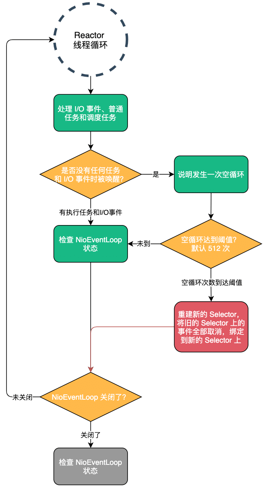

| 版本 | 内容 | 时间                   |
| ---- | ---- | ---------------------- |
| V1   | 新建 | 2022年2月23日18:38:06  |
| V2   | 重构 | 2023年05月22日21:22:17 |

## NioEventLoop#run 方法回顾

在前面的文章中已经详细分析了 NioEventLoop#run 方法的处理流程，这里简单回顾下：

- 检查是否有 I/O 事件就绪，是否有普通任务和调度任务需要执行；
- 处理 I/O 事件，处理普通任务和调度任务；
- 检查执行器 NioEventLoop 是否被关闭，如果被关闭了，需要走关闭执行器的逻辑；

需要注意的是，JDK 的 NIO  epoll 是有空循环 bug 的，会导致 Reactor 线程在没有任何事情可做的情况下被唤醒，导致 CPU 空转。Netty 在 NioEventLoop#run 中有处理这个空循环的问题，但是仅仅是规避这个问题，而不是解决。

> https://bugs.java.com/bugdatabase/view_bug?bug_id=6403933

## Netty 规避空循环 bug

### 检查空循环 bug 的发生

既然要规避 NIO epoll 空循环 bug，那么就需要检查该问题是否发生。Netty 的做法是用一个变量统计出现空循环的次数，假如空循环次数到达了一个阈值的时候就认为出现了 NIO epoll 空循环的 bug。

NioEventLoop 中有一个常量 SELECTOR_AUTO_REBUILD_THRESHOLD，表示空循环的阈值。

```java
// 超过指定次数就会重建 Selector，为了修复NIO的空轮询bug
private static final int SELECTOR_AUTO_REBUILD_THRESHOLD;
```

这个值是可以配置的，默认值是 512，如下：

```java
// Workaround for JDK NIO bug.
//
// See:
// - https://bugs.java.com/view_bug.do?bug_id=6427854
// - https://github.com/netty/netty/issues/203
static {
    final String key = "sun.nio.ch.bugLevel";
    final String bugLevel = SystemPropertyUtil.get(key);
    if (bugLevel == null) {
        try {
            AccessController.doPrivileged(new PrivilegedAction<Void>() {
                @Override
                public Void run() {
                    System.setProperty(key, "");
                    return null;
                }
            });
        } catch (final SecurityException e) {
            logger.debug("Unable to get/set System Property: " + key, e);
        }
    }

    int selectorAutoRebuildThreshold = SystemPropertyUtil.getInt("io.netty.selectorAutoRebuildThreshold", 512);
    if (selectorAutoRebuildThreshold < MIN_PREMATURE_SELECTOR_RETURNS) {
        selectorAutoRebuildThreshold = 0;
    }

    SELECTOR_AUTO_REBUILD_THRESHOLD = selectorAutoRebuildThreshold;

    if (logger.isDebugEnabled()) {
        logger.debug("-Dio.netty.noKeySetOptimization: {}", DISABLE_KEY_SET_OPTIMIZATION);
        logger.debug("-Dio.netty.selectorAutoRebuildThreshold: {}", SELECTOR_AUTO_REBUILD_THRESHOLD);
    }
}
```

具体的检查 bug 发生的处理逻辑是在 NioEventLoop#run 方法中的，下面的代码省略了一些逻辑

```java
@Override
protected void run() {
    // epoll bug的一个特征计数变量
    int selectCnt = 0;
    for (;;) {
        try {
            
            // ...... 省略执行 I/O 事件和任务的代码 ......

            if (ranTasks || strategy > 0) { // 要么有任务运行，要么有 IO 事件处理
                if (selectCnt > MIN_PREMATURE_SELECTOR_RETURNS && logger.isDebugEnabled()) {
                    logger.debug("Selector.select() returned prematurely {} times in a row for Selector {}.",
                            selectCnt - 1, selector);
                }
                // 正常流程进到这里面，NioEventLoop线程从Selector唤醒后工作，是因为有IO事件
                selectCnt = 0;
            }
            // 处理nio的bug
            else if (unexpectedSelectorWakeup(selectCnt)) { // Unexpected wakeup (unusual case)
                // 即没有任务运行，也没有IO 事件处理，就有可能是 JDK 的 epoll 的空轮询 BUG
                // 调用 unexpectedSelectorWakeup(selectCnt) 方法处理。
                // 可能会重新建立 Select
                selectCnt = 0;
            }
        } catch (CancelledKeyException e) {
            // Harmless exception - log anyway
            if (logger.isDebugEnabled()) {
                logger.debug(CancelledKeyException.class.getSimpleName() + " raised by a Selector {} - JDK bug?",
                        selector, e);
            }
        } catch (Error e) {
            throw e;
        } catch (Throwable t) {
            handleLoopException(t);
        } finally {

            // ...... 省略检查执行器关闭的代码 ......

        }
    }
}
```

关键点就是 selectCnt 变量，它就是 epoll bug的一个特征计数变量。关于 `if (ranTasks || strategy > 0)` 这个判断，其中的 ranTasks 表示执行的普通任务和调度任务的个数，strategy 表示处理的 I/O 事件的个数。当代码执行到这里的时候，如果这两个条件都不满足的话，就说明出现了 nio epoll 空循环 bug 了，就需要调用 NioEventLoop#unexpectedSelectorWakeup 方法去处理了。

### 规避空循环 bug，重建 Selector

NioEventLoop#unexpectedSelectorWakeup

关键点就是假如变量 selectCnt 的值，也就是空循环次数已经到达了阈值 512 次了，那么就会调用 NioEventLoop#rebuildSelector 方法去重建一个新的 Selector。

```java
// returns true if selectCnt should be reset
private boolean unexpectedSelectorWakeup(int selectCnt) {
    if (Thread.interrupted()) {
        // Thread was interrupted so reset selected keys and break so we not run into a busy loop.
        // As this is most likely a bug in the handler of the user or it's client library we will
        // also log it.
        //
        // See https://github.com/netty/netty/issues/2426
        if (logger.isDebugEnabled()) {
            logger.debug("Selector.select() returned prematurely because " +
                    "Thread.currentThread().interrupt() was called. Use " +
                    "NioEventLoop.shutdownGracefully() to shutdown the NioEventLoop.");
        }
        return true;
    }
    // 轮训超过默认的512次 就认为是bug状态了
    if (SELECTOR_AUTO_REBUILD_THRESHOLD > 0 &&
            selectCnt >= SELECTOR_AUTO_REBUILD_THRESHOLD) {
        // The selector returned prematurely many times in a row.
        // Rebuild the selector to work around the problem.
        logger.warn("Selector.select() returned prematurely {} times in a row; rebuilding Selector {}.",
                selectCnt, selector);
        rebuildSelector();
        return true;
    }
    return false;
}
```

NioEventLoop#rebuildSelector 方法需要保证是在 EventLoop 绑定的线程中执行的，最后会调用到 NioEventLoop#rebuildSelector0 方法

```java
private void rebuildSelector0() {
        final Selector oldSelector = selector;
        final SelectorTuple newSelectorTuple;

        if (oldSelector == null) {
            return;
        }

        try {
            // 开启新的Selector
            newSelectorTuple = openSelector();
        } catch (Exception e) {
            logger.warn("Failed to create a new Selector.", e);
            return;
        }

        // Register all channels to the new Selector.
        int nChannels = 0;
        // 遍历旧的Selector上的key
        for (SelectionKey key: oldSelector.keys()) {
            Object a = key.attachment();
            try {
                if (!key.isValid() || key.channel().keyFor(newSelectorTuple.unwrappedSelector) != null) {
                    continue;
                }

                // 取消旧的Selector上触发的事件
                int interestOps = key.interestOps();
                key.cancel();
                // 把Channel注册到新的Selector上
                SelectionKey newKey = key.channel().register(newSelectorTuple.unwrappedSelector, interestOps, a);
                if (a instanceof AbstractNioChannel) {
                    // Update SelectionKey
                    ((AbstractNioChannel) a).selectionKey = newKey;
                }
                nChannels ++;
            } catch (Exception e) {
               // ...... 省略异常处理逻辑 ......
            }
        }

        selector = newSelectorTuple.selector;
        unwrappedSelector = newSelectorTuple.unwrappedSelector;

        try {
            // time to close the old selector as everything else is registered to the new one
            // 关闭旧的Selector
            oldSelector.close();
        } catch (Throwable t) {
            if (logger.isWarnEnabled()) {
                logger.warn("Failed to close the old Selector.", t);
            }
        }

        if (logger.isInfoEnabled()) {
            logger.info("Migrated " + nChannels + " channel(s) to the new Selector.");
        }
    }
```

简单来说：

* 创建一个新的 Selector；
* 将原来的 Selector 中注册的事件全部取消；
* 将可用事件重新注册到新的 Selector 并激活；

## 小结

JDK 的 NIO 的 bug 会导致 reactor 线程一直空循环，导致 CPU 空转，使用率上升。Netty 通过一个计数变量记录空循环的次数，当空循环的次数达到默认的 512 次（可配置）时，Netty 会重新构建一个 Selector，将旧的 Selector 上的事件都取消掉，然后注册 Channel 到新的 Selector 上，并关注对应的感兴趣的事件，旧的 Selector 关闭掉。

Netty 的处理并不是解决 JDK NIO 的空循环的 bug，而只是通过手段来规避这个 bug 导致的问题。实际开发中，我们也可以借鉴这个思路，假如某个问题无法彻底解决，或者解决这个问题投入的产出比不高时，我们可以考虑换一种思路去绕过这个问题，从而达到同样的效果。

下面是 Netty 规避这个 bug 的整体流程图：


