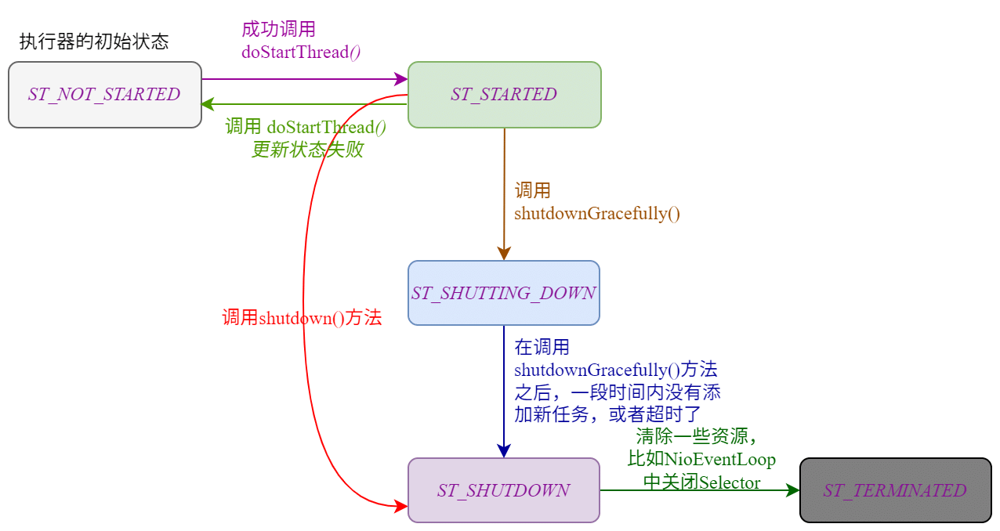
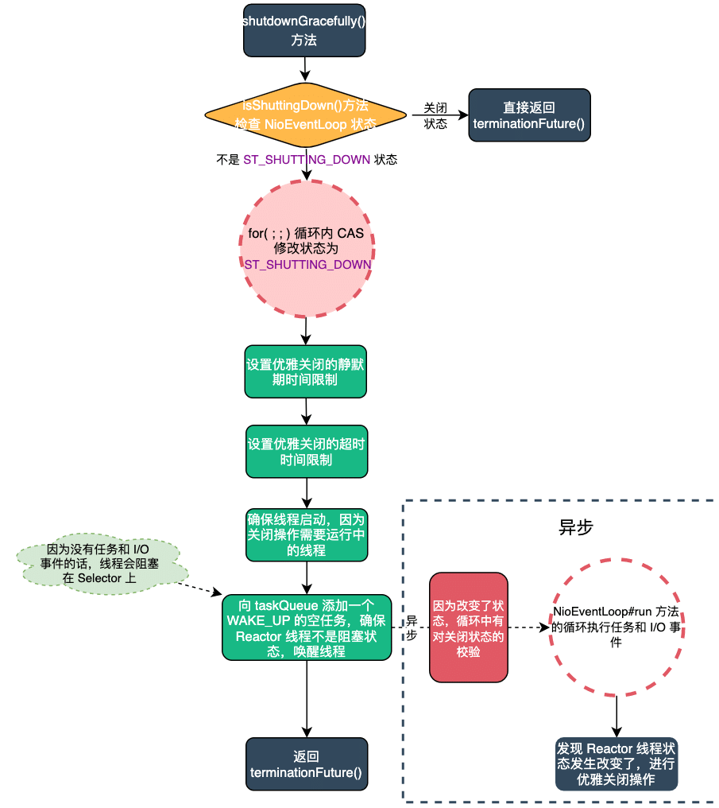
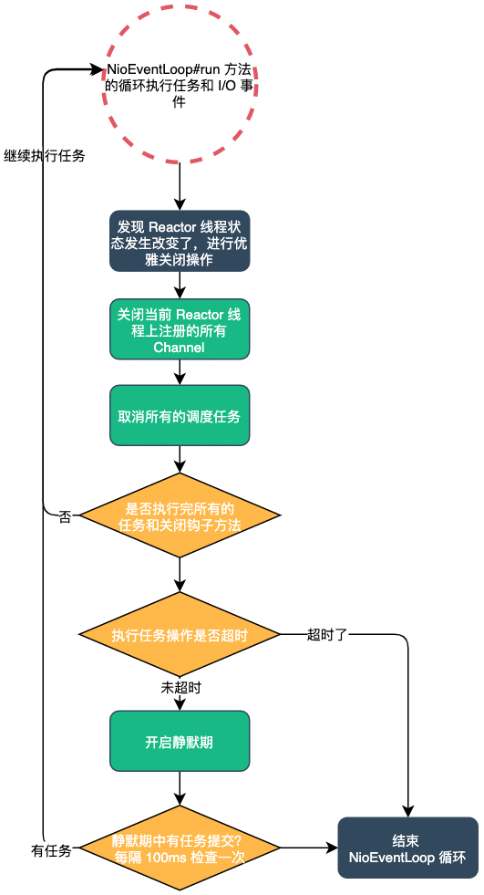
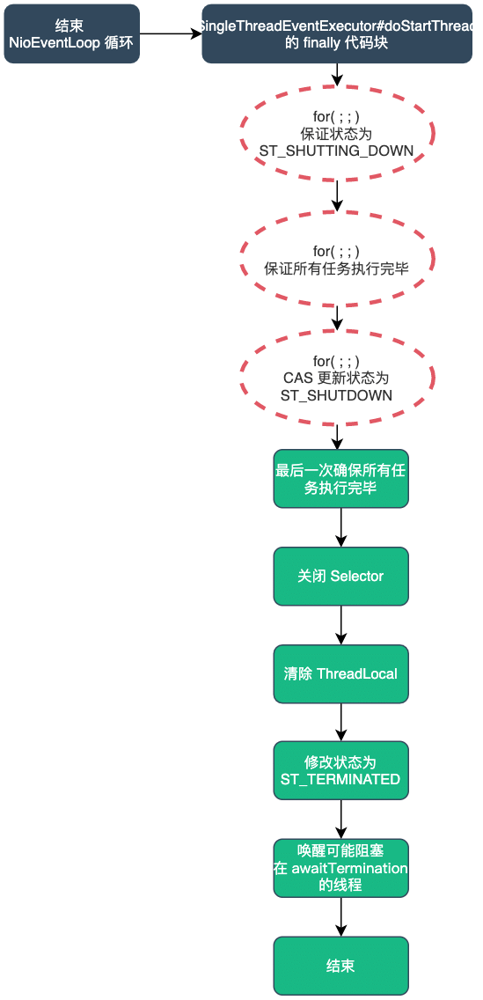
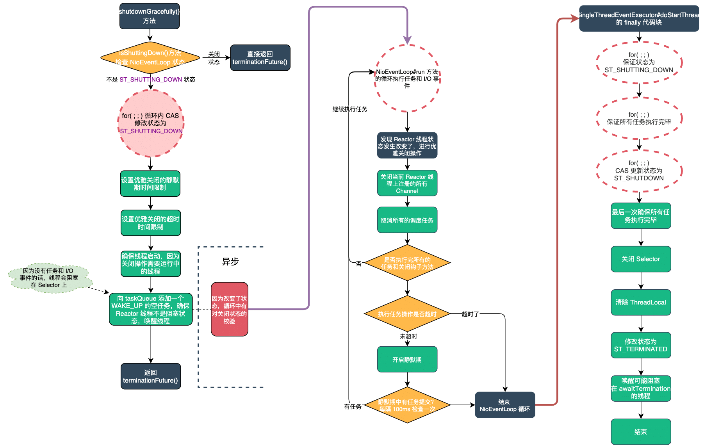

| 版本 | 内容 | 时间                   |
| ---- | ---- | ---------------------- |
| V1   | 新建 | 2022年2月18日18:34:24  |
| V2   | 重构 | 2023年05月23日22:08:02 |

## NioEventLoop 的状态

再次回顾下 Reactor 线程的状态，具体定义在 io.netty.util.concurrent.SingleThreadEventExecutor 类中，如下：

```java
private static final int ST_NOT_STARTED = 1;
private static final int ST_STARTED = 2;
private static final int ST_SHUTTING_DOWN = 3;
private static final int ST_SHUTDOWN = 4;
private static final int ST_TERMINATED = 5;
```

- **ST_NOT_STARTED**：Reactor 线程刚初始化的默认状态，此时执行器的线程还未启动；
- **ST_STARTED**：表示线程已经成功调用了 `startThread();` 方法，此时会调用子类的 run 方法，子类的 run 方法一般都是死循环，除非调用了关闭执行器的方法。此时执行器已经是开启状态了；
- **ST_SHUTTING_DOWN**：表示线程调用了关闭执行器的方法，如`shutdownGracefully()`。这个状态会将 schedule 队列里的调度任务都 cancel 掉，然后运行 taskQueue 中的所有普通任务和 shutdownHooks 关闭的钩子任务。Netty 会根据设置的静默期和超时时间来决定是否在关闭期间接收任务；
- **ST_SHUTDOWN**：ST_SHUTTING_DOWN 状态下在一段时间没有新的任务加入或者等待超时时才会切换到这个状态，（直接调用 `shutdown()` 方法也会直接切到这个状态），这个状态是不接受新的任务的；
- **ST_TERMINATED**：当执行器中的资源清理完成，任务也全部完成后就会修改成这个状态；



## 优雅关闭的参数

在 io.netty.util.concurrent.AbstractEventExecutor 中定义了空参的 shutdownGracefully() 方法，它的默认参数如下：

```java
// 调用 shutdownGracefully 方法默认静默期时间
static final long DEFAULT_SHUTDOWN_QUIET_PERIOD = 2;
// 调用 shutdownGracefully 方法默认 shutdown 超时时间
static final long DEFAULT_SHUTDOWN_TIMEOUT = 15;

@Override
public Future<?> shutdownGracefully() {
    return shutdownGracefully(DEFAULT_SHUTDOWN_QUIET_PERIOD, DEFAULT_SHUTDOWN_TIMEOUT, TimeUnit.SECONDS);
}
```

关于这两个参数的详细解释如下：

- DEFAULT_SHUTDOWN_QUIET_PERIOD：优雅关闭的静默期，默认是 2 秒钟。在关闭流程开始后，如果任务队列中还有异步任务需要执行，此时需要等待这些异步任务执行完毕后才可以走关闭的操作了，这样做就尽可能的保障业务正常。对于默认值 2s 来说，它的含义如下：
  - **在静默期 2 秒内如果没有新的任务提交，则执行关闭**线程池的流程;
  - **每个静默期 2 秒内有新的任务提交了，此时会添加 WAKEUP_TASK 任务唤醒线程去执行任务；** 
- DEFAULT_SHUTDOWN_TIMEOUT：优雅关闭的超时时间，默认 15 秒钟，主要保证 Netty 整个关闭过程中的时间可控，不可能只要有异步任务我们就执行，超过了这个时间，无论此时有无异步任务需要执行都要开始关闭了。对于默认值 15s 来说，它的含义是**无论在静默期内是否有提交任务，超过 15 秒就不允许提交任务了；** 

## Reactor 线程关闭时的钩子方法

在真正分析优雅关闭前，先要了解一下 Netty 的 Reactor 线程的关闭时的钩子方法。

SingleThreadEventExecutor#addShutdownHook，可以添加钩子方法，这些方法会在 Reactor 线程关闭时执行：

```java
/**
 * Add a {@link Runnable} which will be executed on shutdown of this instance
 */
public void addShutdownHook(final Runnable task) {
    if (inEventLoop()) {
        shutdownHooks.add(task);
    } else {
        execute(new Runnable() {
            @Override
            public void run() {
                shutdownHooks.add(task);
            }
        });
    }
}
```

> 需要注意的是：这个 ShutdownHook，不是 JDK 的 JVM 关闭时的钩子函数，这个只是 Netty 自己实现的一个机制

## Reactor 线程组的优雅关闭的入口

还是拿 Netty 自带的案例里面的代码来说吧，io.netty.example.echo.EchoServer。

```java
EventLoopGroup bossGroup = new NioEventLoopGroup(1);
EventLoopGroup workerGroup = new NioEventLoopGroup();
```

创建了一个主 Reactor 线程组和一个从 Reactor 线程组，EventLoopGroup 内部使用一个 EventExecutor 类型的数组来保存 Reactor 线程，比如 NioEventLoop。

关于 Reactor 线程组的优雅关闭的 API 入口如下：io.netty.util.concurrent.MultithreadEventExecutorGroup#shutdownGracefully

```java
@Override
public Future<?> shutdownGracefully(long quietPeriod, long timeout, TimeUnit unit) {
    // 通过循环遍历，关闭所管理的所有子事件轮询器 EventExecutor
    for (EventExecutor l: children) {
        l.shutdownGracefully(quietPeriod, timeout, unit);
    }
    return terminationFuture();
}
```

可以看到其实就是将 Reactor 线程组中的所有 Reactor 线程都优雅关闭。最后返回 `terminationFuture()`

这里再回顾下 EventLoopGroup 中创建 NioEventLoop 中的添加终止监听的部分逻辑：

```java
protected MultithreadEventExecutorGroup(int nThreads, Executor executor,
                                        EventExecutorChooserFactory chooserFactory, 
                                        Object... args) {
    // ...... 省略其他逻辑 ......

    final FutureListener<Object> terminationListener = new FutureListener<Object>() {
        @Override
        public void operationComplete(Future<Object> future) throws Exception {
            if (terminatedChildren.incrementAndGet() == children.length) {
                terminationFuture.setSuccess(null);
            }
        }
    };

    // 为每个EventLoop线程添加添加线程终止监听
    for (EventExecutor e: children) {
        e.terminationFuture().addListener(terminationListener);
    }

    // ...... 省略其他逻辑 ......
}
```

这里也可以看到，在 EventLoopGroup 初始化的最后一步，会定义一个 terminationListener 终止监听，当所有的 NioEventLoop 都优雅关闭了之后，就会设置 EventLoopGroup 的 terminationFuture 为 success 。

## Reactor 线程的优雅关闭的入口

在上面一节已经分析过，Reactor 线程组的优雅关闭就是循环调用各个 Reactor 线程的 shutdownGracefully() 方法。

先看下调用 shutdownGracefully() 方法，Reactor 线程会发生什么事情（比如 NioEventLoop）



接下来我们分析下 io.netty.util.concurrent.SingleThreadEventExecutor#shutdownGracefully 方法的实现：

```java
@Override
public Future<?> shutdownGracefully(long quietPeriod, long timeout, TimeUnit unit) {
    ObjectUtil.checkPositiveOrZero(quietPeriod, "quietPeriod");
    if (timeout < quietPeriod) {
        // 假如执行器的关闭的超时时间timeout小于静默期时间quietPeriod，则报错
        throw new IllegalArgumentException(
                "timeout: " + timeout + " (expected >= quietPeriod (" + quietPeriod + "))");
    }
    ObjectUtil.checkNotNull(unit, "unit");

    // 如果当前执行器状态已经开始关闭，那么返回 terminationFuture()
    if (isShuttingDown()) {
        return terminationFuture();
    }

    boolean inEventLoop = inEventLoop();
    boolean wakeup;
    int oldState;
    for (;;) {
        // 如果当前执行器状态已经开始关闭，那么返回 terminationFuture()
        if (isShuttingDown()) {
            return terminationFuture();
        }
        int newState;
        wakeup = true;
        oldState = state;
        if (inEventLoop) {
            // 如果当前线程是执行器线程，新的执行器状态 newState 就是 ST_SHUTTING_DOWN
            // 这是因为当前线程是 eventLoop 线程，状态改变只会在 eventLoop 线程改变，所以这里可以直接赋值
            newState = ST_SHUTTING_DOWN;
        } else {
            // 当前线程不是执行器线程，需要分情况判断
            // 因为在某个时刻 eventLoop 线程可能会改变执行器的状态
            switch (oldState) {
                case ST_NOT_STARTED:
                case ST_STARTED:
                    // 只有当原来执行器状态是 未开始 和 已开始，
                    // 新的执行器状态 newState 才是 ST_SHUTTING_DOWN
                    newState = ST_SHUTTING_DOWN;
                    break;
                default:
                    // 否则还维持原样
                    newState = oldState;
                    wakeup = false;
            }
        }
        // 用 CAS 的方式原子化更新执行器状态，如果不成功，那么就在 for 循环中继续
        if (STATE_UPDATER.compareAndSet(this, oldState, newState)) {
            break;
        }
    }
    gracefulShutdownQuietPeriod = unit.toNanos(quietPeriod);
    gracefulShutdownTimeout = unit.toNanos(timeout);

    // 确保线程正常启动
    if (ensureThreadStarted(oldState)) {
        return terminationFuture;
    }

    if (wakeup) {
        // 唤醒可能阻塞的执行器线程，执行任务
        taskQueue.offer(WAKEUP_TASK);
        if (!addTaskWakesUp) {
            wakeup(inEventLoop);
        }
    }

    return terminationFuture();
}
```

### 第一步：检查线程状态

首先判断 Reactor 线程的状态，如果已经是大于 ST_SHUTTING_DOWN 状态了，就直接返回了。

```java
// 如果当前执行器状态已经开始关闭，那么返回 terminationFuture()
if (isShuttingDown()) {
    return terminationFuture();
}
```

关于 isShuttingDown() 方法的实现如下：

```java
/**
 * 表示当前执行器状态是开始shutdown之后，
 * 即包括 开始shutdown，完全shutdown和完全终止terminated
 */
@Override
public boolean isShuttingDown() {
    return state >= ST_SHUTTING_DOWN;
}
```

### 第二步：for 循环修改线程状态

```java
boolean inEventLoop = inEventLoop();
boolean wakeup;
int oldState;
for (;;) {
    // 如果当前执行器状态已经开始关闭，那么返回 terminationFuture()
    if (isShuttingDown()) {
        return terminationFuture();
    }
    int newState;
    wakeup = true;
    oldState = state;
    if (inEventLoop) {
        // 如果当前线程是执行器线程，新的执行器状态 newState 就是 ST_SHUTTING_DOWN
        // 这是因为当前线程是 eventLoop 线程，状态改变只会在 eventLoop 线程改变，所以这里可以直接赋值
        newState = ST_SHUTTING_DOWN;
    } else {
        // 当前线程不是执行器线程，需要分情况判断
        // 因为在某个时刻 eventLoop 线程可能会改变执行器的状态
        switch (oldState) {
            case ST_NOT_STARTED:
            case ST_STARTED:
                // 只有当原来执行器状态是 未开始 和 已开始，
                // 新的执行器状态 newState 才是 ST_SHUTTING_DOWN
                newState = ST_SHUTTING_DOWN;
                break;
            default:
                // 否则还维持原样
                newState = oldState;
                wakeup = false;
        }
    }
    // 用 CAS 的方式原子化更新执行器状态，如果不成功，那么就在 for 循环中继续
    if (STATE_UPDATER.compareAndSet(this, oldState, newState)) {
        break;
    }
}
```

- for 循环内部，每次循环都调用 isShuttingDown() 方法检查 Reactor 线程的状态；
- 如果当前线程就是 Reactor 绑定的线程，说明当前 Reactor 线程的状态肯定是已经启动的，直接就可以赋值成 ST_SHUTTING_DOWN 状态。如果当前线程不是 Reactor 绑定的线程，需要根据情况来修改状态。如果已经是 ST_SHUTTING_DOWN 以及后面的状态了，就不改变 Reactor 线程的状态了，保持现状；
- 最后使用 CAS 的方式原子更新 Reactor 线程的状态，更新成功退出 for 循环，否则继续循环尝试更新；

### 第三步：赋值优雅关闭的参数

```java
gracefulShutdownQuietPeriod = unit.toNanos(quietPeriod);
gracefulShutdownTimeout = unit.toNanos(timeout);
```

前面已经分析过着两个参数的含义了，这里就是把 shutdownGracefully() 方法的入参赋值给 io.netty.util.concurrent.SingleThreadEventExecutor 的属性了，这两个属性在 NioEventLoop#run 中的关闭逻辑中会用到，后面详细分析。

### 第四步：确保线程正常启动

```java
// 确保线程正常启动
if (ensureThreadStarted(oldState)) {
    return terminationFuture;
}
```

执行优雅关闭需要我们保证 Reactor 线程是正常启动的状态，因为优雅关闭期间还是可以执行任务的，需要线程是启动的状态。

io.netty.util.concurrent.SingleThreadEventExecutor#ensureThreadStarted

```java
private boolean ensureThreadStarted(int oldState) {
    if (oldState == ST_NOT_STARTED) {
        try {
            doStartThread();
        } catch (Throwable cause) {
            STATE_UPDATER.set(this, ST_TERMINATED);
            terminationFuture.tryFailure(cause);

            if (!(cause instanceof Exception)) {
                // Also rethrow as it may be an OOME for example
                PlatformDependent.throwException(cause);
            }
            return true;
        }
    }
    return false;
}
```

### 第五步：唤醒可能阻塞的 Reactor 线程

```java
if (wakeup) {
    // 唤醒可能阻塞的执行器线程，执行任务
    taskQueue.offer(WAKEUP_TASK);
    if (!addTaskWakesUp) {
        wakeup(inEventLoop);
    }
}
```

关于 wakeup 变量，只有线程是 ST_NOT_STARTED 和 ST_STARTED 状态才是 true，其他关闭相关的状态是 false。是 true 的情况下会向 taskQueue 队列中添加一个 WAKEUP_TASK 任务。它就是一个唤醒任务，什么都没干：

```java
static final Runnable WAKEUP_TASK = new Runnable() {
    @Override
    public void run() { } // Do nothing
 };
```

关于 addTaskWakesUp 变量，默认是 false，所以这里也是会调用 wakeup 方法，看下 NioEventLoop 的实现:

io.netty.channel.nio.NioEventLoop#wakeup

```java
/**
 * 唤醒 eventloop
 */
@Override
protected void wakeup(boolean inEventLoop) {
    if (!inEventLoop && nextWakeupNanos.getAndSet(AWAKE) != AWAKE) {
        selector.wakeup();
    }
}
```

小结一下：

- 假如当前 Reactor 线程的状态是 ST_NOT_STARTED 和 ST_STARTED 状态（ST_NOT_STARTED 状态后续会变成 ST_STARTED），首先会向任务队列 taskQueue 中添加一个空的 WAKEUP_TASK 唤醒任务。
- 假如 Reactor 线程未在 Selector 上阻塞，这样就可以保证 Reactor 线程在执行异步任务后直接进入优雅关闭逻辑；
- 假如 Reactor 线程正在 Selector 上阻塞，通过调用 selector.wakeup() 方法将其唤醒，再进入优雅关闭逻辑；

### shutdownGracefully 方法小结

shutdownGracefully() 方法主要做的事情如下：

- 修改 Reactor 线程的状态；
- 赋值优雅关闭的静默期和超时时间；
- 确保线程正常启动；
- 向 taskQueue 添加唤醒任务，另外确保唤醒 Reactor 线程；

做完上面这些事情后，因为 io.netty.channel.nio.NioEventLoop#run 方法在每次循环结束都会检查 Reactor 线程的状态，假如状态是 ST_SHUTTING_DOWN 和它之后的状态，就会进入关闭的逻辑了。

## Reactor 线程的优雅关闭

整个退出 NioEventLoop 循环的流程如下：



### 检查 Reactor 线程状态

前面在 shutdownGracefully 方法中已经将 Reactor 线程的状态设置为 ST_SHUTTING_DOWN 状态了，NioEventLoop#run 方法的每次循环最后都会检查 Reactor 线程的状态，如下：

```java
@Override
protected void run() {
    // epoll bug的一个特征计数变量
    int selectCnt = 0;
    for (;;) {
        try {
            // ...... 省略 ......
            // 查询是否有要执行的 I/O 事件和任务
            // 执行 I/O 事件和任务
            // ...... 省略 ......
        } catch (CancelledKeyException e) {
            // ...... 省略 ......
        } catch (Error e) {
            throw e;
        } catch (Throwable t) {
            handleLoopException(t);
        } finally {
            // Always handle shutdown even if the loop processing threw an exception.
            try {
                if (isShuttingDown()) {
                    // 如果事件轮询器开始 shutdown，就要关闭 IO 资源
                    closeAll();
                    if (confirmShutdown()) {
                        return;
                    }
                }
            } catch (Error e) {
                throw e;
            } catch (Throwable t) {
                handleLoopException(t);
            }
        }
    }
}
```

在 finally 代码块中，每次都会调用 isShuttingDown() 方法检查 Reactor 线程的状态，如果状态是 ST_SHUTTING_DOWN 和它之后的状态，就会进入关闭的逻辑了。

关闭的逻辑分为两个方法：

- NioEventLoop#closeAll：切量，也就是取消 Reactor 线程监听的 Channel 的事件；
- SingleThreadEventExecutor#confirmShutdown：保证剩余任务可以执行完毕，保证业务无损；

### 关闭 Reactor 监听的所有 Channel

NioEventLoop#closeAll，获取 Selector 上注册的所有 SelectionKey，通过它的附件就可以获取 Netty 中的 NioSocketChanel。最后就会依次关闭这些 Channel。

```java
/**
 * 把原本注册再 selector 上的所有 Channel 都关闭
 */
private void closeAll() {
    selectAgain();
    Set<SelectionKey> keys = selector.keys();
    Collection<AbstractNioChannel> channels = new ArrayList<AbstractNioChannel>(keys.size());
    for (SelectionKey k: keys) {
        Object a = k.attachment();
        if (a instanceof AbstractNioChannel) {
            channels.add((AbstractNioChannel) a);
        } else {
            k.cancel();
            @SuppressWarnings("unchecked")
            NioTask<SelectableChannel> task = (NioTask<SelectableChannel>) a;
            invokeChannelUnregistered(task, k, null);
        }
    }

    for (AbstractNioChannel ch: channels) {
        ch.unsafe().close(ch.unsafe().voidPromise());
    }
}
```

### 保证剩余任务执行

SingleThreadEventExecutor#confirmShutdown，只要有异步任务或者 ShutdwonHooks 需要执行，就不能关闭，需要等待所有任务或者 ShutdownHooks 执行完毕，才会继续走后续关闭的逻辑。

```java
/**
 * 确保运行所有剩余的任务和关闭钩子函数。
 * 返回 true，表示可以让执行器变成完成 shutdown状态，
 */
protected boolean confirmShutdown() {
    if (!isShuttingDown()) {
        return false;
    }

    if (!inEventLoop()) {
        throw new IllegalStateException("must be invoked from an event loop");
    }

    // 取消所有Scheduled任务
    cancelScheduledTasks();

    if (gracefulShutdownStartTime == 0) {
        gracefulShutdownStartTime = ScheduledFutureTask.nanoTime();
    }

    // 轮询任务队列中的所有任务 和 运行 Shutdown 的钩子任务
    // 下面的条件返回true，表示任务和钩子任务至少有一个执行了，说明可能还有任务未执行，要保证继续执行就返回 false，同时添加一个 WAKEUP_TASK 任务到队列中起到唤醒作用
    if (runAllTasks() || runShutdownHooks()) {
        // 执行器状态已经完全 Shutdown
        if (isShutdown()) {
            // Executor shut down - no new tasks anymore.
            // 执行器关闭-不再添加新的任务。
            return true;
        }

        // There were tasks in the queue. Wait a little bit more until no tasks are queued for the quiet period or
        // terminate if the quiet period is 0.
        // See https://github.com/netty/netty/issues/4241
        if (gracefulShutdownQuietPeriod == 0) {
            return true;
        }
        // 避免 Reactor 在 Selector 上阻塞，因为此时已经不会再去处理I/O事件了，添加一个唤醒任务执行关闭流程
        taskQueue.offer(WAKEUP_TASK);
        // 返回false，说明还有任务没有执行，不能变成 Shutdown，
        // 继续调用confirmShutdown方法
        return false;
    }

    // 走到这里，说明条件 runAllTasks() || runShutdownHooks() 返回的是 false
    // 那就说明没有任务需要执行了，需要走真正关闭的逻辑了

    final long nanoTime = ScheduledFutureTask.nanoTime();

    if (isShutdown() || nanoTime - gracefulShutdownStartTime > gracefulShutdownTimeout) {
        // 执行器状态已经完全 Shutdown
        // 或者当前时间已经超过 优雅关闭的超时时间 gracefulShutdownTimeout
        return true;
    }

    // 即使现在没有任务也还是不能进行关闭，需要等待一个静默期，在静默期内如果没有新的任务提交，才会进行关闭
    // 如果在静默期内还有任务继续提交，那么静默期将会重新开始计算，进入一轮新的静默期检测
    // 在静默期间每100ms唤醒线程执行期间提交的任务
    if (nanoTime - lastExecutionTime <= gracefulShutdownQuietPeriod) {
        // Check if any tasks were added to the queue every 100ms.
        // TODO: Change the behavior of takeTask() so that it returns on timeout.
        // 检查每100毫秒是否有任务被添加到队列中。
        taskQueue.offer(WAKEUP_TASK);
        try {
            Thread.sleep(100);
        } catch (InterruptedException e) {
            // Ignore
        }

        // 返回false，说明还有任务没有执行，不能变成 Shutdown，
        // 继续调用confirmShutdown方法
        return false;
    }

    // No tasks were added for last quiet period - hopefully safe to shut down.
    // (Hopefully because we really cannot make a guarantee that there will be no execute() calls by a user.)
    // 静默时间内没有任务提交，可以优雅关闭，此时若用户又提交任务则不会被执行
    return true;
}
```

该方法的主要流程如下：

1. 校验 Reactor 线程的状态；
2. 取消调度队列中的所有调度任务；
3. `runAllTasks() || runShutdownHooks()` 执行所有的任务和关闭钩子任务，这个条件返回 false，就表示所有任务都执行完了；
4. 执行完所有任务后，判断关闭流程是否超时，如果超时了，直接退出当前方法，返回 true；
5. 执行完所有任务后，如果没有超时，就需要等待一个静默期，每隔 100ms 检查是否有新的任务需要执行，如果在静默期时间内有任务提交，就会去执行任务了。最后假如静默期内没有任务提交，就退出当前方法，返回 true；


关于 SingleThreadEventExecutor#confirmShutdown 方法的返回值，只要返回 true 就表示可以去执行真正的关闭逻辑了，从而退出 NioEventLoop#run 内的循环了

### 真正的关闭逻辑

回顾下之前 「NioEventLoop 绑定一个线程」 的那篇文章，在 SingleThreadEventExecutor#doStartThread 方法中，给 NioEventLoop 绑定看一个线程，然后调用了 NioEventLoop#run 方法进入的死循环。

本篇文章前面小结又分析了，关闭流程中退出 NioEventLoop#run 方法的死循环部分逻辑，所以本节主要分析 SingleThreadEventExecutor#doStartThread  中的关闭逻辑，主要就是 finally 代码块中的逻辑。

真正关闭的逻辑的流程图：



```java
private void doStartThread() {
    assert thread == null;
    // 这里直接调用 executor.execute 方法，
    // 我们要确保该方法每次都能提供新线程，
    // 否则多个执行器绑定的线程是同一个，是会有问题。
    // 因为一般 SingleThreadEventExecutor.this.run() 方法都是死循环，
    // 这就导致它会占用线程，导致共享线程的其他执行器，是没有办法执行任务的。
    executor.execute(new Runnable() {
        @Override
        public void run() {
            // 获取当前线程，赋值给 thread，就是执行器线程
            thread = Thread.currentThread();
            if (interrupted) {
                // 调用interruptThread()中断当前任务时没有thread值时会设置interrupted标识,现在来调用interrupt方法
                thread.interrupt();
            }

            boolean success = false;
            // 更新最近一次执行任务时间
            updateLastExecutionTime();
            try {
                // 这个方法由子类实现，一般情况下，这个方法里面利用死循环，
                // 来获取待执行任务队列 taskQueue 中的任务并运行。
                SingleThreadEventExecutor.this.run();
                success = true;
            } catch (Throwable t) {
                logger.warn("Unexpected exception from an event executor: ", t);
            } finally {
                // 采用死循环，使用 CAS 方式，确保执行器状态，变成 ST_SHUTTING_DOWN，或者已经大于 ST_SHUTTING_DOWN
                for (;;) {
                    int oldState = state;
                    // 当前执行器状态已经是 ST_SHUTTING_DOWN 之后，或者变成 ST_SHUTTING_DOWN 状态
                    if (oldState >= ST_SHUTTING_DOWN || STATE_UPDATER.compareAndSet(
                            SingleThreadEventExecutor.this, oldState, ST_SHUTTING_DOWN)) {
                        break;
                    }
                }

        		// ...... 省略非主干代码......

                try {
                    // 通过死循环和confirmShutdown() 方法，确保运行所有剩余的任务和关闭钩子函数。
                    // 此时，事件循环执行器还处于开始shutdown ST_SHUTTING_DOWN 状态，
                    for (;;) {
                        if (confirmShutdown()) {
                            break;
                        }
                    }

                    // 现在我们要确保从这一点开始不能添加更多任务。
                    // 这是通过切换状态来实现的。任何超出此时间点的新任务都将被拒绝。
                    for (;;) {
                        int oldState = state;
                        if (oldState >= ST_SHUTDOWN || STATE_UPDATER.compareAndSet(
                                SingleThreadEventExecutor.this, oldState, ST_SHUTDOWN)) {
                            break;
                        }
                    }

                    // 防止 NioEventLoop 状态在变为 SHUTDOWN 之前，在这个时间里，用户又提交了任务，
                    // 所以还需要最后一次调用 confirmShutdown() 将在这个极限时间内提交的任务执行完毕。
                    confirmShutdown();
                } finally {
                    try {
                        cleanup();
                    } finally {
                        FastThreadLocal.removeAll();

                        STATE_UPDATER.set(SingleThreadEventExecutor.this, ST_TERMINATED);
                        threadLock.countDown();
                        int numUserTasks = drainTasks();
                        if (numUserTasks > 0 && logger.isWarnEnabled()) {
                            logger.warn("An event executor terminated with " +
                                    "non-empty task queue (" + numUserTasks + ')');
                        }
                        terminationFuture.setSuccess(null);
                    }
                }
            }
        }
    });
}
```

这里从 finally 代码块开始分析：

（1）第一步：for 循环保证 NioEventLoop 的状态为 ST_SHUTTING_DOWN；

```java
for (;;) {
    int oldState = state;
    // 当前执行器状态已经是 ST_SHUTTING_DOWN 之后，或者变成 ST_SHUTTING_DOWN 状态
    if (oldState >= ST_SHUTTING_DOWN || STATE_UPDATER.compareAndSet(
        SingleThreadEventExecutor.this, oldState, ST_SHUTTING_DOWN)) {
        break;
    }
}
```

（2）第二步：for 循环保证所有任务和钩子任务都执行完，因为可能还有线程在极限时间内添加任务；

```java
// 通过死循环和confirmShutdown() 方法，确保运行所有剩余的任务和关闭钩子函数。
// 此时，事件循环执行器还处于开始shutdown ST_SHUTTING_DOWN 状态，
for (;;) {
    if (confirmShutdown()) {
        break;
    }
}
```

（3）第三步：for 循环 + CAS 保证 NioEventLoop 的状态改为 ST_SHUTDOWN，这个时候不允许再添加任务了；

```java
// 现在我们要确保从这一点开始不能添加更多任务。
// 这是通过切换状态来实现的。任何超出此时间点的新任务都将被拒绝。
for (;;) {
    int oldState = state;
    if (oldState >= ST_SHUTDOWN || STATE_UPDATER.compareAndSet(
        SingleThreadEventExecutor.this, oldState, ST_SHUTDOWN)) {
        break;
    }
}
```

（4）第四步：最后一次检查所有任务和钩子任务都执行完，因为可能还有线程在极限时间内添加任务；

```java
confirmShutdown();
```

（5）第五步：在 ST_SHUTDOWN 状态下关闭 Selector；io.netty.channel.nio.NioEventLoop#cleanup

```java
@Override
protected void cleanup() {
    try {
        selector.close();
    } catch (IOException e) {
        logger.warn("Failed to close a selector.", e);
    }
}
```

（6）第六步：移除 ThreadLocal 中存的数据；

```java
FastThreadLocal.removeAll();
```

（7）第七步：CAS 设置线程的状态为 ST_TERMINATED；

```java
STATE_UPDATER.set(SingleThreadEventExecutor.this, ST_TERMINATED);
```

（8）第八步：最后 `threadLock.countDown()` 唤醒用 SingleThreadEventExecutor#awaitTermination 方法导致阻塞的线程。然后设置 terminationFuture 的 success；

```java
threadLock.countDown();
int numUserTasks = drainTasks();
if (numUserTasks > 0 && logger.isWarnEnabled()) {
    logger.warn("An event executor terminated with " +
            "non-empty task queue (" + numUserTasks + ')');
}
terminationFuture.setSuccess(null);
```

EventLoop 内管理的所有 NioEventLoop 线程都关闭成功后，这个 EventLoop 才算关闭。

## 小结

Reactor 线程优雅管的总体流程图


