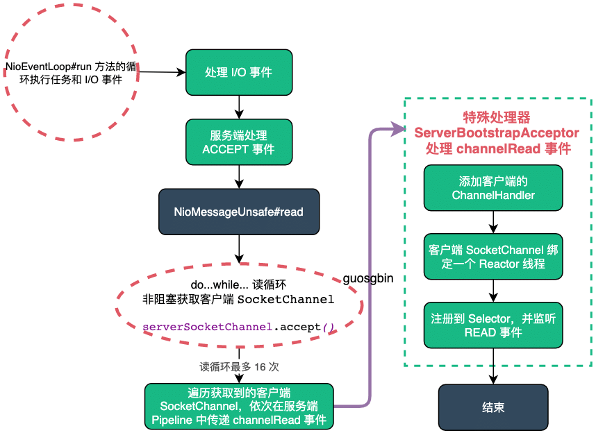

| 版本 | 内容 | 时间                   |
| ---- | ---- | ---------------------- |
| V1   | 新建 | 2022年3月10日21:48:52  |
| V2   | 重构 | 2023年05月24日22:44:27 |

## 回顾

### NioServerSocketChannel 的创建

首先看 NioServerSocketChannel 的构造方法

```java
public NioServerSocketChannel(ServerSocketChannel channel) {
    // 因为是服务端Channel，所以设置监听的事件为accept事件，最终会注册到Selector选择器上
    super(null, channel, SelectionKey.OP_ACCEPT);
    // 创建通道配置对象
    config = new NioServerSocketChannelConfig(this, javaChannel().socket());
}
```

第一步的 super 调用父类的构造方法，主要做的事情是：

1. 创建 Unsafe 实例，对于 NioServerSocketChannel 来说就是 NioMessageUnSafe 实例；
2. 创建并初始化管道 Pipeline；
3. 将 Channel 设置为非阻塞模式；
4. 保存 NioServerSocketChannel 要监听的事件为 OP_ACCEPT（这里并未注册监听事件）；

第二步的创建 NioServerSocketChannelConfig 对象，在之前的文章中没有分析过，本篇会简单分析下该对象，下一节分析。

### 服务端监听 OP_ACCEPT 事件

那么 NioServerSocketChannel 是在什么时候注册 OP_ACCEPT 的呢？主要是在服务端 Channel 绑定地址和端口成功后，会发送一个 ChannelActive 事件，会在 HeadContext 中处理这个事件，如下：

```java
@Override
public void channelActive(ChannelHandlerContext ctx) {
    ctx.fireChannelActive();

    // 是否需要主动触发读操作
    readIfIsAutoRead();
}
```

这里又会触发一次 read 事件，此时会走到 DefaultChannelPipeline.HeadContext#read 方法

```java
@Override
public void read(ChannelHandlerContext ctx) {
    unsafe.beginRead();
}
```

最终会走到 AbstractNioChannel#doBeginRead 方法

```java
/**
 * 设置感兴趣的事件
 * @throws Exception
 */
@Override
protected void doBeginRead() throws Exception {
    // Channel.read() or ChannelHandlerContext.read() was called
    final SelectionKey selectionKey = this.selectionKey;
    if (!selectionKey.isValid()) {
        return;
    }

    // 设置当前通道是 可读状态
    readPending = true;

    final int interestOps = selectionKey.interestOps();
    // 设置底层NIO通道读事件 OP_READ 或 OP_ACCEPT
    if ((interestOps & readInterestOp) == 0) {
        selectionKey.interestOps(interestOps | readInterestOp);
    }
}
```

可以看到就是给对应的 SelectionKey 设置监听的事件，对于服务端的 NioServerSocketChannel 来说，就是监听 OP_ACCEPT 事件。

### ServerBootstrapAcceptor 处理器

前面分析服务端启动流程的时候，最后是往服务端的 Pipeline 中添加了一个 ServerBootstrapAcceptor 处理器，当时并没有对这个处理器进行分析，这个处理器就是处理客户端连接的关键。

服务端启动完成后的管道的状态如下：

```
--------------          ---------------------------          ---------------
|			 |  ------> |			              | ------>  |             |
| HeadContext|          | ServerBootstrapAcceptor |          | TailContext |
|			 |  <------ |                         | <------  |             |
--------------          ---------------------------          ---------------
```

添加 ServerBootstrapAcceptor 到管道中的代码在  io.netty.bootstrap.ServerBootstrap#init 内：

```java
@Override
    void init(Channel channel) {
        // ...... 省略其他操作 ......
        p.addLast(new ChannelInitializer<Channel>() {
            // 这个initChannel会在 io.netty.channel.ChannelInitializer.handlerAdded处调用
            @Override
            public void initChannel(final Channel ch) {
                final ChannelPipeline pipeline = ch.pipeline();
                // 获得服务端配置的Handler
                ChannelHandler handler = config.handler();
                if (handler != null) {
                    pipeline.addLast(handler);
                }

                // 提交任务，添加 ServerBootstrapAcceptor 处理器
                ch.eventLoop().execute(new Runnable() {
                    @Override
                    public void run() {
                        pipeline.addLast(new ServerBootstrapAcceptor(
                                ch, currentChildGroup, currentChildHandler, currentChildOptions, currentChildAttrs));
                    }
                });
            }
        });
    }
```

### Reactor 线程处理 I/O 事件的入口

Reactor 线程的死循环在 io.netty.channel.nio.NioEventLoop#run 方法，伪逻辑如下：

```java
@Override
protected void run() {
    // epoll bug的一个特征计数变量
    int selectCnt = 0;
    for (;;) {
        try {
            // ....... 1. 检查是否有任务和就绪的I/O事件需要处理 ......
            // ....... 2. 处理任务和就绪I/O事件的 ......
        } catch (CancelledKeyException e) {
            // ....... 省略异常处理 ......
        } catch (Error e) {
            throw e;
        } catch (Throwable t) {
            handleLoopException(t);
        } finally {
                // ....... 3. 检查 Reactor 线程的状态，必要时走关闭流程 ......
            } catch (Error e) {
                throw e;
            } catch (Throwable t) {
                handleLoopException(t);
            }
        }
    }
}
```

处理 I/O 任务的入口在 NioEventLoop#processSelectedKeys 方法，最终会调用到 NioEventLoop#processSelectedKey(SelectionKey, AbstractNioChannel) 方法，伪代码如下：

```java
/**
 * 处理通道 AbstractNioChannel 的IO事件
 */
private void processSelectedKey(SelectionKey k, AbstractNioChannel ch) {
    // NioServerSocketChannel -> NioMessageUnsafe
    // NioSocketChannel -> NioByteUnsafe
    final AbstractNioChannel.NioUnsafe unsafe = ch.unsafe();
   
   // ...... 省略一些校验 ......

    try {
        // 获取 IO 事件类型
        int readyOps = k.readyOps();

        if ((readyOps & SelectionKey.OP_CONNECT) != 0) {
            // 处理 OP_CONNECT 事件
        }

        if ((readyOps & SelectionKey.OP_WRITE) != 0) {
            // 处理 OP_WRITE 事件
        }

        // Also check for readOps of 0 to workaround possible JDK bug which may otherwise lead
        // to a spin loop
        if ((readyOps & (SelectionKey.OP_READ | SelectionKey.OP_ACCEPT)) != 0 || readyOps == 0) {
            // 处理 OP_READ、OP_ACCEPT 事件，和可能的 JDK NIO bug
            unsafe.read();
        }
    } catch (CancelledKeyException ignored) {
        // key失效则close这个channel
        unsafe.close(unsafe.voidPromise());
    }
}
```

本篇文章我们主要分析的就是处理 OP_ACCEPT 事件，对于服务端来说，这里就是处理客户端连接的入口。

## NioServerSocketChannelConfig

前面在创建 NioServerSocketChannel 的时候，附带创建了一个 NioServerSocketChannelConfig。构造方法最终会调用到 DefaultChannelConfig 的构造方法：

```java
public DefaultChannelConfig(Channel channel) {
    // 创建 DefaultChannelConfig 对象，传入默认的 AdaptiveRecvByteBufAllocator
    this(channel, new AdaptiveRecvByteBufAllocator());
}

protected DefaultChannelConfig(Channel channel, RecvByteBufAllocator allocator) {
    setRecvByteBufAllocator(allocator, channel.metadata());
    this.channel = channel;
}

private void setRecvByteBufAllocator(RecvByteBufAllocator allocator, ChannelMetadata metadata) {
    checkNotNull(allocator, "allocator");
    checkNotNull(metadata, "metadata");
    if (allocator instanceof MaxMessagesRecvByteBufAllocator) {
        // 设置 MaxMessagesRecvByteBufAllocator 的 maxMessagesPerRead 的默认值 16
        ((MaxMessagesRecvByteBufAllocator) allocator).maxMessagesPerRead(metadata.defaultMaxMessagesPerRead());
    }
    setRecvByteBufAllocator(allocator);
}
```

就是创建了一个 AdaptiveRecvByteBufAllocator 对象，这个对象就是为了控制读循环和预测下次创建的 Bytebuf 的容量大小。（这个类的具体逻辑后续单独一篇文章分析）。

对于分析服务端处理客户端的连接来说，我们需要知道的是设置了一个默认值 16，就是上面的构造方法中调用的这行代码

```java
if (allocator instanceof MaxMessagesRecvByteBufAllocator) {
    // 设置 MaxMessagesRecvByteBufAllocator 的 maxMessagesPerRead 的默认值 16
    ((MaxMessagesRecvByteBufAllocator) allocator).maxMessagesPerRead(metadata.defaultMaxMessagesPerRead());
}
```

16 这个值是在 NioServerSocketChannel 类中定义的常量设置的。

```java
private static final ChannelMetadata METADATA = new ChannelMetadata(false, 16);
```

这里记住这个 16 就行了，后面遇到了它我会说明它的作用。

## 服务端处理 ACCEPT 事件

### 服务端处理 ACCEPT 事件概述

先看个整体流程图：



前面已经分析过，入口就在 NioEventLoop#processSelectedKey(SelectionKey, AbstractNioChannel) 方法中

```java
if ((readyOps & (SelectionKey.OP_READ | SelectionKey.OP_ACCEPT)) != 0 || readyOps == 0) {
    unsafe.read();
}
```

就是调用的 Unsafe 实例的 read() 方法，对于服务端来说就是 NioMessageUnsafe#read 方法：

```java
private final class NioMessageUnsafe extends AbstractNioUnsafe {

    private final List<Object> readBuf = new ArrayList<Object>();

    /**
     * 1 使用 readBuf 数组，一次读取操作所有的数据对象。
     * 2 通过 doReadMessages(readBuf) 方法，将消息读入给定数组 readBuf，并返回所读入的数量localRead。
     * 3 通过 localRead 的值，判断是否读取完成，或者通道已经关闭。
     * 4 通过 continueReading(allocHandle) 方法，判断是否需要继续读取。
     * 5 遍历读取消息的数组readBuf, 通过管道 pipeline 发送 ChannelRead 读取事件；遍历完成，通过管道 pipeline 发送 ChannelReadComplete 读取完成事件。
     */
    @Override
    public void read() {
        assert eventLoop().inEventLoop();
        // 服务端的config和pipeline
        final ChannelConfig config = config();
        final ChannelPipeline pipeline = pipeline();
        // 控制读循环和预测下次创建的bytebuf的容量大小
        final RecvByteBufAllocator.Handle allocHandle = unsafe().recvBufAllocHandle();
        allocHandle.reset(config);

        boolean closed = false;
        Throwable exception = null;
        try {
            try {
                // 读消息循环
                do {
                    // 将消息读入给定数组并返回所读入的数量
                    // 正常情况返回1
                    int localRead = doReadMessages(readBuf);
                    if (localRead == 0) {
                        break;
                    }
                    if (localRead < 0) {
                        closed = true;
                        break;
                    }

                    // 更新已读消息数量
                    allocHandle.incMessagesRead(localRead);
                } while (continueReading(allocHandle));
            } catch (Throwable t) {
                exception = t;
            }

            // 执行到此处 readBuf里存的都是NioSocketChannel对象

            int size = readBuf.size();
            for (int i = 0; i < size; i ++) {
                readPending = false;
                // 向服务端通道 传播每个客户端Channel对象
                pipeline.fireChannelRead(readBuf.get(i));
            }
            // 清空
            readBuf.clear();
            // 这次读取已完成
            allocHandle.readComplete();
            pipeline.fireChannelReadComplete();

            // ......省略异常处理代码......
        } finally {
            // ......省略非主干代码......
        }
    }
}
```

关于 NioMessageUnsafe 类的成员属性，这个集合用来存放已经读取到的客户端的连接。

```java
private final List<Object> readBuf = new ArrayList<Object>();
```

这个 read() 方法比较长，先简要分析下主要的流程，后面单独小结分析：

1. 首先获取服务端的 ChannelConfig 对象和 ChannelPipeline 对象。这里的 ChannelConfig 对于服务端来说就是 NioServerSocketChannelConfig 类了，在 NioServerSocketChannel 初始化的时候一起创建的；
2. 通过 UnSafe 实例获取一个 RecvByteBufAllocator 类型的实例，这个其实就是 AdaptiveRecvByteBufAllocator 类创建的一个 HandleImpl 对象，作用就是控制读循环次数和预测下次创建的 Bytebuf 的容量大小。对于服务端来说作用仅是控制读循环的次数；
3. 在 do...while... 读循环中（该循环默认最大 16 次），循环读取客户端的连接，保存到 readBuf 集合中；
4. 遍历集合，依次向服务端的 Pipeline 发布 ChannelRead 事件；
5. 特殊处理器 ServerBootstrapAcceptor 处理 ChannelRead 事件，创建 NioSocketChannel，并注册到一个 Reactor 线程的 Selector 上，监听 READ 事件；
6. 回到之前的 read() 方法，最后做一些其他处理，例如发布 ChannelReadComplete 事件，清空 readBuf 集合等；

### 第一步：读循环准备工作

```java
assert eventLoop().inEventLoop();
// 服务端的config和pipeline
final ChannelConfig config = config();
final ChannelPipeline pipeline = pipeline();
// 控制读循环和预测下次创建的bytebuf的容量大小
final RecvByteBufAllocator.Handle allocHandle = unsafe().recvBufAllocHandle();
allocHandle.reset(config);
```

首先需要校验进入 NioMessageUnsafe#read 方法的线程是否是 Reactor 线程。然后获取服务端的 NioServerSocketChannelConfig 配置对象和管道 Pipeline 对象。通过 UnSafe 实例获取一个 RecvByteBufAllocator 类型的实例，这个其实就是 AdaptiveRecvByteBufAllocator 类创建的一个 HandleImpl 对象。

### 第二步：循环读取客户端的连接

```java
try {
    // 读消息循环
    do {
        // 将消息读入给定数组并返回所读入的数量
        // 正常情况返回1
        int localRead = doReadMessages(readBuf);
        if (localRead == 0) {
            break;
        }
        if (localRead < 0) {
            closed = true;
            break;
        }

        // 更新已读消息数量
        allocHandle.incMessagesRead(localRead);
    } while (continueReading(allocHandle));
} catch (Throwable t) {
    exception = t;
}
```

关键点：

- `doReadMessages(readBuf)`：获取客户端连接；
- `allocHandle.incMessagesRead(localRead)`：更新循环次数；
- while 循环条件`continueReading(allocHandle)`：判断循环次数是否到上限值（默认值 16）；

#### 创建客户端 NioSocketChannel

关于 `doReadMessages(readBuf)` 方法，服务端会调用到 NioServerSocketChannel#doReadMessages，如下：

```java
@Override
protected int doReadMessages(List<Object> buf) throws Exception {
    // 参数是JDK层面的ServerSocketChannel
    // 调用accept获取到客户端SocketChannel
    SocketChannel ch = SocketUtils.accept(javaChannel());

    try {
        if (ch != null) {
            // 每次新连接都会创建一个NioSocketChannel
            buf.add(new NioSocketChannel(this, ch));
            return 1;
        }
    } catch (Throwable t) {
        logger.warn("Failed to create a new channel from an accepted socket.", t);

        try {
            ch.close();
        } catch (Throwable t2) {
            logger.warn("Failed to close a socket.", t2);
        }
    }

    return 0;
}
```

很简单，就是调用 JDK 层面的 ServerSocketChannel 的 accept() 方法，获取客户端新的连接

```
serverSocketChannel.accept();
```

每次监听到一个新的连接后，就创建一个 NioSocketChannel 对象封装 JDK 原生的 SocketChannel 对象。

1. 正常情况监听到新连接后，返回 1；
2. 没有监听到新连接，返回 0；

#### 更新读循环次数

`allocHandle.incMessagesRead(localRead)` 更新循环次数，服务端会调用到 MaxMessageHandle#incMessagesRead

```java
/**
 * 增加读消息的数量
 * @param amt
 */
@Override
public final void incMessagesRead(int amt) {
    totalMessages += amt;
}
```

totalMessages 是一个 int 类型的计数，表示当前循环已经循环读几次了。

#### 校验 while 读循环条件

while 循环条件`continueReading(allocHandle)`：判断循环次数是否到上限值（默认值 16）最终会调用到 MaxMessageHandle#continueReading(UncheckedBooleanSupplier) 方法

```java
@Override
public boolean continueReading(UncheckedBooleanSupplier maybeMoreDataSupplier) {
    // 控制读循环是否继续
    // 1.config.isAutoRead() 默认是true
    // 2.maybeMoreDataSupplier.get()   true：表示最后一次读取的数据量 和 预估的数据量 一样大，说明ch内可能还有剩余数据没有读取完毕，还需要继续读取
    // 3.totalMessages < maxMessagePerRead  一次unsafe.read 最多能从ch中读取16次数据，不能超出16
    // 4.totalBytesRead > 0
    //      客户端一般是true
    //      服务端 这里的值是fasle，每次unsafe.read 只进行一次读循环
    return config.isAutoRead() &&
        (!respectMaybeMoreData || maybeMoreDataSupplier.get()) &&
        totalMessages < maxMessagePerRead &&
        totalBytesRead > 0;
}
```

前面的两个条件在服务端的情况下都是 true，这里我们主要关注下面两个条件，也就是 `totalMessages < maxMessagePerRead && totalBytesRead > 0`，其中 maxMessagePerRead 就是我们说的默认值 16，totalMessages 表示当前循环已经循环读几次了。totalBytesRead 服务端没有用到，没有更新。

- `totalMessages < maxMessagePerRead`：当循环次数不大于 16 次时就返回 true；
- `totalBytesRead > 0`：服务端这里一直是 false。（Netty 的 bug，Netty 在后续版本修复了）；

#### 服务端获取客户端连接的 bug

前面说了对于 `totalBytesRead > 0` 条件，在服务端的情况下，这个条件一直是 false，也就是说 do...while... 循环最多只会有处理一个客户端连接。这就是 bug 所在。

TODO-KWOK 问一下 Netty 官方

### 第三步：传递 ChannelRead 事件

在获取客户端的连接后，然后依次将这些连接的信息（其实就是 NioSocketChannel）在服务端的 Pipeline 中传递 ChannelRead 事件。

```java
// 执行到此处 readBuf里存的都是NioSocketChannel对象
int size = readBuf.size();
for (int i = 0; i < size; i ++) {
    readPending = false;
    // 向服务端通道 传播每个客户端Channel对象
    pipeline.fireChannelRead(readBuf.get(i));
}
```

### 第四步：ServerBootstrapAcceptor 处理 ChannelRead

到了 ServerBootstrapAcceptor 处理 ChannelRead 事件了

```java
/**
 *
 * @param ctx 包含当前handler的ctx
 * @param msg NioSocketChannel实例
 */
@Override
@SuppressWarnings("unchecked")
public void channelRead(ChannelHandlerContext ctx, Object msg) {
    final Channel child = (Channel) msg;

    // 向客户端通道中添加一个ChannelInitializer对象
    child.pipeline().addLast(childHandler);

    setChannelOptions(child, childOptions, logger);
    setAttributes(child, childAttrs);

    try {
        // childGroup是worker线程组
        // 注册： 将workerGroup中的某个EventLoop和NioSocketChannel进行关联
        // 1.从worker组分配一个NioEventLoop给当前NioSocketChannel使用（NioEventLoop是多个Channel共享的）
        // 完成底层SocketChannel注册到底层Selector
        // 向NioSocketChannel通道发起Active事件，这个事件由head响应，head最终通过使用unsafe修改当前Channel的SelectionKey
        // 设置感兴趣的事件包含read， 代表当前监听读事件
        childGroup.register(child).addListener(new ChannelFutureListener() {
            @Override
            public void operationComplete(ChannelFuture future) throws Exception {
                if (!future.isSuccess()) {
                    forceClose(child, future.cause());
                }
            }
        });
    } catch (Throwable t) {
        forceClose(child, t);
    }
}
```

正是在这里，在 ServerBootstrap 中配置的客户端 NioSocketChannel 的所有属性初始化到 NioSocketChannel 中了。就是下面的 `.childHandler()` 方法内的内容，除开这个方法还有 `.childAttr()` 和`.childOption()`方法。

```java
ServerBootstrap b = new ServerBootstrap();
b.group(bossGroup, workerGroup)
    .channel(NioServerSocketChannel.class)
    .option(ChannelOption.SO_BACKLOG, 100)
    .handler(new LoggingHandler(LogLevel.INFO))
    .childHandler(new ChannelInitializer<SocketChannel>() {
        @Override
        public void initChannel(SocketChannel ch) throws Exception {
            ChannelPipeline p = ch.pipeline();
            if (sslCtx != null) {
                p.addLast(sslCtx.newHandler(ch.alloc()));
            }
            p.addLast(new LoggingHandler(LogLevel.WARN));
            p.addLast(new StringEncoder());
            p.addLast(new StringDecoder());
            p.addLast(serverHandler);
        }
    });
```


关于客户端 NioSocketChannel 选择一个 Reactor 线程，然后注册到 Selector 上的流程，这里不再详细分析了，主要流程和服务端启动流程中 NioServerSocketChannel 绑定 Reactor 线程和注册 Selector 是一样的。也就是下面的代码的逻辑：

```java
childGroup.register(child).addListener(new ChannelFutureListener() {
    @Override
    public void operationComplete(ChannelFuture future) throws Exception {
        if (!future.isSuccess()) {
            forceClose(child, future.cause());
        }
    }
});
```

这里只写关键代码：

**（1）从 NioEventLoopGroup 中选择一个 NioEventLoop 线程；**MultithreadEventLoopGroup#register(Channel)

```java
@Override
public ChannelFuture register(Channel channel) {
    return next().register(channel);
}
```

**（2）客户端 NioSocketChannel 绑定一个 NioEventLoop 线程；**

```java
@Override
public final void register(EventLoop eventLoop, final ChannelPromise promise) {
	// ...... 省略 ......

    AbstractChannel.this.eventLoop = eventLoop;
	
    // ...... 省略 ......
}
```

**（3）将客户端 NioSocketChannel注册到 NioEventLoop 线程上的 Selector 上；**AbstractNioChannel#doRegister

```java
/**
 * 将JDK层面的Channel注册到未包装的Selector选择器上
 * @throws Exception
 */
@Override
protected void doRegister() throws Exception {
    boolean selected = false;
    for (;;) {
        try {
            // javaChannel() 获得jdk层面的channel
            // JDK层面的Selector
            selectionKey = javaChannel().register(eventLoop().unwrappedSelector(), 0, this);
            return;
        } catch (CancelledKeyException e) {
            // ...... 省略 ......
        }
    }
}
```

**（4）最终通过 `pipeline.fireChannelActive()` 发布 ChannelActive 事件，最终会调用到AbstractNioChannel#doBeginRead 方法，监听 READ 事件。**

```java
@Override
protected void doBeginRead() throws Exception {
    // Channel.read() or ChannelHandlerContext.read() was called
    final SelectionKey selectionKey = this.selectionKey;
    if (!selectionKey.isValid()) {
        return;
    }

    // 设置当前通道是 可读状态
    readPending = true;

    final int interestOps = selectionKey.interestOps();
    // 设置底层NIO通道读事件 OP_READ 或 OP_ACCEPT
    if ((interestOps & readInterestOp) == 0) {
        selectionKey.interestOps(interestOps | readInterestOp);
    }
}
```

## 小结

服务端处理客户端连接，也就是 ACCEPT 事件，有一个读循环（默认最大循环 16 次），获取客户端连接的 NioSocketChannel 对象。然后通过特殊处理器 ServerBootstrapAcceptor 来处理客户端连接。主要做的事情还是将客户端 NioSocketChannel 绑定一个 NioEventLoop，并注册到 NioEventLoop 上的 Selector 并监听 READ 事件。

读循环有个最多循环的次数，默认 16 次。限制读循环的次数主要是因为 Netty 的 Reactor 线程不仅需要处理 I/O 事件，它还需要处理一些异步任务，所以不能将所有时间都耗费在 I/O 事件上。

当然 Netty 服务端处理客户端连接的读循环是有 bug 的，NioEventLoop 处理 ACCEPT 时，会调到 NioMessageUnsafe#read 方法中，这个里面的读循环的 while 条件永远是 false，也就是说只会处理一个客户端连接，这非常影响服务端的处理客户端连接的性能，当然这个 bug 在 Netty 后面的版本修复了。