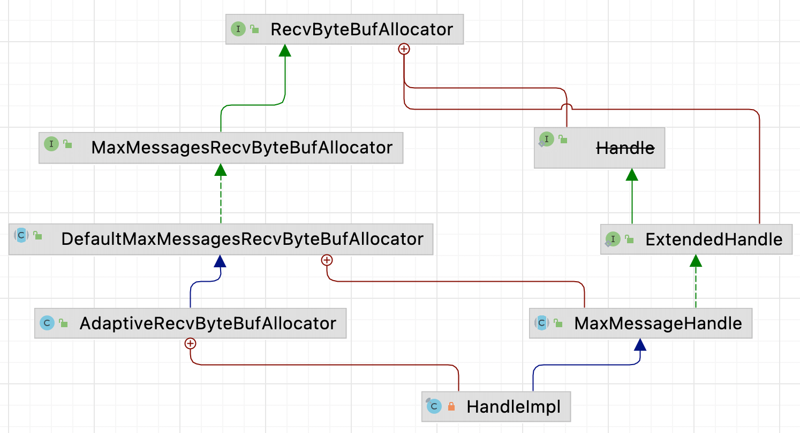
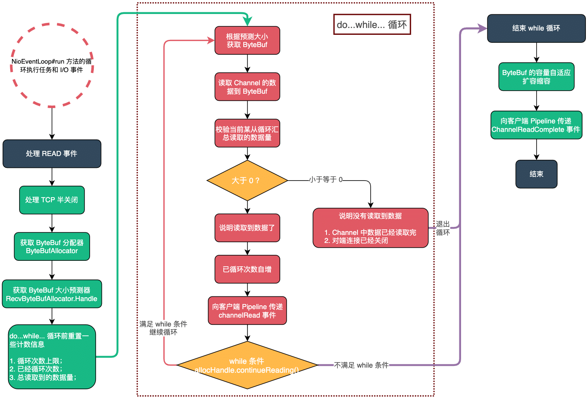

| 版本 | 内容 | 时间                   |
| ---- | ---- | ---------------------- |
| V1   | 新建 | 2022年2月18日18:34:24  |
| V2   | 重构 | 2023年05月27日14:28:26 |

## 分析顺序

想要理明白客户端处理 READ 事件的读循环，必须了解 AdaptiveRecvByteBufAllocator 和 MaxMessageHandle 这两个类的实现原理。本篇文章的分析流程如下：

1. 处理 READ 事件相关类的源码分析；
   1. AdaptiveRecvByteBufAllocator 源码分析；
   2. MaxMessageHandle 源码分析；

2. 客户端处理 READ 事件的主要流程；
3. 读取数据缓冲区 ByteBuf 的自适应扩容缩容机制；

## 处理 READ 事件相关类的源码分析

### 继承体系



这幅图包含了两个关键的类 AdaptiveRecvByteBufAllocator 和 MaxMessageHandle。

### RecvByteBufAllocator 接口

```java
public interface RecvByteBufAllocator {
    // 创建一个新的Handle，保存着预测的一些信息
    Handle newHandle();

    @Deprecated
    interface Handle {
        // 创建一个新的接收缓冲区，其容量可能足够大以读取所有入站数据，并且足够小以不浪费其空间
        ByteBuf allocate(ByteBufAllocator alloc);

        // 预测读循环下次该用多大的缓冲区接收数据
        int guess();

        // 读循环前重置上一次 READ 事件读取数据的一些统计参数
        void reset(ChannelConfig config);

        // 增加当前读取循环已读取的次数
        void incMessagesRead(int numMessages);

        // 设置上次循环中读取操作已读取的字节数
        void lastBytesRead(int bytes);

        // 获取上次循环中读取的字节数
        int lastBytesRead();

        // 设置-读取操作将（或已经）尝试读取的字节数。
        void attemptedBytesRead(int bytes);

        // 获取-读取操作将（或已经）尝试读取的字节数。
        int attemptedBytesRead();

        // 判断是否应该继续循环读取数据，一般用作 while 条件
        boolean continueReading();

        // READ 事件读取数据这步完成了，需要做一些处理，例如可能做自适应扩容缩容
        void readComplete();
    }

    @SuppressWarnings("deprecation")
    @UnstableApi
    interface ExtendedHandle extends Handle {
        // 判断是否应该继续循环读取数据，一般用作 while 条件
        boolean continueReading(UncheckedBooleanSupplier maybeMoreDataSupplier);
    }

    class DelegatingHandle implements Handle {
        // ......省略......
    }
}
```

RecvByteBufAllocator 有两个内部接口，分别是 Handle 和 ExtendedHandle 接口，它们的作用分别为：

- RecvByteBufAllocator 接口：提供创建 Handle 接口的实现类的 API；
- Handle 接口：主要提供读循环次数控制和自适应扩容缩容的 API；
- ExtendedHandle 接口：扩展了 Handle 接口的 continueReading 方法；

### MaxMessagesRecvByteBufAllocator 接口

MaxMessagesRecvByteBufAllocator 接口继承自 RecvByteBufAllocator 接口，主要是额外提供了两个方法：

```java
// 限制EventLoop尝试读取操作时尝试的读取操作次数
public interface MaxMessagesRecvByteBufAllocator extends RecvByteBufAllocator {
    // 获取-每个读取循环允许读的次数
    int maxMessagesPerRead();

    // 设置-每个读取循环允许读的次数
    MaxMessagesRecvByteBufAllocator maxMessagesPerRead(int maxMessagesPerRead);
}
```

前面我们提到过，读循环次数是有限制的，默认是 16 次，可以通过这两个 API 设置。

### DefaultMaxMessagesRecvByteBufAllocator 抽象类

这个抽象类主要提供两个字段：

```java
public abstract class DefaultMaxMessagesRecvByteBufAllocator implements MaxMessagesRecvByteBufAllocator {
    // 读循环允许的最大读次数
    private volatile int maxMessagesPerRead;
    private volatile boolean respectMaybeMoreData = true;
 
    // ......省略......
}
```

- maxMessagesPerRead：表示读循环允许的最大读次数，超过无论数据是否读取完毕都会退出读循环；
- respectMaybeMoreData：这个参数较复杂，用于控制 Channel 中可能还有数据未读取的情况下，如何处理的
  - true：当某次读循环读取的数据把分配的 ByteBuf 占满了，则说明 Channel 上可能还有数据未读取，需要继续尝试读取数据；
  - false：无论某次循环读取到的数据是否占满 ByteBuf，都需要继续循环读取数据。直到读取不到数据，或者对端关闭，或者超过读循环次数了，就退出循环；

关于 respectMaybeMoreData 参数，直译过来就是，对可能还有数据需要谨慎（respect）对待。

### MaxMessageHandle 的成员属性

MaxMessageHandle 的方法比较多，这里只说明它的成员属性代表的含义，后面分析 do...while...循环会结合成员方法一起分析：

```java
public abstract class MaxMessageHandle implements ExtendedHandle {
    private ChannelConfig config;
    // do...while... 读循环最大能够读取多少次，默认 16 次
    private int maxMessagePerRead;
    // do...while... 已经循环读取的次数
    private int totalMessages;
    // do...while... 循环已经读取的数据大小 size
    private int totalBytesRead;
    // 某次循环预计可以读的字节数
    private int attemptedBytesRead;
    // 最后一次读的字节数
    private int lastBytesRead;
    private final boolean respectMaybeMoreData = DefaultMaxMessagesRecvByteBufAllocator.this.respectMaybeMoreData;
	
    // ......省略成员方法......
}
```

- maxMessagePerRead：do...while... 读循环最大能够读取多少次，默认 16 次；
- totalMessages：do...while... 已经循环读取的次数；
- totalBytesRead：do...while... 循环已经读取的数据大小；
- attemptedBytesRead：某次循环预计可以读的字节数；
- lastBytesRead：最后一次读的字节数；
- respectMaybeMoreData：就是上一节分析的含义，见一节；

### HandleImpl 的成员属性

```java
private final class HandleImpl extends MaxMessageHandle {
    // 最小的在 SIZE_TABLE 的索引
    private final int minIndex;
    // 最大的在 SIZE_TABLE 的索引
    private final int maxIndex;
    // 当前缓冲区大小 在数组中的索引
    private int index;
    // 下一次分配的缓冲区的大小，，默认初始值 2048
    private int nextReceiveBufferSize;
    // 控制是否缩容
    private boolean decreaseNow;

	// ......省略成员方法......
}
```

这里主要关心 nextReceiveBufferSize 字段，表示下一次给读数据分配的缓冲区的大小，这个值是会自适应变大变小的，默认的初始值是 2048。

关于其他字段是自适应扩容缩容要用的，后面小节详细分析，这里先略过。

## 客户端处理 READ 事件详细流程

### 流程概览




```java
/**
     * 1 通过 doReadBytes(byteBuf) 方法,从底层NIO 通道中读取数据到输入缓冲区ByteBuf 中。
     * 2 通过 pipeline.fireChannelRead(...) 方法，发送ChannelRead读取事件。
     * 3 通过 allocHandle.continueReading() 判断是否需要继续读取。
     * 4 这次读取完成，调用 pipeline.fireChannelReadComplete() 方法，发送 ChannelReadComplete 读取完成事件。
     */
    @Override
    public final void read() {
        // 获取客户端的配置Config对象
        final ChannelConfig config = config();
        if (shouldBreakReadReady(config)) {
            clearReadPending();
            return;
        }
        // 获取客户端的pipeline对象
        final ChannelPipeline pipeline = pipeline();
        // 获取缓冲区分配器，默认是PooledByteBufAllocator
        final ByteBufAllocator allocator = config.getAllocator();
        // 控制读循环和预测下次创建的bytebuf的容量大小
        final RecvByteBufAllocator.Handle allocHandle = recvBufAllocHandle();
        // 清空上一次读取的字节数，每次读取时搜重新计算
        allocHandle.reset(config);

        ByteBuf byteBuf = null;
        boolean close = false;
        try {
            do {
                // 参数是缓冲区内存分配器
                // allocHandle只是预测分配多大的内存
                byteBuf = allocHandle.allocate(allocator);
                // doReadBytes(byteBuf) 读取当前Socket读缓冲区的数据到byteBuf对象中
                allocHandle.lastBytesRead(doReadBytes(byteBuf));
                // channel底层Socket读缓冲区 已经完全读取完毕会返回0，或者是Channel对端关闭了 返回-1
                if (allocHandle.lastBytesRead() <= 0) {
                    // nothing was read. release the buffer.
                    byteBuf.release();
                    byteBuf = null;
                    close = allocHandle.lastBytesRead() < 0;
                    if (close) {
                        // There is nothing left to read as we received an EOF.
                        // 此时是 -1
                        readPending = false;
                    }
                    break;
                }

                // 更新缓冲区预测分配器 读取消息数量
                allocHandle.incMessagesRead(1);
                readPending = false;
                // 因为 TCP 有粘包问题
                // 向客户端pipeline发送channelRead事件，该pipeline实现了channelRead的Handler就可以进行业务处理了
                pipeline.fireChannelRead(byteBuf);
                byteBuf = null;
            } while (allocHandle.continueReading());

            // 读取操作完毕
            allocHandle.readComplete();
            // 触发管道的fireChannelReadComplete事件
            pipeline.fireChannelReadComplete();

            if (close) {
                // 如果连接对端关闭了，则关闭读操作
                closeOnRead(pipeline);
            }
        } catch (Throwable t) {
            handleReadException(pipeline, byteBuf, t, close, allocHandle);
        } finally {
            // Check if there is a readPending which was not processed yet.
            // This could be for two reasons:
            // * The user called Channel.read() or ChannelHandlerContext.read() in channelRead(...) method
            // * The user called Channel.read() or ChannelHandlerContext.read() in channelReadComplete(...) method
            //
            // See https://github.com/netty/netty/issues/2254
            // 假如读操作完毕，且没有配置自动读，则从选择的Key兴趣集中移除读操作事件
            if (!readPending && !config.isAutoRead()) {
                removeReadOp();
            }
        }
    }
}
```

1.  处理 TCP 半关闭（Half-Close）；
2.  获取缓存区分配器 ByteBufAllocator 和控制读循环和预测缓存大小的分配器 RecvByteBufAllocator.Handle；
3.  `allocHandle.reset(config)`，循环前重置一些数据，如清空上一次读取的字节数；
4.  do...while... 循环读取数据；
   1.  `allocHandle.allocate(allocator)` 预测当前循环需要使用多大的 ByteBuf；
   2.  通过 `doReadBytes(byteBuf)` 方法，从底层 NIO 通道中读取数据到输入缓冲区 ByteBuf 中，如果所有数据都读取完毕，或者对端关闭连接了，就退出循环；
   3.  `allocHandle.incMessagesRead(1)` 更新缓冲区预测分配器，增加读循环次数；
   4.  ` pipeline.fireChannelRead(byteBuf)`，向客户端 pipeline 发送 channelRead 事件；
   5.   while 循环的条件 `allocHandle.continueReading()`，判断是否允许继续循环读数据；
5.  当前次数数据读取完毕或者循环读到了上限 16 次（可能 16 次都没读完），`pipeline.fireChannelReadComplete()` 向客户端管道发送 channelReadComplete 事件；

### 重置数据

在获取到缓冲区 ByteBuf 分配器 ByteBufAllocator 和 RecvByteBufAllocator 对象后，需要情况上一次 READ 事件的一些数据。

```java
// 清空上一次读取的字节数，每次读取时搜重新计算
allocHandle.reset(config);
```

最终调用到 MaxMessageHandle#reset 方法

```java
@Override
public void reset(ChannelConfig config) {
    this.config = config;
    // 重新设置 读循环操作 最大可读消息量，默认情况下是16，服务端和客户端都是16
    maxMessagePerRead = maxMessagesPerRead();
    // 统计字段归零
    totalMessages = totalBytesRead = 0;
}
```

主要就是将读循环最大次数 maxMessagePerRead、当前 do...while 循环的次数、和当前 do...while... 总共读取的数据大小都清空。

### do...while 循环：获取 ByteBuf

```java
byteBuf = allocHandle.allocate(allocator);
```

通过 RecvByteBufAllocator 和 ByteBufAllocator 获取 ByteBuf 对象，用于存放此次循环读取的数据。

调用到 MaxMessageHandle#allocate 方法

```java
@Override
public ByteBuf allocate(ByteBufAllocator alloc) {
    // guess()根据读循环过程中的上下文，预估一个适合本次读大小的值
    // alloc.ioBuffer 真正分配缓冲区的对象
    return alloc.ioBuffer(guess());
}
```

关键点就是这个 HandleImpl#guess 方法，前面说过 nextReceiveBufferSize 是下一次分配缓冲区 ByteBuf 的大小。是一个自适应的值。

```java
@Override
public int guess() {
    return nextReceiveBufferSize;
}
```

后面分析自适应扩容缩容的时候详细分析 nextReceiveBufferSize 字段，这里只需要知道会分配一个 nextReceiveBufferSize大小的 ByteBuf，用于本次循环读数据用。 

### do...while 循环：读取 Channel 数据

```java
allocHandle.lastBytesRead(doReadBytes(byteBuf));
```

这一步首先调用 NioSocketChannel#doReadBytes 方法读取数据到 ByteBuf 里：

```java
@Override
protected int doReadBytes(ByteBuf byteBuf) throws Exception {
    // 获取计算内存分配器Handle
    final RecvByteBufAllocator.Handle allocHandle = unsafe().recvBufAllocHandle();
    // 设置尝试读取字节数为buf的可写字节数
    allocHandle.attemptedBytesRead(byteBuf.writableBytes());
    // 参数1:JDK层面的SocketChannel实例
    // 参数2：长度length，想要读取的数据量
    // 返回从SocketChannel中读取的数据量
    // 从Channel中读取字节数并写入buf，返回读取字节
    return byteBuf.writeBytes(javaChannel(), allocHandle.attemptedBytesRead());
}
```

将本次 Channel 中可读取的数据大小保存到 MaxMessageHandle 类的 attemptedBytesRead 属性中，后面用于判断 while 循环的条件。MaxMessageHandle#attemptedBytesRead(int)

```java
@Override
public void attemptedBytesRead(int bytes) {
    attemptedBytesRead = bytes;
}
```


NioSocketChannel#doReadBytes 方法执行完毕后，调用 Handle#lastBytesRead(int) 方法记录当前真实读取到的数据大小，待会儿会和上面的 attemptedBytesRead 属性做比较。

```java
@Override
public void lastBytesRead(int bytes) {
    // 如果条件成立：说明读取的数据量和预测的数据量一致，
    // 也就是说将接收缓冲区的可写位置填满了，说明ch内可能还有数据未读取完...还需要继续
    if (bytes == attemptedBytesRead()) {
        // 要进行缓冲区大小伸缩了
        record(bytes);
    }
    super.lastBytesRead(bytes);
}
```

父类的 MaxMessageHandle#lastBytesRead(int) 方法

```java
@Override
public void lastBytesRead(int bytes) {
    lastBytesRead = bytes;
    if (bytes > 0) {
        totalBytesRead += bytes;
    }
}
```

上面的 record 方法是处理自适应扩容缩容的，这里放在后面分析。在父类的 MaxMessageHandle#lastBytesRead(int) 方法中，可以看到就是记录 lastBytesRead 字段的值，然后累加此次 do...while... 循环读取到的数据总量。

### do...while 循环：校验读取数据量

```java
// channel底层Socket读缓冲区 已经完全读取完毕会返回0，或者是Channel对端关闭了 返回-1
if (allocHandle.lastBytesRead() <= 0) {
    // nothing was read. release the buffer.
    byteBuf.release();
    byteBuf = null;
    close = allocHandle.lastBytesRead() < 0;
    if (close) {
        // There is nothing left to read as we received an EOF.
        // 此时是 -1
        readPending = false;
    }
    break;
}
```

`allocHandle.lastBytesRead()` 方法获取当前某次循环读取到的数据量，校验当前读取的数据是否正常：

1. 等于 0：说明当前数据已经读取完毕了，释放 ByteBuf 对象，并退出循环；
2. 小于 0：说明 Channel 对端关闭连接了，其实就是返回 -1，此时也需要释放 ByteBuf 对象，退出循环后会关闭读操作；
3. 大于 0：说明本次读到数据了，在 while 条件满足的情况下会继续尝试循环读取数据；

### do...while 循环：循环计数自增

```java
// 更新缓冲区预测分配器 读取消息数量
allocHandle.incMessagesRead(1);
```

MaxMessageHandle#incMessagesRead 方法

```java
/**
 * 增加读消息的数量
 * @param amt
 */
@Override
public final void incMessagesRead(int amt) {
    totalMessages += amt;
}
```

就是将 totalMessages 字段的值自增，表示已经循环读取的次数。

### do...while 循环：传递 channelRead 事件

```java
// 向客户端pipeline发送channelRead事件，该pipeline实现了channelRead的Handler就可以进行业务处理了
pipeline.fireChannelRead(byteBuf);
byteBuf = null;
```

### do...while 循环：校验 while 条件

```java
allocHandle.continueReading()
```

调用 MaxMessageHandle#continueReading() 方法判断是否允许继续循环读取数据。

```java
@Override
public boolean continueReading() {
    return continueReading(defaultMaybeMoreSupplier);
}

@Override
public boolean continueReading(UncheckedBooleanSupplier maybeMoreDataSupplier) {
    return config.isAutoRead() &&
           (!respectMaybeMoreData || maybeMoreDataSupplier.get()) &&
           totalMessages < maxMessagePerRead &&
           totalBytesRead > 0;
}
```

其中 defaultMaybeMoreSupplier 参数如下：

```java
private final UncheckedBooleanSupplier defaultMaybeMoreSupplier = new UncheckedBooleanSupplier() {
    @Override
    public boolean get() {
        return attemptedBytesRead == lastBytesRead;
    }
};
```

这个 while 条件的判断十分复杂，先说一下空参 continueReading 方法内部的重载方法传入的默认的 defaultMaybeMoreSupplier 参数，就是 `attemptedBytesRead == lastBytesRead`，这里我们得知道这两个字段的含义，前面已经分析过，这里再复述一遍：

- attemptedBytesRead：某次循环预计可读的数据量，（其实就是分配的 ByteBuf 的可写的大小）；
- lastBytesRead：某次循环实际读取的数据量；

把这两个条件做等值比较，表示就含义就是 「某次循环预计可读的数据量和实际读取的数据量是否相等」，如果相等了，则说明实际读取的数据量把分配的缓冲区 ByteBuf 占满了，也就是说明，SocketChannel 中可能还存在数据没有读取完，可能需要继续尝试循环读取。

**总的来说，对于 defaultMaybeMoreSupplier，返回 true，就表示可能还有数据未读取完；返回 false，表示 SocketChannel 此次读取数据完毕了。**

接下来分析 continueReading 方法里的四个条件了。

```java
 return config.isAutoRead() &&
           (!respectMaybeMoreData || maybeMoreDataSupplier.get()) &&
           totalMessages < maxMessagePerRead &&
           totalBytesRead > 0;
```

- config.isAutoRead() 默认就是 true；
- respectMaybeMoreData 前面分析过，具体见上面的 DefaultMaxMessagesRecvByteBufAllocator 类的字段分析。主要就是根据这个字段来决定是否继续用 defaultMaybeMoreSupplier 条件来判断。
  - 假如 respectMaybeMoreData 是 true，就需要通过 defaultMaybeMoreSupplier 来判断，如果 defaultMaybeMoreSupplier 返回 true，就表示可能还有数据未读取完，需要尝试继续循环读取数据；
- totalMessages 小于 maxMessagePerRead：表示 do...while... 循环次数还未到达上限（默认 16 次），可以继续循环尝试读取数据；
- totalBytesRead 大于 0：表示此次总的循环读取到数据了，可以继续尝试循环读取数据；

**只有这四个条件都满足了，才允许继续 do...while... 循环读取数据。**

### 读取完毕，后续操作

```java
// 读取操作完毕
allocHandle.readComplete();
// 触发管道的fireChannelReadComplete事件
pipeline.fireChannelReadComplete();

if (close) {
    // 如果连接对端关闭了，则关闭读操作
    closeOnRead(pipeline);
}
```

从 do...while... 循环退出后，可能有下面几种情况：

1. 此次读取数据，读完了；
2. 此次读取数据，对端关闭连接了；
3. 此次读取数据到达了读循环的上限次数（默认 16），Channel 内的数据还未读完；

> 设置读循环的上限的原因是，一个 Reactor 线程，它的 Selector 有很多 Channel 注册在上面，不能把时间都耗费在一个 Channel 上面。而且 Netty 的 Reactor 线程，除了处理 I/O 事件，还会处理一些异步任务。

```java
// 读取操作完毕
allocHandle.readComplete();
```

这一步操作是预估下次读取的 ByteBuf 的大小的，也就是自适应扩容缩容，下一节详细分析，这里知道入口就行了。

```java
// 触发管道的fireChannelReadComplete事件
pipeline.fireChannelReadComplete();
```

然后向管道传递 channelReadComplete 事件。

```java
if (close) {
    // 如果连接对端关闭了，则关闭读操作
    closeOnRead(pipeline);
}
```

最后，如果对端连接关闭了，则需要关闭读操作。

### 小结

自此我们分析完了客户端处理 READ 事件的详细流程了，

1.  处理 TCP 半关闭（Half-Close）；
2.  获取缓存区分配器 ByteBufAllocator 和控制读循环和预测缓存大小的分配器 RecvByteBufAllocator.Handle；
3.  `allocHandle.reset(config)`，循环前重置一些数据，如清空上一次读取的字节数；
4.  do...while... 循环读取数据；
    1.  `allocHandle.allocate(allocator)` 预测当前循环需要使用多大的 ByteBuf；
    2.  通过 `doReadBytes(byteBuf)` 方法，从底层 NIO 通道中读取数据到输入缓冲区 ByteBuf 中，如果所有数据都读取完毕，或者对端关闭连接了，就退出循环；
    3.  `allocHandle.incMessagesRead(1)` 更新缓冲区预测分配器，增加读循环次数；
    4.  ` pipeline.fireChannelRead(byteBuf)`，向客户端 pipeline 发送 channelRead 事件；
    5.  while 循环的条件 `allocHandle.continueReading()`，判断是否允许继续循环读数据；
5.  处理自适应扩容缩容；
6.  当前次数数据读取完毕或者循环读到了上限 16 次（可能 16 次都没读完），`pipeline.fireChannelReadComplete()` 向客户端管道发送 channelReadComplete 事件；

## 读数据缓冲区 ByteBuf 的自适应扩容缩容机制

### 分配 ByteBuf 入口

前面在分析客户端处理 READ 事件的 do...while... 循环中，我们说了每次循环读取数据的 ByteBuf 是可以自适应扩容缩容的。分配 ByteBuf 的入口就是

```java
byteBuf = allocHandle.allocate(allocator);
```

最终就是获取的 HandleImpl 的 nextReceiveBufferSize 字段。

```java
@Override
public int guess() {
    return nextReceiveBufferSize;
}
```

那么自适应扩容缩容的关键就是 nextReceiveBufferSize 是怎么计算的了。

### 自适应扩容缩容的入口

最终调整 nextReceiveBufferSize 字段大小的入口在 HandleImpl#record 方法，在 do...while... 循环中会有两个地方调用：

**第一个就是在 do...while 的单次循环中的下面的方法**，HandleImpl#lastBytesRead

```java
allocHandle.lastBytesRead(doReadBytes(byteBuf));
```

就是：

```java
@Override
public void lastBytesRead(int bytes) {
    if (bytes == attemptedBytesRead()) {
        // 要进行缓冲区大小伸缩了
        record(bytes);
    }
    super.lastBytesRead(bytes);
}
```

`bytes == attemptedBytesRead()` 是 true 的时候，说明本次读取数据的大小把 ByteBuf 都占满了，可能 channel 中可能还有更多的数据需要读取，这里就去做自适应扩容缩容的操作了。

**第二个就是在 do...while... 方法结束后调的了**，就是

```java
// 读取操作完毕
allocHandle.readComplete();
```

### 自适应扩容缩容的索引表

既然要自适应扩容缩容，那么得有一个指引告诉需要扩容和缩容到什么地步，Netty 中使用一个数组存放一些值，这些值表示 ByteBuf 的允许大小。

这个索引表的初始化位置在 AdaptiveRecvByteBufAllocator 类的静态代码块中：

```java
public class AdaptiveRecvByteBufAllocator extends DefaultMaxMessagesRecvByteBufAllocator {

    static final int DEFAULT_MINIMUM = 64;
    // Use an initial value that is bigger than the common MTU of 1500
    // MTU是"最大传输单元"（Maximum Transmission Unit）
    static final int DEFAULT_INITIAL = 2048;
    static final int DEFAULT_MAXIMUM = 65536;

    // 索引增量4（扩容增量）
    private static final int INDEX_INCREMENT = 4;
    // 索引减量1（缩容减量）
    private static final int INDEX_DECREMENT = 1;

    // RecvBuf分配容量表（扩缩容索引表）按照表中记录的容量大小进行扩缩容
    private static final int[] SIZE_TABLE;

    /**
     * 16-496间隔16 512到2的31次-1 间隔2倍
     */
    static {
        List<Integer> sizeTable = new ArrayList<Integer>();
        // 向集合16 32 48 .... 496
        for (int i = 16; i < 512; i += 16) {
            sizeTable.add(i);
        }

        // Suppress a warning since i becomes negative when an integer overflow happens
        // 继续向数组添加 512 1024 2048 ... 直到溢出（成为负数）
        for (int i = 512; i > 0; i <<= 1) { // lgtm[java/constant-comparison]
            sizeTable.add(i);
        }

        SIZE_TABLE = new int[sizeTable.size()];
        for (int i = 0; i < SIZE_TABLE.length; i ++) {
            SIZE_TABLE[i] = sizeTable.get(i);
        }
    }
 
    // ......省略......
}
```

简单说明下上面的一些常量的含义：

1. DEFAULT_MINIMUM：64，表示分配给 ByteBuf 大小的默认的最小值，ByteBuf 大小不会小于这个值；
2. DEFAULT_INITIAL：2048，表示分配给 ByteBuf 大小的默认的初始值；
3. DEFAULT_MAXIMUM：65536，表示分配给 ByteBuf 大小的默认的最大值，ByteBuf 大小不会大于这个值；
4. INDEX_INCREMENT：4，自适应扩容索引增量；
5. INDEX_DECREMENT：1，自适应缩容索引减量；
6. SIZE_TABLE 数组：就是我们的索引表了。

SIZE_TABLE 初始化后，最终的效果就是：

```
sizeTable = {ArrayList@1424}  size = 53
 0 = {Integer@1428} 16
 1 = {Integer@1429} 32
 2 = {Integer@1430} 48
 3 = {Integer@1431} 64
 4 = {Integer@1432} 80
 5 = {Integer@1433} 96
 6 = {Integer@1434} 112
 7 = {Integer@1435} 128
 8 = {Integer@1436} 144
 9 = {Integer@1437} 160
 10 = {Integer@1438} 176
 11 = {Integer@1439} 192
 12 = {Integer@1440} 208
 13 = {Integer@1441} 224
 14 = {Integer@1442} 240
 15 = {Integer@1443} 256
 16 = {Integer@1444} 272
 17 = {Integer@1445} 288
 18 = {Integer@1446} 304
 19 = {Integer@1447} 320
 20 = {Integer@1448} 336
 21 = {Integer@1449} 352
 22 = {Integer@1450} 368
 23 = {Integer@1451} 384
 24 = {Integer@1452} 400
 25 = {Integer@1453} 416
 26 = {Integer@1454} 432
 27 = {Integer@1455} 448
 28 = {Integer@1456} 464
 29 = {Integer@1457} 480
 30 = {Integer@1458} 496
 31 = {Integer@1459} 512
 32 = {Integer@1460} 1024
 33 = {Integer@1461} 2048
 34 = {Integer@1462} 4096
 35 = {Integer@1463} 8192
 36 = {Integer@1464} 16384
 37 = {Integer@1465} 32768
 38 = {Integer@1466} 65536
 39 = {Integer@1467} 131072
 40 = {Integer@1468} 262144
 41 = {Integer@1469} 524288
 42 = {Integer@1470} 1048576
 43 = {Integer@1471} 2097152
 44 = {Integer@1472} 4194304
 45 = {Integer@1473} 8388608
 46 = {Integer@1474} 16777216
 47 = {Integer@1475} 33554432
 48 = {Integer@1476} 67108864
 49 = {Integer@1477} 134217728
 50 = {Integer@1478} 268435456
 51 = {Integer@1479} 536870912
 52 = {Integer@1480} 1073741824
```

### 自适应扩容缩容分析

**扩容**：默认给 ByteBuf 分配的大小是 2048，在 SIZE_TABLE 索引表中的位置是 33。当某次读循环读的数据或者总读取的数据大于 2048，那么就会调整下一次分配的 ByteBuf 的大小了。使用扩容增量 4 （INDEX_INCREMENT）来扩容。

举例：当前是 2048，在索引表的位置是 33，扩容后就是 33 + 4 = 37，也就是对应 32768 了。

**缩容**：当某次读循环总读取的数据小于 2048，假如连续两次小于 2048，那么就会调整下一次分配的 ByteBuf 的大小了。使用缩容减量 1（INDEX_DECREMENT）来缩容。

举例：当前是 2048，在索引表的位置是 33，缩容后就是 33 - 1 = 32，也就是对应 1024 了。

> **注意：只需要读取数据的大小大于当前分配的大小 1 次，就会立即扩容。而缩容比较谨慎，需要连续 2 次小于才去进行缩容。**

下面看下具体的代码 HandleImpl#record

```java
/**
 * 记录，根据这次真实读取的数据大小，进行下一次读取接收缓冲区的大小伸缩
 * @param actualReadBytes 真实读取的数据大小
 */
private void record(int actualReadBytes) {
    // 连续两次小，才会进行缩减
    // 索引减量 INDEX_DECREMENT 为 1
    // 条件: 实际读取的字节数 <= index - INDEX_DECREMENT 位置的大小
    // 说明需要缩小
    if (actualReadBytes <= SIZE_TABLE[max(0, index - INDEX_DECREMENT)]) {
        if (decreaseNow) {
            // 减少，索引-1，不小于最小索引
            index = max(index - INDEX_DECREMENT, minIndex);
            // 赋值下一次分配的缓冲区大小
            nextReceiveBufferSize = SIZE_TABLE[index];
            decreaseNow = false;
        } else {
            // 第一次设置成true
            decreaseNow = true;
        }
    }
    // INDEX_INCREMENT 4
    // 条件：实际读取的字节数 >= 预测的大小，则需要扩容
    else if (actualReadBytes >= nextReceiveBufferSize) {
        index = min(index + INDEX_INCREMENT, maxIndex);
        nextReceiveBufferSize = SIZE_TABLE[index];
        decreaseNow = false;
    }
}
```

这个代码的流程就是前面描述的扩容和缩容的逻辑，其中 decreaseNow 字段就是控制需要连续两次小于才去缩容的。
