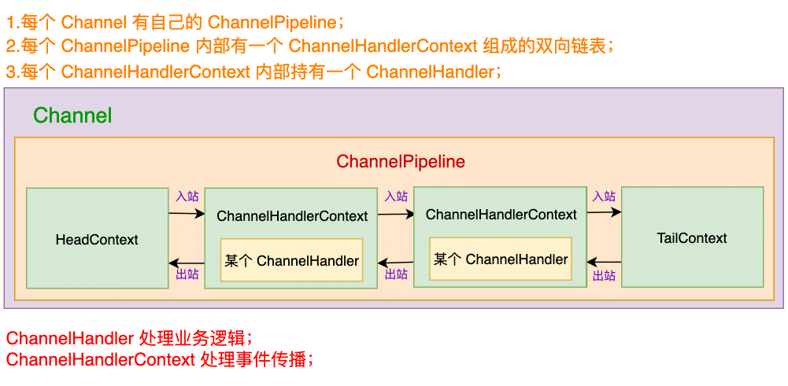
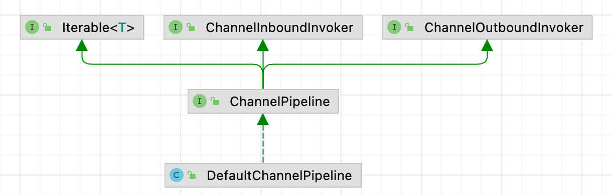
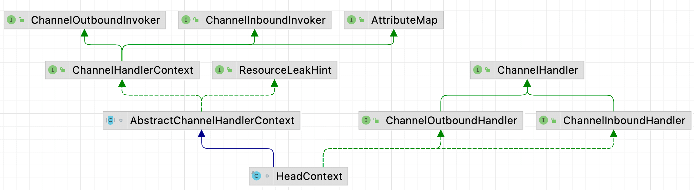
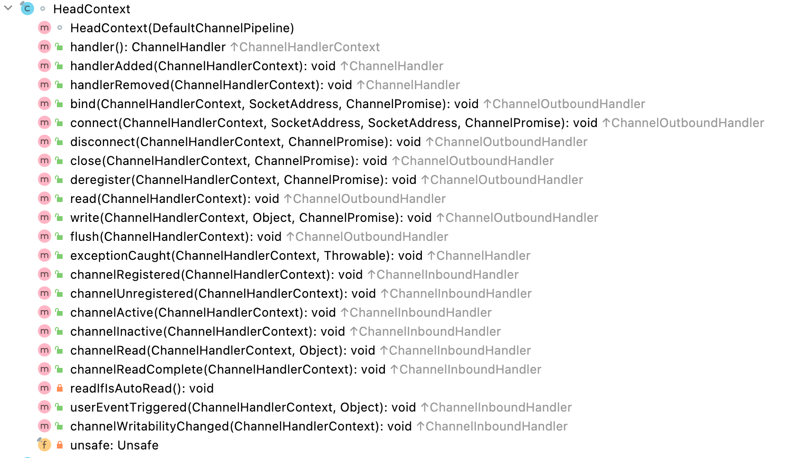
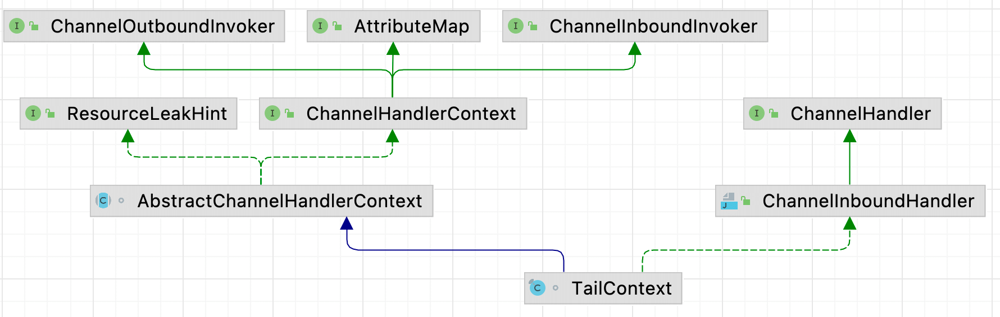
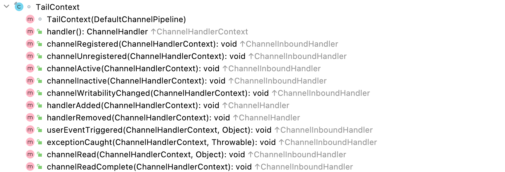
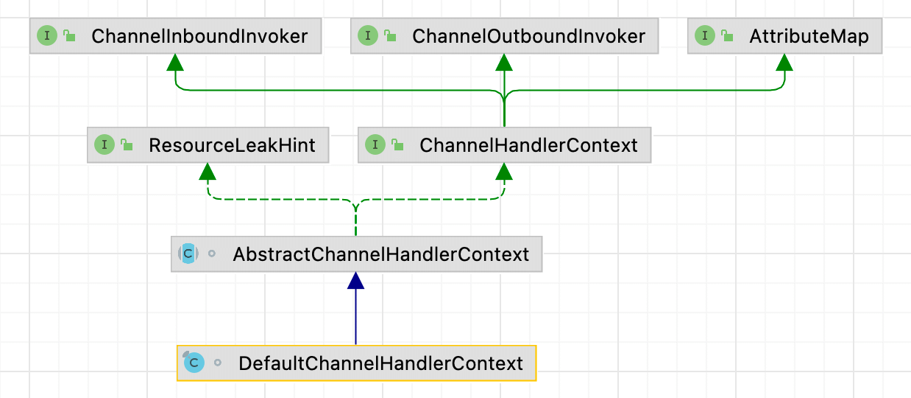

| 版本 | 内容 | 时间                   |
| ---- | ---- | ---------------------- |
| V1   | 新建 | 2022年03月16日12:30:42 |
| V2   | 重构 | 2023年05月29日01:01:33 |

## 管道相关的类的关系

Netty 管道中涉及到三个接口：

- ChannelPipeline：管道接口，定义了管道内的 ChannelHandler 的增删改查的操作，而且提供了管道内的传播的事件的API；
- ChannelHandlerContext：管道是一个双向链表，ChannelHandlerContext 就是链表上的节点对象，是管道内的事件传播的具体实现。ChannelHandlerContext 内部封装着 ChannelHandler 处理器；
- ChannelHandler：处理器，Netty 自带的处理器和用户自定义的处理器；

总的来说：ChannelPipeline 是一个拦截流经 Channel 的入站和出站事件的 ChannelHandler 实例链，可以看成是ChannelHandler 的容器，**新建的 Channel 都会被分配一个新的 ChannelPipeline**。**在 Channel 的 Pipeline 中，存放着许多 ChannelHandlerContext ，ChannelHandlerContext 通过前后指针连接组成链表，每个 ChannelHandlerContext 内部封装一个 ChannelHandler 对象。事件通过 ChannelHandlerContext 对象来进行前后传递，ChannelHandlerContext 内部的 ChannelHandler 来处理传递进来的事件。**

一个管道的示例图如下：



## 管道的创建

### 管道创建的入口

每一个 Channel 都有一个自己的 pipeline。NioServerSocketChannel 和 NioSocketChannel 创建的流程中，最终在父类 AbstractChannel 内会初始化它们内部的 Pipeline。

下面看下 AbstractChannel 的构造方法：

```java
protected AbstractChannel(Channel parent) {
    this.parent = parent;
    // 给Channel实例分配一个唯一的ID对象
    id = newId();
    // 封装一个unsafe对象
    // 当Channel是NioServerSocketChannel时，Unsafe实例是NioMessageUnSafe
    // 当Channel是NioSocketChannel时，实例是NioByteUnSafe
    unsafe = newUnsafe();
    // 构建Channel消息处理管道Pipeline
    // 设置好两个节点(默认的处理器)，一个头结点HeadContext，一个尾节点TailContext
    pipeline = newChannelPipeline();
}
```

创建 Channel 的 pipeline 的关键就是在 io.netty.channel.DefaultChannelPipeline 方法里：

```java
protected DefaultChannelPipeline newChannelPipeline() {
    return new DefaultChannelPipeline(this);
}
```

其实就是 new 一个 DefaultChannelPipeline 对象。

### DefaultChannelPipeline

继承关系



前面在 AbstractChannel 中调用的构造方法如下：

```java
// 管道的头节点
final AbstractChannelHandlerContext head;
// 管道的尾节点
final AbstractChannelHandlerContext tail;
// 当前管道所属的 Channel 通道
private final Channel channel;

/**
 * 创建一个实例
 * 初始化一个头节点和尾节点
 *
 * @param channel
 */
protected DefaultChannelPipeline(Channel channel) {
    this.channel = ObjectUtil.checkNotNull(channel, "channel");
    succeededFuture = new SucceededChannelFuture(channel, null);
    voidPromise =  new VoidChannelPromise(channel, true);

    tail = new TailContext(this);
    head = new HeadContext(this);

    head.next = tail;
    tail.prev = head;
}
```

首先就是将当前 ChannelPipeline 属于的 Channel 保存到自己的属性中，然后创建两个 ChannelHandlerContext 类型的 HeadContext 和 TailContext，分别代表 Pipeline 的双向链表的头节点和尾结点。

管道的初始状态如下：

```
--------------           ---------------
|			 |  ------>  |             |
| HeadContext|           | TailContext |
|			 |  <------  |             |
--------------           ---------------
```

### HeadContext



HeadContext 是 Pipeline 内部双向链表的头节点，实现了 ChannelHandlerContext 接口。

HeadContext 又实现了 ChannelInboundHandler 和 ChannelOutboundHandler  接口，说明 HeadContext 即是一个 ChannelHandlerContext 又是一个 ChannelHandler ，它可以同时处理 Inbound 入站事件和 Outbound 出站事件。

另外 HeadContext 内部有个 Unsafe 类的字段，Unsafe 是提供 Channel 类的底层操作的接口，例如读、写、连接和绑定等I/O 操作，这也说明 I/O 事件在 pipeline 中的传播最终会落在 HeadContext 中进行最后的 I/O 处理。

下面是 HeadContext 提供的 API，可以看到既有出站事件的 API，也有入站事件的 API。



### TailContext



TailContext 是 Pipeline 内部双向链表的头节点，实现了 ChannelHandlerContext 接口。

TailContext 又实现了 ChannelInboundHandler  接口，说明 TailContext 即是一个 ChannelHandlerContext 又是一个 ChannelHandler ，它可以处理 Inbound 入站事件。

下面是 TailContext 提供了 API，可以看到提供了入站事件的 API。



我们知道入站事件是从 HeadContext 向 TailContext 传播的，既然 TailContext 也是一个 ChannelInboundHandler，那么 TailContext 作为入站处理器的作用是什么呢？假如我们自定义的入站处理器没有处理某次传递的 channelRead 事件，那么需要一个兜底的处理，TailContext 就是作为一个兜底的处理器，比如释放可能未释放的堆外内存。

```java
protected void onUnhandledInboundMessage(Object msg) {
    try {
        logger.debug(
            "Discarded inbound message {} that reached at the tail of the pipeline. " +
            "Please check your pipeline configuration.", msg);
    } finally {
        ReferenceCountUtil.release(msg);
    }
}
```

## 管道的增删改查

Pipeline 添加 ChannelHandler 的 API 有很多，主要如下：

1. addFirst 系列；
2. addBefore 系列；
3. addAfter 系列；
4. addLast 系列；

以 addLast 方法为例分析

DefaultChannelPipeline#addLast(EventExecutorGroup, String, ChannelHandler)

```java
@Override
public final ChannelPipeline addLast(EventExecutorGroup group, String name, ChannelHandler handler) {
    final AbstractChannelHandlerContext newCtx;
    synchronized (this) {
        // 检查是否可以多个线程使用这个Handler    @Sharable
        checkMultiplicity(handler);

        newCtx = newContext(group, filterName(name, handler), handler);

        // 将newCtx放到Head和tail之间
        addLast0(newCtx);

        // 如果 registered 是 false 则表示 Channel 还未注册到 EventLoop 上去
        // 此时会添加 ctx 到 pipeline，然后添加一个任务去 ChannelHandler.handlerAdded(...)
        if (!registered) {
            newCtx.setAddPending();
            // 添加一个任务
            callHandlerCallbackLater(newCtx, true);
            return this;
        }

        // 执行到这里，说明添加的ChannelHanddler已经完成了注册
        EventExecutor executor = newCtx.executor();
        if (!executor.inEventLoop()) {
            callHandlerAddedInEventLoop(newCtx, executor);
            return this;
        }
    }
    callHandlerAdded0(newCtx);
    return this;
}
```

- 首先因为 addLast 方法可能会有很多线程同时调用，所以需要使用 synchronized 保证线程安全；

- Netty 中未被 @Sharable 注解标记的 ChannelHandler 是不允许重复添加的。  `checkMultiplicity(handler)` 就是用于校验这个的。需要注意的是使用共享 ChannelHandler 的时候需要确保其线程安全性；

- 创建 ChannelHandlerContext 实例，封装一下 ChannelHandler。ChannelHandlerContext 关注事件传播，ChannelHandler 关注的是业务处理；

- `addLast0(newCtx)` 将新创建的 ChannelHandlerContext 插入到链表末尾（其实是 TailContext 的前一个节点）。需要注意的是刚插入到链表中的 ChannelHandlerContext 还只是 INIT 初始状态。当 ChannelHandler 的 handlerAdded 方法被回调时，状态才变为 ADD_COMPLETE ，而只有 ADD_COMPLETE 状态的 ChannelHandler 才能响应 pipeline 中传播的事件；

- 回调 ChannelHandler 的 handlerAdded 方法有几种情况：

  1. Channel 还未注册到 NioEventLoop 上，也就是说服务端或者客户端还未启动完成，此时会封装成一个任务添加到一个单链表中，等待 Channel 注册到 NioEventLoop 上时，就会触发执行这个任务去执行 handlerAdded 方法；

  ```java
  if (!registered) {
      newCtx.setAddPending();
      // 添加一个任务
      callHandlerCallbackLater(newCtx, true);
      return this;
  }
  ```
  
  2. 这里主要是保证执行 handlerAdded 方法的线程是 Channel 指定的 EventExecutor；
  
  ```java
  // 执行到这里，说明添加的ChannelHanddler已经完成了注册
  EventExecutor executor = newCtx.executor();
  if (!executor.inEventLoop()) {
      callHandlerAddedInEventLoop(newCtx, executor);
      return this;
  	}
  }
  callHandlerAdded0(newCtx);
  return this;
  ```


管道的增删查改的源码比较简单，就是针对双向链表的操作，其他的 API 就不分析了。

## DefaultChannelHandlerContext

### 继承体系



### DefaultChannelHandlerContext 类

DefaultChannelHandlerContext 类就一个字段，就是保存的它封装的 ChannelHandler 实例。

```java
final class DefaultChannelHandlerContext extends AbstractChannelHandlerContext {

    private final ChannelHandler handler;

    DefaultChannelHandlerContext(
            DefaultChannelPipeline pipeline, EventExecutor executor, String name, ChannelHandler handler) {
        // 参数1：当前ctx所属的pipeline
        // 参数2：执行器，
        // 参数3：名字
        // 参数4：ctx封装的handler的字节码对象
        super(pipeline, executor, name, handler.getClass());
        this.handler = handler;
    }

    @Override
    public ChannelHandler handler() {
        return handler;
    }
}
```

### AbstractChannelHandlerContext 类

#### 常量和成员变量

AbstractChannelHandlerContext 中有两个自身类型的字段，这就是双向链表中的前驱和后驱指针。

```java
// 后驱节点
volatile AbstractChannelHandlerContext next;
// 前驱节点
volatile AbstractChannelHandlerContext prev;
```

AbstractChannelHandlerContext 上下文对象的状态，默认是初始状态 INIT。

```java
/**
 * 表示 handlerAdded 方法即将被调用
 */
private static final int ADD_PENDING = 1;
/**
 * 表示 handlerAdded 方法已经被调用
 */
private static final int ADD_COMPLETE = 2;
/**
 * 表示 handlerRemoved 已经被调用
 */
private static final int REMOVE_COMPLETE = 3;
/**
 * 初始状态， handlerAdded 和 handlerRemoved 方法都没有被调用
 */
private static final int INIT = 0;

private volatile int handlerState = INIT;
```

代表状态的 handlerState 字段，要保证它的更新是原子性的，所以提供了一个原子更新器：

```java
// handlerState 字段改变的 CAS 更新器
private static final AtomicIntegerFieldUpdater<AbstractChannelHandlerContext> HANDLER_STATE_UPDATER =
    AtomicIntegerFieldUpdater.newUpdater(AbstractChannelHandlerContext.class, "handlerState");
```

其他属性：

```java
// 当前ctx所属的pipeline
private final DefaultChannelPipeline pipeline;
// 当前ctx的名字
private final String name;
// 当前ctx是否有序
private final boolean ordered;
// 用来判断是否跳过执行器 ChannelHandler 的某些事件处理方法
// io.netty.channel.ChannelHandlerMask.mask0 计算得到
private final int executionMask;

// Will be set to null if no child executor should be used, otherwise it will be set to the
// child executor.
// 如果这个值是 null,那么上下文的执行器用的就是所属通道 Channel 的事件轮询器。
final EventExecutor executor;
```

解析一下这几个属性：

- DefaultChannelPipeline pipeline：标记当前 ChannelHandlerContext 是属于那个管道的；
- String name：表示当前 ChannelHandlerContext 的名字；
- boolean ordered：一般情况下，必须当 ChannelHandlerContext 上下文状态是 ADD_COMPLETE 才能够处理管道中的事件，假如 ordered 是 true 的情况下，上下文状态是 ADD_PENDING 状态就可以处理管道中的事件了；
- int executionMask：掩码。用于标记当前 ChannelHandlerContext 内部的  ChannelHandler 是入站处理器还是出站处理器，能够处理那些事件；
- EventExecutor executor：channelHandler 对应的 executor，除非特殊指定，默认就是 Channel 的绑定的 NioEventLoop；

#### 构造方法

```java
AbstractChannelHandlerContext(DefaultChannelPipeline pipeline, EventExecutor executor,
                              String name, Class<? extends ChannelHandler> handlerClass) {
    this.name = ObjectUtil.checkNotNull(name, "name");
    this.pipeline = pipeline;
    this.executor = executor;
    // mask方法用于计算一个掩码，作用是方便ctx前后传递时，查找合适的下一个ctx
    this.executionMask = mask(handlerClass);
    // Its ordered if its driven by the EventLoop or the given Executor is an instanceof OrderedEventExecutor.
    // 表示上下文的事件执行器是不是有序的，即以有序/串行的方式处理所有提交的任务。
    // executor == null，说明当前上下文用的是通道Channel的 channel().eventLoop()，这个肯定是有序的
    ordered = executor == null || executor instanceof OrderedEventExecutor;
}
```

构造方法中调用了 ChannelHandlerMask 类的一个重要的 mask 方法，重点分析 mask 方法。mask 方法的作用是，**根据传入的 ChannelHandler 的字节码对象，来计算出一个掩码，可以根据这个掩码来判断当前 ChannelHandler 是否重写过某些方法。**也就是说，根据这个掩码来标记 ChannelHandler 能够处理那些事件。

#### @Skip 注解的作用

在分析 io.netty.channel.ChannelHandlerMask#mask 方法之前，得先了解一下 @Skip 注解。

ChannelInboundHandlerAdapter 和 ChannelOutboundHandlerAdapter 类中每个方法都有 @Skip 注解，这个注解后面将在 mask 方法中用于判断自己实现的 ChannelHandler 类是否重写过其中的某种方法，因为我们自己写的 ChannelHandler 中是没有标注 @Skip 注解的。 

ChannelHandlerMask 中有个 isSkippable 方法，根据反射判断某个方法是否有 @Skip  注解。 

```java
private static boolean isSkippable(
        final Class<?> handlerType, final String methodName, final Class<?>... paramTypes) throws Exception {
    return AccessController.doPrivileged(new PrivilegedExceptionAction<Boolean>() {
        @Override
        public Boolean run() throws Exception {
            Method m;
            try {
                m = handlerType.getMethod(methodName, paramTypes);
            } catch (NoSuchMethodException e) {
               	// ..... 省略日志打印 ......
                return false;
            }
            return m.isAnnotationPresent(Skip.class);
        }
    });
}
```

关于 ChannelInboundHandlerAdapter 和 ChannelOutboundHandlerAdapter 中的方法，其实就是对应的入站和出站事件，举个例子：ChannelInboundHandlerAdapter#channelRegistered

```java
/**
 * Calls {@link ChannelHandlerContext#fireChannelRegistered()} to forward
 * to the next {@link ChannelInboundHandler} in the {@link ChannelPipeline}.
 *
 * Sub-classes may override this method to change behavior.
 *
 * 调用 ChannelHandlerContext.fireChannelRegistered() 方法
 * 转发到 ChannelPipeline 中的下一个 ChannelInboundHandler。
 */
@Skip
@Override
public void channelRegistered(ChannelHandlerContext ctx) throws Exception {
    ctx.fireChannelRegistered();
}
```

**ChannelInboundHandlerAdapter 和 ChannelOutboundHandlerAdapter 类中每个方法都有 @Skip 注解，而我们自己要实现 ChannelHandler，一般也就是继承这两个类去实现的，但是我们自己实现的 ChannelHandler 重写它的方法的时候是不会自己加 @Skip 注解的（除非你非要自己手动加......），所以，这就可以标记出来那些方法是我们自己的 ChannelHandler 重写过的。**

### ChannelHandlerMask 类

ChannelHandlerMask 类就是处理 @Skip 注解的关键。

前面在分析 AbstractChannelHandlerContext 类的构造方法的时候看到过一个 executionMask 字段，这个字段的作用就是 用于标记当前 ChannelHandlerContext 内部的  ChannelHandler 是入站处理器还是出站处理器，能够处理那些事件。计算这个字段的入口就是 ChannelHandlerMask#mask 方法。

#### ChannelHandlerMask 的常量

在看 ChannelHandlerMask#mask 方法之前，得先了解一下 ChannelHandlerMask 类的一些常量的含义：

```java
static final int MASK_EXCEPTION_CAUGHT = 1;
static final int MASK_CHANNEL_REGISTERED = 1 << 1;
static final int MASK_CHANNEL_UNREGISTERED = 1 << 2;
static final int MASK_CHANNEL_ACTIVE = 1 << 3;
static final int MASK_CHANNEL_INACTIVE = 1 << 4;
static final int MASK_CHANNEL_READ = 1 << 5;
static final int MASK_CHANNEL_READ_COMPLETE = 1 << 6;
static final int MASK_USER_EVENT_TRIGGERED = 1 << 7;
static final int MASK_CHANNEL_WRITABILITY_CHANGED = 1 << 8;
static final int MASK_BIND = 1 << 9;
static final int MASK_CONNECT = 1 << 10;
static final int MASK_DISCONNECT = 1 << 11;
static final int MASK_CLOSE = 1 << 12;
static final int MASK_DEREGISTER = 1 << 13;
static final int MASK_READ = 1 << 14;
static final int MASK_WRITE = 1 << 15;
static final int MASK_FLUSH = 1 << 16;
```

这些常量是按位标记每个方法，如代表异常的方法的常量 MASK_EXCEPTION_CAUGHT，它的二进制就是`0000 0000 0000 0000 0000 0000 0000 0001`。

根据这些常量的组合的属性

1. **MASK_ONLY_INBOUND**：入站事件掩码；
2. **MASK_ALL_INBOUND**：入站事件掩码，包含 MASK_EXCEPTION_CAUGHT；
3. **MASK_ONLY_OUTBOUND**：出站事件的掩码；
4. **MASK_ALL_OUTBOUND**：出站事件的掩码，包含 MASK_EXCEPTION_CAUGHT；

```java
// 计算入站事件掩码
// 0000 0000 0000 0000 0000 0001 1111 1110
static final int MASK_ONLY_INBOUND =  MASK_CHANNEL_REGISTERED |
        MASK_CHANNEL_UNREGISTERED | MASK_CHANNEL_ACTIVE | MASK_CHANNEL_INACTIVE | MASK_CHANNEL_READ |
        MASK_CHANNEL_READ_COMPLETE | MASK_USER_EVENT_TRIGGERED | MASK_CHANNEL_WRITABILITY_CHANGED;

// 计算入站事件掩码，包含 MASK_EXCEPTION_CAUGHT
// 0000 0000 0000 0000 0000 0001 1111 1111
private static final int MASK_ALL_INBOUND = MASK_EXCEPTION_CAUGHT | MASK_ONLY_INBOUND;

// 计算出出站事件的掩码
// 0000 0000 0000 0001 1111 1110 0000 0000
static final int MASK_ONLY_OUTBOUND =  MASK_BIND | MASK_CONNECT | MASK_DISCONNECT |
        MASK_CLOSE | MASK_DEREGISTER | MASK_READ | MASK_WRITE | MASK_FLUSH;

// 计算出出站事件的掩码 包含 MASK_EXCEPTION_CAUGHT
// 0000 0000 0000 0001 1111 1110 0000 0001
private static final int MASK_ALL_OUTBOUND = MASK_EXCEPTION_CAUGHT | MASK_ONLY_OUTBOUND;
```

#### ChannelHandlerMask#mask

```java
/**
 * Return the {@code executionMask}.
 */
static int mask(Class<? extends ChannelHandler> clazz) {
    // Try to obtain the mask from the cache first. If this fails calculate it and put it in the cache for fast
    // lookup in the future.
    Map<Class<? extends ChannelHandler>, Integer> cache = MASKS.get();
    Integer mask = cache.get(clazz);
    if (mask == null) {
        mask = mask0(clazz);
        cache.put(clazz, mask);
    }
    return mask;
}
```

其中 MASKS 是一个 FastThreadLocal，用来缓存 ChannelHandler 子类对应的执行标记 mask，就不用每次都计算掩码了。

```java
// 用来缓存， ChannelHandler 子类对应的执行标记 mask，就不用每次都需要计算了
private static final FastThreadLocal<Map<Class<? extends ChannelHandler>, Integer>> MASKS =
    new FastThreadLocal<Map<Class<? extends ChannelHandler>, Integer>>() {
    @Override
    protected Map<Class<? extends ChannelHandler>, Integer> initialValue() {
        return new WeakHashMap<Class<? extends ChannelHandler>, Integer>(32);
    }
};
```

可以看到最终是调用 io.netty.channel.ChannelHandlerMask#mask0 方法了，方法的返回值是一个int的二进制，

- 假如对应下标位（代表指定方法） 的值是 1，表示 handlerType 类型的 ChannelHandler 中重写了该方法；
- 位值是 0 表示 handlerType 类型的 ChannelHandler 中没有重写该方法；

ChannelHandler 的掩码包含的是该 ChannelHandler 重写的事件方法的掩码集合。当事件在 pipeline 中传播的时候，在 ChannelHandlerContext 中可以利用这个掩码来判断，当前 ChannelHandler 是否应该响应这个事件，也就是是否要执行这个 ChannelHandler 里面的逻辑了。

```java
/**
 * Calculate the {@code executionMask}.
 * 返回值是一个int类型的 二进制
 * 对应下标位 代表指定方法 位的值是1，表示方法handlerType类型中实现了该方法
 * 位置是0表示handlerType类型中 没有实现该方法
 */
private static int mask0(Class<? extends ChannelHandler> handlerType) {
    // 0000 0000 0000 0000 0000 0000 0000 0001
    int mask = MASK_EXCEPTION_CAUGHT;
    try {
        // 条件成立 说明handlerType类型是属于ChannelInBoundHandler的子类
        if (ChannelInboundHandler.class.isAssignableFrom(handlerType)) {
            // 结果 0000 0000 0000 0000 0000 0001 1111 1111
            mask |= MASK_ALL_INBOUND;

            // 参数1：handler的真实class类型
            // 参数2：检查的方法名
            // 参数3：ChannelHandlerContext.class
            // isSkippable返回handlerType这个class 有没有重写指定的方法，重写之后指定方法上的Skip注解就没有了
            // 条件成立，说明没有重写该方法
            if (isSkippable(handlerType, "channelRegistered", ChannelHandlerContext.class)) {
                //     0000 0000 0000 0000 0000 0001 1111 1111
                // 取反 1111 1111 1111 1111 1111 1111 1111 1101
                // &   0000 0000 0000 0000 0000 0001 1111 1101
                // 也就是说 假如你自己实现了这些方法 该位置就是1，没有实现该方法 该位置就是0
                mask &= ~MASK_CHANNEL_REGISTERED;
            }
            if (isSkippable(handlerType, "channelUnregistered", ChannelHandlerContext.class)) {
                mask &= ~MASK_CHANNEL_UNREGISTERED;
            }
            if (isSkippable(handlerType, "channelActive", ChannelHandlerContext.class)) {
                mask &= ~MASK_CHANNEL_ACTIVE;
            }
            if (isSkippable(handlerType, "channelInactive", ChannelHandlerContext.class)) {
                mask &= ~MASK_CHANNEL_INACTIVE;
            }
            if (isSkippable(handlerType, "channelRead", ChannelHandlerContext.class, Object.class)) {
                mask &= ~MASK_CHANNEL_READ;
            }
            if (isSkippable(handlerType, "channelReadComplete", ChannelHandlerContext.class)) {
                mask &= ~MASK_CHANNEL_READ_COMPLETE;
            }
            if (isSkippable(handlerType, "channelWritabilityChanged", ChannelHandlerContext.class)) {
                mask &= ~MASK_CHANNEL_WRITABILITY_CHANGED;
            }
            if (isSkippable(handlerType, "userEventTriggered", ChannelHandlerContext.class, Object.class)) {
                mask &= ~MASK_USER_EVENT_TRIGGERED;
            }
        }

        if (ChannelOutboundHandler.class.isAssignableFrom(handlerType)) {
            mask |= MASK_ALL_OUTBOUND;

            if (isSkippable(handlerType, "bind", ChannelHandlerContext.class,
                    SocketAddress.class, ChannelPromise.class)) {
                mask &= ~MASK_BIND;
            }
            if (isSkippable(handlerType, "connect", ChannelHandlerContext.class, SocketAddress.class,
                    SocketAddress.class, ChannelPromise.class)) {
                mask &= ~MASK_CONNECT;
            }
            if (isSkippable(handlerType, "disconnect", ChannelHandlerContext.class, ChannelPromise.class)) {
                mask &= ~MASK_DISCONNECT;
            }
            if (isSkippable(handlerType, "close", ChannelHandlerContext.class, ChannelPromise.class)) {
                mask &= ~MASK_CLOSE;
            }
            if (isSkippable(handlerType, "deregister", ChannelHandlerContext.class, ChannelPromise.class)) {
                mask &= ~MASK_DEREGISTER;
            }
            if (isSkippable(handlerType, "read", ChannelHandlerContext.class)) {
                mask &= ~MASK_READ;
            }
            if (isSkippable(handlerType, "write", ChannelHandlerContext.class,
                    Object.class, ChannelPromise.class)) {
                mask &= ~MASK_WRITE;
            }
            if (isSkippable(handlerType, "flush", ChannelHandlerContext.class)) {
                mask &= ~MASK_FLUSH;
            }
        }

        // "exceptionCaught" 方法需要单独判断，因为 ChannelInboundHandler 和 ChannelOutboundHandler 都有它
        if (isSkippable(handlerType, "exceptionCaught", ChannelHandlerContext.class, Throwable.class)) {
            mask &= ~MASK_EXCEPTION_CAUGHT;
        }
    } catch (Exception e) {
        // Should never reach here.
        PlatformDependent.throwException(e);
    }

    return mask;
}
```

## 管道的事件传播

### 入站的事件传播

#### 管道传递事件入口

以 ChannelRead 事件为例来分析入站事件的传播，调用 pipeline 的 API 传递事件，例如：

```java
pipeline.fireChannelRead(byteBuf);
```

DefaultChannelPipeline#fireChannelRead

```java
@Override
public final ChannelPipeline fireChannelRead(Object msg) {
    AbstractChannelHandlerContext.invokeChannelRead(head, msg);
    return this;
}
```

可以看到就是调用 AbstractChannelHandlerContext 的静态方法 invokeChannelRead 出处理事件传播，其中入参：

- head 参数：就是管道内的 HeadContext，从这里也说明了，入站事件就是从 HeadContext 向 TailContext 方向传播的；
- mag 参数：就是管道内传递的要处理的数据；

好了，继续跟进看 AbstractChannelHandlerContext 的 invokeChannelRead 方法：

```java
static void invokeChannelRead(final AbstractChannelHandlerContext next, Object msg) {
    // 资源泄漏相关
    final Object m = next.pipeline.touch(ObjectUtil.checkNotNull(msg, "msg"), next);
    // 保证是 AbstractChannelHandlerContext 绑定的线程执行 invokeChannelRead 方法
    EventExecutor executor = next.executor();
    if (executor.inEventLoop()) {
        next.invokeChannelRead(m);
    } else {
        executor.execute(new Runnable() {
            @Override
            public void run() {
                next.invokeChannelRead(m);
            }
        });
    }
}
```

调用了 invokeChannelRead 的重载方法：

```java
private void invokeChannelRead(Object msg) {
    // invokeHandler 判断 ChannelHandler 的状态，确保 ChannelHandler 能够处理事件
    if (invokeHandler()) {
        try {
            // 调用 ChannelHandler 的对应处理方法
            ((ChannelInboundHandler) handler()).channelRead(this, msg);
        } catch (Throwable t) {
            // 如果发生异常，则就 ChannelHandler 的 exceptionCaught 方法
            invokeExceptionCaught(t);
        }
    } else {
        // ChannelHandler 的状态不对，无法处理该事件，继续向后传播
        fireChannelRead(msg);
    }
}
```

#### ChannelHandlerContext 传递事件

关键点就是调用 ChannelHandler 的对应的 channelRead 方法。一般在 ChannelHandler 中处理完后，都会调用 AbstractChannelHandlerContext 对应的 fire 系列方法，例如 fireChannelRead 方法。

```java
@Override
public ChannelHandlerContext fireChannelRead(final Object msg) {
    invokeChannelRead(findContextInbound(MASK_CHANNEL_READ), msg);
    return this;
}
```

通过 AbstractChannelHandlerContext 的 findContextInbound 方法找到下一个能够处理 channelRead 方法的处理器

```java
/**
 * 找到下一个入站Handler
 *
 * @param mask
 */
private AbstractChannelHandlerContext findContextInbound(int mask) {
    AbstractChannelHandlerContext ctx = this;
    EventExecutor currentExecutor = executor();
    do {
        ctx = ctx.next;
        // 0000 0000 0000 0000 0000 0001 1111 1110
    } while (skipContext(ctx, currentExecutor, mask, MASK_ONLY_INBOUND));
    return ctx;
}
```

就是一个 do...while... 循环，在双向链表中向后查找 ChannelHandlerContext 中封装的 ChannelHandler 是否能够处理对应的入站事件，关键点就是 while 条件的  skipContext 方法。

```java
private static boolean skipContext(
        AbstractChannelHandlerContext ctx, EventExecutor currentExecutor, int mask, int onlyMask) {
    // (ctx.executor() == currentExecutor && (ctx.executionMask & mask) == 0)
    // 只有当 EventExecutor 相同的时候，才会考虑是否跳过 ctx，因为我们要保证事件处理的顺序。

    // onlyMask 0000 0000 0000 0000 0000 0001 1111 1110
    // mask     0000 0000 0000 0000 0000 0000 0000 0010
    return (ctx.executionMask & (onlyMask | mask)) == 0 ||
            // See https://github.com/netty/netty/issues/10067
            (ctx.executor() == currentExecutor && (ctx.executionMask & mask) == 0);
}
```

方法的返回值表示是否需要跳过这个 ctx 上下文，返回 true 表示跳过。

- `(ctx.executionMask & (onlyMask | mask)) == 0`
  1. 假如返回 true，表示当前这个 ctx 对象的 executionMask 掩码中没有 `(onlyMask | mask) ` 中的任何方法，也就很容易就判断 ChannelHandler 不属于入站事件或者出站事件，则返回 true，表示跳过这个 ctx；
  2. 返回 false，表示自定义的 ChannelHandler 是对应的出站处理器或者入站处理器；
- `(ctx.executor() == currentExecutor && (ctx.executionMask & mask) == 0)`
  1.  `ctx.executor() == currentExecutor` ，这个判断是为了保证事件处理的顺序，如果事件的执行器不一样，无论是否被 @skip 注解标记也不能跳过这个 ctx；
  2.  `(ctx.executionMask & mask) == 0`，判断自定义 ChannelHandler 是否重写过指定方法，假如重写过 executionMask 掩码的指定位置就是 1 ，此时返回 false，表示不跳过这个 ctx；

findContextInbound 方法结束后，找到了一个封装了实现了 channelRead 方法的 ChannelHandler 对象的 ctx。拿到后面的 ctx 后，就会调用 invokeChannelRead 方法，就去执行该 ChannelHandler 处理 channelRead 事件的逻辑了。

### 出站事件的传播

以 bind 事件为例来分析出站事件的传播，AbstractChannel#bind(SocketAddress, ChannelPromise)：

```java
@Override
public ChannelFuture bind(SocketAddress localAddress, ChannelPromise promise) {
    return pipeline.bind(localAddress, promise);
}
```

可以看到就是调用 pipeline 的 API

```java
@Override
public final ChannelFuture bind(SocketAddress localAddress, ChannelPromise promise) {
    return tail.bind(localAddress, promise);
}
```

调用 TailContext 的 bind 方法，该 bind 方法的具体实现是在 TailContext 的抽象父类 AbstractChannelHandlerContext 中。

AbstractChannelHandlerContext#bind(SocketAddress, ChannelPromise)

```java
@Override
public ChannelFuture bind(final SocketAddress localAddress, final ChannelPromise promise) {
    ObjectUtil.checkNotNull(localAddress, "localAddress");
    if (isNotValidPromise(promise, false)) {
        // cancelled
        return promise;
    }

    // 找到上一个出站处理器的上下文对象
    final AbstractChannelHandlerContext next = findContextOutbound(MASK_BIND);
    EventExecutor executor = next.executor();
    if (executor.inEventLoop()) {
        next.invokeBind(localAddress, promise);
    } else {
        safeExecute(executor, new Runnable() {
            @Override
            public void run() {
                next.invokeBind(localAddress, promise);
            }
        }, promise, null, false);
    }
    return promise;
}
```

关键点就是 findContextOutbound 方法了，从双向链表的尾部向前查找出站处理器去处理 bind 事件，最终会走到 HeadContext 节点。

```java
/**
 * 从双向链表的tail开始，不断向前找
 * @param mask
 * @return
 */
private AbstractChannelHandlerContext findContextOutbound(int mask) {
    AbstractChannelHandlerContext ctx = this;
    EventExecutor currentExecutor = executor();
    do {
        ctx = ctx.prev;
    } while (skipContext(ctx, currentExecutor, mask, MASK_ONLY_OUTBOUND));
    return ctx;
}
```

### 异常事件的传播

异常事件的传播分为两种，

- 一种是 Netty 框架自身处理导致的异常，此时是从 HeadContext 向后传播异常事件；
- 一种是某个 ChannelHandler 中处理事件逻辑发生异常，这时该 ChannelHandler 的 exceptionCaught 方法会被回调。用户可以在这里处理异常事件，并决定是否通过 ctx.fireExceptionCaught(cause) 继续向后传播异常事件。

#### Netty 自身的异常

以客户端 Channel 处理 READ 事件为例，NioByteUnsafe#read

```java
@Override
public final void read() {
    // ...... 省略 ......
    try {
        // ...... 省略业务处理逻辑 ......
    } catch (Throwable t) {
        handleReadException(pipeline, byteBuf, t, close, allocHandle);
    } finally {
        // ...... 代码块 .....
    }
}
```

NioByteUnsafe#handleReadException

```java
private void handleReadException(ChannelPipeline pipeline, ByteBuf byteBuf, 
                                 Throwable cause, boolean close,
                                 RecvByteBufAllocator.Handle allocHandle) {
    if (byteBuf != null) {
        if (byteBuf.isReadable()) {
            readPending = false;
            pipeline.fireChannelRead(byteBuf);
        } else {
            byteBuf.release();
        }
    }
    allocHandle.readComplete();
    pipeline.fireChannelReadComplete();
    pipeline.fireExceptionCaught(cause);

    // If oom will close the read event, release connection.
    // See https://github.com/netty/netty/issues/10434
    if (close || cause instanceof OutOfMemoryError || cause instanceof IOException) {
        closeOnRead(pipeline);
    }
}
```

这个方法的 pipeline.fireExceptionCaught(cause) 代码就是在管道中传播异常事件。

#### ChannelHandler 处理事件逻辑的异常

假如在 ChannelHandler 中处理 ChannelActive 事件的逻辑时发送异常，就会触发改 ChannelHandler 中的 exceptionCaught 方法：

AbstractChannelHandlerContext#invokeChannelActive()

```java
private void invokeChannelActive() {
    if (invokeHandler()) {
        try {
            ((ChannelInboundHandler) handler()).channelActive(this);
        } catch (Throwable t) {
            invokeExceptionCaught(t);
        }
    } else {
        fireChannelActive();
    }
}
```

### Task 特殊事件处理 - 减少实例创建

AbstractChannelHandlerContext 的内部类 Tasks

```java
private static final class Tasks {
    private final AbstractChannelHandlerContext next;

    // channelReadComplete 读完成的入站事件
    private final Runnable invokeChannelReadCompleteTask = new Runnable() {
        @Override
        public void run() {
            next.invokeChannelReadComplete();
        }
    };

    // read 设置读的出站事件
    private final Runnable invokeReadTask = new Runnable() {
        @Override
        public void run() {
            next.invokeRead();
        }
    };

    // channelWritabilityChanged 可读状态改变的入站事件
    private final Runnable invokeChannelWritableStateChangedTask = new Runnable() {
        @Override
        public void run() {
            next.invokeChannelWritabilityChanged();
        }
    };

    // flush 刷新数据的出站事件
    private final Runnable invokeFlushTask = new Runnable() {
        @Override
        public void run() {
            next.invokeFlush();
        }
    };

    Tasks(AbstractChannelHandlerContext next) {
        this.next = next;
    }
}
```

有的入站和出站事件的处理，与上面的流程不一样，有四个事件:

- `channelReadComplete` ：读完成的入站事件；
- `channelWritabilityChanged`：可读状态改变的入站事件；
- `read`  ：读的出站事件；
- `flush` ：刷新数据的出站事件；

这样做法的好处是减少任务实例的创建，比如 channelReadComplete 事件

```java
@Override
public ChannelHandlerContext fireChannelReadComplete() {
    invokeChannelReadComplete(findContextInbound(MASK_CHANNEL_READ_COMPLETE));
    return this;
}

static void invokeChannelReadComplete(final AbstractChannelHandlerContext next) {
    EventExecutor executor = next.executor();
    if (executor.inEventLoop()) {
        next.invokeChannelReadComplete();
    } else {
        Tasks tasks = next.invokeTasks;
        if (tasks == null) {
            next.invokeTasks = tasks = new Tasks(next);
        }
        executor.execute(tasks.invokeChannelReadCompleteTask);
    }
}
```

前面的一些方法的 else 分支下面一般是 `executor.execute(new Runnable(){...});` 创建一个任务。

而上面这四个事件是获取 Task 类中对应的任务，减少 Runnable 实例的创建，因为这些事件的处理方法是没有参数的。

### WriteTask - 写操作事件

```java
private void write(Object msg, boolean flush, ChannelPromise promise) {
    ObjectUtil.checkNotNull(msg, "msg");
    try {
        // 检查 promise 是否有效
        if (isNotValidPromise(promise, true)) {
            ReferenceCountUtil.release(msg);
            // cancelled
            return;
        }
    } catch (RuntimeException e) {
        ReferenceCountUtil.release(msg);
        throw e;
    }

    // 找出上一个出站的ctx对象
    final AbstractChannelHandlerContext next = findContextOutbound(flush ?
            (MASK_WRITE | MASK_FLUSH) : MASK_WRITE);
    // 添加附加信息，在内存泄露的时候，可以获取到这个附加信息
    final Object m = pipeline.touch(msg, next);
    EventExecutor executor = next.executor();
    if (executor.inEventLoop()) {
        if (flush) {
            // 如果需要刷新，就调用 invokeWriteAndFlush 方法
            next.invokeWriteAndFlush(m, promise);
        } else {
            // 如果不需要刷新，就调用 invokeWrite 方法
            next.invokeWrite(m, promise);
        }
    } else {
        // 将写操作封装成一个 WriteTask，是 Runnable 子类。
        final WriteTask task = WriteTask.newInstance(next, m, promise, flush);
        if (!safeExecute(executor, task, promise, m, !flush)) {
            // We failed to submit the WriteTask. We need to cancel it so we decrement the pending bytes
            // and put it back in the Recycler for re-use later.
            //
            // See https://github.com/netty/netty/issues/8343.
            task.cancel();
        }
    }
}
```

else 分支内封装了一个 WriteTask 对象来执行，WriteTask 是一个 Runable 对象。具体后续配合出站缓冲区分析。

## 小结

本篇分析了 Channel、ChannelHandler、ChannelHandlerContext、ChannelPipeline 之间的关系，已经入站事件和出站事件是如何传播的。

- 每个 Channel 都有一个自己的 ChannelPipeline；
- 每个 ChannelPipeline 都是一个双向链表，链表上的节点类型是 ChannelHandlerContext，每个节点中封装一个 ChannelHandler；

ChannelHandlerContext 主要负责事件的传播，而 ChannelHandler 主要处理事件的逻辑处理。两者各司其职，符合单一职责的思想。用户只需要关注 ChannelHandler 中的事件业务逻辑处理，无需关注事件是如何传播的。
