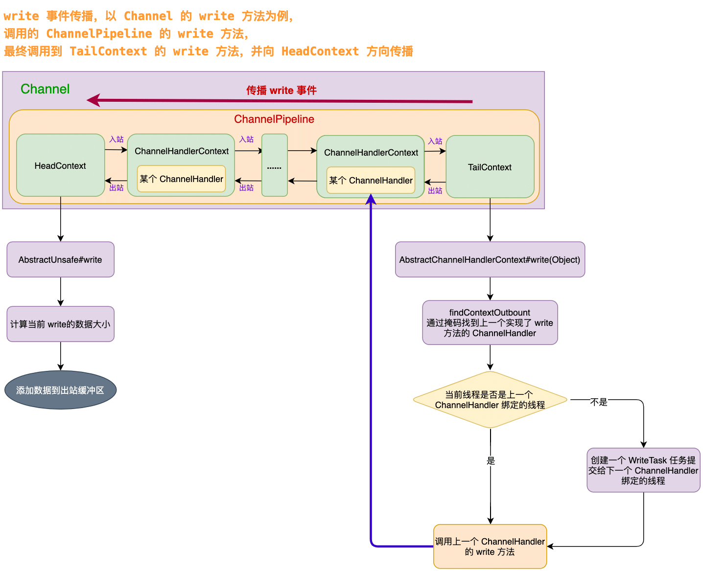
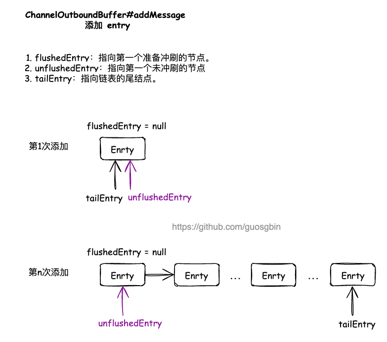
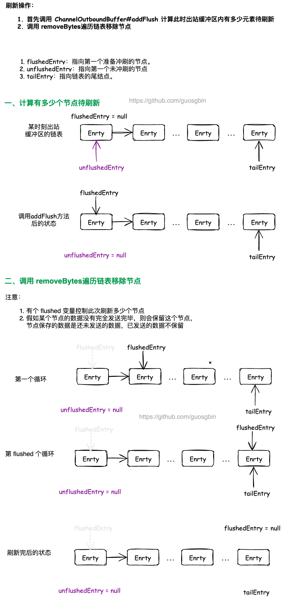
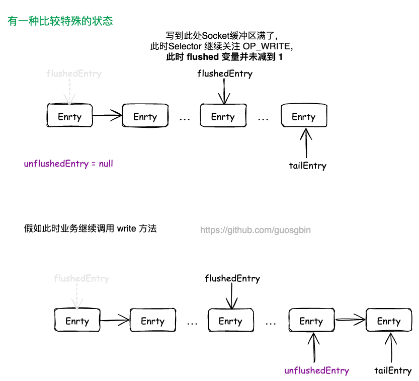
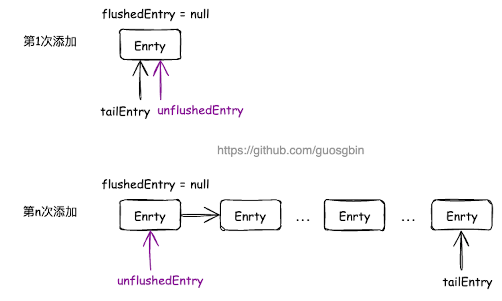
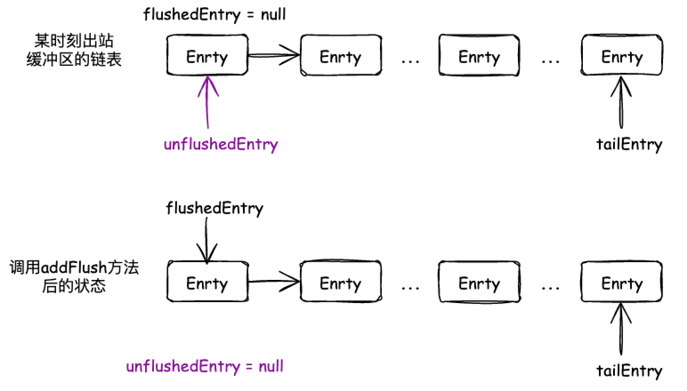
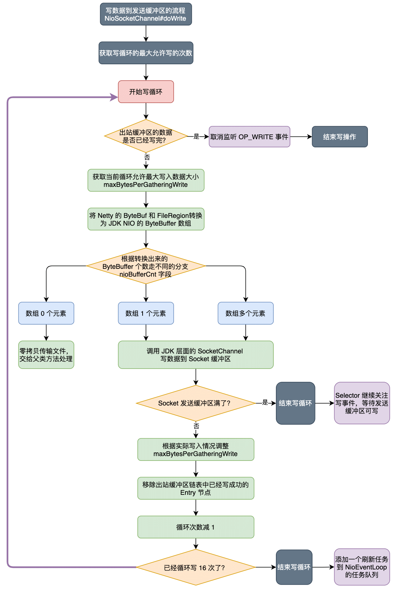
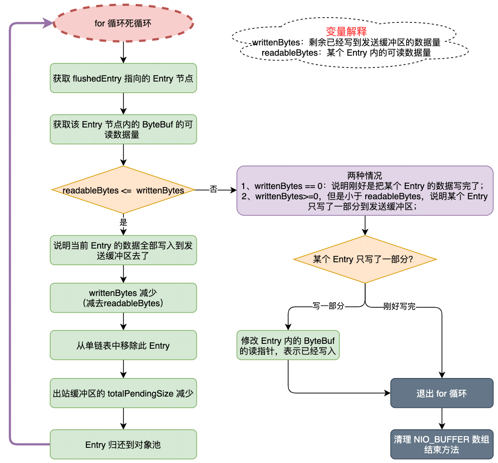

| 版本 | 内容 | 时间                   |
| ---- | ---- | ---------------------- |
| V1   | 新建 | 2022年03月21日01:00:11 |
| V2   | 重构 | 2023年06月03日13:51:13 |

## 引入

为了提高网络的吞吐量，在调用 write 方法时，数据并没有直接写到底层 Socket 中，而是被写到了 Netty 的出站缓冲区 ChannelOutboundBuffer 中。

本文主要分析 Netty 的写操作的流程，主要分为一下几部分。

1. Netty 的 write 事件的传播；
2. Netty 的 write 事件的处理；
3. 出站缓冲区 ChannelOutboundBuffer 原理；
4. Netty 的 flush 事件的处理；
5. Netty 的 writeAndFlush 方法的逻辑；

## Netty 的 write 事件的入口

在 ChannelHandler 处理器中有两个地方可以触发 write 事件：

1. 调用 ChannelHandlerContext 的 write 方法。该方式会直接沿着当前 ChannelHandlerContext 向 HeadContext 传递 write 事件；
2. 调用 ChannelHandlerContext 所属的 Channel 的 write 方法。该方式会从 TailContext 向 HeadContext 传递 write 事件；

以第二种方式 AbstractChannel#write(Object) 为例来分析：

```java
@Override
public ChannelFuture write(Object msg) {
    return pipeline.write(msg);
}
```

就是调用管道的 DefaultChannelPipeline#write(Object) 方法：

```java
@Override
public final ChannelFuture write(Object msg) {
    return tail.write(msg);
}
```

调用 TailContext 的 write 方法，因为 TailContext 就是 AbstractChannelHandlerContext 的实例，所以需要看 AbstractChannelHandlerContext 的 write 方法

## Netty 的 write 事件的传播



### 查找上一个 ChannelHandler

```java
@Override
public ChannelFuture write(Object msg) {
    return write(msg, newPromise());
}

@Override
public ChannelFuture write(final Object msg, final ChannelPromise promise) {
    // 写入消息 不刷新
    write(msg, false, promise);
    return promise;
}
```

这两个 write 方法就是创建一个 ChannelFuture 对象，传入到重载的 write 中，并将 ChannelFuture 对象返回给调用者，调用者可以监听这个 ChannelFuture，就能知道 write 操作是正常还是异常了。

接下来看核心的 AbstractChannelHandlerContext#write(Object, boolean, ChannelPromise) 方法了

```java
private void write(Object msg, boolean flush, ChannelPromise promise) {
    // ...... 省略参数校验......

    // 找出上一个出站的ctx对象
    // flush = true 表示channelHandler中调用的是writeAndFlush方法，这里需要找到pipeline中覆盖write或者flush方法的channelHandler
    // flush = false 表示调用的是write方法，只需要找到pipeline中覆盖write方法的channelHandler
    final AbstractChannelHandlerContext next = findContextOutbound(flush ?
            (MASK_WRITE | MASK_FLUSH) : MASK_WRITE);
    // 添加附加信息，在内存泄露的时候，可以获取到这个附加信息
    final Object m = pipeline.touch(msg, next);
    EventExecutor executor = next.executor();
    if (executor.inEventLoop()) {
        if (flush) {
            // 如果需要刷新，就调用 invokeWriteAndFlush 方法
            next.invokeWriteAndFlush(m, promise);
        } else {
            // 如果不需要刷新，就调用 invokeWrite 方法
            next.invokeWrite(m, promise);
        }
    } else {
        // 将写操作封装成一个 WriteTask，是 Runnable 子类。
        final WriteTask task = WriteTask.newInstance(next, m, promise, flush);
        if (!safeExecute(executor, task, promise, m, !flush)) {
            // See https://github.com/netty/netty/issues/8343.
            task.cancel();
        }
    }
}
```

简单分析下这个方法的流程：

- 首先使用 `findContextOutbound(flush ? (MASK_WRITE | MASK_FLUSH) : MASK_WRITE)` 方法，找到上一个实现了 write 或者 『write 和 flush』的 ChannelHandler。（findContextOutbound 方法在管道那一篇中详细分析过，是事件传播的核心方法）；
- `pipeline.touch(msg, next)` 是检测资源泄漏用的，后面单独出一篇文章详细分析；
- 最后根据当前执行代码的线程是否是下一个 ChannelHandler 绑定的线程，做不同的处理逻辑；
  - 是：根据 flush 参数决定调用对应的方法，invokeWriteAndFlush 或者 invokeWrite 方法；
  - 不是：需要保证下一个 ChannelHandler 执行的线程是它绑定的线程，所以要封装一个 WriteTask 任务，添加到对应线程的任务队列中；

### 当前线程是下个出站处理器绑定的线程

```java
final Object m = pipeline.touch(msg, next);
EventExecutor executor = next.executor();
if (executor.inEventLoop()) {
    if (flush) {
        // 如果需要刷新，就调用 invokeWriteAndFlush 方法
        next.invokeWriteAndFlush(m, promise);
    } else {
        // 如果不需要刷新，就调用 invokeWrite 方法
        next.invokeWrite(m, promise);
    }
} else {
    	// ...... 省略其他分支 ......
    }
}
```

如果当前线程就是下个出站处理器绑定的线程，那么直接调用下个 ChannelHandlerContext 的对应方法，以 AbstractChannelHandlerContext#invokeWrite 为例，

```java
void invokeWrite(Object msg, ChannelPromise promise) {
    if (invokeHandler()) {
        invokeWrite0(msg, promise);
    } else {
        write(msg, promise);
    }
}

private void invokeWrite0(Object msg, ChannelPromise promise) {
    try {
        ((ChannelOutboundHandler) handler()).write(this, msg, promise);
    } catch (Throwable t) {
        notifyOutboundHandlerException(t, promise);
    }
}
```

可以看到就是调用下一个 ChannelHandler 实现的 write 方法，假如执行发生异常后，这里会通知对应的 ChannelFuture。

### 当前线程不是下个出站处理器绑定的线程

```java
final Object m = pipeline.touch(msg, next);
EventExecutor executor = next.executor();
if (executor.inEventLoop()) {
	// ...... 省略其他分支 ......
} else {
    // 将写操作封装成一个 WriteTask，是 Runnable 子类。
    final WriteTask task = WriteTask.newInstance(next, m, promise, flush);
    if (!safeExecute(executor, task, promise, m, !flush)) {
        task.cancel();
    }
}
```

当当前执行代码的线程不是下个出站处理器绑定的线程，为了保证 ChannelHandler 的内的 write 方法的逻辑是它绑定的线程执行，那么就需要向它绑定的线程提交一个 WriteTask 类型的任务。

#### WriteTask 对象池

因为在 Netty 中写操作是很频繁的，如果每次写操作都创建一个 WriteTask 对象，频繁的创建和销毁对象会对 Netty 的性能有很大的影响。所以 WriteTask 内部是使用对象池技术来避免对象频繁创建和销毁。

```java
static final class WriteTask implements Runnable {
    // 对象池
    private static final ObjectPool<WriteTask> RECYCLER = ObjectPool.newPool(new ObjectCreator<WriteTask>() {
        @Override
        public WriteTask newObject(Handle<WriteTask> handle) {
            return new WriteTask(handle);
        }
    });
 
    // ...... 省略其他 ......
}
```

#### WriteTask 的初始化

```java
static WriteTask newInstance(AbstractChannelHandlerContext ctx,
                             Object msg, ChannelPromise promise, boolean flush) {
    // 从对象池中获得实例
    WriteTask task = RECYCLER.get();
    // 初始化参数
    init(task, ctx, msg, promise, flush);
    return task;
}

protected static void init(WriteTask task, AbstractChannelHandlerContext ctx,
                           Object msg, ChannelPromise promise, boolean flush) {
    task.ctx = ctx;
    task.msg = msg;
    task.promise = promise;

    // 是否需要估算写入数据大小
    if (ESTIMATE_TASK_SIZE_ON_SUBMIT) {
        // 估算数据大小
        task.size = ctx.pipeline.estimatorHandle().size(msg) + WRITE_TASK_OVERHEAD;
        // 增加等待写入数据的大小
        ctx.pipeline.incrementPendingOutboundBytes(task.size);
    } else {
        task.size = 0;
    }
    if (flush) {
        // 将size 大小变成负数，那么就会调用 写入并刷新的方法
        task.size |= Integer.MIN_VALUE;
    }
}
```

WriteTask 的初始化流程，先从对象池中获取一个 WriteTask 对象，然后初始化 WriteTask 的属性。

有一个布尔类型的可配置项 ESTIMATE_TASK_SIZE_ON_SUBMIT，控制是否在提交 WriteTask 任务的时候就计算 Netty 出站缓冲区的高低水位线。这里知道这个水位线就行了，后面详细分析。

```java
// 是否需要估算写入数据大小
private static final boolean ESTIMATE_TASK_SIZE_ON_SUBMIT =
        SystemPropertyUtil.getBoolean("io.netty.transport.estimateSizeOnSubmit", true);
```

假如该值是 true 的话，就需要每次计算此次写入数据的大小，判断出站缓冲区的中数据是否超过高水位线，假如超过高水位线，就需要将通道 ChannelPipeline 发起unwriteable 更改事件，设置不可写。

下面一步是假如调用了 flush 的方法，就需要通过位操作将原来的 size 大小变成负数，这么做是为了区别后续 run 方法中调用不同的方法，区别调用 write 方法还是 write 和 flush 方法。

#### WriteTask 的执行

当下一个出站 ChannelHandler 的线程执行到了当前的 WriteTask 之后，就会调用 WriteTask#run 方法去执行了：

```java
@Override
public void run() {
    try {
        // 减小等待写入数据大小
        decrementPendingOutboundBytes();
        if (size >= 0) {
            // 只调用写入操作
            ctx.invokeWrite(msg, promise);
        } else {
            // 当 size < 0 ,写入并刷新操作
            ctx.invokeWriteAndFlush(msg, promise);
        }
    } finally {
        // 回收对象
        recycle();
    }
}

/**
 * 减小等待写入数据大小
 */
private void decrementPendingOutboundBytes() {
    if (ESTIMATE_TASK_SIZE_ON_SUBMIT) {
        ctx.pipeline.decrementPendingOutboundBytes(size & Integer.MAX_VALUE);
    }
}
```

简单明了，就是调用下个 ChannelHandlerContext 的对应方法，也就是 invokeWrite 和 invokeWriteAndFlush 方法了。我们前面已经分析过。另外，假如配置项 ESTIMATE_TASK_SIZE_ON_SUBMIT 是 true，因为前面累加了出站缓冲区待发送数据，这里需要减少这个累加值。

### HeadContext 的 write 方法

因为 write 是出站事件，所以最终会调用到 HeadContext 的 write 方法。

```java
@Override
public void write(ChannelHandlerContext ctx, Object msg, ChannelPromise promise) {
    // NioSocketChannelUnsafe
    unsafe.write(msg, promise);
}
```

紧接着调用 UnSafe 的 write 方法

```java
/**
 * 1 先判断写缓冲区 outboundBuffer 是不是为 null，为空说明通道已关闭，进行失败通知。
 * 2 通过 filterOutboundMessage(msg) 方法进行数据转换，例如将 Heap 缓冲区变成 Direct 缓冲区。
 * 3 估算数据大小。
 * 4 通过 outboundBuffer.addMessage(...) 方法，将数据添加到写缓冲区 outboundBuffer 中。
 * 5 如果发送异常，记得释放数据 msg 的引用，防止内存泄露，并进行操作失败通知。
 *
 * msg 大概率是 ByteBuf 对象
 *
 * @param msg
 * @param promise
 */
@Override
public final void write(Object msg, ChannelPromise promise) {
    assertEventLoop();

    ChannelOutboundBuffer outboundBuffer = this.outboundBuffer;
    
    // ...... 省略防止资源泄漏的代码 ......

    // msg数据大小
    int size;
    try {
        // msg一般是ByteBuf对象，该对象根据内存归属分为Heap和Direct，如果ByteBuf类型是Heap类型的话，这里会将其转换为direct类型
        msg = filterOutboundMessage(msg);
        // 获取当前消息 有效数据量大小
        size = pipeline.estimatorHandle().size(msg);
        if (size < 0) {
            size = 0;
        }
    } catch (Throwable t) {
        // ...... 异常处理逻辑 ......
    }

    // 将ByteBuf数据加入到出站缓存区内
    // 参数1：msg 一般ByteBuf对象，direct堆外内存
    // 参数2：size 数据量大小
    outboundBuffer.addMessage(msg, size, promise);
}
```

为了提高网络的吞吐量，在调用 write 方法时，数据并没有直接写到底层 Socket 中，而是被写到了 Netty 的出站缓冲区 ChannelOutboundBuffer 中。

#### filterOutboundMessage 方法

AbstractNioByteChannel#filterOutboundMessage

```java
@Override
protected final Object filterOutboundMessage(Object msg) {
    if (msg instanceof ByteBuf) {
        ByteBuf buf = (ByteBuf) msg;
        // 是堆外直接返回
        if (buf.isDirect()) {
            return msg;
        }

        // 转换为direct返回
        return newDirectBuffer(buf);
    }

    if (msg instanceof FileRegion) {
        return msg;
    }

    throw new UnsupportedOperationException(
            "unsupported message type: " + StringUtil.simpleClassName(msg) + EXPECTED_TYPES);
}
```

出站缓冲区 ChannelOutboundBuffer 只允许添加 ByteBuffer 类型以及 FileRegion 类型的数据。

#### MessageSizeEstimator.Handle 计算数据大小

MessageSizeEstimator 对象是在初始化 Channel 的时候，随着创建 ChannelConfig 一起创建的。以 NioSocketChannel 的创建为例，创建了一个 NioSocketChannelConfig 对象。

```java
public NioSocketChannel(Channel parent, SocketChannel socket) {
    super(parent, socket);
    config = new NioSocketChannelConfig(this, socket.socket());
}
```

而在 NioSocketChannelConfig 的父类 DefaultChannelConfig 中有个 MessageSizeEstimator 类型的属性，它的默认值就是 DefaultMessageSizeEstimator 对象。

```java
public static final MessageSizeEstimator DEFAULT = new DefaultMessageSizeEstimator(8);
```

DefaultMessageSizeEstimator 类

```java
public final class DefaultMessageSizeEstimator implements MessageSizeEstimator {

    private static final class HandleImpl implements Handle {
        private final int unknownSize;

        private HandleImpl(int unknownSize) {
            this.unknownSize = unknownSize;
        }

        /**
         * 计算不同类型的 数据量大小
         * @param msg       The message for which the size should be calculated
         * @return
         */
        @Override
        public int size(Object msg) {
            if (msg instanceof ByteBuf) {
                return ((ByteBuf) msg).readableBytes();
            }
            if (msg instanceof ByteBufHolder) {
                return ((ByteBufHolder) msg).content().readableBytes();
            }
            if (msg instanceof FileRegion) {
                return 0;
            }
            return unknownSize;
        }
    }
 
    // ...... 省略其他 ......
}
```

这里我们看到就是调用 size 方法去计算 ByteBuffer 的大小，也就是 Buffer 中未读取的字节数 writerIndex - readerIndex。

在计算完数据大小，就调用 ChannelOutboundBuffer#addMessage 方法将 msg 添加到出站缓冲区中去了。

到这里我们知道将数据添加到出站缓冲区内就行了，具体出站缓冲区内是如何处理的后面详细分析。

## Netty 的 flush 事件的传播

Netty 的 flush 事件的传播，其实它和 write 事件的传播的流程基本一致，因为都是出站事件。这里简要说明下：

（1）首先会调用 ChannelHandlerContext 的 flush 方法，这里就是通过 `findContextOutbound(MASK_FLUSH)` 方法找到上一个实现了 flush 方法的出站 ChannelHandler。

然后判断当前执行的线程是否是上一个 ChannelHandlerContext 绑定的线程。如果是就直接调用它的 invokeFlush 方法；如果不是就提交一个刷新任务到上一个 ChannelHandlerContext 绑定的线程的任务队列里去；

```java
@Override
public ChannelHandlerContext flush() {
    final AbstractChannelHandlerContext next = findContextOutbound(MASK_FLUSH);
    EventExecutor executor = next.executor();
    if (executor.inEventLoop()) {
        next.invokeFlush();
    } else {
        // 因为刷新操作没有参数，不用每次都创建新的 Runnable 实例
        Tasks tasks = next.invokeTasks;
        if (tasks == null) {
            next.invokeTasks = tasks = new Tasks(next);
        }
        safeExecute(executor, tasks.invokeFlushTask, channel().voidPromise(), null, false);
    }

    return this;
}
```

（2）在上一个 ChannelHandlerContext 绑定的线程内执行 AbstractChannelHandlerContext#invokeFlush 方法，同样是先判断处理器的状态，然后调用处理器对应的 flush 方法。

```java
private void invokeFlush() {
    if (invokeHandler()) {
        // 调用当前上下文对应处理器的 flush 处理方法
        invokeFlush0();
    } else {
        // 当前上下文对应的处理器不处理，
        // 继续在管道中寻找下一个事件处理器处理
        flush();
    }
}

private void invokeFlush0() {
    try {
        ((ChannelOutboundHandler) handler()).flush(this);
    } catch (Throwable t) {
        invokeExceptionCaught(t);
    }
}
```

（3）因为是 flush 是出站事件，所以最终会调用到 HeadContext 中的 flush 方法，如下：

```java
@Override
public void flush(ChannelHandlerContext ctx) {
    unsafe.flush();
}
```

（4）AbstractUnsafe#flush，这里其实做的事情就是，操作之前 write 事件保存到出站缓冲区里面的数据了，将它们刷新到底层 Socket；

```java
@Override
public final void flush() {
    assertEventLoop();

    ChannelOutboundBuffer outboundBuffer = this.outboundBuffer;
    if (outboundBuffer == null) {
        // 写缓冲区为空，直接返回
        return;
    }

    // 预准备刷新工作
    // 将flushedEntry指向第一个需要刷新的entry节点
    // 计算出 flushedEntry --> taiLEntry 之间总共有多少个entry待刷新，值赋值到flushed字段内
    outboundBuffer.addFlush();
    flush0();
}
```

在最终了解 flush 方法做了什么事情之前，我们得了解一些出站缓冲区的设计和原理。

## 出站缓冲区的设计和原理

### 出站缓冲区的设计原理

出站缓冲区 ChannelOutboundBuffer 是一个单链表的结构，链表上的节点是 Entry 对象。出站缓冲区通过几个指针来维护数据的刷新状态。

指针如下：

- Entry unflushedEntry：指向第一个未被 flush 的节点；
- Entry tailEntry：指向链表的尾节点，通过 unflushedEntry 和 tailEntry 这两个指针，我们可以很方便的定位到待发送数据的节点；
- Entry flushedEntry：指向第一个已经准备 flush 的节点。当调用 flush 方法时，flushedEntry 指针会指向 unflushedEntry 的位置，这样 flushedEntry 指针和 tailEntry 指针之间的节点就是我们即将发送到 Socket 中的网络数据；

#### 出站缓冲区添加节点



#### 出站缓冲区删除节点




#### 特殊情况



### ChannelOutboundBuffer 的属性

首先需要了解一下 ChannelOutboundBuffer 类中的一些属性

| 属性                  | 说明                                                         |
| --------------------- | ------------------------------------------------------------ |
| Channel channel       | 当前出站缓冲区是属于哪一个 Channel 的                        |
| Entry flushedEntry    | 指向第一个已经准备 flush 的节点。当调用 flush 方法时，flushedEntry 指针会指向 unflushedEntry 的位置，这样 flushedEntry 指针和 tailEntry 指针之间的节点就是我们即将发送到 Socket 中的网络数据； |
| Entry unflushedEntry  | 指向第一个未被 flush 的节点；                                |
| Entry tailEntry       | 指向链表的尾节点，通过 unflushedEntry 和 tailEntry 这两个指针，我们可以很方便的定位到待发送数据的节点； |
| int flushed           | 表示还有多少个节点还未被 flush                               |
| int nioBufferCount    | 表示出站缓冲区中有多少个 ByteBuffer 等待出站                 |
| long nioBufferSize    | 表示出站缓冲区有多少字节的 ByteBuffer 等待出站               |
| long totalPendingSize | 表示出站缓冲区中有多少自己的数据等待出站（包括 Entry 对象自身占用的内存大小），用于和高低水位作比较 |
| int unwritable        | 表示出站缓冲区是否可写，0 表示可写，1 表示不可写             |

### 链表节点 Entry

ChannelOutboundBuffer 内就是一个单链表，链表的节点是 Entry 类型的，先了解 Entry 对象。

```java
static final class Entry {
    // entry 对象池
    private static final ObjectPool<Entry> RECYCLER = ObjectPool.newPool(new ObjectCreator<Entry>() {
        @Override
        public Entry newObject(Handle<Entry> handle) {
            return new Entry(handle);
        }
    });

    // 归还entry到ObjectPool使用的句柄
    private final Handle<Entry> handle;
    // 组装成链表使用的字段，指向下一个entry的节点
    Entry next;
    // 业务层面的数据，一般msg都是ByteBuf对象
    Object msg;
    // 当unsafe调用 出站缓冲区nioBuffers方法时，被涉及到的entry都会将他的msg转换成ByteBuffer，这里缓存结果使用
    ByteBuffer[] bufs;
    ByteBuffer buf;
    // 业务层面关注msg写结果时，提交的promise
    ChannelPromise promise;
    // 进度
    long progress;
    // msg byteBuf 有效数据量大小
    long total;
    // byteBuf 有效数据量大小 + 96 (16 + 6*8 + 16 + 8 + 1)
    // Assuming a 64-bit JVM:
    //  - 16 bytes object header
    //  - 6 reference fields
    //  - 2 long fields
    //  - 2 int fields
    //  - 1 boolean field
    //  - padding
    int pendingSize;
    // 当前msg byteBuf底层由多少 ByteBuffer组成 一般都是1，特殊情况是 CompositeByteBuf底层可以由多个ByteBuf组成
    int count = -1;
    // 当前entry是否取消刷新到socket 默认是false
    boolean cancelled;
 
    
    // ...... 省略方法 ......
}
```

Entry 类中一共有 12 个字段，1 个静态字段和 11 个实例字段。

接下来依次说明这些字段的作用：

- `ObjectPool<Entry> RECYCLER`：因为 Netty 中得 write 操作肯定十分频繁，为了防止 Entry 对象频繁的创建和销毁，使用对象池技术来维护一些 Entry 对象；
- `Handle<Entry> handle`：Netty 中默认的实现是 io.netty.util.Recycler.DefaultHandle。用于在 Entry 使用完后，将其回收到 Entry 对象池；
- `Entry next`：因为是出站缓冲区是单链表，这个 next 的作用就是指向链表中的下一个节点；
- `Object msg`：业务层面要写出的数据，一般都是 ByteBuf 对象，也有 FileRegion；
- `ByteBuffer[] bufs`和 `ByteBuffer buf`：Netty 最终是要将写出的数据转换为 JDK 原生的 ByteBuffer，传输到底层 Socket 的。这里的 bufs 和 buf 的区别就是，假如是多个 ByteBuffer 就用数组存，假如是单个 ByteBuffer 就用 buf 存；
- `ChannelPromise promise`：业务层面关注 msg 写结果时，提交的 promise，调用方可以通过这个来知道写操作的情况；
- `long progress`：发送数据的进度，表示已经发送了多少数据；
- `long total`：待发送的 msg 有效数据大小，这个字段并不包含 Entry 对象的内存占用大小；
- `int pendingSize`：表示封装 msg 的 Entry 的总体占用内存大小，包括要发送的数据和 Entry 对象本身占用的内存；
- `int count `：表示待发送数据 msg 中一共包含了多少个 ByteBuffer 需要发送；
- `boolean cancelled`：当前 entry 是否取消刷新到 socket；

### 添加数据到出站缓冲区

前面分析过 write 方法就是将数据封装成一个 Entry 对象，添加到出站缓冲区中，就是对应的 ChannelOutboundBuffer#addMessage 方法



```java
/**
 * Add given message to this {@link ChannelOutboundBuffer}. The given {@link ChannelPromise} will be notified once
 * the message was written.
 *
 * @param msg 一般是ByteBuf对象， 这个ByteBuf一般是Direct的
 * @param size 数据量大小
 * @param promise
 */
public void addMessage(Object msg, int size, ChannelPromise promise) {
    // 将提供的消息封装为一个 Entry 对象
    Entry entry = Entry.newInstance(msg, size, total(msg), promise);
    // 包装的 entry 对象假如到 entry 链表中，表示数据入站到出站缓冲区
    if (tailEntry == null) {
        flushedEntry = null;
    } else {
        // 将新消息节点添加到队列尾
        Entry tail = tailEntry;
        tail.next = entry;
    }
    tailEntry = entry;
    if (unflushedEntry == null) {
        // 如果未刷新节点为空，说明队列节点都变成刷新节点了，
        // 那么这个新添加的节点，就是未刷新节点的头了。
        unflushedEntry = entry;
    }

    // increment pending bytes after adding message to the unflushed arrays.
    // See https://github.com/netty/netty/issues/1619
    // 累加出站缓冲区 总大小
    incrementPendingOutboundBytes(entry.pendingSize, false);
}
```

可以看到就是单链表的操作，添加元素到单链表，

- tailEntry 指针指向最后一个元素；
- unflushedEntry：指向链表中第一个未 flush 到底层 Socket 的待发送数据；

最下面的 incrementPendingOutboundBytes 方法是处理高低水位的方法，后面单独分析；

### 出站缓冲区刷新数据的准备工作

在分析 flush 方法传递的时候，最终会调用 AbstractUnsafe#flush，也就是下面的方法：

```java
@Override
public final void flush() {
    assertEventLoop();

    ChannelOutboundBuffer outboundBuffer = this.outboundBuffer;
    if (outboundBuffer == null) {
        // 写缓冲区为空，直接返回
        return;
    }

    // 预准备刷新工作
    // 将flushedEntry指向第一个需要刷新的entry节点
    // 计算出 flushedEntry --> taiLEntry 之间总共有多少个entry待刷新，值赋值到flushed字段内
    outboundBuffer.addFlush();
    flush0();
}
```

在真正调用 flush0 方法刷新数据前，会调用 ChannelOutboundBuffer#addFlush 做准备工作，其实就是前面说的那些指针的移动，然后计算有多少个 Entry 需要刷新。

```java
public void addFlush() {
    // 未刷新节点后面的链表示新添加的节点列表，都是要加入到刷新中
    Entry entry = unflushedEntry;
    if (entry != null) {
        if (flushedEntry == null) {
            // there is no flushedEntry yet, so start with the entry
            flushedEntry = entry;
        }
        do {
            flushed ++;
            // 将所有要刷新的节点变成不可取消的
            if (!entry.promise.setUncancellable()) {
                // Was cancelled so make sure we free up memory and notify about the freed bytes
                int pending = entry.cancel();
                // 挂起消息被取消，所以确保我们释放内存并通知释放的字节
                decrementPendingOutboundBytes(pending, false, true);
            }
            entry = entry.next;
        } while (entry != null);

        // All flushed so reset unflushedEntry
        // 每次设置后都需要把 unflushedEntry 置为空
        // 在下次添加数据时，unflushedEntry 就是最先添加的 entry
        unflushedEntry = null;
    }
}
```

这个方法会从 unflushedEntry 指针开始遍历，记录 unflushedEntry 节点到 tailEntry 之间总共有多少个节点，用 flushed 字段记录此次刷新有多少个 Entry 需要刷新（还未冲刷出去）。

这个操作完后，unflushedEntry 为 null 了，flushedEntry 指针指向第一个要刷新的节点。



在每次遍历节点的时候，会减少前面的累加的出站缓冲区的待发送数据量，也就是 decrementPendingOutboundBytes 方法，这是高低水位相关的操作。

ChannelOutboundBuffer#addFlush 方法走完后，就会调用 AbstractUnsafe#flush0 方法去准备刷新数据了，

```java
@SuppressWarnings("deprecation")
protected void flush0() {
    if (inFlush0) {
        // 防止重复刷新
        // Avoid re-entrance
        return;
    }

    final ChannelOutboundBuffer outboundBuffer = this.outboundBuffer;
    if (outboundBuffer == null || outboundBuffer.isEmpty()) {
        // 当前写缓冲区没有数据，那么直接返回
        return;
    }

    // 表示当前Channel正在执行刷新工作
    inFlush0 = true;

    // Mark all pending write requests as failure if the channel is inactive.
    // 如果通道处于非活动状态，则将所有挂起的写请求标记为失败。
    if (!isActive()) {
        try {
            // Check if we need to generate the exception at all.
            if (!outboundBuffer.isEmpty()) {
                if (isOpen()) {
                    outboundBuffer.failFlushed(new NotYetConnectedException(), true);
                } else {
                    // Do not trigger channelWritabilityChanged because the channel is closed already.
                    outboundBuffer.failFlushed(newClosedChannelException(initialCloseCause, "flush0()"), false);
                }
            }
        } finally {
            inFlush0 = false;
        }
        return;
    }

    try {
        // 正常逻辑 执行此处
        doWrite(outboundBuffer);
    } catch (Throwable t) {
        handleWriteError(t);
    } finally {
        // 刷新操作完成，将 inFlush0重新设置为 false，以便下次刷新。
        inFlush0 = false;
    }
}
```

AbstractUnsafe#flush0 主要是做刷新数据前的一些校验：

- 校验出站缓冲区里面是否有数据待刷新；
- Channel 不是 active 时，需要标记本次刷新失败，将 ChannelOutboundBuffer 中 flushedEntry 与tailEntry 之间的 Entry 对象节点全部删除，并释放发送数据占用的内存空间，同时回收 Entry 对象实例；

### 出站缓冲区的高低水位

为了提高网络的吞吐量，在调用 write 的时候，数据并没有写到 Socket，而是写到了 ChannelOutboundBuffer 这里，当调用 flush 的时候，才真正的向 Socket 写出。假如由于默写原因导致客户端对网络数据的接收速度以及处理速度越来越慢，而 Netty 服务端却有大量频繁的写操作，不断的写入到出站缓冲区中。

这样无限制的添加数据到出站缓冲区，就可能会导致堆外内存溢出。Netty 的出站缓冲区使用一个高低水位来控制 write 操作是否可以添加数据到出站缓冲区。

- 当待发送的数据占用的内存（包括 Entry 对象的内存）**超过高水位**时，该 Channel 的出站缓冲区会被**标记为不可写状态；**
- 当待发送的数据占用的内存（包括 Entry 对象的内存）**低于低水位**时，该 Channel 的出站缓冲区会**恢复为可写状态；**

**在 Netty 中的默认高水位是 64 * 1024，默认低水位是 32 * 1024**。在 WriteBufferWaterMark 类中定义的：

```java
public final class WriteBufferWaterMark {

    private static final int DEFAULT_LOW_WATER_MARK = 32 * 1024;
    private static final int DEFAULT_HIGH_WATER_MARK = 64 * 1024;

    public static final WriteBufferWaterMark DEFAULT =
            new WriteBufferWaterMark(DEFAULT_LOW_WATER_MARK, DEFAULT_HIGH_WATER_MARK, false);

    private final int low;
    private final int high;

	// ...... 省略其他 ......
    
}
```

前面说过，ChannelOutboundBuffer 中有一个 totalPendingSize 字段，这个字段保存的是当前出站缓冲区占用的内存大小，包括真正待刷新的数据和链表节点 Entry 对象本身占用的大小。

> 为什么说是包含了 Entry 对象自身占用的大小呢？
>
> ```java
> static Entry newInstance(Object msg, int size, long total, ChannelPromise promise) {
>   	// ...... 省略 ......
>     
>     // 加上本身的 96 的大小
>     entry.pendingSize = size + CHANNEL_OUTBOUND_BUFFER_ENTRY_OVERHEAD;
>     
>     // ...... 省略 ......
>     return entry;
> }
> ```
>
> CHANNEL_OUTBOUND_BUFFER_ENTRY_OVERHEAD 这个默认值是 96，可配置
>
> ```java
> // Assuming a 64-bit JVM:
> //  - 16 bytes object header
> //  - 6 reference fields
> //  - 2 long fields
> //  - 2 int fields
> //  - 1 boolean field
> //  - padding
> static final int CHANNEL_OUTBOUND_BUFFER_ENTRY_OVERHEAD =
>         SystemPropertyUtil.getInt("io.netty.transport.outboundBufferEntrySizeOverhead", 96);
> ```

每次触发 write 事件会累加 totalPendingSize 的值，每次触发 flush 事件会减少 totalPendingSize 的值，拿 totalPendingSize 的值去和出站缓冲区高低水位做比较。

```java
private void incrementPendingOutboundBytes(long size, boolean invokeLater) {
    if (size == 0) {
        return;
    }

    // CAS累加 totalPendingSize
    long newWriteBufferSize = TOTAL_PENDING_SIZE_UPDATER.addAndGet(this, size);
    // 如果累加完之后的值大于出站缓冲区高水位线，则设置unwriteable字段表示不可写，并且向ChannelPipeline发起unwriteable更改事件
    if (newWriteBufferSize > channel.config().getWriteBufferHighWaterMark()) {
        setUnwritable(invokeLater);
    }
}

private void decrementPendingOutboundBytes(long size, boolean invokeLater, boolean notifyWritability) {
    if (size == 0) {
        return;
    }

    long newWriteBufferSize = TOTAL_PENDING_SIZE_UPDATER.addAndGet(this, -size);
    // 如果缓冲总数据的大小小于低水位，则触发事件
    if (notifyWritability && newWriteBufferSize < channel.config().getWriteBufferLowWaterMark()) {
        setWritable(invokeLater);
    }
}
```

当待发送的数据占用的内存（包括 Entry 对象的内存）**超过高水位**时，就会调用 setUnwritable 方法设置 unwritable 的值。最终会调用触发入站事件 `pipeline.fireChannelWritabilityChanged()`。

```java
private void setUnwritable(boolean invokeLater) {
    for (;;) {
        final int oldValue = unwritable;
        final int newValue = oldValue | 1;
        if (UNWRITABLE_UPDATER.compareAndSet(this, oldValue, newValue)) {
            if (oldValue == 0) {
                fireChannelWritabilityChanged(invokeLater);
            }
            break;
        }
    }
}
```

当待发送的数据占用的内存（包括 Entry 对象的内存）**低于低水位**时，该 Channel 的出站缓冲区会**恢复为可写状态**，也是修改 unwritable 的值。最终也是调用触发入站事件 `pipeline.fireChannelWritabilityChanged()`。

> 注意，这里只是改了 unwritable 属性的值，**在 write 写数据的时候需要判断这个 unwritable 的值，否则高低水位的限制是不生效的。**

## 真正发送数据流程

真正发送数据的地方在 NioSocketChannel#doWrite 方法。在分析 doWrite 方法前，先通过一个流程图来整体了解一下这个方法的流程。




整体代码：

```java
/**
 * 入参是当前 Channel 的出站缓冲区的引用
 */
@Override
protected void doWrite(ChannelOutboundBuffer in) throws Exception {
    SocketChannel ch = javaChannel();
    // 获取属性配置writeSpinCount 循环写的最大次数 默认16
    // 控制写循环次数，默认最大允许写 16 次
    int writeSpinCount = config().getWriteSpinCount();
    do {
        // 缓存中数据为空，没有数据可写
        if (in.isEmpty()) {
            // All written so clear OP_WRITE
            // 正常退出 doWrite 走这里
            // 移除写事件，并直接返回，移除当前channel 注册到的selector上的OP_WRITE事件
            clearOpWrite();
            // Directly return here so incompleteWrite(...) is not called.
            return;
        }

        // 执行到这里说明当前 Channel 的出站缓冲区里面还有剩余的entry待刷新

        // Ensure the pending writes are made of ByteBufs only.
        // 获取一次最大可写字节数 限定每次从出站缓冲区内转换多少ByteBuf字节数据的一个变量，该变量会随着 Channel 的状态不断变化
        int maxBytesPerGatheringWrite = ((NioSocketChannelConfig) config).getMaxBytesPerGatheringWrite();
        // 将出站缓冲区的部分 Entry.msg 转换为JDK Channel依赖的标准对象ByteBuffer 这里返回的是数组
        // 参数1：最多转换1024个 ByteBuffer 对象
        // 参数2：nioBuffers方法最多转换 maxBytes 个字节的 ByteBuf 对象
        // maxBytesPerGatheringWrite 表示本次 write loop 中最多从 ChannelOutboundBuffer 中
        // 转换 maxBytesPerGatheringWrite 个字节出来。也就是本次 write loop 最多能发送多少字节
        ByteBuffer[] nioBuffers = in.nioBuffers(1024, maxBytesPerGatheringWrite);
        int nioBufferCnt = in.nioBufferCount();

        // Always use nioBuffers() to workaround data-corruption.
        // See https://github.com/netty/netty/issues/2761
        // 缓存中有多少个nioBufferCnt
        switch (nioBufferCnt) {
            case 0:
                // We have something else beside ByteBuffers to write so fallback to normal writes.
                // 不是ByteBuffer数据，交给父类实现
                writeSpinCount -= doWrite0(in);
                break;
            case 1: {
                // Only one ByteBuf so use non-gathering write
                // Zero length buffers are not added to nioBuffers by ChannelOutboundBuffer, so there is no need
                // to check if the total size of all the buffers is non-zero.
                ByteBuffer buffer = nioBuffers[0];
                // buffer可读字节
                int attemptedBytes = buffer.remaining();
                // 将buffer写到到Socket缓存中，有可能全部写进去了，也有可能写了一部分，也有可能全部写失败的
                final int localWrittenBytes = ch.write(buffer);
                // 发送失败，说明底层 socket 写缓冲区已经满了，本次 write 没写进去
                if (localWrittenBytes <= 0) {
                    // 将写事件添加到事件兴趣集中，等待socket 写缓冲区有空闲空间后，继续写
                    incompleteWrite(true);
                    return;
                }

                // 执行到这里，说明 buffer 可能数据全部写入到 socket 缓存区，也可能写了一部分数据到 socket 缓存区
                adjustMaxBytesPerGatheringWrite(attemptedBytes, localWrittenBytes, maxBytesPerGatheringWrite);
                // 移除写成功的字节数
                in.removeBytes(localWrittenBytes);
                --writeSpinCount;
                break;
            }
            default: {
                // Zero length buffers are not added to nioBuffers by ChannelOutboundBuffer, so there is no need
                // to check if the total size of all the buffers is non-zero.
                // We limit the max amount to int above so cast is safe
                long attemptedBytes = in.nioBufferSize();
                final long localWrittenBytes = ch.write(nioBuffers, 0, nioBufferCnt);
                if (localWrittenBytes <= 0) {
                    incompleteWrite(true);
                    return;
                }
                // Casting to int is safe because we limit the total amount of data in the nioBuffers to int above.
                adjustMaxBytesPerGatheringWrite((int) attemptedBytes, (int) localWrittenBytes,
                        maxBytesPerGatheringWrite);
                in.removeBytes(localWrittenBytes);
                --writeSpinCount;
                break;
            }
        }
    } while (writeSpinCount > 0);

    // 执行到这里的时候，do while循环了16次，仍然没有把 出站缓冲区 待发送的数据处理完
    //
    incompleteWrite(writeSpinCount < 0);
}
```

### 获取 Netty 允许写循环的次数

第一步获取 Netty 的允许的最大写循环次数，因为一个 Reactor 线程的 Selector 上会处理多个 Channel 的事件，所以得限制一次读循环的次数，不能一直在处理某个 Channel 上的事件，否则其他 Channel 上的事件执行等待的时间可能就比较长。

```java
int writeSpinCount = config().getWriteSpinCount();
```

### do...while：出站缓冲区数据写完后退出

```java
@Override
protected void doWrite(ChannelOutboundBuffer in) throws Exception {
    // ...... 省略其他 ......
    do {
        // 缓存中数据为空，没有数据可写
        if (in.isEmpty()) {
            // All written so clear OP_WRITE
            // 正常退出 doWrite 走这里
            // 移除写事件，并直接返回，移除当前channel 注册到的selector上的OP_WRITE事件
            clearOpWrite();
            // Directly return here so incompleteWrite(...) is not called.
            return;
        }

        // ...... 省略其他 ......
    } while (writeSpinCount > 0);

    // ...... 省略其他 ......
}
```

这里是将出站缓冲区中要刷新的数据全部写入到 Socket 后的出口，一般情况都是从这里退出循环的。

关于 ChannelOutboundBuffer#isEmpty 方法，其实就是判断 flushed 字段是否是 0，前面分析过 flushed 就是表示当前出站缓冲区中有多少个 Entry 对象需要刷新，是在 ChannelOutboundBuffer#addFlush 中累加的。

```java
public boolean isEmpty() {
    return flushed == 0;
}
```

如果出站缓冲区的数据已经刷新完了，就清除当前 Channel 注册到 Selector 上的写事件。后面解释为什么要清除写事件。

### do...while：获取此次循环能够写入的最大字节数

```java
@Override
protected void doWrite(ChannelOutboundBuffer in) throws Exception {
    // ...... 省略其他 ......
    do {
        // ...... 省略其他 ......
        
        // 获取一次最大可写字节数 限定每次从出站缓冲区内转换多少ByteBuf字节数据的一个变量，该变量会随着 Channel 的状态不断变化
        int maxBytesPerGatheringWrite = ((NioSocketChannelConfig) config).getMaxBytesPerGatheringWrite();

        // ...... 省略其他 ......
    } while (writeSpinCount > 0);

    // ...... 省略其他 ......
}
```

**首先需要获取此次能够写入的最大字节数**

```java
int maxBytesPerGatheringWrite = ((NioSocketChannelConfig) config).getMaxBytesPerGatheringWrite();
```

默认是 SocketOptions#SO_SNDBUF 的两倍。在 Netty 中 SO_SNDBUF 初始大小是 131072，两倍就是 262144。也就是说 maxBytesPerGatheringWrite 默认初始大小是 262144。

```java
private void calculateMaxBytesPerGatheringWrite() {
    // Multiply by 2 to give some extra space in case the OS can process write data faster than we can provide.
    int newSendBufferSize = getSendBufferSize() << 1;
    if (newSendBufferSize > 0) {
        setMaxBytesPerGatheringWrite(newSendBufferSize);
    }
}
```

### do...while：待发送数据转换为 ByteBuffer

> 本小结只需要了解会将待发送的数据转换为 ByteBuffer 即可。

```java
@Override
protected void doWrite(ChannelOutboundBuffer in) throws Exception {
    // ...... 省略其他 ......
    do {
        // ...... 省略其他 ......
        
        // 将出站缓冲区的部分 Entry.msg 转换为JDK Channel依赖的标准对象ByteBuffer 这里返回的是数组
        // 参数1：最多转换1024个 ByteBuffer 对象
        // 参数2：nioBuffers方法最多转换 maxBytes 个字节的 ByteBuf 对象
        ByteBuffer[] nioBuffers = in.nioBuffers(1024, maxBytesPerGatheringWrite);

        // ...... 省略其他 ......
    } while (writeSpinCount > 0);

    // ...... 省略其他 ......
}
```

因为最终数据是要写入到 Socket 里面的，需要将出站缓冲区的数据转换为 JDK 的 ByteBuffer 对象写入。

ChannelOutboundBuffer#nioBuffers(int, long) 的两个参数：

- `maxCount`：默认 1024，表示此次循环最多只能转换 1024 个 JDK 的 ByteBuffer 对象；
- `maxBytesPerGatheringWrite`：表示此次最多只能转换多少个字节，也就是说当前写循环最多能够发送多少字节；

这个方法主要做的事情就是：从 flushedEntry 节点开始遍历，直到遍历完或者遇到了 unflushedEntry 节点就退出，具体对每个 Entry 节点做的事情就是：

1. 累加可发送的字节数；
2. 记录遍历到的 Entry 中的 count 字段，这个字段前面说过，表示当前 msg byteBuf 底层由多少 ByteBuffer组成，一般都是 1，特殊情况是 CompositeByteBuf 底层可以由多个 ByteBuf 组成；
   1. 假如是 1 个 ByteBuffer 组成，就用 Entry 的 `ByteBuffer buf` 字段保存 ByteBuffer；
   2. 假如是多个 ByteBuffer 组成，就用 Entry 的 `ByteBuffer[] bufs` 字段保存 ByteBuffer；

当整个遍历节点结束，或者到了 ByteBuffer 的限制，或者到了 maxBytesPerGatheringWrite 的限制，最后就能得到下面两个ChannelOutboundBuffer 的字段的值：

- `int nioBufferCount`：当前出站缓冲区有多少个 ByteBuffer 正在等待出站；
- `long nioBufferSize`：当前出站缓冲区有多少个字节的数据正在等待出站；

全部代码：

```java
public ByteBuffer[] nioBuffers(int maxCount, long maxBytes) {
    assert maxCount > 0;
    assert maxBytes > 0;
    // 本次方法调用一共转换了多少容量的buffer
    long nioBufferSize = 0;
    // 本次方法调用，一共将ByteBuf转换成多少个ByteBuffer对象
    int nioBufferCount = 0;
    final InternalThreadLocalMap threadLocalMap = InternalThreadLocalMap.get();
    // 从线程本地缓存获取 ByteBuffer 数组，会给每个线程分配一个1024的ByteBuffer数组，避免每个线程每次调用都创建一个ByteBuffer数组
    ByteBuffer[] nioBuffers = NIO_BUFFERS.get(threadLocalMap);
    // 循环处理开始节点，准备第一个写入 Socket 的元素
    Entry entry = flushedEntry;
    // 循环条件 当前节点不是 null && 当前节点不是 unflushedEntry 指向的节点
    while (isFlushedEntry(entry) && entry.msg instanceof ByteBuf) {
        // 条件成立，则说明当前 entry 节点不是取消状态，所以需要提取它的数据
        if (!entry.cancelled) {
            ByteBuf buf = (ByteBuf) entry.msg;
            // 获取读索引位置
            final int readerIndex = buf.readerIndex();
            // 有效数据量，可发送的字节数
            final int readableBytes = buf.writerIndex() - readerIndex;

            // 条件成立 说明msg包含待发送数据...
            if (readableBytes > 0) {
                // nioBufferSize + readableBytes > maxBytes
                // 本次调用已转换Buffer容量大小 + 本次循环转换大小 > 最大限制，则跳出循环
                // 累计发送字节数不能大于 maxBytes
                if (maxBytes - readableBytes < nioBufferSize && nioBufferCount != 0) {
                    break;
                }

                // 正常逻辑走到此处

                // 更新累计发送字节数
                nioBufferSize += readableBytes;
                // 一般情况下 count默认值 -1
                int count = entry.count;
                if (count == -1) {
                    //noinspection ConstantValueVariableUse
                    // 获取节点中 bytebuffer 的个数，，获取出ByteBuf底层到底是由几个ByteBuffer构成的，这里msg都是direct bytebuf
                    // 一般情况下返回的1，特殊情况CompositeByteBuf
                    entry.count = count = buf.nioBufferCount();
                }
                // 计算出需要多大的ByteBuffer数组
                int neededSpace = min(maxCount, nioBufferCount + count);
                if (neededSpace > nioBuffers.length) {
                    // 假如需要的 数组大小 > 默认的 1024 的话，则扩容操作
                    nioBuffers = expandNioBufferArray(nioBuffers, neededSpace, nioBufferCount);
                    NIO_BUFFERS.set(threadLocalMap, nioBuffers);
                }
                // 大部分情况 count == 1
                if (count == 1) {
                    ByteBuffer nioBuf = entry.buf;
                    if (nioBuf == null) {
                        // cache ByteBuffer as it may need to create a new ByteBuffer instance if its a
                        // derived buffer
                        // 获取ByteBuf底层真正内存 ByteBuffer对象
                        // 参数1：读索引
                        // 参数2：可读数据容量
                        entry.buf = nioBuf = buf.internalNioBuffer(readerIndex, readableBytes);
                    }
                    // 将刚刚转换出来的ByteBuffer对象加入到数组
                    nioBuffers[nioBufferCount++] = nioBuf;
                } else {
                    // The code exists in an extra method to ensure the method is not too big to inline as this
                    // branch is not very likely to get hit very frequently.
                    // 如果有多个循环获取 ByteBuffer 存到 niobuffers 数组中
                    nioBufferCount = nioBuffers(entry, buf, nioBuffers, nioBufferCount, maxCount);
                }
                if (nioBufferCount >= maxCount) {
                    break;
                }
            }
        }
        // 节点指针后移
        entry = entry.next;
    }
    // 出站缓冲区记录 有多少 byteBuffer 等待出站
    this.nioBufferCount = nioBufferCount;
    // 出站缓冲区记录 有多少字节的 byteBuffer 待出站
    this.nioBufferSize = nioBufferSize;

    // 返回从entry链表中提取的buffer数组
    return nioBuffers;
}
```

### do...while：发送数据到 Socket

```java
@Override
protected void doWrite(ChannelOutboundBuffer in) throws Exception {
    // ...... 省略其他 ......
    do {
        // ...... 省略其他 ......

        int nioBufferCnt = in.nioBufferCount();

        // 缓存中有多少个nioBufferCnt
        switch (nioBufferCnt) {
            case 0:
                // We have something else beside ByteBuffers to write so fallback to normal writes.
                // 不是ByteBuffer数据，交给父类实现
                writeSpinCount -= doWrite0(in);
                break;
            case 1: {
                ByteBuffer buffer = nioBuffers[0];
                // buffer可读字节
                int attemptedBytes = buffer.remaining();
                // 将buffer写到到Socket缓存中，有可能全部写进去了，也有可能写了一部分，也有可能全部写失败的
                final int localWrittenBytes = ch.write(buffer);
                // 发送失败，说明底层 socket 写缓冲区已经满了，本次 write 没写进去
                if (localWrittenBytes <= 0) {
                    // 将写事件添加到事件兴趣集中，等待socket 写缓冲区有空闲空间后，继续写
                    incompleteWrite(true);
                    return;
                }

                // 执行到这里，说明 buffer 可能数据全部写入到 socket 缓存区，也可能写了一部分数据到 socket 缓存区
                adjustMaxBytesPerGatheringWrite(attemptedBytes, localWrittenBytes, maxBytesPerGatheringWrite);
                // 移除写成功的字节数
                in.removeBytes(localWrittenBytes);
                --writeSpinCount;
                break;
            }
            default: {
                // Zero length buffers are not added to nioBuffers by ChannelOutboundBuffer, so there is no need
                // to check if the total size of all the buffers is non-zero.
                // We limit the max amount to int above so cast is safe
                long attemptedBytes = in.nioBufferSize();
                final long localWrittenBytes = ch.write(nioBuffers, 0, nioBufferCnt);
                if (localWrittenBytes <= 0) {
                    incompleteWrite(true);
                    return;
                }
                // Casting to int is safe because we limit the total amount of data in the nioBuffers to int above.
                adjustMaxBytesPerGatheringWrite((int) attemptedBytes, (int) localWrittenBytes,
                                                maxBytesPerGatheringWrite);
                in.removeBytes(localWrittenBytes);
                --writeSpinCount;
                break;
            }
        }
    } while (writeSpinCount > 0);

    // ...... 省略其他 ......
}
```

在转换 ByteBuffer 的方法中，已经得到了此次需要转换多少个 ByteBuffer。CASE 0 的情况是处理 FileRegion 类型的，交给父类去处理。

这里分析 CASE 1 和 default 的情况，这两个情况的处理其实差不多，无非就是一个写 1 个 ByteBuffer 到 Socket，一个是写多个 ByteBuffer 到 Socket。这里拿 CASE 1 分支来分析。

```java
case 1: {
    // Only one ByteBuf so use non-gathering write
    // Zero length buffers are not added to nioBuffers by ChannelOutboundBuffer, so there is no need
    // to check if the total size of all the buffers is non-zero.
    ByteBuffer buffer = nioBuffers[0];
    // buffer可读字节
    int attemptedBytes = buffer.remaining();
    // 将buffer写到到Socket缓存中，有可能全部写进去了，也有可能写了一部分，也有可能全部写失败的
    final int localWrittenBytes = ch.write(buffer);
    // 发送失败，说明底层 socket 写缓冲区已经满了，本次 write 没写进去
    if (localWrittenBytes <= 0) {
        // 将写事件添加到事件兴趣集中，等待socket 写缓冲区有空闲空间后，继续写
        incompleteWrite(true);
        return;
    }

    // 执行到这里，说明 buffer 可能数据全部写入到 socket 缓存区，也可能写了一部分数据到 socket 缓存区
    adjustMaxBytesPerGatheringWrite(attemptedBytes, localWrittenBytes, maxBytesPerGatheringWrite);
    // 移除写成功的字节数
    in.removeBytes(localWrittenBytes);
    --writeSpinCount;
    break;
}
```

#### 记录 ByteBuffer 的可写的数据大小

```java
 ByteBuffer buffer = nioBuffers[0];
    // buffer可读字节
    int attemptedBytes = buffer.remaining();
```

#### 将数据写到 socket

```java
// 将buffer写到到Socket缓存中，有可能全部写进去了，也有可能写了一部分，也有可能全部写失败的
final int localWrittenBytes = ch.write(buffer);
```

#### 处理 socket 满，未写入成功情况

```java
// 将buffer写到到Socket缓存中，有可能全部写进去了，也有可能写了一部分，也有可能全部写失败的
final int localWrittenBytes = ch.write(buffer);
// 发送失败，说明底层 socket 写缓冲区已经满了，本次 write 没写进去
if (localWrittenBytes <= 0) {
    // 将写事件添加到事件兴趣集中，等待socket 写缓冲区有空闲空间后，继续写
    incompleteWrite(true);
    return;
}
```

localWrittenBytes 返回值小于等于 0，说明本次写入 Socket 失败，socket 的写缓冲区 SEND_BUF 满了，需要调用 bstractNioByteChannel#incompleteWrite 方法去设置 Channel 在 Selector 注册 OP_WRITE 事件，当 Socket 再次可写时会唤醒 Reactor 线程继续写入。

#### 调整每次循环可写的最大字节数

```java
// 执行到这里，说明 buffer 可能数据全部写入到 socket 缓存区，也可能写了一部分数据到 socket 缓存区
adjustMaxBytesPerGatheringWrite(attemptedBytes, localWrittenBytes, maxBytesPerGatheringWrite);
```

NioSocketChannel#adjustMaxBytesPerGatheringWrite

```java
private void adjustMaxBytesPerGatheringWrite(int attempted, int written, int oldMaxBytesPerGatheringWrite) {
    if (attempted == written) {
        if (attempted << 1 > oldMaxBytesPerGatheringWrite) {
            ((NioSocketChannelConfig) config).setMaxBytesPerGatheringWrite(attempted << 1);
        }
    } else if (attempted > MAX_BYTES_PER_GATHERING_WRITE_ATTEMPTED_LOW_THRESHOLD && written < attempted >>> 1) {
        ((NioSocketChannelConfig) config).setMaxBytesPerGatheringWrite(attempted >>> 1);
    }
}
```

SO_SNDBUF 用来设置发送缓冲区大小的，即应用程序可以写入到套接字发送缓冲区的最大字节数。但一些操作系统可能会动态地调整 SO_SNDBUF 的大小，这个方法的作用就是尽量适应操作系统行为变化。

该方法有两个参数：

- `attempted`：某次循环待发送的数据量；
- `written`：某次循环真正写入到发送缓冲区的数据量；
- `oldMaxBytesPerGatheringWrite`：旧的 maxBytesPerGatheringWrite 值，也就是上一次写循环中的允许写入的最大值；

通过把 attempted 和 written 作比较来动态调整 maxBytesPerGatheringWrite字段的大小，也就是写循环每次最多能发送的数据大小。maxBytesPerGatheringWrite 初始值为 SO_SNDBUF 的两倍 262144。

第一个 CASE  `attempted == written`，说明某次循环把要写入的数据全部写入到 Socket 了，说明可能还有更多的数据需要写入，需要将 maxBytesPerGatheringWrite 的值扩大到原来的两倍，即 `attempted << 1`。

第二个 CASE `attempted > MAX_BYTES_PER_GATHERING_WRITE_ATTEMPTED_LOW_THRESHOLD && written < attempted >>> 1`，其中那个常量的值是 4096，`written < attempted >>> 1`，表示本次写入的数据还未达到上限的一般。总的来说就是，当本次写入的数据还未达到上限的一半时，就将 maxBytesPerGatheringWrite 缩小到原来的 1/2，即 `attempted >>> 1`，当然最小不能小于 4096。

#### 移除成功写入到 Socket 的 Entry

```java
// 移除写成功的字节数
in.removeBytes(localWrittenBytes);
```

既然已经写入部分数据到 Socket 的发送缓冲区中去了，那么就需要将 ChannelOutboundBuffer 出站缓冲区的对应的 Entry 节点从单链表中移除。

> 需要注意的是，写入到 Socket 的数据，可能不是完整个 Entry 的数据，也就是说某个 Entry 可能就写了一部分数据到 Socket 的发送缓冲区中了



ChannelOutboundBuffer#removeBytes 方法：

```java
public void removeBytes(long writtenBytes) {
    for (;;) {
        // 获取flushedEntry节点指向的entry.msg数据,从第一个准备写入socket 的节点开始
        Object msg = current();
        if (!(msg instanceof ByteBuf)) {
            assert writtenBytes == 0;
            break;
        }

        final ByteBuf buf = (ByteBuf) msg;
        final int readerIndex = buf.readerIndex();
        // 计算出msg可读数据量大小
        final int readableBytes = buf.writerIndex() - readerIndex;

        // 条件成立 说明unsafe写入到socket底层缓存区的 数据量 > flushedEntry.msg可读数据量的大小，if内的逻辑就是移除flushedEntry代表的entry
        // 如果当前节点的字节数小于或等于已发送的字节数，则直接删除整个节点，并更新精度进度
        if (readableBytes <= writtenBytes) {
            if (writtenBytes != 0) {
                progress(readableBytes);
                writtenBytes -= readableBytes;
            }
            remove();
        }
        // 执行到else说明 unsafe真正写入到socket的数据量 < 当前flushedEntry.msg的可读数据量
        // 若当前节点还有部分未发送完，则缩小当前节点的可发送字节长度
        else { // readableBytes > writtenBytes
            if (writtenBytes != 0) {
                buf.readerIndex(readerIndex + (int) writtenBytes);
                progress(writtenBytes);
            }
            break;
        }
    }
    // 因为每次发送时，都是从线程本地缓存获取的 byteBuffer 数组
    // 需要在每次处理完后清理这个数组
    clearNioBuffers();
}
```

该方法 for 循环遍历 Entry，直到所有的 writtenBytes 都处理完毕了就退出循环。

（1）第一步通过 ChannelOutboundBuffer#current 方法，获取 flushedEntry 指针指向的 Entry 的 msg，也就是该 Entry 内保存的数据。

```java
public Object current() {
    Entry entry = flushedEntry;
    if (entry == null) {
        return null;
    }

    return entry.msg;
}
```

（2）第二步：计算这个 Entry 内的数据大小 readableBytes。

（3）第三步：将 readableBytes 和 writtenBytes 做比较，做不同的处理。readableBytes 是当前 Entry 内的数据大小，writtenBytes 是剩余待处理的数据大小。

- 假如 readableBytes 小于等于 writtenBytes，说明当前 Entry 内的数据已经成功写入到 Socket 的发送缓冲区了，需要记录当前的发送进度，然后将 writtenBytes 的值减少，最后调用 remove 方法，将写入成功的数据从链表移除；
- 假如 readableBytes 大于 writtenBytes，有两种情况
  - writtenBytes 大于 0，但是比 readableBytes 小，说明某个 Entry 内的数据，只有部分数据成功写入到 Socket 的发送缓冲区了。这是需要将 Entry 内的 （Netty 的对象）ByteBuf 的读指针增大一下。最后需要退出循环；
  - writtenBytes 等于 0，说明这次写入数据刚好都是完整的 Entry 的数据，直接退出循环即可；


那么是怎么移除节点的呢？

```java
public boolean remove() {
    Entry e = flushedEntry;
    if (e == null) {
        // 假如获取不到链表头结点，则清空 Bytebuf 缓存
        clearNioBuffers();
        return false;
    }
    Object msg = e.msg;

    ChannelPromise promise = e.promise;
    int size = e.pendingSize;

    // 一般是移动 flushedEntry指向当前e的下一个节点，并且更新flushed字段
    removeEntry(e);

    if (!e.cancelled) {
        // only release message, notify and decrement if it was not canceled before.
        // ByteBuf实现了引用计数，更新引用计数
        ReferenceCountUtil.safeRelease(msg);
        safeSuccess(promise);
        decrementPendingOutboundBytes(size, false, true);
    }

    // recycle the entry
    // 归还entry到对象池
    e.recycle();

    return true;
}

private void removeEntry(Entry e) {
    if (-- flushed == 0) {
        // 说明待刷新的数据都 刷完了
        // processed everything
        flushedEntry = null;
        if (e == tailEntry) {
            tailEntry = null;
            unflushedEntry = null;
        }
    } else {
        flushedEntry = e.next;
    }
}
```

移除节点的逻辑很简单，就是单链表的操作，前面说过 flushed 表示此次要刷新的 Entry 的个数。当 `--flushed == 0` 时就说明所有的 Entry 都已经写到 Socket 的发送缓冲区上去了。当 `--flushed` 操作不等于 0 时，说明还有 Entry 没有刷新完， `flushedEntry = e.next`  让 flushedEntry 指针后移即可，这里就是单链表的删除操作了。

### do...while：退出写循环的地方

有两个地方退出写循环

**（1）出站缓冲区的数据全部刷新到 Socket 的发送缓冲区了。此时循环条件 `while(writeSpinCount > 0)` 中的 writeSpinCount 可能还未减到 0；**这里不仅是退出循环，是直接退出方法了。

```java
// 缓存中数据为空，没有数据可写
if (in.isEmpty()) {
    // All written so clear OP_WRITE
    // 正常退出 doWrite 走这里
    // 移除写事件，并直接返回，移除当前channel 注册到的selector上的OP_WRITE事件
    clearOpWrite();
    // Directly return here so incompleteWrite(...) is not called.
    return;
}
```

**（2）另外一种情况就是 writeSpinCount 的值减到 0 了，也就是写了 16 次，出站缓冲区的数据还未写完；**

### 处理 Socket 可写但写满16次还没完全写完

AbstractNioByteChannel#incompleteWrite 方法

```java
protected final void incompleteWrite(boolean setOpWrite) {
    // Did not write completely.
    if (setOpWrite) {
        // 没有写完，设置 OP_WRITE 事件
        setOpWrite();
    } else {
        // It is possible that we have set the write OP, woken up by NIO because the socket is writable, and then
        // use our write quantum. In this case we no longer want to set the write OP because the socket is still
        // writable (as far as we know). We will find out next time we attempt to write if the socket is writable
        // and set the write OP if necessary.
        clearOpWrite();

        // Schedule flush again later so other tasks can be picked up in the meantime
        // 调用任务是，因为防止多路复用器上的其他 Channel饥饿，
        eventLoop().execute(flushTask);
    }
}
```

有两个地方会调用这个方法：

- 传 true 的时候：发送缓冲区满了，无法写入了，此时调用 `incompleteWrite` 方法传入 true，去注册 OP_WRITE 事件。当发送缓冲区可写时，会唤醒 Reactor 线程；
- 传 false 的时候有两种情况：
  - 一种是处理 ByteBuf 的时候，此次要写的数据太多了，导致写循环 16 次还没有写完，此时 writeSpinCount 就是 0 了；
  - 另外一种是处理 FileRegion 的时候，当无法写入到发送缓冲区的时候，会返回 `WRITE_STATUS_SNDBUF_FULL`，这个常量的值是 Integer.MAX_VALUE，会触发 `writeSpinCount -= doWrite0(in);`，这样子 writeSpinCount 就小于 0了；

传 true 的时候很好理解，就是注册 OP_WRITE 事件。传 false 的时候，首先清除掉关注的 OP_WRITE 事件，然后添加一个刷新任务。因为写缓冲区是可写的，此次是因为要写的数据量太大了，写了 16 次还没写完，所以先要清除掉关注的 OP_WRITE 事件。否则会应为写缓冲区是可写的一直触发写事件。（JDK NIO Selector 默认的是 epoll 的水平触发）

## NioEventLoop 处理 OP_WRITE 事件

前面在分析 NioEventLoop 的 run 方法的时候，已经分析过 Reactor 线程处理 I/O 事件的入口就是 NioEventLoop#processSelectedKey(SelectionKey, AbstractNioChannel) 方法。

```java
private void processSelectedKey(SelectionKey k, AbstractNioChannel ch) {
    final AbstractNioChannel.NioUnsafe unsafe = ch.unsafe();

    // ...... 省略

    try {
        // 获取 I/O 事件类型
        int readyOps = k.readyOps();
        if ((readyOps & SelectionKey.OP_CONNECT) != 0) {
            int ops = k.interestOps();
            // 删除OP_CONNECT，否则Selector.select(..)将始终返回而不阻塞
            ops &= ~SelectionKey.OP_CONNECT;
            k.interestOps(ops);

            // 连接完成则调用finishiConnect操作
            unsafe.finishConnect();
        }

        if ((readyOps & SelectionKey.OP_WRITE) != 0) {
            // 调用forceFlush，即使没有东西可写，它也会清除OP_WRITE
            ch.unsafe().forceFlush();
        }

        if ((readyOps & (SelectionKey.OP_READ | SelectionKey.OP_ACCEPT)) != 0 || readyOps == 0) {
            unsafe.read();
        }
    } catch (CancelledKeyException ignored) {
        // key失效则close这个channel
        unsafe.close(unsafe.voidPromise());
    }
}
```

可以看到处理 OP_WRITE 事件就是调用 `ch.unsafe().forceFlush()`，最终这个方法还是会调用到 NioSocketChannel#doWrite 方法，就是我们上面分析的写循环的方法。
