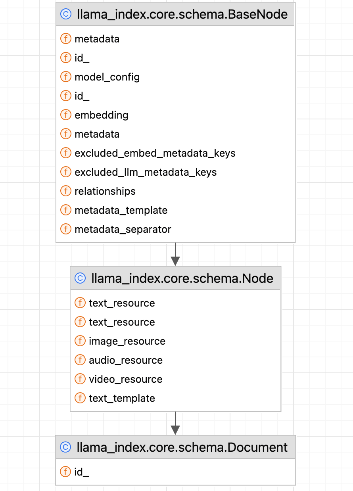
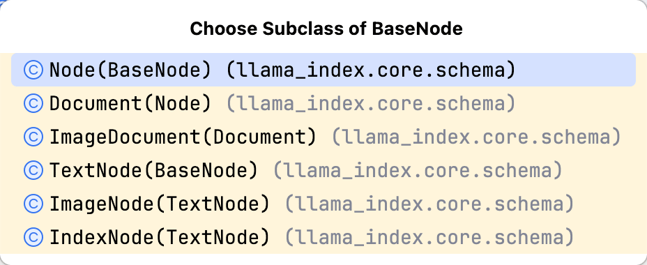

| 版本 | 内容 | 时间                   |
| ---- | ---- | ---------------------- |
| V1   | 新建 | 2026年04月12日22:23:03 |

参考：

1. 《基于大模型的RAG应用开发与优化-构建企业级LLM应用》
2. https://github.com/datawhalechina/all-in-rag/tree/main
3. https://developers.llamaindex.ai/python/framework/understanding/rag/

RAG 开发第一步是**准备知识库**，核心先做**数据加载与分割**：接入各类数据源（本地文档、数据库、网页、云文档、开放接口数据），完成读取和预处理，为后续存储、索引打好基础。本节主要分析使用 LlamaIndex 组件实现多源数据的加载。

## Document与Node的关系

| 概念              | 定位                          | RAG 中的作用                                              |
| ----------------- | ----------------------------- | --------------------------------------------------------- |
| **Document**      | 原始完整数据的「容器」        | 加载、封装多源数据（PDF / 网页 / 数据库），作为切分的源头 |
| **Node**          | 数据的「原子单元」（Chunk）   | 真正用于 Embedding、索引、检索、生成的核心载体            |
| 其他**衍生 Node** | 针对特定场景的「增强型 Node」 | 解决多模态、长文本、摘要检索、工具调用等复杂需求          |

继承关系：




在 BaseNode 类型中，定义了所有的 Node 类型都有的属性和接口，其中一些抽象接口将由更具体的 Node 类型来实现。一共有以下 4 种类型的 Node。



```
class ObjectType(str, Enum):
    TEXT = auto()
    IMAGE = auto()
    INDEX = auto()
    DOCUMENT = auto()
    MULTIMODAL = auto()
```

1. TEXT：TextNode，是基础节点类型，作为容器专门存储文本内容与对应的元数据信息。
2. IMAGE：ImageNode，继承 TextNode，额外存储 base64 图像、图片 URL 等相关数据。
3. DOCUMENT：Document 类，继承 Node，是封装后的 Node，用于表示从各类数据源加载的原始文档。
4. INDEX：IndexNode，继承 TextNode，可引用其他对象，是实现递归检索等功能的关键节点。

Document 与 Node 本质都是数据 + 元数据容器，Document 为原始文档，Node 是文档分割后的数据块。

## Document与Node的核心属性

```python
from llama_index.core import Document

doc = Document(
    text="这是一篇关于RAG的技术文档...",
    metadata={
        "source": "internal_kb",
        "department": "tech",
        "version": "1.0"
    }
)
pprint.pprint(doc.to_dict())
```

*输出*：

```json
{'audio_resource': None,
 'class_name': 'Document',
 'embedding': None,
 'excluded_embed_metadata_keys': [],
 'excluded_llm_metadata_keys': [],
 'id_': 'd45d2a27-8434-4031-8b73-0cd7a12ad3be',
 'image_resource': None,
 'metadata': {'department': 'tech', 'source': 'internal_kb', 'version': '1.0'},
 'metadata_separator': '\n',
 'metadata_template': '{key}: {value}',
 'relationships': {},
 'text': '这是一篇关于RAG的技术文档...',
 'text_resource': {'embeddings': None,
                   'mimetype': None,
                   'path': None,
                   'text': '这是一篇关于RAG的技术文档...',
                   'url': None},
 'text_template': '{metadata_str}\n\n{content}',
 'video_resource': None}
```

核心属性

| 属性        | 类型                    | 作用                                                         |
| ----------- | ----------------------- | ------------------------------------------------------------ |
| `text`      | `str`                   | 原始文本内容（如果是图片 / 音频，这里是描述文本）            |
| `metadata`  | `Dict[str, Any]`        | 元数据，如 `source`（来源）、`page`（页码）、`author`（作者）、`created_at`（创建时间）、`file_path`（文件路径） |
| `id_`       | `str`                   | 唯一标识（自动生成，也可自定义）                             |
| `embedding` | `Optional[List[float]]` | 嵌入模型生成的向量。后面用于构造向量存储索引                 |

## Node的元数据

元数据（Metadata）是 Node 的 “灵魂附件”，它不直接参与文本语义，但决定了 RAG 系统的**可溯源性、可过滤性、权限可控性和业务适配性**，是从 “玩具 Demo” 到 “生产系统” 的关键。

*Node元数据的核心价值*

| 作用                    | 说明                                      | 业务场景                                                     |
| ----------------------- | ----------------------------------------- | ------------------------------------------------------------ |
| **溯源**                | 明确文本块的原始来源、位置（页码 / 章节） | 用户问 “这句话出自哪篇文档的第几页” 时，可精准定位           |
| **检索过滤**            | 基于元数据条件筛选候选块，缩小检索范围    | 只检索 “技术部”“2024 年之后”“版本号≥2.0” 的文档块            |
| **权限控制**            | 结合元数据做数据隔离                      | 普通用户只能看 `confidentiality=public` 的块，管理员可看 `confidentiality=internal` |
| **排序优化**            | 结合元数据调整检索结果优先级              | 让 `created_at` 最新的块、`priority=high` 的块排在前面       |
| **多语言 / 多模态适配** | 标记文本块的语言、模态类型                | 中文用户只检索 `language=zh` 的块，图文混合检索只查 `type=text` 或 `type=image` |

文本内容和元数据会一起输入到嵌入模型或者大模型中，Document 或者 Node 对象提供了 get_content 方法将文本内容和元数据转成字符串。例如：

```python
doc = Document(
    text="这是一篇关于RAG的技术文档...",
    metadata={
        "source": "internal_kb",
        "department": "tech",
        "version": "1.0"
    }
)

pprint.pprint(doc.get_content(metadata_mode=MetadataMode.ALL))
```

*输出*：

```
'source: internal_kb\ndepartment: tech\nversion: 1.0\n\n这是一篇关于RAG的技术文档...'
```

以下**控制「元数据（Metadata）如何参与向量化、如何拼接给 LLM」的核心配置**，主要作用于 `TextNode`/`Document` 的文本构建阶段，直接影响 RAG 的检索质量与生成效果。

| 属性名称                         | 核心作用                                             | 解决的核心问题                                               | 默认值                             | 典型使用场景                                                 |
| -------------------------------- | ---------------------------------------------------- | ------------------------------------------------------------ | ---------------------------------- | ------------------------------------------------------------ |
| **excluded_embed_metadata_keys** | 控制**哪些元数据不参与向量化**，仅存储不影响语义检索 | 避免文件路径、时间戳、内部 ID 等无意义元数据引入检索噪声，降低召回精准度 | 所有数据都向量化                   | 排除`file_path`、`create_time`、`doc_id`、`page_number`等内部辅助信息 |
| **excluded_llm_metadata_keys**   | 控制**哪些元数据不传递给大模型**，仅用于系统内部管理 | 节省 LLM 上下文 token，避免内部信息干扰生成逻辑，防止敏感信息泄露 | 所有数据都传给大模型               | 排除`internal_id`、`processing_status`、`file_size`等系统专用元数据 |
| **metadata_template**            | 定义**单个元数据键值对的显示格式**                   | 统一元数据呈现样式，提升 LLM 对元数据的可读性                | {key}:{value}                      | 自定义为`【{key}】{value}`、`[{key}] {value}`等更清晰的格式  |
| **metadata_separator**           | 定义**多个元数据之间的分隔符**                       | 控制元数据的排版方式，可节省 token 或提升可读性              | "\n"换行                           | 用 `","` 替代换行，大幅减少长元数据的 token 消耗             |
| **text_template**                | 定义**元数据与正文的最终拼接模板**                   | 控制整体输入结构，优化 LLM 对信息的理解顺序                  | {metadata_str}<br />\n\n{content}` | 调整为`"{content}\n---\n{metadata_str}"`（正文在前，元数据在后） |

通过案例了解这几个参数的作用：

```python
doc = Document(
    text="这是一篇关于RAG的技术文档...",
    metadata={
        "source": "internal_kb",
        "department": "tech",
        "version": "1.0",
        "author": "guosgbin"
    },
    excluded_embed_metadata_keys=["version"],
    excluded_llm_metadata_keys=["greet"],
    metadata_template="{key}=>{value}",
    text_template="{metadata_str}\n-----\n{content}",
)

print("所有元数据\n", doc.get_content(metadata_mode=MetadataMode.ALL), end="\n================\n")
print("LLM看到的元数据\n", doc.get_content(metadata_mode=MetadataMode.LLM), end="\n================\n")
print("嵌入模型看到的元数据\n", doc.get_content(metadata_mode=MetadataMode.EMBED), end="\n================\n")
print("没有元数据\n", doc.get_content(metadata_mode=MetadataMode.NONE), end="\n================\n")
```

*输出*

```
所有元数据
 source=>internal_kb
department=>tech
version=>1.0
author=>guosgbin
-----
Content: 这是一篇关于RAG的技术文档...
================
LLM看到的元数据
 source=>internal_kb
department=>tech
version=>1.0
author=>guosgbin
-----
Content: 这是一篇关于RAG的技术文档...
================
嵌入模型看到的元数据
 source=>internal_kb
department=>tech
author=>guosgbin
-----
Content: 这是一篇关于RAG的技术文档...
================
没有元数据
 这是一篇关于RAG的技术文档...
================
```

## Document对象的生成

方式 1：手动直接创建（最简单，适合自定义数据）

代码示例

```python
from llama_index import Document

# 1. 基础创建（仅文本）
doc1 = Document(text="这是一篇关于Java开发的文档内容...")

# 2. 完整创建（文本 + 元数据 + 自定义ID）
doc2 = Document(
    text="Spring AI 核心功能包括...",
    metadata={
        "title": "Spring AI 开发指南",
        "author": "技术团队",
        "category": "AI开发",
        "create_time": "2026-04-13"
    },
    id_="custom-doc-001"  # 手动指定唯一ID（可选，不指定则自动生成）
)
```

适用场景

- 从数据库、API 等非文件源读取数据后手动封装；
- 对元数据有高度自定义需求的场景。

------

方式 2：通过 `SimpleDirectoryReader` 从本地文件加载（最常用）

核心流程

1. **扫描目录**：识别指定路径下的文件；
2. **格式解析**：根据文件扩展名自动选择对应的 Reader（如 `.pdf` 用 `PDFReader`，`.docx` 用 `DocxReader`）；
3. **内容提取**：读取文件文本内容；
4. **元数据自动填充**：提取文件名、路径、文件类型、创建时间等元数据；
5. **封装 Document**：生成 Document 对象列表。

```python
from llama_index import SimpleDirectoryReader

# 1. 基础用法：加载目录下所有支持的文件
reader = SimpleDirectoryReader(
    input_dir="./data",  # 文档目录
    recursive=True,       # 是否递归扫描子目录
    required_exts=[".pdf", ".docx", ".txt"]  # 仅加载指定格式文件
)
documents = reader.load_data()  # 返回 List[Document]

# 2. 进阶用法：自定义元数据
def custom_metadata_func(file_path):
    return {
        "source": "内部文档",
        "file_path": file_path
    }

reader = SimpleDirectoryReader(
    input_dir="./data",
    file_metadata=custom_metadata_func  # 自定义元数据生成函数
)
documents = reader.load_data()
```

自动提取的默认元数据

- `file_name`：文件名（如 `java_guide.pdf`）；
- `file_path`：完整文件路径；
- `file_type`：文件类型（如 `application/pdf`）；
- `file_size`：文件大小（字节）；
- `creation_date`/`last_modified_date`：文件创建 / 修改时间;


*输出*

```
The number of documents in docs is:  2
file_path: xxxxxxx../../data/JavaInterview.txt
file_name: JavaInterview.txt
file_type: text/plain
file_size: 5777
creation_date: 2026-04-07
last_modified_date: 2026-04-07
```

------

方式 3：通过 LlamaHub 加载器从外部数据源加载（最灵活）

LlamaHub 提供 200+ 官方 / 社区加载器，支持从 Notion、GitHub、数据库、网页、微信公众号等各类数据源直接加载 Document。

代码示例（加载网页）

```python
from llama_index import download_loader

# 1. 下载网页加载器
WebPageReader = download_loader("WebPageReader")

# 2. 创建加载器并加载网页
loader = WebPageReader()
documents = loader.load_data(
    urls=["https://example.com/docs/spring-ai"]
)
```

代码示例（加载 Notion）

```python
NotionPageReader = download_loader("NotionPageReader")
loader = NotionPageReader(integration_token="your_token")
documents = loader.load_data(page_ids=["page_id_1", "page_id_2"])
```

## Node对象的生成

方式 1：手动直接创建（最简单，适合自定义数据）

代码示例

```python
texts = ["This is a chunk1", "This is a chunk2"]
nodes = [TextNode(text=text) for text in texts]

for node in nodes:
    print(node.model_dump_json())
```

*输出*

```
{"id_":"719077d1-6519-48fc-964f-239893fd285d","embedding":null,"metadata":{},"excluded_embed_metadata_keys":[],"excluded_llm_metadata_keys":[],"relationships":{},"metadata_template":"{key}: {value}","metadata_separator":"\n","text":"This is a chunk1","mimetype":"text/plain","start_char_idx":null,"end_char_idx":null,"text_template":"{metadata_str}\n\n{content}","class_name":"TextNode"}
{"id_":"f2cb3eb7-a1c2-46bd-889c-a6f5365c734a","embedding":null,"metadata":{},"excluded_embed_metadata_keys":[],"excluded_llm_metadata_keys":[],"relationships":{},"metadata_template":"{key}: {value}","metadata_separator":"\n","text":"This is a chunk2","mimetype":"text/plain","start_char_idx":null,"end_char_idx":null,"text_template":"{metadata_str}\n\n{content}","class_name":"TextNode"}
```

在实际开发中，大多数 Node 对象是用 Document 对象通过各种数据分割器（用于解析 Document 对象的内容并进行分割的组件，后续章节介绍）生成的。

在下面的例子中，我们构造一个 Document 对象，然后使用基于分割符的数据分割器把其转换为多个 Node 对象：

```python
docs = [Document(
    text="""
    Node（特别是 TextNode）是 LlamaIndex 中用于向量化与检索的核心基本单元，本质是从 Document 分割而来的「语义文本块」。
    Node 生成是连接「原始文档」与「索引检索」的关键桥梁，直接决定 RAG 的检索质量与生成效果。
    下面从定位本质、核心流程、核心解析器、调优细节、代码实战五个维度深入解析。
    """
)]

# 构造一个简单的数据分割器
parser = TokenTextSplitter(chunk_size=60, chunk_overlap=0, separator="\n")
nodes = parser.get_nodes_from_documents(docs)

print("节点个数：", len(nodes))
for node in nodes:
    print(node.model_dump_json())
```

*输出*(json 格式化后的)

```
节点个数： 3
{"id_":"31cfb503-3348-4b3c-81cb-0658dcbe0f64","embedding":null,"metadata":{},"excluded_embed_metadata_keys":[],"excluded_llm_metadata_keys":[],"relationships":{"1":{"node_id":"2459fee1-7b77-481e-b29a-55fecf24b2ee","node_type":"4","metadata":{},"hash":"62c0cf9931392a46838b97e87419c5f8d60f1d915542459155a24b27afb4baf8","class_name":"RelatedNodeInfo"},"3":{"node_id":"e6f8f2e0-b4d1-44c9-a719-03d3bc4b1f02","node_type":"1","metadata":{},"hash":"3e8aea8d9bb9152d6f6b4e09288887b6c734e8de649e926ba2e4504a768d8278","class_name":"RelatedNodeInfo"}},"metadata_template":"{key}: {value}","metadata_separator":"\n","text":"Node（特别是 TextNode）是 LlamaIndex 中用于向量化与检索的核心基本单元，本质是从 Document 分割而来的「语义文本块」。","mimetype":"text/plain","start_char_idx":9,"end_char_idx":84,"text_template":"{metadata_str}\n\n{content}","class_name":"TextNode"}
{"id_":"e6f8f2e0-b4d1-44c9-a719-03d3bc4b1f02","embedding":null,"metadata":{},"excluded_embed_metadata_keys":[],"excluded_llm_metadata_keys":[],"relationships":{"1":{"node_id":"2459fee1-7b77-481e-b29a-55fecf24b2ee","node_type":"4","metadata":{},"hash":"62c0cf9931392a46838b97e87419c5f8d60f1d915542459155a24b27afb4baf8","class_name":"RelatedNodeInfo"},"2":{"node_id":"31cfb503-3348-4b3c-81cb-0658dcbe0f64","node_type":"1","metadata":{},"hash":"cc532ac1f1d0faac93f31bd5b9e5c8cb69c05fdabbb25959ef31a637b62512e0","class_name":"RelatedNodeInfo"},"3":{"node_id":"3c36b814-7727-4862-8886-bd37aae51c71","node_type":"1","metadata":{},"hash":"7c21486ae0afb0fbb11d4e03c107a4088fa6396fc1498a574e24559915dbe4ea","class_name":"RelatedNodeInfo"}},"metadata_template":"{key}: {value}","metadata_separator":"\n","text":"Node 生成是连接「原始文档」与「索引检索」的关键桥梁，直接决定 RAG 的检索质量与生成效果。","mimetype":"text/plain","start_char_idx":93,"end_char_idx":142,"text_template":"{metadata_str}\n\n{content}","class_name":"TextNode"}
{"id_":"3c36b814-7727-4862-8886-bd37aae51c71","embedding":null,"metadata":{},"excluded_embed_metadata_keys":[],"excluded_llm_metadata_keys":[],"relationships":{"1":{"node_id":"2459fee1-7b77-481e-b29a-55fecf24b2ee","node_type":"4","metadata":{},"hash":"62c0cf9931392a46838b97e87419c5f8d60f1d915542459155a24b27afb4baf8","class_name":"RelatedNodeInfo"},"2":{"node_id":"e6f8f2e0-b4d1-44c9-a719-03d3bc4b1f02","node_type":"1","metadata":{},"hash":"3e8aea8d9bb9152d6f6b4e09288887b6c734e8de649e926ba2e4504a768d8278","class_name":"RelatedNodeInfo"}},"metadata_template":"{key}: {value}","metadata_separator":"\n","text":"下面从定位本质、核心流程、核心解析器、调优细节、代码实战五个维度深入解析。","mimetype":"text/plain","start_char_idx":151,"end_char_idx":188,"text_template":"{metadata_str}\n\n{content}","class_name":"TextNode"}
```

## Node对象之间的关系

通常情况下 Node 对象是用 Document 对象分割而来的，分割出来的 Node 对象与 Document 对象之间、多个 Node 对象之间存在天然的父子或兄弟关系。LlamaIndex 框架中共有 5 种 Node 对象的基础关系类型。

| 关系类型（英文） | 枚举值 | 核心定义                                       |
| ---------------- | ------ | ---------------------------------------------- |
| SOURCE           | 1      | The node is the source document.               |
| PREVIOUS         | 2      | The node is the previous node in the document. |
| NEXT             | 3      | The node is the next node in the document.     |
| PARENT           | 4      | The node is the parent node in the document.   |
| CHILD            | 5      | The node is a child node in the document.      |

下面看一个案例

```python
docs = [Document(
    text="""
    Node（特别是 TextNode）是 LlamaIndex 中用于向量化与检索的核心基本单元，本质是从 Document 分割而来的「语义文本块」。
    Node 生成是连接「原始文档」与「索引检索」的关键桥梁，直接决定 RAG 的检索质量与生成效果。
    下面从定位本质、核心流程、核心解析器、调优细节、代码实战五个维度深入解析。
    """
)]

# 构造一个简单的数据分割器
parser = TokenTextSplitter(chunk_size=60, chunk_overlap=0, separator="\n")
nodes = parser.get_nodes_from_documents(docs)

for doc in docs:
    print("docs 的 id", doc.model_dump_json())

print("节点个数：", len(nodes))
for node in nodes:
    print(node.model_dump_json())
```

将输出格式化，展示如下:

```json
docs 的 id {
    "id_": "dcab33ed-3bcb-4bce-8edf-cdd096875b98",
    "relationships": {},
    "metadata_template": "{key}: {value}",
    "metadata_separator": "\n",
    "text_resource": {
        "embeddings": null,
        "text": "\n        Node（特别是 TextNode）是 LlamaIndex 中用于向量化与检索的核心基本单元，本质是从 Document 分割而来的「语义文本块」。\n        Node 生成是连接「原始文档」与「索引检索」的关键桥梁，直接决定 RAG 的检索质量与生成效果。\n        下面从定位本质、核心流程、核心解析器、调优细节、代码实战五个维度深入解析。\n        ",
        "path": null,
        "url": null,
        "mimetype": null
    },
    "image_resource": null,
    "audio_resource": null,
    "video_resource": null,
    "text_template": "{metadata_str}\n\n{content}",
    "class_name": "Document",
    "text": "\n        Node（特别是 TextNode）是 LlamaIndex 中用于向量化与检索的核心基本单元，本质是从 Document 分割而来的「语义文本块」。\n        Node 生成是连接「原始文档」与「索引检索」的关键桥梁，直接决定 RAG 的检索质量与生成效果。\n        下面从定位本质、核心流程、核心解析器、调优细节、代码实战五个维度深入解析。\n        "
}


节点个数： 3
{
    "id_": "ec8735fb-0f7f-430f-b76a-9c9d35c7f75b",
    "embedding": null,
    "metadata": {},
    "excluded_embed_metadata_keys": [],
    "excluded_llm_metadata_keys": [],
    "relationships": {
        "1": {
            "node_id": "dcab33ed-3bcb-4bce-8edf-cdd096875b98",
            "node_type": "4",
            "metadata": {},
            "hash": "62c0cf9931392a46838b97e87419c5f8d60f1d915542459155a24b27afb4baf8",
            "class_name": "RelatedNodeInfo"
        },
        "3": {
            "node_id": "84f3d190-58d3-4158-bb6d-0af0f34ad475",
            "node_type": "1",
            "metadata": {},
            "hash": "3e8aea8d9bb9152d6f6b4e09288887b6c734e8de649e926ba2e4504a768d8278",
            "class_name": "RelatedNodeInfo"
        }
    },
    "metadata_template": "{key}: {value}",
    "metadata_separator": "\n",
    "text": "Node（特别是 TextNode）是 LlamaIndex 中用于向量化与检索的核心基本单元，本质是从 Document 分割而来的「语义文本块」。",
    "mimetype": "text/plain",
    "start_char_idx": 9,
    "end_char_idx": 84,
    "text_template": "{metadata_str}\n\n{content}",
    "class_name": "TextNode"
}
{
    "id_": "84f3d190-58d3-4158-bb6d-0af0f34ad475",
    "embedding": null,
    "metadata": {},
    "excluded_embed_metadata_keys": [],
    "excluded_llm_metadata_keys": [],
    "relationships": {
        "1": {
            "node_id": "dcab33ed-3bcb-4bce-8edf-cdd096875b98",
            "node_type": "4",
            "metadata": {},
            "hash": "62c0cf9931392a46838b97e87419c5f8d60f1d915542459155a24b27afb4baf8",
            "class_name": "RelatedNodeInfo"
        },
        "2": {
            "node_id": "ec8735fb-0f7f-430f-b76a-9c9d35c7f75b",
            "node_type": "1",
            "metadata": {},
            "hash": "cc532ac1f1d0faac93f31bd5b9e5c8cb69c05fdabbb25959ef31a637b62512e0",
            "class_name": "RelatedNodeInfo"
        },
        "3": {
            "node_id": "c9529827-97d7-426c-89b0-e6b695a2ac05",
            "node_type": "1",
            "metadata": {},
            "hash": "7c21486ae0afb0fbb11d4e03c107a4088fa6396fc1498a574e24559915dbe4ea",
            "class_name": "RelatedNodeInfo"
        }
    },
    "metadata_template": "{key}: {value}",
    "metadata_separator": "\n",
    "text": "Node 生成是连接「原始文档」与「索引检索」的关键桥梁，直接决定 RAG 的检索质量与生成效果。",
    "mimetype": "text/plain",
    "start_char_idx": 93,
    "end_char_idx": 142,
    "text_template": "{metadata_str}\n\n{content}",
    "class_name": "TextNode"
}
{
    "id_": "c9529827-97d7-426c-89b0-e6b695a2ac05",
    "embedding": null,
    "metadata": {},
    "excluded_embed_metadata_keys": [],
    "excluded_llm_metadata_keys": [],
    "relationships": {
        "1": {
            "node_id": "dcab33ed-3bcb-4bce-8edf-cdd096875b98",
            "node_type": "4",
            "metadata": {},
            "hash": "62c0cf9931392a46838b97e87419c5f8d60f1d915542459155a24b27afb4baf8",
            "class_name": "RelatedNodeInfo"
        },
        "2": {
            "node_id": "84f3d190-58d3-4158-bb6d-0af0f34ad475",
            "node_type": "1",
            "metadata": {},
            "hash": "3e8aea8d9bb9152d6f6b4e09288887b6c734e8de649e926ba2e4504a768d8278",
            "class_name": "RelatedNodeInfo"
        }
    },
    "metadata_template": "{key}: {value}",
    "metadata_separator": "\n",
    "text": "下面从定位本质、核心流程、核心解析器、调优细节、代码实战五个维度深入解析。",
    "mimetype": "text/plain",
    "start_char_idx": 151,
    "end_char_idx": 188,
    "text_template": "{metadata_str}\n\n{content}",
    "class_name": "TextNode"
}

```

观察上面 id 为 84f3d190-58d3-4158-bb6d-0af0f34ad475 的 Node 节点，展示它的 relationships 属性数据：

```json
"relationships": {
        "1": {
            "node_id": "dcab33ed-3bcb-4bce-8edf-cdd096875b98",
            "node_type": "4",
            "metadata": {},
            "hash": "62c0cf9931392a46838b97e87419c5f8d60f1d915542459155a24b27afb4baf8",
            "class_name": "RelatedNodeInfo"
        },
        "2": {
            "node_id": "ec8735fb-0f7f-430f-b76a-9c9d35c7f75b",
            "node_type": "1",
            "metadata": {},
            "hash": "cc532ac1f1d0faac93f31bd5b9e5c8cb69c05fdabbb25959ef31a637b62512e0",
            "class_name": "RelatedNodeInfo"
        },
        "3": {
            "node_id": "c9529827-97d7-426c-89b0-e6b695a2ac05",
            "node_type": "1",
            "metadata": {},
            "hash": "7c21486ae0afb0fbb11d4e03c107a4088fa6396fc1498a574e24559915dbe4ea",
            "class_name": "RelatedNodeInfo"
        }
    },
```

其中 1 表示 SOURCE 的节点，也就是它的 Document 节点，2 表示 PREVIOUS 节点，是它上一个节点。3 表示 NEXT 节点，是它的下一个节点。

## Node元数据的生成和提取

元数据的来源有下面几种：

1. 根据需要自行设置 Document 对象或者 Node 对象的元数据；
2. 框架在需要时自动生成 Document 对象或者 Node 对象的元数据；
3. 借助框架提供的元数据抽取器来生成 Document 对象或者 Node 对象的元数据；

---

**来源 1：手动设置**

```python
# 手工设置元数据
doc1 = Document(
    text="学langchain还是llamaindex?",
    metadata={
        "file_name": "rag学习.txt",
        "category": "technology",
        "author": "random person",
    }
)
print(doc1.metadata)

node = TextNode(
    text="学什么",
    metadata={
        "file_name": "rag学习.txt",
        "category": "technology",
        "author": "random person",
    }
)
print(node.metadata)
```

*输出*

```
手动设置document的元数据 {'file_name': 'rag学习.txt', 'category': 'technology', 'author': 'random person'}
手动设置node的元数据 {'file_name': 'rag学习.txt', 'category': 'technology', 'author': 'random person'}
```

---

**来源 2：读取器自动生成元数据**

```python
# 自动生成Document对象的元数据
docs = SimpleDirectoryReader(input_files=["../../data/JavaInterview.txt"]).load_data()
print("document的元数据", docs[0].metadata)

# 元数据自动继承到Node对象
parser = TokenTextSplitter(chunk_size=100, chunk_overlap=0, separator="\n")
nodes = parser.get_nodes_from_documents(docs)
print("node继承document的元数据", nodes[0].metadata)
```

*输出*

```
document的元数据 {'file_path': '../../data/JavaInterview.txt', 'file_name': 'JavaInterview.txt', 'file_type': 'text/plain', 'file_size': 5777, 'creation_date': '2026-04-07', 'last_modified_date': '2026-04-07'}
node继承document的元数据 {'file_path': '../../data/JavaInterview.txt', 'file_name': 'JavaInterview.txt', 'file_type': 'text/plain', 'file_size': 5777, 'creation_date': '2026-04-07', 'last_modified_date': '2026-04-07'}
```

在自动生成的 Document 对象与 Node 对象中，框架生成了基本的元数据，比如文档路径、文档名、文档类型、大小、日期等，而且用Document 对象生成的 Node 对象会自动继承 Document 对象的元数据。

---

**来源 3：元数据抽取器自动生成元数据**

LlamaIndex 的 **MetadataExtractor** 可通过大模型或算法自动为 Node 抽取摘要、标题、实体、可问答问题等高级元数据。

这些元数据能在嵌入与生成阶段被使用，为原始文本补充更丰富语义信息，从而**提升 RAG 的检索准确度与回答质量**。

**核心定位**：

```
原始数据 → Document → NodeParser 切块 → MetadataExtractor 提取元数据 → 向量化 → 存入向量库 → 检索 → 生成
```

**解决的核心痛点**：

| 痛点     | 传统 RAG 的问题          | MetadataExtractor 的解决方式 |
| -------- | ------------------------ | ---------------------------- |
| 语义模糊 | 文本块太短，向量表达不准 | 生成摘要 / 标题，补充语义    |
| 匹配不准 | 用户问法和原文文字不同   | 生成 “可回答问题”，直接匹配  |
| 信息缺失 | 原文隐含信息没被利用     | 抽取实体 / 关键词，显性化    |

**llamaindex 内置提取器详解**：

1）**TitleExtractor（标题提取器）**：给每个 Node 生成一个概括性标题。

```python
os.environ["LANGFUSE_PUBLIC_KEY"] = "你的 langfuse 的公钥"
os.environ["LANGFUSE_SECRET_KEY"] = "你的 langfuse 的私钥"
os.environ["LANGFUSE_BASE_URL"] = "http://localhost:3000"

# 构造 Langfuse平台的回调类，显式传入 base_url
langfuse_callback_handler = LlamaIndexCallbackHandler(
    public_key=os.environ["LANGFUSE_PUBLIC_KEY"],
    secret_key=os.environ["LANGFUSE_SECRET_KEY"],
    host=os.environ["LANGFUSE_BASE_URL"],
)
# 设置到全局的 callback_manager
# Settings.callback_manager = CallbackManager([langfuse_callback_handler])

llm = DashScope(model='qwen-3.5-plus',
                api_key="你的千问的 APIKEY",
                callback_manager=CallbackManager([langfuse_callback_handler]))

docs = SimpleDirectoryReader(input_files=["../../data/rag.md"]).load_data()
# 先切成 TextNode
parser = TokenTextSplitter(chunk_size=1024, chunk_overlap=20, separator="\n")
nodes = parser.get_nodes_from_documents(docs)
title_extractor = TitleExtractor(llm=llm,
                                 nodes=5,
                                 show_progress=True,
                                 # 移除 metadata_mode=MetadataMode.NONE，让元数据自动写入节点
                                 node_template="""
                                             仅根据以下内容生成一个最简短的标题，不要加任何额外内容：
                                             {context_str}
                                             标题：
                                             """,
                                 combine_template="{context_str}。基于上述候选标题和内容，这个文档的综合标题是什么？标题："
                                 )

# TitleExtractor 会自动将提取的元数据写入到 nodes 中
extract_list = title_extractor.extract(nodes)

# 从提取结果中获取
print("Title extracted:", json.dumps(extract_list[0], ensure_ascii=False, indent=2))
```

*输出*

```java
Title extracted: {
  "document_title": "基于您提供的内容要点，这个文档可以综合命名为：\n\n**《RAG技术详解：原理、优化方法及其与微调技术的对比分析》**\n\n这样的标题能够全面概括文档中关于检索增强生成（RAG）模型的基本概念、工作原理、如何通过检索后处理来提升大模型输出质量的方法论，以及将RAG技术与传统的微调方法进行比较的内容。同时，它也暗示了文档会探讨两种技术各自的优缺点，为读者提供了一个清晰的预期，即他们将了解到有关RAG技术及其相对于微调的优势和局限性的深入见解。"
}
```

可以看到已经成功提取到文档的标题了

TitleExtractor 的工作原理是**两阶段 LLM 调用**：

```
nodes (按文档分组)
  │
  ▼ Stage 1: node_template (每个 node 调一次 LLM)
  "根据以下内容生成标题: {context_str}"
  │
  ├── node_0 → "RAG 技术简介"
  ├── node_1 → "检索增强生成"
  ├── node_2 → "向量数据库应用"
  │   ...
  ▼
  候选标题列表用逗号拼接
  │
  ▼ Stage 2: combine_template (每个文档调一次 LLM)
  "基于上述候选标题和内容，综合标题是什么？"
  │
  ▼ 每个文档得到唯一的 document_title
```

上面的 document 切分后，将前 5 个（参数控制）node每个 node 调一次 LLM 生成 title，最后调用一次 LLM 生成最终的标题。

我们通过 langfuse 看下大模型的调用流程

**一阶段：**（基于LlamaIndexCallbackHandler）


**二阶段：**（基于LlamaIndexCallbackHandler）


2）**KeywordExtractor（关键字提取器）**：为每个 node 独立生成一组关键词。

```python
llm = DashScope(model='qwen-3.5-plus', api_key="你的 API_KEY")
docs = SimpleDirectoryReader(input_files=["../../data/rag.md"]).load_data()
parser = TokenTextSplitter(chunk_size=512, chunk_overlap=20, separator="\n")
nodes = parser.get_nodes_from_documents(docs)
keyword_extractor_instance = KeywordExtractor(
    llm=llm,
    keywords=5,  # 每个 node 提取 5 个关键词
    show_progress=True,
)
# 提取关键词
extract_list = keyword_extractor_instance.extract(nodes)
print("Keyword extracted:", json.dumps(extract_list, ensure_ascii=False, indent=2))
```

*输出*

```
Keyword extracted: [
  {
    "excerpt_keywords": "RAG, 大模型, 知识时效性, 黑盒子问题, 输出不确定性"
  },
  {
    "excerpt_keywords": "大模型,幻觉问题,训练知识偏差,过度泛化,垂直领域知识"
  }
  ...... // 省略部分....
  {
    "excerpt_keywords": "RAG, 成本效率, 知识更新, 模型幻觉, 工程复杂性"
  },
  {
    "excerpt_keywords": "RAG, 长上下文模型, 知识库, 深度推理, 成本控制"
  }
]
```

Langfuse 链路图：基于 LlamaIndexCallbackHandler


3）**SummaryExtractor（摘要提取器）**：

```python
# llm = Ollama(model='qwen:0.5b')
llm = DashScope(model='qwen-3.5-plus', api_key="你的 API_KEY")
# 自动生成Document对象的元数据
docs = SimpleDirectoryReader(input_files=["../../data/rag.md"]).load_data()
summary_extractor = SummaryExtractor(llm=llm,
                                     show_progress=True,
                                     prompt_template="请生成以下内容的中文摘要：{context_str}\n摘要: ",
                                     metadata_mode=MetadataMode.LLM)
parser = TokenTextSplitter(chunk_size=1024, chunk_overlap=50, separator="\n")
nodes = parser.get_nodes_from_documents(docs)
summarys = summary_extractor.extract(nodes)
print(json.dumps(summarys, ensure_ascii=False, indent=2))
```

*输出*

```
[
  {
    "section_summary": "本文档简要介绍了 RAG（检索增强生成）技术及其背景。主要内容如下：\n\n1.  **大模型面临的挑战**：指出了大模型在实际应用中的四大核心问题，包括知识时效性滞后、黑盒不可解释性、输出不确定性以及“幻觉”问题（源于训练数据偏差、过度泛化及缺乏垂直领域知识等）。\n2.  **RAG 技术定义与作用**：阐述了 RAG 技术的本质是将大模型与信息检索结合，通过引入外部实时数据补充内部参数化知识。其主要目的是提升回答的准确性与时效性，有效缓解大模型的幻觉问题，是构建企业级 LLM 应用的关键优化方案。"
  },
  {
    "section_summary": "本文介绍了 RAG（检索增强生成）技术的核心原理与架构演进，主要内容如下：\n\n1.  **核心价值**：通过“考生与参考书”的比喻，说明 RAG 能让大模型依托参考资料答题，有效缓解因知识不足产生的幻觉，大幅提升答案准确性。\n2.  **核心原理**：主要包含两个阶段。\n    *   **检索阶段**：涉及数据加载、文本分割、向量嵌入及索引构建，旨在将异构知识转化为可语义检索的向量存储。\n    *   **生成阶段**：包括根据查询检索相关上下文，并结合用户问题由大模型生成最终答案。\n3.  **架构演进**：优化版 RAG 新增了**检索前处理**（如查询转换、扩充、路由）与**检索后处理**阶段，以进一步提升检索召回精准度与最终生成质量。"
  },
  // ...... 省略部分
  {
    "section_summary": "本文对比了超长上下文大模型与 RAG 技术的优缺点及协作关系。超长上下文大模型优势在于端到端使用便捷、上下文连贯性强，适合全局逻辑分析，但存在“中间迷失”、推理成本高及知识更新滞后等局限。RAG 技术则在成本效率、知识更新灵活性及可解释性方面表现突出，但面临工程复杂及全局上下文丢失的挑战。两者实为互补增效关系，主流落地方向是结合使用：既可通过\"RAG 前置过滤 + 长上下文深度理解”兼顾成本与效果，也可利用长上下文模型优化 RAG 的分块、检索与重排等环节，全面提升系统性能。"
  },
  {
    "section_summary": "摘要：本文指出，即便大模型上下文窗口无限扩大，RAG 技术在知识更新、成本控制、精准召回及可解释性方面仍具有不可替代的核心价值。长上下文模型的发展不仅未取代 RAG，反而进一步放大了其能力上限。结论认为，RAG 与长上下文模型的结合是当前大模型落地的最优解决方案。"
  }
]
```

Langfuse 链路图：基于 LlamaIndexInstrumentor 类


4）**QuestionsAnsweredExtractor（可回答问题提取器）**

```python
llm = create_llm()
docs = SimpleDirectoryReader(input_files=["../../data/rag.md"]).load_data()
parser = TokenTextSplitter(chunk_size=1024, chunk_overlap=50, separator="\n")
nodes = parser.get_nodes_from_documents(docs)

questions_extractor = QuestionsAnsweredExtractor(
    llm=llm,
    show_progress=True,
    metadata_mode=MetadataMode.NONE,
    prompt_template="请严格用中文、列表形式输出该段落可能回答的3-6个关键问题。\n"
                    "只输出问题本身，不要客套，不要解释，不要回答问题。\n"
                    "若段落无法提炼问题，请输出：无可提炼问题。\n"
                    "段落内容：{context_str}\n"
                    "问题列表：",
)
print(json.dumps(questions_extractor.extract(nodes), ensure_ascii=False, indent=2))
```

*输出*

```
[
  {
    "questions_this_excerpt_can_answer": "1. 大模型存在哪些主要问题？\n2. 大模型产生“幻觉”问题的原因有哪些？\n3. 大模型输出具有不确定性的根源是什么？\n4. RAG 技术主要用于解决大模型的哪些实际应用问题？\n5. 什么是 RAG 技术？\n6. RAG 技术的本质是什么？"
  },
  {
    "questions_this_excerpt_can_answer": "1. RAG 技术常被比作什么场景来解决大模型幻觉问题？\n2. RAG 的核心原理主要包含哪两个阶段？\n3. RAG 检索阶段具体包含哪些处理步骤？\n4. RAG 生成阶段是如何结合检索知识块与用户问题生成最终结果的？\n5. 随着 RAG 架构演进，新增了哪两个典型的处理阶段？\n6. RAG 检索阶段常采用何种检索方式依据相似度排序选取数据块？"
  },
  // ......省略部分
  {
    "questions_this_excerpt_can_answer": "- 超长上下文大模型有哪些优缺点？\n- RAG 技术相比超长上下文大模型有哪些优势与局限？\n- 超长上下文大模型与 RAG 是二选一的对立关系吗？\n- 当前企业级应用中超长上下文大模型与 RAG 的主流落地方向是什么？\n- 如何实现 RAG 与长上下文模型的互补增效？\n- 长上下文模型如何反向赋能 RAG 全链路？"
  },
  {
    "questions_this_excerpt_can_answer": "1. 即使模型上下文窗口无限大，RAG 的核心价值是否依然不可替代？\n2. RAG 在哪些具体方面具有不可替代的核心价值？\n3. 长上下文模型的发展对 RAG 的能力上限有何影响？\n4. 当前大模型落地的最优解是什么？\n5. 为什么 RAG 与长上下文模型的结合是大模型落地的最优解？"
  }
]
```

langfuse 链路图：基于 LlamaIndexInstrumentor


除了上面这几个提取器，还有

- 模型驱动型提取器 PydanticProgramExtractor，

- DocumentContextExtractor 专门解决 **RAG 上下文丢失问题** 的革命性元数据提取器。
