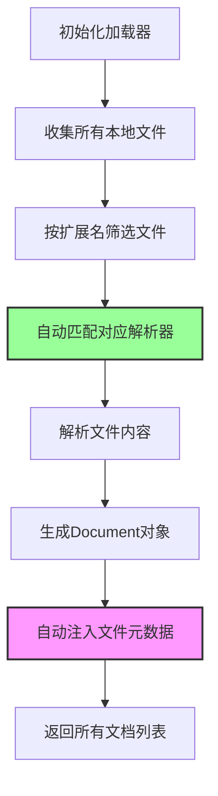

| 版本 | 内容 | 时间                   |
| ---- | ---- | ---------------------- |
| V1   | 新建 | 2026年04月17日15:50:38 |

## 本地加载

在 llamaindex 中有个 SimpleDirectoryReader 组件，从给定的目录中读取全部或者部分文档，并自动根据扩展名检测文档类型，采用不同的读取组件完成加载。

### 简单案例

```python
docs = SimpleDirectoryReader(input_files=["../../data/JavaInterview2.txt"]).load_data()
for doc in docs:
    print(doc.get_content())
```

*输出*

```
一、Java 基础
问题：JDK、JRE、JVM 三者之间的关系？答案：JVM 是 Java 虚拟机，执行字节码；JRE 是 Java 运行时环境，包含 JVM 和核心类库；JDK 是 Java 开发工具包，包含 JRE 和编译、调试等开发工具。
问题：Java 语言的特点有哪些？答案：面向对象、跨平台性、健壮性、安全性、支持多线程、自动垃圾回收机制。
问题：自动装箱和拆箱是什么？答案：装箱是基本类型转为包装类，拆箱是包装类转为基本类型，由编译器自动完成。
问题：== 和 equals 的区别？答案：== 对于基本类型比较值，引用类型比较地址；equals 未重写时比较地址，重写后比较内容，String、Integer 等均重写了 equals。
```

输出的正是我本地文件里面的内容。

### SimpleDirectoryReader 的工作原理

SimpleDirectoryReader 自动根据扩展名检测文档类型，采用不同的读取组件完成加载。支持的各种后缀如下：

```python
default_file_reader_cls: dict[str, Type[BaseReader]] = {
    ".hwp": HWPReader,
    ".pdf": PDFReader,
    ".docx": DocxReader,
    ".pptx": PptxReader,
    ".ppt": PptxReader,
    ".pptm": PptxReader,
    ".gif": ImageReader,
    ".jpg": ImageReader,
    ".png": ImageReader,
    ".jpeg": ImageReader,
    ".webp": ImageReader,
    ".mp3": VideoAudioReader,
    ".mp4": VideoAudioReader,
    ".csv": PandasCSVReader,
    ".epub": EpubReader,
    ".mbox": MboxReader,
    ".ipynb": IPYNBReader,
    ".xls": PandasExcelReader,
    ".xlsx": PandasExcelReader,
}
```

核心工作流程如下：



SimpleDirectoryReader 的属性如下

| 参数              | 类型                              | 说明                                                         |
| ----------------- | --------------------------------- | ------------------------------------------------------------ |
| `input_dir`       | `str`                             | 需要加载的目录路径                                           |
| `input_files`     | `List`                            | 需要加载的文档列表，会覆盖 `input_dir`、`exclude`            |
| `exclude`         | `List`                            | 需要排除的文档列表，支持文档通配符语法                       |
| `exclude_hidden`  | `bool`                            | 是否排除隐藏的文档                                           |
| `encoding`        | `str`                             | 编码方式，默认为 `utf-8`                                     |
| `recursive`       | `bool`                            | 是否加载子目录，默认为 `False`                               |
| `filename_as_id`  | `bool`                            | 是否把源文档名作为 `doc_id`，默认为 `False`                  |
| `required_exts`   | `Optional[List[str]]`             | 限制需要加载的文档扩展名列表                                 |
| `file_extractor`  | `Optional[Dict[str, BaseReader]]` | 一个字典，用于根据文档扩展名指定对应的 `BaseReader` 类，用于把文档转换为文本 |
| `num_files_limit` | `Optional[int]`                   | 处理文档最大数量                                             |
| `file_metadata`   | `Optional[Callable[str, Dict]]`   | 一个处理函数，用于根据文档名生成指定的元数据                 |
| `raise_on_error`  | `bool`                            | 在遇到文档读取错误时是否抛出异常                             |
| `fs`              | `Optional[AbstractFileSystem]`    | 文档系统，默认为本地文档系统，可以指定成网络文档系统         |

### file_extractor 参数指定读取器

告诉加载器：遇到什么文件，用什么工具去解析。

举个例子，我当前版本的 llamaindex 是不支持指定的 md 后缀的文件，使用的是默认的纯文本的解析方式。这里使用 file_extractor 指定使用 MarkdownReader。

默认的解析代码：

```python
docs = SimpleDirectoryReader(input_files=["../../data/rag.md"]).load_data()
for doc in docs:
    print(doc.model_dump_json())
```

file_extractor 参数指定 MarkdownReader 读取器

```python
reader = SimpleDirectoryReader(
    input_files=["../../data/rag.md"],
    file_extractor={".md": MarkdownReader(remove_hyperlinks=True, remove_images=True)},
)
docs = reader.load_data()
for doc in docs:
    print(doc.model_dump_json())
```

对比一下，MarkdownReader 加载的 Markdown 文档会默认在标题处分割成多个 Document 对象，而默认的就只有一个 Document 对象。


### file_metadata 指定元数据

可以用函数来指定某一批文档加载时的元数据生成逻辑，而不是让框架默认生成（如果你使用的是自定义的文档读取器，那么可以在 load_data 方法中自由设置 metadata 属性，无须设置这个参数） 。

```python
def get_custom_metadata(file_path: str) -> dict:
    """
    给每个文件自动添加自定义元数据
    """
    file_name = file_path.split("/")[-1]
    # 自定义元数据（你想加什么就加什么）
    return {
        "source": "本地文档库",
        "document_category": "技术文档",
        "file_name": file_name,
        "loaded_by": "SimpleDirectoryReader",
        "custom_tag": "important"  # 你可以随便加字段
    }

docs = SimpleDirectoryReader(
    input_files=["../../data/JavaInterview.txt"],
    file_metadata=get_custom_metadata,
).load_data()

for doc in docs:
    print(doc.get_metadata_str(mode=MetadataMode.ALL))
```

*输出*

```
source: 本地文档库
document_category: 技术文档
file_name: JavaInterview.txt
loaded_by: SimpleDirectoryReader
custom_tag: important
```

### 自定义数据读取器

- 读取本地 `.sql` 文件（存放 MySQL 查询语句）
- 连接 MySQL 并**执行 SQL**
- 把查询结果转成 Document 供 LlamaIndex 使用

```python
class MySQLQueryReader(BaseReader):
    """
    自定义读取器：
    1. 读取本地 SQL 文件
    2. 连接 MySQL 执行查询
    3. 返回查询结果作为 Document
    """

    def __init__(
            self,
            host: str,
            port: int,
            user: str,
            password: str,
            database: str
    ):
        # MySQL 连接配置
        self.db_config = {
            "host": host,
            "port": port,
            "user": user,
            "password": password,
            "database": database,
            "charset": "utf8mb4"
        }

    def load_data(
            self,
            file_path: Optional[str] = None,
            **kwargs
    ) -> List[Document]:
        # ----------------------
        # 1. 读取 SQL 文件内容
        # ----------------------
        with open(file_path, "r", encoding="utf-8") as f:
            sql_query = f.read().strip()

        # ----------------------
        # 2. 连接 MySQL 执行查询
        # ----------------------
        try:
            connection = mysql.connector.connect(**self.db_config)
            cursor = connection.cursor(dictionary=True)  # 返回字典格式
            cursor.execute(sql_query)
            results = cursor.fetchall()  # 获取所有结果

        except Error as e:
            raise Exception(f"MySQL 查询失败: {str(e)}")
        finally:
            if connection.is_connected():
                cursor.close()
                connection.close()

        # ----------------------
        # 3. 把查询结果转成文本
        # ----------------------
        result_text = f"执行的SQL语句：\n{sql_query}\n\n查询结果：\n"
        for idx, row in enumerate(results, 1):
            result_text += f"第{idx}条记录：{row}\n"

        # ----------------------
        # 4. 自定义元数据
        # ----------------------
        metadata = {
            "source": "mysql_database",
            "sql_file": file_path,
            "query": sql_query,
            "record_count": len(results)
        }

        # ----------------------
        # 5. 返回 Document
        # ----------------------
        return [
            Document(
                text=result_text,
                metadata=metadata
            )
        ]
```

*测试代码*

```python
reader = MySQLQueryReader("localhost", 3306, "root", "12345678", "demo")
docs = reader.load_data("../../data/query.sql")
for doc in docs:
    print(doc.model_dump_json())
```

*输出*

```json
{
    "id_": "90f875da-9ab3-467a-b6d3-659c3ff6573d",
    "embedding": null,
    "metadata": {
        "source": "mysql_database",
        "sql_file": "../../data/query.sql",
        "query": "-- 查询学生基本信息\nSELECT id,name,age,gender,major FROM student ORDER BY id ASC;",
        "record_count": 3
    },
    "excluded_embed_metadata_keys": [],
    "excluded_llm_metadata_keys": [],
    "relationships": {},
    "metadata_template": "{key}: {value}",
    "metadata_separator": "\n",
    "text_resource": {
        "embeddings": null,
        "text": "执行的SQL语句：\n-- 查询学生基本信息\nSELECT id,name,age,gender,major FROM student ORDER BY id ASC;\n\n查询结果：\n第1条记录：{'id': 1, 'name': '张三', 'age': 20, 'gender': '男', 'major': '计算机科学与技术'}\n第2条记录：{'id': 2, 'name': '李四', 'age': 19, 'gender': '女', 'major': '软件工程'}\n第3条记录：{'id': 3, 'name': '王五', 'age': 21, 'gender': '男', 'major': '数据科学与大数据技术'}\n",
        "path": null,
        "url": null,
        "mimetype": null
    },
    "image_resource": null,
    "audio_resource": null,
    "video_resource": null,
    "text_template": "{metadata_str}\n\n{content}",
    "class_name": "Document",
    "text": "执行的SQL语句：\n-- 查询学生基本信息\nSELECT id,name,age,gender,major FROM student ORDER BY id ASC;\n\n查询结果：\n第1条记录：{'id': 1, 'name': '张三', 'age': 20, 'gender': '男', 'major': '计算机科学与技术'}\n第2条记录：{'id': 2, 'name': '李四', 'age': 19, 'gender': '女', 'major': '软件工程'}\n第3条记录：{'id': 3, 'name': '王五', 'age': 21, 'gender': '男', 'major': '数据科学与大数据技术'}\n"
}
```

## 网络加载

从网页加载知识是常见业务场景，Python 爬虫可实现，LlamaIndex 已内置 Web 加载组件，无需自行开发即可读取网页等内容。

### 使用已有读取器

https://llamahub.ai/?tab=readers 有很多读取器，这里拿 BeautifulSoupWebReader 介绍一下

BeautifulSoupWebReader

```python
def _baidu_reader(soup: Any, url: str) -> Tuple[str, Dict[str, Any]]:
    # 提取标题
    title_tag = soup.find(class_="post__title") or soup.find("title")
    title = title_tag.get_text(strip=True) if title_tag else ""
    # 提取主体
    main_content = soup.find(class_='_18p7x')
    text = main_content.get_text("\n", strip=True) if main_content else ""

    metadata = {"title": title, "source_url": url}
    return text, metadata


def beautifulSoupWebPageReaderTest():
    # 域名要精准匹配，之前 cloud.bai**.com 不会匹配到
    web_loader = BeautifulSoupWebReader(website_extractor={"baijiahao.baidu.com": _baidu_reader})
    docs = web_loader.load_data(urls=["https://baijiahao.baidu.com/s?id=1862733482060865679&wfr=spider&for=pc"])
    print_docs(docs)
```

BeautifulSoupWebReader 通过`website_extractor`参数，可为不同网站配置专属内容提取器。例如针对 baijiahao.baidu.com，自定义阅读器接收 BeautifulSoup 对象，提取 class="_18p7x" 的文本去除冗余，还能提取 class="post__title" 的内容作为元数据，最终标题会成功存入文档元数据。

### 自定义读取器

举个例子，将 B 站视频的弹幕获取后转为 document 对象。

```python
import warnings
from typing import Any, List

from llama_index.core.readers.base import BaseReader
from llama_index.core.schema import Document


class BilibiliDanmakuReader(BaseReader):
    """Bilibili danmaku info reader."""

    @staticmethod
    def get_bilibili_danmaku(bili_url):
        """抓取 B站视频弹幕列表。

        原理：
        1. 通过 bilibili_api 获取视频 cid（弹幕容器 ID）
        2. 按分段调用 video.get_danmakus() 获取每段弹幕
        3. 返回格式化的弹幕文本（时间戳 + 内容 + 弹幕类型）
        """
        import math
        import re

        from bilibili_api import sync, video

        bvid = re.search(r"BV\w+", bili_url).group()
        v = video.Video(bvid=bvid)

        # 1. 获取视频信息
        video_info = sync(v.get_info())
        title = video_info["title"]
        # 计算分段数：每段 6 分钟
        duration = video_info.get("duration", 0)
        seg_count = max(1, math.ceil(duration / 360))

        # 2. 分段获取弹幕
        all_danmaku = []
        for seg_idx in range(seg_count):
            try:
                danmaku_list = sync(v.get_danmakus(from_seg=seg_idx, to_seg=seg_idx))
                all_danmaku.extend(danmaku_list)
            except Exception:
                break

        if not all_danmaku:
            warnings.warn(f"No danmaku found for video: {bili_url}")
            return ""

        # 3. 格式化输出（Danmaku 对象属性：text, dm_time, send_time, mode, color）
        danmaku_lines = [
            f"[{d.dm_time:.1f}s] {d.text} (type={d.mode.value if hasattr(d.mode, 'value') else d.mode}, color={d.color})"
            for d in all_danmaku
        ]
        return f"Video Title: {title}\nDanmaku count: {len(all_danmaku)}\n{''.join(danmaku_lines)}"

    def load_data(self, video_urls: List[str], **load_kwargs: Any) -> List[Document]:
        """加载视频弹幕数据。

        Args:
            video_urls (List[str]): List of Bilibili links for which danmaku are to be loaded.

        Returns:
            List[Document]: A list of Document objects, each containing the danmaku for a Bilibili video.
        """
        results = []
        for bili_url in video_urls:
            try:
                danmaku = self.get_bilibili_danmaku(bili_url)
                if danmaku:
                    results.append(Document(text=danmaku))
            except Exception as e:
                warnings.warn(
                    f"Error loading danmaku for video {bili_url}: {e!s}. Skipping video."
                )
        return results


if __name__ == '__main__':
    # 获取bilibili弹幕读取器
    reader = BilibiliDanmakuReader()
    danmaku_docs = reader.load_data(video_urls=["https://www.bilibili.com/video/BV1GJ411x7h7"])
    for doc in danmaku_docs:
        print(doc.model_dump_json())
```

*输出*


