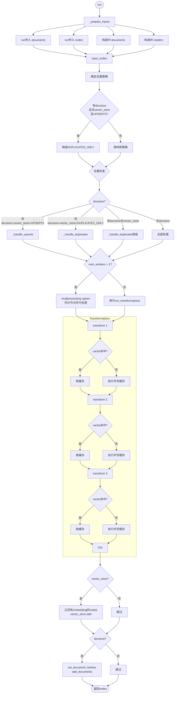

| 版本 | 内容 | 时间                   |
| ---- | ---- | ---------------------- |
| V1   | 新建 | 2026年04月20日17:29:01 |

## 概念定义

数据摄取管道 IngestionPipeline 是基于**转换器（Transformation）** 模式的流水线框架，每个转换器负责一个特定的数据处理任务，数据在管道中依次经过所有转换器，最终输出可直接用于构建索引的增强型节点。

它是 LlamaIndex 中**端到端、可重复、可缓存、可增量、可扩展的数据处理核心组件**，它将 "文档加载→文本分割→元数据提取→嵌入生成→索引构建" 等分散步骤整合为一个统一的流水线，彻底解决了传统 RAG 中数据处理代码混乱、难以维护、无法复用的问题。

```
原始文档 ──→ IngestionPipeline ──→ 带嵌入的 Node 列表 ──→ 存入向量数据库
```

没有管道时，你需要手动写：

```python
# 传统方式（繁琐、无缓存、无法增量）
docs = SimpleDirectoryReader("data/").load_data()
splitter = SentenceSplitter()
nodes = splitter.get_nodes_from_documents(docs)
embed_model = OpenAIEmbedding()
for node in nodes:
    node.embedding = embed_model.get_text_embedding(node.text)
vector_store.add(nodes)
```

有了管道后：

```python
pipeline = IngestionPipeline(
    transformations=[
        SentenceSplitter(chunk_size=512),
        OpenAIEmbedding(),
    ],
    vector_store=vector_store,
)
nodes = pipeline.run(documents=docs)  # 一行搞定
```

在 RAG 全流程中的位置

```
数据源(文档/网页/API)
    ↓
[数据加载器(Reader)] → 生成Document对象
    ↓
[IngestionPipeline]  ← 本文核心
    ↓ 转换器依次执行
    1. 文档清洗
    2. 文本分割 → 生成Node对象
    3. 元数据提取 → 增强Node
    4. 嵌入生成 → 为Node添加向量
    ↓
[索引构建器(Index)] → 生成向量索引
    ↓
[查询引擎(QueryEngine)] → 提供问答能力
```

**核心优势**

- **模块化设计**：所有处理步骤都是独立的转换器，可自由组合和替换
- **可复用性**：同一管道可用于处理不同来源的文档
- **内置缓存**：自动缓存转换结果，避免重复处理相同数据和重复调用 LLM / 嵌入模型
- **异步支持**：原生支持异步处理，大幅提升批量处理速度
- **可观测性**：支持进度条、回调函数和日志记录
- **持久化**：可将管道状态和处理结果持久化到磁盘，支持断点续传
- **去重能力**：集成 DocStore 自动检测和跳过重复文档

## TransformComponent（转换器基类）

所有管道步骤的统一接口，定义在 `llama_index/core/schema.py`：

```python
class TransformComponent(BaseComponent, DispatcherSpanMixin):
    @abstractmethod
    def __call__(self, nodes: Sequence[BaseNode], **kwargs) -> Sequence[BaseNode]:
        """接收 Node 列表，返回转换后的 Node 列表"""
    
    async def acall(self, nodes: Sequence[BaseNode], **kwargs) -> Sequence[BaseNode]:
        return self.__call__(nodes, **kwargs)
```

**核心特征**：

- 输入输出都是 `Sequence[BaseNode]`，天然支持链式调用
- 继承 `BaseComponent`（Pydantic 模型），支持序列化/反序列化
- `DispatcherSpanMixin` 提供链路追踪（Langfuse 等可对接）

**内置转换器分为四大类**：

| 类型           | 含义         | 基类                                | 作用                        | 代表                             |
| -------------- | ------------ | ----------------------------------- | --------------------------- | -------------------------------- |
| **NodeParser** | 节点解析器   | `NodeParser(TransformComponent)`    | Document → Node（切分）     | SentenceSplitter, CodeSplitter   |
| **Embedding**  | 嵌入生成器   | `BaseEmbedding(TransformComponent)` | Node → 带 embedding 的 Node | OpenAIEmbedding, OllamaEmbedding |
| **Extractor**  | 元数据提取器 | `BaseExtractor(TransformComponent)` | 用 LLM 提取元数据           | SummaryExtractor, TitleExtractor |
| **自定义**     | 自定义逻辑   | 直接继承 `TransformComponent`       | 任意转换逻辑                | 过滤、重写、增强                 |

## 内置转换器详解

### NodeParser 类（文档切分）


```python
from llama_index.core.node_parser import (
    SentenceSplitter,       # 按句子切分（最常用）
    TokenTextSplitter,      # 按 token 切分
    CodeSplitter,           # 按代码 AST 切分
    SentenceWindowNodeParser,  # 单句+窗口
    SemanticSplitterNodeParser,  # 语义相似度切分
    HierarchicalNodeParser,    # 多层级切分
    MarkdownNodeParser,     # 按 Markdown 标题切分
    HTMLNodeParser,         # 按 HTML 标签切分
)
```

在管道中的行为：接收 Document 列表，输出切分后的 Node 列表。

### Embedding 类（向量化）

```python
from llama_index.embeddings.openai import OpenAIEmbedding
from llama_index.embeddings.ollama import OllamaEmbedding
```

在管道中的行为：接收 Node 列表，批量调用嵌入模型，将结果赋值给 `node.embedding`，**不改变 Node 数量和顺序**。

### Extractor 类（元数据提取）

```python
from llama_index.core.extractors import (
    SummaryExtractor,
    TitleExtractor,
    KeywordExtractor,
    QuestionsAnsweredExtractor,
)
```

在管道中的行为：接收 Node 列表，用 LLM 为每个 Node 生成元数据并**原地修改** `node.metadata`，返回相同 Node 列表。

## IngestionPipeline 核心流程

### 属性

```python
model_config = ConfigDict(arbitrary_types_allowed=True)
name: str = Field(
    default=DEFAULT_PIPELINE_NAME,
    description="Unique name of the ingestion pipeline",
)
project_name: str = Field(
    default=DEFAULT_PROJECT_NAME, description="Unique name of the project"
)

# 转换器链
transformations: List[TransformComponent] = Field(
    description="Transformations to apply to the data"
)

# 预加载的文档
documents: Optional[Sequence[Document]] = Field(description="Documents to ingest")
# 文档读取器配置
readers: Optional[List[ReaderConfig]] = Field(
    description="Reader to use to read the data"
)
# 向量存储
vector_store: Optional[BasePydanticVectorStore] = Field(
    description="Vector store to use to store the data"
)
# 转换缓存
cache: IngestionCache = Field(
    default_factory=IngestionCache,
    description="Cache to use to store the data",
)
# 文档存储（去重）
docstore: Optional[BaseDocumentStore] = Field(
    default=None,
    description="Document store to use for de-duping with a vector store.",
)
# 去重策略
docstore_strategy: DocstoreStrategy = Field(
    default=DocstoreStrategy.UPSERTS, description="Document de-dup strategy."
)
# 是否禁用缓存
disable_cache: bool = Field(default=False, description="Disable the cache")
```

**不指定 transformations 时的默认值**：

```python
def _get_default_transformations(self):
    return [
        SentenceSplitter(),   # 默认按句子切分
        Settings.embed_model, # 使用全局默认嵌入模型
    ]
```

### run() 方法执行流程



## 去重与增量更新

### DocstoreStrategy

| 策略名称               | 核心逻辑                     | 处理行为                                                 | 适用场景                                                     |
| ---------------------- | ---------------------------- | -------------------------------------------------------- | ------------------------------------------------------------ |
| **UPSERTS**            | **ID 存在性检查**            | 若文档不存在则**新增**；若 ID 存在且内容变化则**更新**。 | 业务数据持续迭代，需要保留最新版本，不希望产生冗余副本。     |
| **DUPLICATES_ONLY**    | **Hash 重复性检查**          | 仅当文档 Hash 已存在时才处理；**完全新文档直接丢弃**。   | 仅需过滤掉在流程中重复产生的垃圾数据，不关心历史全貌。       |
| **UPSERTS_AND_DELETE** | **ID 存在性检查 + 全量同步** | 执行 UPSERTS 逻辑，同时**删除本次流程未出现的旧文档**。  | 对文档库存储空间敏感，需要严格保持文档库与当前输入数据的**一致性**，即 “只保留最新的”。 |

## 自定义转换器

### 方式一：直接继承 TransformComponent

```python
class AdvancedTextCleaner(TransformComponent):
    """高级文本清洗器，去除多余空行、重复内容和敏感信息"""
    
    def __call__(self, nodes: List[BaseNode], **kwargs: Any) -> List[BaseNode]:
        for node in nodes:
            # 去除多余空行
            text = re.sub(r'\n\s*\n', '\n\n', node.text)
            # 去除邮箱地址
            text = re.sub(r'\b[A-Za-z0-9._%+-]+@[A-Za-z0-9.-]+\.[A-Z|a-z]{2,}\b', '[EMAIL]', text)
            # 去除电话号码
            text = re.sub(r'\b\d{3}[-.]?\d{3}[-.]?\d{4}\b', '[PHONE]', text)
            
            node.text = text
        
        return nodes
```

### 方式二：继承 BaseExtractor（LLM 提取元数据）

```python
from llama_index.core.extractors import BaseExtractor
from llama_index.core.schema import BaseNode
from typing import Sequence, List, Dict, Any
from pydantic import Field

class SentimentExtractor(BaseExtractor):
    """用 LLM 分析每个 Node 的情感倾向"""
    llm: Any = Field(description="LLM to use")
    
    async def aextract(self, nodes: Sequence[BaseNode]) -> List[Dict]:
        results = []
        for node in nodes:
            response = await self.llm.acomplete(
                f"分析以下文本的情感倾向，只返回正面/中性/负面：\n{node.text[:200]}"
            )
            results.append({"sentiment": str(response).strip()})
        return results
```

### 方式三：继承 NodeParser（自定义切分逻辑）

```python
from llama_index.core.node_parser import NodeParser
from llama_index.core.schema import BaseNode, TextNode
from typing import Sequence, List, Any

class FixedSizeNodeParser(NodeParser):
    """按固定字符数切分"""
    chunk_size: int = 500
    
    def _parse_nodes(self, nodes: Sequence[BaseNode], show_progress=False, **kwargs) -> List[BaseNode]:
        result = []
        for node in nodes:
            text = node.get_content()
            for i in range(0, len(text), self.chunk_size):
                chunk = text[i:i + self.chunk_size]
                result.append(TextNode(text=chunk, metadata=node.metadata.copy()))
        return result
```

------

## 数据摄取管道的使用

### 简单使用管道

```python
llm = Ollama(model='qwen:0.5b')
embedded_model = OllamaEmbedding(model_name="qwen3-embedding:0.6b",
                                 embed_batch_size=50)
docs = SimpleDirectoryReader(input_files=["../../data/JavaInterview.txt"]).load_data()

# 构造一个数据摄取管道
pipeline = IngestionPipeline(
    transformations=[
        SentenceSplitter(chunk_size=200, chunk_overlap=0),
        TitleExtractor(llm=llm, show_progress=True)
    ]
)

# 运行这个数据摄取管道
nodes = pipeline.run(documents=docs)

print("len:", len(nodes))
for node in nodes:
    print("id:", node.node_id)
    print("metadata:", node.get_metadata_str(MetadataMode.ALL))
    print("content:", node.get_content())
    print("-"*100)
```

### 与索引构建集成

```python
llm = Ollama(model='qwen:0.5b')
embedded_model = OllamaEmbedding(model_name="qwen3-embedding:0.6b",
                                 embed_batch_size=50)

docs = SimpleDirectoryReader(input_files=["../../data/JavaInterview.txt"]).load_data()

# 构造一个向量存储对象用于存储最后输出的Node对象
chroma = chromadb.PersistentClient(path="../../data/chroma_db")
collection = chroma.get_or_create_collection(name="pipeline")
vector_store = ChromaVectorStore(chroma_collection=collection)

pipeline = IngestionPipeline(
    transformations=[
        SentenceSplitter(chunk_size=100, chunk_overlap=10),
        TitleExtractor(llm=llm, show_progress=True),
        embedded_model  # 提供一个嵌入模型用于生成向量
    ],
    vector_store=vector_store  # 提供一个向量存储对象，用于存储最后的Node对象
)
_ = pipeline.run(documents=docs)

index = VectorStoreIndex.from_vector_store(embed_model=embedded_model, vector_store=vector_store)
query_engine = index.as_query_engine(llm=llm)


ret = query_engine.query("Java的垃圾回收器?")
# Response 对象不能直接 json.dumps，需要提取属性
print("回答:", ret.response)
print("来源节点数:", len(ret.source_nodes))
for i, src in enumerate(ret.source_nodes):
    print(f"  来源{i}: score={src.score:.4f}, text={src.node.get_content()[:100]}...")
```

*输出*

```
回答: Java的垃圾回收器是在运行时自动执行的一种清理算法。它会检查堆栈中的对象，并将那些不再使用的对象移除堆栈，从而实现垃圾回收的功能。
来源节点数: 2
  来源0: score=0.4295, text=答案：核心线程数、最大线程数、阻塞队列、拒绝策略、空闲线程存活时间。...
  来源1: score=0.4274, text=答案：核心线程数、最大线程数、阻塞队列、拒绝策略、空闲线程存活时间。...
```

### 高级特性

#### 特性 1：缓存机制

IngestionPipeline 内置了强大的缓存机制，会为每个（输入节点 + 转换步骤）的组合计算哈希值，并将结果缓存起来。当再次运行管道处理相同数据时，会直接从缓存中读取结果，大幅节省时间和 API 调用成本。

```python
from llama_index.core.ingestion import IngestionCache
from llama_index.storage.kvstore.redis import RedisKVStore

# 本地缓存（默认）
local_cache = IngestionCache()

# Redis缓存（适合分布式环境）
redis_cache = IngestionCache(
    cache=RedisKVStore.from_host_and_port(host="localhost", port=6379),
    collection="ingestion_cache"
)

# 创建带缓存的管道
pipeline = IngestionPipeline(
    transformations=transformations,
    cache=redis_cache
)
```

#### 特性 2：文档去重

通过集成 DocStore，管道可以自动检测和跳过重复文档：

```python
from llama_index.core.storage.docstore import SimpleDocumentStore

docstore = SimpleDocumentStore()

pipeline = IngestionPipeline(
    transformations=transformations,
    docstore=docstore,
    docstore_strategy="upserts"  # 只处理新增或更新的文档
)

# 第一次运行：处理所有文档
pipeline.run(documents=documents)

# 第二次运行：只处理新增或更新的文档
pipeline.run(documents=documents + new_documents)
```

例如：

```
第一次运行:  run(docs=[a.txt, b.txt])
  → DocStore 中无记录 → 全部处理
  → 存储: {a.txt: hash_abc, b.txt: hash_def}

第二次运行:  run(docs=[a.txt, b.txt])  ← 内容未变
  → a.txt 的 hash 匹配 → 跳过
  → b.txt 的 hash 匹配 → 跳过

第三次运行:  run(docs=[a.txt])  ← a.txt 内容修改了
  → a.txt 的 hash 不匹配 → 删除旧版本 → 重新处理 → 更新 hash
```

和 IngestionCache 的区别

|              | DocStore                   | IngestionCache               |
| ------------ | -------------------------- | ---------------------------- |
| **判断时机** | 转换前（决定是否处理）     | 转换中（是否跳过某步计算）   |
| **判断依据** | 文档内容 hash              | 输入内容 + 转换器配置的 hash |
| **典型场景** | 增量更新：文件改了才重处理 | 避免重复的切分/嵌入计算      |
| **粒度**     | 文档级                     | 每个转换步骤级               |

可以理解为：**DocStore 决定是否要跑，IngestionCache 决定跑了多少可以跳**。

#### 特性 3：异步处理

使用 `arun` 方法进行异步处理，大幅提升批量处理速度：

```python
import asyncio

async def main():
    nodes = await pipeline.arun(documents=documents)
    print(f"异步处理完成，生成 {len(nodes)} 个节点")

asyncio.run(main())
```

#### 特性 4：管道持久化

可以将管道状态（包括缓存和文档存储）持久化到磁盘，支持断点续传：

```python
# 持久化管道
pipeline.persist("./pipeline_storage")

# 加载已保存的管道
loaded_pipeline = IngestionPipeline.load("./pipeline_storage")

# 继续处理
loaded_pipeline.run(documents=new_documents)
```

#### 特性 5：并行处理

对于不依赖 LLM 的转换器（如文本分割、清洗），可以启用多线程并行处理：

```python
pipeline = IngestionPipeline(
    transformations=transformations,
    num_workers=4  # 并发处理的worker数量
)
```

------

## 数据摄取管道架构总结


**核心价值**：

1. **统一接口**：所有转换器共享 `TransformComponent` 接口，可自由组合
2. **自动缓存**：相同输入+相同转换器配置不会重复计算
3. **增量更新**：基于 docstore 的 hash 比较，只处理变化部分
4. **端到端持久化**：管道状态、缓存、向量库均可落盘，重启后恢复
