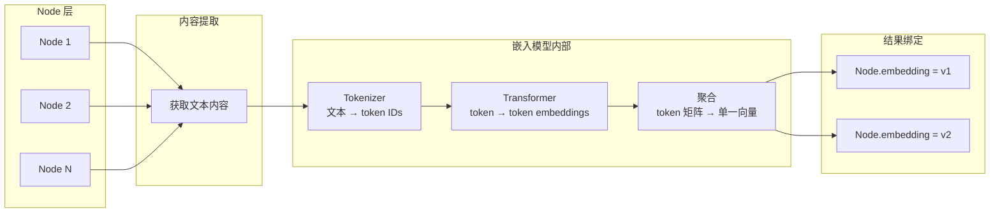
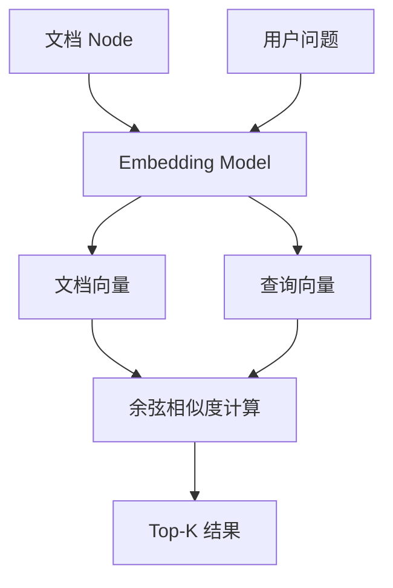
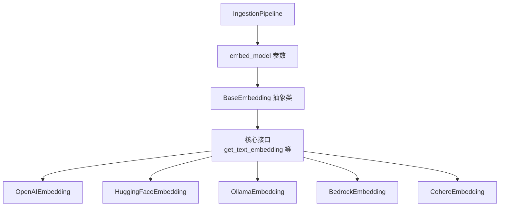

| 版本 | 内容 | 时间                   |
| ---- | ---- | ---------------------- |
| V1   | 新建 | 2026年04月22日00:20:35 |

理解嵌入与向量

## 嵌入的本质：语义空间的坐标映射

嵌入的本质是将文本转化为携带语义的多维浮点数，称为向量（Vector）。与"一个词对应一个数字"的简单映射不同，向量能捕获文本的语义特征。语义相近的文本，其向量在数学空间中也会彼此靠近——即使原文措辞完全不同。这一特性使得语义检索成为可能：给定用户问题，系统可以找出语义最接近的 Node，而非仅仅依赖字面关键词匹配。

判断两个向量语义接近程度的常用工具是**余弦相似度**——衡量两个向量方向一致性的指标，取值范围 -1 到 1，越接近 1 代表方向越一致。

向量的生成依赖嵌入模型。不同模型在向量维度、推理性能、调用成本等方面各有差异，因此需要先做好模型选型。嵌入模型既可以通过 API 远程调用（如 OpenAI），也可以本地部署运行（如 TEI 方案）。**核心约束是：入库建索引时用的嵌入模型，必须与查询检索时完全一致**，否则向量不在同一空间，无法比较。

在 LlamaIndex 框架下，开发者通常无需手动编写向量生成代码——无论是通过 `IngestionPipeline` 还是其他入口，向量生成大多由框架自动处理。

## LlamaIndex 中嵌入的完整链路



从用户调用 `pipeline.run(documents)` 到获得向量，LlamaIndex 实际执行了以下步骤：

1. **内容提取**：从 Node 对象中获取文本内容
2. **模型推理**：文本经 Tokenizer 编码后送入 Transformer 编码器，输出 token 级 embedding 矩阵
3. **聚合为单一向量**：将 token 级矩阵压缩为一个向量
4. **结果绑定**：向量绑定到 Node 的 `embedding` 属性

脱离 `IngestionPipeline` 时，可以直接调用嵌入模型获取向量列表：

```python
# 构造几个模拟的 Node 对象
nodes = [
    TextNode(text="Python 是一门广泛使用的高级编程语言，支持面向对象和函数式编程。"),
    TextNode(text="机器学习是人工智能的一个分支，它使用算法和统计模型让计算机从数据中学习。"),
    TextNode(text="向量数据库专门用于存储和检索高维向量数据，常用于相似性搜索场景。"),
]

embed_model = OllamaEmbedding(model_name="qwen3-embedding:0.6b")

# 调用模型接口生成向量，此处使用批量接口
embeddings = embed_model.get_text_embedding_batch(
    [node.get_content(metadata_mode=MetadataMode.EMBED) for node in nodes],
    show_progress=True,
)

# 把生成的向量绑定到 Node 对象
for node, embedding in zip(nodes, embeddings):
    node.embedding = embedding
    print(node.model_dump_json())
```

## 查询侧与入库侧：必须用同一个模型

RAG 检索时，**用户问题也需要经过嵌入**——用与入库时完全相同的模型生成查询向量，才能在同一语义空间中比较。



对同一段文本，不同模型的输出向量处于不同的向量空间，无法直接比较。因此入库侧和查询侧必须使用同一个模型。

## LlamaIndex 的嵌入架构




LlamaIndex 通过 `BaseEmbedding` 抽象类统一所有嵌入模型的接口。新项目中替换底层模型只需更换 `embed_model` 实例；但**同一个已完成入库的向量库不应中途更换嵌入模型**，否则查询向量与存量向量无法在同一空间比较。

## 关键工程注意

1. **模型切换导致存量向量失效**：嵌入模型选定后，向量空间即被冻结。更换模型会使已有向量全部失效——同一文本在新模型下映射到不同坐标，无法直接比较。换模型意味着对已入库的全部文档重新嵌入
2. **文本长度限制**：文本长度不能超过模型上下文窗口，应在分割阶段控制 chunk 大小，或选择更大窗口模型
3. **维度不统一**：不同模型输出维度不同，部分模型支持动态维度裁剪。不同模型的向量不可混用

## 总结

**嵌入阶段的决策代价较高**：更换嵌入模型需要对已入库的全部文档重新嵌入。选型前应进行小规模试跑验证效果，避免大规模入库后才发现嵌入效果不理想。

向量生成之后，下一步便是将这些高维向量高效地存储与检索——这正是向量存储（Vector Store）要解决的问题。
