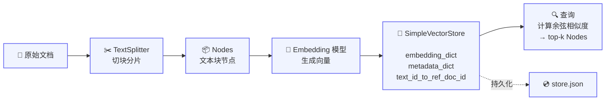

| 版本 | 内容 | 时间                   |
| ---- | ---- | ---------------------- |
| V1   | 新建 | 2026年04月22日14:26:37 |

## 什么是向量存储

### 核心概念

在 RAG 架构中，文本通过 Embedding 模型被转换为固定维度的浮点数向量。**向量存储**是用于存储和检索这些高维向量的数据系统，承担三项职责：

| 职责     | 说明                                          |
| -------- | --------------------------------------------- |
| **存储** | 保存 embedding 向量及其关联的文本节点、元数据 |
| **检索** | 给定查询向量，找出向量空间中最相似的向量      |
| **过滤** | 支持基于元数据的筛选                          |

### Embedding 向量

Embedding 是通过模型将文本映射到连续向量空间的结果。常见维度包括 384、768、1024、1536 等。语义相近的文本在向量空间中距离更近。

### 相似度度量

| 度量            | 说明                             | 适用场景       |
| --------------- | -------------------------------- | -------------- |
| **余弦相似度**  | 衡量向量方向相似性，值域 [-1, 1] | NLP、文本搜索  |
| **L2 欧氏距离** | 衡量向量间绝对距离               | 图像、空间数据 |
| **内积**        | 同时考虑方向和幅度               | 推荐系统       |

## LlamaIndex 的简单向量存储（SimpleVectorStore）

### 概述

`SimpleVectorStore` 是 LlamaIndex 内置的基于内存的默认向量存储。

`SimpleVectorStoreData` 是一个 `dataclass`，内部仅包含三个字典：

| 字段                    | 类型                     | 用途                     |
| ----------------------- | ------------------------ | ------------------------ |
| `embedding_dict`        | `Dict[str, List[float]]` | node_id → embedding 向量 |
| `text_id_to_ref_doc_id` | `Dict[str, str]`         | 文本块 ID → 父文档 ID    |
| `metadata_dict`         | `Dict[str, Dict]`        | node_id → 元数据         |

**整体流程：**




**持久化**：将 `SimpleVectorStoreData` 序列化为 JSON 写入磁盘，可通过 `from_persist_dir()` 恢复。

### 向量存储

```python
# 构造几个模拟的 Document 对象
documents = [
    Document(
        text="Python 是一门广泛使用的高级编程语言，支持面向对象和函数式编程范式。",
        metadata={"category": "编程语言", "topic": "Python"},
    ),
    Document(
        text="机器学习是人工智能的一个分支，它使用算法和统计模型让计算机从数据中学习规律。",
        metadata={"category": "人工智能", "topic": "机器学习"},
    ),
    Document(
        text="向量数据库专门用于存储和检索高维向量数据，常用于语义搜索和推荐系统。",
        metadata={"category": "数据库", "topic": "向量检索"},
    ),
]

embed_model = OllamaEmbedding(model_name="qwen3-embedding:0.6b", embed_batch_size=50)
splitter = SentenceSplitter(chunk_size=50, chunk_overlap=10)
nodes = splitter.get_nodes_from_documents(documents=documents, show_progress=True)
nodes = embed_model(nodes)

store = SimpleVectorStore()
store.add(nodes)

print(store.model_dump_json())
```

*输出*


可以看到，SimpleVectorStore 类型的向量库除了存储生成的各个 Node 对象的嵌入向量信息，还存储了各个 Node 对象的 id 和原始的 Document 对象的 id 的对应关系，以及各个 Node 对象的元数据信息。

### 语义检索

在 Node 对象的嵌入向量被存储与构造索引后，就可以使用基于向量的语义检索来找到与特定问题向量最相似的 Node 信息：

```python
# 构造几个模拟的 Document 对象
documents = [
    Document(
        text="Python 是一门广泛使用的高级编程语言，支持面向对象和函数式编程范式。",
        metadata={"category": "编程语言", "topic": "Python"},
    ),
    Document(
        text="机器学习是人工智能的一个分支，它使用算法和统计模型让计算机从数据中学习规律。",
        metadata={"category": "人工智能", "topic": "机器学习"},
    ),
    Document(
        text="向量数据库专门用于存储和检索高维向量数据，常用于语义搜索和推荐系统。",
        metadata={"category": "数据库", "topic": "向量检索"},
    ),
]

embed_model = OllamaEmbedding(model_name="qwen3-embedding:0.6b", embed_batch_size=50)
splitter = SentenceSplitter(chunk_size=50, chunk_overlap=10)
nodes = splitter.get_nodes_from_documents(documents=documents, show_progress=True)
# 显式生成向量并绑定到节点
embeddings = embed_model.get_text_embedding_batch(
    [node.get_content(metadata_mode=MetadataMode.EMBED) for node in nodes],
    show_progress=True,
)
for node, embedding in zip(nodes, embeddings):
    node.embedding = embedding

simple_vectorstore = SimpleVectorStore()
simple_vectorstore.add(nodes)

# 查询：先将查询文本转为向量
query_embedding = embed_model.get_text_embedding("Python是什么")
query_result = simple_vectorstore.query(
    VectorStoreQuery(query_embedding=query_embedding, similarity_top_k=1),
)

print(query_result)

for node in nodes:
    if node.node_id == query_result.ids[0]:
        print(node.get_content())
```

*输出*：

```
VectorStoreQueryResult(nodes=None, similarities=[np.float64(0.6788160457585779)], ids=['4ecf52b0-78c2-4032-bb59-c07026dd30a6'])
Python 是一门广泛使用的高级编程语言，支持面向对象和函数式编程范式。
```

可以看到 `SimpleVectorStore` 的查询结果 `VectorStoreQueryResult` 只包含**节点 ID** 和**相似度分值**，不直接返回节点内容。`nodes=None` 说明它本身只存储向量和 ID 映射，不保存节点完整数据。

### 向量的持久化存储

可以通过 SimpleVectorStore 提供的 api 来进行持久化和恢复数据。

```python
# ... 省略 nodes 的构建

simple_vectorstore = SimpleVectorStore()
simple_vectorstore.add(nodes)

# 存储
simple_vectorstore.persist(persist_path="./storage/vector_store.json")

# 加载
simple_vectorstore_load = SimpleVectorStore.from_persist_path(persist_path="./storage/vector_store.json")
```


### SimpleVectorStore优缺点

| 优点                   | 缺点                                   |
| ---------------------- | -------------------------------------- |
| 零外部依赖，开箱即用   | 检索为暴力搜索，向量数量多时性能下降   |
| 内存驻留，小数据读写快 | 全部数据加载到内存，受 RAM 限制        |
| 支持 JSON 持久化       | 无分布式能力                           |
| 适合原型开发           | 不支持高级检索（混合搜索、复杂过滤等） |

### SimpleVectorStore适用场景

- **适合**：快速原型验证、小规模数据、本地离线场景
- **不适合**：大规模生产部署、需要分布式、需要高级检索功能

## 第三方向量存储

### VectorStore 协议

LlamaIndex 在 [types.py](https://github.com/run-llama/llama_index/blob/main/llama-index-core/llama_index/core/vector_stores/types.py) 中定义了 `VectorStore` 协议（Python Protocol）。所有第三方集成都遵循此接口。


### 支持的第三方向量存储

LlamaIndex 通过独立的 `llama-index-vector-stores-*` 包提供向量存储集成。以下按类别列出已确认的集成：

**专用向量数据库**：

| 向量存储 | PyPI 包名                            | 说明                              |
| -------- | ------------------------------------ | --------------------------------- |
| Qdrant   | `llama-index-vector-stores-qdrant`   | Rust 编写，开源，支持本地和云托管 |
| Weaviate | `llama-index-vector-stores-weaviate` | Go 编写，AI 原生，开源            |
| Milvus   | `llama-index-vector-stores-milvus`   | 分布式云原生，Apache 2.0 开源     |
| Pinecone | `llama-index-vector-stores-pinecone` | 全托管 SaaS，非开源               |
| Chroma   | `llama-index-vector-stores-chroma`   | Python 编写，轻量嵌入式           |

**嵌入式 / 库**：

| 向量存储 | PyPI 包名                          | 说明                          |
| -------- | ---------------------------------- | ----------------------------- |
| FAISS    | `llama-index-vector-stores-faiss`  | Meta 出品，C++ 编写，仅本地库 |
| DuckDB   | `llama-index-vector-stores-duckdb` | 嵌入式分析数据库              |

**传统数据库扩展**：

| 向量存储              | PyPI 包名                                 | 说明                      |
| --------------------- | ----------------------------------------- | ------------------------- |
| PostgreSQL (pgvector) | 内置于 llama-index-core                   | PostgreSQL 向量扩展       |
| Elasticsearch         | `llama-index-vector-stores-elasticsearch` | 搜索引擎的向量搜索        |
| OpenSearch            | `llama-index-vector-stores-opensearch`    | AWS 开源搜索引擎          |
| Redis                 | `llama-index-vector-stores-redis`         | 内存数据库的向量搜索      |
| MongoDB Atlas         | `llama-index-vector-stores-mongodb`       | MongoDB 向量搜索          |
| Cassandra             | `llama-index-vector-stores-cassandra`     | Apache Cassandra 向量支持 |
| Neo4j                 | `llama-index-vector-stores-neo4jvector`   | 图数据库的向量搜索        |

### 核心方案对比

以下对比仅基于各方案的公开文档和通用知识：

| 维度           | Qdrant  | Weaviate | Milvus  | Pinecone  | Chroma | FAISS  | pgvector |
| -------------- | ------- | -------- | ------- | --------- | ------ | ------ | -------- |
| **开源**       | 是      | 是       | 是      | 否        | 是     | 是     | 是       |
| **语言**       | Rust    | Go       | Go/C++  | 闭源 SaaS | Python | C++    | PG 扩展  |
| **部署方式**   | 本地/云 | 本地/云  | 本地/云 | 仅云      | 嵌入式 | 本地库 | PG 扩展  |
| **分布式**     | 是      | 是       | 是      | 是        | 否     | 否     | 是(PG)   |
| **GPU 加速**   | 否      | 否       | 是      | 否        | 否     | 是     | 否       |
| **运维复杂度** | 中      | 中       | 高      | 无        | 低     | 高     | 低       |

### 选择建议

| 场景               | 推荐方案                           |
| ------------------ | ---------------------------------- |
| 快速原型 / 实验    | SimpleVectorStore（默认）或 Chroma |
| 小规模本地项目     | Chroma 或 FAISS                    |
| 已有 PostgreSQL    | pgvector（内置支持）               |
| 追求性能的生产环境 | Qdrant                             |
| 大规模分布式       | Milvus                             |
| 零运维托管         | Pinecone                           |
| 极致性能调优       | FAISS                              |

**选择路径**：

1. 先用 `SimpleVectorStore` 跑通流程（零配置）
2. 数据量增长 → 切换到 Chroma（最小改动）
3. 需要生产级性能和分布式 → Qdrant 或 Milvus
4. 已有 PG 基础设施 → pgvector
