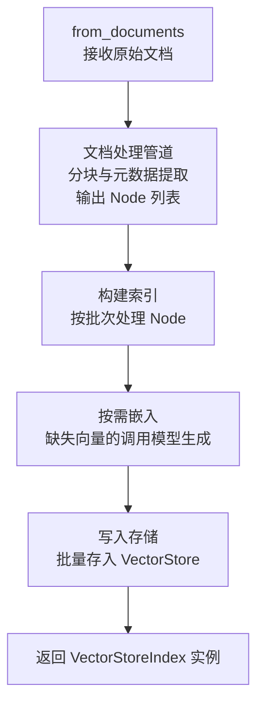
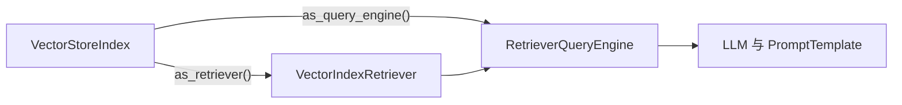

| 版本 | 内容 | 时间                   |
| ---- | ---- | ---------------------- |
| V1   | 新建 | 2026年04月23日16:26:29 |

## 引言

在 LlamaIndex 框架中，向量存储索引（VectorStoreIndex）是连接文档数据与向量检索的核心组件。ChromaDB 作为专为 LLM 应用设计的嵌入式向量数据库，与 LlamaIndex 的集成提供了简洁高效的向量存储和检索能力。本文将从四个维度系统分析基于 ChromaDB 的向量存储索引构建和使用机制。

------

## 向量存储构造向量存储索引对象

通过已初始化的 ChromaDB 向量存储实例创建索引，是 LlamaIndex 中最常用的方式之一。该方式适用于已有持久化数据或需要复用已有 Collection 的场景。

```python
# 构造几个模拟的 Document 对象
documents = [
    Document(text="Python 是一门广泛使用的高级编程语言，支持面向对象和函数式编程范式。",metadata={"category": "编程语言", "topic": "Python"},),
    Document(text="机器学习是人工智能的一个分支，它使用算法和统计模型让计算机从数据中学习规律。",metadata={"category": "人工智能", "topic": "机器学习"},),
    Document(text="向量数据库专门用于存储和检索高维向量数据，常用于语义搜索和推荐系统。", metadata={"category": "数据库", "topic": "向量检索"},),
]

# 使用持久化客户端
chroma_client = chromadb.PersistentClient(path="./chroma_storage/chroma_db")
collection = chroma_client.get_or_create_collection("index_collection_test")
vector_store = ChromaVectorStore(chroma_collection=collection)

llm = Ollama(model='qwen:0.5b')
embed_model = OllamaEmbedding(model_name="qwen3-embedding:0.6b", embed_batch_size=50)
Settings.embed_model = embed_model
Settings.llm = llm

# 文本分割
splitter = SentenceSplitter(chunk_size=50, chunk_overlap=10)
nodes = splitter.get_nodes_from_documents(documents=documents, show_progress=True)
# 嵌入向量
embeddings = embed_model.get_text_embedding_batch(
    [node.get_content(metadata_mode=MetadataMode.EMBED) for node in nodes],
    show_progress=True,
)
for node, embedding in zip(nodes, embeddings):
    node.embedding = embedding

# 存储到向量库中
vector_store.add(nodes)
# 构造基于向量存储的向量存储索引对象
index = VectorStoreIndex.from_vector_store(vector_store)

# 测试
query_engine = index.as_query_engine()
resp = query_engine.query("什么是向量检索")

print(resp)
```

VectorStoreIndex组件借助引用的向量存储对象进行基于向量的语义检索（调用 query 方法） ，根据返回结果获得或重建出相关的 Node 对象列表，然后把这些 Node 对象的内容作为大模型输入的上下文进行组装。

通过 langfuse 可以看到提供给大模型的提示词：


## Node 列表构造向量存储索引对象

```python
llm = Ollama(model='qwen:0.5b')
    embed_model = OllamaEmbedding(model_name="qwen3-embedding:0.6b", embed_batch_size=50)
    Settings.embed_model = embed_model
    Settings.llm = llm

    # 构造几个模拟的 Document 对象
    documents = [
        Document(text="Python 是一门广泛使用的高级编程语言，支持面向对象和函数式编程范式。",metadata={"category": "编程语言", "topic": "Python"},),
        Document(text="机器学习是人工智能的一个分支，它使用算法和统计模型让计算机从数据中学习规律。",metadata={"category": "人工智能", "topic": "机器学习"},),
        Document(text="向量数据库专门用于存储和检索高维向量数据，常用于语义搜索和推荐系统。", metadata={"category": "数据库", "topic": "向量检索"},),
    ]

    # 文本分割
    splitter = SentenceSplitter(chunk_size=50, chunk_overlap=10)
    nodes = splitter.get_nodes_from_documents(documents=documents, show_progress=True)
    index = VectorStoreIndex(nodes=nodes, show_progress=True)

    pprint.pprint(index.__dict__)

    # 测试
    query_engine = index.as_query_engine()
    resp = query_engine.query("什么是向量检索")

    print(resp)
```

构造向量存储索引对象时，系统全自动执行"**检测向量是否存在 → 不存在则生成 → 存储**"闭环：自动检测 Node 是否缺失向量，若缺失则调用默认嵌入模型生成，随后自动写入向量库，最终返回就绪的索引对象。用户无需手动干预。

我们这里并没有指定向量存储，上面的 `pprint.pprint(index.__dict__)` 代码把向量存储索引对象的属性打印出来了，如下：


从截图中看，使用的向量存储是 SimpleVectorStore 类型的（这意味着如果不显式设置，那么向量存储索引会自动使用 SimpleVectorStore作为底层的向量存储类型） 。

可以通过 StorageContext 指定向量存储类型

```python
# 使用持久化客户端
chroma_client = chromadb.PersistentClient(path="./chroma_storage/chroma_db")
collection = chroma_client.get_or_create_collection("index_collection_test4")
vector_store = ChromaVectorStore(chroma_collection=collection)

storage_context = StorageContext.from_defaults(vector_store=vector_store)
index = VectorStoreIndex(nodes=nodes, storage_context=storage_context, show_progress=True)
```

## 文档直接构造向量存储索引对象

从原始文档直接创建索引是最常见的场景，LlamaIndex 内部自动完成文档加载、分块、向量化和存储的完整流程。

```python
llm = Ollama(model='qwen:0.5b')
embed_model = OllamaEmbedding(model_name="qwen3-embedding:0.6b", embed_batch_size=50)
Settings.embed_model = embed_model
Settings.llm = llm

# 构造几个模拟的 Document 对象
documents = [
    Document(text="乐乐是一只快乐的小猫，他是一只金渐层，现在已经两岁了，还没有做绝育",
             metadata={"category": "动物", "topic": "cat"}, ),
    Document(text="浩浩是一只很惨很惨的乌龟，他每次都舔而不得，长的也不难看，但是被甩的次数太多了，还是个 ATMer",
             metadata={"category": " 动物", "topic": "乌龟"}, ),
]

vector_index = VectorStoreIndex.from_documents(documents=documents, show_progress=True)
query_engine = vector_index.as_query_engine()
resp = query_engine.query("乐乐是什么")

print(resp)
```

*输出*

```
乐乐是一只快乐的小猫。
```

虽然高度抽象的上层接口大大简化了向量存储索引对象的构造过程，但是很多时候我们需要对底层细节进行个性化设置，比如模型、底层向量存储、文本分割器、元数据抽取器等，那么如何设置呢？

**1）模型**：通过全局的 Setting 组件设置

```python
llm = Ollama(model='qwen:0.5b')
embed_model = OllamaEmbedding(model_name="qwen3-embedding:0.6b", embed_batch_size=50)
Settings.embed_model = embed_model
Settings.llm = llm
```

**2）底层向量存储**：使用 storage_context 参数自行设置需要使用的底层向量存储

```python
# 使用持久化客户端
chroma_client = chromadb.PersistentClient(path="./chroma_storage/chroma_db")
collection = chroma_client.get_or_create_collection("index_collection_test4")
vector_store = ChromaVectorStore(chroma_collection=collection)


vector_index = VectorStoreIndex.from_documents(documents=documents,
	show_progress=True,storage_context=StorageContext.from_defaults(vector_store=vector_store))
```

**3）文本分割器和元数据提取器**：使用 transformations 参数指定。

```python

# 设置文本分割器和元数据提取器的 标题提取器
splitter = SentenceSplitter(chunk_size=50, chunk_overlap=10)
extractor = TitleExtractor()

vector_index = VectorStoreIndex.from_documents(documents=documents,
                                               show_progress=True,
                                               storage_context=StorageContext.from_defaults(vector_store=vector_store),
                                               transformations=[splitter, extractor])
```

通过下面的 langfuse 链路图可以看到有 4 个阶段，分别是文本分割、标题提取、向量嵌入、llm 查询。


### 3.3 文档分块策略

LlamaIndex 提供多种分块策略：

| 分块器                     | 说明              | 适用场景       |
| -------------------------- | ----------------- | -------------- |
| SentenceSplitter           | 按句子边界分割    | 通用文本       |
| TokenTextSplitter          | 按 token 数量分割 | 精确控制块大小 |
| SemanticSplitterNodeParser | 语义分割          | 保持语义完整性 |
| MarkdownNodeParser         | Markdown 专用     | Markdown 文档  |
| HTMLNodeParser             | HTML 专用         | HTML 文档      |

**SentenceSplitter 工作原理**：

```
100%
```

### 3.4 内部工作流程

```python
# VectorStoreIndex.from_documents() 内部流程简化
@classmethod
def from_documents(
    cls,
    documents: List[Document],
    storage_context: StorageContext,
    embed_model: BaseEmbedding,
    node_parser: NodeParser,
    **kwargs
) -> "VectorStoreIndex":
    # 1. 文档分块
    nodes = node_parser.get_nodes_from_documents(documents)
    
    # 2. 批量生成向量
    embeddings = embed_model.get_text_embedding_batch(
        [node.get_content() for node in nodes],
        show_progress=True
    )
    
    # 3. 将向量附加到节点
    for node, embedding in zip(nodes, embeddings):
        node.embedding = embedding
    
    # 4. 存储到向量存储
    storage_context.vector_store.add(nodes)
    
    # 5. 创建并返回索引
    return cls(nodes=nodes, storage_context=storage_context, **kwargs)
```

### 3.5 嵌入模型调用流程

```python
# 嵌入模型批量处理流程
def get_text_embedding_batch(
    self, 
    texts: List[str], 
    embed_batch_size: int = 32
) -> List[List[float]]:
    all_embeddings = []
    
    # 分批处理，避免内存溢出
    for i in range(0, len(texts), embed_batch_size):
        batch = texts[i:i + embed_batch_size]
        
        # 调用模型生成向量
        batch_embeddings = self._get_embeddings(batch)
        all_embeddings.extend(batch_embeddings)
    
    return all_embeddings
```

------

## 向量存储索引对象深度解析

VectorStoreIndex 的核心属性：

| 属性            | 类型              | 说明                               |
| --------------- | ----------------- | ---------------------------------- |
| storage_context | StorageContext    | 存储上下文，包含 vector_store 引用 |
| docstore        | BaseDocumentStore | 文档存储，管理文档和节点的映射     |
| index_store     | BaseIndexStore    | 索引存储，管理索引元数据           |
| embed_model     | BaseEmbedding     | 嵌入模型，用于查询向量化           |

下图是 from_documents 方法的核心工作过程



## 总结

LlamaIndex 基于 ChromaDB 的向量存储索引提供了三种主要的构建方式：

1. **向量存储构造**：适用于已有持久化数据或复用 Collection 的场景
2. **Node 列表构造**：适用于需要精细控制节点内容的场景
3. **文档直接构造**：适用于端到端的完整流程，自动化程度最高

三种方式各有适用场景，开发者可根据实际需求选择。在实际应用中，应重点关注分块策略、嵌入模型选择、HNSW 参数调优和元数据过滤等关键环节，以实现最佳的检索效果和性能表现。


Storage_Context（存储上下文）虚线框内的四个组件构成了**完整的存储层抽象**

| 组件             | 职责                   | 在向量索引中的角色                                           |
| ---------------- | ---------------------- | ------------------------------------------------------------ |
| **vector_store** | 存储向量嵌入及关联数据 | **核心**，ChromaDB/Qdrant/FAISS 等，负责向量相似度检索       |
| **docstore**     | 存储 Node 的完整内容   | 当 `vector_store.stores_text=False` 时，节点内容存在这里；ChromaDB 为 `True` 时基本不用 |
| **index_store**  | 存储索引结构数据       | 记录 Node ID 的集合映射关系                                  |
| **graph_store**  | 存储图结构数据         | 向量索引通常不使用，仅在知识图谱场景中需要                   |

内部字段

| 字段                  | 说明                                                         |
| --------------------- | ------------------------------------------------------------ |
| **`_index_struct`**   | 索引内部数据结构，对于向量索引是 `IndexDict`，存储 Node ID 集合 |
| **`_embed_model`**    | 嵌入模型引用，查询时将用户问题转为向量                       |
| **`transformations`** | 数据转换管道，包含分块器、元数据提取器等                     |

两条查询路径



| 方法                | 返回对象               | 职责                                                         |
| ------------------- | ---------------------- | ------------------------------------------------------------ |
| `as_retriever()`    | `VectorIndexRetriever` | **仅检索**：将查询转为向量，在向量存储中找 Top-K 相似节点，返回节点列表 |
| `as_query_engine()` | `RetrieverQueryEngine` | **检索 + 回答**：内部组合 Retriever 和 LLM，检索到节点后送入 LLM 生成最终回答 |

查询过程


